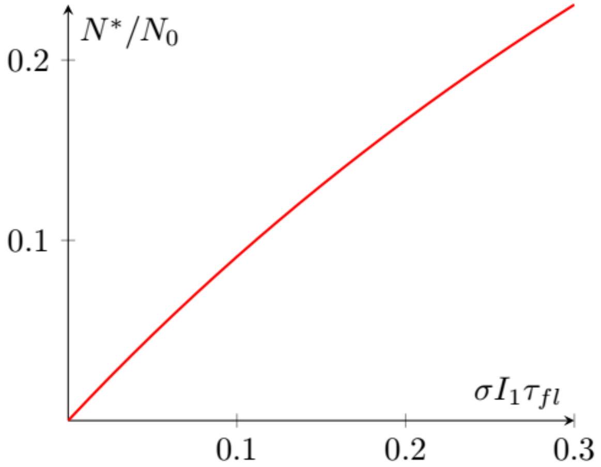
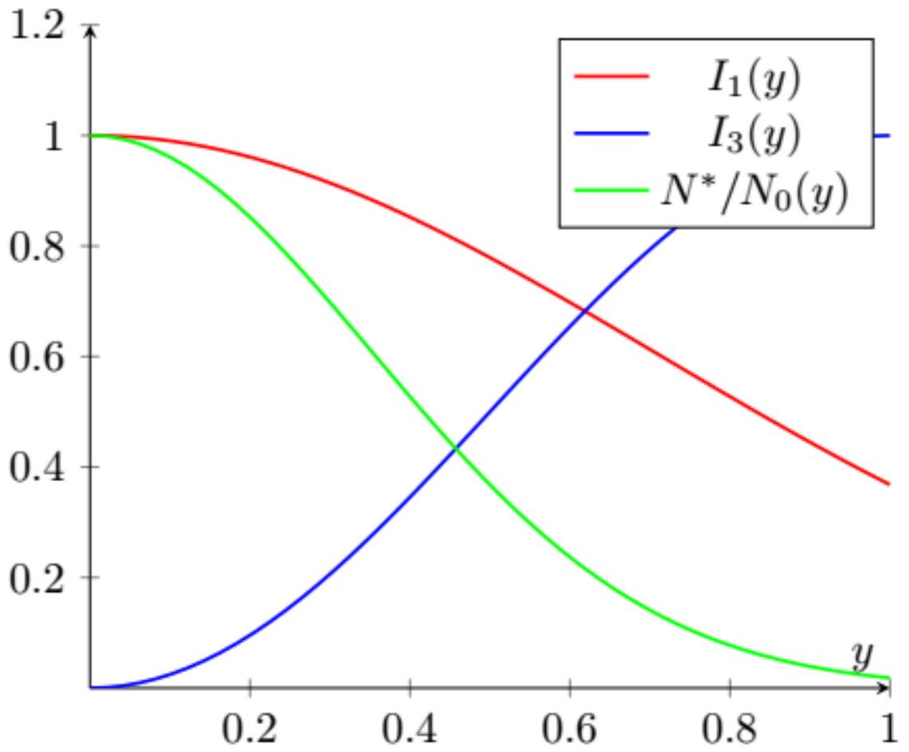
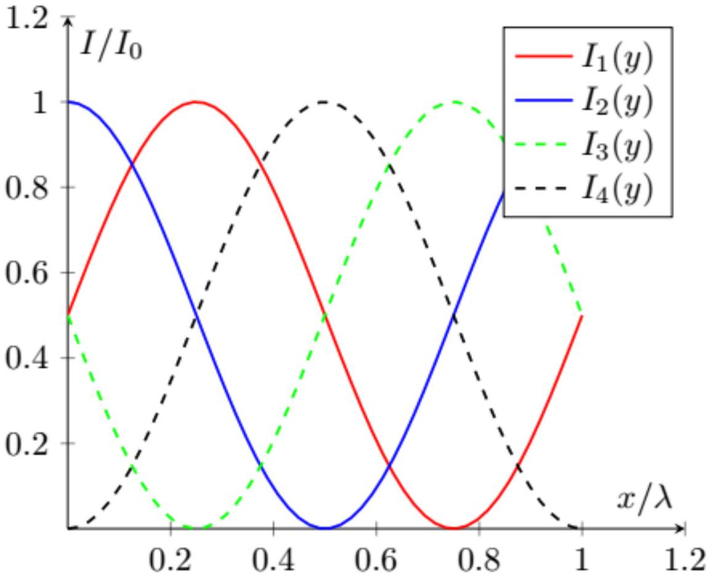

А1 ${ } ^ { 0.70 }$ Выразите предел разрешения $\Delta _ { 0 } = A B$ через $\lambda$ (длина волны света в вакууме), $D , n , n ^ { \prime }$ и $\sin u$ (угол $u$ отмечен на рис. 2). При выводе пользуйтесь параксиальным приближением.

Из-за укорочения длины волны в веществе

$$
D = 1.22 \sin \phi \frac { \lambda } { n ^ { \prime } } ,
$$

при этом рассмотрение преломления луча, проходящего через центр линзы дает уравнение

$$
\frac { A B } { x } = \frac { A ^ { \prime } B ^ { \prime } } { x ^ { \prime } } n ^ { \prime } .
$$

В итоге

$$
\Delta _ { 0 } = A B = \frac { x n ^ { \prime } } { x ^ { \prime } n } A ^ { \prime } B ^ { \prime } = 1.22 \frac { \lambda x } { n D } = \frac { 0.61 \lambda } { n \sin u }
$$

Ответ:

$$
\Delta _ { 0 } = \frac { 0.61 \lambda } { n \sin u }
$$

А2 ${ } ^ { 0.30 }$ Изначально система находится в вакууме $n = n ^ { \prime } = 1$. Экспериментатор может наполнить пространство слева или справа от линзы (рис. 2) маслом. Куда нужно добавить масло, чтобы улучшить разрешение?
а) со стороны образца; б) со стороны изображения

На предел разрешения влияет $n$ со стороны образца, поэтому правильный ответ a)

Ответ: а) со стороны образца

В1 ${ } ^ { 0.50 }$ Пусть на ансамбль из $N _ { 0 } \gg 1$, первоначально находящихся в состоянии $S$, начинает падать излучение с интенсивностью $I _ { 1 }$ и длиной волны $\lambda _ { 1 }$. Сколько в среднем молекул $N ^ { * }$ будет находиться в состоянии $S ^ { * }$, когда система достигнет динамического равновесия?

Приравняем вероятности переходов:

$$
\left( N _ { 0 } - N ^ { * } \right) \sigma _ { 1 } I _ { 1 } = \frac { N ^ { * } } { \tau _ { f l } } ,
$$

тогда

$$
N ^ { * } = N _ { 0 } \frac { \sigma _ { 1 } I _ { 1 } } { \frac { 1 } { \tau _ { f l } } + \sigma _ { 1 } I _ { 1 } }
$$

Ответ:

$$
N ^ { * } = N _ { 0 } \frac { \sigma _ { 1 } I _ { 1 } } { \frac { 1 } { \tau _ { f l } } + \sigma _ { 1 } I _ { 1 } }
$$

В2 ${ } ^ { 0.50 }$ Постройте график зависимости $N ^ { * } \left( I _ { 1 } \right)$, получившейся в пункте В1, и получите приближение при малых $I _ { 1 }$.

В приближении малых $I _ { 1 }$

$$
N ^ { * } \simeq N _ { 0 } \tau _ { f l } \sigma I _ { 1 }
$$

Ответ:

ВЗ ${ } ^ { 0.50 }$ При каком радиусе пластинки $r _ { 0 }$ минимум интенсивности $\lambda _ { 3 }$ на образце равен нулю?

Если пренебрегать дифракцией на краях линзы волны после нее синфазно сходятся в точке фокуса, поэтому если площадь пластинки $\pi r _ { 0 } ^ { 2 }$ будет составлять половину от площади линзы $\pi D ^ { 2 } / 4$, то амплитуда волн с фазой отличающихся на $\pi$ совпадает и интенсивность в фокусе окажется равной нулю.

Ответ:

$$
r _ { 0 } = \frac { D } { 2 \sqrt { 2 } }
$$

В4 ${ } ^ { 0.50 }$ Преобразуйте формулу выше, используя приближение $y \ll \Delta _ { 0 }$.

Ответ:

$$
I _ { 3 } ( y ) \simeq I _ { 3 , \max } \cdot \frac { \pi ^ { 2 } y ^ { 2 } } { 4 \Delta _ { 0 } ^ { 2 } }
$$

В5 ${ } ^ { 1.00 }$ Пусть образец облучается одновременно двумя лазерами $I _ { 1 }$ (распределение интенсивности (1)), и $I _ { 3 }$ (распределение интенсивности из пункта В4). Доля $N ^ { * } / N _ { 0 }$ молекул, находящихся в состоянии $S ^ { * }$, может быть записана как

$$
\frac { N ^ { * } } { N _ { 0 } } = A \exp \left( - \frac { y ^ { 2 } } { \Delta _ { \mathrm { cwSTED } } ^ { 2 } } \right)
$$

На практике мощность $I _ { 3 , \max }$ велика, и $\sigma _ { 3 } I _ { 3 , \max } \gg \sigma _ { 1 } I _ { 1 } ( 0 )$. Найдите параметры $A$ и $\Delta _ { \mathrm { cwSTED } }$.
Примечание: Используйте приближение $\frac { 1 } { 1 + x } \approx 1 - x \approx e ^ { - x } , x \ll 1$.

Условие равновесия:

$$
\sigma _ { 1 } I _ { 1 } N ^ { * } = \left( N _ { 0 } - N ^ { * } \right) \left( \sigma _ { 3 } I _ { 3 } + \tau _ { f l } ^ { - 1 } \right) .
$$

Подстановка вида зависимости от $y$ приводит к результату:

$$
N ^ { * } = N _ { 0 } \frac { \sigma _ { 1 } I _ { 1 } ( 0 ) e ^ { - y ^ { 2 } / \Delta _ { 0 } ^ { 2 } } } { \sigma _ { 1 } I _ { 1 } ( 0 ) e ^ { - y ^ { 2 } / \Delta _ { 0 } ^ { 2 } } + \sigma _ { 3 } I _ { 3 , \max } \frac { 1 } { 2 } \left( 1 - \cos \frac { \pi y } { \Delta _ { 0 } } \right) + \tau _ { f l } ^ { - 1 } } \simeq N _ { 0 } \tau _ { f l } \sigma _ { 1 } I _ { 1 } ( 0 ) e ^ { - \frac { y ^ { 2 } } { \Delta _ { 0 } ^ { 2 } } \left( 1 + \frac { \pi ^ { 2 } } { 4 } \tau _ { f l } \sigma _ { 3 } I _ { 3 , \max } \right) }
$$

Ответ:

$$
A = \tau _ { f l } \sigma _ { 1 } I _ { 1 } ( 0 )
$$

$$
\Delta _ { \mathrm { cwSTED } } = \frac { \Delta _ { 0 } } { \sqrt { 1 + \frac { \pi ^ { 2 } } { 4 } \tau _ { f l } \sigma _ { 3 } I _ { 3 , \max } } }
$$

В6 ${ } ^ { 0.50 }$ Нарисуйте на одном графике качественные зависимости $I _ { 1 } ( y ) , I _ { 3 } ( y )$ и $N ^ { * } ( y ) / N _ { 0 }$.

В7 ${ } ^ { 0.50 }$ Определите, при каком $I _ { 3 , \max }$ достигается десятикратный выигрыш в разрешении, т.е. $\Delta _ { \operatorname { cwSTED } } = \Delta _ { 0 } / 10$.

Ответ:

$$
I _ { 3 , \max } = \frac { 396 } { \pi ^ { 2 } \tau _ { f l } \sigma _ { 3 } }
$$

В8 ${ } ^ { 1.00 }$ Пусть теперь образец облучается в течение времени $\tau _ { 1 } \ll \tau _ { f l }$ лазером $I _ { 1 }$ (распределение интенсивности (1)), а после этого в течение времени $\tau _ { 3 }$ лазером $I _ { 3 }$ (распределение интенсивности из пункта В4). Доля $N ^ { * } / N _ { 0 }$ молекул, находящихся в состоянии $S ^ { * }$, может быть записана как

$$
\frac { N ^ { * } } { N _ { 0 } } = A \exp \left( - \frac { y ^ { 2 } } { \Delta _ { \mathrm { pgtSTED } } ^ { 2 } } \right)
$$

На практике мощность $I _ { 3 , \max }$ велика, и $\sigma _ { 3 } I _ { 3 , \max } \gg \sigma _ { 1 } I _ { 1 } ( 0 )$. Найдите параметры $A$ и $\Delta _ { \text {pgtSTED } }$.

После включения импульса $\lambda _ { 1 }$ количество молекул в возбужденном состоянии равно $N _ { 1 } ( y ) = N _ { 0 } \sigma _ { 1 } \tau _ { 1 } I _ { 1 } ( y )$. После включения импульса $\lambda _ { 3 }$ их количество уменьшится до

$$
N ^ { * } ( y ) = N _ { 1 } ( y ) e ^ { - \sigma _ { 3 } I _ { 3 } ( y ) \tau _ { 3 } } .
$$

Подстановка приводит к результату

$$
N ^ { * } ( y ) = N _ { 0 } \sigma _ { 1 } \tau _ { 1 } I _ { 1 } ( 0 ) e ^ { - \frac { y ^ { 2 } } { \Delta _ { 0 } ^ { 2 } } \left[ 1 + \frac { \pi ^ { 2 } } { 4 } \sigma _ { 3 } \tau _ { 3 } I _ { 3 , \max } \right] }
$$

Ответ:

$$
\begin{aligned}
A & = \tau _ { 1 } \sigma _ { 1 } I _ { 1 } ( 0 ) \\
\Delta _ { \mathrm { pgtSTED } } & = \frac { \Delta _ { 0 } } { \sqrt { 1 + \frac { \pi ^ { 2 } } { 4 } \tau _ { 3 } \sigma _ { 3 } I _ { 3 , \max } } }
\end{aligned}
$$

В9 ${ } ^ { 2.00 }$ Доля $N ^ { * } / N _ { 0 }$ молекул, находящихся в состоянии $S ^ { * }$, может быть записана как

$$
\frac { N ^ { * } } { N _ { 0 } } = A \exp \left( - \frac { y ^ { 2 } } { \Delta _ { \mathrm { GSD } } ^ { 2 } } \right) .
$$

Найдите параметры $A$ и $\Delta _ { \mathrm { GSD } }$.

Время $\tau _ { I S C } \gg \tau _ { f l } , 1 / \left( \sigma _ { 1 } I _ { 1 } \right)$ поэтому можно считать, что переход $S ^ { * } \rightarrow T$ является «возмущением» равновесного состояния $S$ и $S ^ { * }$. В каждый момент времени равновесие между количеством молекул $N$ в состоянии $S$ и количеством молекул $N ^ { * }$ в состоянии $S ^ { * }$ задается соотношением

$$
\frac { N ^ { * } } { \tau _ { f l } } = N \sigma _ { 1 } I _ { 1 } ^ { \prime } \Rightarrow N ^ { * } = \left( N + N ^ { * } \right) \frac { \tau _ { f l } \sigma _ { 1 } I _ { 1 } ^ { \prime } } { \tau _ { f l } \sigma _ { 1 } I _ { 1 } ^ { \prime } + 1 }
$$

при этом общее количество молекул в состояниях $S$ и $S ^ { * }$ меняется только из-за перехода $S ^ { * } \rightarrow T$, т.е. $\left( N \dot { + } N ^ { * } \right) = - \frac { N ^ { * } } { \tau _ { I S C } }$. После освещения светом $I _ { 1 } ^ { \prime } ( y )$ в течении $\tau _ { 1 } ^ { \prime }$ мы имеем

$$
N ^ { * } \left( y , \tau _ { 1 } ^ { \prime } \right) + N \left( y , \tau _ { 1 } ^ { \prime } \right) = N _ { 0 } e ^ { - \frac { \tau _ { 1 } ^ { \prime } } { \tau _ { I S C } } \frac { \tau _ { f l } \sigma _ { 1 } I _ { 1 } ^ { \prime } ( y ) } { \tau _ { f l } \sigma _ { 1 } ^ { \prime } I _ { 1 } ^ { \prime } ( y ) + 1 } } \simeq N _ { 0 } e ^ { - \frac { \tau _ { 1 } ^ { \prime } } { \tau _ { I S C } } \tau _ { f l } \sigma _ { 1 } I _ { 1 , \max } ^ { \prime } \frac { \pi ^ { 2 } } { 4 \Delta _ { 0 } ^ { 2 } } y ^ { 2 } }
$$

Во время освещения светом $I _ { 1 } ( y )$ в течении времени $\tau _ { 1 }$ будет происходить ровно такой же процесс и

$$
\begin{aligned}
N ^ { * } ( y ) & = N _ { 0 } \frac { \tau _ { f l } \sigma _ { 1 } I _ { 1 } ( y ) } { \tau _ { f l } \sigma _ { 1 } I _ { 1 } ( y ) + 1 } e ^ { - \frac { \tau _ { 1 } ^ { \prime } } { \tau _ { I S C } } \tau _ { f l } \sigma _ { 1 } I _ { 1 , \max } ^ { \prime } \frac { \pi ^ { 2 } } { 4 \Delta _ { 0 } ^ { 2 } } y ^ { 2 } } e ^ { - \frac { \tau _ { 1 } } { \tau _ { I S C } } \frac { \tau _ { f l } \sigma _ { 1 } I _ { 1 } ( y ) } { \tau _ { f l } I _ { 1 } ( y ) + 1 } } \simeq \\
& \simeq N _ { 0 } \tau _ { f l } \sigma _ { 1 } I _ { 1 } ( 0 ) e ^ { - \frac { y ^ { 2 } } { \Delta _ { 0 } ^ { 2 } } } e ^ { - \frac { \tau _ { 1 } ^ { \prime } } { \tau _ { I S C } } \tau _ { f l } \sigma _ { 1 } I _ { 1 , \max } ^ { \prime } \frac { \pi ^ { 2 } } { 4 \Delta _ { 0 } ^ { 2 } } y ^ { 2 } } e ^ { - \frac { \tau _ { 1 } } { \tau _ { I S C } } \tau _ { f l } \sigma _ { 1 } I _ { 1 } ( 0 ) }
\end{aligned}
$$

Ответ:

$$
\begin{gathered}
A = \tau _ { f l } \sigma _ { 1 } I _ { 1 } ( 0 ) e ^ { - \frac { \tau _ { 1 } } { \tau _ { I S C } } \tau _ { f l } \sigma _ { 1 } I _ { 1 } ( 0 ) } \\
\Delta _ { G S D } = \frac { \Delta _ { 0 } } { \sqrt { 1 + \frac { \pi ^ { 2 } \tau _ { 1 } ^ { \prime } \tau _ { f l } } { 4 \tau _ { I S C } } \sigma _ { 1 } I _ { 1 , \max } ^ { \prime } } }
\end{gathered}
$$

С1 ${ } ^ { 2.00 }$ Пусть интенсивности сигналов, собранных каждым из объективов, равны $I _ { 0 }$. Найдите интенсивности пучков, получаемых в результате интерференции на детекторах 1, 2, 3 и 4.

Рассмотрим комплексную амплитуду поля в разных точках по отношению к амплитуде поля после каждого из объективов.

|  | Приходит сверху | Приходит снизу | Уходит наверх | Уходит вниз |
| :--- | :--- | :--- | :--- | :--- |
| Левая призма | $e ^ { i k z + i \varphi _ { a } }$ | $e ^ { - i k z }$ | $\frac { 1 } { \sqrt { 2 } } \left( e ^ { i k z + i \varphi _ { a } + i \pi / 2 } + e ^ { - i k z } \right)$ | $\frac { 1 } { \sqrt { 2 } } \left( e ^ { i k z + i \varphi _ { a } } + e ^ { - i k z + i \pi / 2 } \right)$ |
| Верхняя призма | - | $\frac { 1 } { \sqrt { 2 } } \left( e ^ { i k z + i \varphi _ { a } + i \pi / 2 } + e ^ { - i k z } \right)$ | $E _ { 2 } = \frac { 1 } { 2 } \left( e ^ { i k z + i \varphi _ { a } + i \pi / 2 } + e ^ { - i k z } \right)$ | $\frac { 1 } { 2 } \left( e ^ { i k z + i \varphi _ { a } + i \pi / 2 } + e ^ { - i k z } \right) e ^ { i \pi / 2 }$ |
| Нижняя призма | $\frac { 1 } { \sqrt { 2 } } \left( e ^ { i k z + i \varphi _ { a } } + e ^ { - i k z + i \pi / 2 } \right)$ | - | $\frac { 1 } { 2 } \left( e ^ { i k z + i \varphi _ { a } } + e ^ { - i k z + i \pi / 2 } \right) e ^ { i \pi / 2 }$ | $E _ { 4 } = \frac { 1 } { 2 } \left( e ^ { i k z + i \varphi _ { a } } + e ^ { - i k z + i \pi / 2 } \right)$ |
| Правая призма | $\frac { 1 } { 2 } \left( e ^ { i k z + i \varphi _ { a } + i \pi / 2 } + e ^ { - i k z } \right) e ^ { i \pi / 2 } e ^ { i \varphi _ { b } }$ | $\frac { 1 } { 2 } \left( e ^ { i k z + i \varphi _ { a } } + e ^ { - i k z + i \pi / 2 } \right) e ^ { i \pi / 2 }$ | $E _ { 1 }$ | $E _ { 3 }$ |

Непосредственно из таблицы

$$
\begin{gathered}
E _ { 2 } = \frac { 1 } { 2 } \left( e ^ { i k z + i \varphi _ { a } + i \pi / 2 } + e ^ { - i k z } \right) = \cos k z \\
I _ { 2 } / I _ { 0 } = \left| E _ { 2 } \right| ^ { 2 } = \cos ^ { 2 } k z = \frac { 1 } { 2 } ( 1 + \cos 2 k z )
\end{gathered}
$$

и

$$
\begin{gathered}
E _ { 4 } = \frac { 1 } { 2 } \left( e ^ { i k z + i \varphi _ { a } } + e ^ { - i k z + i \pi / 2 } \right) = \sin k z \\
I _ { 4 } / I _ { 0 } = \left| E _ { 4 } \right| ^ { 2 } = \sin ^ { 2 } k z = \frac { 1 } { 2 } ( 1 - \cos 2 k z ) .
\end{gathered}
$$

Складывая с учетом фазы поле волн, приходящих сверху и снизу на правую призму, получим

$$
\begin{gathered}
E _ { 1 } = \frac { 1 } { 2 \sqrt { 2 } } \left( e ^ { i k z + i \varphi _ { a } + i \pi / 2 } + e ^ { - i k z } \right) e ^ { i \pi / 2 } e ^ { i \varphi _ { b } } e ^ { i \pi / 2 } + \frac { 1 } { 2 \sqrt { 2 } } \left( e ^ { i k z + i \varphi _ { a } } + e ^ { - i k z + i \pi / 2 } \right) e ^ { i \pi / 2 } = \frac { i } { \sqrt { 2 } } ( \cos k z + \sin k z ) \\
I _ { 1 } / I _ { 0 } = \left| E _ { 1 } \right| ^ { 2 } = \frac { 1 } { 2 } ( 1 + \sin 2 k z )
\end{gathered}
$$

и

$$
\begin{gathered}
E _ { 3 } = \frac { 1 } { 2 \sqrt { 2 } } \left( e ^ { i k z + i \varphi _ { a } + i \pi / 2 } + e ^ { - i k z } \right) e ^ { i \pi / 2 } e ^ { i \varphi _ { b } } + \frac { 1 } { 2 \sqrt { 2 } } \left( e ^ { i k z + i \varphi _ { a } } + e ^ { - i k z + i \pi / 2 } \right) e ^ { i \pi / 2 } e ^ { i \pi / 2 } = \frac { 1 } { \sqrt { 2 } } ( \cos k z - \sin k z ) \\
I _ { 3 } / I _ { 0 } = \left| E _ { 3 } \right| ^ { 2 } = \frac { 1 } { 2 } ( 1 - \sin 2 k z )
\end{gathered}
$$

Ответ:

$$
\begin{aligned}
& I _ { 1 } = \frac { I _ { 0 } } { 2 } \left( 1 + \sin \frac { 4 \pi z } { \lambda } \right) \\
& I _ { 2 } = \frac { I _ { 0 } } { 2 } \left( 1 + \cos \frac { 4 \pi z } { \lambda } \right) \\
& I _ { 3 } = \frac { I _ { 0 } } { 2 } \left( 1 - \sin \frac { 4 \pi z } { \lambda } \right) \\
& I _ { 4 } = \frac { I _ { 0 } } { 2 } \left( 1 - \cos \frac { 4 \pi z } { \lambda } \right)
\end{aligned}
$$

C2 ${ } ^ { 0.50 }$ Нарисуйте графики найденных в С1 зависимостей.

Ответ:

с3 ${ } ^ { 0.50 }$ Выразите $z$ через отношения $I _ { 1 } / I _ { 3 }$ и $I _ { 2 } / I _ { 4 }$, укажите, при каком сдвиге $z \rightarrow z + \Delta z$ эти отношения остаются неизменными?

$$
\frac { I _ { 1 } } { I _ { 3 } } = \frac { 1 + \sin \frac { 4 \pi z } { \lambda } } { 1 - \sin \frac { 4 \pi z } { \lambda } } , \quad \frac { I _ { 2 } } { I _ { 4 } } = \frac { 1 + \cos \frac { 4 \pi z } { \lambda } } { 1 - \cos \frac { 4 \pi z } { \lambda } }
$$

Ответ: При сдвиге на $\Delta z = \lambda / 2$ отношения остаются неизменными.
