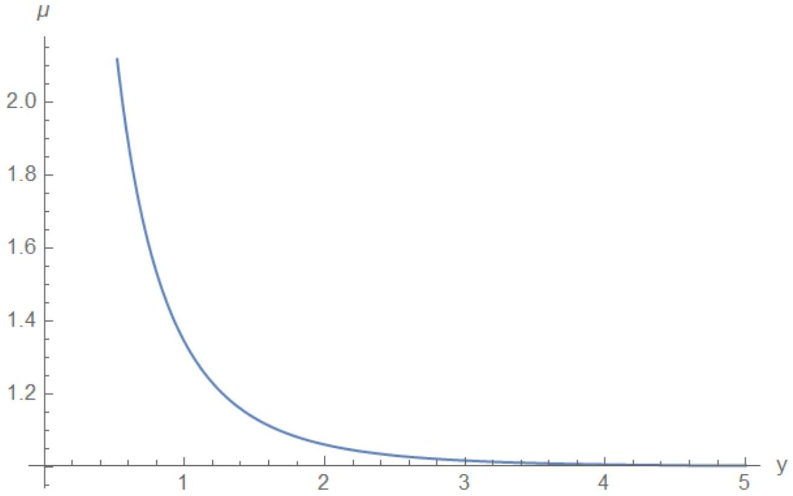

А1 ${ } ^ { 1.00 }$ Рассмотрим звезду массы $M$. Пусть мимо нее пролетает тело малой массы, имевшее первоначально большую (но нерелятивистскую) скоростью $v$, причем $v ^ { 2 } \gg G M / R$, где $R$ - наименьшее расстояние между центрами тел в процессе полета. Найдите угол, на которое оно отклонится от первоначального направления.

Обозначим за $V$ скорость тела в точке наименьшего расстояния а за $b$ прицельный параметр. Из ЗСЭ $V ^ { 2 } = v ^ { 2 } + \frac { 2 G M } { R }$, из ЗСМИ $V R = v b$. Уравнение кривых второго порядка в полярных координатах:

$$
r ( \varphi ) = \frac { 1 + e } { 1 + e \cos \varphi } R
$$

то есть угол отклонения $\delta = 2 \arccos ( 1 / e ) - \pi$. Рассмотрение точки траектории, находящейся большом удалении от звезды ( $\varphi = \arccos ( 1 / e ) - \Delta \varphi$ ) позволяет найти эксцентреситет

$$
e = \frac { v ^ { 2 } R } { G M } + 1 \simeq \frac { v ^ { 2 } R } { G M } .
$$

В итоге

$$
\delta = \frac { 2 G M } { v ^ { 2 } R }
$$

Ответ:

$$
\delta = \frac { 2 G M } { v ^ { 2 } R }
$$

А2 ${ } ^ { 0.30 }$ Теперь рассмотрите фотон, летящий со скоростью света $c$. Для него верно соотношение $E = p c$, где $E$, $p$ - энергия и импульс фотона. Считайте, что гравитационная сила, действующая на фотон, определяется законом всемирного тяготения, где вместо массы используется величина $E / c ^ { 2 }$. Найдите угол отклонения $\delta$ фотона.

Ответ:

$$
\delta = \frac { 2 G M } { c ^ { 2 } R }
$$

А3 ${ } ^ { 0.20 }$ ОТО предсказывает значение, ровно в 2 раза большее найденного вами. Запишите выражение для угла отклонения $\delta$, предсказанное ОТО. В дальнейшем используйте именно это значение. Представив $\delta$ в виде $\delta = r _ { 0 } / R$, выразите $r _ { 0 }$ через $G , M$ и $c$.

Ответ:

$$
r _ { 0 } = \frac { 4 G M } { c ^ { 2 } }
$$

В1 ${ } ^ { 1.00 }$ Предполагая вначале, что Земля, источник света и центр линзы находятся на одной прямой ( $\alpha = 0$ ), найдите угол $\theta _ { 0 }$, под которым свет приходит к наблюдателю. Что видит наблюдатель в этом случае? Угол $\theta _ { 0 }$ называется углом Хвольсона-Эйнштейна по имени людей, разработавших теорию линзирования.

Минимальное расстояние до звезды в рамках приближений предыдущий пунктов совпадает с прицельным параметром с точностью до малых членов. Тогда $R = \theta _ { 0 } a$, а угол к прямой под которым луч выходит из звезды равен $R / b = \theta _ { 0 } a / b$. Итоговое уравнение на $\theta _ { 0 }$ :

$$
\delta = \theta _ { 0 } \left( 1 + \frac { a } { b } \right) = \frac { 4 G M } { c ^ { 2 } \theta _ { 0 } a }
$$

Ответ:

$$
\theta _ { 0 } = \sqrt { \frac { 4 G M b } { c ^ { 2 } a ( a + b ) } }
$$

Наблюдатель вместо точечной звезды видит кольцо с угловым радиусом $\theta _ { 0 }$.

В2 ${ } ^ { 0.50 }$ Найдите численное значение $\theta _ { 0 }$ (в угловых секундах), считая массы звезд источника и линзы равными массе Солнца $2 \cdot 10 ^ { 30 }$ кг, радиусы равными радиусу Солнца $R = 7 \cdot 10 ^ { 8 }$ м, расстояния $a = b = 10$ кпк. Один парсек равен 1 пк $= 3 \cdot 10 ^ { 16 }$ м, скорость света $c = 3 \cdot 10 ^ { 8 } \mathrm { м } / \mathrm { c }$, гравитационная постоянная $G = 6.67 \cdot 10 ^ { - 11 } \left( \mathrm { H } \cdot \mathrm { м } ^ { 2 } \right) / к \Gamma ^ { 2 }$.

Ответ:

$$
\theta _ { 0 } = 3.1 \cdot 10 ^ { - 9 } = 0.65 ^ { \prime \prime } \cdot 10 ^ { - 4 }
$$

Вз ${ } ^ { 1.00 }$ Сколько изображений увидит наблюдатель в общем случае $\alpha \neq 0$ ? Найдите угол для каждого из них. Выразите его через углы $\alpha$, $\theta _ { 0 }$.

Луч проходит на удалении $\theta a$ от звезды. При этом, если бы луч не взаимодействовал со звездой, то он бы пришел из точки на расстоянии $\theta ( a + b )$ от оси в то время, как источник находится на расстоянии $\alpha ( a + b )$ от оси. Значит угол отклонения

$$
\delta = ( \theta - \alpha ) \frac { a + b } { b } = \frac { 4 G M } { c ^ { 2 } \theta a } .
$$

Получаем квадратное уравнение $\theta ^ { 2 } - \alpha \theta - \theta _ { 0 } ^ { 2 } = 0$ и из него находим

$$
\theta = \frac { 1 } { 2 } \left( \alpha \pm \sqrt { \alpha ^ { 2 } + 4 \theta _ { 0 } ^ { 2 } } \right)
$$

т.е. имеем два изображения в плоскости рисунка.

Ответ:

$$
\theta = \frac { 1 } { 2 } \left( \alpha \pm \sqrt { \alpha ^ { 2 } + 4 \theta _ { 0 } ^ { 2 } } \right)
$$

В4 ${ } ^ { 1.00 }$ Пусть радиус звезды-линзы равен $R _ { L }$. Для предыдущего пункта найдите такой угол $\alpha _ { \text {max } }$, при котором еще видны все изображения. Выразите $\alpha _ { \text {max } }$ через $a , R _ { L }$ и $\theta _ { 0 }$. Вычислите его для параметров, приведенных в пункте B2.

Первым пропадает изображение сформированное лучем, прошедшим под звездой (ему соответствует $\theta < 0$ ). Запишем условие того, что этот луч не проходит через звезду:

$$
a \left( - \frac { \alpha } { 2 } + \sqrt { \frac { \alpha ^ { 2 } } { 4 } + \theta _ { 0 } ^ { 2 } } \right) > R _ { L } .
$$

Перенос слагаемых и возведение в квадрат приводит к

$$
\alpha < \frac { a } { R _ { L } } \theta _ { 0 } ^ { 2 } - \frac { R _ { L } } { a }
$$

Ответ:

$$
\alpha _ { \max } = \frac { a } { R _ { L } } \theta _ { 0 } ^ { 2 } - \frac { R _ { L } } { a } = 4.1 \cdot 10 ^ { - 6 }
$$

В5 ${ } ^ { 1.00 }$ Найдите $\Gamma _ { \perp }$ - линейное увеличение линзы в перпендикулярном плоскости рисунка направлении. Для этого немного сместите источник в этом направлении и посмотрите, на сколько в том же направлении сместится изображение.

Согласно условию задачи, изображение находится на расстоянии $a$ от наблюдателя. Смещение источника на расстояние $x$ в плоскости перпендикулярной рисунку эквивалентно повороту плоскости рисунка на угол $\phi = x / \alpha ( a + b )$. При этом изображение сместится на расстояние $x ^ { \prime } = \phi \cdot \theta a$. В итоге

$$
\Gamma _ { \perp } = \frac { x ^ { \prime } } { x } = \frac { \theta a } { \alpha ( a + b ) } .
$$

Примечание: в рамках условия задачи расстояние до изображения можно вычислить непосредственно.

Ответ:

$$
\Gamma _ { \perp } = \frac { \theta a } { \alpha ( a + b ) }
$$

В6 ${ } ^ { 1.00 }$ Теперь найдите $\Gamma _ { \| }$- линейное увеличение в направлении, лежащем в плоскости рисунка и перпендикулярном лучу зрения.

Сместим источник по вертикали на $d y$ от оптической оси, тогда $d \alpha = d y / ( a + b )$ а $\theta _ { 0 }$ не изменится и в итоге:

$$
d \theta = \frac { d \alpha } { 2 } \left( 1 \pm \frac { \alpha } { \sqrt { \alpha ^ { 2 } + 4 \theta _ { 0 } ^ { 2 } } } \right)
$$

Таким образом по вертикали изображение сместиться на $d y ^ { \prime } = a d \theta$, где $a$ - расстояние до изображения. Увеличение $\Gamma _ { \| }$тогда

$$
\Gamma _ { \| } = \frac { d y ^ { \prime } } { d y } = \frac { a } { 2 ( a + b ) } \left( 1 \pm \frac { \alpha } { \sqrt { \alpha ^ { 2 } + 4 \theta _ { 0 } ^ { 2 } } } \right)
$$

Ответ:

$$
\Gamma _ { \| } = \frac { a } { 2 ( a + b ) } \left( 1 \pm \frac { \alpha } { \sqrt { \alpha ^ { 2 } + 4 \theta _ { 0 } ^ { 2 } } } \right)
$$

В7 ${ } ^ { 0.50 }$ Пусть источник имеет малые, но ненулевые размеры. Зная $\Gamma _ { \perp }$ и $\Gamma _ { \| }$, найдите полное увеличение гравитационной линзы $\Gamma$. По определению это отношение площади изображения (лежащего в плоскости линзы) к площади проекции источника на плоскость, перпендикулярную лучу зрения.

Ответ:

$$
\Gamma = \Gamma _ { \perp } \cdot \Gamma _ { \| } = \frac { 1 } { 4 } \left( \frac { a } { a + b } \right) ^ { 2 } \left( \frac { \alpha } { \sqrt { \alpha ^ { 2 } + 4 \theta _ { 0 } ^ { 2 } } } + \frac { \sqrt { \alpha ^ { 2 } + 4 \theta _ { 0 } ^ { 2 } } } { \alpha } \pm 2 \right)
$$

В8 ${ } ^ { 1.50 }$ Как известно, собирающая линза фокусирует лучи, увеличивая поток энергии. Таким же свойством обладает гравитационная линза. Пусть в отсутствие линзы телескоп наблюдателя принимает от источника поток энергии $N _ { 0 }$ [Вт]. Найдите, во сколько раз $\mu$ увеличивает линза принимаемый поток энергии. Световой поток от звезды - линзы считайте пренебрежимо малым. Считайте, что наблюдатель видит все возможные изображения ( $\alpha \neq 0$ ) и суммирует потоки энергии от них.

Рассмотрим апертуру телескопа размером $2 r$, если в его центр попадает луч от звезды под углом $\alpha$, то луч, попадающий в его верхний край, пересекает оптическую ось на расстоянии $\Delta a$ от него под углом $\alpha + \Delta \alpha$. Из подобия треугольников

$$
\frac { \Delta a } { r } = \frac { \Delta a + a + b } { \alpha ( a + b ) } \quad \Rightarrow \quad \Delta a \simeq \frac { r } { \alpha } .
$$

Тогда $\Delta \alpha = \alpha ( a + b ) / ( a + b + \Delta a ) - \alpha \simeq - r / ( a + b )$ и телесный угол, под которым видно телескоп, если смотреть из точки, где находится звезда, равен $\pi \Delta \alpha ^ { 2 } = \pi r ^ { 2 } / ( a + b ) ^ { 2 }$. Значит на поверхность телескопа попадает мощность

$$
N _ { 0 } = I _ { 0 } \frac { r ^ { 2 } } { 4 ( a + b ) ^ { 2 } } ,
$$

где $I _ { 0 }$ - полная мощность излучения звезды.

В ситуации, когда свет звезды преломляется, можно воспользоваться следующей логикой: будем смотреть из точки положения звезды на телескоп. Его изображение, увеличенное в $\Gamma ^ { \prime }$ раз будет находиться в плоскости линзы, где $\Gamma ^ { \prime }$ получена из $\Gamma$ путем замены $a \rightarrow a ^ { \prime } = b , b \rightarrow b ^ { \prime } = a , \alpha \rightarrow \alpha ^ { \prime } = \alpha a / b$.

Тогда телесный угол, под которым будет видно телескоп равен $\pi \Gamma ^ { \prime } r ^ { 2 } / b ^ { 2 }$ и мощность принятого им излучения

$$
N ^ { \prime } = I _ { 0 } \Gamma ^ { \prime } \frac { r ^ { 2 } } { 4 b ^ { 2 } } .
$$

Итого увеличение мощности с учетом обоих изображений и равенства $a = b$ :

$$
\mu = \frac { \alpha } { \sqrt { \alpha ^ { 2 } + 4 \theta _ { 0 } ^ { 2 } } } + \frac { \sqrt { \alpha ^ { 2 } + 4 \theta _ { 0 } ^ { 2 } } } { \alpha }
$$

Ответ:

$$
\mu = \frac { 1 } { 2 } \left( \frac { \alpha } { \sqrt { \alpha ^ { 2 } + 4 \theta _ { 0 } ^ { 2 } } } + \frac { \sqrt { \alpha ^ { 2 } + 4 \theta _ { 0 } ^ { 2 } } } { \alpha } \right)
$$

Параметризация $y = \alpha / \theta _ { 0 }$ выглядит так:

$$
\mu ( y ) = \frac { 1 } { 2 } \left( \frac { y } { \sqrt { y ^ { 2 } + 4 } } + \frac { \sqrt { y ^ { 2 } + 4 } } { y } \right) = \frac { y ^ { 2 } + 2 } { y \sqrt { y ^ { 2 } + 4 } }
$$

Ответ:

$$
\mu ( 1 ) = \frac { 3 } { \sqrt { 5 } }
$$

Ответ:

В10 ${ } ^ { 0.50 }$ Из полученной формулы следует $\mu \rightarrow \infty$ при $\alpha \rightarrow 0$. Чем на самом деле ограничивается $\mu$ ?
Используя численные данные пункта В2, оцените значение $\mu _ { \text {max } }$.

Угол $\alpha$ не может быть меньше углового размера источника, поэтому $\alpha _ { \min } = R / ( a + b ) , y _ { \min } = R / \left( \theta _ { 0 } ( a + b ) \right) = 0.38 \cdot 10 ^ { - 3 }$. Значит $\mu _ { \max } = \mu \left( y _ { \min } \right)$.

Ответ:

$$
\mu _ { \max } = \mu \left( \frac { R } { \theta _ { 0 } ( a + b ) } \right) = 2.7 \cdot 10 ^ { 3 }
$$

С1 ${ } ^ { 1.00 }$ Однако все же можно наблюдать микролинзирование на оптических телескопах. Для этого нужно измерять поток энергии от звезд, который, как мы выяснили, изменяется при линзировании, когда одна звезда проходит сзади другой. Процесс линзирования звезд в Галактике длится примерно $\tau = 40$ дней. Если за это время мы пронаблюдаем звезду хотя бы
однажды, то, зная ее стандартную светимость, мы поймем, что наблюдаем гравитационное линзирование. Считайте, что в нашей Галактике $N = 2 \cdot 10 ^ { 11 }$ звезд, их массы примерно равны массе Солнца, характерный размер Галактики $L = 10$ кпк. Оцените, сколько звезд $N _ { 0 }$ нужно наблюдать ежемесячно, чтобы за $t = 1$ год найти $k = 10$ событий гравитационного линзирования.
