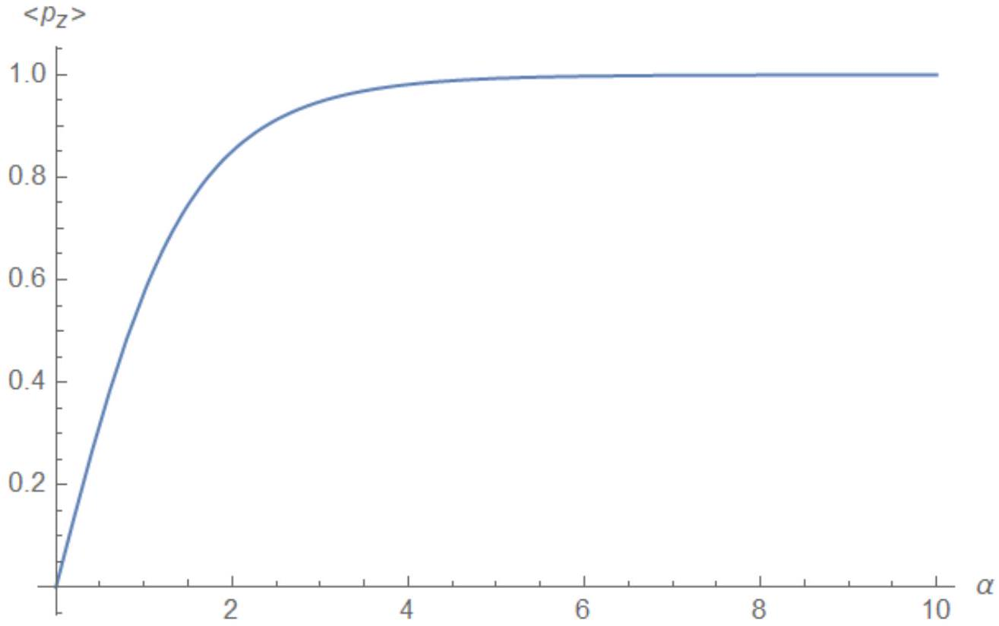
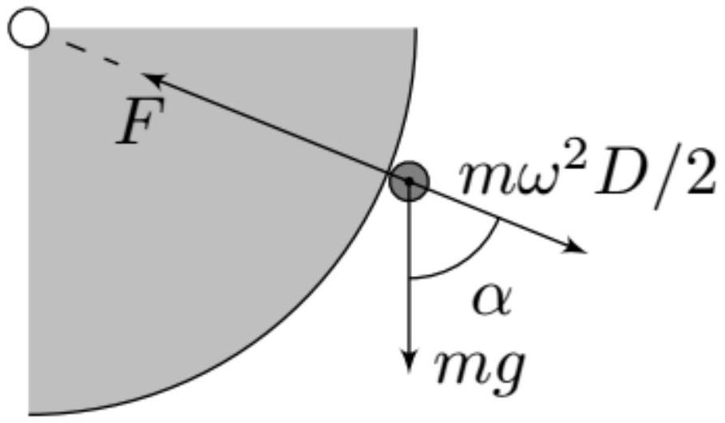

А1 ${ } ^ { 1.10 }$ Найдите среднее значение $\left\langle p _ { z } \right\rangle$ компоненты магнитного момента атома $X$ на ось $z$, находящегося в магнитном поле $\vec { B }$ при температуре $T$, как функцию параметра $\alpha = \frac { g _ { j } \mu _ { B } B } { k T }$.

Энергия магнитного диполя $\vec { p }$ в магнитном поле $\vec { B }$ равна $- \vec { p } \cdot \vec { B }$ поэтому $U _ { B } = - p _ { z } B$.
Вероятность того, что $m$ конкретного атома принимает хоть какое-то значение должна быть равна 1 , поэтому

$$
\sum _ { m = - j } ^ { j } A e ^ { \frac { g _ { j } \mu _ { B } B } { k T } m } = A \sum _ { m = - j } ^ { j } e ^ { \alpha m } = A e ^ { - \alpha j } \frac { e ^ { ( 2 j + 1 ) \alpha } - 1 } { e ^ { \alpha } - 1 } = A \frac { \sinh \left( j + \frac { 1 } { 2 } \right) \alpha } { \sinh \frac { \alpha } { 2 } } = 1 .
$$

Среднее значение $\left\langle p _ { z } \right\rangle$ найдем по определению:

$$
\left\langle p _ { z } \right\rangle = \sum p _ { z } W \left( p _ { z } \right) = A g _ { j } \mu _ { B } \sum _ { m = - j } ^ { j } m e ^ { \alpha m } .
$$

Сумму $\sum _ { m = - j } ^ { j } m e ^ { \alpha m }$ можно найти, как

$$
\sum _ { m = - j } ^ { j } m e ^ { \alpha m } = \frac { d } { d \alpha } \left( \sum _ { m = - j } ^ { j } e ^ { \alpha m } \right) = \frac { \left( j + \frac { 1 } { 2 } \right) \cosh \left[ \left( j + \frac { 1 } { 2 } \right) \alpha \right] \sinh \frac { \alpha } { 2 } - \frac { 1 } { 2 } \cos \frac { \alpha } { 2 } \sinh \left[ \left( j + \frac { 1 } { 2 } \right) \alpha \right] } { \sinh ^ { 2 } \frac { \alpha } { 2 } } .
$$

Итого

$$
\left\langle p _ { z } \right\rangle = g _ { j } \mu _ { B } \left( \left( j + \frac { 1 } { 2 } \right) \operatorname { coth } \left[ \left( j + \frac { 1 } { 2 } \right) \alpha \right] - \frac { 1 } { 2 } \operatorname { coth } \frac { \alpha } { 2 } \right)
$$

Ответ:

$$
\left\langle p _ { z } \right\rangle = g _ { j } \mu _ { B } \left( \left( j + \frac { 1 } { 2 } \right) \operatorname { coth } \left[ \left( j + \frac { 1 } { 2 } \right) \alpha \right] - \frac { 1 } { 2 } \operatorname { coth } \frac { \alpha } { 2 } \right)
$$

А2 ${ } ^ { 1.10 }$ Укажите выражение для $\left\langle p _ { z } \right\rangle$ в предельном случае $\alpha \rightarrow 0$ (то есть для случаев, когда магнитная энергия намного меньше тепловой энергии). Рассмотрите так же случай $\alpha \rightarrow \infty$. Приведите схематический график зависимости $\left\langle p _ { z } \right\rangle$ от параметра $\alpha$.

Для $\alpha \rightarrow 0$ воспользуемся формулой $\operatorname { coth } x \simeq 1 / x + x / 3$ и получим

$$
\left( j + \frac { 1 } { 2 } \right) \operatorname { coth } \left[ \left( j + \frac { 1 } { 2 } \right) \alpha \right] - \frac { 1 } { 2 } \operatorname { coth } \frac { \alpha } { 2 } \simeq \frac { \alpha } { 3 } j ( j + 1 )
$$

то есть при $\alpha \rightarrow 0$

$$
\left\langle p _ { z } \right\rangle \simeq \frac { j ( j + 1 ) } { 3 } \alpha g _ { j } \mu _ { B } .
$$

Для $\alpha \rightarrow \infty$ воспользуемся формулой $\operatorname { coth } x \simeq 1 + e ^ { - 2 x }$ и получим (при $j \neq 0$ )

$$
\left( j + \frac { 1 } { 2 } \right) \operatorname { coth } \left[ \left( j + \frac { 1 } { 2 } \right) \alpha \right] - \frac { 1 } { 2 } \operatorname { coth } \frac { \alpha } { 2 } \simeq j - \frac { 1 } { 2 } e ^ { - \alpha }
$$

то есть при $\alpha \rightarrow \infty$

$$
\left\langle p _ { z } \right\rangle \simeq g _ { j } \mu _ { B } \left( j - \frac { 1 } { 2 } e ^ { - \alpha } \right) .
$$

Ответ:

$$
\left\langle p _ { z } \right\rangle \simeq \begin{cases} \frac { j ( j + 1 ) } { 3 } \alpha g _ { j } \mu _ { B } , & \alpha \rightarrow 0 \\ j g _ { j } \mu _ { B } , & \alpha \rightarrow \infty \end{cases}
$$

А3 ${ } ^ { 0.90 }$ Вычислите магнитную восприимиивость $\chi$. Ответ выразите через концентрацию атомов $n$, температуру $T$, фактор Ланде $g _ { j }$, параметр $j$, и фундаментальные константы.

По определению $M$ - объемная намагниченность, то есть $M = n \left\langle p _ { z } \right\rangle$. Таким образом

$$
\chi \simeq \frac { j ( j + 1 ) } { 3 } \frac { n \mu _ { 0 } g _ { j } ^ { 2 } \mu _ { B } ^ { 2 } } { k T }
$$

Ответ:

$$
\chi \simeq \frac { j ( j + 1 ) } { 3 } \frac { n \mu _ { 0 } g _ { j } ^ { 2 } \mu _ { B } ^ { 2 } } { k T }
$$

В1 ${ } ^ { 0.80 }$ Используя данные в таблице, определите численные значения параметров $B _ { 0 }$ и $a$ из уравнения (1). Запишите формулы, по которым вы их определили.

Зависимость $\ln ( B /$ Тл) от $r$ должна быть линейной:

$$
\ln \frac { B } { \mathrm {~T} л } = \ln \frac { B _ { 0 } } { \mathrm {~T} л } - \frac { r } { a } .
$$

Пересчет точек и нахождение коэффициентов с помощью МНК приводит к таким результатам:

$$
B _ { 0 } = 1.0 \text { Тл, } \quad a = 2.25 \mathrm { мм }
$$

В2 ${ } ^ { 0.80 }$ Чему равна энергия частицы в поле $\vec { B }$ ? Выразите ответ через индукцию магнитного поля $B$, магнитную восприимиивость материала частицы $\chi _ { 1 }$ и её объём $V$.

Магнитный момент частицы:

$$
P = V M = V \frac { \chi _ { 1 } B } { \mu _ { 0 } } .
$$

Изменение энергии частицы при увеличении внешнего поля:

$$
d E = - V \frac { \chi _ { 1 } } { \mu _ { 0 } } B d B
$$

поэтому

$$
E = - \frac { V \chi _ { 1 } B ^ { 2 } } { 2 \mu _ { 0 } }
$$

Ответ:

$$
E = - \frac { V \chi _ { 1 } B ^ { 2 } } { 2 \mu _ { 0 } }
$$

Вз ${ } ^ { 1.10 }$ Найдите выражение для положения лотка $x$, в котором он собирает минеральные частицы. Найдите численное значение для $x$.

Найдем силу $F$ с которой частица взаимодействует с роликом:

$$
F = - \frac { d E } { d r } = - \left. \frac { d E } { d B } \frac { d B } { d r } \right| _ { r = R _ { 0 } } = - V \frac { \chi _ { 1 } B _ { 0 } ^ { 2 } } { \mu _ { 0 } a } e ^ { - 2 R _ { 0 } / a } ,
$$

где знак минус указывает на притяжение.
В момент отрыва сила нормальной реакции равна нулю, поэтому условие отрыва:

$$
F = m g \cos \alpha + m \omega ^ { 2 } \frac { D } { 2 } .
$$

Тогда угол $\alpha$, которому соответствует отрыв:

$$
\begin{equation*}
\cos \alpha = \frac { \chi _ { 1 } B _ { 0 } ^ { 2 } } { \mu _ { 0 } a \rho _ { 1 } g } e ^ { - 2 R _ { 0 } / a } - \frac { \omega ^ { 2 } D } { 2 g } > 1 , \tag{1}
\end{equation*}
$$

значит отрыв происходит при $\alpha = 0$.
Будем пренебрегать $D$ по сравнению $c d$. Тогда частица при любых $\alpha$ в масштабах $d$ вылетает из одной точки под углом $\alpha$ к горизонтали в момент отрыва. Найдем время полета $t$ :

$$
\begin{equation*}
d = \frac { \omega D } { 2 } \sin \alpha t + \frac { g t ^ { 2 } } { 2 } \Rightarrow t = - \frac { \omega D } { 2 g } \sin \alpha + \sqrt { \frac { \omega ^ { 2 } D ^ { 2 } } { 4 g ^ { 2 } } \sin ^ { 2 } \alpha + \frac { 2 d } { g } } \tag{2}
\end{equation*}
$$

Воспользуемся тем, что $( \omega D / g ) ^ { 2 } \ll d / g : t = \sqrt { 2 d / g }$. Тогда с учетом $\alpha = 0$

$$
x = \frac { D } { 2 } \sin \alpha - \frac { \omega D } { 2 } \cos \alpha \sqrt { \frac { 2 d } { g } } = - \frac { \omega D } { 2 } \sqrt { \frac { 2 d } { g } }
$$

Ответ:

$$
x = - \frac { \omega D } { 2 } \sqrt { \frac { 2 d } { g } } = - 22.7 \mathrm { cM }
$$

В4 ${ } ^ { 1.10 }$ Найдите выражение и численное значение для ширины пучка частиц $\Delta _ { 0 }$ в направлении оси $x$ около лотка.

Для частиц разного размера может отличаться $\cos \alpha$ и эффективный диаметр $D$. Для указанного диапазона размеров все частицы отрываются в нижней точке, а $D$ меняется в диапазоне $\left[ D + 1.8 R _ { 0 } , D + 2.2 R _ { 0 } \right]$. Также в ширину пучка вносит вклад размер самих частицы

$$
\Delta _ { 0 } = \left| \frac { d x } { d D } \right| \cdot 0.4 R _ { 0 } + 2 R _ { 0 } = 2.1 \mathrm { mM }
$$

Ответ:

$$
\Delta _ { 0 } = \left| \frac { d x } { d D } \right| \cdot 0.4 R _ { 0 } + 2 R _ { 0 } = 2.1 \mathrm {~mm}
$$

В5 ${ } ^ { 1.10 }$ Найдите выражение для угловой скорости магнитного ролика $\omega$, при которой можно отдельно получить частицы двух типов. Найдите численное значение $\omega$. Считайте известной ширину обоих лотков $\Delta$.

Согласно уравнению (1) максимально значение $\cos \alpha$, то есть минимальный угол $\alpha _ { \min }$, когда происходит отрыв, задается выражением

$$
\cos \alpha _ { \min } = \frac { \chi B _ { 0 } ^ { 2 } } { \mu _ { 0 } a \rho g } e ^ { - 2 R _ { 0 } / a } \Rightarrow \cos \alpha _ { \min , 1 } = 2.44 , \quad \cos \alpha _ { \min , 2 } = 0.29 ,
$$

таким образом частицы 1 -го типа могут отрываться в любом месте диска, а частицы 2 -го типа при $\alpha \geq \alpha _ { \min , 2 } = \arccos 0.29$.
Нижнее ограничение на угловую скорость мы получаем в том случае, когда частицы первого типа отрываются в самом низу, а частицы второго типа отрываются при каком-то $\alpha _ { 2 }$.

Верхнее ограничение на угловую скорость мы получаем в том случае, когда частицы первого типа отрываются при каком-то $\alpha _ { 1 }$, а частицы второго типа отрываются немного ниже.

Расстояние $\Delta x$ между частицами двух типов приравняем к $\Delta$, считая это критерием разделения.
Для первого случая найдем угол $\alpha _ { 1 }$, когда частицы 2-го типа должны отрываться (частицы 1-го типа отрываются при $\alpha = 0$ ):

$$
\left( \frac { D } { 2 } \sin \alpha - \frac { \omega D } { 2 } \cos \alpha \sqrt { \frac { 2 d } { g } } \right) - \left( - \frac { \omega D } { 2 } \sqrt { \frac { 2 d } { g } } \right) = \Delta
$$

для анализа удобнее выразить $\omega$ из уравнения (1) и подставить:

$$
\sin \alpha + ( 1 - \cos \alpha ) \sqrt { \frac { d } { D } } \sqrt { \frac { \chi _ { 2 } B _ { 0 } ^ { 2 } } { \mu _ { 0 } a \rho _ { 2 } g } e ^ { - 2 R _ { 0 } / a } - \cos \alpha } = 1 .
$$

Это уравнение не имеет решений, поэтому нижняя граница реализуется в случае, когда $\alpha _ { 2 } = \pi / 2$ :

$$
\frac { D } { 2 } + \frac { \omega D } { 2 } \sqrt { \frac { 2 d } { g } } = \Delta , \quad \omega _ { \min } = \left( \frac { 2 \Delta } { D } - 1 \right) \sqrt { \frac { g } { 2 d } } = 2 \pi \cdot 190 \text { мин } ^ { - 1 }
$$

Для второго случая

$$
\frac { D } { 2 } - \left( \frac { D } { 2 } \sin \alpha - \frac { \omega D } { 2 } \cos \alpha \sqrt { \frac { 2 d } { g } } \right) = \Delta
$$

Также выразим $\omega$ через $\alpha$ с помощью уравнения (1), описывающего отрыв:

$$
\sin \alpha - \cos \alpha \sqrt { \frac { d } { D } } \sqrt { \frac { \chi _ { 2 } B _ { 0 } ^ { 2 } } { \mu _ { 0 } a \rho _ { 2 } g } e ^ { - 2 R _ { 0 } / a } - \cos \alpha } = 1 - \frac { 2 \Delta } { D } .
$$

Это уравнение также не имеет решений, значит нужно перестать работать в приближении $( \omega D / g ) ^ { 2 } \ll d / g$ то есть заменить $\sqrt { 2 d / g }$ на $\frac { \omega D } { 2 g } \sin \alpha + \sqrt { \frac { \omega ^ { 2 } D ^ { 2 } } { 4 g ^ { 2 } } \sin ^ { 2 } \alpha + \frac { 2 d } { g } }$ согласно (2). Тогда численное решение дает $\alpha _ { 1 } = 0.629$ и $\omega _ { \max } = 2 \pi \cdot 270$ мин $^ { - 1 }$.

Ответ:

$$
\begin{gathered}
\omega _ { \min } = \left( \frac { 2 \Delta } { D } - 1 \right) \sqrt { \frac { g } { 2 d } } = 2 \pi \cdot 190 \text { мин } ^ { - 1 } \\
\omega _ { \max } = 2 \pi \cdot 270 \text { мин } ^ { - 1 }
\end{gathered}
$$
