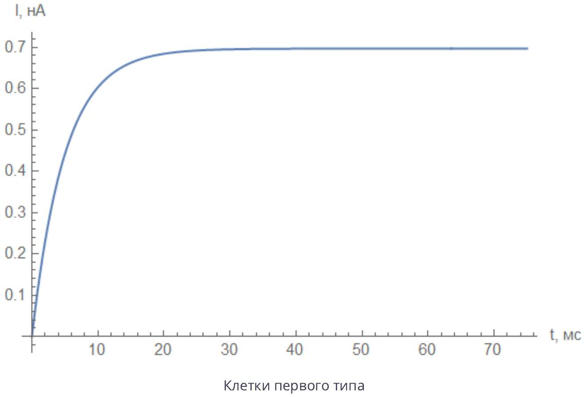
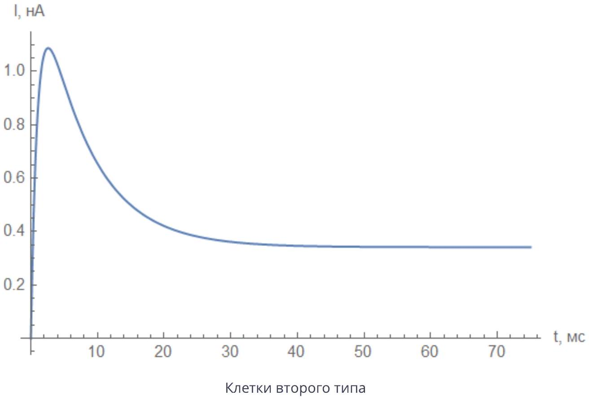
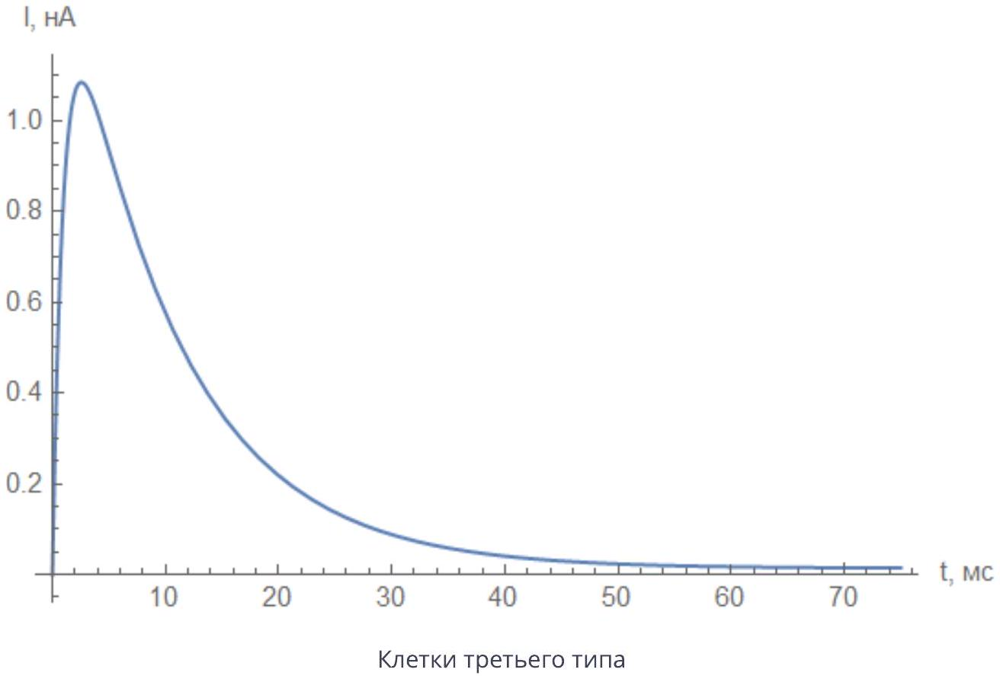

А1 ${ } ^ { 0.50 }$ Рассмотрим белок, у которого возможны только два состояния $A$ и $B$. Пусть возможен прямой переход из состояния $A$ в состояние $B$ с известным характерным временем $\tau _ { A B }$, а обратный переход не происходит (фактически это означает, что $\tau _ { B A } \rightarrow \infty$ ).
Рассмотрим образец, в котором находится $N$ таких белков. Пусть в начальный момент все они находятся в состоянии $A$. Найдите зависимость количества белков в каждом из состояний в зависимости от времени $N _ { A } ( t )$ и $N _ { B } ( t )$. Ответы выразите через $\tau _ { A B }$ и $N$.

Нам дана вероятность перехода в единицу времени т.е. вероятность $d p$ с которой за время $d t$ случится переход $d p = \frac { d t } { \tau _ { A B } }$. Пусть в какой-то момент времени количество белков в состоянии $A$ равно $N _ { A } ( t )$. За время $d t$ каждый из этих белков с вероятностью $d p$ перейдет в состояние $B$ значит в среднем произойдет $N _ { A } ( t ) d p$ переходов. Запишем дифференциальное уравнение на $N _ { A } ( t )$ :

$$
d N _ { A } = - N _ { A } d p = - N _ { A } \frac { d t } { \tau _ { A B } }
$$

Уравнение легко интегрируется:

$$
\ln \frac { N _ { A } ( t ) } { N } = - \frac { t } { \tau _ { A B } } , \quad \Rightarrow \quad N _ { A } ( t ) = N \cdot e ^ { - t / \tau _ { A B } } .
$$

При этом $d N _ { B } = - d N _ { A }$ значит $N _ { B } ( t ) = N - N _ { A } ( t ) = N \left( 1 - e ^ { - t / \tau _ { A B } } \right)$

Ответ:

$$
\begin{gathered}
N _ { A } ( t ) = N e ^ { - t / \tau _ { A B } } \\
N _ { B } ( t ) = N \left( 1 - e ^ { - t / \tau _ { A B } } \right)
\end{gathered}
$$

A2 ${ } ^ { 0.50 }$ Укажите, какие относятся к какому из каналов? Высота ступеньки везде одинаковая и равна $I = 1.4$ пА.

На графиках $C$ заметен различимый в масштабе 10 мс сдвиг во времени первого пика тока, следовательно $\tau _ { C O } \approx 10$ мс и графикам $C$ соответствует 1-ый тип каналов.

График $B$ отличается от $A$ тем, что на масштабе 100 мс система не возвращается в состояние $C$ так как нет вторых пиков тока т.е. $\tau _ { I C } \gg 100$ мс. Значит графику $A$ соответствует 2-ой тип каналов а графику $B$ 3-ий тип каналов.

| График $A$ | График $B$ | График $C$ |
| :--- | :--- | :--- |
| Каналы 2-го типа | Каналы 3-го типа | Каналы 1-го типа |

А3 ${ } ^ { 1.00 }$ Рассмотрим 3 клетки, в мембраны которых встроены каналы, описанные в предыдущем пункте.
В мембране каждой клетки находится много $( \gg 1 )$ каналов и все одного типа. Производятся измерения методом Whole Cell Patch Clamp. Включается свет и во всех трёх случаях дожидаются установления показаний силы тока, после чего свет выключается.
Изобразите качественно зависимости силы тока от времени для всех трёх клеток. Чему равна установившаяся сила тока для каждой из клеток, если напряжение поданное между электродами и растворы в пипетке и в омывающей жидкости оставили без изменений после эксперимента в пункте А2. Ответы выразите через количество каналов в клетке $N = 1000 , \tau _ { C O } , \tau _ { O I }$ и $\tau _ { I C }$.

Запишем динамические уравнения на количество клеток в каждом из состояний:

$$
\left\{ \begin{array} { l }
\dot { N } _ { C } = - \frac { N _ { C } } { \tau _ { O } } + \frac { N _ { I } } { \tau _ { I C } } \\
\dot { N } _ { O } = - \frac { N _ { O } } { \tau _ { O I } } + \frac { N _ { C } } { \tau _ { C O } } \\
\dot { N } _ { I } = - \frac { N _ { I } } { \tau _ { I C } } + \frac { N _ { O } } { \tau _ { O I } }
\end{array} . \right.
$$

Сначала найдем равновесное количество $N _ { O }$. Для этого приравняем к нулю производные и выразим $N _ { C }$ и $N _ { I }$ через $N _ { O }$ :

$$
N _ { C } = N _ { O } \frac { \tau _ { C O } } { \tau _ { O I } } , \quad N _ { I } = N _ { O } \frac { \tau _ { I C } } { \tau _ { O I } } .
$$

Общее количество клеток $N = N _ { C } + N _ { O } + N _ { I }$, поэтому

$$
N _ { O } = N \frac { \tau _ { O I } } { \tau _ { C O } + \tau _ { O I } + \tau _ { I C } }
$$

Если обозначит $v = \left( \begin{array} { l } N _ { C } \\ N _ { O } \\ N _ { I } \end{array} \right)$ то динамические уравнение можно записать в матричном виде:

$$
\dot { v } = \left( \begin{array} { c c c }
- \frac { 1 } { \tau _ { C O } } & 0 & \frac { 1 } { \tau _ { I C } } \\
\frac { 1 } { \tau _ { C O } } & - \frac { 1 } { \tau _ { O I } } & 0 \\
0 & \frac { 1 } { \tau _ { O I } } & - \frac { 1 } { \tau _ { I C } }
\end{array} \right) v = A v
$$

Найдем собственные значения $\lambda$ и соответствующие им собственные вектора $v _ { \lambda } : A v _ { \lambda } = \lambda v _ { \lambda }$. Перепишем это уравнение в виде $( A - \lambda E ) v _ { \lambda } = 0$ и найдем $\lambda$

приравняв $\operatorname { det } ( A - \lambda E ) = 0$.

$$
\operatorname { det } ( A - \lambda E ) = - \left( \frac { 1 } { \tau _ { C O } } + \lambda \right) \left( \frac { 1 } { \tau _ { O I } } + \lambda \right) \left( \frac { 1 } { \tau _ { I C } } + \lambda \right) + \frac { 1 } { \tau _ { I C } } \frac { 1 } { \tau _ { C O } } \frac { 1 } { \tau _ { O I } } = 0
$$

Получаем корень $\lambda = 0$ соответствующий положению равновесия и два других корня, являющиеся решениями квадратного уравнения:

$$
\lambda \left[ \left( \frac { 1 } { \tau _ { O I } } \frac { 1 } { \tau _ { I C } } + \frac { 1 } { \tau _ { I C } } \frac { 1 } { \tau _ { C O } } + \frac { 1 } { \tau _ { C O } } \frac { 1 } { \tau _ { O I } } \right) + \lambda \left( \frac { 1 } { \tau _ { C O } } + \frac { 1 } { \tau _ { O I } } + \frac { 1 } { \tau _ { I C } } \right) + \lambda ^ { 2 } \right] = 0
$$

Получим два характерных времени процесса установления равновесия:

$$
\lambda _ { 1,2 } = \frac { - \left( \frac { 1 } { \tau _ { C O } } + \frac { 1 } { \tau _ { O I } } + \frac { 1 } { \tau _ { I C } } \right) \pm \sqrt { \left( \frac { 1 } { \tau _ { C O } } + \frac { 1 } { \tau _ { O I } } + \frac { 1 } { \tau _ { I C } } \right) ^ { 2 } - 4 \left( \frac { 1 } { \tau _ { O I } } \frac { 1 } { \tau _ { I C } } + \frac { 1 } { \tau _ { I C } } \frac { 1 } { \tau _ { C O } } + \frac { 1 } { \tau _ { C O } } \frac { 1 } { \tau _ { O I } } \right) } } { 2 }
$$

Для клеток первого типа $\lambda _ { 1 } = - \frac { 1 } { 0.10 \mathrm { мc } } , \lambda _ { 2 } = - \frac { 1 } { 4.97 \mathrm { mc } } . I _ { \infty } = 1.4 ~ п \mathrm {~A} \cdot N _ { O } \approx 0.70$ нА.

Для клеток второго типа $\lambda _ { 1 } = - \frac { 1 } { 7.29 \mathrm { mc } } , \lambda _ { 2 } = - \frac { 1 } { 1.00 \mathrm { mc } } . I _ { \infty } = 1.4 ~ п \mathrm {~A} \cdot N _ { O } \approx 0.34$ нА.

Для клеток третьего типа $\lambda _ { 1 } = - \frac { 1 } { 9.89 \mathrm { mc } } , \lambda _ { 2 } = - \frac { 1 } { 1.00 \mathrm { mc } } . I _ { \infty } = 1.4 ~ п \mathrm {~A} \cdot N _ { O } \approx 0.014$ нА.

Ответ:

| Первый тип | Второй тип | Третий тип |
| :--- | :--- | :--- |
| $I _ { \infty } \approx 0.70$ нА | $I _ { \infty } \approx 0.34 \mathrm { HA }$ | $I _ { \infty } \approx 0.014 \mathrm { HA }$ |

В1 ${ } ^ { 2.00 }$ Найдите полный поток ионов калия $J$, через селективный калиевый канал. Ответ выразите, через коэффициент диффузии $D$, молярную концентрацию калия снаружи клетки $c$ и её производную вдоль канала $\frac { d c } { d x }$, подвижность ионов калия $\mu$, элементарный заряд $e$ и напряжённость электрического поля $E$.
Примечание: подвижностью называется коэффициент пропорциональности между скоростью дрейфового движения частиц и силой, действующей на них: $\mu F = v$.

В поток ионов вносят вклад два эффекта: диффузия $J _ { 1 } = - D \frac { d c } { d x }$ и дрейфовое движение $J _ { 2 } = v c = \mu E e c$.

Ответ:

$$
J = - D \frac { d c } { d x } + \mu E e c
$$

В2 ${ } ^ { 2.00 }$ Найдите, при каком напряжении $U _ { \text {rev } }$ на клеточной мембране (мембранный потенциал) поток через открытый калиевый канал становится равным нулю при температуре $T = 20 ^ { \circ } \mathrm { C }$. Ответ выразите через $T , c _ { \text {out } } = 4$ ммоль $/$ л и $c _ { \text {in } } = 155$ ммоль $/$ л - концентрации калия снаружи клетки и внутри неё, и фундаментальные физические константы.
Примечание: Мембранный потенциал считается положительным, если плюс находится на внутренней поверхности мембраны клетки.

Нулевому току соответствует нулевой поток ионов $J = 0$. Направим ось $x$ внутрь мембраны:

$$
- \mu k T \frac { d c } { d x } + \mu \frac { d U } { d x } e c = 0 .
$$

Получим дифференциальное уравнение:

$$
d U = \frac { k T } { e } \frac { d c } { c } \quad \Rightarrow \quad U = \frac { k T } { e } \ln \frac { c _ { \text {out } } } { c _ { \text {in } } }
$$

Ответ:

$$
U _ { \mathrm { rev } } = \frac { k T } { e } \ln \frac { c _ { \text {out } } } { c _ { \text {in } } } \approx - 92.4 \mathrm { MB }
$$

С1 ${ } ^ { 3.00 }$ По данным, изображенным на графиках, определите электрические характеристики мембраны клетки: $R _ { M } , R _ { S } , C _ { M }$. Все три графика отражают зависимость тока через клеточную мембрану от времени для одной и той же точки (это всё один эксперимент, показаны разные участки по времени). Разные линии снизу вверх соответствуют напряжениям, поданным на мембрану: $- 120 \mathrm { mB } , - 80 \mathrm { mB } , - 40 \mathrm { mB } , 0 \mathrm { mB } , 40 \mathrm { mB } , 80 \mathrm { mB } , 120 \mathrm { mB }$. Зелёная линия сверху указывает на время, когда включен свет.

После установления тока и до включения света зависимость тока через мембрану от напряжения:

| $U , \mathrm { mB }$ | $I$, пА |
| :--- | :--- |
| -120 | -48 |
| -80 | -32 |
| -40 | -16 |
| 40 | 16 |
| 80 | 32 |
| 120 | 48 |

Коэффициент наклона этой зависимости исходя из данных равен 2.5 ГОм, а исходя из эквивалентной схемы равен $R _ { M } + R _ { S }$.

В начальный момент времени зависимость тока от времени и напряжения:

$I$, нA

| $U , \mathrm { mB }$ | 10.0 мс | 10.1 mc | 10.2 мс | 10.3 мс | 10.4 мс |
| :--- | :--- | :--- | :--- | :--- | :--- |
| -120 | -24 | -16 | -11 | -7 | -5 |
| -80 | -16 | -11 | -7 | -5 | -3 |
| -40 | -8 | -5 | -3.5 | -2.5 | -1.5 |
| 40 | 9 | 5 | 3.5 | 2 | 1.5 |
| 80 | 16 | 10 | 7 | 5 | 3 |
| 120 | 23 | 16 | 10 | 7 | 5 |

Исходя из данных средний коэффициент наклона зависимостей $\ln \left( \frac { I ( t ) } { I ( 10.0 \mathrm { Mc } ) } \right)$ от $t$ равен $- 4.0 \mathrm { Mc } ^ { - 1 }$, а исходя из эквивалентной схемы он равен $- \frac { 1 } { R _ { M } C _ { M } }$.
Площадь под графиком зависимостей $I ( t )$ равна заряду, который должен протечь через мембрану, чтобы зарядить конденсатор до напряжения $U$. Из данных получим:

| $U , \mathrm { mB }$ | $q$, пКл |
| :--- | :--- |
| -120 | -6,03 |
| -80 | -3,94 |
| -40 | -1,94 |
| 40 | 1,87 |
| 80 | 3,89 |
| 120 | 5,89 |

Коэффициент наклона этой зависимости равен 49 н $\Phi$ и также равен $C _ { M }$. Тогда $R _ { M } = \frac { 1 } { 4.0 \mathrm { mc } ^ { - 1 } \cdot C _ { M } } = 5.0 \mathrm { МОм }$ и $R _ { S } = 2.5$ ГОм.

Ответ:

| $R _ { S }$ | $R _ { M }$ | $C _ { M }$ |
| :--- | :--- | :--- |
| 2.5 ГОм | 5.0 МОм | 49 н $\Phi$ |

С2 ${ } ^ { 1.00 }$ Определите, какой ион свободно проходит через канал, встроенный в мембрану этой клетки?
Концентрации всех ионов в растворах пипетки и омывающем указаны на рисунке 7.

Из графиков видно, что при $U \approx 40 \mathrm { mB }$ ток при включенном свете остается практически нулевым. Рассчитаем $U _ { \text {rev } }$ для предложенных ионов:

| Ион | $U _ { \text {rev } } , \mathrm { MB }$ |
| :--- | :--- |
| $\mathrm { K } ^ { + }$ | -84,1 |
| $\mathrm { Na } ^ { + }$ | 40,6 |
| $\mathrm { Cl } ^ { - }$ | -40,6 |
| $\mathrm { Mg } ^ { 2 + }$ | 8,8 |

Ответ: Ион $\mathrm { Na } ^ { + }$.
