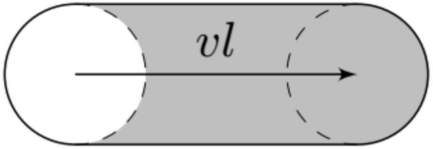

За время $t$ атом ${ } ^ { 3 } \mathrm { He }$ проходит расстояние $v t$. Оценим нижнюю и верхнюю границу для $v t : v t \in \left[ 5 \cdot 10 ^ { - 4 } , 0.5 \right]$ нм.
Круг радиусом $r$ пересекается с прямой длиной $v t$ если его центр лежит внутри фигуры площадью $\pi r ^ { 2 } + 2 r v t$. При этом нужно вычесть площадь $\pi r ^ { 2 }$, соответствующую центрам кругов, которые пересекают начальную точку.

Тогда вероятность $p$ того, что на пути атома встретилась нить $p = n \cdot 2 r v t \ll 1$. Значит их количество $F _ { 1 } ( t ) = 2 r v t n N$

Ответ:

$$
F _ { 1 } ( t ) = 2 r v t n N , \quad F _ { 1 } ( 10 \phi c ) \approx 10 ^ { 4 }
$$

А2 ${ } ^ { 1.00 }$ Сколько $G ( t )$ столкновений в среднем испытывает атом ${ } ^ { 3 } \mathrm { He }$ за время $t$ ?

Рассмотрим площадь $\frac { N _ { 0 } } { n }$ на которой равномерно распределены все $N _ { 0 }$ нитей аэрогеля. Тогда вероятность $p _ { k } ( t )$ того, что за время $t$ атом столкнулся с $k$ нитями задается выражением:

$$
p _ { k } = \frac { N _ { 0 } ! } { \left( N _ { 0 } - k \right) ! k ! } \left( \frac { 2 r v t n } { N _ { 0 } } \right) ^ { k } \left( 1 - \frac { 2 r v t n } { N _ { 0 } } \right) ^ { N _ { 0 } - k } = \frac { N _ { 0 } ! } { \left( N _ { 0 } - k \right) ! k ! } \frac { \left( \frac { 2 r v t n } { N _ { 0 } } \right) ^ { k } } { \left( 1 - \frac { 2 r v t n } { N _ { 0 } } \right) ^ { k } } \left( 1 - \frac { 2 r v t n } { N _ { 0 } } \right) ^ { N _ { 0 } }
$$

известным, как распределение Бернулли.
Возьмем предел при $N _ { 0 } \rightarrow \infty$ :

$$
p _ { k } ( t ) \rightarrow \frac { N _ { 0 } ^ { k } } { \left( \frac { N _ { 0 } } { 2 r v t n } - 1 \right) ^ { k } } \frac { e ^ { - 2 r v t n } } { k ! } = ( 2 r v t n ) ^ { k } \cdot \frac { e ^ { - 2 r v t n } } { k ! }
$$

и получим известное выражение для распределения Пуассона, если ввести обозначение $2 r v n = \lambda$ :

$$
p _ { k } ( t ) = \frac { ( \lambda t ) ^ { k } } { k ! } e ^ { - \lambda t }
$$

Среднее количество столкновений за время $t$ тогда задается выражением:

$$
G ( t ) = \sum _ { 1 } ^ { \infty } k p _ { k } = \sum _ { 1 } ^ { \infty } k \frac { ( \lambda t ) ^ { k } } { k ! } e ^ { - \lambda t } = \lambda t e ^ { - \lambda t } \sum _ { 0 } ^ { \infty } \frac { ( \lambda t ) ^ { k } } { k ! } = \lambda t
$$

Ответ:

$$
G ( t ) = 2 r v n t
$$

А3 ${ } ^ { 1.00 }$ Сколько $F _ { 2 } ( t )$ атомов ${ } ^ { 3 }$ Не ни разу не столкнется с нитями аэрогеля за время $t \in [ 1 \phi с ; 0.1$ мкс $]$ ? Вычислите $F _ { 2 } ( 10$ нс $)$.

В терминах предыдущего пункта $F _ { 2 } ( t ) = N p _ { 0 } ( t ) = N e ^ { - \lambda t }$

Ответ:

$$
F _ { 2 } ( t ) = N e ^ { - 2 r u n t } , \quad F _ { 2 } ( 10 \mathrm { Hc } ) \approx 0.36 \cdot 10 ^ { 10 }
$$

д4 ${ } ^ { 2.00 }$ Какое количество $S ( \phi , \Delta \phi )$ атомов ${ } ^ { 3 } \mathrm { He }$ при первом столкновении изменит направление скорости на угол $\alpha \in [ \phi ; \phi + \Delta \phi ]$, где $\Delta \phi \in \left[ 10 ^ { - 5 } ; 10 ^ { - 3 } \right]$, $\phi \in \left[ 10 ^ { - 1 } - \pi ; 10 ^ { - 1 } \right] \cup \left[ 10 ^ { - 1 } ; \pi - 10 ^ { - 1 } \right]$. Считайте угол положительным при изменении направления против часовой стрелки. Вычислите $S \left( \pi / 2,10 ^ { - 4 } \right)$.

Пусть атом налетает на нить справа на расстоянии $h$ от центра. Направление его скорости меняется на угол $\alpha = - \pi + 2 \arcsin \frac { h } { R }$ при $h > 0$ и на угол $\alpha = \pi - 2 \arcsin \frac { h } { R }$ при $h < 0$.
Если атом налетает на нить слева, то при $h > 0$ угол $\alpha = \pi - 2 \arcsin \frac { h } { R }$, при $h < 0$ угол $\alpha = - \pi + 2 \arcsin \frac { h } { R }$.
Высота $h$ принимает равновероятно любое значение от 0 до $R$, то есть вероятность $p _ { \Delta h } = \frac { \Delta h } { R }$ - вероятность того, что высота $h$ лежит внутри какого-то отрезка длины $\Delta h$ вложенного в отрезок $[ 0 , R ]$.

Изменению направления скорости на угол $\phi ( \phi > 0 )$ соответствует $h = R \sin \frac { \pi - \phi } { 2 } = \cos \frac { \phi } { 2 }$. Значит изменению направления скорости на угол $\phi + \Delta \phi$ соответствует $h - \Delta h = R \cos \frac { \phi + \Delta \phi } { 2 }$. Воспользуемся тем, что $\Delta \phi \ll \phi$ :

$$
\Delta h = R \sin \frac { \phi } { 2 } \cdot \frac { \Delta \phi } { 2 }
$$

Тогда вероятность $p$ того, что $\alpha \in [ \phi , \phi + \Delta \phi ]$ :

$$
p = \frac { 1 } { 2 } p _ { \Delta h } = \frac { \Delta \phi } { 4 } \sin \frac { \phi } { 2 } .
$$

Заменой $\phi \rightarrow | \phi |$ рассматриваются случаи $\phi < 0$. В итоге $S ( \phi , \Delta \phi ) = \frac { N \Delta \phi } { 4 } \sin \frac { | \phi | } { 2 }$.

Ответ:

$$
S ( \phi , \Delta \phi ) = \frac { N \Delta \phi } { 4 } \sin \frac { \phi } { 2 } , \quad S \left( \pi / 2,10 ^ { - 4 } \right) \approx 0.177 \cdot 10 ^ { 6 }
$$

A5 ${ } ^ { 1.00 }$ Какое среднее расстояние $\langle \lambda \rangle$ пройдет атом ${ } ^ { 3 } \mathrm { He }$ до первого столкновения с нитью аэрогеля? Приведите формулу и численный ответ.

Из пункта А2 вероятность того, что за время $t$ произойдет один удар задается формулой $p _ { 1 } ( t ) = 2 r v n \cdot e ^ { - 2 r v n t }$. Говоря в других терминах, вероятность $p$ того, что пройдя расстояния $l$, атом ударился ровно один раз $p ( l ) = 2 r l n \cdot e ^ { - 2 r l n }$. Это значит то, что вероятность $p ( l , l + d l )$ того, что удар произошел в отрезке $[ l , l + d l ]$ равна $p ( l , l + d l ) = e ^ { - 2 r l n } \cdot 2 r n d l$.

Тогда по определению среднего:

$$
\langle \lambda \rangle = \int _ { 0 } ^ { \infty } l p ( l , l + d l ) = \frac { 1 } { 2 r n } \int _ { 0 } ^ { \infty } u e ^ { - u } d u
$$

Интеграл $I = \int _ { 0 } ^ { \infty } u e ^ { - u } d u$ возьмем по частям:

$$
I = - \int _ { 0 } ^ { \infty } u d \left( e ^ { - u } \right) = - \left. u e ^ { - u } \right| _ { 0 } ^ { \infty } + \int _ { 0 } ^ { \infty } e ^ { - u } d u = 1
$$

Ответ:

$$
\langle \lambda \rangle = \frac { 1 } { 2 r n } \approx 5 \text { мкм }
$$

А6 ${ } ^ { 1.00 }$ Каков средний квадрат этого расстояния $\left\langle \lambda ^ { 2 } \right\rangle$ ? Приведите формулу и численный ответ.

По определению среднего:

$$
\left\langle \lambda ^ { 2 } \right\rangle = \int _ { 0 } ^ { \infty } l ^ { 2 } p ( l , l + d l ) = \frac { 1 } { 4 r ^ { 2 } n ^ { 2 } } \int _ { 0 } ^ { \infty } u ^ { 2 } e ^ { - u } d u
$$

Полученный интеграл сводится к взятому в предыдущей части:

$$
\int _ { 0 } ^ { \infty } u ^ { 2 } e ^ { - u } d u = - \left. u ^ { 2 } e ^ { - u } \right| _ { 0 } ^ { \infty } + 2 \int _ { 0 } ^ { \infty } u e ^ { - u } d u = 2
$$

Ответ:

$$
\left\langle \lambda ^ { 2 } \right\rangle = \frac { 1 } { 2 r ^ { 2 } n ^ { 2 } } = 50 \text { мкм } ^ { 2 }
$$

За время $t \gg \frac { \langle \lambda \rangle } { v }$ атом в среднем испытает $m = \frac { v t } { \langle \lambda \rangle }$ столкновений. То есть его положение $\vec { r }$ будет задаваться следующей суммой:

$$
\vec { r } = \sum _ { i = 1 } ^ { m } \vec { \lambda } _ { i }
$$

где $\vec { \lambda } _ { i }$ - векторы между точками соударения.
В силу перестановочности операций суммирования и усреднения получим:

$$
\left\langle \vec { r } ^ { 2 } \right\rangle = \sum _ { i = 1 } ^ { m } \left\langle \vec { \lambda } _ { i } ^ { 2 } \right\rangle + \sum _ { i \neq j } \left\langle \vec { \lambda } _ { i } \cdot \vec { \lambda } _ { j } \right\rangle = m \left\langle \lambda ^ { 2 } \right\rangle + 2 \sum _ { i = 1 } ^ { m } \sum _ { p = 1 } ^ { m - i } \left\langle \vec { \lambda } _ { i } \cdot \vec { \lambda } _ { i + p } \right\rangle ,
$$

причем длины векторов $\vec { \lambda } _ { i }$ и $\vec { \lambda } _ { i + p }$ являются независимыми переменными. Таким образом нас интересуют средние вида $\left\langle \cos \left( \vec { \lambda } _ { i } \wedge \vec { \lambda } _ { i + p } \right) \right\rangle$. Найдем их итерационно:

$$
\begin{aligned}
\left\langle \cos \left( \vec { \lambda } _ { i } \wedge \vec { \lambda } _ { i + p } \right) \right\rangle & = \left\langle \cos \left( \vec { \lambda } _ { i } \wedge \vec { \lambda } _ { i + p - 1 } + \vec { \lambda } _ { i + p - 1 } \wedge \vec { \lambda } _ { i + p } \right) \right\rangle = \left\langle \cos \left( \vec { \lambda } _ { i } \wedge \vec { \lambda } _ { i + p - 1 } \right) \cos \left( \vec { \lambda } _ { i + p - 1 } \wedge \vec { \lambda } _ { i + p } \right) - \sin \left( \vec { \lambda } _ { i } \wedge \vec { \lambda } _ { i + p - 1 } \right) \sin \left( \vec { \lambda } _ { i + p - 1 } \wedge \vec { \lambda } _ { i + p } \right) \right\rangle = \\
& = \left\langle \cos \left( \vec { \lambda } _ { i } \wedge \vec { \lambda } _ { i + p - 1 } \right) \cos \phi \right\rangle - \left\langle \sin \left( \vec { \lambda } _ { i } \wedge \vec { \lambda } _ { i + p - 1 } \right) \sin \phi \right\rangle
\end{aligned}
$$

С точки зрения угла $\phi$ последнее столкновение никак не зависит от истории столкновений, поэтому средние можно расцепить. При этом

$$
\begin{gathered}
\langle \cos \phi \rangle = \int _ { - \pi } ^ { \pi } \cos u \frac { S ( u , d u ) } { N } = 2 \int _ { 0 } ^ { \pi } \frac { d u } { 4 } \cos u \sin \frac { u } { 2 } = - 2 \int _ { 0 } ^ { \pi } \cos ^ { 2 } \frac { u } { 2 } d \left( \cos \frac { u } { 2 } \right) + \int _ { 0 } ^ { \pi } d \left( \cos \frac { u } { 2 } \right) = - \frac { 1 } { 3 } \\
\langle \sin \phi \rangle = \int _ { - \pi } ^ { \pi } \sin u \frac { S ( u , d u ) } { N } = 0
\end{gathered}
$$

значит

$$
\left\langle \cos \left( \vec { \lambda } _ { i } \wedge \vec { \lambda } _ { i + p } \right) \right\rangle = \left( - \frac { 1 } { 3 } \right) \left\langle \cos \left( \vec { \lambda } _ { i } \wedge \vec { \lambda } _ { i + p - 1 } \right) \right\rangle = \left( - \frac { 1 } { 3 } \right) ^ { p } .
$$

Подставим это выражение в искомую сумму:

$$
\left\langle \vec { r } ^ { 2 } \right\rangle = \sum _ { i = 1 } ^ { m } \left\langle \vec { \lambda } _ { i } ^ { 2 } \right\rangle + 2 \sum _ { i \neq j } \left\langle \vec { \lambda } _ { i } \cdot \vec { \lambda } _ { j } \right\rangle = m \left\langle \lambda ^ { 2 } \right\rangle + 2 \langle \lambda \rangle ^ { 2 } \sum _ { i = 1 } ^ { m } ( m - i ) \cdot \left( - \frac { 1 } { 3 } \right) ^ { i } \simeq m \left\langle \lambda ^ { 2 } \right\rangle + 2 \langle \lambda \rangle ^ { 2 } m \frac { - \frac { 1 } { 3 } } { 1 + \frac { 1 } { 3 } } = m \left( \left\langle \lambda ^ { 2 } \right\rangle - \frac { 1 } { 2 } \langle \lambda \rangle ^ { 2 } \right) ,
$$

Ответ:

$$
\left\langle r ^ { 2 } \right\rangle ( t ) = v t \left( \frac { \left\langle \lambda ^ { 2 } \right\rangle } { \langle \lambda \rangle } - \frac { \langle \lambda \rangle } { 2 } \right) = \frac { 3 v t } { 4 r n } , \quad \left\langle r ^ { 2 } \right\rangle ( 10 \text { мкс } ) = 37500 \text { мкм } ^ { 2 }
$$
