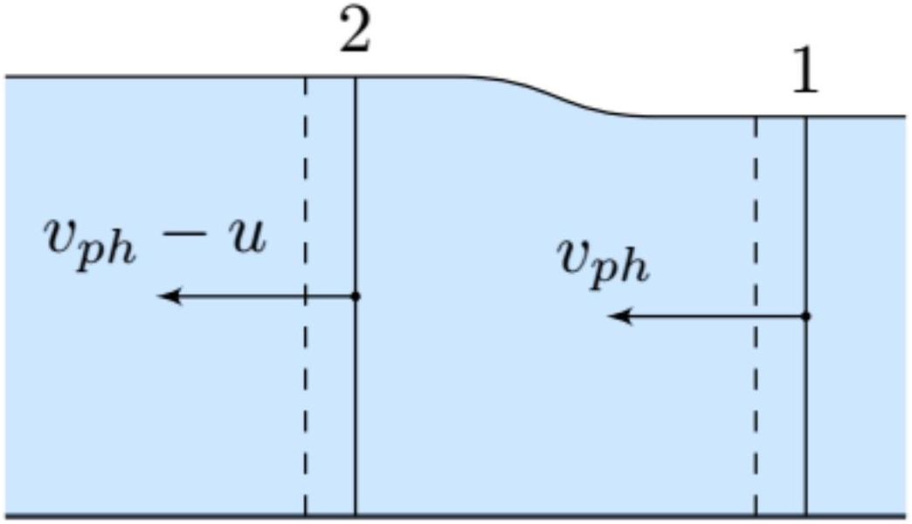
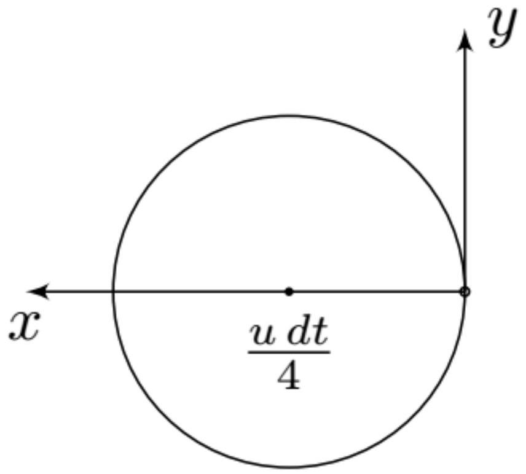

Пусть точка с фазой $\varphi$ двигается по траектории $x ( t )$ :

$$
k x ( t ) - \omega t + \varphi _ { 0 } = \varphi ,
$$

тогда

$$
x ( t ) = \frac { \varphi - \varphi _ { 0 } } { k } + \frac { \omega } { k } t
$$

Ответ:

$$
v _ { p h } = \frac { \omega } { k }
$$

А2 ${ } ^ { 1.00 }$ Предполагая, что существует некоторая функциональная зависимость $\omega ( k )$, найдите групповую скорость через эту функцию в точке $k \approx k _ { 1 } \approx k _ { 2 }$.

Запишем условие на положение максимума волнового пакета $x ( t )$

$$
\frac { d A } { d x } = A _ { 0 } \left[ k _ { 1 } \sin \left( k _ { 1 } x ( t ) - \omega _ { 1 } t - \varphi _ { 1 } \right) + \left( k _ { 1 } + \Delta k \right) \sin \left( \left( k _ { 1 } + \Delta k \right) x ( t ) - \left( \omega _ { 1 } + \frac { d \omega } { d k } \Delta k \right) t - \varphi _ { 2 } \right) \right] = 0 .
$$

Используя формулу $\sin ( \varphi + \Delta \varphi ) \simeq \sin \varphi + \Delta \varphi \cdot \cos \varphi$, с точностью до малых второго порядка получим:

$$
\begin{aligned}
\frac { 1 } { A _ { 0 } } \frac { d A } { d x } & \simeq k _ { 1 } \left[ \sin \left( k _ { 1 } x ( t ) - \omega _ { 1 } t - \varphi _ { 1 } \right) + \sin \left( k _ { 1 } x ( t ) - \omega _ { 1 } t - \varphi _ { 2 } \right) \right] + \\
& + \Delta k \sin \left( k _ { 1 } x ( t ) - \omega _ { 1 } t - \varphi _ { 2 } \right) + \\
& + k _ { 1 } \Delta k \left[ x ( t ) - \frac { d \omega } { d k } t \right] \cos \left( k _ { 1 } x ( t ) - \omega _ { 1 } t - \varphi _ { 2 } \right)
\end{aligned}
$$

Мы изучаем положение максимума, где $\cos \left( k _ { 1 } x ( t ) - \omega _ { 1 } t - \varphi _ { 1 } \right) \approx \cos \left( k _ { 1 } x ( t ) - \omega _ { 1 } t - \varphi _ { 2 } \right) \approx 1$ и $\sin \left( k _ { 1 } x ( t ) - \omega _ { 1 } t - \varphi _ { 1 } \right) \approx \sin \left( k _ { 1 } x ( t ) - \omega _ { 1 } t - \varphi _ { 1 } \right) \approx 0$, поэтому уравнение на положение максимума имеет вид:

$$
x ( t ) = \frac { d \omega } { d k } t
$$

Ответ:

$$
v _ { g } = \frac { d \omega } { d k }
$$

В1 ${ } ^ { 1.00 }$ Найдите скорость распространения волны $v _ { p h }$, если глубина воды $h$.

Воспользуемся стандартным методом нахождения фазовой скорости: перейдем в систему отсчета двигающуюся со скоростью $v _ { p h }$. В этой системе отсчета потоки жидкости являются стационарными. Этот факт заметно упрощает написание физических уравнений.

Во-первых, в силу стационарности в центральной области не должна накапливаться масса, т.е.

$$
\begin{equation*}
v _ { p h } h = \left( v _ { p h } - u \right) ( h + \Delta h ) . \tag{1}
\end{equation*}
$$

Во-вторых, должен выполнять второй закон Ньютона. В качестве рассматриваемого тела выберем область воды между срезами 1 и 2 . За $L$ обозначим толщину системы в направлении перпендикулярном плоскости рисунка. Запишем гидростатические силы $F _ { 1,2 }$, действующие на поверхности 1 и 2 . Будем пренебрегать гидродинамическим давлением.

$$
F _ { 1 } = L \int _ { 0 } ^ { h } \rho g h d h = \rho g L \frac { h ^ { 2 } } { 2 } , \quad F _ { 2 } = L \int _ { 0 } ^ { h + \Delta h } \rho g h d h = \rho g L \frac { ( h + \Delta h ) ^ { 2 } } { 2 } \simeq \rho g L \frac { h ^ { 2 } + 2 h \Delta h } { 2 } .
$$

За время $d t$ правая поверхность 1 сдвинется на $d l _ { 1 } = v _ { p h } d t$, ее масса $d m _ { 1 } = \rho L h d l _ { 1 } = \rho L h v _ { p h } d t$. Аналогично $d m _ { 2 } = \rho L ( h + \Delta h ) \left( v _ { p h } - u \right) d t$. За время $d t$ под действием сил $F _ { 1 }$ и $F _ { 2 }$ импульс рассмотренного объема изменился на $d m _ { 2 } \left( v _ { p h } - u \right) - d m _ { 1 } v _ { p h }$. Значит

$$
\rho g L \frac { h ^ { 2 } } { 2 } d t - \rho g L \frac { h ^ { 2 } + 2 h \Delta h } { 2 } d t = d m _ { 2 } \left( v _ { p h } - u \right) - d m _ { 1 } v _ { p h } .
$$

Подстановка и сокращение дает выражение $g \Delta h = v _ { p h } u$. Если подставить в него уравнение (1) и воспользоваться $\Delta h \ll h$, то получается ответ.

Ответ:

$$
v _ { p h } = \sqrt { g h }
$$

В2 ${ } ^ { 1.00 }$ Найдите скорость распространения волны на глубокой воде. Найденная скорость является фазовой скоростью волны.

Ответ:

$$
v _ { p h } = \sqrt { \frac { g \lambda } { 2 \pi } }
$$

Вз ${ } ^ { 1.00 }$ Найдите дисперсионное соотношение и групповую скорость волн на мелкой воде $v _ { g } ( k )$.

Ответ:

$$
\omega = k \sqrt { g h } , \quad v _ { g } = v _ { p h } = \sqrt { g h }
$$

В4 ${ } ^ { 1.00 }$ Найдите дисперсионное соотношение и групповую скорость волн на глубокой воде $v _ { g } ( k )$.

Длина волны $\lambda$ связана с волновым вектором соотношением $k = \frac { 2 \pi } { \lambda }$, значит

$$
\frac { \omega } { k } = \sqrt { \frac { g } { k } } \Rightarrow \omega = \sqrt { g k }
$$

Ответ:

$$
\omega = \sqrt { g k } , \quad v _ { g } = \frac { 1 } { 2 } \sqrt { \frac { g } { k } } = \frac { v _ { p h } } { 2 }
$$

С1 ${ } ^ { 1.00 }$ Найдите соотношение между фазовой скоростью и скоростью источника, если он должен оставаться в точке постоянной фазы волны.

Точка постоянной фазы двигается со скоростью $\frac { v _ { p h } } { \cos \psi }$, поэтому $u = \frac { v _ { p h } } { \cos \psi }$

$$
u = \frac { v _ { p h } } { \cos \psi }
$$

С2 ${ } ^ { 1.00 }$ Найдите точку в которой будет находиться цуг через время $d t$.

За время $d t$ цуг пройдет расстояние $v _ { g } d t = \frac { 1 } { 2 } v _ { p h } d t$ в направлении под углом $\psi$.

$$
\left\{ \begin{array} { l }
d x = \frac { u } { 2 } \cos ^ { 2 } \psi d t \\
d y = \frac { u } { 2 } \cos \psi \sin \psi d t
\end{array} \right.
$$

с3 ${ } ^ { 1.00 }$ Найдите геометрическое место точек для цугов, испущенных под всевозможными углами.

Воспользуемся формулами двойного угла: $2 \cos ^ { 2 } \psi = 1 + \cos 2 \psi , \cos \psi \sin \psi = \frac { \sin 2 \psi } { 2 }$, тогда

$$
\left\{ \begin{array} { l }
d x = \frac { u } { 4 } ( 1 + \cos 2 \psi ) d t \\
d y = \frac { u } { 4 } \sin 2 \psi d t
\end{array} \right.
$$

Учитывая, что $\psi \in [ - \pi , \pi ]$, гМТ - окружность радиусом $\frac { u d t } { 4 }$ с центром в точке $x = \frac { u d t } { 4 }$.

Ответ:

С4 ${ } ^ { 1.00 }$ Найдите угол раствора конуса, который ограничивает все распространяющиеся волны

За время $d t$ источник сдвигается на расстояние $u d t$, поэтому угол раствора подчиняется соотношению $\sin \alpha = \frac { \frac { 3 } { 4 } u d t } { \frac { 1 } { 4 } u d t } = \frac { 1 } { 3 }$

Ответ:

$$
2 \alpha = 2 \arcsin \frac { 1 } { 3 } \approx 39.0 ^ { \circ }
$$
