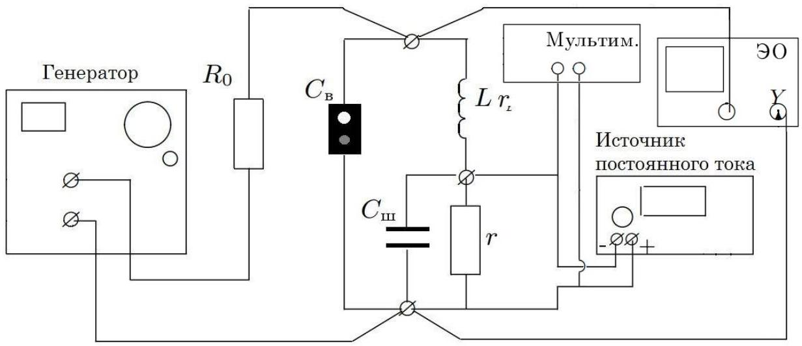
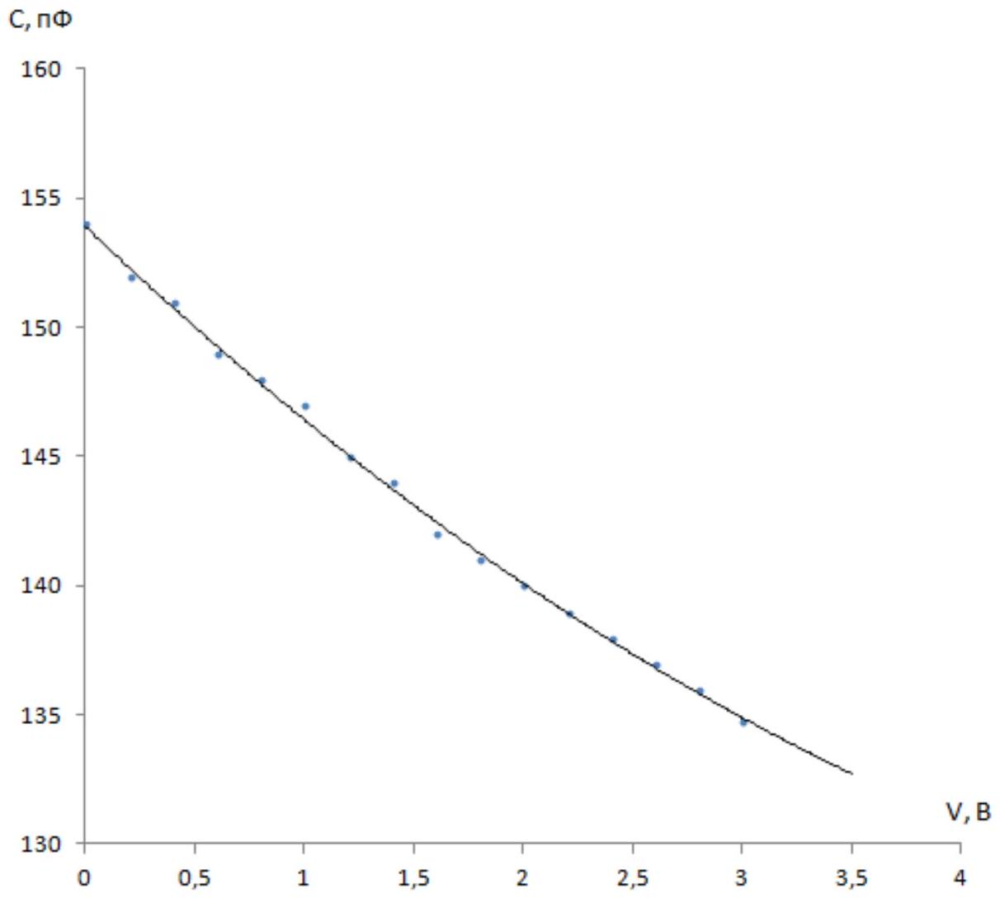
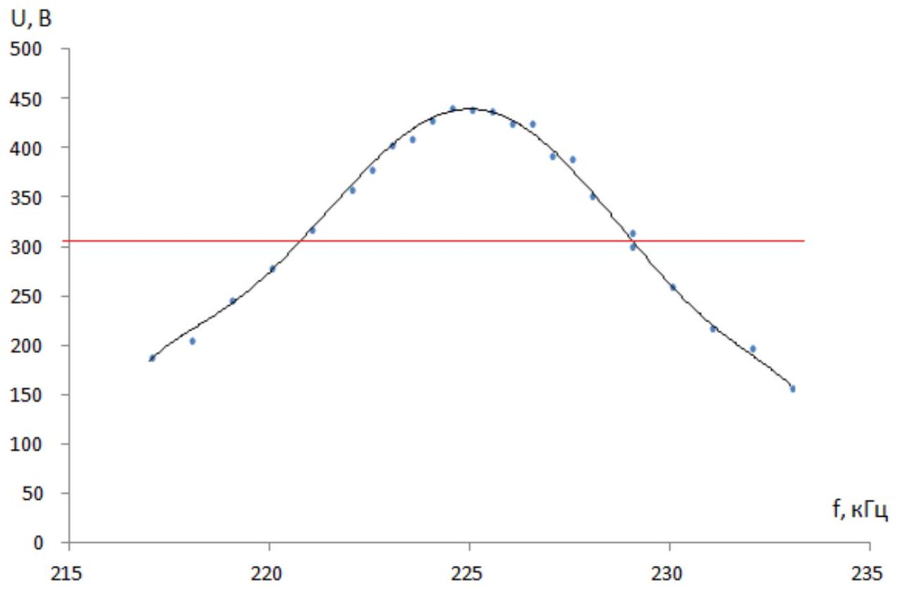
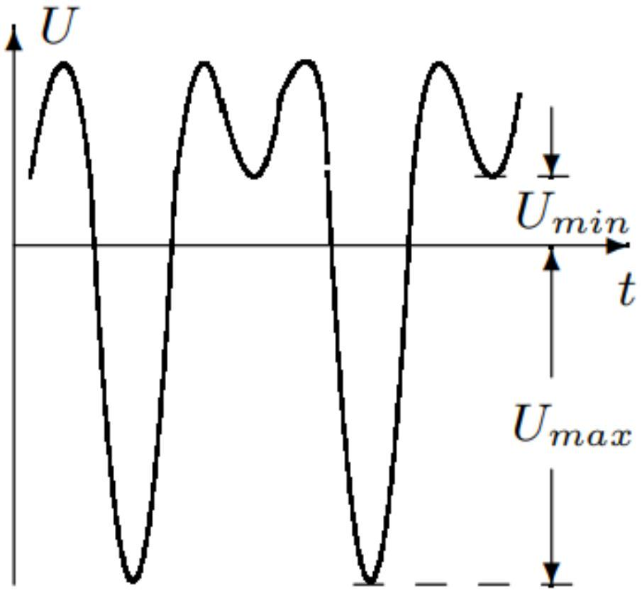
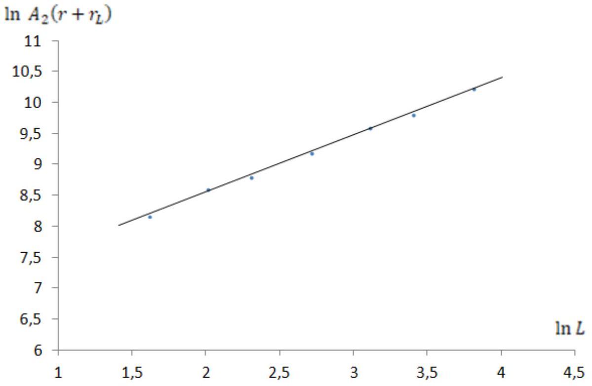
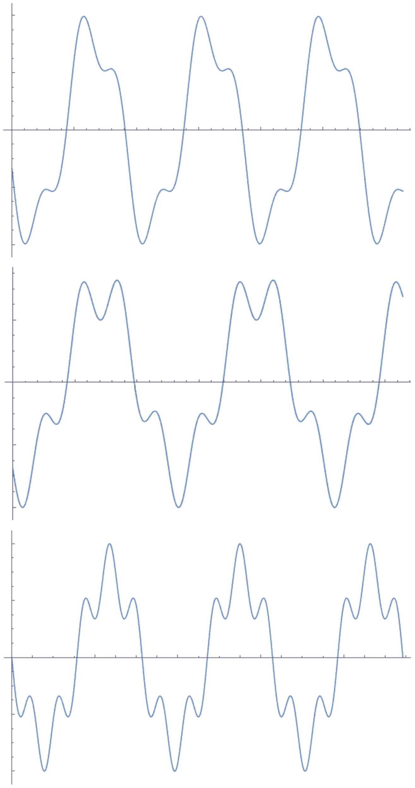

А1 ${ } ^ { 1.20 }$ Установите амплитуду напряжения на генераторе $\mathcal { E } _ { 0 } < 1,0 B$. Снимите зависимость резонансной частоты $f _ { \text {рез } }$ контура от величины постоянного напряжения на варикапе $V _ { 0 }$ в диапазоне от 0 до 3 B .

Собираем установку (рис. 1). Устанавливаем напряжение на генераторе $\mathcal { E } _ { 0 } = 0,9 B$. Подключаем осциллограф и источник постоянного напряжения, мультиметр для измерения $V _ { 0 }$ (рис.3). Меняя частоту входного напряжения, находим резонансную частоту контура по максимуму напряжения на варикапе, для фиксированного значение $V _ { 0 }$.

Рис. 3

| $V , \mathrm {~B}$ | $f$, кГц | $C , п ^ { \Phi }$ |
| :--- | :--- | :--- |
| 0 | 223,4 | 154 |
| 0,2 | 224,4 | 152 |
| 0,4 | 225,5 | 151 |
| 0,6 | 226,9 | 149 |
| 0,8 | 227,8 | 148 |
| 1 | 228,9 | 147 |
| 1,2 | 229,9 | 145 |
| 1,4 | 230,9 | 144 |
| 1,6 | 232,1 | 142 |
| 1,8 | 233,4 | 141 |
| 2 | 234,2 | 140 |
| 2,2 | 235,4 | 139 |
| 2,4 | 236,2 | 138 |
| 2,6 | 237 | 137 |
| 2,8 | 237,8 | 136 |
| 3 | 238,7 | 135 |

А2 ${ } ^ { 0.90 }$ Постройте график зависимости ёмкости схемы от приложенного к нему напряжения $C \left( V + V _ { 0 } \right)$. Определите параметры $\chi$ и $\beta$.

По формуле резонансной частоты колебательного контура $C = \frac { 1 } { ( 2 \pi f ) ^ { 2 } L }$ пересчитываем зависимость $C \left( V _ { 0 } \right)$.

Из касательной графика в нуле находим $\chi$

$$
\chi = ( 4 - 9 ) \cdot 10 ^ { - 12 } \frac { \Phi } { \mathrm {~B} }
$$

Из касательных графика в точках $V _ { 0 } = 0,0 \mathrm {~B}$ и $V _ { 0 } = 2,8 \mathrm {~B}$ :

$$
\begin{gathered}
\beta = \frac { C ^ { \prime } ( 2,8 ) - C ^ { \prime } ( 0,0 ) } { 2 * 2,8 } \\
\beta \sim 10 ^ { - 12 } \div 10 ^ { - 13 } \frac { \Phi } { \mathrm {~B} ^ { 2 } }
\end{gathered}
$$

Снимите резонансную кривую для $V _ { 0 } = 0,3 B$. По полученной зависимости определите добротность контура $Q$.

Устанавливаем напряжение на источнике постоянного напряжения $V _ { 0 } = 0,3 \mathrm {~B}$. Снимаем с осциллографа зависимость $U \sim ( f )$.

| $f$, кГц | $U , \mathrm { mB }$ |
| :--- | :--- |
| 224,5 | 441 |
| 225 | 439 |
| 225,5 | 438 |
| 224 | 429 |
| 226 | 425 |
| 226,5 | 425 |
| 223,5 | 410 |
| 223 | 404 |
| 227 | 393 |
| 227,5 | 389 |
| 222,5 | 378 |
| 222 | 359 |
| 228 | 352 |
| 221 | 318 |
| 229 | 315 |
| 229 | 301 |

| 220 | 279 |
| :--- | :--- |
| 230 | 260 |
| 219 | 246 |
| 231 | 218 |
| 218 | 205 |
| 232 | 198 |
| 217 | 188 |
| 233 | 157 |

Из полученного графика находим ширину контура по напряжению $U _ { \sim } = \frac { U _ { \sim \text {,max } } } { \sqrt { 2 } }$ :

$$
\begin{gathered}
\delta f = 8 \text { кГц } \\
Q = \frac { f _ { 0 } } { \delta f } = 28
\end{gathered}
$$

A4 ${ } ^ { 0.40 }$ Теоретически вычислите добротность контура через его параметры (не используя резонансную кривую).

Из графика пункта А2 находим $C _ { k } ( 0,3 ) = 151,7$ пФ.
Измеряем мультиметром $r + r _ { L } = 33$ Ом

$$
Q = \frac { 1 } { r + r _ { L } } \sqrt { \frac { L } { C _ { k } ( 0,3 ) } } = 140
$$

В1 ${ } ^ { 0.60 }$ Выразите $\gamma$ и $\omega _ { 0 }$ через $r , r _ { L } , C _ { k } , L$.

$$
\begin{aligned}
\gamma & = \frac { r + r _ { L } } { 2 L } \\
\omega _ { 0 } & = \sqrt { \frac { 1 } { L C _ { k } } }
\end{aligned}
$$

В2 ${ } ^ { 0.90 }$ Пусть частота колебаний внешнего напряжения $\omega = \frac { \omega _ { 0 } } { 2 }$. Найдите решение уравнения колебаний переменной составляющей напряжения на варикапе $U _ { 1 }$ в первом(линейном) приближении при слабом затухании ( $\gamma \ll \omega _ { 0 }$ ).

В первом(линейном) приближении при слабом затухании ( $\gamma \ll \omega _ { 0 }$ ) пренебрегаем членами $\alpha ^ { \prime } U ^ { 2 }$ и $2 \gamma \dot { U }$. Получаем уравнение:

$$
\ddot { U } + \omega _ { 0 } ^ { 2 } U = - \omega _ { 0 } ^ { 2 } U _ { 0 } \sin \left( \frac { \omega _ { 0 } } { 2 } t \right)
$$

Решаем полученное уравнение:

$$
U _ { 1 } = - \frac { 4 } { 3 } U _ { 0 } \sin \left( \frac { \omega _ { 0 } t } { 2 } \right)
$$

Вз ${ } ^ { \mathbf { 0 . 6 0 } }$ При учете нелинейных членов(во втором приближение) решение уравнения колебаний переменной составляющей напряжения на варикапе представляет суперпозицию $U = U _ { 1 } + U _ { 2 }$. Получите уравнение колебаний для $U _ { 2 }$ в терминах $\alpha ^ { \prime } , \gamma , \omega _ { o } , U _ { 0 }$.

Подставляем в исходное уравнение $U = U _ { 1 } + U _ { 2 }$ :

$$
\ddot { U } _ { 2 } + 2 \gamma \dot { U } _ { 2 } + \omega _ { 0 } ^ { 2 } U _ { 2 } + \omega _ { 0 } ^ { 2 } U _ { 0 } \sin ( \omega t ) - \alpha ^ { \prime } U _ { 2 } ^ { 2 } = \alpha ^ { \prime } U _ { 1 } ^ { 2 } + 2 \alpha ^ { \prime } U _ { 1 } U _ { 2 }
$$

Подставляем найденное первое приближение $U _ { 1 } = - \frac { 4 } { 3 } U _ { 0 } \sin \left( \frac { \omega _ { 0 } t } { 2 } \right)$ :

$$
\ddot { U } _ { 2 } + 2 \gamma \dot { U } _ { 2 } + \omega _ { 0 } ^ { 2 } U _ { 2 } - \alpha ^ { \prime } U _ { 2 } ^ { 2 } = \frac { 8 \alpha ^ { \prime } } { 9 } U _ { 0 } ^ { 2 } - \frac { 8 \alpha ^ { \prime } } { 9 } U _ { 0 } ^ { 2 } \cos \left( \omega _ { 0 } t \right) - \frac { 8 \alpha ^ { \prime } } { 3 } U _ { 0 } U _ { 2 } \sin \left( \frac { \omega _ { 0 } t } { 2 } \right)
$$

B4 ${ } ^ { 0.90 }$ Считая, что $U _ { 1 } \gg U _ { 2 }$ найдите из полученного в пункте B3 уравнения поправку $U _ { 2 }$ к напряжению на варикапе.

Пренебрегаем $2 \alpha ^ { \prime } U _ { 1 } U _ { 2 }$ по сравнению с $\alpha ^ { \prime } U _ { 1 } ^ { 2 }$ получаем:

$$
\ddot { U } _ { 2 } + 2 \gamma \dot { U } _ { 2 } + \omega _ { 0 } ^ { 2 } U _ { 2 } - \alpha ^ { \prime } U _ { 2 } ^ { 2 } = \frac { 8 \alpha ^ { \prime } } { 9 } U _ { 0 } ^ { 2 } - \frac { 8 \alpha ^ { \prime } } { 9 } U _ { 0 } ^ { 2 } \cos \left( \omega _ { 0 } t \right)
$$

Ищем решение в виде $U _ { 2 } = A + B \sin \left( \omega _ { 0 } t \right)$. Получаем конечное выражение для поправки $U _ { 2 } = - \frac { 8 \alpha ^ { \prime } } { 9 \omega _ { 0 } ^ { 2 } } U _ { 0 } ^ { 2 } - \frac { 4 \alpha ^ { \prime } } { 9 \gamma \omega _ { 0 } } U _ { 0 } ^ { 2 } \sin \left( \omega _ { 0 } t \right)$.

В5 1.00 Установите частоту генератора $\omega = \frac { \omega _ { 0 } } { 2 }$. Снимите экспериментальную зависимость амплитуды $A _ { 2 }$ колебаний с частотой $\omega _ { 0 }$ от индуктивности в цепи.

Собираем схему (рис. 3). Находим резонансную частоту $\omega _ { 0 }$ контура по максимуму колебаний напряжения на варикапе. Устанавливаем частоту генератора $\omega = \frac { \omega _ { 0 } } { 2 }$. Снимаем зависимость амплитуды $A _ { 2 }$ колебаний с частотой $\omega _ { 0 }$ от индуктивности в цепи.

$$
A _ { 2 } = \frac { U _ { \max } - U _ { \min } } { 2 }
$$

| $L$, мГн | $A _ { 2 } , \mathrm { mB }$ |
| :--- | :--- |
| 15 | 276 |
| 30 | 310 |
| 45 | 334 |
| 7,5 | 210 |
| 5 | 170 |
| 10 | 238 |
| 22,5 | 300 |

В6 ${ } ^ { 0.60 }$ Пусть $A _ { 2 } \propto L ^ { \xi }$. Из теоретической формулы для $A _ { 2 }$ получите значение $\xi$.

Из пункта В4:

$$
\begin{gathered}
U _ { 2 } = - \frac { 8 \alpha ^ { \prime } } { 9 \omega _ { 0 } ^ { 2 } } U _ { 0 } ^ { 2 } - \frac { 4 \alpha ^ { \prime } } { 9 \gamma \omega _ { 0 } } U _ { 0 } ^ { 2 } \sin \left( \omega _ { 0 } t \right) \\
\alpha ^ { \prime } \sim \frac { 1 } { L } \\
U _ { 0 } ^ { 2 } \sim L \\
\omega _ { 0 } \sim \frac { 1 } { \sqrt { } \bar { L } } \\
\gamma \sim \frac { r + r _ { L } } { L } \\
U _ { 2 } \sim L \left( \frac { 3 } { 2 } \right) \\
\xi = \frac { 3 } { 2 }
\end{gathered}
$$

В7 ${ } ^ { 1.00 }$ Найдите значение $\xi$ по измеренной зависимости $A _ { 2 } ( L )$

Из пункта В6 видно, что амплитуда колебаний $A _ { 2 }$ зависит от $L$ и $r _ { L }$ параметров катушки включенной в цепь. Измеряем мультиметром $r + r _ { L }$ для различных значений $L$. Строим график $\ln \left( A _ { 2 } \left( r + r _ { L } \right) \right)$ от $\ln L$.

| $L , \mathrm { м } Г \mathrm { H }$ | $A _ { 2 } , \mathrm { mB }$ | $r + r _ { L }$, Om | $\ln A _ { 2 } \left( r + r _ { L } \right)$ | $\ln L$ |
| :--- | :--- | :--- | :--- | :--- |
| 15 | 276 | 36 | 9,2 | 2,71 |
| 30 | 310 | 59 | 9,81 | 3,4 |
| 45 | 334 | 83 | 10,23 | 3,81 |
| 7,5 | 210 | 26 | 8,61 | 2,01 |
| 5 | 170 | 21 | 8,18 | 1,61 |
| 10 | 238 | 28 | 8,8 | 2,3 |
| 22,5 | 300 | 49 | 9,6 | 3,11 |

Из коэффициента наклона графика получаем $\xi = 0,9$.

В8 ${ } ^ { 0,90 }$ Установите на варикапе $V _ { 0 } = 0,3 \mathrm {~B}$, амплитуду генератора $\mathcal { E } _ { 0 } = 12 \mathrm {~B}$. Зарисуйте зависимости переменного напряжения на варикапе от времени для $\omega = \frac { \omega _ { 0 } } { n }$ для $n = 3,4,5$.

