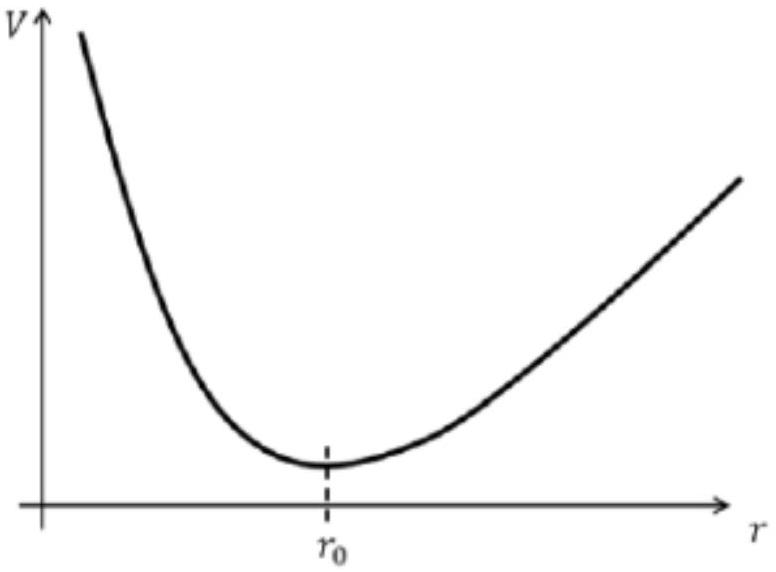
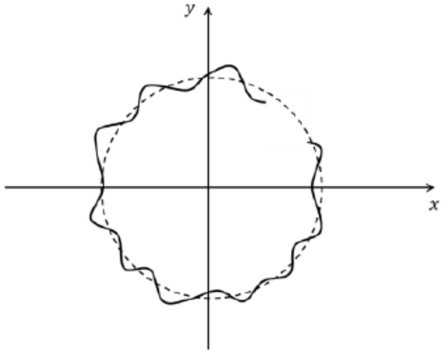

Запишем второй закон Ньютона в проекции на линию, проходящую через электроны. Поскольку расстояние не меняется, ускорение равно $\frac { v ^ { 2 } } { r }$. Получаем в итоге уравнение:

$$
\frac { 2 m v ^ { 2 } } { d } = v B e - \frac { e ^ { 2 } } { 4 \pi \varepsilon _ { 0 } d ^ { 2 } }
$$

Решаем квадратное уравнение относительно $v$. Дискриминант этого уравнения равен $( B e ) ^ { 2 } - \frac { 2 m e ^ { 2 } } { \pi \varepsilon _ { 0 } d ^ { 3 } }$.
Из дискриминанта видно, что решения для скорости существуют только для $d \geqslant 2 \sqrt [ 3 ] { \frac { m } { 4 \pi \varepsilon _ { 0 } B ^ { 2 } } }$. Это и будет минимальное возможное расстояние.

A2 ${ } ^ { 0.50 }$ Найдите скорость $v _ { m }$, которую нужно сообщить электронам, чтобы при их движении между ними сохранялось найденное в А1 расстояние $d _ { \min }$.

Так как дискриминант равен нулю:

$$
v _ { m } = - \frac { b } { 2 a } = \frac { B e } { 2 m } d _ { \min } = \frac { e } { 2 } \sqrt [ 3 ] { \frac { B } { 4 \pi \varepsilon _ { 0 } m ^ { 2 } } }
$$

В1 ${ } ^ { 0.50 }$ Найдите угловую скорость центра масс $\omega$ во время движения электронов.

Центр масс движется под действием двух сил Лоренца:

$$
m \vec { a } = \left[ \vec { v } _ { 1 } \times \vec { B } \right] q + \left[ \vec { v } _ { 2 } \times \vec { B } \right] q = \left[ \left( \vec { v } _ { 1 } + \vec { v } _ { 2 } \right) \times \vec { B } \right] q = 2 \left[ \vec { v } _ { C M } \times \vec { B } \right] q
$$

Так как других внешних сил нет,скорость центра масс поворачивается, но не меняется по модулю. Ускорение центра масс в таком случае равно $\vec { \omega } \times \vec { v }$

$$
\begin{gathered}
2 m \left[ \vec { \omega } _ { C M } \times \vec { v } \right] \equiv 2 \left[ \vec { v } _ { C M } \times \vec { B } \right] q \\
\omega _ { C M } = \frac { B e } { m }
\end{gathered}
$$

В2 ${ } ^ { 1.00 }$ Найдите время, через которое у обоих электронов сравняются абсолютные значения скорости в первый раз.

При движении, описанном в условии, кинетическая энергия сохраняется. Таким образом угловая скорость относительно центра масс не меняется.

$$
\omega = \frac { v _ { 0 } } { d _ { 1 } }
$$

Скорость центра масс и относительная скорость равны, поэтому скорости электронов сравняются, когда угол между скоростью центра масс и относительной скоростью станет равным $\frac { \pi } { 2 }$.

$$
t = \frac { \pi } { 2 } \frac { 1 } { \left| \frac { v _ { 0 } } { d _ { 1 } } - \frac { e B } { m } \right| }
$$

С1 ${ } ^ { 0.20 }$ Получите выражение для кинетической энериии одного электрона $K = K \left( m , v _ { r } , \omega , r \right)$, где $v _ { r } = \frac { d r } { d t } , \omega = \frac { d \theta } { d t }$, а $r$ и $\theta$ - задают положение электрона в системе центра масс.

$$
K = \frac { m } { 2 } \left( \omega ^ { 2 } r ^ { 2 } + v _ { r } ^ { 2 } \right)
$$

С2 ${ } ^ { 0.80 }$ Найдите, чему равна производная момента импульса по времени $\frac { d L } { d t }$ при движении электронов.

Момент импульса меняется за счет составляющей силы Лоренца, отвечающей радиальной составляющей скорости.

$$
\frac { d L } { d t } = v _ { r } B e r
$$

с3 ${ } ^ { 0.50 }$ Найдите интеграл движения для рассматриваемого случая, т.е. найдите такую функцию $J$, для которой справедливо $\frac { d J } { d t } = 0$.

Интегрируя выражение для $\frac { d L } { d t }$ получаем интеграл движения

$$
J = L - \frac { e B r ^ { 2 } } { 2 }
$$

С4 ${ } ^ { 1.00 }$ Выразите полную энергию электрона в виде $E = K \left( v _ { r } \right) + U ( r )$. Выразите ее через $J , e , B , r$ и физические постоянные.

Выражаем угловую скорость через $J$, затем подставляем в выражение для кинетической энергии. $\omega = \frac { 1 } { m } \left( \frac { J } { r ^ { 2 } } + \frac { e B } { 2 } \right)$.
К кинетической энергии надо добавить энергию кулоновского взаимодействия, приходящуюся на один электрон.

$$
E = \frac { m v _ { r } ^ { 2 } } { 2 } + \frac { r ^ { 2 } } { 2 m } \left( \frac { J } { r ^ { 2 } } + \frac { e B } { 2 } \right) ^ { 2 } + \frac { e ^ { 2 } } { 16 \pi \varepsilon _ { 0 } r }
$$

С5 ${ } ^ { 0.50 }$ Схематично изобразите график зависимости $U ( r )$, укажите его характерные особенности.

Пределы $U ( r )$ в точках 0 и $+ \infty$ равны $+ \infty$, при этом функция непрерывна на отрезке $( 0 , + \infty )$
Вторая производная функции $U ( r )$ имеет следующий вид:

$$
\frac { A r ^ { 4 } + B r + C } { r ^ { 4 } } ; A , B , C , r > 0
$$

На интересующем нас отрезке она всегда больше нуля, оба предела бесконечные, следовательно есть минимум, причем единственный.

С6 ${ } ^ { 1.00 }$ Разложите функцию $U ( r )$ в ряд Тейлора до первого нетривиального члена вблизи особых точек из пункта С5. Основываясь на разложении, схематично изобразите траекторию электронов, которым сообщили небольшую радиальную компоненту скорости $v _ { r 0 }$ вдобавок к скорости движения по окружности $v _ { 0 }$.

Так как мы будем оставаться в окрестности минимума, электроны будут совершать гармонические колебания вдоль радиуса.

