Если луч падает под углом Брюстера, то отражённый луч перпендикулярен прошедшему, а значит $\operatorname { tg } ( \alpha ) = n$.

А2 ${ } ^ { 1.50 }$ Определите угол Брюстера экспериментально. Нарисуйте схему вашей экспериментальной установки, приведите результаты измерений и ваш ответ.

Если разместить пластинку так, что бы луч падал под углом Брюстера, то отражённый свет будет полностью поляризованным. С помощью поляризатора мы можем проверить, является свет полностью поляризованным или нет: если он полностью поляризован, то будет существовать положение поляризатора, при котором свет полностью не проходит через поляризатор.
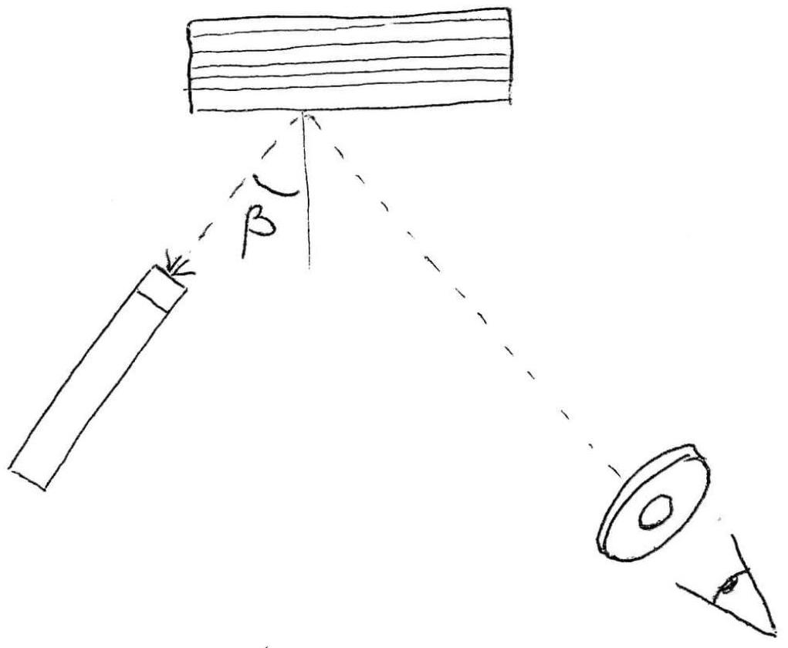

А3 ${ } ^ { 1.00 }$ Нарисуйте схему вашей экспериментальной установки.
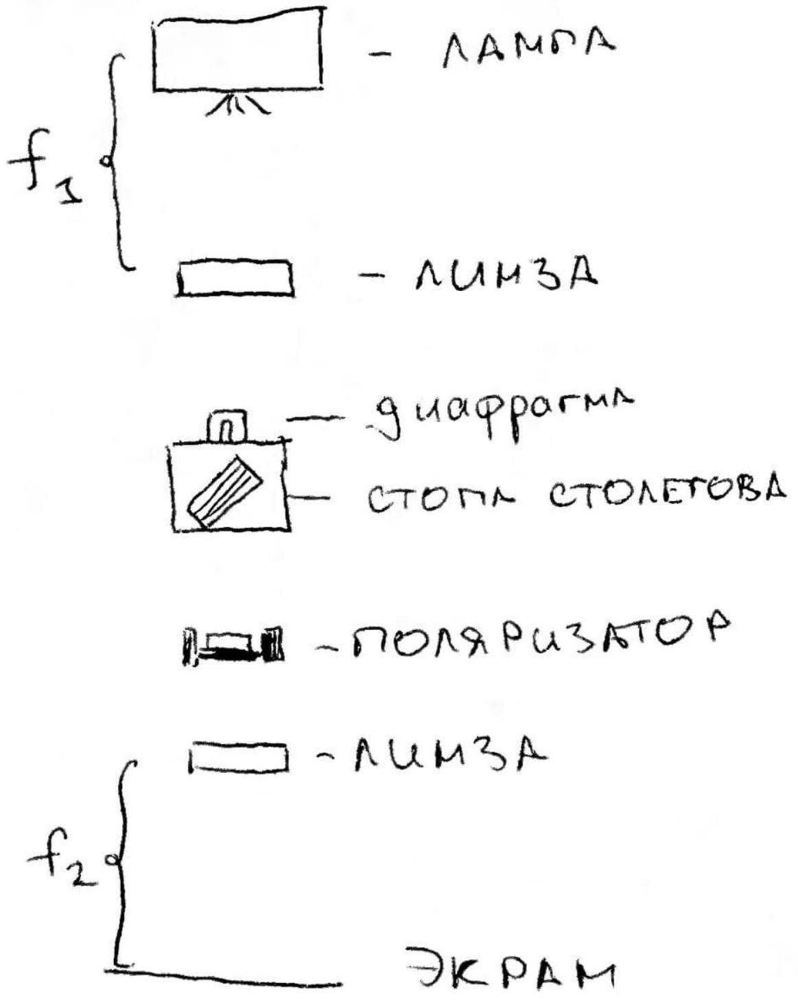

A4 ${ } ^ { 2.00 }$ Как вы могли заметить, если частично поляризованный свет рассматривать через поляризатор, то наблюдаемая интенсивность света будет зависеть от ориентации поляризатора. Степенью поляризации называется величина $P = \frac { I _ { \max } - I _ { \min } } { I _ { \max } + I _ { \min } }$, где минимальная и максимальная величина интенсивности соответствуют определённым положениям поляризатора.

Для каждого размера стопы Столетова (от 1 до 10 стёкол) определите степень поляризации прошедшего через нее света.

| Число стёкол | U(min), mV | U(max), mV | P |
| :--- | :--- | :--- | :--- |
| 1 | 680 | 727 | 0,033 |
| 2 | 545 | 644 | 0,083 |
| 3 | 442 | 537 | 0,097 |
| 4 | 351 | 469 | 0,144 |
| 5 | 300 | 425 | 0,172 |
| 6 | 249 | 391 | 0,222 |
| 7 | 192 | 334 | 0,270 |
| 8 | 179 | 319 | 0,281 |
| 9 | 144 | 283 | 0,326 |
| 10 | 118 | 245 | 0,350 |

Зависимость Р от количества стёкол
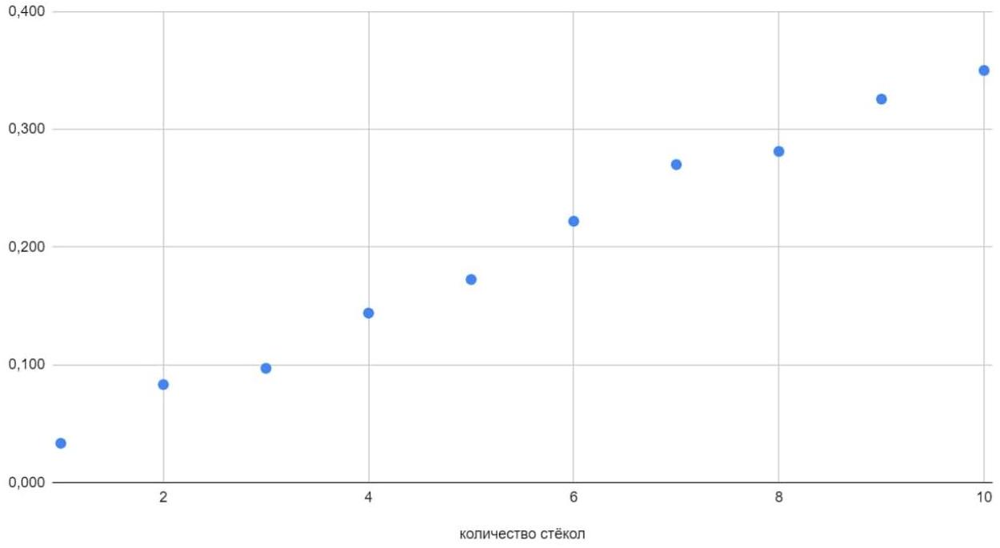

А5 ${ } ^ { 1.50 }$ Какое число пластин необходимо использовать для получения степени поляризации $95 \%$ ?

Полученную зависимость $P ( n )$ некорректно описывать прямой линией, несмотря на то, что измерения, проведенные в узком диапазоне степеней поляризации, ложатся на прямую. Линейная экстраполяция на большие $n$ может привести к получению степени поляризации $P > 1$, что нефизично. Разумнее приближать зависимость какой-нибудь возрастающей функцией, стремящейся к единице при $n \rightarrow \infty$. Например, разумное предположение: $P = 1 - q ^ { n }$, где $q$ показывает, какая часть света остаётся неполяризованной после прохождения через одну пластинку. Для определения $q$ необходимо построить график $\ln ( 1 - P )$ от $n$. Экстраполируя этот график, можно получить значение $n$, при котором $P = 0.95$ :

Зависимость $\ln ( 1 - \mathrm { P } )$ от количества стёкол
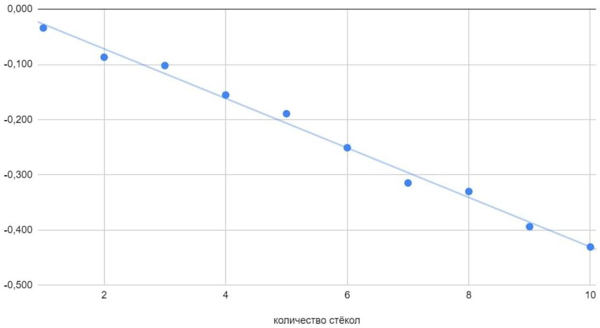

$n _ { 0.95 } \approx 67$

В1 ${ } ^ { 3.00 }$ Измерьте зависимость поворота плоскости поляризации от толщины слоя сиропа. Схематично изобразите вашу установку, приведите результаты всех измерений. Измерения следует провести при освещении раствора как красным, так и зеленым лазером (по отдельности). Точки обеих зависимостей нанесите на один график.

Соберем следующую установку (см. ниже). Лазер поляризован не полностью, поэтому для более точных измерений размещаем после лазера поляризатор. При измерениях будем поворотом второго поляризатора подбирать такой угол, при котором луч лазера не проходит через него. Изменение такого угла по мере подливания сахарного сиропа и показывает, насколько повернулась плоскость поляризации падавшего луча. Измерим данный угол при различных высотах столба сиропа для красного и зелёного лазеров. Построим график и определим значения обоих угловых коэффициентов.

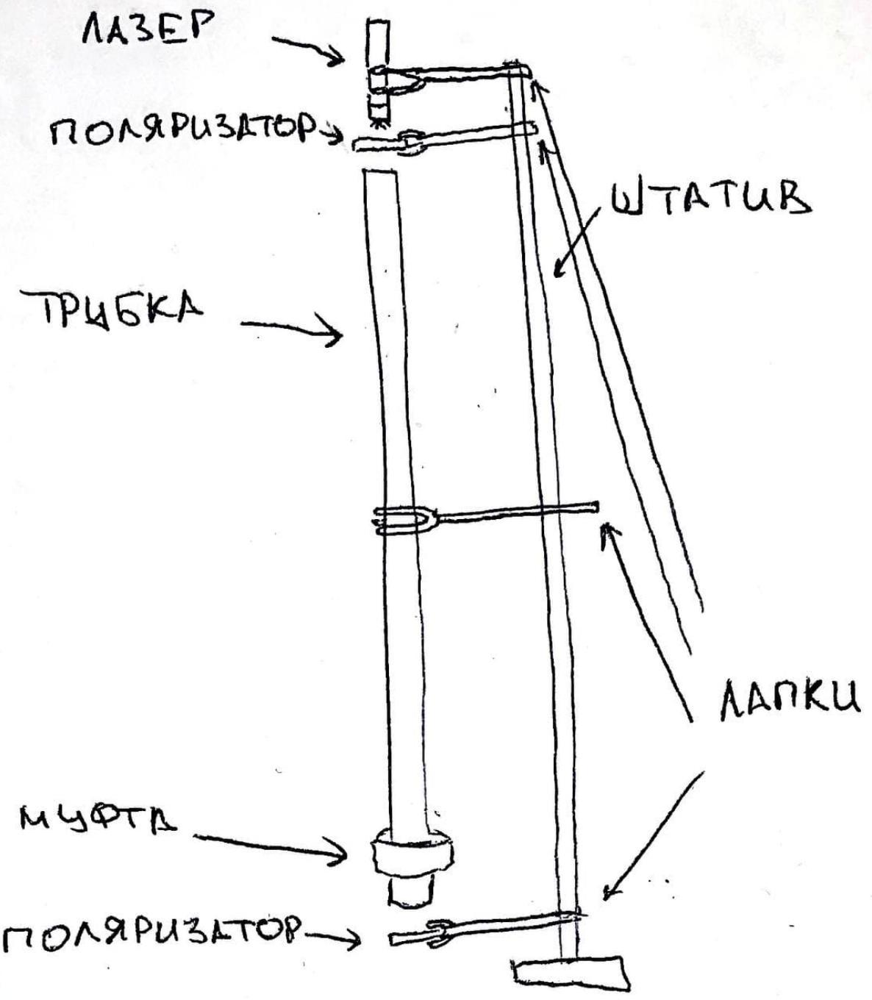

| h, см | угол (кр. лазер) | h, см | угол (зел. лазер) |
| :--- | :--- | :--- | :--- |
| 1,4 | 0 | 0,7 | 0 |
| 3,5 | 6 | 2,6 | 4 |
| 4,8 | 8 | 4,5 | 14 |
| 7,4 | 15 | 6,4 | 18 |
| 9,7 | 20 | 8,9 | 29 |
| 10,9 | 27 | 11,5 | 41 |
| 14,5 | 37 | 15,3 | 57 |
| 18,6 | 47 | 18,4 | 64 |
| 22,2 | 55 | 21,0 | 72 |
| 26,5 | 61 | 27,1 | 97 |

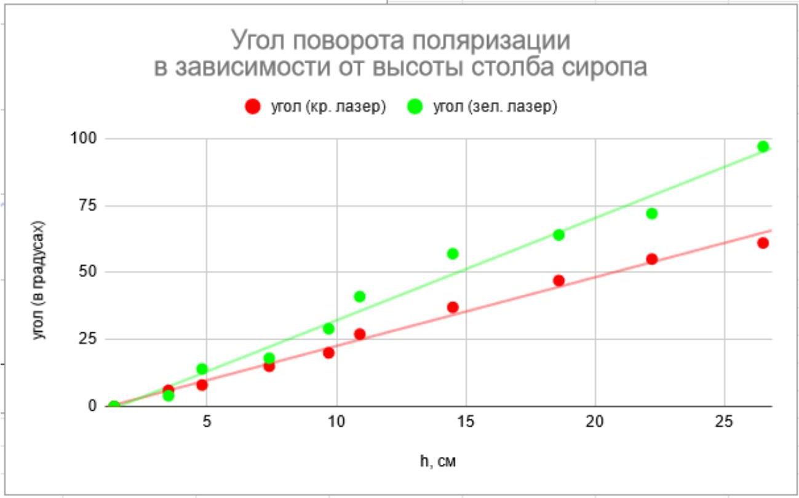

B2 ${ } ^ { 1.00 }$ Определите параметры полученных для разных лазеров зависимостей.

$$
\begin{aligned}
& { \frac { \partial \varphi } { \partial h _ { \text {кр } } } } = 2,4 \frac { 1 ^ { \circ } } { \mathrm { CM } } \\
& { \frac { \partial \varphi } { \partial h _ { \text {зел } } } } = 3,7 \frac { 1 ^ { \circ } } { \mathrm { CM } }
\end{aligned}
$$

C1 ${ } ^ { 0.50 }$ Схематично зарисуйте и опишите эксперимент, позволяющий отличить друг от друга пластинки $\lambda / 2$ и $\lambda / 4$.

Для каждой пластинки определим сначала направление оси (и перпендикулярной к ней прямой). Для этого поместим пластинку между скрещенными поляризаторами и подберем такие положения пластинки, при котрых свет не будет проходить через эту систему, как и в отсутствие пластинки. Такие положения соответствуют совпадению одного из выделенных направлений пластинки с разрешенным направлением первого поляризатора. Если после этого

повернуть пластинку на $45 ^ { \circ }$, то в случае $\lambda / 2$ на выходе из пластинки мы получим линейно поляризованный свет, а в случае $\lambda / 4$ - свет, поляризованный по кругу. Линейную поляризацию отличить от круговой легко, поворачивая второй поляризатор.
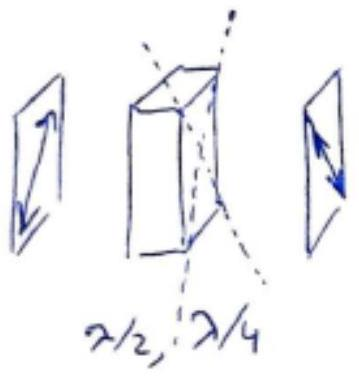

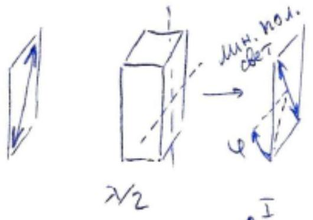
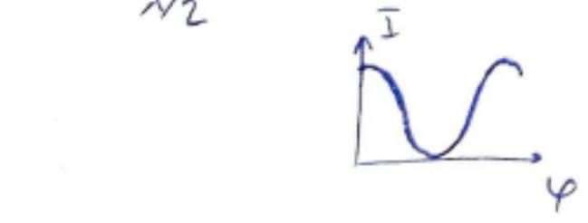
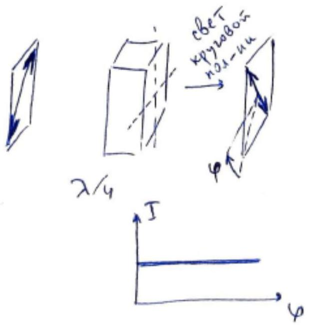

С2 ${ } ^ { 1.00 }$ Схематично зарисуйте и опишите эксперимент, позволяющий отличить одномодовую полуволновую пластинку $\left( \Delta n \cdot l = \frac { 1 } { 2 } \lambda \right)$ от многомодовой $\left( \Delta n \cdot l = \left( m + \frac { 1 } { 2 } \right) \lambda \right)$.

Пластинка $\lambda / 2$ корректно работает для света определенной длины волны. Однако существуют, в том числе, такие длины волн, для которых пластинка превращается в $\lambda$, т.е. не работает как кристаллическая пластинка. Например, такие длины волн не пройдут через систему из скрещенных поляризаторов и наклоненную под 45° пластинку между ними. Чтобы обнаружить такие области спектра, для которых пластинка кратна $\lambda$, систему из поляризаторов и пластинки следует освещать светом лампы, разложенным дифракционной решеткой. При использовании многомодовой пластинки будет видна "пятнистая радуга" (с минимумами на искомых длинах волн), а при использовании одномодовой минимумы будут отсутствовать, потому что необходимая для них длина волны $\lambda _ { 1 }$ должна отличаться от расчетной $\lambda _ { 0 }$ как минимум в 2 раза: $\Delta n \cdot l = \frac { 1 } { 2 } \lambda _ { 0 } = \lambda _ { 1 }$. А видимый спектр не содержит длин волн, отличающихся в 2 раза.
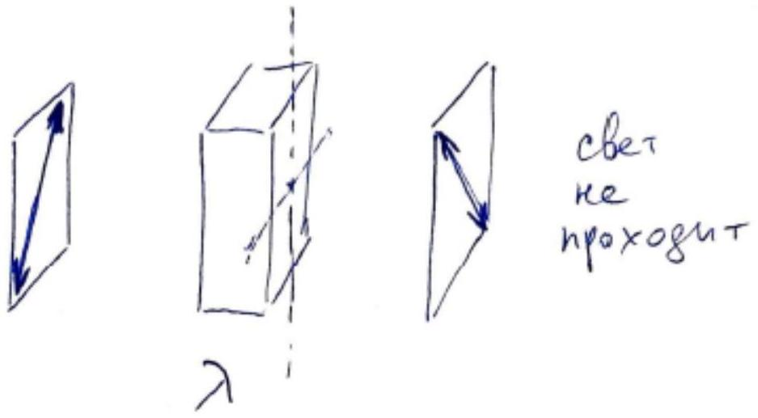

с3 ${ } ^ { 5.00 }$ В таблице в листе ответов отметьте, каким типам пластинок соответствуют пластинки №1, №2. Для каждой пластинки определите и запишите в таблицу направление оптической оси (с точностью до поворота на угол, кратный $90 ^ { \circ }$ ). Если среди пластинок есть многомодовые, для них рассчитайте числа $m$. Опишите все ваши действия и наблюдения, приведите результаты всех измерений и обоснования всех ответов.

Пластинка №1 - полуволновая многомодовая, оптическая ось проходит через отметку $30 ^ { \circ }$. Пластинка №2 - четвертьволновая многомодовая, оптическая ось проходит через 120°. Схема установки, позволяющей рассчитать $m$, приведена на рисунке. Нулевой максимум диф. решетки уведён с оси, сквозь поляризаторы и пластинку рассматривается спектр первого порядка. На фотографии экрана видна типичная для обеих пластин картина - "пятнистая радуга".

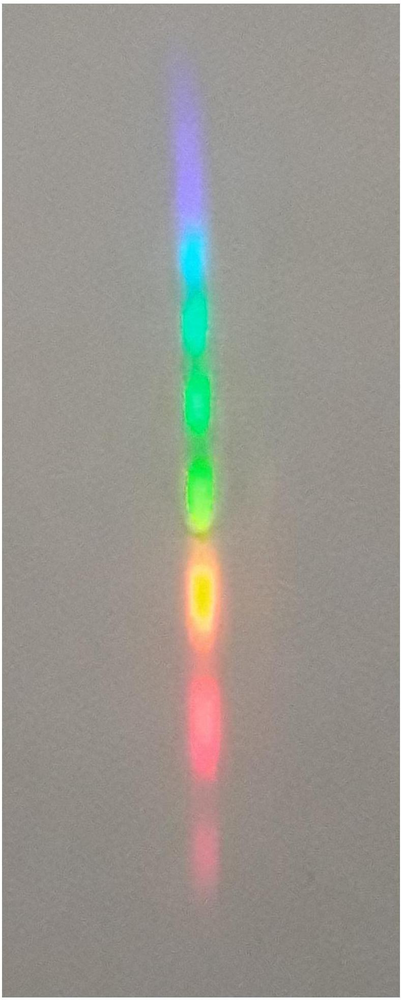
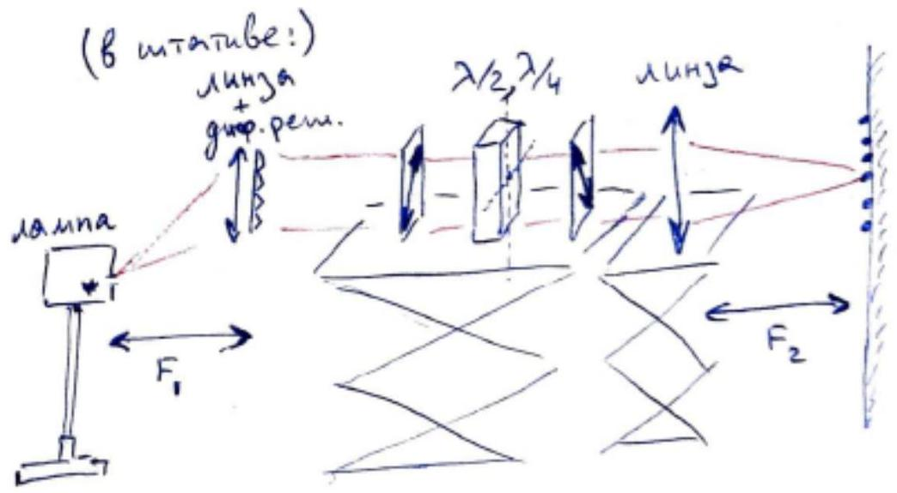

Пусть $\lambda _ { 0 } \approx 532$ нМ - длина волны, соответствующая темному пятну в зеленой части "пятнистой радуги", $\left( \lambda _ { 0 } + \delta \lambda \right)$ - длина волны для соседнего темного пятна. Тогда для этих двух длин волн можно записать:

$$
\begin{gathered}
\Delta n \cdot l = m \lambda _ { 0 } = ( m - 1 ) \left( \lambda _ { 0 } + \delta \lambda \right) \\
\lambda _ { 0 } = ( m - 1 ) \delta \lambda
\end{gathered}
$$

Либо, для увеличения точности измерения расстояния между пятнами, можно выбирать несоседние.
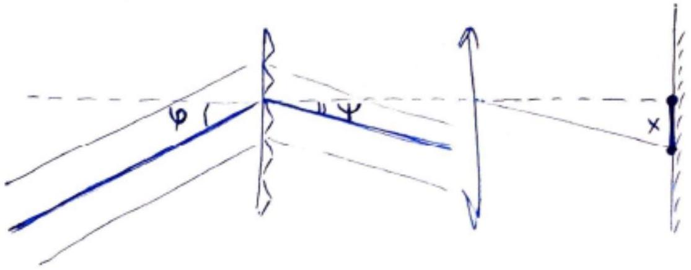

Отдельным простым экспериментом следует определить период диф. решетки: $d = \frac { 1 } { 500 }$ мМ. Выведем связь между расстоянием между пятнами на экране и сектральным расстоянием $\delta \lambda$ между соответствующими длинами волн (см. рис. выше):

$$
\sin \varphi + \sin \psi = \frac { \lambda } { d }
$$

$$
d \psi \cdot \cos \psi = \frac { \delta \lambda } { d } ,
$$

причем $\psi \ll 1$, поэтому $\cos \psi \approx 1$. Пусть $F$ - фокусное расстояние линзы, фокусирующей "пятнистую радугу" на экран. Тогда:

$$
\frac { d x } { F } = d \psi = \frac { \delta \lambda } { d } .
$$

Объединяем полученные два соотношения:

$$
\frac { d x } { F } = \frac { \lambda _ { 0 } } { ( m - 1 ) d } .
$$

Окончательная расчетная формула:

$$
m = \frac { \lambda _ { 0 } \cdot F } { d \cdot d x } + 1 .
$$

Экспериментально определенные $m$ для обеих пластин: $m _ { \lambda / 2 } = m _ { \lambda / 4 } = 17$.

С4 ${ } ^ { 0.50 }$ Пользуясь приведенной таблицей, укажите вещество, из которого, по Вашему мнению, сделаны пластинки, если их толщина $l \approx 1$ мм.

$$
\Delta n = \frac { \left( 17 + \frac { 1 } { 2 } \right) \cdot 532 \text { нМ } } { 1 \text { мМ } } \approx 0.009 , \text { что соответствует кварцу. Материал четвертьволновой пластины - тоже кварц. }
$$

C5 ${ } ^ { 1.00 }$ Предположите наиболее простое устройство 3D-очков №1. Предложите технологию создания стереоскопического (кажущегося объемным) изображения плоским экраном с помощью этих очков.

Очки №1 предназначены для пропускания волн разной круговой поляризации. Внешняя сторона их "глаз" - пластинки $\lambda / 4$ с осями, наклоненными под $45 ^ { \circ }$ к вертикали, причем пластинки в разных "глазах" развернуты под 90° друг к другу. Внутренняя сторона каждого из "глаз" - линейный поляризатор с горизонтальным разрешенным направлением. Обе четвертьволновые пластинки превращают поляризованный по одному из круговых направлений свет в линейно поляризованный, который затем проходит сквозь поляризатор лишь в одном из "глаз" очков. Другая круговая поляризация пройдет сквозь другой "глаз".

Для иллюзии объема разным глазам должны транслироваться отличающиеся точкой съемки картинки (так работает бинокулярное зрение). Поэтому в 3D-кинотеатрах, для которых предназначены очки №1, экран должен создавать эти две картинки, излучая (либо построчно, либо по очереди) волны с разной круговой поляризацией.

C6 ${ } ^ { 1.00 }$ Предположите наиболее простое устройство 3D-очков №2. Предложите технологию создания стереоскопического (кажущегося объемным) изображения плоским экраном с помощью этих очков.

Очки №1 пропускают волны разной линейной поляризации. В этих очках внешняя сторона каждого "глаза", как легко обнаружить экспериментально, это поляризатор, наклоненный под $45 ^ { \circ }$ к вертикали, причем поляризаторы в двух "глазах" скрещены. Однако прислонение поляризатора к внутренней стороне очков не позволяет добиться полного затемнения: в окрестности скрещенного положения наблюдается поочередное затемнение разных частей спектра. Таким образом, судя по всему, в "глазах" очков к поляризаторам с внутренней стороны примыкают некоторые кристаллические пластинки, по своему действию больше всего похожие на пластинки $\lambda$.

В 3D-кинотеатрах, для которых предназначены очки №2, экран излучает волны с разными линейными поляризациями для разных глаз. Поляризации этих волн перпендикулярны друг другу и направлены под $45 ^ { \circ }$ к вертикали. Разрешенные направления поляризаторов в очках должны совпадать с этими направлениями, поэтому такая технология более чувствительна к наклону головы, чем другая, использующая круговую поляризацию, и считается более устаревшей.
