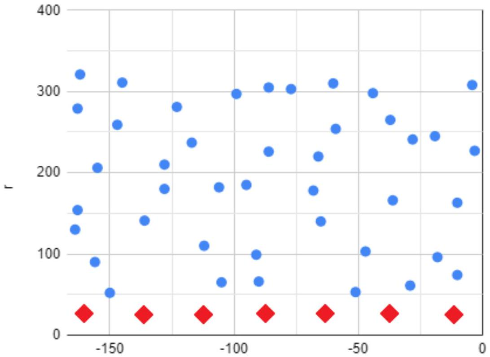
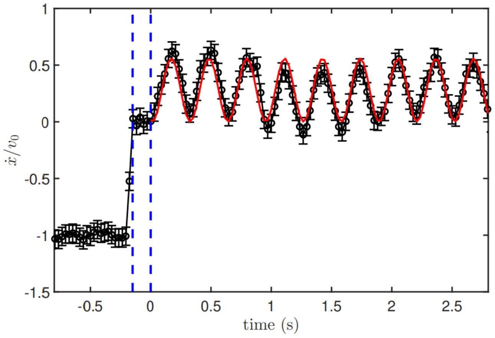

A1 ${ } ^ { 0.20 }$ Чему равно теоретическое значение $\alpha _ { \text {solid } }$, если заменить воду на твердое тело постоянной плотности совпадающей с плотностью воды?

$$
\alpha = \frac { 1 } { 4 }
$$

$1 / 2$ от того, что только половина бутылки заполнена и $1 / 2$ от того, что тело равномерной плотности.

A2 ${ } ^ { 4.50 }$ Определите коэффициент $α$ в проведенном эксперименте. Точки, в которой Вы измеряете скорость задавайте парой чисел в полярных координат с центром в оси бутылки $r , \varphi$.

$$
L = I \dot { \theta } = \iint \rho H r ^ { 2 } v _ { \tau } \cdot d r \cdot d \varphi = \iint \rho H R ^ { 3 } \frac { r ^ { 3 } } { R ^ { 3 } } \dot { \theta } \frac { v _ { \tau } } { v _ { 0 } } \cdot d r \cdot d \varphi
$$

где $r$ - растояние от центра бутылки до трека, $\varphi$ - угол между горизонаталью и радиус-вектором начала трека, $R$ - радиус бутылки, $v _ { \tau }$ - тангенциальная составляющая скорости жидкости, $v _ { 0 }$ - скорость поверхности жидкости около края бутылки.

Тогда

$$
L = \pi \rho L R ^ { 2 } \dot { \theta } \iint \frac { r ^ { 3 } } { R ^ { 3 } } \frac { v _ { \tau } } { v _ { 0 } } \cdot d \frac { r } { R } \cdot d \frac { \varphi } { \pi }
$$

Таким образом:

$$
\alpha = \left\langle \frac { r ^ { 3 } } { R ^ { 3 } } \cdot \frac { v _ { \tau } } { v _ { 0 } } \right\rangle ,
$$

при условии, что точки равномерно распределены по плоскости $( r , \varphi )$.

В итоге мы получили $\alpha = 0.17$, теоретическое значение $\alpha _ { \text {theory } } = 0.16$. Если при численном интегрировании 2 -мерной функции не было проверено распределение точек, то значение $\alpha$ обычно завышается. Например, если не учесть точки при $r / R \approx 0.1 - 0.2$, то $\alpha$ получается около 0.25 .

А3 ${ } ^ { 0.50 }$ Постройте график характеризующий Ваши измерения в координатах $r / R$ vs $\varphi / \pi$.

А4 ${ } ^ { 0.20 }$ Сравните полученный $\alpha$ с теоретической оценкой:

$$
\alpha _ { \text {theory } } = \frac { 4 } { \pi ^ { 2 } } - \frac { 1 } { 4 } ,
$$

полученной в XIX веке лордом Рэлейем.

А5 ${ } ^ { 0.30 }$ По данным представленным на риснуке оцените собтсвенную частоту колебаний системы $\omega _ { 0 }$ и ее добротность $1 / \zeta$.

$$
\omega _ { 0 } = 2 \pi \cdot 2.8 \text { Гц } = 181 / c , \quad 1 / \zeta = 1 / 22
$$

Угловая частота колебаний физического маятника:

$$
\omega _ { 0 } ^ { 2 } = \frac { m g a } { I } ,
$$

где $a$ - расстояние от центра масс до точки подвеса, $I$ - момент инерции. Для полукруга $a = \frac { 4 } { 3 \pi } R$, соотвественно тогда

$$
\omega _ { 0 } = 1.2 \sqrt { g / R } = \sqrt { \frac { 2 } { 3 \pi \alpha } } \sqrt { g / R }
$$

откуда $\alpha = 0.18$.

В1 ${ } ^ { 0.30 }$ Запишите II закон Ньютона для всей системы системы и уравнение вращательного движения для колец.

$$
\left\{ \begin{array} { l }
M \ddot { x } + m \ddot { x } + m a \ddot { \theta } = F \\
M R \ddot { x } = - F R
\end{array} \quad \Rightarrow \quad 2 M \ddot { x } + m ( \ddot { x } + a \ddot { \theta } ) = 0 \right.
$$

В2 ${ } ^ { 0.20 }$ Получите из уравнений предыдущего пункта уравнение, в котором есть только константы, параметры нашей системы и их производные.

В3 ${ } ^ { 0.30 }$ Запишите уравнение динамики вращательного движения для полуцилиндра, как дифференциальное уравнение второго порядка.

$$
I _ { 0 } \ddot { \theta } = - m g a ^ { 2 } \theta - m a \ddot { x }
$$

В4 ${ } ^ { 0.50 }$ Найдите угловую частоту колебаний системы $\Omega$. Запишите решений полученной системы из двух уравнений, которое описывает то, как бутыка катиться рывками по плоскости.

$$
\begin{gathered}
1 / \Omega ^ { 2 } = \frac { a } { g } \left( \frac { I _ { 0 } } { m a ^ { 2 } } - \frac { m } { 2 M + m } \right) \\
\left\{ \begin{array} { l }
\theta = A \sin \left( \Omega t + \phi _ { 0 } \right) \\
x = - A \frac { m a } { 2 M + m } \sin \left( \Omega t + \phi _ { 0 } \right) + B t
\end{array} \right.
\end{gathered}
$$

В5 ${ } ^ { 0.30 }$ Пусть амплитуда колебаний скорости бутылки $\gamma v _ { 0 }$ после отскока от стенки. Выразите $\gamma$ через известные велечины и $\eta$.

$$
\begin{gathered}
I _ { 0 } \frac { \dot { \theta } _ { 0 } } { 2 } = ( m + M ) \frac { v _ { 0 } ^ { 2 } } { 2 } \\
\gamma = \frac { m a } { 2 M + m } \sqrt { \eta \frac { m + M } { I _ { 0 } } } = \frac { 4 } { 3 \pi } \cdot \frac { m } { 2 M + m } \sqrt { \eta } \sqrt { \frac { m + M } { 2 \alpha m } }
\end{gathered}
$$

В6 ${ } ^ { 1.50 }$ Постройте график $\dot { x } / v _ { 0 }$ vs $t$.

В7 ${ } ^ { 0.20 }$ Найдите экспериментальное значение $\Omega$, сравните его с теоретически.

$$
\Omega _ { \text {theory } } = 19.81 / \mathrm { c } \quad \Omega = 20.11 / \mathrm { c }
$$

В8 ${ } ^ { 0.30 }$ Найдите значение $\eta$.

$$
\eta = 71 \%
$$
