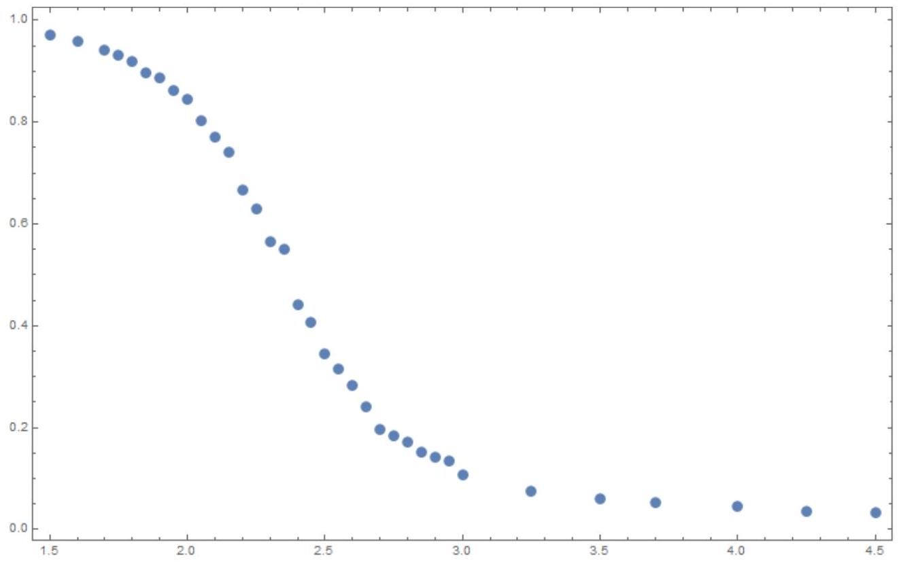

Запустив программу, с помощью команды 7 находим

$$
L = 100 ; \quad T = 10.0 ; \quad h = 0
$$

А1 ${ } ^ { 0.40 }$ Как время исполнения программы $\tau$ зависит от размера сетки $L$ и от числа повторений алгоритма $I$ ? Сколько исполнялось $I = 500$ шагов алгоритма на решетке размера $L = 1000$ ?

На каждом шаге алгоритма совершается $L ^ { 2 }$ операций. Поэтому время пропорционально $\tau \sim I L ^ { 2 }$. При $L = 100 I = 100$ операций выполняется за 2 минуты. Тогда в условиях задачи

$$
\tau = 2 \text { мин } \times 5 \times 10 ^ { 2 } = 1000 \text { мин } \approx 17 \text { часов. }
$$

А2 ${ } ^ { 0.50 }$ Пронаблюдайте, как распределение магнитных моментов меняется в зависимости от температуры. Оцените температуру $T _ { c }$, при которой происходит фазовый переход.

При больших температурах магнитные моменты расположены хаотично. При низких температурах практически все моменты направлены в одну сторону. В точке фазового перехода соседние моменты начинают группироваться в "капли" сонаправленных магнитных моментов. Это происходит при температуре порядка 2.5.

А3 ${ } ^ { 0.20 }$ Какое число шагов алгоритма $I$ требуется, чтобы от начального случайного распределения получить равновесное распределение при $T = 1.5$, $h = 0.1$ ? Размер решетки по умолчанию.

Запустив моделирование и посмотрев на график намагниченности от числа шагов, находим, что намагниченнось сходится к среднему значению за $I \sim 50$ шагов.

A4 ${ } ^ { 0.70 }$ В этой задаче придется много работать со случайными величинами. Чтобы получить разумные ответы, важно правильно оценивать случайные погрешности. В качестве примера рассмотрим сетку размера $L = 5$ при температуре $T = 3.66$. Как погрешность определения $m ^ { 2 }$ зависит от числа шагов алгоритма $I$ ? Определите $m ^ { 2 }$ с погрешностью не выше 0.01 .

Вся погрешность определения $m ^ { 2 }$ возникает из-за случайных отклонений. Это означает, что погрешность спадает с числом усредняемых слагаемых как $1 / \sqrt { I }$. Тогда требуемое число шагов можно оценить как $I \sim 10 ^ { 4 }$. Используя такое число шагов находим $m ^ { 2 } = 0.205 \pm 0.010$. Запустив программу насколько раз, убеждаемся, что наша оценка погрешности действительно справедлива.

Ответ: $m ^ { 2 } = 0.205 \pm 0.010$

В1 ${ } ^ { 0.50 }$ Найдите значение $U _ { 0 }$ параметра Биндера при $T \rightarrow 0$ и значение $U _ { \infty }$ при $T \rightarrow \infty$.

При $T \rightarrow 0$ практически все моменты сонаправлены и $\left\langle m ^ { 4 } \right\rangle = \left\langle m ^ { 2 } \right\rangle = 1$. Тогда $U _ { 0 } = 2 / 3$. При больших температурах направления всех магнитных моментов практически независимы. Поэтому намагниченность представляет собой сумму большого числа независимых величин, а значит распределена по Гауссу. Тогда $U _ { \infty } = 0$. Эти же результаты можно получить из численного моделирования при достаточно малых и достаточно больших температурах.

В2 ${ } ^ { 1.00 }$ Как средний квадрат намагниченности $m ^ { 2 }$ намагниченности зависит от температуры при $L = 10$ ? Постройте график в зависимости от температуры. Диапазон температур выберите так, чтобы график содержал все характерные особенности функции.

Снимем зависимость $m ^ { 2 } ( T )$, используя для усреднения $I = 10 ^ { 4 }$ шагов алгоритма в интервале температур $T \in [ 1.5,4.5 ]$. Получим график

В3 ${ } ^ { 4.00 }$ Используя параметр Биндера, как можно точнее определите температуру $T _ { c }$, при которой происходит фазовый переход. Оцените погрешность найденного значения $T _ { c }$.

Построим график зависимости параметра Биндера от температуры для двух различных размеров решетки, например $L = 5$ и $L = 10$. Вблизи точки фазового перехода эти зависимости можно аппроксимировать линейными. Находя точку пересечения соответствующих прямых, получаем $T _ { c } \approx 2.21$. Для того, чтобы добиться хорошей точности, каждую точку требуется измерять, усредняя по $I \sim 10 ^ { 4 }$ итерациям алгоритма.

У этой задачи также есть точное аналитическое решение. Из этого решения следует $T _ { c } = 2 / \ln ( 1 + \sqrt { 2 } ) \approx 2.23$.

B4 ${ } ^ { 3.00 }$ Пусть система находится в парамагнитной фазе (температура больше температуры фазового перехода $T _ { c }$ ). Исследуйте, как магнитная восприимчивость $\chi$ зависит от температуры. Предложите вид зависимости и определите ее параметры.

Будем рассматривать температуры $T > 3$. Для измерения магнитной восприимчивости будем включать небольшое магнитное поле $h \sim 0.1$. Величина поля должна быть не слишком большой, чтобы зависимость намагниченности линейно зависела от поля. С другой стороны, она должна быть не слишком маленькой, чтобы изменение намагниченности превышало погрешность, с которой она измеряется. Тогда магнитную восприимчивость можно определить как $\chi = \Delta m / h$. Построив график $1 / \chi ( T )$ получим линейную зависимость. Таким образом

$$
\chi ( T ) = \frac { \alpha } { T - T _ { 0 } }
$$

Константы $\alpha$ и $T _ { 0 }$ зависят от выбранного размера решетки.

С1 ${ } ^ { 2.50 }$ Определите значение корреляционной длины для направления вдоль стороны квадратной решетки. В каком диапазоне расстояний применима экспоненциальная зависимость?

Возьмем $L = 100 , T = T _ { c } = 2.23 , h = 1$. Проделаем $I = 200$ итераций алгоритма, чтобы система пришла в тепловое равновесие. Снимем зависимость $C ( l )$ при $l \in [ 1,30 ]$ и построим график $\ln C$ от $l$. Из графика находим, что зависимость приближенно линейна при $l \in [ 3,15 ]$, из наклона графика находим корреляционную длину $\chi \approx 8$. Отметим, что значение корреляционное длины сильно зависит от температуры.
