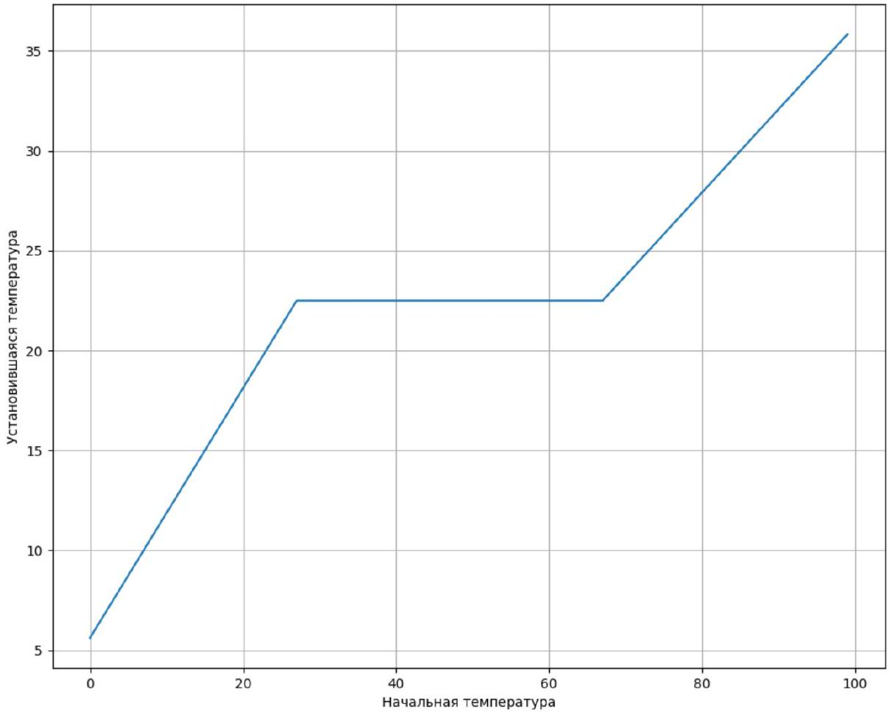
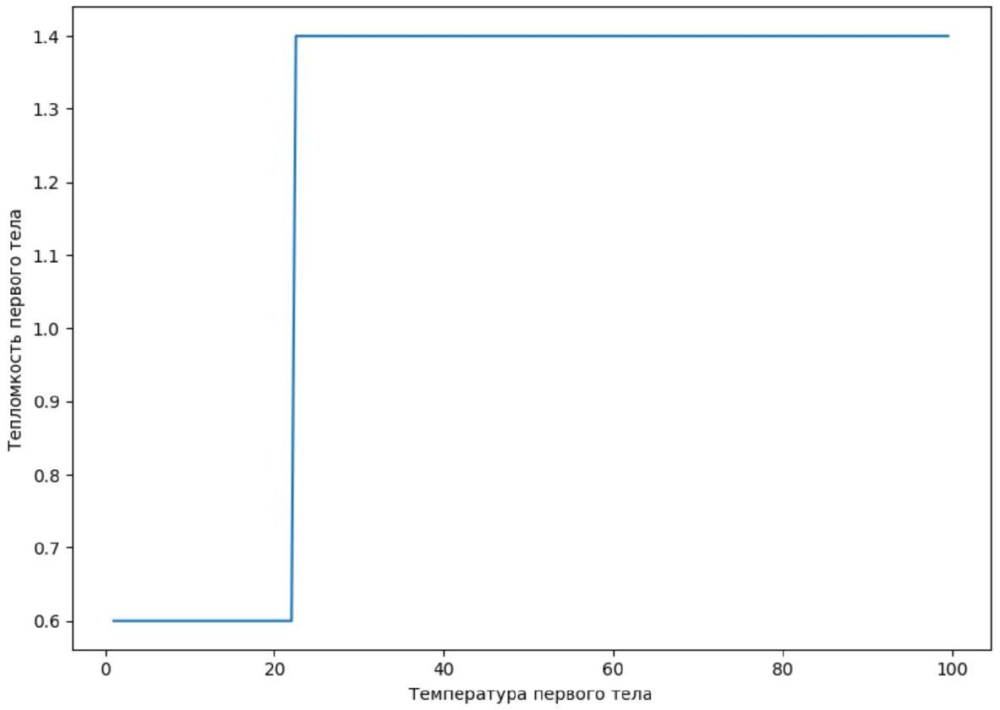

Если $T _ { 20 }$ больше $T _ { 10 }$, то $T _ { 2 }$ будет падать, если $T _ { 20 }$ меньше $T _ { 10 }$ - будет расти. Таким образом можно численным методом определить $T _ { 10 }$. $T _ { 10 } = 15 ^ { \circ } C$

А2 ${ } ^ { 3.60 }$ Постройте график зависимости теплоемкости сосуда №1 от его температуры.

Исследуем зависимость конечной $T _ { 2 }$ от $T _ { 20 }$. Мы получим кусочно-линейный график. При повышении $T _ { 20 }$ мы можем увидеть, как себя будет вести $C _ { 1 }$ : Малое изменение $d T _ { 20 }$ можно рассматривать, как добавление в систему энергии $\mathrm { C } _ { 2 } d T _ { 20 }$, которая равномерно распределяется между 1-м и 2-м телами: $\left( \mathrm { C } _ { 1 } + \mathrm { C } _ { 2 } \right) d T _ { 2 \text { кон } }$ , отсюда:

$$
\left. \mathrm { C } _ { 1 } = \mathrm { C } _ { 2 } \cdot \left( \frac { d T _ { 2 \text { кон } } } { d T _ { 20 } } \right) ^ { - 1 } - 1 \right)
$$

Из этого графика, можно сделать следующие выводы:

1. ) При температуре $22.5 ^ { \circ } C$ происходит некий фазовый переход. Теплота необходимая для полного осуществления перехода равна $\mathrm { C } _ { 2 } \Delta T _ { 2 } = 40$ Дж
2. ) При температуре ниже $22.5 ^ { \circ } C$ теплоёмкость $\mathrm { C } _ { 1 } = 0.6 \frac { \text { кДж } } { \text { К } }$
3. ) При температуре ниже $22.5 ^ { \circ } C$ теплоёмкость $\mathrm { C } _ { 1 } = 1.4 \frac { \text { кДж } } { \text { К } }$

А3 ${ } ^ { 3.00 }$ За какое время температура сосуда №1 увеличится от $T _ { 10 }$ до $T _ { 10 } + 20 ^ { \circ } \mathrm { C }$, если вместо сосуда №2 присоединить трубку к сосуду с постоянной температурой 100°C?

Определим коэффициент теплопроводности $\alpha$. Для этого исследуем зависимость $T _ { 2 }$ при $T _ { 20 } < T _ { \text {перехода } }$. Тогда:

$$
\begin{gathered}
T _ { 1 } = T _ { 10 } + \frac { C _ { 2 } } { C _ { 1 } } \cdot \left( T _ { 20 } - T _ { 1 } \right) \\
\alpha \cdot \frac { C _ { 2 } + C _ { 1 } } { C _ { 1 } } \cdot T _ { 2 } - \left( T _ { 10 } + \frac { C _ { 2 } } { C _ { 1 } } \cdot T _ { 20 } \right) = C _ { 2 } \cdot \frac { d T _ { 2 } } { d \tau }
\end{gathered}
$$

$$
\begin{gathered}
T _ { 2 } - \frac { C _ { 2 } T _ { 20 } + C _ { 1 } T _ { 10 } } { C _ { 2 } + C _ { 1 } } = \left( T _ { 20 } - \frac { C _ { 2 } T _ { 20 } + C _ { 1 } T _ { 10 } } { C _ { 2 } + C _ { 1 } } \right) \cdot e ^ { - \frac { \alpha \left( C _ { 2 } + C _ { 1 } \right) } { C _ { 1 } + C _ { 2 } } \tau } \\
\alpha \frac { \left( C _ { 2 } + C _ { 1 } \right) } { C _ { 1 } + C _ { 2 } } \tau = \ln \left( \frac { T _ { 20 } - \frac { C _ { 2 } T _ { 20 } + C _ { 1 } T _ { 10 } } { C _ { 2 } + C _ { 1 } } } { T _ { 2 } - \frac { C _ { 2 } T _ { 20 } + C _ { 1 } T _ { 10 } } { C _ { 2 } + C _ { 1 } } } \right)
\end{gathered}
$$

Из данной зависимости можно определить $\alpha = 0.1 \frac { \text { кДж } } { \text { К.мин } }$.
При нагревании первого тела от $15 ^ { \circ } C$ до $35 ^ { \circ } C$ первое тело проходит 3 стадии: Нагревание до фазового перехода, нагревание после фазового перехода и фазовый переход. Определим $\tau _ { i }$ :

1. ) Используем формулу, описанную выше, подставив туда $C _ { 2 } = \infty , \mathrm { C } _ { 1 } = 0.6 \frac { \text { Дж } } { \text { К } } \tau _ { 1 } = 0.55$ мин
2. ) Используем формулу, описанную выше, подставив туда $C _ { 2 } = \infty , \mathrm { C } _ { 1 } = 1.4 \frac { \text { Дж } } { К } \tau _ { 1 } = 2.46$ мин
3. ) $\tau _ { 3 } = \frac { Q } { \alpha \left( 100 - T _ { \text {перехода } } \right) } = 5.16$ мин
$\tau _ { \text {полн } } = 8.17$ мин

Альтернативное решение:
Найти $\alpha$ можно иначе, не используя теплоемкость тела $C _ { 1 }$. Рассмотрим, например, как скорость убывания температуры в начальный момент времени зависит от начальной температуры второго тела:

$$
C _ { 2 } \dot { T } _ { 2 } ( 0 ) = - \alpha \left( T _ { 20 } - T _ { 10 } \right)
$$

Эта зависимость линейна и из углового коээфициента графика $\dot { T } _ { 2 } ( 0 )$ от $T _ { 20 }$ можно определить $\alpha / C _ { 2 }$, а значит и $\alpha$.
Зная $\alpha$, можно, теоретически, определить теплоемкость тела №1, рассматривая зависимость температуры $T _ { 2 }$ от времени.
Для этого из системы

$$
\begin{gathered}
C _ { 1 } \dot { T } _ { 1 } = \alpha \left( T _ { 2 } - T _ { 1 } \right) \\
C _ { 2 } \dot { T } _ { 2 } = - \alpha \left( T _ { 2 } - T _ { 1 } \right)
\end{gathered}
$$

можно получить

$$
\begin{aligned}
T _ { 1 } & = T _ { 2 } + \frac { C _ { 2 } } { \alpha } \dot { T } _ { 2 } \\
C _ { 1 } & = - \frac { C _ { 2 } \dot { T } _ { 2 } } { \dot { T } _ { 2 } + \frac { C _ { 2 } } { \alpha } \ddot { T } _ { 2 } }
\end{aligned}
$$

В правой части выражений все величины известны.
Если по формуле

$$
\ddot { T } _ { 2 } \approx \frac { T _ { 2 } ( t + \Delta t ) + T _ { 2 } ( t - \Delta t ) - 2 T _ { 2 } ( t ) } { ( \Delta t ) ^ { 2 } }
$$

вычислить $\ddot { T } _ { 2 }$, то величина числителя окажется сравнимой с ошибкой округления выводимых программой данных. Из-за этих ошибок вычислить значение $\ddot { T } _ { 2 }$ с достаточной точностью невозможно, поэтому, на практике, такое решение не приводит к правильному ответу.
