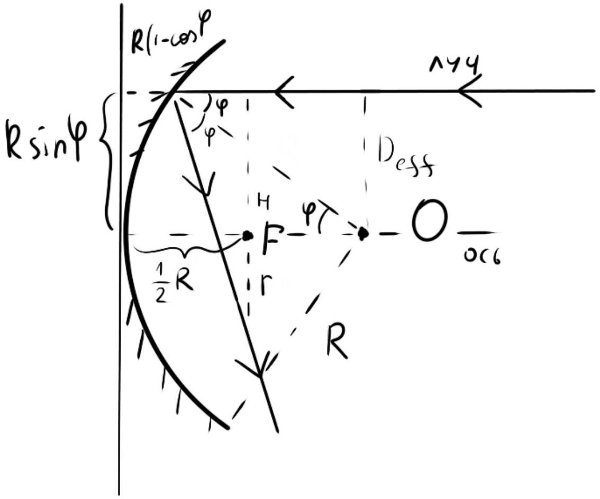

Как известно, при дифракции на отверстии лучи приближённо расходятся на $\theta = \frac { \lambda } { 2 R _ { 0 } }$. Тогда размер пятна на экране

$$
R \approx R _ { 0 } + L \theta = R _ { 0 } \left( 1 + \frac { L \lambda } { 2 R _ { 0 } ^ { 2 } } \right)
$$

A2 ${ } ^ { 0.20 }$ Оцените интенсивность $I$ в центре пятна.

Из ЗСЭ получим $I _ { 0 } \pi R _ { 0 } ^ { 2 } \approx I \pi R ^ { 2 }$. Тогда ответ

$$
I = I _ { 0 } \frac { 1 } { \left( 1 + \frac { L \lambda } { 2 R _ { 0 } ^ { 2 } } \right) ^ { 2 } }
$$

АЗ ${ } ^ { 0.30 }$ Оцените минимальный достижимый радиус пятна $R _ { \min }$ при варьировании радиуса отверстия.

Продифференцировав выражение для размера пятна, получим, что $R _ { \min }$ соответствует $R _ { 0 } = \sqrt { L \lambda / 2 }$. Тогда ответ

$$
R _ { \min } \approx \sqrt { 2 L \lambda }
$$

В1 ${ } ^ { 0.20 }$ Оцените диаметр $D _ { F }$ пятна в фокусе линзы.

Лучи расходятся на угол $\theta$. Расстояние до фокуса $F$. Тогда диаметр пятна

$$
D _ { F } \approx 2 \theta F = 2 \frac { F \lambda } { D } .
$$

Здесь считаем, что радиус первого светлого пятна определяется первым минимумом. Можно считать, что радиус первого светлого пятна в два раза меньше, чем первый минимум.

В2 ${ } ^ { 0.30 }$ Оцените интенсивность $I _ { F }$ в фокусе линзы из энергетических соображений.

Запишем ЗСЭ:

$$
I _ { 0 } \frac { \pi } { 4 } D ^ { 2 } = I \pi R ^ { 2 } = I \pi \left( \frac { F \lambda } { D } \right) ^ { 2 }
$$

Тогда ответ:

$$
I \approx I _ { 0 } \frac { D ^ { 4 } } { 4 F ^ { 2 } \lambda ^ { 2 } }
$$

В3 ${ } ^ { 1.00 }$ Теперь посчитайте ответ для интенсивности $I _ { F }$ в фокусе линзы точно. Сравните с предыдущим пунктом.

Точный ответ можно посчитать при помощи зон Френеля. Пусть интенсивности $I$ и $I _ { 0 }$ соответствуют амплитудам $E$ и $E _ { 0 }$ соответственно. Заметим, что фокус такая точка, что лучи проходят одинаковые пути от внешней поверности линзы до него и, соответственно, прибывают туда в фазе. Если бы линзы не было, то из отверстия из-под линзы в фокусе было бы видно $m$ зон Френеля, $\frac { 1 } { 4 } D ^ { 2 } = m \lambda F$. Тогда длина спирали Френеля равна $\pi m E _ { 0 } = \frac { \pi } { 4 } \frac { D ^ { 2 } } { \lambda F } E _ { 0 }$. Заметим, что когда есть линза, все волновые фронты приходят в фокус в фазе и спираль "выпрямляется". Тогда $E = E _ { 0 } \frac { \pi } { 4 } \frac { D ^ { 2 } } { \lambda F }$ и ответ:

$$
I = I _ { 0 } \frac { \pi ^ { 2 } } { 16 } \frac { D ^ { 4 } } { F ^ { 2 } \lambda ^ { 2 } }
$$

Видно, что оценка в предыдущем пункте сходится с ответом.\}
Можно получить ответ, если показать, что при некой ширине ког в фокусе линзы будет наблюдаться большая интенсивность, чем на поверхности источника.

C1 ${ } ^ { 0.30 }$ Найдите фокусное $F$ расстояние зеркала.

Уравнения параболы, при вращении которой образуется зеркало $y ^ { 2 } = 2 p x$. Как известно, парабола - ГМТ точек, равноудалённых от некой прямой и точки. Пусть фокусное расстояние $F$. Тогда расстояние от точки $( 0,0 )$ до прямой тоже $F$. Рассмотрим точку параболы, $x$ - координата которой равна координате фокуса. Тогда она удалена на $2 F$ от прямой и от фокуса. Получаем, что $4 F ^ { 2 } = 2 p F$ и ответ:

$$
F = \frac { 1 } { 2 } p
$$

С2 ${ } ^ { 0.30 }$ Оцените интенсивность $I$ в фокусе зекрала.

Опять запишем ЗСЭ. Оценка углового расхождения аналогична $\theta \approx \frac { \lambda } { D }$. Тогда размер пятна в фокусе $R = F \theta = \frac { F \lambda } { D } = \frac { p \lambda } { D }$. Из ЗСЭ получаем:

$$
I \approx I _ { 0 } \frac { D ^ { 4 } } { p ^ { 2 } \lambda ^ { 2 } }
$$

с3 ${ } ^ { 0.20 }$ Во сколько раз изменится это значение при уменьшении длины волны в два раза?

То есть, $I \sim \lambda ^ { - 2 }$. Тогда при уменьшении длины волны волны в два раза интенсивность увеличивается в 4 раза.

D1 ${ } ^ { 0.20 }$ Найдите фокусное расстояние $F$ зеркала.

Посчитаем фокусное расстояние. Из чертежа ниже видно, что оно равно $\frac { 1 } { 2 } R$

D2 ${ } ^ { 1.30 }$ Оцените размер пятна $d$ в фокальной плоскости зеркала, для двух диаметров зеркала: $D _ { 1 } = 1 \mathrm {~cm} , D _ { 2 } = 15 \mathrm { cм }$.

Первый эффект: дифракционное размытие. Тогда радиус пятна

$$
r _ { D } = \frac { \lambda R } { 2 D } .
$$

Второй эффект: аберрация. Из чертежа видно, что

$$
\begin{aligned}
H & = R \sin \varphi \\
H + r & = R \tan 2 \varphi \left( \frac { 1 } { 2 } - ( 1 - \cos \varphi ) \right) \\
r & = R \tan 2 \varphi \left( \cos \varphi - \frac { 1 } { 2 } \right) - R \sin \varphi \\
r _ { A } & \approx \frac { 1 } { 2 } \varphi ^ { 3 } R = \frac { 1 } { 2 } ( D / R ) ^ { 3 } R = \frac { D ^ { 3 } } { 2 R ^ { 2 } } .
\end{aligned}
$$

Для $D _ { 1 }$ реализуется дифракция. Для $D _ { 2 }$ аберрация. Надо посчитать.

D3 ${ } ^ { 0.80 }$ Для этих двух диаметров зеркал ( $D _ { 1 } = 1 \mathrm {~cm} , D _ { 2 } = 15 \mathrm {~cm}$ ) оцените интенсивность в фокусе.

Для дифракции считаем как раньше через энергию:

$$
I \left( \frac { \lambda R } { 2 D } \right) ^ { 2 } = I _ { 0 } \frac { D ^ { 2 } } { 4 } ,
$$

$$
I = I _ { 0 } \frac { D ^ { 4 } } { \lambda ^ { 2 } R ^ { 2 } }
$$

Для аберрации посчитаем интенсивность в центре как отношение мощности к радиусу. Возъмём в центре диск радуса $r$, в этот диск попадают лучи из зеркала диаметром

$$
d = \left( 2 r R ^ { 2 } \right) ^ { 1 / 3 }
$$

Мощность, которая собирается этим зеркалом $I _ { 0 } \pi d ^ { 2 } / 4$. Интенсивность в этом диске вокруг центра:

$$
I = \frac { I _ { 0 } \pi \left( 2 r R ^ { 2 } \right) ^ { 2 / 3 } } { 4 \pi r ^ { 2 } } = I _ { 0 } \frac { 2 ^ { 2 / 3 } R ^ { 4 / 3 } } { 4 r ^ { 4 / 3 } } .
$$

Видно, что в предельном переходе ответ стремится к бесконечности.

D4 ${ } ^ { 0.70 }$ Как найденные в прошлом пункте интенсивности в фокусе зависят от длины волны $\lambda$ ?

Дифракция:

$$
I \approx \frac { D ^ { 4 } } { \lambda ^ { 2 } } I _ { 0 }
$$

Второй случай: никто не знает. Но Зенькович говорит вот так:
Здесь же в фокус, точнее, в ту область, в которой дифрация усредняет интенсивности попадают только те лучи, которые падали под $\varphi < \varphi _ { \text {crit } }$, где $\varphi _ { \text {crit } }$ - угол, при котором смещение, вызванное аберрацией, меньше, чем дифракционное отклонение:

$$
\begin{gathered}
\frac { 1 } { 2 } \varphi _ { c r i t } ^ { 3 } R = \frac { 1 } { 2 } R \frac { \lambda } { D } \\
\varphi _ { c r i t } \approx \left( \frac { \lambda } { D } \right) ^ { \frac { 1 } { 3 } }
\end{gathered}
$$

Площадь, лучи из которой упадут на зеркало под углом, меньшим $\varphi _ { \text {crit } }$, равна $\pi R ^ { 2 } \varphi _ { \text {crit } } ^ { 2 }$ Тогда запишем 3СЭ:

$$
\begin{gathered}
I _ { 0 } \pi R ^ { 2 } \varphi _ { c r i t } ^ { 2 } = I \frac { 1 } { 4 } \pi R ^ { 2 } \frac { \lambda ^ { 2 } } { D ^ { 2 } } \\
I \approx I _ { 0 } \left( \frac { \lambda } { D } \right) ^ { - \frac { 4 } { 3 } }
\end{gathered}
$$

Тогда при уменьшении длины волны интенсивность увеличится в $2 ^ { \frac { 4 } { 3 } } \approx 2.5$ раз. Это ответ на второй вопрос.

E1 ${ } ^ { 1.00 }$ Определите интенсивность нулевого максимума $I _ { 0 }$. Выразите ответ в общем виде через $d$ и $a$. Укажите ответ для $d = 3 a$.

Амплитуда падающей волны $E _ { S } = \sqrt { } \left( I _ { S } \right)$. В нулевой максимум попадают все волны, которые пропускаются щелью, причём с одинаковой фазой. Поэтому, амплитуда нулевого максимума

$$
E _ { 0 } = a / d E _ { S } ,
$$

интенсивность нулевого максимума

$$
I _ { 0 } = ( a / d ) ^ { 2 } I _ { S } .
$$

E2 ${ } ^ { 1.00 }$ Определите интенсивность $I _ { h }$ максимума с номером $h$. Выразите ответ в общем виде через $d$ и $a$. Укажите ответ для $d = 3 a$.

Направление на максимум $h$ :

$$
\sin \varphi = h \lambda / d .
$$

Находим амплитуду максимума с номером $h$ :

$$
E _ { h } = \frac { E _ { 0 } } { a } \int _ { 0 } ^ { a } e ^ { ( - i 2 \pi / \lambda x \sin \varphi ) } d x = \frac { E _ { 0 } } { a } \int _ { 0 } ^ { a } e ^ { ( - i 2 \pi x / d h ) } d x \sim E _ { S } \frac { \sin ( \pi h a / d ) } { \pi h } .
$$

Тут опущена фаза, которая не важна для интенсивности. В итоге:

$$
I _ { h } = E _ { h } ^ { 2 } = I _ { S } \left( \frac { \sin ( \pi h a / d ) } { \pi h } \right) ^ { 2 } .
$$

E3 ${ } ^ { 1.00 }$ Какая доля энергии $\beta$ попадает во все максимумы на экране, кроме нулевого $( h \neq 0 )$ ? Вычислите ответ для $d = 3 a$.

Плоская волна в плоскости решетки является источником вторичных волн. То есть непропускающая часть $d - a$ поглощает не только энергию, которая идёт в нулевой максимум, но и всё то, что рассеивалось бы во все направления. Можно показать, что дополняющая решетка рассеивает туда же и столько же, сколько и начальная.
Поглощает в нулевом направлении:

$$
I _ { 0 } = ( ( d - a ) / d ) ^ { 2 } I _ { S } ,
$$

Поглощает во всех направлениях (и столько же попадает в реальные максимумы):

$$
\beta I _ { S } .
$$

Итого:

$$
\begin{gathered}
1 = ( a / d ) ^ { 2 } + ( ( d - a ) / d ) ^ { 2 } + 2 \beta \\
\beta = \frac { a ( d - a ) } { d ^ { 2 } }
\end{gathered}
$$

Е4 ${ } ^ { 1.00 }$ Какая доля энергии $\gamma$ поглощается не пропускающей частью дифракционной решеткой? Вычислите ответ для $d = 3 a$.

Поглощается решеткой:

$$
\gamma = ( ( d - a ) / d ) ^ { 2 } + \beta = ( d - a ) / d .
$$

Если что, суммарно на экран попадает доля энергии

$$
( a / d ) ^ { 2 } + \beta = a / d ,
$$

Что равно $1 - \gamma$, как и должно быть из ЗСЭ.
