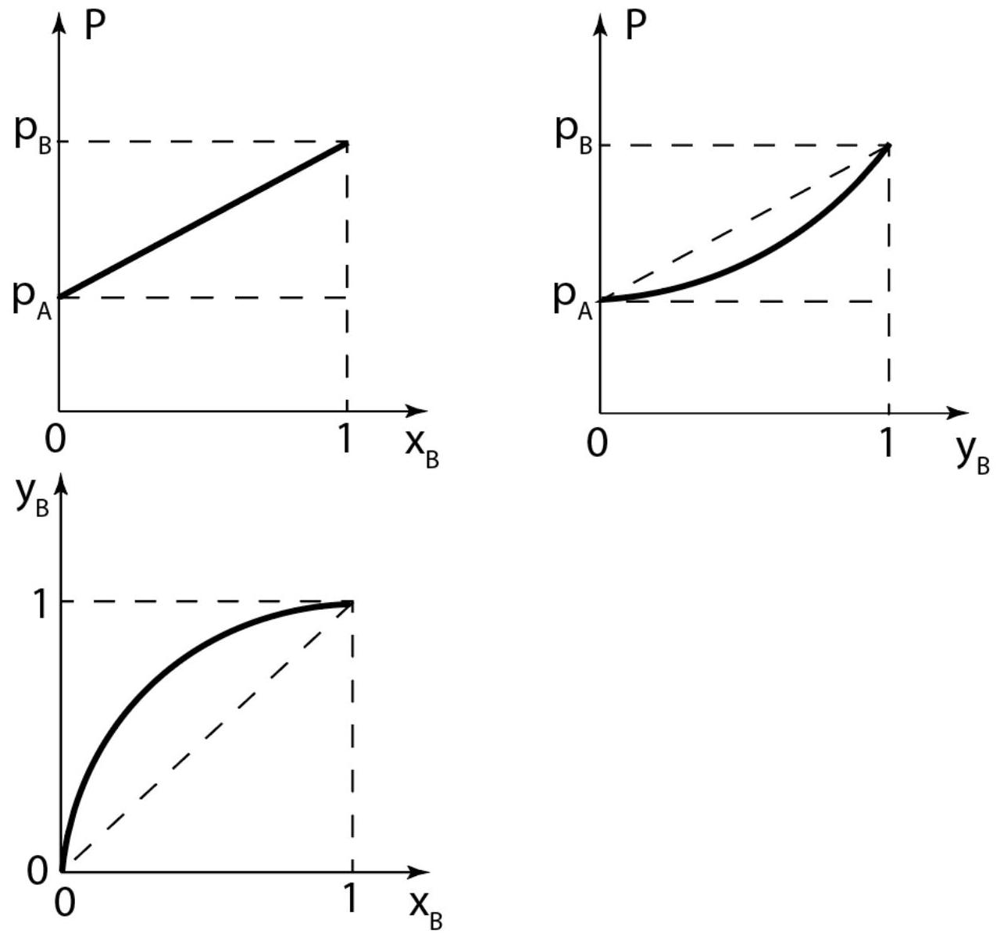

По закону Рауля:

$$
\begin{aligned}
& P _ { A } = p _ { A } x _ { A } \\
& P _ { B } = p _ { B } x _ { B }
\end{aligned}
$$

По закону Дальтона:

$$
\frac { y _ { A } } { y _ { B } } = \frac { P _ { A } } { P _ { B } }
$$

Следовательно,

$$
\frac { y _ { A } } { y _ { B } } = \frac { p _ { A } x _ { A } } { p _ { B } x _ { B } }
$$

А2 ${ } ^ { 0.50 }$ Пусть для жидкости известны молярная теплота парообразования $\lambda$ и температура кипения жидкости $t$ при атмосферном давлении $P _ { 0 }$. Найдите зависимость давления насыщенного пара чистой жидкости от температуры $P ( T )$.

Уравнение Клапейрона-Клаузиуса (в случае идеального газа):

$$
\frac { d P } { d T } = \frac { \lambda } { T \Delta v } = \frac { \lambda P } { R T ^ { 2 } }
$$

После интегрирования, получим:

$$
P ( T ) = P _ { 0 } e ^ { \frac { \lambda } { R } \left( \frac { 1 } { t } - \frac { 1 } { T } \right) }
$$

А3 ${ } ^ { 1.00 }$ Выразите $p _ { A } / p _ { B }$ при температуре $T$ через температуры кипения чистых жидкостей $t _ { A }$ и $t _ { B }$ (при атмосферном давлении), их молярные теплоты парообразования $\lambda _ { A }$ и $\lambda _ { B }$.

$$
\begin{gathered}
p _ { A } ( T ) = P _ { 0 } e ^ { \frac { \lambda _ { A } } { R } \left( \frac { 1 } { t _ { A } } - \frac { 1 } { T } \right) } \\
p _ { B } ( T ) = P _ { 0 } e ^ { \frac { \lambda _ { B } } { R } \left( \frac { 1 } { t _ { B } } - \frac { 1 } { T } \right) } \\
\frac { p _ { A } } { p _ { B } } ( T ) = e ^ { \frac { \lambda _ { A } } { R } \left( \frac { 1 } { t _ { A } } - \frac { 1 } { T } \right) - \frac { \lambda _ { B } } { R } \left( \frac { 1 } { t _ { B } } - \frac { 1 } { T } \right) }
\end{gathered}
$$

А4 ${ } ^ { 2.00 }$ Считая $\lambda _ { A } = \lambda _ { B } = \lambda$, найдите температуру кипения двухкомпонентной смеси: $T \left( \lambda , t _ { A } , t _ { B } , x _ { B } \right)$.

При температуре кипения смеси

$$
P = p _ { A } x _ { A } + p _ { B } x _ { B } = P _ { 0 }
$$

$$
\begin{aligned}
& P _ { 0 } = P _ { 0 } e ^ { \frac { \lambda _ { A } } { R } \left( \frac { 1 } { t _ { A } } - \frac { 1 } { T } \right) } x _ { A } + P _ { 0 } e ^ { \frac { \lambda _ { B } } { R } \left( \frac { 1 } { t _ { B } } - \frac { 1 } { T } \right) } x _ { B } \\
& 1 = e ^ { \frac { \lambda _ { A } } { R } \left( \frac { 1 } { t _ { A } } - \frac { 1 } { T } \right) } \left( 1 - x _ { B } \right) + e ^ { \frac { \lambda _ { B } } { R } \left( \frac { 1 } { t _ { B } } - \frac { 1 } { T } \right) } x _ { B }
\end{aligned}
$$

$$
T = \frac { \lambda } { R } \ln ^ { - 1 } \left( x _ { B } e ^ { \frac { \lambda } { R t _ { B } } } + \left( 1 - x _ { B } \right) e ^ { \frac { \lambda } { R t _ { A } } } \right)
$$

A5 ${ } ^ { 1.50 }$ Считая температуру двухкомпонентной системы $T$ постоянной, изобразите на графиках зависимости $P \left( x _ { B } \right) , P \left( y _ { B } \right)$ и $y _ { B } \left( x _ { B } \right)$.

По закону Рауля $P \left( x _ { B } \right)$ линейно.
В граничных точках $x _ { B } = 0 , y _ { B } = 0 , P = p _ { A }$ или $x _ { B } = 1 , y _ { B } = 1 , P = p _ { B }$.
При $p _ { B } > p _ { A }$ :

$$
y _ { B } > x _ { B } .
$$

А6 ${ } ^ { 0.60 }$ Какая $x _ { B }$ будет достигнута после первой конденсации ( $N = 1$ )?

$$
\begin{gathered}
x _ { B } ( N + 1 ) = y _ { B } ( N ) \\
\frac { 1 - y _ { B } ( N ) } { y _ { B } ( N ) } = \frac { p _ { A } } { p _ { B } } \frac { 1 - x _ { B } ( N ) } { x _ { B } ( N ) } \\
x _ { B } ( 1 ) \approx 0.02
\end{gathered}
$$

А7 ${ } ^ { 1.40 }$ Какая $x _ { B }$ будет достигнута после того как процедура повторится $N = 10$ раз, $N = 10 ^ { 6 }$ ?

$$
\frac { 1 - x _ { B } ( N ) } { r x _ { B } ( N ) } = \left( \frac { p _ { A } } { p _ { B } } \right) ^ { N } \frac { 1 - x _ { B } ( 0 ) } { x _ { B } ( 0 ) }
$$

$$
\begin{gathered}
x _ { B } ( 10 ) \approx 0.91 \\
x _ { B } \left( 10 ^ { 6 } \right) \approx 1.00
\end{gathered}
$$

А8 ${ } ^ { 2.00 }$ Найдите, во сколько раз к этому моменту уменьшилось общее количество жидкости?

Рассмотрим уменьшение количества веществ А и В при удалении объема пара $\Delta v$ :

$$
\begin{gathered}
d A = - \Delta v \frac { P _ { A } } { R T } = - \Delta v \frac { p _ { A } x _ { A } } { R T } \\
d B = - \Delta v \frac { P _ { B } } { R T } = - \Delta v \frac { p _ { B } x _ { B } } { R T } \\
A = x _ { A } n _ { L } V \\
B = x _ { B } n _ { L } V
\end{gathered}
$$

$n _ { L }$ - молярная плотность жидкости.
Избавляемся от $\Delta v$ :

$$
\frac { d A } { d B } = \frac { p _ { A } x _ { A } } { p _ { B } x _ { B } }
$$

Подставляем

$$
\begin{aligned}
& d A = d x _ { A } n _ { L } V + x _ { A } n _ { L } d V \\
& d B = d x _ { B } n _ { L } V + x _ { B } n _ { L } d V
\end{aligned}
$$

После упрощения:

$$
\frac { d V } { V } = \frac { d x _ { B } } { x _ { B } } + \frac { 2 d x _ { B } } { 1 - x _ { B } }
$$

Интегрируем:

$$
\begin{gathered}
\ln \left( V / V _ { 0 } \right) = \ln \left( \frac { x _ { B } } { x _ { B } ( 0 ) } \right) - 2 \ln \left( \frac { 1 - x _ { B } } { 1 - x _ { B } ( 0 ) } \right) \\
V \approx 0.38 V _ { 0 }
\end{gathered}
$$
