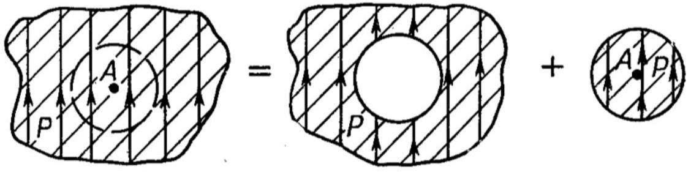

А1 ${ } ^ { 0.30 }$ Одна из моделей диэлектриков состоит в следующем: большое количество маленьких проводящих шариков радиусом $R$ заполняют пространство с концентрацией $n$, так, что $R ^ { 3 } n \ll 1$. Определите, на сколько диэлектрическая проницаемость $\varepsilon$ отличается от единицы.

Проводящий шар, помещенный во внешнее поле, приобретает дипольный момент. Напряженность электрического поля $\vec { E }$ и дипольный момент шара $\vec { p }$ связаны соотношением

$$
\vec { E } = - \frac { \rho \vec { l } } { 3 \varepsilon _ { 0 } } = - \frac { \vec { p } } { 4 \pi R ^ { 3 } \varepsilon _ { 0 } } .
$$

Вектор поляризации такой среды

$$
\vec { P } = n \vec { p } = 4 \pi \varepsilon _ { 0 } R ^ { 3 } n \vec { E }
$$

Отличие диэлектрической проницаемости от единицы:

$$
\varepsilon - 1 = \frac { P } { \varepsilon _ { 0 } E } = 4 \pi n R ^ { 3 }
$$

В $1 ^ { 0.30 }$ Уединённый диэлектрический шар радиуса $R$ поляризован так, что внутри него напряженность электрического поля однородна и равна $\vec { E } _ { i n }$. Определите напряженность электрического поля $\vec { E } _ { \text {out } } ( \vec { r } )$, которое создаёт шар снаружи в точке $\vec { r }$. Радиус-вектор $\vec { r }$ проводится из центра шара.

Дипольный момент $\vec { p }$ шара связан с напряженностью однородного поля внутри $\vec { E } _ { i n }$ :

$$
\vec { p } = - 4 \pi \varepsilon _ { 0 } R ^ { 3 } \vec { E } _ { i n } .
$$

Снаружи - поле диполя:

$$
\vec { E } _ { \text {out } } = - R ^ { 3 } \left( \frac { 3 \left( \vec { E } _ { i n } , \vec { r } \right) \vec { r } } { r ^ { 5 } } - \frac { \vec { E } _ { i n } } { r ^ { 3 } } \right)
$$

В2 ${ } ^ { 1.00 }$ Во внешнее однородное электрическое поле $\vec { E } _ { 0 }$ поместили диэлектрический шар радиуса $R$. Напряженность электрического поля внутри шара стала равна $E _ { 0 } / n$. Определите диэлектрическую проницаемость материала шара $\varepsilon$.

Шар поляризуется так, что вектор поляризации $\vec { P }$ внутри шара константа. Эти заряды создают поле:

$$
\vec { E } _ { \text {пол } } = - \frac { \vec { P } } { 3 \varepsilon _ { 0 } } .
$$

Поле внутри $\vec { E } _ { 1 }$ есть сумма внешнего поля (до внесения шара) $\vec { E } _ { 0 }$ и поля поляризационных зарядов:

$$
\vec { E } _ { 1 } = \frac { \vec { E } _ { 0 } } { n } = \vec { E } _ { 0 } + \vec { E } _ { \text {пол } } = \vec { E } _ { 0 } - \frac { \vec { P } } { 3 \varepsilon _ { 0 } } .
$$

Диэлектрическая проницаемость определяется следующим выражением:

$$
\varepsilon \vec { E } _ { 1 } = \vec { E } _ { 1 } + \frac { \vec { P } } { \varepsilon _ { 0 } } .
$$

Подставив всё друг в друга, получаем ответ

$$
\varepsilon = 3 n - 2 .
$$

Вз ${ } ^ { 0.30 }$ Если поместить неполярную частицу (например атом вещества) в электрическое поле $\overrightarrow { E ^ { \prime } }$, то она приобретёт дипольный момент $\vec { p }$. Для малых полей эта зависимость линейная:

$$
\vec { p } = \beta \varepsilon _ { 0 } \vec { E } ^ { \prime } .
$$

Коэффициент $\beta$ называется «поляризуемость». Укажите поляризуемость $\beta$ для проводящего шара.

Для проводящего шара

$$
\beta = 4 \pi R ^ { 3 } .
$$

С1 ${ } ^ { 0.50 }$ Если поместить атом водорода (который сам по себе не обладает дипольным моментом) в переменное электрическое поле $E ( t ) = E _ { 0 } \cos ( \omega t )$, то он поляризуется в основном за счёт того, что электрон массой $m _ { e }$ и зарядом $q _ { e }$ смещается под действием вынуждающей силы внешнего поля. То есть электрон совершает колебания возле положения равновесия (ядро атома). Определите, как зависит положение центра облака электрона от времени $x ( t )$, если собственная частота таких колебаний электрона $\omega _ { 0 }$ ?

Собственные колебания определяются некоторой возвращающей силой $F ( x ) = - k x$, которая определяет уравнение свободных колебаний:

$$
m \ddot { x } + k x = 0 .
$$

Поэтому эта возвращающая сила выражается через собственную частоту: $F ( x ) = - m \omega _ { 0 } ^ { 2 } x$.
В случае вынужденных колебаний

$$
m \ddot { x } + m \omega _ { 0 } ^ { 2 } x = q _ { e } E _ { 0 } \cos ( \omega t )
$$

ищем решение в виде колебаний с частотой вынуждающей силы $\omega$

$$
x ( t ) = x _ { 0 } \cos ( \omega t ) .
$$

Подставив $x ( t )$ в уравнение вынужденных колебаний найдем амплитуду. Окончательно, закон движения

$$
x ( t ) = \frac { q _ { e } E _ { 0 } } { m \left( \omega _ { 0 } ^ { 2 } - \omega ^ { 2 } \right) } \cos ( \omega t ) .
$$

С2 ${ } ^ { 0.30 }$ Если поместить указанный атом водорода в постоянное электрическое поле $E _ { 0 }$, то он будет поляризоваться. Величина поляризации будет определяться собственной частотой колебаний $\omega _ { 0 }$, которую можно оценить из следующих соображений: это частота электромагнитной волны, которая при поглощении атомом водорода ионизует его из основного состояния. Известно, что длина волны этого излучения $\lambda = 91.1 \mathrm { H }$. Оцените поляризуемость $\beta$ атома водорода.

В постоянном поле $E _ { 0 }$ у атома водорода возникает дипольный момент

$$
p = q _ { e } x _ { 0 } = \frac { q _ { e } ^ { 2 } E _ { 0 } } { m \omega _ { 0 } ^ { 2 } }
$$

Собственная частота колебаний связана с длиной волны падающего излучения

$$
\omega _ { 0 } = \frac { 2 \pi c } { \lambda } .
$$

Поляризуемость

$$
\beta = \frac { q _ { e } ^ { 2 } } { m \varepsilon _ { 0 } } \cdot \left( \frac { \lambda } { 2 \pi c } \right) ^ { 2 } = 7.4 \cdot 10 ^ { - 30 } \mathrm {~m} ^ { 3 } .
$$

с3 ${ } ^ { 0.30 }$ Определите на сколько диэлектрическая проницаемость газообразного водорода отличается от единицы при атмосферном давлении и температуре $t = 0 ^ { \circ } \mathrm { C }$. Используйте значение поляризуемость атома водорода из предыдущего пункта. Для разряженных газов можно считать, что поле в веществе $E$ и поле которое действует на одну молекулу $E ^ { \prime }$ совпадают.

$$
\varepsilon - 1 = \frac { P } { \varepsilon _ { 0 } E } = \frac { p n } { \varepsilon _ { 0 } E } = \beta n = \frac { \beta p _ { A } } { k T } = 2.0 \cdot 10 ^ { - 4 } .
$$

D1 ${ } ^ { 0.50 }$ Внутри сплошного однородного диэлектрика напряженность электрического поля равна $\vec { E }$, вектор поляризаций равен $\vec { P }$. Внутри диэлектрика вырезали сферическую полость. Определите напряженность электрического поля в веществе $\vec { E } _ { h }$.

Поле внутри полости

$$
\vec { E } _ { h } = \vec { E } + \frac { \vec { P } } { 3 \varepsilon _ { 0 } } .
$$

D2 ${ } ^ { 1.00 }$ Используя указанную выше модель найдите, на сколько диэлектрическая проницаемость жидкости $\varepsilon$ отличается от единицы. Концентрация молекул $n$, поляризуемость $\beta$.

В указанной выше модели Клаузиса-Моссотти дипольный момент атома $p$ определяется полем $E ^ { \prime } = E _ { h }$, поэтому вектор поляризации $P$ равен:

$$
P = p n = \beta \varepsilon _ { 0 } n E _ { h } .
$$

Поле $E _ { h }$ и поле в диэлектрике $E$ связаны соотношением

$$
\vec { E } _ { h } = \vec { E } + \frac { \vec { P } } { 3 \varepsilon _ { 0 } } .
$$

Диэлектрическую проницаемость найдём из выражения

$$
\varepsilon - 1 = \frac { P } { \varepsilon _ { 0 } E } .
$$

Объединяя всё это вместе получим ответ

$$
\varepsilon - 1 = \frac { \beta n } { 1 - \beta n / 3 }
$$

D3 ${ } ^ { 0.50 }$ Вещество Refrigerant-10 в газообразном виде имеет диэлектрическую проницаемость $\varepsilon _ { g } = 1.0030$ при температуре $t _ { g } = 105 ^ { \circ } \mathrm { C }$ и атмосферном давлении. Определите диэлектрическую проницаемость $\varepsilon _ { l }$ данного вещества в жидком виде.

В газе

$$
\varepsilon _ { g } - 1 = \beta n _ { g } .
$$

В жидкости

$$
\varepsilon _ { l } - 1 = \frac { \beta n _ { l } } { 1 - \beta n _ { l } / 3 } .
$$

Отношение коэффициентов

$$
\frac { \beta n _ { l } } { \beta n _ { g } } = \frac { \rho _ { R 10 } } { \rho _ { g } } = \frac { \rho _ { R 10 } R T } { p _ { A } \mu _ { R 10 } } .
$$

$$
\varepsilon _ { l } = 1 + \left( \frac { p _ { A } \mu _ { R 10 } } { \left( \varepsilon _ { g } - 1 \right) \rho _ { R 10 } R T } - \frac { 1 } { 3 } \right) ^ { - 1 } = 2.44 .
$$

D4 ${ } ^ { 0.50 }$ Для воды при температуре $t _ { 1 } = 145 ^ { \circ } \mathrm { C }$ и атмосферном давлении диэлектрическая проницаемость равна $\varepsilon _ { 1 } = 1.00705$. Оцените диэлектрическую проницаемость воды $\varepsilon _ { 2 }$ при температуре $t _ { 2 } = 20 ^ { \circ } \mathrm { C }$. Сравните результат полученный из этой модели с реальным значением диэлектрической проницаемости воды. Если он не сходится, укажите возможную причину.

При температуре $t _ { 1 } = 145 ^ { \circ } \mathrm { C }$ и атмосферном давлении вода находится в газообразном состоянии. Поэтому

$$
\varepsilon _ { 1 } - 1 = \beta n _ { 1 } .
$$

При $t _ { 2 } = 20 ^ { \circ } \mathrm { C }$ вода жидкая:

$$
\varepsilon _ { 2 } - 1 = \frac { \beta n _ { 2 } } { 1 - \beta n _ { 2 } / 3 } .
$$

Отношение коэффициентов

$$
\begin{gathered}
\frac { \beta n _ { l } } { \beta n _ { g } } = \frac { \rho _ { w } } { \rho _ { g } } = \frac { \rho _ { w } R T } { p _ { A } \mu _ { w } } . \\
\varepsilon _ { 2 } = 1 + \left( \frac { p _ { A } \mu _ { w } } { \left( \varepsilon _ { 1 } - 1 \right) \rho _ { w } R T _ { 1 } } - \frac { 1 } { 3 } \right) ^ { - 1 } = - 2.84 .
\end{gathered}
$$

Теория не совпадает с реальностью, потому, что не применима: молекула воды полярная, а теория для неполярных веществ из неполярных атомов/молекул.

E1 ${ } ^ { 1.00 }$ Определите разницу $\varepsilon - 1$ для такого вещества с концентрацией молекул $n$ при температуре $T$.
Можно считать, что температура достаточно велика, а напряженность электрического поля не велика. Наведённый дипольный момент не учитывайте.

Энергия диполя в электрическом поле

$$
U = - \left( \vec { p } _ { 0 } , \vec { E } \right) = - p _ { 0 } E \cos \theta ,
$$

где $\theta$ - угол между $\vec { p }$ и $\vec { E }$.
Доля диполей, ориентированных под углом $\theta$ в некотором направлении, находится из распределения Больцмана:

$$
w ( \theta ) = A e ^ { - U / k T } = A \exp \left( \frac { p _ { 0 } E \cos \theta } { k T } \right) \approx A \left( 1 + \frac { p _ { 0 } E \cos \theta } { k T } \right) .
$$

Вектор поляризации

$$
P = n \frac { \int _ { 0 } ^ { \pi } \left( p _ { 0 } \cos \theta \right) \cdot w ( \theta ) \cdot ( 2 \pi \sin \theta d \theta ) } { \int _ { 0 } ^ { \pi } w ( \theta ) \cdot ( 2 \pi \sin \theta d \theta ) } .
$$

В итоге эти интегралы сводятся к

$$
P = n \frac { \int _ { 0 } ^ { \pi } p _ { 0 } ^ { 2 } E / k T \cos ^ { 2 } \theta \sin \theta d \theta } { \int _ { 0 } ^ { \pi } \sin \theta d \theta } = \frac { n p _ { 0 } ^ { 2 } E } { 3 k T } .
$$

Ответ

$$
\varepsilon - 1 = \frac { n p _ { 0 } ^ { 2 } } { 3 \varepsilon _ { 0 } k T }
$$

E2 ${ } ^ { 1.00 }$ По имеющимся данным таблицы определите дипольный момент молекулы $p _ { 0 }$ и поляризуемость $\beta$ для воды. В таблице указана зависимость диэлектрической проницаемости воды от её температуры $T$ и давления $p$.

Заметим, что концентрация постоянно и равна $n = 1.40 \cdot 10 ^ { 25 } \mathrm {~m} ^ { - 3 }$.
Для полярного диэлектрика вклад от наведённых диполей и собственных складывается

$$
\varepsilon - 1 = \frac { n p _ { 0 } ^ { 2 } } { 3 \varepsilon _ { 0 } k T } + \frac { \beta n } { 1 - \beta n / 3 }
$$

Данную зависимость можно лианеризовать координатами $\varepsilon - 1$ от $1 / T$, тогда коэффициент наклона

$$
\frac { d ( \varepsilon - 1 ) } { d ( 1 / T ) } = \frac { n p _ { 0 } ^ { 2 } } { 3 \varepsilon _ { 0 } k } = 1.5052 \mathrm {~K} ^ { - 1 }
$$

свободный член

$$
( \varepsilon - 1 ) _ { 0 } = \frac { \beta n } { 1 - \beta n / 3 } = 16.666 \cdot 10 ^ { - 5 } .
$$

Отсюда

$$
\begin{gathered}
p _ { 0 } = 6.3 \cdot 10 ^ { - 30 } \text { Кл } \cdot \mathrm { м } , \\
\beta = 1.2 \cdot 10 ^ { - 29 } \mathrm { м } ^ { 3 } .
\end{gathered}
$$
