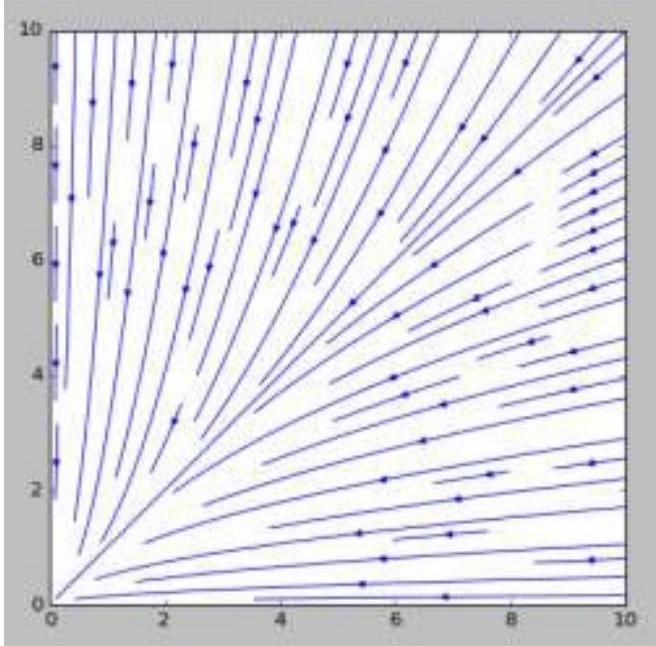
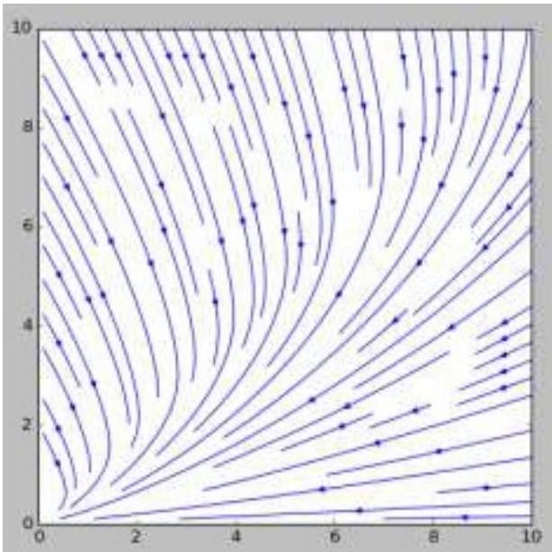
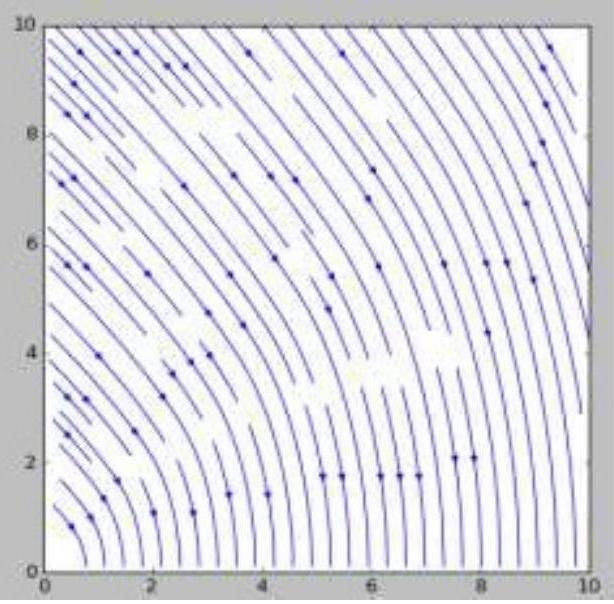
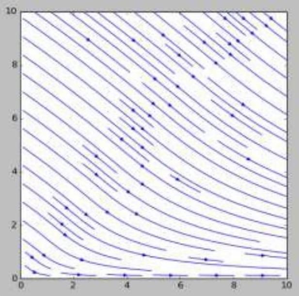

A1 ${ } ^ { 0.50 }$ Покажите, что суммарная сила, действующая на кольцо, определяется выражением:

$$
\vec { F } _ { t o t } = - \mu m g \cdot f \left( \frac { v ( t ) } { \omega ( t ) r } \right) \hat { x } ,
$$

где

$$
f ( a ) = \frac { 1 } { 2 \pi } \int _ { 0 } ^ { 2 \pi } \frac { a - \sin \theta } { \sqrt { 1 + a ^ { 2 } - 2 a \sin \theta } } d \theta
$$

Обозначим скорость кусочка, видимого из центра кольца под углом $d \theta$ как $\vec { u }$. Так как тело движется, а коэффициент трения не зависит от направления движения, то сила трения, действующая на выбранный кусочек, направлена противоположно его скорости. Тогда её можно записать в таком виде:

$$
d \vec { F } _ { f r i c } = - \frac { \vec { u } } { u } \mu d N = - \frac { ( v - \omega r \sin \theta ) \hat { x } + ( \omega r \cos \theta ) \hat { y } } { \sqrt { v ^ { 2 } + ( \omega r ) ^ { 2 } - 2 v \omega r \sin \theta } } \mu m g \frac { d \theta } { 2 \pi }
$$

Полная сила трения получается при интегрировании выражения вдоль всего кольца, т. е. в диапазоне углов от 0 до $2 \pi$.

Несложно заменить, что $F _ { \text {tot } } = 0$, так как всё выражение меняет знак при замене $\theta \rightarrow \pi - \theta$. Физически это соответствует тому, что силы, действующие на кусочки, симметричные относительно оси ОХ, проходящей через центр кольца, компенсируют у-составляющие друг друга.

Разделив числитель и знаменатель на $\omega r$, приходим к искомому выражению.

А2 ${ } ^ { 0.50 }$ Покажите, что суммарный момент, действующий на кольцо, равен:

$$
\begin{gathered}
\tau _ { t o t } = - \mu m g r f \left( \frac { \omega ( t ) r } { v ( t ) } \right) \\
d \vec { \tau } = \left[ \vec { r } \times d \vec { F } _ { f r i c } \right] = - \frac { [ \vec { r } \times \vec { u } ] } { u } \mu g d m
\end{gathered}
$$

В векторное произведение входит только компонента $\vec { u }$, перпендикулярная радиусу, т. е. $u _ { \tau } = \omega r - v \sin \theta$. подставляя всё в итоговое выражение, получим:

$$
\vec { \tau } = - \mu m g r \int _ { 0 } ^ { 2 \pi } \frac { \omega r - v \sin \theta } { \sqrt { v ^ { 2 } + ( \omega r ) ^ { 2 } - 2 v \omega r \sin \theta } } \frac { d \theta } { 2 \pi }
$$

откуда после сокращения на $v$ получится искомая формула.

А3 ${ } ^ { 0.10 }$ Докажите, что уравнения движения имеют вид:

$$
\begin{aligned}
\dot { v } & = - \mu g \cdot f \left( \frac { v } { \omega r } \right) \\
\dot { \omega } r & = - \mu g \cdot f \left( \frac { \omega r } { v } \right)
\end{aligned}
$$

Векторная сумма сил всегда сонаправлена скорости, поэтому $| \dot { \vec { v } } | = | \dot { v } |$, то есть тангенциальное ускорение равно нулю. Тогда уравнения движения примут вид:

$$
\begin{aligned}
m \dot { v } & = - \mu m g f \left( \frac { v } { \omega r } \right) \\
m \dot { \omega } r ^ { 2 } & = - \mu m g r f \left( \frac { \omega r } { v } \right) ,
\end{aligned}
$$

откуда после сокращения на $m$ и $m r$ соответственно получатся искомые равенства.

В1 ${ } ^ { 0.50 }$ Докажите:

a) $f ( 0 ) = 0 , f ( 1 ) = \frac { 2 } { \pi } , f ( \infty ) = 1$
b) $f ( a )$ строго возрастает при $a \geqslant 0$
a)

$$
f ( 0 ) = \frac { 1 } { 2 \pi } \int _ { 0 } ^ { 2 \pi } - \sin \theta d \theta = 0
$$

$$
\begin{aligned}
& f ( 1 ) = \frac { 1 } { 2 \pi } \int _ { 0 } ^ { 2 \pi } \frac { 1 - \sin \theta } { \sqrt { 2 - 2 \sin \theta } } d \theta = \frac { 1 } { 2 \pi } \int _ { 0 } ^ { 2 \pi } \sqrt { \frac { 1 - \sin \theta } { 2 } } d \theta = \\
& = \frac { 1 } { 2 \pi } \int _ { 0 } ^ { 2 \pi } \left| \sin \left( \frac { \theta } { 2 } - \frac { \pi } { 4 } \right) \right| d \theta = \frac { 1 } { \pi } \int _ { 0 } ^ { \pi } \sin \left( \frac { \theta } { 2 } \right) d \left( \frac { \theta } { 2 } \right) = \frac { 2 } { \pi } \\
& f ( \infty ) = \frac { 1 } { 2 \pi } \int _ { 0 } ^ { 2 \pi } \lim _ { a \rightarrow \infty } \frac { a - \sin \theta } { \sqrt { 1 + a ^ { 2 } - 2 a \sin \theta } } d \theta = \frac { 1 } { 2 \pi } \int _ { 0 } ^ { 2 \pi } d \theta = 1
\end{aligned}
$$

b)

$$
\begin{gathered}
\frac { d f } { d a } = \frac { 1 } { 2 \pi } \int _ { 0 } ^ { 2 \pi } \frac { \partial } { \partial a } \left[ \frac { a - \sin \theta } { \sqrt { 1 + a ^ { 2 } - 2 a \sin \theta } } \right] d \theta = \\
= \frac { 1 } { 2 \pi } \int _ { 0 } ^ { 2 \pi } \left[ \frac { 1 } { \sqrt { 1 + a ^ { 2 } - 2 a \sin \theta } } - \frac { ( a - \sin \theta ) ^ { 2 } } { \left( 1 + a ^ { 2 } - 2 a \sin \theta \right) ^ { 3 / 2 } } \right] d \theta = \\
= \frac { 1 } { 2 \pi } \int _ { 0 } ^ { 2 \pi } \frac { \cos ^ { 2 } \theta } { \left( 1 + a ^ { 2 } - 2 a \sin \theta \right) ^ { 3 / 2 } } d \theta > 0
\end{gathered}
$$

В2 ${ } ^ { 0.30 }$ Рассмотрим поведение параметра $a ( t ) = \frac { v ( t ) } { \omega ( t ) r }$. Покажите, что происходит с $a ( t )$ (растёт/уменьшается/остаётся неизменным) в каждом из следующих случаев:
a) в некоторый момент $a ( t ) = 1$
b) в некоторый момент $a ( t ) < 1$
c) в некоторый момент $a ( t ) > 1$

$$
\dot { a } = \frac { d } { d t } \left( \frac { v } { \omega r } \right) = \frac { \dot { v } \omega r - v \dot { \omega } r } { ( \omega r ) ^ { 2 } } = - \frac { \mu m g } { \omega r } \left( f ( a ) - a f \left( \frac { 1 } { a } \right) \right)
$$

Анализируя данное выражение, получаем:

$$
\begin{gathered}
f ( a ) - a f \left( \frac { 1 } { a } \right) = \frac { 1 } { 2 \pi } \int _ { 0 } ^ { 2 \pi } \frac { a - \sin \theta - a ( 1 - a \sin \theta ) } { \sqrt { 1 + a ^ { 2 } - 2 a \sin \theta } } d \theta = \\
= \frac { a ^ { 2 } - 1 } { 2 \pi } \int _ { 0 } ^ { 2 \pi } \frac { \sin \theta } { \sqrt { 1 + a ^ { 2 } - 2 a \sin \theta } } d \theta
\end{gathered}
$$

В области отрицательных значений подынтегральной функции знаменатель больше, чем в области положительных, поэтому интеграл всегда положителен. Таким образом:

$$
\begin{gathered}
\operatorname { sign } ( \dot { a } ) = \operatorname { sign } ( 1 - a ) \\
\dot { a } = 0 \Rightarrow a = 1
\end{gathered}
$$

Заметим, что ответ можно было бы получить и из более простых логических соображений

Ответ: а) $a = 1 \quad \Rightarrow \quad a$ - постоянна;
b) $a < 1 \Rightarrow a$ - возрастает;
c) $a > 1 \Rightarrow a -$ убывает.

ВЗ ${ } ^ { \mathbf { 0 . 6 0 } }$ Нарисуйте качественно на графике, осями которого являются $v$ и $\omega r$, траектории, отображающие разное движение кольца, то есть при заданных $v _ { 0 }$ и $\omega _ { 0 } r$ нарисуйте, как они будут изменяться с течением времени.

Необходимо нарисовать хотя бы одну траекторию на каждый пункт предыдущего задания. Кроме того, нарисуйте траекторию, проходящую через точку $\left( v _ { 0 } , 0 \right)$ и еще одну, начинающуюся в точке $\left( 0 , \omega _ { 0 } r \right)$

Подпишите оси графика и укажите направления движения системы для каждой нарисованной траектории

Как можно было заметить из предыдущего пункта, все траектории асимптотически стремятся к единице. При этом, $\dot { v } < 0$ и $\dot { \omega } r < 0$. Приведём искомый график:

Ответ:

В4 ${ } ^ { 0.10 }$ Вычислите мгновенную мощность, которая расходуется, когда есть только угловая скорость $\omega ( v = 0 )$, и отдельно, когда присутствует только линейная $v ( \omega = 0 )$.

В случае отсутствия вращательного движения сила трения, действующая на каждый кусочек, направлена против оси X. Тогда:

$$
P _ { v } = - F _ { t o t } v = - \mu m g v
$$

В случае отсутствия поступательного движения

$$
P _ { \omega } = - \tau _ { t o t } \omega = - \mu m g \omega r
$$

Более строгие рассуждения будут приведены в пункте B5.

Ответ:

$$
\begin{gathered}
P _ { v } = - \mu m g v \\
P _ { \omega } = - \mu m g \omega r
\end{gathered}
$$

В5 ${ } ^ { 0.60 }$ Для заданных $v$ и $\omega$ вычислите мгновенную мощность $P$, которая расходуется на трение в данный момент времени. Дайте ответ в виде интеграла с безразмерной переменной.

$$
P = \int \vec { u } \cdot d \vec { F } _ { f r i c } = - \mu m g \int _ { 0 } ^ { 2 \pi } \vec { u } \cdot \frac { \vec { u } } { u } \frac { d \theta } { 2 \pi } = - \mu m g \omega r \int _ { 0 } ^ { 2 \pi } \frac { u } { \omega r } \frac { d \theta } { 2 \pi }
$$

Подставляя выражение для скорости кусочка $\vec { u }$ :

Ответ:

$$
P = - \mu m g \omega r \int _ { 0 } ^ { 2 \pi } \sqrt { 1 + \left( \frac { v } { \omega r } \right) ^ { 2 } - 2 \left( \frac { v } { \omega r } \right) \sin ( \theta ) } \frac { d \theta } { 2 \pi }
$$

В6 ${ } ^ { 1.20 }$ Предположим, что кольцу придали определённую начальную кинетическую энергию $E _ { 0 }$. Каково должно быть соотношение $a _ { 0 } = \frac { v _ { 0 } } { \omega _ { 0 } r }$, при котором кольцо будет двигаться максимальное время?

Подсказка: Постарайтесь дать ответ на предыдущий пункт при помощи только $E _ { 0 }$ и $a _ { 0 }$ (и других данных из этого пункта), исключив из уравнения $v$ и $\omega$

Воспользуемся подсказкой :)

$$
\begin{gathered}
E = \frac { m } { 2 } \left[ v ^ { 2 } + ( \omega r ) ^ { 2 } \right] = \frac { m } { 2 } ( \omega r ) ^ { 2 } \left( a ^ { 2 } + 1 \right) \\
m \omega r = \sqrt { 2 m E } \cdot \frac { 1 } { \sqrt { 1 + a ^ { 2 } } } \\
P ( a , E ) = - \mu g \sqrt { 2 m E } \cdot \int _ { 0 } ^ { 2 \pi } \sqrt { 1 - \frac { 2 a } { 1 + a ^ { 2 } } \sin ( \theta ) } \frac { d \theta } { 2 \pi }
\end{gathered}
$$

Анализировать последнее выражение можно несколькими способами. Например, взяв частную производную по а

$$
\frac { \partial } { \partial a } ( P ( a , E ) ) = \mu g \sqrt { 2 m E } \frac { 1 - a ^ { 2 } } { 1 + a ^ { 2 } } \cdot \int _ { 0 } ^ { 2 \pi } \frac { \sin \theta } { \sqrt { 1 + a ^ { 2 } - 2 a \sin \theta } } \frac { d \theta } { 2 \pi }
$$

где интеграл в правой части совпадает с интегралом в $B 2$ и имеет положительные значения при любых $a$. Так как при $a < 1$ функция $P$ убывает, а при $a > 1 -$ возрастает, то её минимум реализуется в $a _ { 0 } = 1$.
Из того факта, что мощность $P$ всегда отрицательна и стремится к $P \rightarrow 0$ только при $E \rightarrow 0$ очевидно, что движение может закончиться только при $E = 0$. Также, следует заметить, что движение с параметром $a = 1$ устойчиво, а значит, при $a _ { 0 } = 1$ всё движение будет происходит с минимально возможной мощностью, т. е. пройдет максимально возможное время при заданной начальной энергии $E = E _ { 0 }$

Ответ:

$$
a _ { 0 } = 1
$$

В7 ${ } ^ { 0.50 }$ Каково максимальное время движения при начальной энергии $E _ { 0 }$ ?

Как мы выяснили в предыдущем пункте, движение, продолжающееся максимальное время происходит при $a = 1$. Тогда время можно найти из уравнения:

$$
\dot { E } = P ( 1 , E ) = - \mu g \sqrt { 2 m E } \cdot \int _ { 0 } ^ { 2 \pi } \sqrt { 1 - \sin ( \theta ) } \frac { d \theta } { 2 \pi }
$$

Интеграл вычисляется аналогично пункту $B 1$ с помощью тригонометрической замены, указанной в условии.

$$
\int _ { 0 } ^ { 2 \pi } \sqrt { 1 - \sin ( \theta ) } \frac { d \theta } { 2 \pi } = \frac { \sqrt { 2 } } { \pi } \int _ { 0 } ^ { \pi } \sin \left( \frac { \theta } { 2 } \right) d \left( \frac { \theta } { 2 } \right) = \frac { 2 \sqrt { 2 } } { \pi }
$$

Разделяя переменные, получим

$$
\int _ { E _ { 0 } } ^ { 0 } \frac { d E } { \sqrt { E } } = - \mu g \sqrt { m } \cdot \frac { 4 } { \pi } \int _ { 0 } ^ { \tau } d t
$$

Из чего несложно выразить ответ.

Ответ:

$$
\tau = \frac { \pi } { 2 \mu g } \sqrt { \frac { E _ { 0 } } { m } }
$$

С1 ${ } ^ { 0.60 }$ Напишите заново уравнения движения из пункта А3 таким образом, чтобы они подходили под новое условие.

Вывод уравнения для величины силы трения и момента силы трения остаётся тем же, однако, теперь полная реакция опоры равна $N = m g \cos \alpha$. Таким образом, суммарный момент, действующий на кольцо, просто умножится на $\cos \alpha$.
С уравнениями для проекций сил, лежащих в плоскости движения немного сложнее: суммарная сила теперь не сонаправлена со скоростью кольца. Обозначив $\cos \varphi = \left( \widehat { \vec { v } , \vec { g } _ { \tau } } \right)$, где $\vec { g } _ { \tau }$ - составляющая вектора $\vec { g }$, лежащая вдоль плоскости, получим уравнения:

Ответ:

$$
\begin{gathered}
\dot { v } = - \mu g f \left( \frac { v } { \omega r } \right) \cos \alpha + g \sin \alpha \cos \varphi \\
\dot { \omega } r = - \mu g f \left( \frac { \omega r } { v } \right) \cos \alpha
\end{gathered}
$$

С2 ${ } ^ { 2.00 }$ При заданных начальных $\omega _ { 0 }$ и $v _ { 0 } = 0$ нарисуйте все возможные семейства траекторий движения кольца в координатах $( v , \omega r )$ (для каждого типа кривых нарисуйте свой график). Укажите следующие составляющие:
a) соответствующие значения параметров;
b) конечные точки (в которые траектории приходят за конечное или бесконечное время) в плоскости $( v , \omega r )$. Здесь достаточно написать для каждой составляющей, что она стремится к нулю/ стремится к бесконечности/ равна или стремится к какой-то положительной величине.

Подпишите оси графика и укажите направления движения системы для каждой нарисованной траектории

Так как при начале движения кольцо имеет нулевую скорость $v _ { 0 } = 0$, то в предыдущем уравнении на протяжении всего движения $\cos \varphi = 0 . \dot { \omega } < 0$, т.е. $\omega \rightarrow 0$. В зависимости от величины $\tan \alpha$ возможны различные случаи: $v \rightarrow 0 , v \rightarrow$ const и $v \rightarrow \infty$. Выбор одного из этих случаев определяется знаком $\dot { v }$ при $\frac { v } { \omega r } \rightarrow \infty$. Искомые траектории приведены на рисунках.

