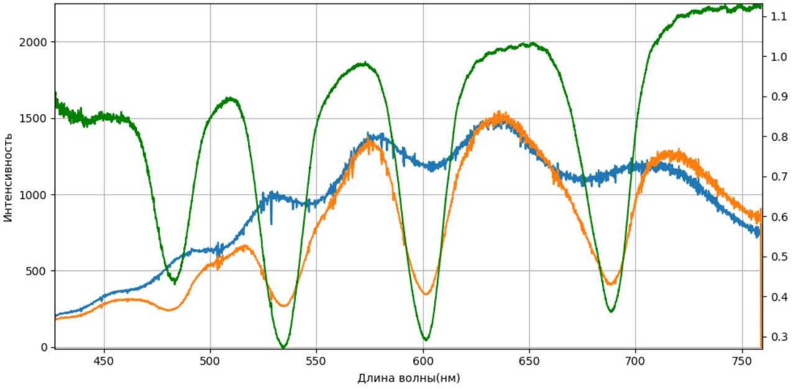
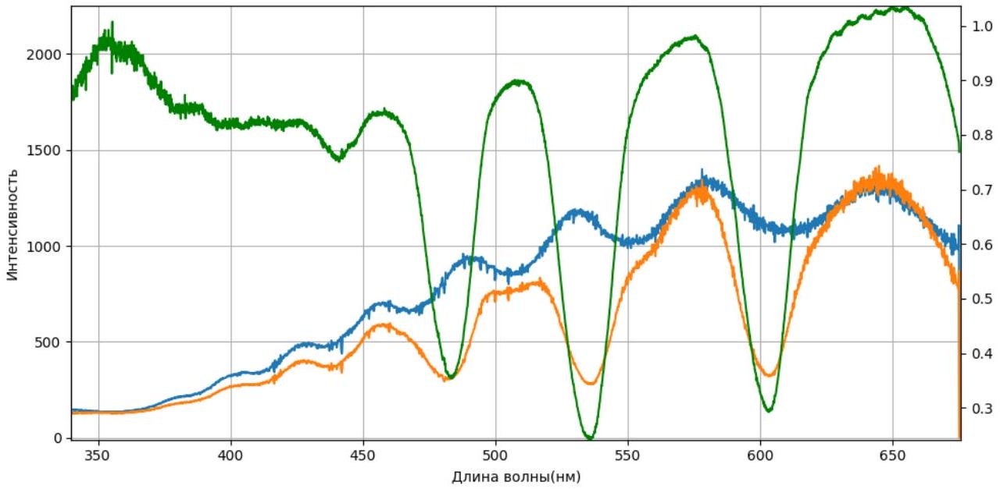
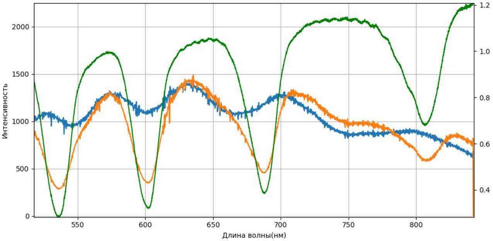
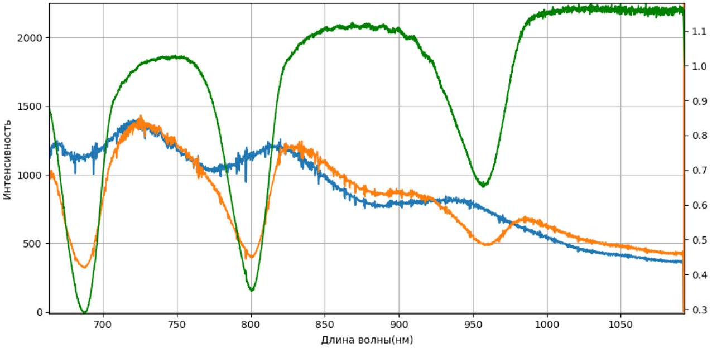
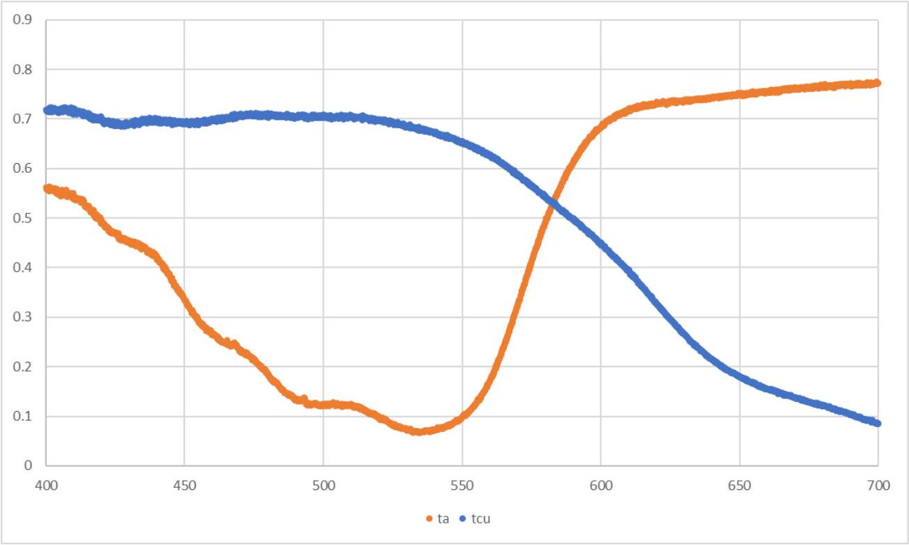
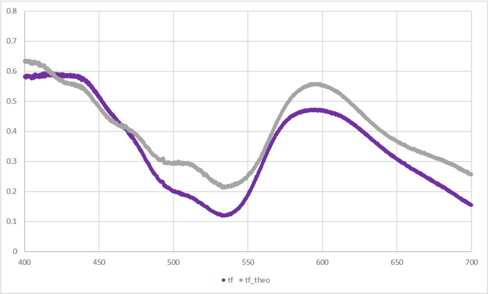
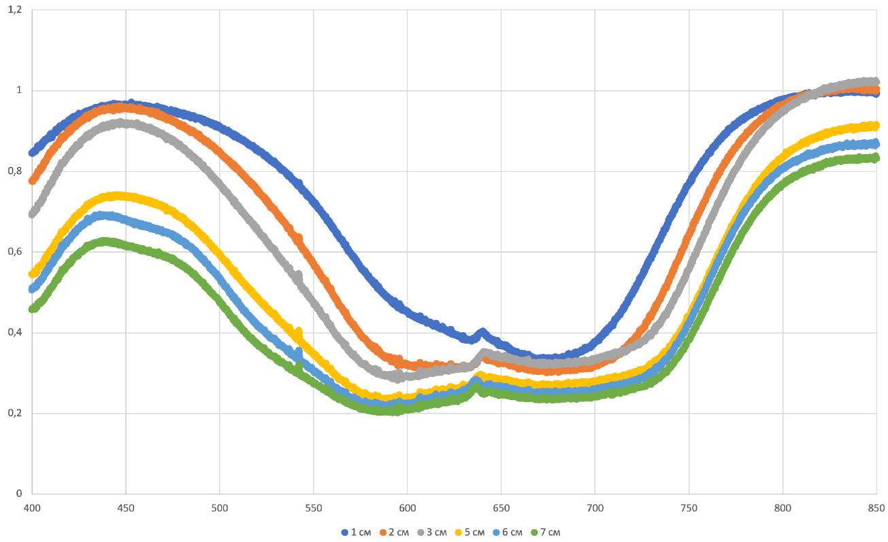
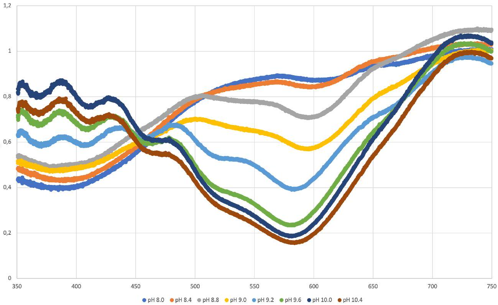
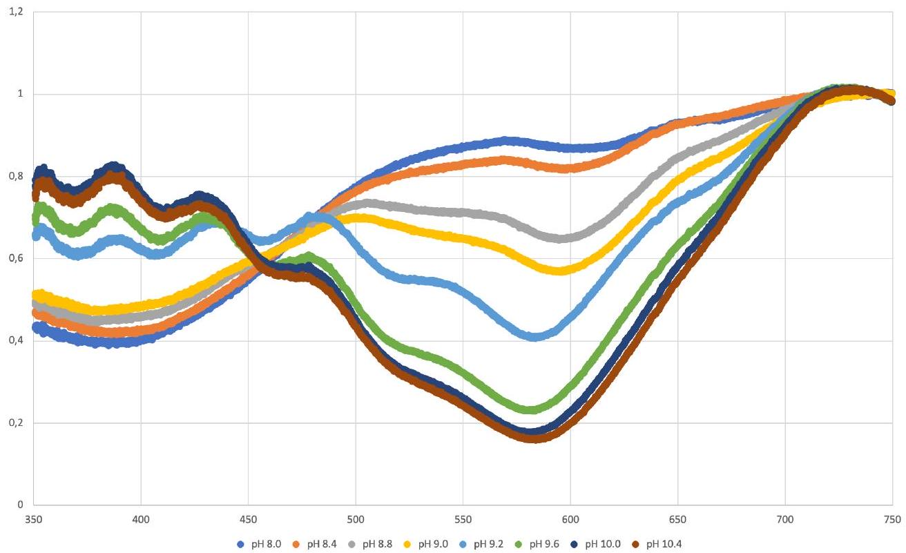
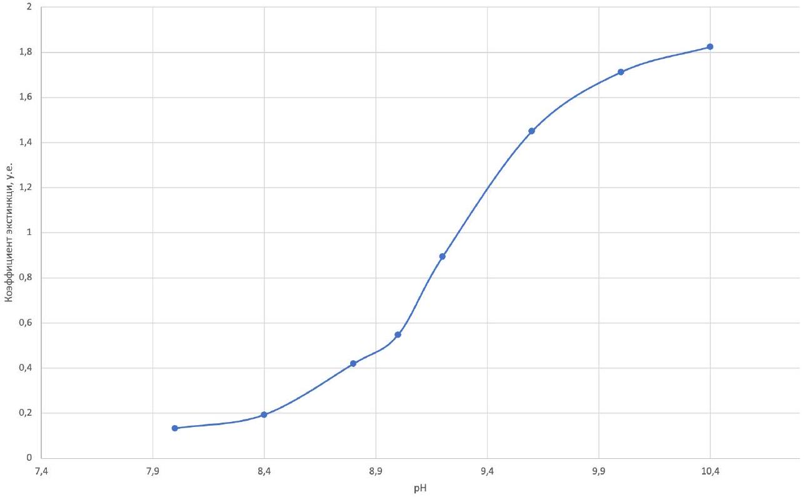

Проводим калибровку согласно инструкции. На спектре лампы идентифицируем провалы, получаем следующие ответы:

$$
\begin{aligned}
& \lambda _ { 1 } = 683 \mathrm { HM } \\
& \lambda _ { 2 } = 608 \mathrm { HM } \\
& \lambda _ { 3 } = 551 \mathrm { HM } \\
& \lambda _ { 4 } = 506 \mathrm { HM }
\end{aligned}
$$

BO ${ } ^ { - 20.00 }$ Выданный вам фотонный кристалл (см. оборудование (S1)) очень хрупкий. В стойку (2) вставьте магнитный держатель (4). На магнитный держатель (4) установите держатель фотонного кристалла (11). Достаньте фотонный кристалл (S1) из чашки Петри и установите его на держатель (11). Не роняйте и не тыкайте в кристалл. Порча кристалла приводит к дисквалификации этого тура.

В1 ${ } ^ { 1.60 }$ Снимите спектр исходного излучения. Установите в ход лучей в системе (рис. 2) фотонный кристалл в держателе. Снимите спектр прошедшего излучения. Пронаблюдайте четыре глубоких минимума пропускания. Определите, на каких длинах волн $\lambda$ наблюдаются минимумы пропускания. Определите, каким значениям $m$ они соответствуют. Определите соответствующие значения $t$.

Для решения этой части нужно гарантировать достаточную разрешающую способность установки. Этого можно добиться, раздвинув линзы на достаточно большое расстояние на оптической скамье, что позволит проверять параллельность пучка с высокой точностью, не пересобирая установку после каждой смены лампы и светодиодов. Также из выданного картона необходимо изготовить диафрагму (вырезать в нём тонкую щель, достаточно ширины $2 - 3$ мм), которую потом необходимо закрепить на линзе с дифракционной решёткой, что многократно уменьшит влияние расходимости лучей, вызванной неизбежной неидеальностью юстировки.

Произведём калибровку спектрометра, как описано в части А. Снимем спектр лампы с фотонным кристаллов и без него, после чего поделим эти графики друг на друга. Должна получиться картинка, похожая на представленную ниже (регулярная "рябь" спектра в промежутках между соседними провалами свидетельствует о точности юстировки, достаточной для проведения измерений).

Из закона Брэгга-Снелла следует, что о значениях $m$ можно судить по свободному члену зависимости $\lambda ^ { - 1 } ( l )$, где $l$ - номер провала пропускания кристалла. Пропускание ищется методом, описанным во введении к этой части. Окончательные ответы приведены в таблице ниже.

Ответ:

| $\lambda$, нм | $m$ | $t$ |
| :--- | :--- | :--- |
| 688 | 7 | 0.36 |
| 601 | 8 | 0.24 |
| 537 | 9 | 0.26 |
| 483 | 10 | 0.30 |

| $m$ | $\lambda$, нм (широкие) | $\lambda$, нм (узкие) | t |
| :--- | :--- | :--- | :--- |
| 7 | [658, 718] | [673, 703] | [0.20, 0.64] |
| 8 | [571, 631] | [586, 616] | [0.06, 0.40] |
| 9 | [507, 567] | [522, 552] | [0.07, 0.42] |
| 10 | [453, 513] | [468, 498] | [0.12, 0.48] |

ранее. При отсутствии файла пункт оцениваться не будет!

Найдя с достаточно высокой точностью минимумы пропускания фотонного кристалла, можно в дальнейшем не использовать для калибровки светодиоды, что заметно экономит время и усилия. В пунктах В2 - В4 будем пользоваться калибровкой по трём (или двум, как в В4) провалам, соседствующим с исследуемым. Для минимума, находящегося в UV-диапазоне, получим показанный ниже график. Параметры минимума ищутся аналогично.

Ответ:

$$
m = 11 , \quad \lambda = 441 \text { нм, } \quad t = 0.86 .
$$

В3 ${ } ^ { 0.50 }$ Найдите шестой минимум. Опишите, как вы это делаете. Какие $\lambda , m$ и $t$ ему соответствуют? Сохраните использованный при решении этого пункта график в папку Plots_«Фамилия» с названием «В3». На графике должен присутствовать найденный минимум и по меньшей мере еще один полученный ранее. При отсутствии файла пункт оцениваться не будет.

Действуем аналогично предыдущему пункту. Для ближайшего минимума в IR получим приведённый ниже график. Параметры минимума ищутся аналогично.

Ответ:

$$
m = 6 , \quad \lambda = 801 \text { нм } , \quad t = 0.39
$$

B4 ${ } ^ { 1.00 }$ Найдите седьмой минимум. Опишите, как вы это делаете. Найдите соответствующие ему $\lambda$ и $m$. Найдите коэффициент пропускания $t$. Сохраните использованный при решении этого пункта график в папку Plots_«Фамилия» с названием «В4». На графике должен присутствовать найденный минимум и по меньшей мере еще один полученный ранее. При отсутствии файла пункт оцениваться не будет.

Действуем аналогично предыдущим пунктам. Для следующего минимума в IR получим приведённый ниже график. Параметры минимума ищутся аналогично.

Ответ:

$$
m = 5 , \quad \lambda = 961 \text { нм } , \quad t = 0.52
$$

В5 ${ } ^ { \mathbf { 0 . 5 0 } }$ С помощью закона Брэгга-Снелла найдите величину $D n$ для выданного вам фотонного кристалла.

Из закона Брэгга-Снелла следует, что зависимость $\lambda ^ { - 1 } ( m )$ - линейная с угловым коэффициентом $\frac { 1 } { 2 D n }$. Этот угловой коэффициент можно найти по экспериментальным данным с помощью графика или МНК. Данные представлены в таблице ниже.

| $m$ | $\lambda$, нм | $\lambda ^ { - 1 } , 10 ^ { 6 } \mathrm { M } ^ { - 1 }$ |
| :--- | :--- | :--- |
| 5 | 961 | 1.04 |
| 6 | 801 | 1.25 |
| 7 | 688 | 1.45 |
| 8 | 601 | 1.66 |
| 9 | 537 | 1.86 |
| 10 | 483 | 2.07 |
| 11 | 441 | 2.27 |

По ним находим $\frac { \mathrm { d } \lambda ^ { - 1 } } { \mathrm {~d} m } = 2.05 \cdot 10 ^ { 5 } \mathrm { M } ^ { - 1 }$, откуда $D n = \frac { 1 } { 2 \frac { \mathrm {~d} \lambda ^ { - 1 } } { \mathrm {~d} m } } = 2.44$ мкм.

Ответ:

$$
D n = 2.44
$$

C1 ${ } ^ { 0.50 }$ Наполните спектрометрическую кювету раствором анилин-оранжа (примерно 3 мл). Снимите зависимость коэффициента пропускания анилин-оранжа $t _ { a } ( \lambda )$. Постройте график на спектроскопическом шаблоне <> в листе ответов. Шкалы длин волн и коэффициента пропускания нанесены за вас. Укажите, каким фильтром является анилин-оранж: коротковолновым (пропускает короткие волны) или длинноволновым (пропускает длинные волны).

Исходя из того, что анилин-оранж имеет оранжевую окраску, можно предположить, что пропускается красная (длинноволновая) часть спектра. Это подтверждается экспериментальными данными.

С2 ${ } ^ { 0.50 }$ Наполните спектрометрическую кювету раствором медного купороса (примерно 3 мл). Снимите зависимость коэффициента пропускания медного купороса $t _ { C u } ( \lambda )$. Постройте график на том же спектроскопическом шаблоне <> в листе ответов. Шкалы длин волн и коэффициента пропускания нанесены за вас. Укажите, каким фильтром является раствор медного купороса: коротковолновым (пропускает короткие волны) или длинноволновым (пропускает длинные волны).

Исходя из того, что медный купорос имеет голубую окраску, можно предположить, что пропускается синяя (коротковолновая) часть спектра. Это подтверждается экспериментальными данными.

C3 ${ } ^ { 0.50 }$ Наполните спектрометрическую кювету смесью растворов анилин-оранжа и медного купороса в соотношении 1:1 (т.е. по 1.5 мл каждого). Снимите зависимость коэффициента пропускания смеси $t _ { f } ( \lambda )$. Постройте график на спектроскопическом шаблоне «SpC3» в листе ответов. Шкалы длин волн и

коэффициента пропускания нанесены за вас. Сохраните использованный при решении этого пункта график в папку Plots_«Фамилия» с названием «СЗ». При отсутствии файла пункт оцениваться не будет!

C4 ${ } ^ { 1.00 }$ Найдите теоретически, как связаны $t _ { a } , t _ { C u }$ и $t _ { f }$.

При смешивании растворов анилин-оранжа и медного купороса их концентрации уменьшаются в два раза по сравнению с начальными:

$$
n _ { a f } = n _ { a } / 2 , \quad n _ { C u f } = n _ { C u } / 2 .
$$

Если в растворе присутствуют два разных типа молекул, то проходит только то, что прошло бы через оба вещества. Поэтому, коэффициенты пропускания перемножаются для каждой длины волны.

Отсюда получаем ответ:

$$
t _ { f } = t _ { a f } t _ { C u f } = e ^ { - n _ { a } \varepsilon b / 2 } e ^ { - n _ { C u } \varepsilon b / 2 } = \sqrt { t _ { a } t _ { C u } } .
$$

C5 ${ } ^ { 1.50 }$ Вычислите значения $t _ { f } ^ { \text {теор } } ( \lambda )$ по предложенной вами формуле из пункта С4. Постройте график $t _ { f } ^ { \text {теор } } ( \lambda )$ на том же спектроскопическом шаблоне <> в листе ответов. Сделайте вывод о справедливости вашей формулы из пункта С4. Сделайте вывод: можно ли, используя коротковолновый и длинноволновый фильтры, получить полосовой фильтр.

Полученная формула выполняется достаточно хорошо.
Используя коротковолновый и длинноволновый фильтры можно получить полосовой фильтр.
Раствор медного купороса замешивался из сухого порошка для хозяйственного применения. Концентрация неизвестна, раствор замешивался на глаз, до достижения нужного эффекта.
Раствор анилина оранжевого замешивался из стокового 1\% раствора. Разбавлялся примерно в 50 раз, 3 мл на 150 мл финального объёма.

D1 ${ } ^ { 0.50 }$ Возьмите пробирку $Z$ (см. оборудование S4, замотанная пленкой пробирка), содержащую раствор тетраэтил-4,4-диаминотрифенилметана оксалата. B зависимости от наклона можно создать слой жидкости разной толщины. Выньте лампу из штатива (аккуратно! лампа горячая!), положите ее на скамью горизонтально. Посмотрите на горящую лампу через слой жидкости максимальной толщины. Укажите наблюдаемый цвет. Посмотрите на горящую лампу через слой жидкости маленькой толщины. Укажите цвет. Как меняется цвет в зависимости от толщины?

Тетраэтил-4,4-диаминотрифенилметана оксалат, так же известный как бриллиантовый зелёный, применятся в народном хозяйстве в виде 1\% спиртового раствора для наружного применения как антисептическое средство.

Если смотреть через толстый слой зелёнки, то свет лампы красный, если через тонкий - то сине-зелёный. Соответственно, с возрастанием толщины раствора цвет меняется от сине-зелёного к красному.

D2 ${ } ^ { 2.00 }$ Используя разбавленный раствор зеленки (см. оборудование S3), снимите спектры пропускания зеленки в зависимости от толщины слоя жидкости. Концентрация разбавленного раствора равна 10 мг/л, что в 1000 раз меньше, чем в пробирке $Z$. Постройте эти спектры пропускания на одном графике. Сохраните использованные при решении этого пункта графики в папку Plots_«Фамилия» с названием «D3_N», где N - толщина слоя жидкости в миллиметрах. При отсутствии файлов пункт оцениваться не будет!

Устанавливаем 7 кювет перед первой линзой, прямо перед лампой. Для получения данных именно для пропускания зеленки предпринимаем следующие меры. Во-первых, устанавливаем 7 кювет именно сразу, чтобы в фоновых данных учесть поглощение материала кювет.
Во-вторых, заполняем их водой, чтобы фон был измерен для системы с водой, и тогда, всё отличие будет только лишь в появлении зеленки, что нам и необходимо.
В-третьих, после кювет, на первой линзе, делаем диафрагму такую, чтобы на детектор попадал только свет прошедший через кюветы.
Измеряем уровень интенсивности $I _ { 0 } ( \lambda )$ для такой системы. Далее по ходу эксперимента уровень интенсивности будет только уменьшаться. Поэтому, необходимо настроить чувствительность так, чтобы уровень сигнала был близок к насыщению. Следует учесть, что при высоком уровне чувствительности возрастает так же регистрируемый уровень внешней застветки при выключенной лампе. Чтобы этот уровень убрать, можно использовать коробку, которой

можно закрыть всю установку.
После измерения уровня фона поочередно заменяем воду в кюветах на раствор зеленки, измеряем уровень интенсивности $I _ { x } ( \lambda )$, где $x = \{ 1 , \ldots , 7 \}$, количество кювет с зеленкой.
Коэффициент пропускания находим поделив одно на другое для каждого $x$ :

$$
t ( \lambda ) = \frac { I _ { x } ( \lambda ) } { I _ { 0 } ( \lambda ) } .
$$

D3 ${ } ^ { 2.00 }$ Для двух длин волн ( $\lambda _ { 1 } = 480$ нм и $\lambda _ { 2 } = 790$ нм) запишите в таблицу зависимость коэффициента пропускания от пройденного светом пути. Определите коэффициенты экстинкции $\varepsilon _ { 1 }$ и $\varepsilon _ { 2 }$ для этих двух длин волн.

Заносим в таблицу данные для пропускания для указанных длин волн. Строим график в координатах $\ln ( t )$ от $b$. Коэффициент наклона и коэффициент экстинкции связаны следующей формулой:

$$
\frac { d \ln ( t ) } { d b } = - \varepsilon n .
$$

Получаем следующие значения для коэффициентов экстинкции:

$$
\begin{aligned}
& \varepsilon _ { 1 } = 9 \mathrm { M } \pi ^ { 2 } / \mathrm { M } \Gamma \\
& \varepsilon _ { 2 } = 5 \mathrm { M } ^ { 2 } / \mathrm { M } \Gamma
\end{aligned}
$$

D4 ${ } ^ { 0.50 }$ Объясните эффект, который вы наблюдали в пункте D1.

Коэффициент экстинкции для зеленого цвета больше, чем для красного. Когда слой зелёнки большой, доля прошедшего зеленого цвета мала, по сравнению с красным, поэтому, раствор выглядит красным. Когда слой тонкий, красный и зеленый проходят в значительной мере, однако, чувствительность глаза велика в зелёном, а красный проходит лишь в самом конце видимого диапазона. Этого объяснения достаточно для получения баллов за этот пункт.
Более подробное объяснение из книги 'Опыты в домашней лаборатории. Библиотечка 'Квант'. Выпуск 4' \ЛОтветственный редактор академик И. К. Кикоин -Москва: Наука, 1981:http://physiclib.ru/books/item/f00/s00/z0000060/st026.shtml

Покупался 1\% спиртовой раствор зелёнки (https://www.rlsnet.ru/mnn_index_id_3463.htm). Для задачи использовалось разведение в 1000 раз. Важно приготовить раствор прямо перед туром, известно, что раствор в воде разлагается под действием света.

Е1 ${ } ^ { 1.60 }$ Снимите спектры пропускания для 8 значений рН растворов. Постройте все эти спектры на одном спектроскопическом шаблоне <>.

E2 ${ } ^ { 0.60 }$ Укажите длину волны $\lambda _ { c h }$ в видимом диапазоне, на которой тимоловый синий наиболее чувствителен к рН. Укажите длину волны $\lambda _ { i s o }$ в видимом диапазоне, на которой тимоловый синий наименее чувствителен к рН.

E3 ${ } ^ { 2.00 }$
Для длины волны, на которой тимоловый синий наиболее чувствителен к рН, постройте график зависимости коэффициента экстинкции от рН. Коэффициент экстинкции выразите в условных единицах.

Из условия известно, что в инфракрасной области пропускание не зависит от рН. Поэтому, можно отнормироваться на значения пропускания в этой области. Тогда значение коэффициента экстинкции в условных единицах может быть пересчитано как

$$
\varepsilon = - \ln t
$$

E4 ${ } ^ { 0.80 }$
Предложите способ спектрально определить значение рН раствора, в который добавили некоторое количество тимолового синего. Какой минимальный набор данных может понадобиться?

Для определения pH раствора с неизвестной концентрацией тимола синего необходимо измерять интенсивности на двух длинах волн: изобестическая точка $\lambda _ { \text {iso } }$, и ещё одна длина волны, на которой есть изменения (лучше всего на $\lambda _ { \text {ch } }$ ).
По отношению коэффициентов пропускания $t \left( \lambda _ { c h } \right) / t \left( \lambda _ { \text {iso } } \right)$ можно однозначно определить значение pH .
Растворы были получены следующим образом. В 1 M Tris (https://en.wikipedia.org/wiki/Tris) добавлялся 1 M Citric Acid (https://en.wikipedia.org/wiki/Citric_acid) до получения нужного значения pH в диапазоне 8.0 - 10.4. Стоковые растворы имеют рН около 11 и 3 , поэтому, нужно немного кислоты и много щелочи. После стоки разводились водой в 30 раз, то есть до концентрации 33 мМ. Растворы в такой концентрации выдавались участникам.

Тимол синий замешивался следующим образом. На 50 мл
50 мг сухого тимола синего
10 мл спирта (перегнанный медицинский 96\% спирт)
430 мкл 0.5 M NaOH
до 50 мл воды

После данный стоковый раствор выдавался участникам в количестве 1 мл.
