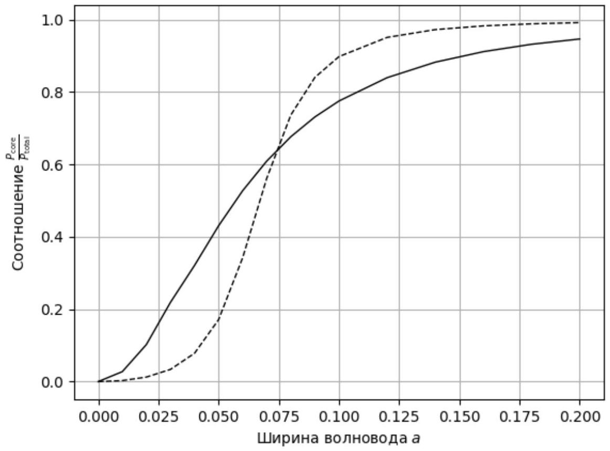

Так как $x$-компонента поля нормирована на значение в центре, линеаризацией зависимости в сердцевине волновода является arccos $E _ { x }$. Угловой коэффициент полученной прямой равен $v$.

Линеаризацией зависимости в оболочке волновода является $\ln E _ { x } . w$ представляет собой угловой коэффициент, взятый с противоположным знаком.

Ответ:

$$
v = 1.210 , \quad w = 3.064
$$

А2 ${ } ^ { 0.40 }$ Выразите $\varepsilon _ { x } , \rho$ и $\varepsilon _ { z }$ через $v$ и $w$. Найдите $\varepsilon _ { x } , \rho$ и $\varepsilon _ { z }$ для первого волновода.

Один из возможных способов решения (M1) - выразить $\varepsilon _ { z }$ через $v$ и $w$ как

$$
\varepsilon _ { z } = \frac { \varepsilon w } { v \tan v } = 11.52 ,
$$

после чего можно выразить $\rho$ и $\varepsilon _ { x }$ следующим способом:

$$
\begin{gathered}
\rho = \frac { \frac { \varepsilon w } { v \tan v } - \varepsilon _ { 2 } } { \varepsilon _ { 1 } - \varepsilon _ { 2 } } = 0.57 , \\
\varepsilon _ { x } = \frac { \varepsilon _ { 1 } \varepsilon _ { 2 } } { \varepsilon _ { 1 } + \varepsilon _ { 2 } - \frac { \varepsilon w } { v \tan v } } = 4.51 ,
\end{gathered}
$$

либо же (M2) как

$$
\begin{gathered}
\varepsilon _ { x } = \frac { 4 \pi ^ { 2 } a ^ { 2 } \varepsilon - v ^ { 2 } } { \frac { w ^ { 2 } } { \varepsilon _ { z } } + 4 \pi ^ { 2 } a ^ { 2 } } = 2.72 \\
\rho = \frac { \frac { 1 } { \varepsilon _ { x } } - \frac { 1 } { \varepsilon _ { 2 } } } { \frac { 1 } { \varepsilon _ { 1 } } - \frac { 1 } { \varepsilon _ { 2 } } } = 0.20
\end{gathered}
$$

Альтернативный метод (М3) - найти $\varepsilon _ { x }$ по перепаду поля при переходе от сердцевины волновода к его оболочке, т.е.

$$
\varepsilon _ { x } = \varepsilon \frac { \left. E _ { x } \right| _ { \tilde { x } = 1 - 0 } } { \left. E _ { x } \right| _ { \tilde { x } = 1 + 0 } } = 5.01 ,
$$

откуда потом выразить $\rho$ и $\varepsilon _ { z }$ как

$$
\begin{gathered}
\rho = \frac { \varepsilon _ { 1 } } { \varepsilon _ { 1 } - \varepsilon _ { 2 } } \left( 1 - \frac { \varepsilon _ { 2 } } { \varepsilon _ { x } } \right) = 0.63 \\
\varepsilon _ { z } = \varepsilon _ { 2 } + \varepsilon _ { 1 } - \frac { \varepsilon _ { 1 } \varepsilon _ { 2 } } { \varepsilon _ { x } } = 12.44
\end{gathered}
$$

Альтернативные методы, логически корректные и не содержащие вычислительных ошибок, также засчитываются.

Все способы считаются эквивалентными и оцениваются одинаково. При наличии решения двумя способами второй способ оценивается в соответствии с А3.

Примечание: за А3 даётся в два раза больше баллов, поскольку наличие второго способа оценки параметров волновода ценно с практической точки зрения, т.К. позволяет выбрать более точный метод.

А3 ${ } ^ { 0.80 }$ Найдите $\varepsilon _ { x } , \rho$ и $\varepsilon _ { z }$ ещё одним способом. Сравните полученные результаты. На ваш взгляд, какой из них точнее?

Ответ: М1:

$$
\begin{gathered}
\varepsilon _ { z } = \frac { \varepsilon w } { v \tan v } = 11.52 , \\
\rho = \frac { \frac { \varepsilon w } { v \tan v } - \varepsilon _ { 2 } } { \varepsilon _ { 1 } - \varepsilon _ { 2 } } = 0.57 , \\
\varepsilon _ { x } = \frac { \varepsilon _ { 1 } \varepsilon _ { 2 } } { \varepsilon _ { 1 } + \varepsilon _ { 2 } - \frac { \varepsilon w } { v \tan v } } = 4.51
\end{gathered}
$$

M2:

$$
\begin{gathered}
\varepsilon _ { z } = \frac { \varepsilon w } { v \tan v } = 11.52 \\
\varepsilon _ { x } = \frac { 4 \pi ^ { 2 } a ^ { 2 } \varepsilon - v ^ { 2 } } { \frac { w ^ { 2 } } { \varepsilon _ { z } } + 4 \pi ^ { 2 } a ^ { 2 } } = 2.72 \\
\rho = \frac { \frac { 1 } { \varepsilon _ { x } } - \frac { 1 } { \varepsilon _ { 2 } } } { \frac { 1 } { \varepsilon _ { 1 } } - \frac { 1 } { \varepsilon _ { 2 } } } = 0.20
\end{gathered}
$$

M3:

$$
\begin{gathered}
\varepsilon _ { x } = \varepsilon \frac { \left. E _ { x } \right| _ { \tilde { x } = 1 - 0 } } { \left. E _ { x } \right| _ { \tilde { x } = 1 + 0 } } = 5.01 , \\
\rho = \frac { \varepsilon _ { 1 } } { \varepsilon _ { 1 } - \varepsilon _ { 2 } } \left( 1 - \frac { \varepsilon _ { 2 } } { \varepsilon _ { x } } \right) = 0.63 , \\
\varepsilon _ { z } = \varepsilon _ { 2 } + \varepsilon _ { 1 } - \frac { \varepsilon _ { 1 } \varepsilon _ { 2 } } { \varepsilon _ { x } } = 12.44
\end{gathered}
$$

A4 ${ } ^ { 1.50 }$ Повторите действия пунктов А1-3 для второго профиля. Что вы можете сказать о втором волноводе?

Ответ: М1:

$$
\begin{gathered}
\varepsilon _ { z } = \frac { \varepsilon w } { v \tan v } = 1.73 , \\
\rho = \frac { \frac { \varepsilon w } { v \tan v } - \varepsilon _ { 2 } } { \varepsilon _ { 1 } - \varepsilon _ { 2 } } = - 0.03 , \\
\varepsilon _ { x } = \frac { \varepsilon _ { 1 } \varepsilon _ { 2 } } { \varepsilon _ { 1 } + \varepsilon _ { 2 } - \frac { \varepsilon w } { v \tan v } } = 2.19
\end{gathered}
$$

M2:

$$
\begin{gathered}
\varepsilon _ { z } = \frac { \varepsilon w } { v \tan v } = 1.73 , \\
\varepsilon _ { x } = \frac { 4 \pi ^ { 2 } a ^ { 2 } \varepsilon - v ^ { 2 } } { \frac { w ^ { 2 } } { \varepsilon _ { z } } + 4 \pi ^ { 2 } a ^ { 2 } } = 1.75 \\
\rho = \frac { \frac { 1 } { \varepsilon _ { x } } - \frac { 1 } { \varepsilon _ { 2 } } } { \frac { 1 } { \varepsilon _ { 1 } } - \frac { 1 } { \varepsilon _ { 2 } } } = - 0.32
\end{gathered}
$$

В1 ${ } ^ { 0.50 }$ Выразите $\frac { P _ { \text {core } } } { P _ { \text {total } } }$ через $v , w , \varepsilon$ и $\varepsilon _ { x }$.
Подсказка: Плотность потока энергии электромагнитного поля задаётся средним значением вектора Пойнтинга $\langle \vec { S } \rangle = \left\langle \left[ \vec { E } \times \vec { H } ^ { * } \right] \right\rangle$, где ${ } ^ { * }$ обозначает комплексное сопряжение.

Непосредственно подставляя выражения для полей в сердцевине и оболочке волновода в выражение для вектора Пойнтинга, получаем

$$
\left\langle S _ { z } \right\rangle \propto \begin{cases} \frac { A ^ { 2 } } { \varepsilon } \cos ^ { 2 } ( v \tilde { x } ) , & | \tilde { x } | < 1 \\ \frac { B ^ { 2 } } { \varepsilon _ { x } } e ^ { - 2 w \tilde { x } } , & | \tilde { x } | > 1 \end{cases}
$$

Интегрируя $\left\langle S _ { z } \right\rangle$ по $\tilde { x }$ от 0 до 1 , получаем

$$
P _ { \text {core } } \propto \frac { A ^ { 2 } } { \varepsilon } \left( 1 + \frac { \sin ( 2 v ) } { 2 v } \right) ,
$$

интегрируя от 1 до $+ \infty$, получаем

$$
P _ { \text {cladding } } \propto \frac { B ^ { 2 } } { \varepsilon _ { x } } \frac { e ^ { - 2 w } } { w }
$$

(знак $\propto$ означает, что мы опускаем одинаковый числовой множитель у получаемых величин, поскольку в конечный ответ войдёт только их отношение). Наконец,

$$
\frac { P _ { \text {core } } } { P _ { \text {total } } } = \frac { P _ { \text {core } } } { P _ { \text {core } } + P _ { \text {cladding } } } = \frac { \varepsilon _ { x } w ( 2 v + \sin 2 v ) } { 2 \varepsilon v \cos ^ { 2 } v + \varepsilon _ { x } w ( 2 v + \sin 2 v ) } .
$$

Ответ:

$$
\frac { P _ { \text {core } } } { P _ { \text {total } } } = \frac { \varepsilon _ { x } w ( 2 v + \sin 2 v ) } { 2 \varepsilon v \cos ^ { 2 } v + \varepsilon _ { x } w ( 2 v + \sin 2 v ) }
$$

В2 ${ } ^ { 2.25 }$ Для анизотропного волновода найдите $v , w$ и $\frac { P _ { \text {core } } } { P _ { \text {total } } }$ для каждого из указанных значений $a$.

Для нахождения $v$ и $w$ необходимо было воспользоваться системой уравнений из условия. Наиболее удобным для решения оказывается исключить $w$ из уравнений. В результате получаются два уравнения для итеративного решения:

$$
\begin{gathered}
v = \frac { 2 \pi a \sqrt { \varepsilon - \varepsilon _ { x } } } { \sqrt { 1 + \frac { \varepsilon _ { x } \varepsilon _ { z } } { \varepsilon ^ { 2 } } \operatorname { tg } ^ { 2 } v } } \\
v = \operatorname { arctg } \left[ \frac { \varepsilon } { \sqrt { \varepsilon _ { x } \varepsilon _ { z } } } \sqrt { \frac { 4 \pi ^ { 2 } a ^ { 2 } \left( \varepsilon - \varepsilon _ { x } \right) } { v ^ { 2 } } - 1 } \right]
\end{gathered}
$$

При некоторых значениях $a$ к ответу сходится первое, а при других -- второе уравнение. $w$ находится подстановкой полученного значения $v$ в уравнение

$$
w = \frac { \varepsilon _ { z } } { \varepsilon } v \operatorname { tg } v .
$$

$\frac { P _ { \text {core } } } { P _ { \text {total } } }$ рассчитывается по формуле, полученной в пункте В1. Пункт В3 решается аналогично.

Ответ:

| $a$ | $v$ | $w$ | $\frac { P _ { \text {core } } } { P _ { \text {total } } }$ |
| :--- | :--- | :--- | :--- |
| 0.01 | 0.132 | 0.022 | 0.027 |
| 0.02 | 0.256 | 0.087 | 0.102 |
| 0.03 | 0.388 | 0.201 | 0.219 |
| 0.04 | 0.482 | 0.319 | 0.321 |
| 0.05 | 0.575 | 0.472 | 0.430 |
| 0.06 | 0.657 | 0.641 | 0.527 |
| 0.07 | 0.728 | 0.822 | 0.609 |
| 0.08 | 0.790 | 1.010 | 0.677 |
| 0.09 | 0.844 | 1.203 | 0.731 |
| 0.10 | 0.892 | 1.399 | 0.775 |
| 0.12 | 0.971 | 1.796 | 0.840 |
| 0.14 | 1.033 | 2.196 | 0.882 |
| 0.16 | 1.084 | 2.596 | 0.912 |
| 0.18 | 1.126 | 2.995 | 0.932 |
| 0.20 | 1.160 | 3.393 | 0.947 |

Вз ${ } ^ { 2.25 }$ Для обычного волновода найдите $v , w$ и $\frac { P _ { \text {core } } } { P _ { \text {total } } }$ для каждого из указанных значений $a$.

Ответ:

| $a$ | $v$ | $w$ | $\frac { P _ { \text {core } } } { P _ { \text {total } } }$ |
| :--- | :--- | :--- | :--- |
| 0.01 | 0.196 | 0.007 | 0.003 |
| 0.02 | 0.392 | 0.030 | 0.012 |
| 0.03 | 0.585 | 0.072 | 0.034 |
| 0.04 | 0.774 | 0.141 | 0.078 |
| 0.05 | 0.951 | 0.249 | 0.171 |
| 0.06 | 1.106 | 0.411 | 0.342 |
| 0.07 | 1.223 | 0.631 | 0.562 |
| 0.08 | 1.302 | 0.883 | 0.737 |
| 0.09 | 1.353 | 1.141 | 0.840 |
| 0.10 | 1.387 | 1.393 | 0.898 |

| $a$ | $v$ | $w$ | $\frac { P _ { \text {core } } } { P _ { \text {total } } }$ |
| :--- | :--- | :--- | :--- |
| 0.12 | 1.429 | 1.877 | 0.951 |
| 0.14 | 1.455 | 2.336 | 0.972 |
| 0.16 | 1.472 | 2.780 | 0.983 |
| 0.18 | 1.485 | 3.212 | 0.988 |
| 0.20 | 1.494 | 3.637 | 0.992 |

B4 ${ } ^ { 0.90 }$ Постройте на одном листе графики $\frac { P _ { \text {core } } } { P _ { \text {total } } } ( a )$ для обычного и анизотропного волноводов.

Ответ:

В5 ${ } ^ { 0.20 }$ Найдите, во сколько раз мощность, переносимая сердцевиной анизотропного волновода, превосходит мощность, переносимую сердцевиной обычного, при ширине волновода $a = 0.05$.

Ответ:

$$
N = 2.515
$$

В6 ${ } ^ { 0.20 }$ Оцените, при каком $a _ { \mathrm { cr } }$ анизотропный волновод начнёт проигрывать обычному по доле переносимой сердцевиной энергии.

Значение находится приближённо из графика, построенного в В4.

Ответ:

$$
a _ { \mathrm { cr } } = 0.074
$$
