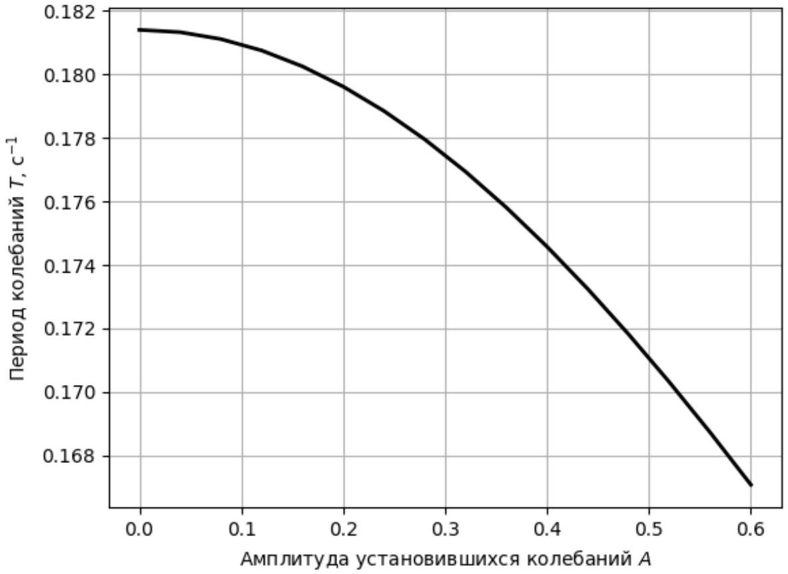
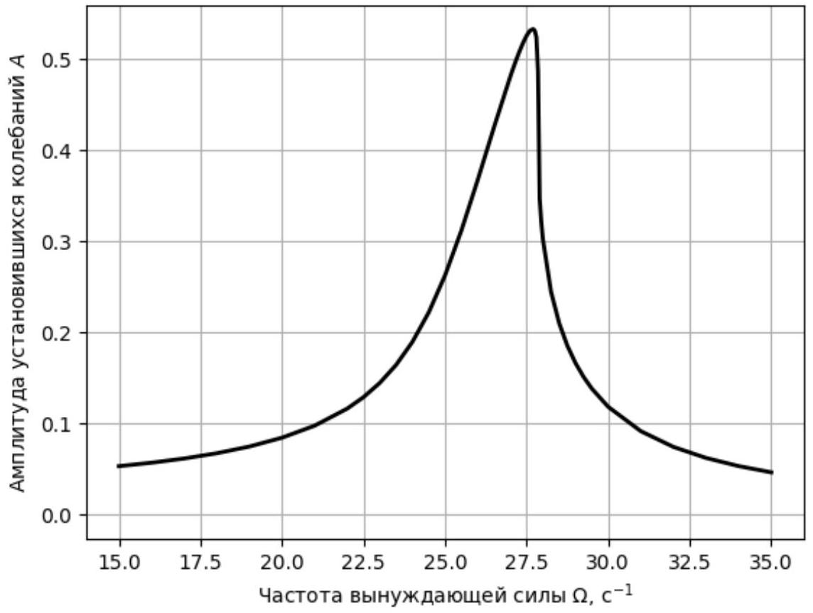
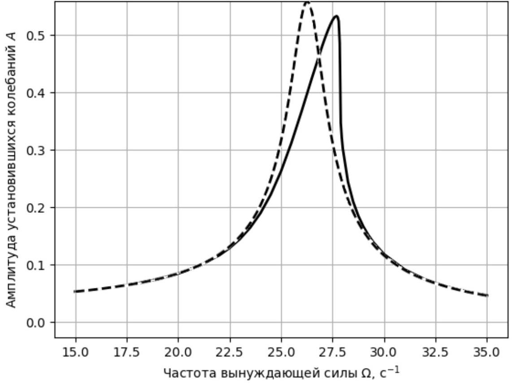
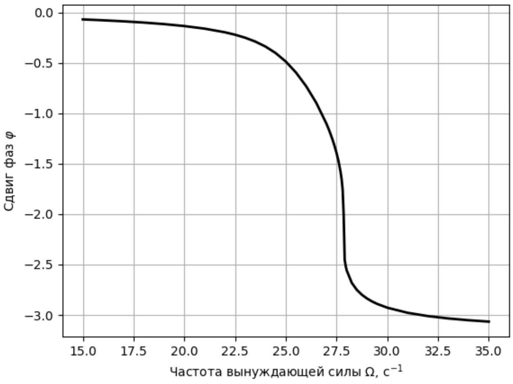
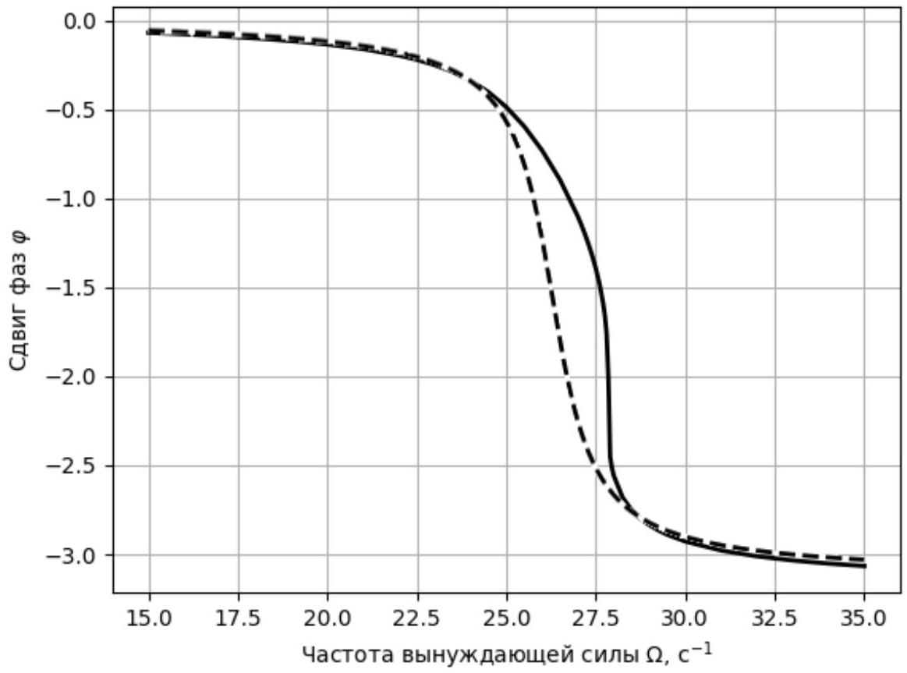
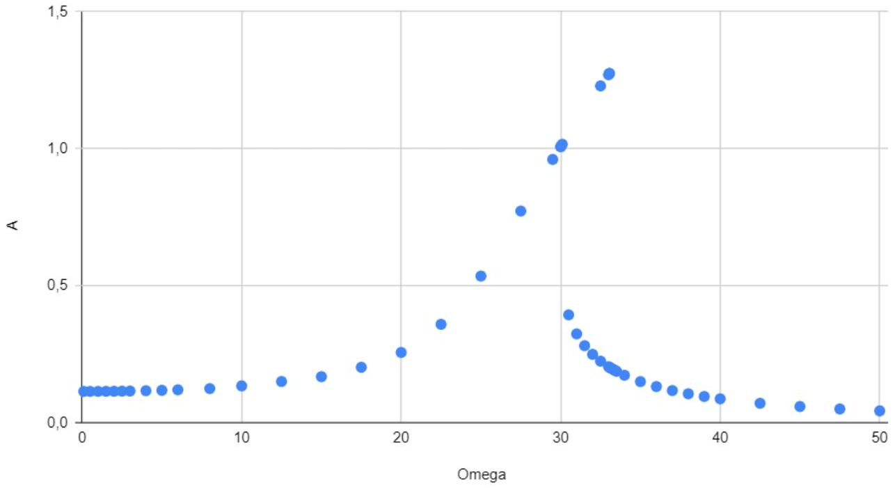

$$
\ddot { x } + \omega _ { 0 } ^ { 2 } x + \varepsilon x ^ { 3 } = 0 .
$$

Укажите численные значения частоты свободных гармонических колебаний малой амплитуды $\omega _ { 0 }$ и параметра нелинейности $\varepsilon$.

Уравнение колебаний

$$
I \ddot { x } = - k _ { 1 } x - k _ { 3 } x ^ { 3 }
$$

Ответ:

$$
\omega _ { 0 } = \sqrt { \frac { k _ { 1 } } { I } } = 34.64 \mathrm { c } ^ { - 1 } ; \quad \varepsilon = \frac { k _ { 3 } } { I } = 800 \mathrm { c } ^ { - 2 } .
$$

A2 ${ } ^ { 1.00 }$
Снимите зависимость периода от амплитуды колебаний $T ( A )$. Опишите методику (какие начальные условия и времена использовали, по каким формулам определяли период). Исследуйте диапазон амплитуд, при которых период меняется не более чем на 10\%. Проведите не менее 15 измерений при различных значениях амплитуды.

Ответ:

Зададим в качестве начального условия $x _ { 0 } = A , v _ { 0 } = 0$, тогда амплитуда колебаний будет равна $A$. Период колебаний можно определить, измерив положение одного из следующих максимумов или нулей зависимости $x ( t )$. График зависимости периода от амплитуды приведен выше.

A3 ${ } ^ { 0.80 }$
При достаточно малых амплитудах зависимость периода от амплитуды имеет вид

$$
T = T _ { 0 } \left( 1 + \alpha A ^ { n } \right) .
$$

Здесь $T _ { 0 }$ - период колебаний малой амплитуды.
Определите из ваших данных параметры $\alpha , n$.

Построим график зависимости $\ln \left( \left( T _ { 0 } - T \right) / T _ { 0 } \right)$ от $\ln A$. Из него найдем

Ответ: $n \approx 2 , \alpha - 0.25$

Заметим, что квадратичная зависимость периода от амплитуды работает тем точнее, чем меньше амплитуда. Если использовать слишком большие амплитуды, эффективное значение показателя степени окажется меньше.

A4 ${ } ^ { 1.50 }$
При достаточно малой амплитуде колебаний зависимость угла от времени имеет вид

$$
x = a \cos \omega t + b \cos 3 \omega t .
$$

Исследуйте зависимость амплитуды гармоники утроенной частоты $b$ от амплитуды колебаний $A$. Исследуйте ту же область амплитуд $A < 0.5$ и определите как можно точнее значение $b$ для 5 различных амплитуд.

\textit\{Примечание:\} Исследуемый эффект достаточно мал. Убедитесь, что вы проводите вычисления и измерения с достаточной точностью, чтобы его качественно наблюдать. При необходимости вы можете уменьшить шаг по времени для численного решения.

Используя формулу $\cos 3 \omega t = 4 \cos ^ { 3 } \omega t - 3 \cos \omega t$, представим зависимость координаты от времени в виде

$$
x = ( a - 3 b ) \cos \omega t + 4 b \cos ^ { 3 } \omega t .
$$

Таким образом, зависимость $x / \cos \omega t$ от $\cos ^ { 2 } \omega t$ линейна, причем коэффициент наклона графика равен $4 b$. Для линеаризации нужно точно знать значение частоты колебаний при данной амплитуде $A = a + b$. При этом можно считать $b \ll a$, поэтому $a \approx A$.
Для амплитуд $A = 0.1 ; 0.2 ; 0.3 ; 0.4 ; 0.5$. точно измеряем несколько точек на первой четверти периода зависимости $x ( t )$ и получаем отсюда значения $b$.

Ответ:

| A | b |
| :--- | :--- |
| 0,1 | 0,0000205 |
| 0,2 | 0,000163 |
| 0,3 | 0,000537 |
| 0,4 | 0,00123 |
| 0,5 | 0,00231 |

A5 ${ } ^ { 0.50 }$ Известно, что при малых амплитудах $b = \beta A ^ { 3 }$. Определите по вашим данным коэффициент $\beta$.

Построим график найденной в прошлом пункте зависимости в координатах, в которых она линейна (например $b$ от $A ^ { 3 }$ ). Отсюда найдем $\beta = 0.019$.
Для сравнения теоретическое значение $\beta = \varepsilon / 32 \omega _ { 0 } ^ { 2 } \approx 0.0208$. Отличие связано в первую очередь с тем, что при конечных амплитудах нужно учитывать поправки высшего порядка, которые при $A = 0.5$ уже не совсем пренебрежимы.

Ответ:

$$
\beta = 0.019
$$

В $1 ^ { 1.00 }$ Как можно точнее определите значения $\omega _ { 0 } , \varepsilon , \gamma$.

Значение $\omega _ { 0 } = 2 \pi / T _ { 0 }$ можно найти, измерив период свободных колебаний (положив величину внешнего момента равной нулю), а коэффициента $\gamma$ - по затуханию колебаний (нужно выбрать амплитуду колебаний так, чтобы их можно было считать линейными). Амплитуда колебаний зависит от времени как $A = A _ { 0 } e ^ { - \gamma t } , \gamma = - \frac { 1 } { t } \ln \frac { A } { A _ { 0 } }$.

Для определения коэффициента перед нелинейным слагаемым приложим силу нулевой частоты (то есть постоянную) и найдем установившееся значение смещения $A$. Тогда $\varepsilon = \frac { f - \omega _ { 0 } A } { A ^ { 3 } }$.

Ответ:

$$
\omega _ { 0 } = 26.3 \mathrm { c } ^ { - 1 } ; \quad \gamma = 0.85 \mathrm { c } ^ { - 1 } ; \quad \varepsilon = 360 \mathrm { c } ^ { - 2 } .
$$

В2 ${ } ^ { 1.50 }$ Выберем значение $f = 25 \mathrm { c } ^ { - 2 }$. Постройте графики зависимости амплитуды колебаний и сдвига фаз от частоты. Для сравнения на тех же графиках постройте аналогичные теоретические зависимости без учета нелинейности.

Будем задавать различные значения частоты внешнего момента и измерять отвечающие им значения амплитуды колебаний и фазы. Измерить амплитуду можно непосредственно. Для измерения фазы точно определим положения нескольких максимумов по времени $t _ { n }$.
Зависимость смещения от времени имеет вид

$$
x = A \cos \omega \left( t - t _ { n } \right) ,
$$

поэтому фаза колебаний равна $\varphi = - \omega t _ { n }$. Вычитая отсюда целое кратное $2 \pi$ можно получить фазу в указанном в условии диапазоне. Строим графики полученных зависимостей и видим, что из-за нелинейности положение резонансного максимума сместилось в область больших частот, а его форма деформировалась.

Ответ:

Ответ:

В3 ${ } ^ { 1.00 }$ Выберите значение $f = 80 \mathrm { c } ^ { - 2 }$. Постройте график зависимости амплитуды результирующих колебаний от частоты. Укажите область частот, в которой наблюдается гистерезис (то есть два значения амплитуды при одной и той же частоте).

Аналогично предыдущему пункту измеряем зависимость амплитуды от частоты. Если идти в сторону увеличения частоты колебаний (и использовать большое значение $x _ { 0 }$ ), можно заметить, что при некоторой частоте амплитуда изменяется скачком. Если же идти со стороны больших частот и использовать маленькие начальные $x _ { 0 }$, то амплитуда при некоторой частоте увеличится скачком. При этом будет область частот, в которой в зависимости от начальных условий будет два возможных значения амплитуды. При значении $f$ из условия эта область примерно $\Omega \in [ 30.5,33 ] \mathrm { c } ^ { - 1 }$.

Ответ:

Ответ: Область гистерезиса
$\Omega \in [ 30.5,33 ] \mathrm { c } ^ { - 1 }$

С1 ${ } ^ { 1.00 }$ Наиболее быстрый рост амплитуды колебаний наблюдается при частоте $\Omega \approx 2 \omega _ { 0 }$.
Определим отклонение от резонансной частоты $\delta = \Omega - 2 \omega _ { 0 }$.
Амплитуда колебаний будет возрастать, если $\delta$ не слишком велико.
На плоскости $\delta , \mu$ изобразите область, где амплитуда колебаний растет.
Рассматривайте область $\mu \ll 1 , \delta \ll \omega _ { 0 }$.

Будем задавать различные значения $\delta$ (а значит и $\Omega$ ) и $\mu$. В области вблизи резонанса хорошо виден экспоненциальный рост амплитуды, а при больших отклонениях по частоте амплитуда периодически меняется.
Для каждого значения $\mu$ можно подобрать соответствующую граничную частоту и таким образом построить границу области резонанса.

Ответ: Область, ограниченная двумя прямыми $\delta = \pm \mu \omega _ { 0 } / 2$.

C2 ${ } ^ { 0.50 }$ Определите уравнение для границы области $\delta ( \mu )$. Запишите уравнение и найдите его параметры.

Из рисунка в предыдущем пункте видно, что граница имеет вид двух прямых. Измерив на этих прямых координаты нескольких точек, найдем их уравнения.

Ответ:

$$
\delta = \pm \left( \omega _ { 0 } / 2 \right) \mu = \pm 10 \mu
$$

С3 ${ } ^ { 1.50 }$ В области параметрического резонанса зависимость амплитуды от времени имеет вид $A \sim e ^ { s t }$. Определите зависимость параметра $s$ от относительного изменения частоты $\mu$ и отстройки по частоте $\delta$. Используя численные данные, найдите форму зависимость $s ( \mu , \delta )$ и определите ее параметры.

Подсказка: может быть полезным изучить зависимость $s ( \mu )$ при постоянной частоте $\delta$ для нескольких значений $\delta$. При этом зависимость $s ^ { 2 }$ от $\mu ^ { 2 }$ имеет очень простой вид.

При нескольких значениях $\delta$ построим графики зависимости $s ^ { 2 }$ от $\mu ^ { 2 }$. Видим, что эти зависимости линейны, причем коэффициенты наклона графиков одинаковы (и равны $\omega _ { 0 } ^ { 2 } / 4 = 100 \mathrm { c } ^ { - 1 }$ ), а постоянный член равен $- \delta ^ { 2 }$.

Ответ:

$$
s = \sqrt { \omega _ { 0 } ^ { 2 } \mu ^ { 2 } / 4 - \delta ^ { 2 } } = \sqrt { 100 \mu ^ { 2 } - \delta ^ { 2 } }
$$

C4 ${ } ^ { 1.00 }$ Амплитуда колебаний растет также и вблизи области $\Omega \approx \omega _ { 0 }$, при достаточно малых $\delta = \Omega - \omega _ { 0 }$. Найдите границы области, при которой возможен рост амплитуды $\delta ( \mu )$. Изобразите эту область на плоскости $\delta$, $\mu$. Определите уравнение этой границы. (Подсказка: зависимость $\delta ( \mu )$ имеет степенной вид.)

Аналогично части С1 наблюдаем, что есть область, в которой амплитуда колебаний экспоненциально растет. Границы этой области теперь не прямые. Измерив на них координаты несколько точек убеждаемся, что границы - параболы. Их уравнения имеют вид $\delta = \mu ^ { 2 } \omega _ { 0 } / 32$ и $\delta = - 5 \mu ^ { 2 } \omega _ { 0 } / 32$

Ответ: Область, ограниченная двумя параболами.

С5 ${ } ^ { 0.50 }$ Пусть $\gamma = 0.2 \mathrm { c } ^ { - 1 } , \varepsilon = 450 \mathrm { c } ^ { - 2 }$. Нарисуйте на плоскости $\mu , \delta = \Omega - 2 \omega _ { 0 }$ область, в которой амплитуда колебаний растет. Для $\delta = 0$ и $\mu = 0.05$ найдите амплитуду установившихся колебаний, а также время оцените время, за которое они устанавливаются.

Амплитуда будет расти, если скорость роста за счет модуляции частоты будет выше скорости затухания за счет трения, то есть $s > \gamma$. Значит эта область ограничена гиперболой

$$
\mu ^ { 2 } \omega _ { 0 } ^ { 2 } / 4 - \delta ^ { 2 } > \gamma ^ { 2 } .
$$

Это можно понять из результата пункта C3 или наблюдать численно.
Рост амплитуды колебаний наблюдается, только если начальная амплитуда достаточно мала. При заданных в условии параметрах устанавливается значение установившейся амплитуды колебаний $A \approx 0.13$ за время $t \approx 50$ с (точное время зависит от начальных условий).

Ответ:

$$
A \approx 0.13 ; t \approx 50 \mathrm { c } .
$$

D1 ${ } ^ { 1.00 }$ В случае $\gamma = \omega _ { 0 } / 2$ найдите минимальное значение $f _ { 0 }$, при котором возможно такое движение. (Начальный угол отклонения и начальную угловую скорость маятника считайте равными нулю.)
При $f - f _ { 0 } \ll f _ { 0 }$ зависимость средней угловой скорости от приложенного момента имеет вид $\langle \omega \rangle \sim \left( f - f _ { 0 } \right) ^ { \alpha }$. Найдите значение постоянной $\alpha$.

Увеличивая значение $f$ заметим, что линейный рост угла отклонения начинается с $f _ { 0 } = 400 \mathrm { c } ^ { - 2 }$. (Можно и теоретически показать, что рост начинается с $f _ { 0 } = \omega _ { 0 } ^ { 2 }$.)
Снимем зависимость средней частоты от $f$ вблизи порогового значения $f _ { 0 }$.
Заметим, что угловая скорость скачком приобретает конечное значение $\langle \omega \rangle \approx 10 c ^ { - 1 }$ и достаточно слабо зависит от приложенной силы. Поэтому показатель степени $\alpha \approx 0$

Ответ:

$$
f _ { 0 } = 400 \mathrm { c } ^ { - 2 } ; \quad \alpha \approx 0 .
$$
