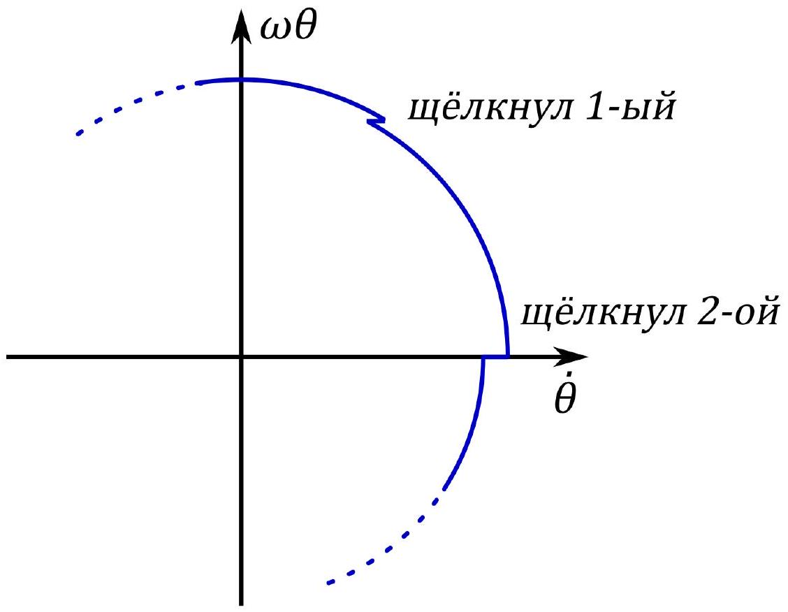

А1 ${ } ^ { 1.50 }$ По графику раскачки колебаний метронома найдите с точностью $10 \%$ : угловую частоту $\omega$, установившуюся амплитуду $A$, коэффициент затухания $\gamma$ и угловую скорость $\omega _ { D }$ сообщаемую спусковым механизмом при ударе. Известно, что $\frac { \omega _ { D } } { \omega } , \gamma \ll 1$.

Из графика видно, что к 12 с изменения амплитуды прекращается. Установившаяся амлитуда равна $A = 0.3$ рад. Сразу заметим, что при таких углах погрешность приближения $\sin x \approx x$ не превышает $1.5 \%$. В частности, для целей этого пункта можно считать, что частота не зависит от амплитуды. Частоту можно найти методом рядов, например

$$
\omega = 2 \pi \frac { 16 } { 14.5 c - 9.5 c } = 20 \mathrm { c } ^ { - 1 } .
$$

Колебания в остутствии подкачки энергии описываются уравнением

$$
m l ^ { 2 } \ddot { \theta } = - 2 m l ^ { 2 } \gamma \dot { \theta } - m g l \sin \theta
$$

(закон изменения момента импульса для маятника).
Заменяя в силу сказаного выше $\sin \theta$ на $\theta , g$ на $l \omega ^ { 2 }$ и сокращая на $m l ^ { 2 }$ получим уравнение гармонических колебаний:

$$
\ddot { \theta } + 2 \gamma \dot { \theta } + \omega ^ { 2 } \theta = 0 .
$$

Его решение с начальными условиями $\theta ( 0 ) = 0 , \dot { \theta } ( 0 ) = A \omega$ есть

$$
\theta ( t ) = A e ^ { - \gamma t } \sin \omega t .
$$

Обозначим $A _ { n }$ значение $A$ на $n$-том полупериоде. Каждый полупериод $\dot { \theta }$ увеличивается на $\omega _ { D }$, значит

$$
A _ { n + 1 } = A _ { n } e ^ { - \frac { \gamma \pi } { \omega } } + \frac { \omega _ { D } } { \omega } .
$$

Предельная амплитуда находится из условия

$$
A = A e ^ { - \frac { \gamma \pi } { \omega } } + \frac { \omega _ { D } } { \omega }
$$

откуда $A = \frac { \omega _ { D } } { \omega } \left( 1 - e ^ { - \frac { \gamma \pi } { \omega } } \right) ^ { - 1 }$.
Рекуррентное соотношение на $A _ { n }$ можно переписать так:

$$
A - A _ { n + 1 } = \left( A - A _ { n } \right) e ^ { - \frac { \gamma \pi } { \omega } } .
$$

Это позволяет найти $\gamma$ по нескольким пикам (в предположении что $\gamma$ мало и максимальное значение $\theta$ равно $A$ ):

$$
\gamma = \frac { \omega } { \pi } \frac { 1 } { m - n } \ln \frac { A - A _ { n } } { A - A _ { m } } .
$$

Например, $A _ { n } = 0.14 , A _ { m } = 0.19 , m - n = 6$ (число полупериодов вдвое больше числа периодов). Получается $\gamma = 0.40 . \gamma / \omega = 0.02$ и затухание действительно мало.

Остается найти $\omega _ { D }$.

$$
\omega _ { D } = \omega A \left( 1 - e ^ { - \frac { \gamma \pi } { \omega } } \right) = 0.37 \frac { \text { рад } } { c } .
$$

Ответ:

$$
\begin{aligned}
\omega & = 20 \mathrm { c } ^ { - 1 } \\
A & = 0.3 \text { рад } \\
\gamma & = 0.40 \mathrm { c } ^ { - 1 } \\
\omega _ { D } & = 0.37 \frac { \text { рад } } { \mathrm { c } }
\end{aligned}
$$

В1 ${ } ^ { 0.20 }$ Выразите $\dot { x } ( t )$ через $A ( t )$ и $A ^ { * } ( t )$.

Ответ получается непосредственным дифференциированием.

Ответ:

$$
\dot { x } ( t ) = \frac { 1 } { 2 } \left( \dot { A } e ^ { i \omega t } + i \omega A e ^ { i \omega t } + \dot { A } ^ { * } e ^ { - i \omega t } - i \omega A ^ { * } e ^ { - i \omega t } \right)
$$

В2 ${ } ^ { 0.30 }$ Выразите $\ddot { x } ( t )$ через $A ( t ) , A ^ { * } ( t ) , \dot { A } ( t )$.

$$
\ddot { x } ( t ) = - \frac { \omega ^ { 2 } } { 2 } \left( A e ^ { i \omega t } + A ^ { * } e ^ { - i \omega t } \right) + \frac { 1 } { 2 } \left( i \omega \dot { A } e ^ { i \omega t } - i \omega A ^ { * } e ^ { - i \omega t } \right)
$$

Учитывая, что мы наложили условие $\dot { A } e ^ { i \omega t } + \dot { A } ^ { * } e ^ { - i \omega t } = 0$, упрощаем это выражение и получаем ответ.

Ответ:

$$
\ddot { x } = - \frac { 1 } { 2 } \omega ^ { 2 } \left( A e ^ { i \omega t } + A ^ { * } e ^ { - i \omega t } \right) + i \omega \dot { A } e ^ { i \omega t }
$$

Вз ${ } ^ { 0.50 }$ Используя уравнение колебаний, найдите выражение для $\dot { A }$ через $A , \gamma , \omega , \varepsilon$.

Подставляем полученное в уравнение колебаний:

$$
\begin{gathered}
- \frac { \omega ^ { 2 } } { 2 } \left( A e ^ { i \omega t } + A ^ { * } e ^ { - i \omega t } \right) + i \omega \dot { A } e ^ { i \omega t } + \gamma \left( i \omega A e ^ { i \omega t } - i \omega A ^ { * } e ^ { - i \omega t } \right) + \frac { \omega ^ { 2 } } { 2 } \left( A e ^ { i \omega t } + A ^ { * } e ^ { - i \omega t } \right) = \\
= \varepsilon \frac { 1 } { 8 } \left( A e ^ { i \omega t } + A ^ { * } e ^ { - i \omega t } \right) ^ { 3 }
\end{gathered}
$$

Отсюда выражаем $\dot { A }$.

Ответ:

$$
\begin{gathered}
\dot { A } = \frac { 1 } { 2 i \omega } e ^ { - i \omega t } \left( - 2 \gamma \left( i \omega A e ^ { i \omega t } - i \omega A ^ { * } e ^ { - i \omega t } \right) + \right. \\
\left. + \frac { \varepsilon } { 4 } \left( A ^ { 3 } e ^ { 3 i \omega t } + 3 A | A | ^ { 2 } e ^ { i \omega t } + A ^ { * 3 } e ^ { - 3 i \omega t } + 3 A ^ { * } | A | ^ { 2 } e ^ { - i \omega t } \right) \right)
\end{gathered}
$$

В4 ${ } ^ { 0.20 }$ Учитывая это, напишите упрощенное уравнение на $\dot { A } ( t )$.

В уравнении, полученном в В3, нужно просто отбросить все члены, содержащие $e ^ { - i n \omega t } , n \neq 0$.

Ответ:

$$
\dot { A } = - A \left( \gamma + \frac { 3 \varepsilon } { 8 \omega } i | A | ^ { 2 } \right)
$$

В5 ${ } ^ { 0.60 }$ Предположим, что трения нет, $\gamma = 0$. Пусть начальное значение $A$ равно $A _ { 0 }$.
Решите уравнение из B4 и получите $A ( t )$ и $x ( t )$.

Положив в уравнении, полученном в B4, $\gamma = 0$, получаем

$$
\dot { A } = - i \frac { 3 \varepsilon | A | ^ { 2 } } { 8 \omega } A .
$$

Из геометрических соображений ясно, что это уравнение описывает поворот вектора $A$ в комплексной плоскости без изменения его модуля. Поэтому решение уравнения ищем в виде

$$
A ( t ) = A _ { 0 } e ^ { i s t } .
$$

Получаем

$$
s = - \frac { 3 \varepsilon | A | ^ { 2 } } { 8 \omega } ,
$$

откуда сразу же получаются ответы для $A ( t )$ и $x ( t )$.

Ответ:

$$
\begin{gathered}
A ( t ) = A _ { 0 } \exp \left[ - i \frac { 3 \varepsilon \left| A _ { 0 } \right| ^ { 2 } } { 8 \omega } t \right] \\
x ( t ) = \operatorname { Re } \left\{ A _ { 0 } \exp \left[ i \left( \omega - \frac { 3 \varepsilon \left| A _ { 0 } \right| ^ { 2 } } { 8 \omega } \right) t \right] + A _ { 0 } ^ { * } \exp \left[ - i \left( \omega - \frac { 3 \varepsilon \left| A _ { 0 } \right| ^ { 2 } } { 8 \omega } \right) t \right] \right\}
\end{gathered}
$$

$$
\ddot { x } + \omega ^ { 2 } \sin x = 0
$$

с небольшой амплитудой $A \ll 1$. Чему равна $\frac { \Delta \omega } { \omega }$ при амплитуде найденной в A1?

Разложим синус в ряд Тейлора:

$$
\sin x \approx x - \frac { 1 } { 6 } x ^ { 3 }
$$

Таким образом, в первом приближении уравнение колебания маятника описываются уравнением из B4 с

$$
\gamma = 0 , \quad \varepsilon = \frac { 1 } { 6 } \omega ^ { 2 } .
$$

Из В5 мы знаем, что его решение можно представить в виде

$$
\begin{aligned}
A ( t ) & = A _ { 0 } \exp \left( - i \frac { \left| A _ { 0 } \right| ^ { 2 } \omega t } { 16 } \right) \Longrightarrow \\
\Longrightarrow x ( t ) & = \operatorname { Re } \left\{ A _ { 0 } \exp \left[ i \left( 1 - \frac { 1 } { 16 } A ^ { 2 } \right) \omega t \right] \right\} .
\end{aligned}
$$

Отсюда сразу же получаем ответ.

Ответ:

$$
\begin{aligned}
& \Delta \omega = - \frac { 1 } { 16 } A ^ { 2 } \omega \\
& \frac { \Delta \omega } { \omega } \approx - 6 \cdot 10 ^ { - 3 }
\end{aligned}
$$

С1 ${ } ^ { 0.70 }$ Начнем с вспомогательной задачи. Пусть метрономы стоят на неподвижной доске и совершают колебания с известными зависимостями $\theta _ { 1 } ( t )$ и $\theta _ { 2 } ( t )$. В первом порядке по амплитудам колебаний найдите силу, действующую на доску. Выразите ответ через $\theta _ { 1 } , \theta _ { 2 } , D _ { 1 } , D _ { 2 }$ и постоянные, характеризующие метрономы.

На доску действуют силы натяжения нитей маятников, равные в первом приближении $m g \sin \theta _ { 1 }$ и $m g \sin \theta _ { 2 }$. По третьему закону Ньютона во время толчка на доску действует также сила $- m l \left( D _ { 1 } + D _ { 2 } \right)$. В итоге получаем ответ.

Ответ:

$$
F = m g \left( \sin \theta _ { 1 } + \sin \theta _ { 2 } \right) - m l \left( D _ { 1 } + D _ { 2 } \right)
$$

C2 ${ } ^ { 1.00 }$ Напишите уравнения движения грузов в системе отсчета доски, то есть выразите $\ddot { \theta } _ { 1 } , \ddot { \theta } _ { 2 }$ через $\theta _ { 1 } , \theta _ { 2 } , \dot { \theta } _ { 1 } , \dot { \theta } _ { 2 } , \omega , \gamma , \alpha , D _ { 1 } , D _ { 2 }$.

Система отсчёта доски - неинерциальная система отсчёта, движущаяся с ускорением $a = \frac { F } { M }$, тогда в законе Ньютона для грузов в первом приближении должен фигурировать дополнительный член - $m a$. Переписав его через углы $\theta _ { 1 }$ и $\theta _ { 2 }$, получим ответ.

Ответ:

$$
\left\{ \begin{array} { l }
\ddot { \theta } _ { 1 } + 2 \gamma \dot { \theta } _ { 1 } + \omega ^ { 2 } \theta _ { 1 } = \alpha \left[ - \left( \theta _ { 1 } + \theta _ { 2 } \right) \omega ^ { 2 } + \left( D _ { 1 } + D _ { 2 } \right) \right] \\
\ddot { \theta } _ { 2 } + 2 \gamma \dot { \theta } _ { 2 } + \omega ^ { 2 } \theta _ { 2 } = \alpha \left[ - \left( \theta _ { 1 } + \theta _ { 2 } \right) \omega ^ { 2 } + \left( D _ { 1 } + D _ { 2 } \right) \right]
\end{array} \right.
$$

с3 ${ } ^ { 2.00 }$ Фазовая диаграмма колебания - изображение движения маятника на плоскости с координатами $\dot { \theta }$, $\omega \theta$. Предположим, что установился режим колебаний, в котором их амплитуды постоянны, но при этом есть некоторая разность фаз $\psi$. Постройте фазовую диаграмму первого осциллятора за один период. Укажите на ней точки, в которых срабатывают спусковые механизмы метрономов. Найдите изменение разности фаз между метрономами за период $\Delta \psi$.

Как было найдено в A1, в момент пересечения оси $\dot { \theta }$ значение $\dot { \theta }$ изменяется на $\gamma \pi A$. Когда через некоторое время эту ось пересекает первый маятник, второй также испытывает возмущение и его $\dot { \theta }$ изменяется на $\alpha \gamma \pi A$. Фаза колебаний, с точностью до константы равная углу, на который повернулась точка на фазовом портрете, при этом уменьшается на

$$
\frac { \alpha \gamma \pi A \sin \psi } { \omega A } = \frac { \alpha \gamma \pi } { \omega } \sin \psi .
$$

Когда таким же образом щелчок второго метронома влияет на фазу первого, разность фаз между ними снова уменьшается. Таким образом за полупериод

$$
\Delta \psi = - 2 \frac { \alpha \gamma \pi } { \omega } \sin \psi .
$$

За период эта величина будет в два раза больше.

Ответ:

C4 ${ } ^ { 0.70 }$ Покажите, что изменение разности фаз между осцилляторами удовлетворяет уравнению Курамото

$$
\dot { \psi } = - B \sin \psi .
$$

Найдите выражение для постоянной $B$ и ее численное значение, если $\alpha = 10 ^ { - 2 }$.

Так как мы считаем затухания малыми, то и изменение фаз за период оказывается малой величиной. Поэтому можем перейти к непрерывному пределу и получить ответ.

Ответ:

$$
B = 2 \gamma \alpha = 0.8 \cdot 10 ^ { - 3 } \mathrm { c } ^ { - 1 }
$$

С5 ${ } ^ { 0.80 }$ Предположим, что собственные частоты осцилляторов немного отличаются и равны $\omega _ { 1 }$ и $\omega _ { 2 }$, где $\Delta \omega = \omega _ { 1 } - \omega _ { 2 } \ll \omega _ { 1 }$. Найдите выражение для $\dot { \psi }$ в этом случае. При какой максимальной разности частот $\Delta \omega _ { \max }$ возможна синхронизация?

Перепишем уравнения движения маятников из C2, учитывая разные частоты маятников. Получим

$$
\left\{ \begin{array} { l }
\ddot { \theta } _ { 1 } + 2 \gamma \dot { \theta } _ { 1 } + \omega _ { 1 } ^ { 2 } \theta _ { 1 } = \alpha \left[ - \left( \theta _ { 1 } + \theta _ { 2 } \right) \omega ^ { 2 } + \left( D _ { 1 } + D _ { 2 } \right) \right] \\
\ddot { \theta } _ { 2 } + 2 \gamma \dot { \theta } _ { 2 } + \omega _ { 2 } ^ { 2 } \theta _ { 2 } = \alpha \left[ - \left( \theta _ { 1 } + \theta _ { 2 } \right) \omega ^ { 2 } + \left( D _ { 1 } + D _ { 2 } \right) \right]
\end{array} \right.
$$

Тогда аналогично

$$
\dot { \psi } = \omega _ { 1 } - \omega _ { 2 } - \frac { 3 \omega ^ { 2 } A ^ { 3 } \alpha } { 16 \gamma } \sin \psi .
$$

Синхронизация возможна, когда это уравнение имеет корни, откуда сразу же получается ответ для $\Delta \omega _ { \max }$.

Ответ:

$$
\begin{gathered}
\dot { \psi } = \omega _ { 1 } - \omega _ { 2 } - \frac { 3 \omega ^ { 2 } A ^ { 3 } \alpha } { 16 \gamma } \sin \psi \\
\Delta \omega _ { \max } = \frac { 3 \omega ^ { 3 } A ^ { 3 } \alpha } { 16 \gamma }
\end{gathered}
$$

C6 ${ } ^ { 0.20 }$
Пусть разность частот $\Delta \omega$ меньше максимальной. Найдите установившуюся разность фаз $\psi$ осцилляторов.

При установившейся разности фаз метрономов $\dot { \psi } = 0$. Ответ получается подстановкой этого в выражение, полученное в C5.

Ответ:

$$
\psi = \arcsin \frac { 16 \gamma \Delta \omega } { 3 \omega ^ { 3 } A ^ { 3 } \alpha }
$$

Пусть в системе из двух метрономов разность частот равна $\Delta \omega = 0.1 c ^ { - 1 }$. При этом разность фаз $\psi = 0.5$ рад. В некоторый момент времени груз одного из метрономов немного смещается и разность частот обращается в 0. Найдите время $t$, за которое метрономы полностью синхронизируются, то есть их разность фаз станет меньше 0.01 рад.

Необходимо решить уравнение Курамото с начальным условием

$$
\psi ( 0 ) = 0.5 .
$$

Имеем

$$
\begin{aligned}
\dot { \psi } = - B \sin \psi & \Longrightarrow \int _ { 0.5 } ^ { \psi ( t ) } \frac { \mathrm { d } \psi } { \sin \psi } = \left. \ln \left| \operatorname { tg } \frac { \psi } { 2 } \right| \right| _ { 0.5 } ^ { \psi ( t ) } = - B t \Longrightarrow \\
& \Longrightarrow t ( \psi ) = \frac { \sin \psi _ { 0 } } { \Delta \omega } \ln \left| \frac { \operatorname { tg } \frac { \psi } { 2 } } { \operatorname { tg } 0.05 } \right|
\end{aligned}
$$

Ответ:

$$
t = \frac { \sin \psi } { \Delta \omega } \ln \left| \frac { \operatorname { tg } \frac { \psi } { 2 } } { \operatorname { tg } 0.05 } \right| \approx 18.9 \mathrm { c }
$$
