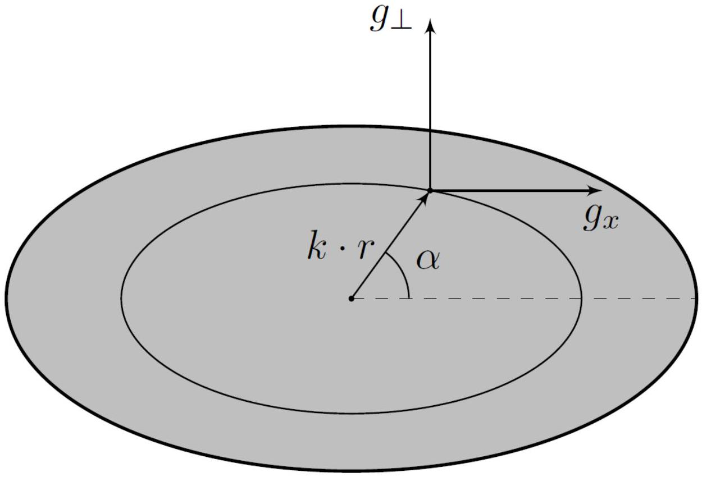
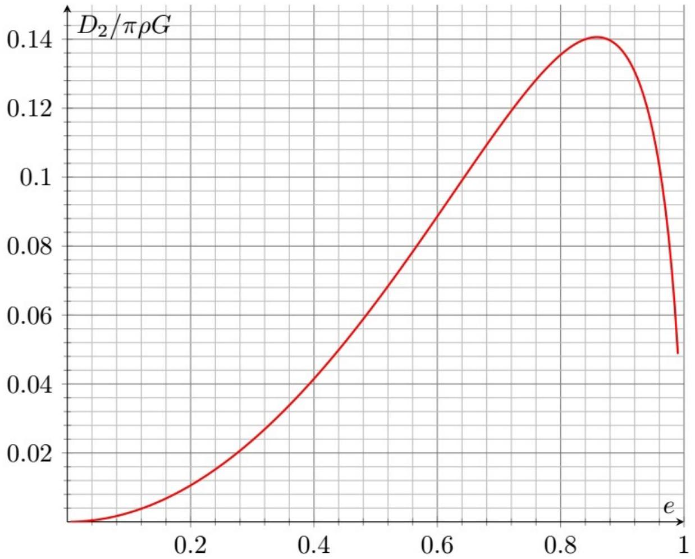
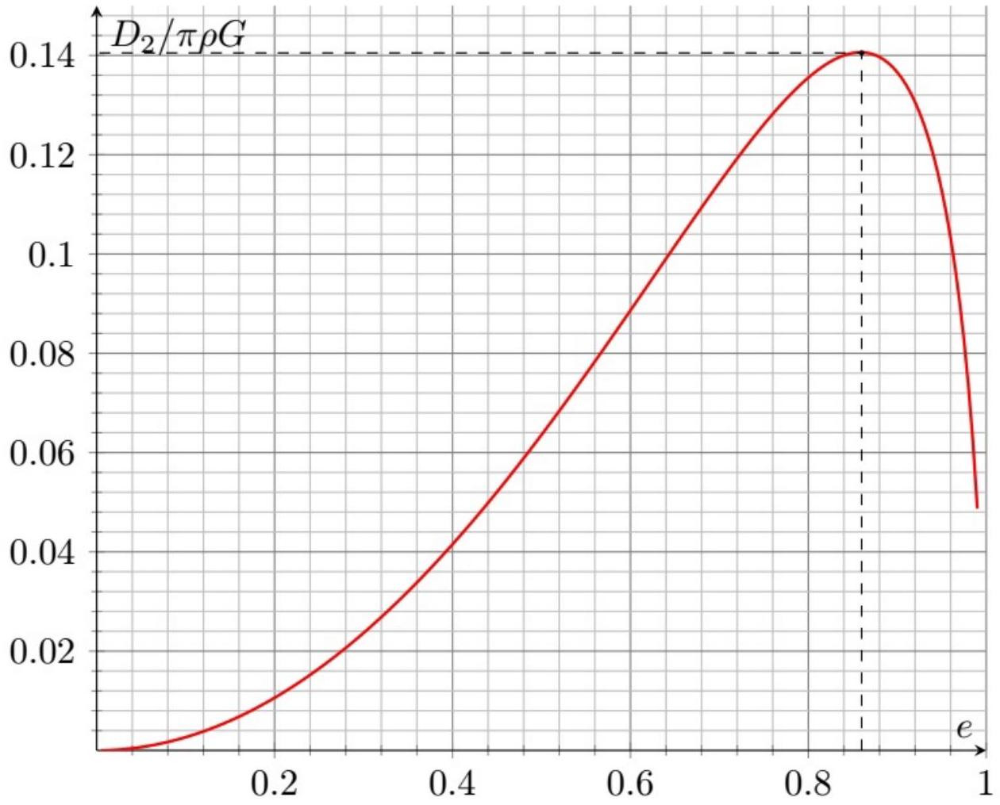

А1 ${ } ^ { 1.50 }$ Найдите значение радиуса круговой орбиты $R _ { \text {дпс } }$, при котором механическое напряжение в области контакта объектов равняется нулю. Величина $R _ { \text {Дпс } }$ является пределом Роша $R _ { \text {Roche } }$ для двойной планетарной системы

Пусть $\omega$ - угловая скорость вращения системы. Тогда из теоремы о движении центра масс получим:

$$
2 m \omega ^ { 2 } R = G M m \left( \frac { 1 } { ( R - r ) ^ { 2 } } + \frac { 1 } { ( R + r ) ^ { 2 } } \right)
$$

Рассмотрим отдельном условие движения центра ближнего объекта по окружности радиуса $R - r$ :

$$
m \omega ^ { 2 } ( R - r ) = \frac { G M m } { ( R - r ) ^ { 2 } } + N - \frac { G m ^ { 2 } } { 4 r ^ { 2 } }
$$

Комбинируя, находим:

$$
N = \frac { G m ^ { 2 } } { 4 r ^ { 2 } } + \frac { G M m } { 2 R } \left( \frac { R - r } { ( R + r ) ^ { 2 } } - \frac { R + r } { ( R - r ) ^ { 2 } } \right)
$$

Учитывая, что $R _ { 0 } \gg r$, находим:

$$
N \approx \frac { G m ^ { 2 } } { 4 r ^ { 2 } } - \frac { 3 G M m r } { R ^ { 3 } }
$$

Сила механического взаимодействия между объектами неотрицательна при

$$
R \geq r \sqrt [ 3 ] { \frac { 12 M } { m } }
$$

Тогда для $R _ { \text {дпс } }$ имеем:

Ответ:

$$
R _ { \text {Дпс } } = r \sqrt [ 3 ] { \frac { 12 M } { m } }
$$

В1 ${ } ^ { 0.70 }$ Получите точное выражение для суммарного потенциала $\varphi _ { \text {внеш } }$ в поле центробежной силы и гравитационного поля планеты. Ответ выразите через $x$ $, y , z , G , \rho _ { M } , R _ { 0 }$ и $R$.

Орбитальная угловая скорость движения спутника $\omega$ равна

$$
\omega = \sqrt { \frac { G M } { R ^ { 3 } } }
$$

где $M = \frac { 4 \pi R _ { 0 } ^ { 3 } \rho _ { M } } { 3 }$.
Потенциальная энергия частицы массой $m$ в поле центробежной силы (считаем её равной нулю на оси вращения) равна

$$
W _ { p } = - \frac { m \omega ^ { 2 } r _ { \perp } ^ { 2 } } { 2 }
$$

где $r _ { \perp }$ - расстояние от частицы до оси вращения.
Тогда для потенциала имеем:

$$
\varphi = - \frac { 4 \pi R _ { 0 } ^ { 3 } \rho _ { M } G } { 3 R } \left( \frac { R } { r } + \frac { r _ { \perp } ^ { 2 } } { 2 R ^ { 2 } } \right) - \varphi _ { O }
$$

откуда:

Ответ:

$$
\varphi = \frac { 2 \pi R _ { 0 } ^ { 3 } \rho _ { M } G } { R } - \frac { 4 \pi R _ { 0 } ^ { 3 } \rho _ { M } G } { 3 R } \left( \frac { R } { \sqrt { ( R + x ) ^ { 2 } + y ^ { 2 } + z ^ { 2 } } } + \frac { ( R + x ) ^ { 2 } + y ^ { 2 } } { 2 R ^ { 2 } } \right)
$$

$$
\varphi _ { \text {внеш } } = A _ { 1 } x ^ { 2 } + B _ { 1 } y ^ { 2 } + C _ { 1 } z ^ { 2 }
$$

Найдите коэффициенты $A _ { 1 } , B _ { 1 }$ и $C _ { 1 }$. Ответы выразите через $R , G , R _ { 0 }$ и $\rho _ { M }$.
Для разложения $\frac { R } { \sqrt { ( R + x ) ^ { 2 } + y ^ { 2 } + z ^ { 2 } } }$ имеем:

$$
\frac { R } { \sqrt { ( R + x ) ^ { 2 } + y ^ { 2 } + z ^ { 2 } } } \approx 1 - \frac { x } { R } - \frac { x ^ { 2 } + y ^ { 2 } + z ^ { 2 } } { 2 R ^ { 2 } } + \frac { 3 x ^ { 2 } } { 2 R ^ { 2 } }
$$

Подставляя в выражение для $\varphi$, получим:

$$
\varphi = - \frac { 2 \pi R _ { 0 } ^ { 3 } \rho _ { M } G } { R ^ { 3 } } x ^ { 2 } + \frac { 2 \pi R _ { 0 } ^ { 3 } \rho _ { M } G } { 3 R ^ { 3 } } z ^ { 2 }
$$

Таким образом:

Ответ:

$$
A = - \frac { 2 \pi R _ { 0 } ^ { 3 } \rho _ { M } G } { R ^ { 3 } } \quad B = 0 \quad C = \frac { 2 \pi R _ { 0 } ^ { 3 } \rho _ { M } G } { 3 R ^ { 3 } }
$$

C1 ${ } ^ { 0.80 }$ Докажите, что гравитационное поле внутри полости равняется нулю.

Обратимся к доказательству равенства нулю в полости шара, концентричной ему.
Рассмотрим некоторую точку полости $A$. выделим два элементарных объёма $d V _ { 1 }$ и $d V _ { 2 }$, поля которых компенсируют друг-друга:

$$
\frac { d V _ { 1 } } { r _ { 1 } ^ { 2 } } = \frac { d V _ { 2 } } { r _ { 2 } ^ { 2 } }
$$

Произвольных эллипсоид может быть получен сжатием из сферы вдоль взаимно перпендикулярных осей.
Поскольку объём любого элементарного параллелепипеда $d V = d x d y d z$, все элементарные объёмы уменьшаются в одно и то же число раз.
Также сохранятся и соотношения расстояний между точками.
Тогда, поскольку внутри полости шара суммарное гравитационное поле равно нулю, то нулю равно и гравитационное поле внутри полости эллипсоида.

C2 ${ } ^ { 0.40 }$ Пусть потенциал в центре эллипсоида равен $\varphi _ { 0 }$.
Рассмотрим точку внутри эллипсоида, радиус-вектор относительно центра равен $\vec { r }$. Потенциал в данной точке равен $\varphi _ { 1 }$.
Чему в также лежащей внутри эллипсоида точке с радиус-вектором $\gamma \vec { r }$ равен потенциал $\varphi _ { 2 } = \varphi ( \gamma \vec { r } )$ ?
Ответ выразите через $\varphi _ { 0 } , \varphi _ { 1 }$ и $\gamma$.

Рассмотрим точки 1 и 2, лежащие на одной прямой, проходящей через центр эллипсоида. Пусть расстояния от центра эллипсоида до этих точек равны $r _ { 1 }$ и $r _ { 2 }$ соответственно, а рассматриваемая прямая составляет угол $\alpha$ с осью $x$.
Обе точки принадлежат границам подобных рассматриваемому эллипсоидов с некоторыми коэффициентами $k _ { 1 }$ и $k _ { 2 }$. Поскольку внутри эллипсоидальных полостей гравитационное поле равняется нулю, разность потенциалов между точкой 1 и центром рассматриваемого эллипсоида $\varphi _ { 1 } - \varphi _ { 0 } = f ( \alpha ) r _ { 1 } ^ { 2 }$, а также $\varphi _ { 2 } - \varphi _ { 0 } = f ( \alpha ) r _ { 2 } ^ { 2 }$, где $f ( \alpha )$ - некоторая функция, зависящая только от угла $\alpha$.
Отсюда находим:

Ответ:

$$
\varphi _ { 2 } = \varphi _ { 0 } + \left( \varphi _ { 1 } - \varphi _ { 0 } \right) \gamma ^ { 2 }
$$

С3 ${ } ^ { 1.00 }$ Покажите, что в точке эллипсоида с координатами $x , y , z$ потенциал можно представить в виде:

$$
\varphi = \varphi _ { 0 } + A _ { 2 } x ^ { 2 } + B _ { 2 } \left( y ^ { 2 } + z ^ { 2 } \right)
$$

Примечание: обратите внимание, что данное выражение применимо для эллипсоидов сколь угодно малых размеров

Расстояния $r$ могут быть сколь угодно малыми. Рассмотрим точки, близкие к центру эллипсоида. Для них:

$$
\vec { g } = \frac { \partial \vec { g } } { \partial x } d x + \frac { \partial \vec { g } } { \partial y } d y + \frac { \partial \vec { g } } { \partial z } d z
$$

где все производные берутся в начале координат. Поскольку эллипсоид - симметричная фигура для точек лежащих на осях $x , y$ и $z$ верно соответственно.

$$
\frac { \partial \vec { g } } { \partial x } = \frac { \partial g _ { x } } { \partial x } \vec { e } _ { x } \quad \frac { \partial \vec { g } } { \partial y } = \frac { \partial g _ { y } } { \partial y } \vec { e } _ { y } \quad \frac { \partial \vec { g } } { \partial z } = \frac { \partial g _ { z } } { \partial z } \vec { e } _ { z }
$$

отсюда найдём:

$$
\frac { \partial g _ { r } } { \partial r } = - 2 f ( \alpha ) = \left( \vec { e } _ { r } \cdot \vec { e } _ { x } \right) \frac { \partial g _ { x } } { \partial x } \frac { \partial x } { \partial r } + \left( \vec { e } _ { r } \cdot \vec { e } _ { y } \right) \frac { \partial g _ { y } } { \partial y } \frac { \partial y } { \partial r } + \left( \vec { e } _ { r } \cdot \vec { e } _ { z } \right) \frac { \partial g _ { z } } { \partial z } \frac { \partial z } { \partial r }
$$

Пусть $g _ { \perp }$ - компонента гравитационного поля эллипсоида, перпендикулярная оси $x$.

Учитывая, что для эллипсоида вращения $\frac { \partial g _ { y } } { \partial y } = \frac { \partial g _ { z } } { \partial z } = \frac { \partial g _ { \perp } } { \partial r _ { \perp } }$, получим

$$
- 2 f ( \alpha ) = \frac { \partial g _ { x } } { \partial x } \cos ^ { 2 } \alpha + \frac { \partial g _ { \perp } } { \partial r _ { \perp } } \sin ^ { 2 } \alpha
$$

Поскольку соотношение верно для любых $\alpha$, все частные производные должны оставаться постоянными в любой точке эллипсоида. Подставляя в выражение для потенциала, найдём:

Ответ:

$$
\varphi = \varphi _ { 0 } - \frac { \partial g _ { x } } { \partial x } \frac { x ^ { 2 } } { 2 } - \frac { \partial g _ { \perp } } { \partial r _ { \perp } } \frac { \left( y ^ { 2 } + z ^ { 2 } \right) } { 2 }
$$

C4 ${ } ^ { 0.30 }$ Выразите $B _ { 2 }$ через $A _ { 2 } , G$ и $\rho$.
Примечание: воспользуйтесь теоремой Гаусса в дифференциальной форме для гравитационного поля:

$$
\frac { \partial ^ { 2 } \varphi } { \partial x ^ { 2 } } + \frac { \partial ^ { 2 } \varphi } { \partial y ^ { 2 } } + \frac { \partial ^ { 2 } \varphi } { \partial z ^ { 2 } } = 4 \pi \rho G
$$

Из теоремы Гаусса в дифференциальной форме находим:

$$
\frac { \partial g _ { x } } { \partial x } + \frac { \partial g _ { y } } { \partial y } + \frac { \partial g _ { z } } { \partial z } = - 2 A _ { 2 } - 4 B _ { 2 } = - 4 \pi G \rho
$$

откуда:

Ответ:

$$
B _ { 2 } = \pi G \rho - \frac { A _ { 2 } } { 2 }
$$

С5 ${ } ^ { 0.30 }$ Потенциал $\varphi$ на поверхности эллипсоида можно представить как функцию только координаты $x$ в следующем виде:

$$
\varphi = C _ { 2 } + x ^ { 2 } D _ { 2 }
$$

Выразите $C _ { 2 }$ и $D _ { 2 }$ через $\varphi _ { 0 } , A _ { 2 } , G , \rho , a , x$ и эксцентриситет $e$.

$$
y ^ { 2 } + z ^ { 2 } = a ^ { 2 } \left( 1 - e ^ { 2 } \right) - \left( 1 - e ^ { 2 } \right) x ^ { 2 }
$$

откуда:

$$
\varphi = \varphi _ { 0 } + \left( \pi \rho G - \frac { A _ { 2 } } { 2 } \right) a ^ { 2 } \left( 1 - e ^ { 2 } \right) + \left( \frac { A _ { 2 } \left( 3 - e ^ { 2 } \right) } { 2 } - \pi \rho G \left( 1 - e ^ { 2 } \right) \right) x ^ { 2 }
$$

Ответ:

$$
C _ { 2 } = \varphi _ { 0 } + \left( \pi \rho G - \frac { A _ { 2 } } { 2 } \right) a ^ { 2 } \left( 1 - e ^ { 2 } \right) \quad D _ { 2 } = \frac { A _ { 2 } \left( 3 - e ^ { 2 } \right) } { 2 } - \pi \rho G \left( 1 - e ^ { 2 } \right)
$$

С6 ${ } ^ { 0.50 }$ Решим вспомогательную задачу: по поверхности диска радиуса $R$ равномерно распределена масса с поверхностной плотностью $\sigma$.
Найдите потенциал диска $\varphi _ { \text {д } }$ на оси на расстоянии $x$ от его центра.
Ответ выразите через $\sigma , G , R$ и $x$.

Разобьём диск на кольца:

$$
\varphi _ { \text {д } } = - \pi \sigma G \int _ { 0 } ^ { R } \frac { 2 r d r } { \sqrt { r ^ { 2 } + x ^ { 2 } } }
$$

Ответ:

$$
\varphi _ { \text {д } } = - 2 \pi \sigma G \left( \sqrt { R ^ { 2 } + x ^ { 2 } } - x \right)
$$

C7 ${ } ^ { 1.00 }$ Найдите потенциал $\varphi _ { 0 }$ в центре эллипсоида. Ответ выразите через $G , \rho , a$ и $e$.
Примечание: вам может понадобиться следующий интеграл:

$$
\int \sqrt { 1 + x ^ { 2 } } d x = \frac { x \sqrt { 1 + x ^ { 2 } } + \ln \left( x + \sqrt { 1 + x ^ { 2 } } \right) } { 2 } + C
$$

Разобьём эллипсоид на диски, при этом учтём, что $d \sigma = \rho d x$ :

$$
\varphi _ { 0 } = - 2 \pi \rho G \cdot 2 \int _ { 0 } ^ { a } \left( \sqrt { x ^ { 2 } + y ^ { 2 } + z ^ { 2 } } - x \right) d x
$$

Интеграл от второго слагаемого равен $- \frac { a ^ { 2 } } { 2 }$. Подставим $y ^ { 2 } + z ^ { 2 }$ из уравнения эллипсоида:

$$
\varphi = 2 \pi \rho G a ^ { 2 } - 4 \pi \rho G \int _ { - a } ^ { a } \sqrt { b ^ { 2 } + \frac { c ^ { 2 } x ^ { 2 } } { a ^ { 2 } } } d x = 2 \pi \rho G a ^ { 2 } - \frac { 4 \pi \rho G a b ^ { 2 } } { c } \int _ { 0 } ^ { \frac { c } { b } } \sqrt { 1 + t ^ { 2 } } d t
$$

Воспользуемся первообразной:

$$
\varphi _ { 0 } = 2 \pi \rho G a ^ { 2 } - \frac { 2 \pi \rho G a b ^ { 2 } \left( \frac { a c } { b ^ { 2 } } + \ln \left( \frac { a + c } { b } \right) \right) } { c }
$$

Выразим через эксцентриситет:

Ответ:

$$
\varphi _ { 0 } = - \frac { 2 \pi \rho G a ^ { 2 } \left( 1 - e ^ { 2 } \right) } { e } \ln \sqrt { \frac { 1 + e } { 1 - e } }
$$

С8 ${ } ^ { 1.00 }$ Найдите потенциал эллипсоида $\varphi _ { a }$ в точке с координатами $( x , y , z ) = ( a , 0,0 )$. Ответ выразите через $G , \rho , a$ и $e$.
Примечание: вам может понадобиться следующий интеграл:

$$
\int \sqrt { x ^ { 2 } - 1 } d x = \frac { x \sqrt { x ^ { 2 } - 1 } - \ln \left( x + \sqrt { x ^ { 2 } - 1 } \right) } { 2 } + C
$$

Вновь разобьём эллипсоид на диски:

$$
\varphi _ { a } = - 2 \pi \rho G \int _ { - a } ^ { a } \left( \sqrt { ( a + x ) ^ { 2 } + y ^ { 2 } + z ^ { 2 } } - ( x + a ) \right) d x
$$

Интеграл от второго слагаемого равен $- 2 a ^ { 2 }$. Подставим $y ^ { 2 } + z ^ { 2 }$ из уравнения эллипсоида и преобразуем:

$$
\begin{gathered}
\int _ { - a } ^ { a } \sqrt { ( a + x ) ^ { 2 } + y ^ { 2 } + z ^ { 2 } } d x = \int _ { - a } ^ { a } \sqrt { \left( \frac { c x } { a } + \frac { a ^ { 2 } } { c } \right) ^ { 2 } - \frac { b ^ { 4 } } { c ^ { 2 } } } d x = \frac { a b ^ { 4 } } { c ^ { 3 } } \int _ { \frac { a ^ { 2 } - c ^ { 2 } } { b ^ { 2 } } } ^ { \frac { a ^ { 2 } + c ^ { 2 } } { b ^ { 2 } } } \sqrt { t ^ { 2 } - 1 } d t = \\
= \frac { a ^ { 2 } \left( 1 - e ^ { 2 } \right) ^ { 2 } } { e ^ { 3 } } \int _ { 1 } ^ { \frac { 1 + e ^ { 2 } } { 1 - e ^ { 2 } } } \sqrt { t ^ { 2 } - 1 } d t = a ^ { 2 } \left( \frac { \left( 1 + e ^ { 2 } \right) } { e ^ { 2 } } - \frac { \left( 1 - e ^ { 2 } \right) ^ { 2 } } { e ^ { 3 } } \ln \sqrt { \frac { 1 + e } { 1 - e } } \right)
\end{gathered}
$$

откуда:

Ответ:

$$
\varphi _ { a } = - 2 \pi \rho G a ^ { 2 } \left( \frac { \left( 1 - e ^ { 2 } \right) } { e ^ { 2 } } - \frac { \left( 1 - e ^ { 2 } \right) ^ { 2 } } { e ^ { 3 } } \ln \sqrt { \frac { 1 + e } { 1 - e } } \right)
$$

с9 ${ } ^ { 0.20 }$ Найдите коэффициент $A _ { 2 }$. Ответ выразите через $G , \rho$ и $e$.

$$
\varphi _ { a } - \varphi _ { 0 } = A _ { 2 } a ^ { 2 } = 2 \pi \rho G a ^ { 2 } \left( \frac { 1 - e ^ { 2 } } { e ^ { 3 } } \ln \sqrt { \frac { 1 + e } { 1 - e } } - \frac { \left( 1 - e ^ { 2 } \right) } { e ^ { 2 } } \right)
$$

откуда

Ответ:

$$
A _ { 2 } = 2 \pi \rho G \left( \frac { 1 - e ^ { 2 } } { e ^ { 3 } } \ln \sqrt { \frac { 1 + e } { 1 - e } } - \frac { \left( 1 - e ^ { 2 } \right) } { e ^ { 2 } } \right)
$$

D1 ${ } ^ { 0.70 }$ Постройте на листе миллиметровой бумаги график зависимости коэффициента $D _ { 2 }$ от эксцентриситета $e$ эллипсоида, образованного спутником.

Подставим $A _ { 2 }$ в выражение для $D _ { 2 }$ :

$$
D _ { 2 } = \pi \rho G \frac { 1 - e ^ { 2 } } { e ^ { 3 } } \left( \left( 3 - e ^ { 2 } \right) \ln \sqrt { \frac { 1 + e } { 1 - e } } - 3 e \right)
$$

Ответ:

При достижении функцией $D _ { 2 }$ максимума дальнейшее уменьшение радиуса круговой орбиты является невозможным, поэтому спутник разрушается. Мысль о решении уравнения для равной нулю производной не является разумной.

Из графика находим:

Ответ:

$$
e = 0,86 \pm 0,02
$$

$$
D _ { 2 _ { \max } } \approx 0,14 \pi \rho _ { m } G
$$

Ответ:

$$
R _ { \text {Roche } } \approx 2,43 R _ { 0 } \sqrt [ 3 ] { \frac { \overline { \rho _ { M } } } { \rho _ { m } } }
$$
