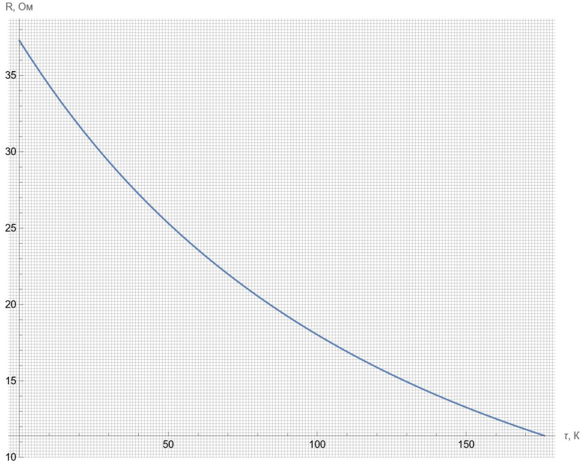
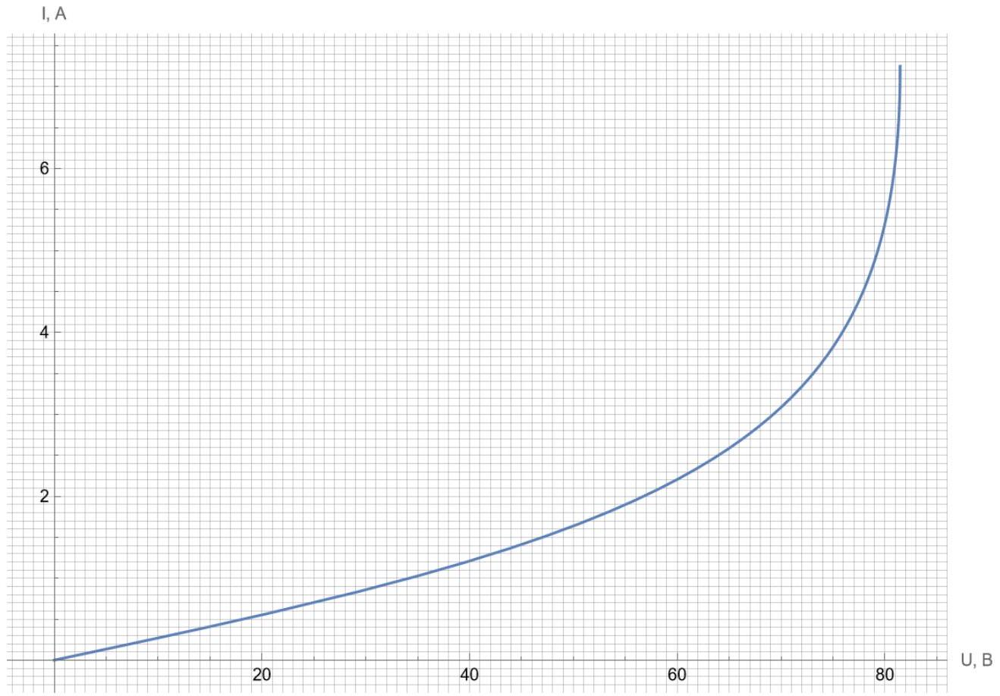
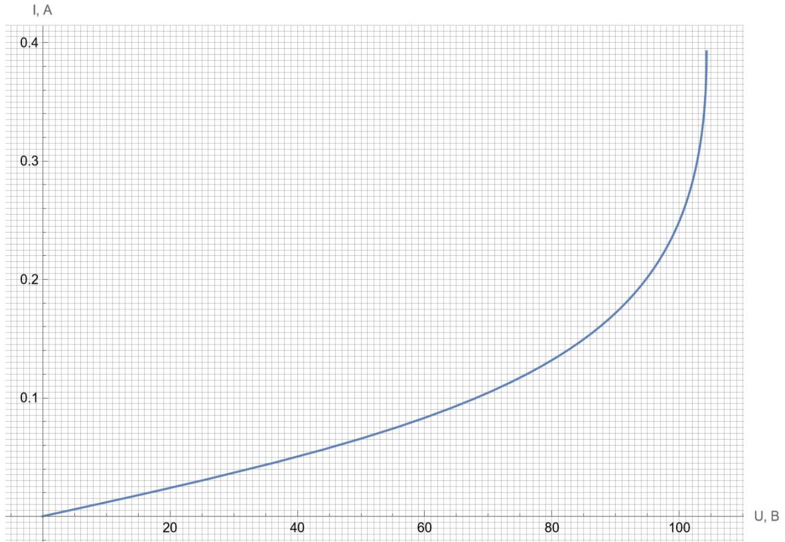
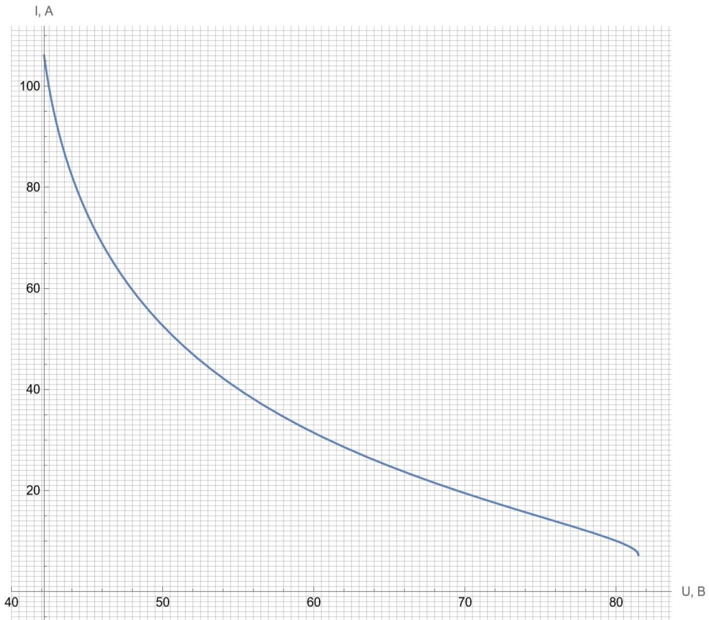
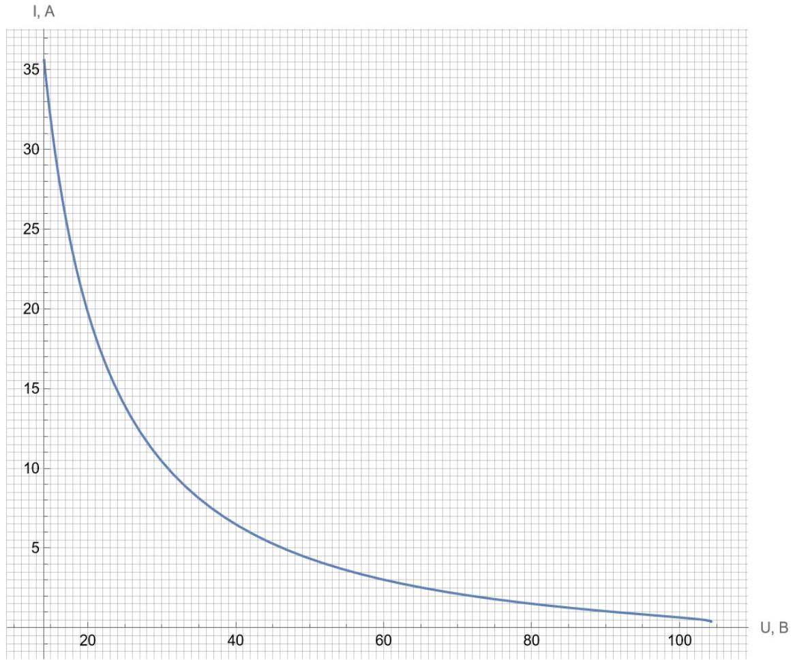

Запишите уравнение на временну́ю производную $\dot { \tau }$ температуры термистора. Выразите ваш ответ через напряжение $U _ { R }$ на термисторе, ёмкость конденсатора $C$ и введённые выше коэффициенты $c$ и $\kappa$. Перепишите это же уравнение в терминах $U _ { R } , c , \kappa$ и сопротивления термистора $R ( \tau )$.

Мощность, выделяемая на резисторе, можно записать как:

$$
P = \frac { U _ { R } ^ { 2 } } { R } = U _ { R } I = U _ { R } \dot { Q } _ { C } = \frac { 1 } { C } U _ { R } \dot { U } _ { C } = \frac { 1 } { C } U _ { R } \frac { \mathrm {~d} } { \mathrm {~d} t } \left[ U - U _ { R } \right] = - \frac { 1 } { C } U _ { R } \dot { U } _ { R } = - \frac { 1 } { 2 C } \frac { \mathrm {~d} } { \mathrm {~d} t } \left[ U _ { R } ^ { 2 } \right] .
$$

При этом мощность, рассеиваемая резистором в окружающее пространство, равна $\kappa \tau$, откуда:

Ответ:

$$
\begin{gathered}
c \dot { \tau } = - \frac { C } { 2 } \frac { \mathrm {~d} } { \mathrm {~d} t } \left[ U _ { R } ^ { 2 } \right] - \kappa \tau \\
c \dot { \tau } = \frac { U _ { R } ^ { 2 } } { R } - \kappa \tau
\end{gathered}
$$

А2 ${ } ^ { 0.60 }$ Пусть $c = a _ { 1 } U ^ { 2 }$, а $\kappa = a _ { 2 } U ^ { 2 }$. По асимптотикам кривой $\tau ( t )$ при малых и больших $t$ найдите значения коэффициентов $a _ { 1 }$ и $a _ { 2 }$.

Введём обозначения $c = a _ { 1 } U ^ { 2 }$ и $\kappa = a _ { 2 } U ^ { 2 }$. Для поиска $a _ { 1 }$ проведём касательную к графику $\tau ( t )$ в точке $t = 0$. Её угловой коэффициент будет равен $\frac { U ^ { 2 } } { c R _ { 0 } } = \frac { 1 } { a _ { 1 } R _ { 0 } }$. Для поиска $a _ { 2 }$ снимем несколько точек с "хвоста" графика и перестроим их в координатах $\ln \tau ( t )$. Угловой коэффициент полученной прямой будет равен $- \frac { \kappa } { c } = - \frac { a _ { 2 } } { a _ { 1 } }$. Окончательный ответ:

Ответ:

$$
\begin{array} { l l }
c = a _ { 1 } U ^ { 2 } , & a _ { 1 } = 8.26 \cdot 10 ^ { - 5 } \frac { \text { Дж } } { К \cdot \mathrm {~B} ^ { 2 } } \\
\kappa = a _ { 2 } U ^ { 2 } , & a _ { 2 } = 6.82 \cdot 10 ^ { - 5 } \frac { \text { Вт } } { К \cdot \mathrm {~B} ^ { 2 } }
\end{array}
$$

A3 ${ } ^ { 0.60 }$ Выразите через $\kappa$ и $\tau$ количество теплоты, которое выделится на термисторе за всё время, и свяжите его с изменением энергии конденсатора $W _ { C }$. Найдите отсюда ёмкость конденсатора $C$ и её численное значение.

Тепло, которое рассеется на термисторе, равно интегралу мощности теплообмена от $t = 0$ до $t = + \infty$ :

$$
Q _ { R } = \kappa \int _ { 0 } ^ { + \infty } \tau ( \xi ) \mathrm { d } \xi
$$

Работа источника за это время $A = Q U = C U ^ { 2 }$, а изменение энергии конденсатора $W _ { C } = \frac { C } { 2 } U ^ { 2 } \Longrightarrow$ на термисторе выделится $Q _ { R } = A - W _ { C } = \frac { C } { 2 } U ^ { 2 } \Longrightarrow$

Ответ:

$$
Q _ { R } = \kappa \int _ { 0 } ^ { + \infty } \tau ( \xi ) \mathrm { d } \xi = \frac { C } { 2 } U ^ { 2 }
$$

Подставляя выражение для $\kappa$ из А2, имеем:

Ответ:

$$
C = 2 a _ { 2 } \int _ { 0 } ^ { + \infty } \tau ( \xi ) \mathrm { d } \xi = 47 \text { мФ }
$$

A4 ${ } ^ { 0.20 }$ Запишите выражение для мощности $P$, выделяющейся на термисторе. Выразите ответ через $U , R _ { 0 } , \tau$ и введённые в А2 численные коэффициенты.

Из пунктов А1 и А2 получаем:

$$
P = \frac { U _ { R } ^ { 2 } } { R } = c \dot { \tau } + \kappa \tau = \left[ a _ { 1 } \dot { \tau } + a _ { 2 } \tau \right] U ^ { 2 }
$$

Ответ: $P = \left[ a _ { 1 } \dot { \tau } + a _ { 2 } \tau \right] U ^ { 2 }$

A5 ${ } ^ { 0.20 }$ Найдите отсюда выражение для напряжения $U _ { R }$ на резисторе. Выразите ответ через $U , \tau$ и введённые в А2 численные коэффициенты.

Вспомним, что мощность на термисторе равна $P = \frac { C } { 2 } \frac { \mathrm {~d} } { \mathrm {~d} t } \left[ U _ { R } ^ { 2 } \right]$, откуда в результате интегрирования получаем:

$$
\int _ { 0 } ^ { t } P ( \xi ) \mathrm { d } \xi = \frac { C } { 2 } \left[ U ^ { 2 } - U _ { R } ^ { 2 } ( t ) \right] = c \tau ( t ) + \kappa \int _ { 0 } ^ { + \infty } \tau ( \xi ) \mathrm { d } \xi \Longrightarrow U _ { R } = \sqrt { U ^ { 2 } - \frac { 2 } { C } \left[ c \tau + \kappa \int _ { 0 } ^ { t } \tau ( \xi ) \mathrm { d } \xi \right] } .
$$

Подставляя выражение для $\kappa$ из А2, имеем:

Ответ:

$$
U _ { R } = U \sqrt { \frac { - a _ { 1 } \tau + a _ { 2 } \int _ { t } ^ { + \infty } \tau ( \xi ) \mathrm { d } \xi } { a _ { 2 } \int _ { 0 } ^ { + \infty } \tau ( \xi ) \mathrm { d } \xi } }
$$

A6 ${ } ^ { 0.20 }$ Получите выражение для сопротивления термистора $R$. Выразите ответ через $R _ { 0 } , \tau$ и введённые в А2 численные коэффициенты.

Подставляя результаты A4 и A5 в выражение $P = \frac { U _ { R } ^ { 2 } } { R }$, имеем:

Ответ:

$$
R ( t ) = \frac { 1 } { a _ { 1 } \dot { \tau } + a _ { 2 } \tau } \frac { - a _ { 1 } \tau + a _ { 2 } \int _ { t } ^ { + \infty } \tau ( \xi ) \mathrm { d } \xi } { a _ { 2 } \int _ { 0 } ^ { + \infty } \tau ( \xi ) \mathrm { d } \xi }
$$

A7 ${ } ^ { 2.00 }$ Как можно точнее найдите по графику зависимость $R ( \tau )$.

Оригинальный график в максимальном разрешении можно найти в материалах к задаче.

Ответ:

A8 ${ } ^ { 0.20 }$ Найдите $с$ и $\kappa$, если полное приложенное напряжение равно $U = 220 \mathrm {~B}$.

Подставляем в выражения из А2:

Ответ:

$$
\begin{aligned}
& c = 4.0 \frac { Д ж } { К } \\
& \kappa = 3.3 \frac { \mathrm { BT } } { К }
\end{aligned}
$$

В1 ${ } ^ { \mathbf { 0 . 6 0 } }$ Рассматривая значения $\frac { 1 } { T _ { 0 } + \tau _ { i } }$ как экспериментальные точки, а правую часть уравнения Стейнхарта-Харта как уравнение модельной кривой, запишите систему уравнений, позволяющую найти коэффициенты $A , B$ и $C$.

По МНК нам нужно минимизировать следующую сумму:

$$
\mathcal { S } = \sum _ { i } \left[ A + B \ln R + C \ln ^ { 3 } R - \frac { 1 } { T _ { 0 } + \tau } \right] ^ { 2 } .
$$

Для этого необходимо решить систему уравнений:

$$
\left\{ \begin{array} { l }
\frac { \partial S } { \partial A } = 0 \\
\frac { \partial S } { \partial B } = 0 \\
\frac { \partial S } { \partial C } = 0
\end{array} \right.
$$

Беря производные и переписывая уравнения через средние по выборке, получим:

$$
\text { Ответ: } \left\{ \begin{array} { c }
A + \overline { \ln R } \cdot B + \overline { \ln ^ { 3 } R } \cdot C = \overline { \left[ T _ { 0 } + \tau \right] ^ { - 1 } } \\
\overline { \ln R } \cdot A + \overline { \ln ^ { 2 } R } \cdot B + \overline { \ln ^ { 4 } R } \cdot C = \overline { \left[ T _ { 0 } + \tau \right] ^ { - 1 } \ln R } \\
\overline { \ln ^ { 3 } R } \cdot A + \overline { \ln ^ { 4 } R } \cdot B + \overline { \ln ^ { 6 } R } \cdot C = \overline { \left[ T _ { 0 } + \tau \right] ^ { - 1 } \ln ^ { 3 } R }
\end{array} \right.
$$

В2 $1 ^ { 1.40 }$ Решите эту систему численно и получите коэффициенты Стейнхарта-Харта.

Выбор желаемого алгоритма решения оставим за читателем.

Ответ:

$$
\begin{aligned}
& A = 9.3 \cdot 10 ^ { - 4 } \\
& B = 3.3 \cdot 10 ^ { - 4 } \\
& C = 2.6 \cdot 10 ^ { - 5 }
\end{aligned}
$$

Со?" Внимание! Если вы не решали части А и В или не хотите использовать полученные значения коэффициентов уравнения Стейнхарта-Харта и контактную теплопроводность терморезистора, можете воспользоваться следующими значениями:

$$
A = 7.3 \cdot 10 ^ { - 4 } \quad B = 1.30 \cdot 10 ^ { - 4 } \quad C = 5.7 \cdot 10 ^ { - 6 } \quad \kappa = 0.37 \frac { \mathrm { BT } } { \kappa }
$$

В случае выбора приведённых значений явно напишите об этом в листе ответов для этого пункта. В этом случае ваш максимальный балл за пункты С2 и С4 будет на 10\% меньше.

С1 ${ } ^ { 0.20 }$ Запишите уравнение для нахождения стационарного значения сопротивления NTC-термистора, к которому приложено постоянное напряжение $U$.

В стационарном режиме $\dot { \tau } = 0$, поэтому:

$$
\frac { U ^ { 2 } } { R } = \kappa \tau = \kappa \left( T - T _ { 0 } \right) .
$$

Исключая отсюда $T$ с помощью уравнения Стейнхарта-Харта, имеем:

Ответ: $\left[ \frac { U ^ { 2 } } { \kappa } \frac { 1 } { R } + T _ { 0 } \right] \left[ A + B \ln R + C \ln ^ { 3 } R \right] = 1$

C2 ${ } ^ { 1.50 }$ Решая это уравнение, получите как можно точнее зависимость $R ( U )$. Постройте на основе полученных точек ВАХ терморезистора при небольших токах и напряжениях.

С помощью итеративных уравнений:

Нужно преобразовать уравнение к форме с $R$ в левой части так, чтобы обеспечить сходимость.
Параметризацией по $R$ :
Куда проще можно поступить, если заметить, найти зависимость $U ( R )$ очень легко. Вычислив пары точек, мы получим зависимость $R ( U )$.
Оригинальные графики в максимальном разрешении можно найти в материалах к задаче.

Ответ:

График с числами из части A

Ответ:

График к числами из пункта C0

C3 ${ } ^ { 0.30 }$
Найдите, при каком критическом напряжении $U _ { \mathrm { cr } }$ и токе $I _ { \mathrm { cr } }$ режим работы терморезистора меняется.

С помощью итеративных уравнений:
При увеличении напряжения можно заметить, что сходимость при решении итеративным методом происходит всё медленнее и медленнее, пока по достижении некоторого напряжения сопротивление не "улетает" скачком в область очень малых значений (которые, как несложно проверить, соответствуют температурам порядка $\sim 10 ^ { 6 } К$ ). Это - пробой термистора. Напряжение и ток, при котором он происходит:

Параметризацией по $R$ :
При уменьшении $R$ при некотором значении $R _ { \mathrm { cr } } = 11.241 ( 256.5 )$ Ом ВАХ "разворачивается", что, как известно, соответствует неустойчивому участку, а потому - пробою термистора. Отсюда сразу находим напряжение и ток, при котором он происходит:

Ответ:

$$
\begin{aligned}
& U _ { \mathrm { cr } } = 81.47 ( 104.28 ) \mathrm { B } \\
& I _ { \mathrm { cr } } = 7.248 ( 0.3928 ) \mathrm { A }
\end{aligned}
$$

С помощью итеративных уравнений:
Нужно преобразовать уравнение к форме с $R$ в левой части так, чтобы обеспечить сходимость. Температуру, которой соответствует конкретная точка на BAX, можно найти из уравнения Стейнхарта-Харта. При $T = T _ { \text {max } }$ ВАХ обрывается.

Параметризацией по $R$ :
Сопротивление термистора $R _ { \min }$ находим из уравнения Стейнхарта-Харта. Строим ВАХ от этого значения до найденного в предыдущем пункте.
Оригинальные графики в максимальном разрешении можно найти в материалах к задаче.

Ответ:

График с числами из части A

Ответ:

График к числами из пункта C0

C5 ${ } ^ { 0.30 }$
Найдите координаты $\left( U _ { \mathrm { m } } , I _ { \mathrm { m } } \right)$ точки плавления терморезистора на BAX.

С помощью итеративных уравнений:
Температуру, которой соответствует конкретная точка на ВАХ, можно найти из уравнения Стейнхарта-Харта.
Параметризацией по $\tau$ :
Ответ получается непосредственной подстановкой в уравнение.

Ответ:

$$
\begin{gathered}
U _ { \mathrm { m } } = 42.14 ( 14.086 ) \mathrm { B } \\
I _ { \mathrm { m } } = 106.09 ( 35.59 ) \mathrm { A }
\end{gathered}
$$
