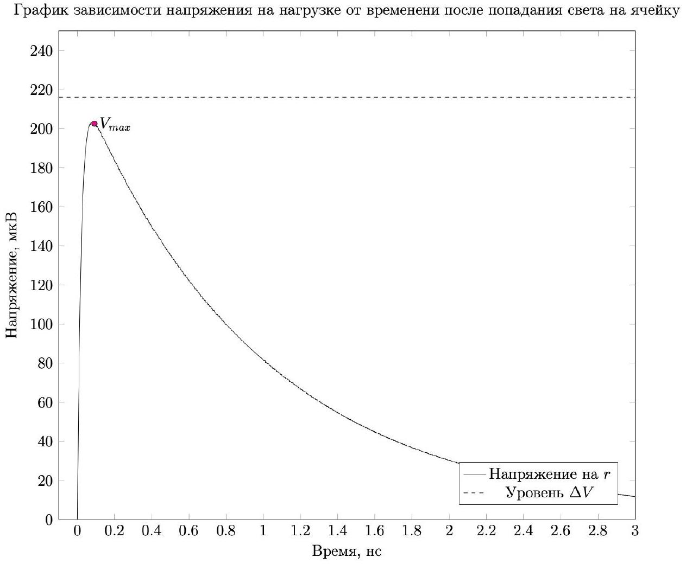

Для установившегося режима найдите:

- напряжение $V _ { r }$ на нагрузке $r$;
- напряжение $V _ { 0 }$ на каждой ячейке и паразитной емкости $C _ { 0 }$;
- напряжения $V _ { 1 }$ на слоях гашения каждой ячейки.

В установившемся режиме ток через $r$ не течёт, поэтому $V _ { r } = 0$. Напряжение на ячейках совпадает с напряжением источника, то есть $V _ { 0 } = V _ { \text {ор. } }$ Конденсатор $C _ { 1 }$ параллелен резистору, поэтому он разряжен: $V _ { 1 } = 0$.

Ответ:

$$
\begin{gathered}
V _ { r } = 0 \\
V _ { 0 } = V _ { o p } \\
V _ { 1 } = 0
\end{gathered}
$$

A2 ${ } ^ { 0.80 }$
Найдите:

- изменение заряда $\Delta q _ { 0 }$ конденсатора $C _ { 0 }$. Ответ выразите через $C _ { 0 }$ и $\Delta V$;
- изменения зарядов $\Delta q _ { 1 a }$ и $\Delta q _ { 2 a }$ конденсаторов $C _ { 1 }$ и $C _ { 2 }$ соответственно каждой из активных ячеек. Ответы выразите через $C _ { 1 } , C _ { 2 } , V _ { o v }$ и $\Delta V$;
- изменения зарядов $\Delta q _ { 1 p }$ и $\Delta q _ { 2 p }$ конденсаторов $C _ { 1 }$ и $C _ { 2 }$ соответственно каждой из пассивных ячеек. Ответы выразите через $C _ { \text {cell } }$ и $\Delta V$.

По определению ёмкости: $\Delta q _ { 0 } = C _ { 0 } \Delta V$. Аналогично изменение заряда на конденсаторах в активных ячейках: $\Delta q _ { 1 a } = C _ { 1 } \left( V _ { o v } + \Delta V \right)$ и $\Delta q _ { 2 a } = - C _ { 2 } V _ { o v }$, а на пассивных ячейках: $\Delta q _ { 1 p } = \Delta q _ { 2 p } = C _ { \text {cell } } \Delta V$.

Ответ:

$$
\begin{gathered}
\Delta q _ { 0 } = C _ { 0 } \Delta V \\
\Delta q _ { 1 a } = C _ { 1 } \left( V _ { o v } + \Delta V \right) \\
\Delta q _ { 2 a } = - C _ { 2 } V _ { o v } \\
\Delta q _ { 1 p } = \Delta q _ { 2 p } = C _ { c e l l } \Delta V
\end{gathered}
$$

А3 ${ } ^ { 0.70 }$ Найдите изменение напряжения $\Delta V$ на ячейках и конденсаторе $C _ { 0 }$ по завершении лавинного процесса. Ответ выразите в общем виде через $V _ { \text {оv } } , n$, $N , C _ { 1 } , C _ { 2 } , C _ { 0 }$.

Запишем закон сохранения заряда для положительных обкладок $C _ { 0 }$ и $C _ { 1 }$.

$$
\begin{gathered}
n \Delta q _ { 1 a } + \Delta q _ { 0 } + ( N - n ) \Delta q _ { 1 p } = 0 \\
n C _ { 1 } \left( V _ { o v } + \Delta V \right) + C _ { 0 } \Delta V + ( N - n ) C _ { c e l l } \Delta V = 0 \\
\Delta V \left( n C _ { 1 } + C _ { 0 } + ( N - n ) C _ { c e l l } \right) = - n C _ { 1 } V _ { o v } \\
\Delta V = - \frac { n C _ { 1 } V _ { o v } } { n C _ { 1 } + C _ { 0 } + ( N - n ) \frac { C _ { 1 } C _ { 2 } } { C _ { 1 } + C _ { 2 } } }
\end{gathered}
$$

Ответ:

$$
\Delta V = - \frac { n C _ { 1 } V _ { o v } } { n C _ { 1 } + C _ { 0 } + ( N - n ) \frac { C _ { 1 } C _ { 2 } } { C _ { 1 } + C _ { 2 } } }
$$

А4 ${ } ^ { 0.60 }$ Оцените амплитуду теплового шума на нагрузке $r = 50$ Ом при комнатной температуре, если полоса пропускания осциллографа составляет 1 ГГц $= 10 ^ { 9 }$ Гц. Используя данные из условия задачи и полученную вами формулу из А3 найдите численное значение $\Delta V$ при попадании света на одну ячейку. Сделайте вывод о том, можно ли различить сигнал от одной ячейки на фоне теплового шума сопротивления нагрузки.

Подставим $T = 300$ К и получим: $V _ { \text {noise } } = 2.88 \cdot 10 ^ { - 5 } \mathrm {~B}$.
Выразим изменение напряжения через данные в условии величины:

$$
\Delta V = - \frac { ( k + 1 ) ( 1 - p ) \frac { n } { N } V _ { o v } } { 1 + \frac { k n } { N } ( 1 - p ) }
$$

Подставим $n = 1$ и получим:

$$
\Delta V = - 2.16 \cdot 10 ^ { - 4 } \mathrm {~B}
$$

Заметим, что $\Delta V$ по модулю заметно больше $V _ { \text {noise } }$, поэтому различить сигнал можно.

Ответ:

$$
\begin{aligned}
& V _ { \text {noise } } = 2.88 \cdot 10 ^ { - 5 } \mathrm {~B} \\
& \Delta V = - 2.16 \cdot 10 ^ { - 4 } \mathrm {~B}
\end{aligned}
$$

$\Delta V$ по модулю заметно больше $V _ { \text {noise } }$, поэтому различить сигнал можно.

В1 ${ } ^ { 0.80 }$ Найдите коэффициент умножения $M$ для ТФУ с параметрами из условия задачи. Выразите ответ через $N , C _ { 1 } , C _ { 2 } , C _ { 0 } , e , V _ { \text {оv } }$ и приведите численное значение.
$Q$ можно определить через изменение зарядов на отрицательных обкладках $C _ { 0 }$ и $C _ { 2 }$.

$$
\begin{gathered}
Q = - C _ { 0 } \Delta V - ( N - 1 ) C _ { \text {cell } } \Delta V + C _ { 2 } V _ { o v } \\
M = \left( \left( C _ { 0 } + ( N - 1 ) C _ { \text {cell } } \right) \frac { C _ { 1 } V _ { o v } } { C _ { 1 } + C _ { 0 } + ( N - 1 ) C _ { \text {cell } } } + C _ { 2 } V _ { o v } \right) \cdot \frac { 1 } { e } \\
M = 32.4 \cdot 10 ^ { 3 }
\end{gathered}
$$

Ответ:

$$
\begin{gathered}
M = \left( \left( C _ { 0 } + ( N - 1 ) \frac { C _ { 1 } C _ { 2 } } { C _ { 1 } + C _ { 2 } } \right) \frac { C _ { 1 } V _ { o v } } { C _ { 1 } + C _ { 0 } + ( N - 1 ) \frac { C _ { 1 } C _ { 2 } } { C _ { 1 } + C _ { 2 } } } + C _ { 2 } V _ { o v } \right) \cdot \frac { 1 } { e } \\
M = 32.4 \cdot 10 ^ { 3 }
\end{gathered}
$$

С1 ${ } ^ { 0.40 }$ Рассмотрим импульс, регистрируемый осциллографом после попадания света на одну ячейку. Будем считать, что длительность импульса достаточно мала, чтобы пренебречь током, протекающим через сопротивление утечки $R$, но достаточно большое, чтобы лавинный процесс завершился, и все ключи $K _ { i }$ разомкнуты. В этом приближении можно заменить цепь на эквивалентную последовательную $R L C$ цепь. Укажите ее параметры.

Ответ: Сопротивление $r$, индуктивность $L$ и ёмкость $C _ { \text {det } }$

С2 ${ } ^ { 0.30 }$ Оцените добротность полученной $R L C$ цепи. Возникнут ли в этой цепи колебания?

Ответ: Воспользуемся обычной формулой для добротности колебательного контура:

$$
Q = \frac { 1 } { R } \sqrt { \frac { L } { C } } = 0.14
$$

Полученное значение много меньше 1, значит, колебания в этой цепи не возникнут.

с3 ${ } ^ { 0.30 }$ Качественно изобразите график зависимости напряжения на нагрузке от времени после попадания света на одну из ячеек. Первоначально схема находилась в установившемся режиме. Характерные значения указывать не обязательно.

Ответ:

C4 ${ } ^ { 0.20 }$ Сравните максимальное по модулю значение напряжения на нагрузке $\left| V _ { \text {max } } \right|$ после попадания света на одну из ячеек и найденную ранее величину $| \Delta V |$. Какая из этих величин больше? Обведите в листе ответов правильное соотношение.

Напряжение на резисторе всегда будет меньше начального напряжения конденсатора.

Ответ:

$$
\left| V _ { \max } \right| < | \Delta V |
$$

D1 ${ } ^ { 1.00 }$ Найдите приближенную зависимость напряжения на слое гашения ячейки от времени после попадания света на нее (в первоначальных условиях установившегося режима). Воспользуйтесь тем, что в условиях данной задачи $\Delta V \ll V _ { o v } , R \gg r$. Считайте, что прошло достаточно много времени, и напряжение на внешней нагрузке практически равно нулю. Выразите ответ через $V _ { \text {оv } } , R , C _ { 1 } , C _ { 2 } , t$.

В силу соотношений данных в условии напряжением на $r$ и $L$ можно пренебречь. То есть для процесса восстановления ячейка эквивалента RC-цепи.

$$
C _ { 1 } { } _ { \square } C _ { 2 } \frac { \square } { \square }
$$

Изначально напряжение на $C _ { 1 }$ равно $V _ { o v }$. Тогда зависимость от времени:

$$
V _ { 1 } = V _ { o v } \cdot e ^ { - \frac { t } { R \left( C _ { 1 } + C _ { 2 } \right) } }
$$

Ответ:

$$
V _ { 1 } = V _ { o v } \cdot e ^ { - \frac { t } { R \left( C _ { 1 } + C _ { 2 } \right) } }
$$

D2 ${ } ^ { 0.50 }$ Найдите изменение напряжения $\Delta V$ на конденсаторе $C _ { 0 }$ при попадании света на одну $( n = 1 )$ из невосстановленных ячеек, напряжение на слое гашения которой равнялось $V _ { 1 } < V _ { o v }$. Считайте, что до попадания света на эту ячейку напряжение на всех ячейках и паразитной емкости соответствовало установившемуся режиму. Выразите $\Delta V$ через $V _ { \text {ov } } , V _ { 1 } , N , C _ { 1 } , C _ { 2 } , C _ { 0 }$.

Ответ можно получить аналогично части A , но теперь изменение напряжения на $C _ { 2 }$ будет $V _ { o v } - V _ { 1 }$ вместо просто $V _ { o v }$.

Ответ:

$$
\Delta V = - \frac { C _ { 1 } \left( V _ { o v } - V _ { 1 } \right) } { C _ { 1 } + C _ { 0 } + ( N - 1 ) \frac { C _ { 1 } C _ { 2 } } { C _ { 1 } + C _ { 2 } } }
$$

Е1 ${ } ^ { 0.30 }$ Пусть $p ( t )$ - вероятность того, что в течение времени $t$ ячейка не сработала ни разу. Найдите $p ( t + d t )$, выразите ответ через $p ( t ) , d t , T$. Считайте, что $d t \ll T$.

Вероятность того, что ячейка не сработает за время $d t$ равна $1 - \frac { d t } { T }$, поэтому:

$$
p ( t + d t ) = p ( t ) \cdot \left( 1 - \frac { d t } { T } \right)
$$

Ответ:

$$
p ( t + d t ) = p ( t ) \cdot \left( 1 - \frac { d t } { T } \right)
$$

E2 ${ } ^ { 0.20 }$ Найдите вероятность того, ячейка не сработает ни разу в течение времени $t$. Ответ выразите через $t , T$.

Воспользуемся результатом прошлого пункта.

$$
\begin{gathered}
d p = - p \cdot \frac { d t } { T } \\
\frac { d p } { p } = - \frac { d t } { T }
\end{gathered}
$$

Используя $p ( 0 ) = 1$, получим:

Ответ:

$$
p ( t ) = e ^ { - \frac { t } { T } }
$$

E3 ${ } ^ { \mathbf { 0 . 2 0 } }$ Пусть ячейка сработала в момент времени $t = 0$. Найдите вероятность того, что в следующий раз она сработает в интервал времен от $t$ до $t + d t$.

Искомое выражение - произведение вероятности того, что ячейка не сработает за время $t$, и вероятности срабатывания за $d t$.

Ответ:

$$
p ( t , t + d t ) = e ^ { - \frac { t } { T } } \cdot \frac { d t } { T }
$$

E4 ${ } ^ { 0.40 }$ Найдите среднюю амплитуду импульсов фотоответа $\mu$. Считайте, что разные ячейки создают импульсы независимо друг от друга.

Из определения среднего:

$$
\mu = \int _ { 0 } ^ { + \infty } V ( t ) \cdot p ( t ) \cdot \frac { d t } { T } = \int _ { 0 } ^ { + \infty } \left( 1 - e ^ { - \frac { t } { \tau } } \right) \cdot e ^ { - \frac { t } { T } } \cdot \frac { d t } { T } = \int _ { 0 } ^ { 1 } \left( 1 - x ^ { \frac { T } { \tau } } \right) d x
$$

Где $x = e ^ { - \frac { t } { T } }$.

$$
\mu = 1 - \frac { 1 } { \frac { T } { \tau } + 1 } = \frac { T } { T + \tau }
$$

Ответ:

$$
\mu = \frac { T } { T + \tau }
$$

E5 ${ } ^ { 0.60 }$ Найдите среднеквадратичное отклонение амплитуды импульсов фотоответа $\sigma$. Ответ выразите через $\tau , T$.
Указание: среднеквадратичное отклонение можно вычислить по формуле $\sigma = \sqrt { \mu \left( V ^ { 2 } \right) - \mu ^ { 2 } ( V ) }$, где $\mu \left( V ^ { 2 } \right)$ - среднее значение квадрата амплитуды, $\mu ^ { 2 } ( V )$ -квадрат среднего значения амплитуды.
$\mu ( V )$ нашли в прошлом пункте, аналогично найдём $\mu \left( V ^ { 2 } \right)$ :

$$
\begin{gathered}
\mu \left( V ^ { 2 } \right) = \int _ { 0 } ^ { 1 } \left( 1 - x ^ { \frac { T } { \tau } } \right) ^ { 2 } d x = 1 - \frac { 2 } { \frac { T } { \tau } + 1 } + \frac { 1 } { \frac { 2 T } { \tau } + 1 } \\
\mu \left( V ^ { 2 } \right) - \mu ( V ) ^ { 2 } = \frac { 1 } { \frac { 2 T } { \tau } + 1 } - \frac { 1 } { \left( \frac { T } { \tau } + 1 \right) ^ { 2 } } = \frac { \frac { T ^ { 2 } } { \tau ^ { 2 } } } { \left( \frac { T } { \tau } + 1 \right) ^ { 2 } \left( \frac { 2 T } { \tau } + 1 \right) } = \left( \frac { T } { T + \tau } \right) ^ { 2 } \cdot \frac { \tau } { 2 T + \tau } \\
\sigma = \frac { T } { T + \tau } \cdot \sqrt { \frac { \tau } { 2 T + \tau } }
\end{gathered}
$$

Ответ:

$$
\sigma = \frac { T } { T + \tau } \cdot \sqrt { \frac { \tau } { 2 T + \tau } }
$$

E6 ${ } ^ { 0.30 }$
Найдите $S N R$ амплитуд импульсов фотоответа под воздействием равномерной фоновой засветки в случаях:

- $\tau = 0$;
- $\tau \gg T$;
- $\tau = T$.

$$
S N R = \sqrt { \frac { 2 T + \tau } { \tau } }
$$

Ответ:

$$
\begin{aligned}
& S N R ( \tau = 0 ) = \infty \\
& S N R ( \tau \gg T ) = 1 \\
& S N R ( \tau = T ) = \sqrt { 3 }
\end{aligned}
$$
