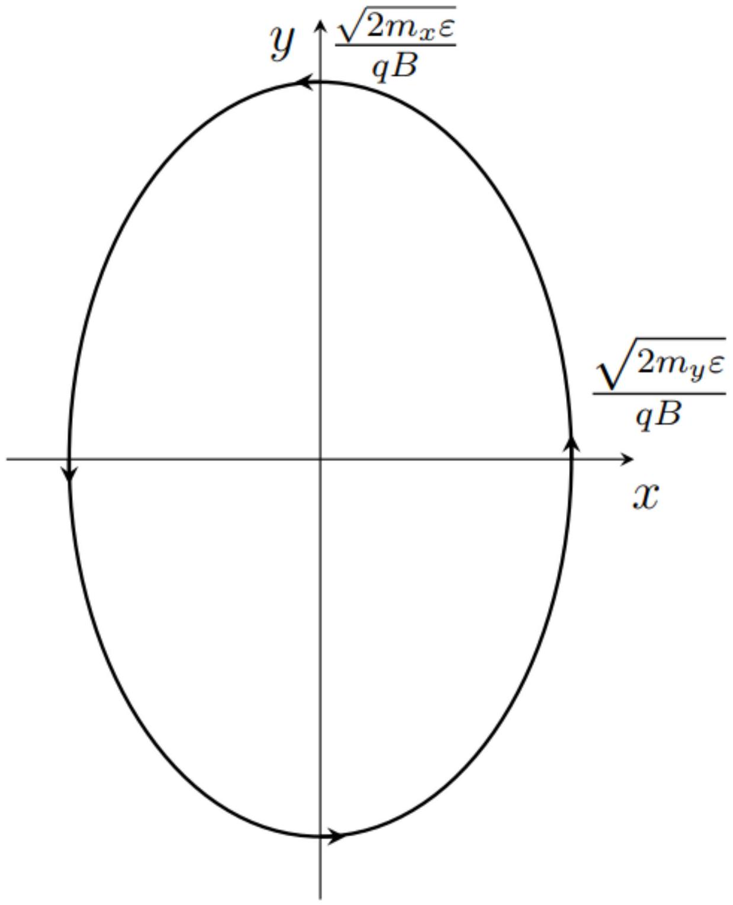
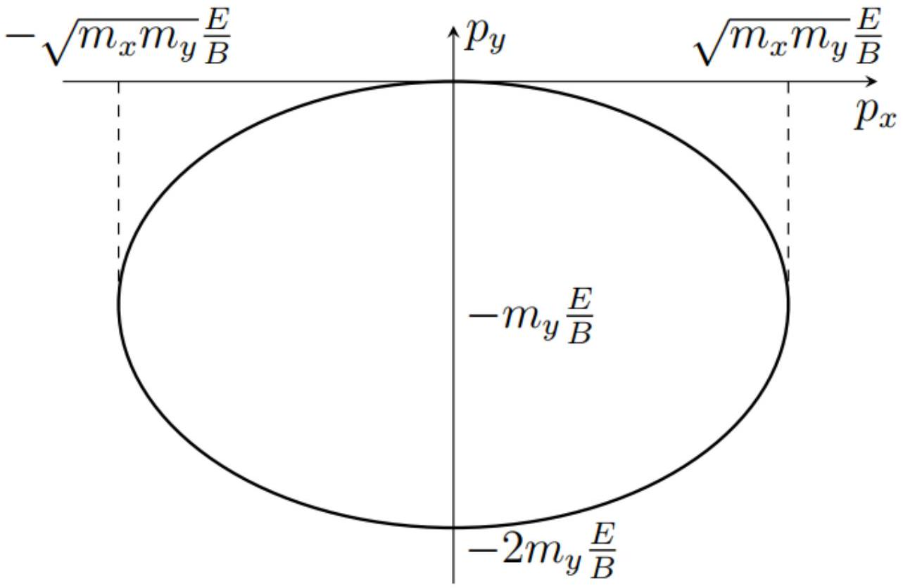
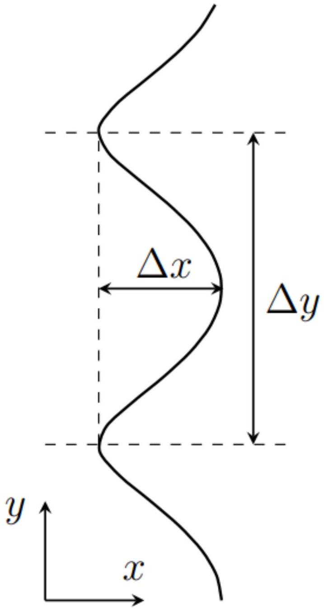

$$
\varepsilon ( p ) = \varepsilon _ { 0 } \left( 3 - \cos \left( a p _ { x } \right) - \cos \left( a p _ { y } \right) - \cos \left( a p _ { z } \right) \right) .
$$

Найдите его ускорение в момент времени, когда импульс равен $p _ { x } = \frac { \pi } { 2 a } , p _ { y } = \frac { \pi } { 3 a } , p _ { z } = 0$, а компоненты действующей на электрон силы $F _ { x }$, $F _ { y }$, $F _ { z }$.

Выразим скорость электрона через его импульс:

$$
v _ { x } = \frac { \partial \varepsilon } { \partial p _ { x } } = \varepsilon _ { 0 } a \sin \left( a p _ { x } \right) ,
$$

аналогично для остальных двух компонент

$$
v _ { y } = \varepsilon _ { 0 } a \sin \left( a p _ { y } \right) , v _ { z } = \varepsilon _ { 0 } a \sin \left( a p _ { z } \right) .
$$

Из уравнения движения $\frac { d } { d t } \vec { p } = \vec { F }$. Выразим ускорение через производную импульса:

$$
a _ { x } = \dot { v } _ { x } = \varepsilon _ { 0 } a ^ { 2 } \cos \left( a p _ { x } \right) \dot { p } _ { x } = \varepsilon _ { 0 } a ^ { 2 } \cos \left( a p _ { x } \right) F _ { x } .
$$

Формулы остальных компонент аналогичны. Для значений импульса из условия

Ответ:

$$
a _ { x } = 0 , a _ { y } = \frac { 1 } { 2 } \varepsilon _ { 0 } a ^ { 2 } F _ { y } , a _ { z } = \varepsilon _ { 0 } a ^ { 2 } F _ { z } .
$$

А2 ${ } ^ { 0.80 }$ Пусть электрон с $\varepsilon ( \vec { p } )$ из А1 движется в постоянном электрическом поле величины $E$, направленном вдоль оси $x$. Начальные координаты и проекции импульса равны нулю. Заряд электрона $- q$. Найдите его закон движения $x ( t )$.

На электрон действует сила $F _ { x } = - q E$, поэтому импульс

$$
p _ { x } = - q E t ,
$$

а соответствующая скорость

$$
v _ { x } = - a \varepsilon _ { 0 } \sin ( a q E t ) .
$$

Остальные проекции скорости равны нулю. Интегрируя, найдем зависимость координаты $x$ от времени

Ответ:

$$
x ( t ) = - \frac { \varepsilon _ { 0 } } { q E } ( 1 - \cos ( a q E t ) )
$$

A3 ${ } ^ { 0.50 }$ Концентрация свободных электронов в некотором веществе равна $n$, зависимость $\varepsilon ( p )$ как в А1. В начальный момент времени включается постоянное электрическое поле $E$, направленное вдоль оси $x$. Найдите зависимость плотности тока $j$ от времени.

Плотность тока выражается через скорость и концентрацию электронов

$$
j _ { x } = - n q v _ { x } = n q a \varepsilon _ { 0 } \sin ( a q E t ) .
$$

Ответ:

$$
j _ { x } = n q a \varepsilon _ { 0 } \sin ( a q E t ) .
$$

В1 ${ } ^ { 0.50 }$ Пусть зависимость энергии от импульса $\varepsilon ( \vec { p } )$ произвольна. Докажите, что энергия $\varepsilon$ и проекция импульса на направление магнитного поля сохраняются.

Уравнение движения

$$
\dot { \vec { p } } = - q \vec { v } \times \vec { B } .
$$

Производная энергии по времени

$$
\frac { d \varepsilon } { d t } = \frac { \partial \varepsilon } { \partial p _ { x } } \dot { p } _ { x } + \frac { \partial \varepsilon } { \partial p _ { y } } \dot { p } _ { y } + \frac { \partial \varepsilon } { \partial p _ { z } } \dot { p } _ { z } = v _ { x } \dot { p } _ { x } + v _ { y } \dot { p } _ { y } + v _ { z } \dot { p } _ { z } = \vec { v } \dot { \vec { p } } .
$$

Подставляя выражение для производной импульса, получим

$$
\dot { \varepsilon } = \vec { v } \cdot ( - q \vec { v } \times \vec { B } ) = 0
$$

Умножив уравнение движения скалярно на магнитное поле получим

$$
\frac { d } { d t } ( \vec { B } \vec { p } ) = \vec { B } \dot { \vec { p } } = - q \vec { B } ( \vec { v } \times \vec { B } ) = 0
$$

то есть проекция импульса на магнитное поле постоянна.

Ответ:

$$
\dot { \varepsilon } = \vec { v } \cdot ( - q \vec { v } \times \vec { B } ) = 0 .
$$

В2 ${ } ^ { 1.10 }$ Пусть зависимость энергии от импульса имеет вид

$$
\varepsilon = \frac { p _ { x } ^ { 2 } } { 2 m _ { x } } + \frac { p _ { y } ^ { 2 } } { 2 m _ { y } }
$$

Энергия электрона равна $\varepsilon$. Найдите частоту движения ω. Изобразите траекторию движения частицы на плоскости $x y$, укажите характерные размеры и направление движения. Начало координат поместите в центре симметрии траектории.

Запишем уравнения движения:

$$
\begin{aligned}
m _ { x } \dot { v } _ { x } & = - q v _ { y } B ; \\
m _ { y } \dot { v } _ { y } & = q v _ { x } B .
\end{aligned}
$$

Исключим из первого уравнения $v _ { y }$ продифференцировав его и выразив $\dot { v } _ { y }$ из второго уравнения. Получим

$$
m _ { x } \ddot { v } _ { x } = - q \dot { v } _ { y } B = - \frac { q ^ { 2 } B ^ { 2 } } { m _ { y } } v _ { x } ,
$$

то есть

$$
\ddot { v } _ { x } = - \frac { q ^ { 2 } B ^ { 2 } } { m _ { x } m _ { y } } v _ { x } .
$$

Это уравнение гармонических колебаний с частотой

$$
\omega = \frac { q B } { \sqrt { m _ { x } m _ { y } } } .
$$

Зависимость скорости от времени имеет вид

$$
v _ { x } = A \cos ( \omega t + \varphi ) ,
$$

где амплитуду $A$ можно найти, зная энергию электрона:

$$
A = \sqrt { \frac { 2 \varepsilon } { m _ { x } } } .
$$

Вторую компоненту скорости можно найти из уравнения движения

$$
v _ { y } = - \frac { m _ { x } } { q B } \dot { v } _ { x } = \sqrt { \frac { 2 \varepsilon } { m _ { x } } } \frac { \omega } { q B } \sin ( \omega t + \varphi ) = \sqrt { \frac { 2 \varepsilon } { m _ { y } } } \sin ( \omega t + \varphi ) .
$$

Интегрируя, получим траекторию частицы

$$
\begin{aligned}
& x ( t ) = \sqrt { \frac { 2 \varepsilon } { m _ { x } } } \frac { 1 } { \omega } \sin ( \omega t + \varphi ) = \frac { \sqrt { 2 m _ { y } \varepsilon } } { q B } \sin ( \omega t + \varphi ) ; \\
& y ( t ) = - \frac { \sqrt { 2 m _ { x } \varepsilon } } { q B } \cos ( \omega t + \varphi ) .
\end{aligned}
$$

Таким образом, траектория представляет собой эллипс с полуосями

$$
A _ { x } = \frac { \sqrt { 2 m _ { y } \varepsilon } } { q B } , A _ { y } = \frac { \sqrt { 2 m _ { x } \varepsilon } } { q B } .
$$

Движение происходит против часовой стрелки.

Ответ:

$$
\omega = \frac { q B } { \sqrt { m _ { x } m _ { y } } } , A _ { x } = \frac { \sqrt { 2 m _ { y } \varepsilon } } { q B } , A _ { y } = \frac { \sqrt { 2 m _ { x } \varepsilon } } { q B } .
$$

В3 ${ } ^ { 0.60 }$ Найдите годограф вектора импульса электрона (траекторию, по которой движется конец вектора импульса, если его откладывать от одной точки). Изобразите его на плоскости $p _ { x } , p _ { y }$. Укажите характерные размеры.

С учетом электрического поля уравнения движения

$$
\begin{aligned}
& m _ { x } \dot { v } _ { x } = - q E - q v _ { y } B \\
& m _ { y } \dot { v } _ { y } = q v _ { x } B
\end{aligned}
$$

Введем новую переменную $u _ { y }$ с помощью соотношения

$$
v _ { y } = - \frac { E } { B } + u _ { y } \text {, }
$$

тогда уравнения движения примут такой же вид, как и в предыдущей части:

$$
\begin{aligned}
& m _ { x } \dot { v } _ { x } = - q u _ { y } B \\
& m _ { y } \dot { u } _ { y } = q v _ { x } B .
\end{aligned}
$$

Начальные условия

$$
v _ { x } ( 0 ) = 0 , v _ { y } ( 0 ) = 0 , u _ { y } ( 0 ) = \frac { E } { B } .
$$

С учетом этого решение

$$
v _ { x } = - \sqrt { \frac { m _ { y } } { m _ { x } } } \frac { E } { B } \sin \omega t ; v _ { y } = - \frac { E } { B } ( 1 - \cos \omega t ) .
$$

Тогда импульсы

$$
p _ { x } = - \sqrt { m _ { x } m _ { y } } \frac { E } { B } \sin \omega t , p _ { y } = - m _ { y } \frac { E } { B } ( 1 - \cos \omega t ) .
$$

Ответ:

В4 ${ } ^ { 0.40 }$ Найдите закон движения $x ( t ) , y ( t )$.

Интегрируя скорости из предыдущего пункта, получим

Ответ:

$$
\begin{aligned}
& x ( t ) = - \frac { m _ { y } E } { q B ^ { 2 } } ( 1 - \cos \omega t ) \\
& y ( t ) = - \frac { E } { B } t + \frac { \sqrt { m _ { x } m _ { y } } E } { q B ^ { 2 } } \sin \omega t , \omega = \frac { q B } { \sqrt { m _ { x } m _ { y } } } .
\end{aligned}
$$

В5 ${ } ^ { 1.40 }$ Если энергия больше минимального значения, траектории на плоскости становятся незамкнутыми, и частица может неограниченно далеко некотором направлении. Найдите эту минимальную энергию $\varepsilon _ { \text {min } }$. При энергии $\varepsilon > \varepsilon _ { \text {min } }$ изобразите траекторию, укажите характерные геометрические размеры.

Запишем уравнения движения

$$
\dot { \vec { p } } = - q \vec { v } \times \vec { B } = - q \dot { \vec { r } } \times \vec { B } .
$$

Интегрируя, получаем

$$
\Delta \vec { p } = - q \Delta \vec { r } \times \vec { B } .
$$

Умножим это равенство векторно на $\vec { B }$.

$$
\Delta \vec { p } \times \vec { B } = - q ( \Delta \vec { r } \times \vec { B } ) \times \vec { B } = q B ^ { 2 } \Delta \vec { r } .
$$

Таким образом, вектор перемещения можно выразить через изменение импульса

$$
\Delta \vec { r } = \frac { 1 } { q B ^ { 2 } } \Delta \vec { p } \times \vec { B } .
$$

Рассмотрим сначала в импульсном пространстве. Из постоянства энергии следует, что годограф импульса - поверхность

$$
\frac { p _ { y } ^ { 2 } } { 2 m _ { y } } + \varepsilon _ { 0 } \left( 1 - \cos a p _ { x } \right) = \varepsilon = \text { const. }
$$

Уравнение этой поверхности можно представить в виде

$$
p _ { y } = \pm \sqrt { 2 m _ { y } \left( \varepsilon - \varepsilon _ { 0 } + \varepsilon _ { 0 } \cos a p _ { x } \right) } .
$$

В том случае, если $\varepsilon \leq 2 \varepsilon _ { 0 }$, годограф представляет собой замкнутую кривую. Тогда траектория также будет замкнутой кривой. Если же $\varepsilon > 2 \varepsilon _ { 0 }$, годограф импульса - незамкнутая кривая, направленная вдоль оси $x$. Тогда траектория движения частицы - кривая, направленная вдоль $y$, причем зависимость $x ( y )$ - периодическая. Найдем период этой функции и ширину полосы вдоль оси $x$, которую она занимает.

$$
\Delta y = \frac { 1 } { q B } \frac { 2 \pi } { a } , \Delta x = \frac { 1 } { q B } \Delta p _ { y } = \frac { \sqrt { 2 m _ { y } } } { q B } \left( \sqrt { \varepsilon } - \sqrt { \varepsilon - 2 \varepsilon _ { 0 } } \right) .
$$

Ответ:

С1 ${ } ^ { 0.50 }$ Сначала пренебрежем дисперсией и рассмотрим случай $\alpha = 0$. При каких углах $\theta _ { 1 } , \theta _ { 2 }$ возможен распад?

Запишем законы сохранения энергии и импульса:

$$
u p = u q _ { 1 } + u q _ { 2 } , \vec { p } = \vec { q } _ { 1 } + \vec { q } _ { 2 } .
$$

Поскольку длина вектора $\vec { p }$ равна сумме длин остальных двух векторов, все три вектора должны быть направлены в одну и ту же сторону.

Ответ: $\theta _ { 1 } = \theta _ { 2 } = 0$

С2 ${ } ^ { 0.50 }$ Выразите модуль импульса второго фонона $q _ { 2 }$ через $p , q _ { 1 } , \theta _ { 1 }$. Получите выражение выражение в пределе малых $\theta _ { 1 }$ с точностью до второго порядка по $\theta _ { 1 }$.

Из закона сохранения импульса

$$
\vec { q } _ { 2 } = \vec { p } - \vec { q } _ { 1 }
$$

Отсюда

$$
q _ { 2 } ^ { 2 } = p ^ { 2 } + q _ { 1 } ^ { 2 } - 2 p q _ { 1 } \cos \theta _ { 1 } = p ^ { 2 } + q _ { 1 } ^ { 2 } - 2 p q _ { 1 } \left( 1 - \theta _ { 1 } ^ { 2 } / 2 \right) = \left( p - q _ { 1 } \right) ^ { 2 } + p q _ { 1 } \theta _ { 1 } ^ { 2 } .
$$

Извлечем корень и разложим в ряд до требуемого порядка

$$
q _ { 2 } = \sqrt { \left( p - q _ { 1 } \right) ^ { 2 } + p q _ { 1 } \theta _ { 1 } ^ { 2 } } \approx p - q _ { 1 } + \frac { p q _ { 1 } } { 2 \left( p - q _ { 1 } \right) } \theta _ { 1 } ^ { 2 }
$$

C3 ${ } ^ { 1.20 }$ Зависимость импульса излучаемого фонона от угла при малых углах имеет вид

$$
q _ { 1 } \left( \theta _ { 1 } \right) = A + B \theta _ { 1 } .
$$

Определите постоянные $A , B$. Выразите их через $p , u , \alpha$.

Запишем закон сохранения энергии

$$
u p + \alpha p ^ { 3 } = u q _ { 1 } + \alpha q _ { 1 } ^ { 3 } + u q _ { 2 } + \alpha q _ { 2 } ^ { 3 } .
$$

Подставим выражение для $q _ { 2 }$ :

$$
u p + \alpha p ^ { 3 } = u q _ { 1 } + \alpha q _ { 1 } ^ { 3 } + u \left( p - q _ { 1 } + \frac { p q _ { 1 } } { 2 \left( p - q _ { 1 } \right) } \theta _ { 1 } ^ { 2 } \right) + \alpha \left( p - q _ { 1 } + \frac { p q _ { 1 } } { 2 \left( p - q _ { 1 } \right) } \theta _ { 1 } ^ { 2 } \right) ^ { 3 } .
$$

Раскроем скобки и оставим вклады порядка $\theta _ { 1 } ^ { 2 }$ :

$$
\alpha p ^ { 3 } = \alpha q ^ { 3 } + \frac { u p q _ { 1 } } { 2 \left( p - q _ { 1 } \right) } \theta _ { 1 } ^ { 2 } + \alpha \left( p - q _ { 1 } \right) ^ { 3 } + \frac { 3 \alpha } { 2 } p q _ { 1 } \left( p - q _ { 1 } \right) \theta _ { 1 } ^ { 2 } .
$$

Перенесем слагаемые, не зависящие от угла, налево:

$$
\alpha \left( p ^ { 3 } - q _ { 1 } ^ { 3 } - \left( p - q _ { 1 } \right) ^ { 3 } \right) = \frac { u p q _ { 1 } \theta _ { 1 } ^ { 2 } } { 2 \left( p - q _ { 1 } \right) } \left( 1 + \frac { 3 \alpha } { u } \left( p - q _ { 1 } \right) ^ { 2 } \right) .
$$

Вторым слагаемым в скобках в правой части можно пренебречь в силу условия $\alpha p ^ { 3 } \ll u p$, в левой части раскроем скобки и получим

$$
3 \alpha \left( p - q _ { 1 } \right) p q _ { 1 } = \frac { u p q _ { 1 } \theta _ { 1 } ^ { 2 } } { 2 \left( p - q _ { 1 } \right) }
$$

Отсюда

$$
\left( p - q _ { 1 } \right) ^ { 2 } = \frac { u } { 6 \alpha } \theta _ { 1 } ^ { 2 } , q _ { 1 } = p - \sqrt { \frac { u } { 6 \alpha } } \theta _ { 1 } .
$$

Ответ:

$$
A = p , B = - \sqrt { \frac { u } { 6 \alpha } } .
$$

C4 ${ } ^ { 0.30 }$ При каком знаке постоянной $\alpha$ распад возможен?

У уравнения в предыдущем пункте есть решение, если $\alpha > 0$.

Ответ: $\alpha > 0$

С5 ${ } ^ { 0.50 }$ Найдите максимальный угол $\theta _ { \text {max } }$, под которым может излучаться фонон. При каком условии на $p$ импульс фонона можно считать малым?

Максимальный угол достигается при минимальном импульсе испускаемого фонона $q _ { 1 } \rightarrow 0$. Тогда из выражения для $q _ { 1 }$ находим

$$
\theta _ { \max } = \sqrt { \frac { 6 \alpha } { u } } p .
$$

Вся задача решалась в приближении малых углов. Это приближение работает при условии $\theta _ { \max } \ll 1$, то есть

$$
p \ll \sqrt { \frac { u } { \alpha } } .
$$

Ответ:

$$
\theta _ { \max } = \sqrt { \frac { 6 \alpha } { u } } p .
$$

С6 ${ } ^ { 1.00 }$ Выразите угол $\theta _ { 2 }$, под которым излучается второй фонон, через $\theta _ { 1 } , p , u , \alpha$. Считайте углы малыми, учитывайте вклады первого порядка по $\theta _ { 1 } , \theta _ { 2 }$.

Из результатов C3 следует, что импульсы фононов выражаются через углы излучения как

$$
q _ { 1 } = p - \sqrt { \frac { u } { 6 \alpha } } \theta _ { 1 } , q _ { 2 } = p - \sqrt { \frac { u } { 6 \alpha } } \theta _ { 2 } .
$$

Запишем проекцию закона сохранения импульса на ось, перпендикулярную направлению движения исходного фонона:

$$
\begin{aligned}
q _ { 1 } \theta _ { 1 } & = q _ { 2 } \theta _ { 2 } \\
p \theta _ { 1 } - \sqrt { \frac { u } { 6 \alpha } } \theta _ { 1 } ^ { 2 } & = p \theta _ { 2 } - \sqrt { \frac { u } { 6 \alpha } } \theta _ { 2 } ^ { 2 } .
\end{aligned}
$$

Перегруппируем слагаемые:

$$
p \left( \theta _ { 1 } - \theta _ { 2 } \right) = \sqrt { \frac { u } { 6 \alpha } } \left( \theta _ { 1 } ^ { 2 } - \theta _ { 2 } ^ { 2 } \right) , p = \sqrt { \frac { u } { 6 \alpha } } \left( \theta _ { 1 } + \theta _ { 2 } \right) .
$$

Ответ:

$$
\theta _ { 2 } = \sqrt { \frac { 6 \alpha } { u } } p - \theta _ { 1 }
$$
