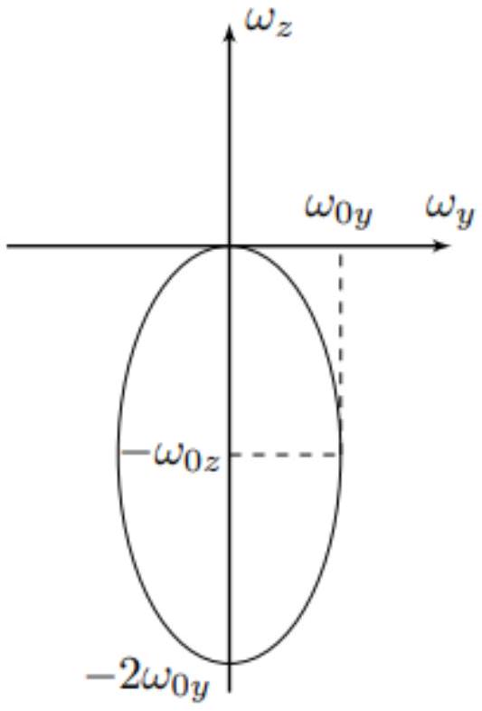
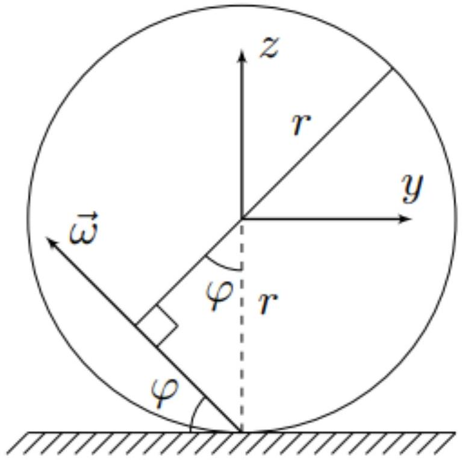
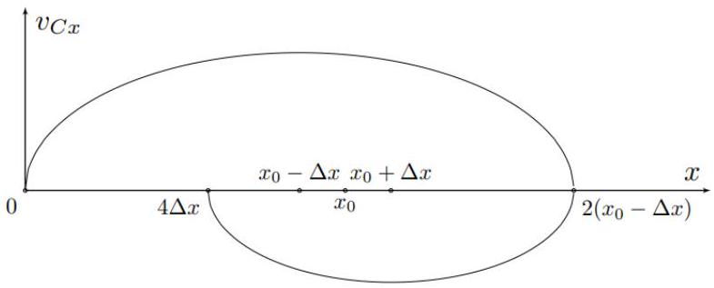
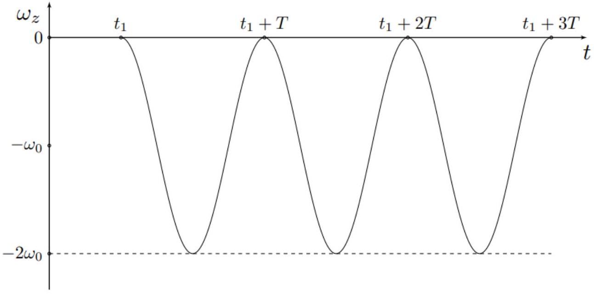
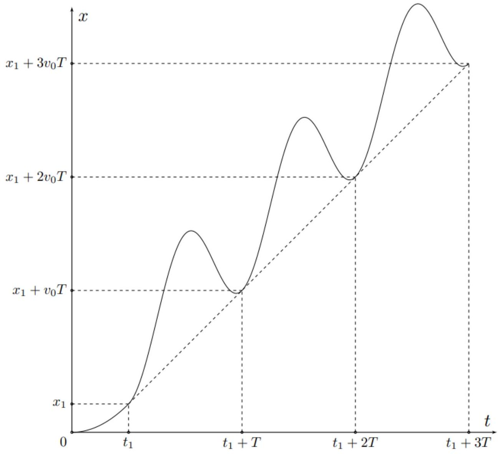

Первое решение: За время оборота $T = 2 \pi / \Omega$ каждый элементарный заряд проходит через точку кольца, откуда:

$$
i = \frac { Q } { T }
$$

Второе решение: Также результат может быть получен с помощью выражения:

$$
i = \lambda v
$$

где $v = \Omega R$ - скорость элементов кольца. Оба выражения приводят к ответу:

Ответ:

$$
i = \frac { \Omega Q } { 2 \pi }
$$

A2 ${ } ^ { 1.00 }$ Определите магнитный момент шара $\vec { m }$. Ответ выразите через $\vec { \omega } , q$ и $r$.

Первое решение: Магнитный момент системы определяется соотношением:

$$
\vec { m } = \int \frac { [ \vec { r } \times \vec { v } ] d q } { 2 }
$$

где $d q$ - элементарный заряд, а $\vec { r }$ и $\vec { v }$ - его радиус-вектор и скорость соответственно.
Заметим, что момент импульса механической системы определяется соотношением:

$$
\vec { L } = \int [ \vec { r } \times \vec { v } ] d M
$$

где $d M$ - элементарная масса, а $\vec { r }$ и $\vec { v }$ - её радиус-вектор и скорость соответственно.
Если распределения заряда и массы подобны, то мы приходим к следующему соотношению:

$$
\vec { m } = \frac { \vec { L } q } { 2 M } = \frac { I q \vec { \omega } } { 2 M }
$$

где $I = 2 M r ^ { 2 } / 5$ - момент инерции однородного шара относительно диаметра.
Второе решение: рассмотрим диск радиусом $R$ и толщиной $h$ с плотностью заряда $\rho$ и вращающийся с угловой скоростью $\vec { \omega }$ вокруг своей оси вращения. Выделим кольцо радиусом $r$ толщиной $d r$. Тогда для магнитного момента кольца получим:

$$
d \vec { m } _ { \text {д } } = \vec { n } S \cdot \frac { \omega d Q } { 2 \pi }
$$

где $S = \pi r ^ { 2 }$ - площадь кольца. Преобразуем:

$$
d \vec { m } _ { Д } = \vec { \omega } \cdot \frac { 2 \pi r ^ { 3 } d r h \rho } { 2 } \Rightarrow \vec { m } _ { Д } = \frac { \pi R ^ { 4 } h \rho \vec { \omega } } { 2 }
$$

Перейдём к шару. Будем характеризовать $h$ и $R$ углом $\theta$ с осью симметрии шара. Тогда:

$$
R = r \sin \theta \quad h = - r \cos \theta
$$

Тогда для элемента магнитного момента шара имеем:

$$
d \vec { m } = \frac { \pi r ^ { 5 } \rho \vec { \omega } } { 4 } \sin ^ { 5 } \theta d \theta \Rightarrow \vec { m } = \frac { \pi r ^ { 5 } \rho \vec { \omega } } { 4 } \int _ { 0 } ^ { \pi } \sin ^ { 5 } \theta d \theta = \frac { \pi r ^ { 5 } \rho \vec { \omega } } { 4 } \int _ { - 1 } ^ { 1 } \left( 1 - 2 t ^ { 2 } + t ^ { 4 } \right) d t = \frac { 4 \pi r ^ { 5 } \rho \vec { \omega } } { 15 }
$$

Для ответа на вопрос осталось подставить $\rho = 3 q / 4 \pi r ^ { 3 }$.
Третье решение: рассмотрим тонкостенную сферическую оболочку радиусом $R$ толщиной $d R$, вращающуюся с угловой скоростью $\vec { \omega }$. Выделим кольцо, ограниченной углами $\theta$ и $\theta + d \theta$ сферической системы координат. Магнитный момент выделенного кольца равен:

$$
d \vec { m } _ { \mathrm { c } \phi } = \frac { d Q \vec { \omega } } { 2 \pi } \cdot \pi R ^ { 2 } \sin ^ { 2 } \theta = \vec { \omega } \cdot \frac { 2 \pi \rho R ^ { 2 } d R \sin \theta d \theta } { 2 \pi } \cdot \pi R ^ { 2 } \sin ^ { 2 } \theta = \pi \rho R ^ { 4 } d R \vec { \omega } \cdot \sin ^ { 3 } \theta d \theta
$$

Проинтегрируем полученное выражение:

$$
\vec { m } _ { c \phi } = \pi \rho R ^ { 4 } d R \vec { \omega } \int _ { 0 } ^ { \pi } \sin ^ { 3 } \theta d \theta = \pi \rho R ^ { 4 } d R \vec { \omega } \int _ { - 1 } ^ { 1 } \left( 1 - t ^ { 2 } \right) d t = \frac { 4 \pi \rho R ^ { 4 } d R \vec { \omega } } { 3 }
$$

Магнитный момент шара получается интегрированием магнитного момента по сферам:

$$
\vec { m } = \frac { 4 \pi \rho \vec { \omega } } { 3 } \int _ { 0 } ^ { r } R ^ { 4 } d R = \frac { 4 \pi \rho r ^ { 5 } \vec { \omega } } { 15 }
$$

Для ответа на вопрос осталось подставить $\rho = 3 q / 4 \pi r ^ { 3 }$.
Окончательно:

Ответ:

$$
\vec { m } = \frac { q r ^ { 2 } \vec { \omega } } { 5 }
$$

А3 ${ } ^ { 0.20 }$ Найдите момент сил $\vec { M }$, действующих на шар, относительно его центра. Ответ выразите через $\vec { \omega } , \vec { B } , q$ и $r$.

Момент сил $\vec { M }$, действующих на виток с током в однородном магнитном поле, равен:

$$
\vec { M } = [ \vec { m } \times \vec { B } ]
$$

откуда:

Ответ:

$$
\vec { M } = \frac { q r ^ { 2 } [ \vec { \omega } \times \vec { B } ] } { 5 }
$$

В1 ${ } ^ { 0.50 }$ Запишите условие отсутствия проскальзывания шара по плоскости через $\vec { v } _ { C } , \vec { \omega }$ и $\vec { r }$. Используя полученное выражение, выразите компоненты угловой скорости $\omega _ { x }$ и $\omega _ { y }$ через $v _ { C x } , v _ { C y }$ и $r$.
Дифференцируя по времени условие отсутствия проскальзывания, выразите $\vec { a } _ { C }$ через $\dot { \vec { \omega } }$ и $\vec { r }$.

Если твердое тело вращается с угловой скоростью $\vec { \omega }$, а скорость точки $A$ равна $\vec { v } _ { A }$, то скорость точки $B$ задаётся выражением:

$$
\vec { v } _ { B } = \vec { v } _ { A } + [ \vec { \omega } \times \overrightarrow { A B } ]
$$

Отсюда получим условие отсутствия проскальзывания:

Ответ:

$$
\vec { v } _ { C } + [ \vec { \omega } \times \vec { r } ] = 0
$$

Спроецируем полученное уравнение на оси $x$ и $y$ :

$$
v _ { C x } - \omega _ { y } r = 0 \quad v _ { C y } + \omega _ { x } r = 0
$$

Отсюда:

Ответ:

$$
\omega _ { x } = - \frac { v _ { C y } } { r } \quad \omega _ { y } = \frac { v _ { C x } } { r }
$$

Вектор $\vec { r }$ остаётся постоянным, поскольку шар движется по плоскости. Тогда дифференцируя, получим:

Ответ:

$$
\vec { a } _ { C } = - [ \dot { \vec { \omega } } \times \vec { r } ]
$$

В2 ${ } ^ { 0.20 }$ Используя уравнение динамики вращательного движения относительно центра масс, выразите угловое ускорение шара $\dot { \vec { \omega } }$ через $q , m , r , \vec { \omega } , \vec { r } , \vec { B }$ и $\vec { F }$.

Запишем уравнение динамики вращательного движения относительно центра масс:

$$
\frac { d \vec { L } _ { C } } { d t } = \vec { M } _ { C }
$$

Для момента сил относительно центра масс имеем:

$$
\vec { M } _ { C } = [ \vec { r } \times \vec { F } ] + \frac { q R ^ { 2 } [ \vec { \omega } \times \vec { B } ] } { 5 }
$$

а для производной момента импульса по времени имеем:

$$
\frac { d \vec { L } _ { C } } { d t } = I \dot { \vec { \omega } }
$$

откуда:

Ответ:

$$
\dot { \vec { \omega } } = \frac { 5 [ \vec { r } \times \vec { F } ] } { 2 m r ^ { 2 } } + \frac { q [ \vec { \omega } \times \vec { B } ] } { 2 m }
$$

Вз ${ } ^ { 0.20 }$ Выразите силу трения $\vec { F }$ через $m , q , \vec { B } , \vec { \omega } , \vec { r }$ и $\vec { a } _ { C }$.
Примечание: Воспользуйтесь свойством двойного векторного произведения:

$$
[ \vec { a } \times [ \vec { b } \times \vec { c } ] ] = \vec { b } ( \vec { a } \cdot \vec { c } ) - \vec { c } ( \vec { a } \cdot \vec { b } )
$$

Рассмотрим векторное произведение с $\vec { r }$ слагаемых в уравнении, полученном в пункте B 3 :

$$
I [ \vec { r } \times \dot { \vec { \omega } } ] = [ \vec { r } \times [ \vec { r } \times \vec { F } ] ] + \frac { q r ^ { 2 } [ \vec { r } \times [ \vec { \omega } \times \vec { B } ] ] } { 5 }
$$

Учитывая, что $\vec { a } _ { C } = [ \vec { r } \times \dot { \vec { \omega } } ]$, и используя свойство двойного векторного произведения с учётом $\vec { r } \perp \vec { F } , \vec { r } \perp \vec { B }$, получим:

$$
I \vec { a } _ { C } = - r ^ { 2 } \vec { F } - \frac { q r ^ { 2 } \vec { B } ( \vec { r } \cdot \vec { \omega } ) } { 5 }
$$

откуда:

Ответ:

$$
\vec { F } = - \frac { 2 m \vec { a } _ { C } } { 5 } - \frac { q \vec { B } ( \vec { r } \cdot \vec { \omega } ) } { 5 }
$$

В4 ${ } ^ { 0.80 }$ Найдите компоненту угловой скорости шара $\omega _ { z }$ в точке с координатой $x _ { C }$ его центра. Ответ выразите через $q , m , B , r$ и $x _ { C }$.

Поскольку векторы $\vec { r }$ и $\vec { e } _ { z }$ коллинеарные, уравнение динамики вращательного движения в проекции на ось $z$ записывается следующим образом:

$$
I \dot { \omega } _ { z } = \frac { q r ^ { 2 } [ \vec { \omega } \times \vec { B } ] _ { z } } { 5 } = - \frac { q r ^ { 2 } B \omega _ { y } } { 5 } \Rightarrow \dot { \omega } _ { z } = - \frac { q B \omega _ { y } } { 2 m }
$$

С другой стороны, $\omega _ { y } r = v _ { x }$, откуда:

$$
\dot { \omega } _ { z } = - \frac { q B v _ { x } } { 2 m r }
$$

и окончательно:

Ответ:

$$
\omega _ { z } = - \frac { q B x _ { C } } { 2 m r }
$$

В5 ${ } ^ { 0.40 }$ Докажите, что траектория центра шара является прямолинейной.

Запишем теорему о движении центра масс:

$$
m \vec { a } _ { C } = m \vec { g } + \vec { N } + \vec { F } + q \left[ \vec { v } _ { C } \times \vec { B } \right]
$$

Подставляя выражение для $\vec { F }$, полученное в пункте В3, получим:

$$
m \vec { a } _ { C } = m \vec { g } + \vec { N } + q \left[ \vec { v } _ { C } \times \vec { B } \right] - \frac { 2 m \vec { a } _ { C } } { 5 } - \frac { q \vec { B } ( \vec { r } \cdot \vec { \omega } ) } { 5 }
$$

откуда:

$$
\vec { a } _ { C } = \frac { 5 \vec { g } } { 7 } + \frac { 5 \vec { N } } { 7 m } + \frac { 5 q \left[ \vec { v } _ { C } \times \vec { B } \right] } { 7 m } - \frac { q \vec { B } ( \vec { r } \cdot \vec { \omega } ) } { 7 m }
$$

Обратим внимание, что все силы лежат в плоскости $x z$, значит, движение является одномерным, поскольку изначально шар был неподвижен

В6 ${ } ^ { 0.50 }$ Найдите проекцию ускорения центра $a _ { C x }$ шара на ось $x$ в зависимости от положения его центра $x _ { C }$.

Проецируя ускорение центра шара на ось $x$ :

$$
a _ { C x } = \frac { 5 g \sin \alpha } { 7 } + \frac { q B r \omega _ { z } } { 7 m }
$$

Подставляя выражение для $\omega _ { z }$, получим:

Ответ:

$$
a _ { C x } = \frac { 5 g \sin \alpha } { 7 } - \frac { q ^ { 2 } B ^ { 2 } x } { 14 m ^ { 2 } }
$$

В7 ${ } ^ { 0.70 }$ Определите зависимость координаты $x _ { C }$ центра шара от времени $t$. Ответ выразите через $g , \alpha , q , m , B$ и $t$.

Вводя переменную $x ^ { \prime } = x - 10 g \sin \alpha \left( \frac { m } { q B } \right) ^ { 2 }$, получим:

$$
\ddot { x } ^ { \prime } = - \left( \frac { q B } { m } \right) ^ { 2 } \frac { x ^ { \prime } } { 14 }
$$

Это уравнение гармонических колебаний с циклической частотой $\omega _ { 0 } = q B / m \sqrt { 14 }$.
Тогда общее решение для $x ( t )$ :

$$
x ( t ) = 10 g \sin \alpha \left( \frac { m } { q B } \right) ^ { 2 } + A \cos \left( \omega _ { 0 } t + \varphi _ { 0 } \right)
$$

Учтём начальные условия:

$$
\left\{ \begin{array} { l }
{ x ( 0 ) = 0 } \\
{ \dot { x } ( 0 ) = 0 }
\end{array} \Rightarrow \left\{ \begin{array} { l }
\varphi _ { 0 } = \pi \\
A = 10 g \sin \alpha \left( \frac { m } { q B } \right) ^ { 2 }
\end{array} \right. \right.
$$

Для для $x ( t )$ имеем:

Ответ:

$$
x ( t ) = 10 g \sin \alpha \left( \frac { m } { q B } \right) ^ { 2 } \left( 1 - \cos \left( \frac { q B t } { m \sqrt { 14 } } \right) \right)
$$

В8 ${ } ^ { 0.50 }$ Опишите эволюцию угловой скорости шара $\vec { \omega }$. В качестве ответ укажите годограф вектора угловой скорости (в системе координат $x y z$ ), т.е кривой, описывающей положения конца вектора при его фиксированном начале. Укажите на рисунке все характерные значения. Выразите их через $m , g , q , B , \alpha$ и $r$.

Вектор угловой скорости шара всегда лежит в плоскости $y z$.
Для $\omega _ { z }$ имеем:

$$
\omega _ { z } ( t ) = - \frac { q B x ( t ) } { 2 m r } = - \frac { 5 m g \sin \alpha } { q B r } \left( 1 - \cos \left( \frac { q B t } { m \sqrt { 14 } } \right) \right)
$$

Для $\omega _ { y }$ имеем:

$$
\omega _ { y } ( t ) = \frac { v _ { C x } ( t ) } { r } = \frac { 5 m g \sin \alpha } { q B r } \sqrt { \frac { 2 } { 7 } } \sin \left( \frac { q B t } { m \sqrt { 14 } } \right)
$$

Отсюда:

$$
\sin ^ { 2 } \left( \frac { q B t } { m \sqrt { 14 } } \right) + \cos ^ { 2 } \left( \frac { q B t } { m \sqrt { 14 } } \right) = \left( \frac { \omega _ { y } } { \frac { 5 m g \sin \alpha } { q B r } \sqrt { \frac { 2 } { 7 } } } \right) ^ { 2 } + \left( 1 + \frac { \omega _ { z } } { \frac { 5 m g \sin \alpha } { q B r } } \right) ^ { 2 } = 1
$$

Из полученных соотношений видно, что годограф вектора угловой скорости является эллипсом с полуосями $\omega _ { 0 z }$ и $\omega _ { 0 y }$, равными:

$$
\omega _ { 0 z } = \frac { 5 m g \sin \alpha } { q B r } \quad \omega _ { 0 y } = \frac { 5 m g \sin \alpha } { q B r } \sqrt { \frac { 2 } { 7 } }
$$

Ответ:

В9 ${ } ^ { 0.60 }$ Найдите максимальную скорость $v _ { \max }$ среди всех элементов шара в момент, когда скорость центра достигает своего максимума. Ответ выразите через $m , g , q , B$ и $\alpha$.

Пусть $\omega$ - модуль угловой скорости, образующей угол $\varphi$ с плоскостью. Максимальной является скорость той точки, расстояние которой до мгновенной оси вращения шара максимально. Далее имеет смысл рассматривать только сечение, лежащее в плоскости $y z$. Из рисунка видно, что максимальная скорость элемента шара достигается на перпендикуляре к мгновенной оси вращения, проходящем через центр, и равна:

$$
v _ { \max } = \omega r ( 1 + \cos \varphi )
$$

Для компонент угловой скорости имеем:

$$
\omega _ { y } = \omega \cos \varphi \quad \omega _ { z } = - \omega \sin \varphi
$$

Из уравнения эллипса получим:

$$
\frac { \omega ^ { 2 } \cos ^ { 2 } \varphi } { \omega _ { 0 y } ^ { 2 } } + \frac { \left( \omega _ { 0 z } - \omega \sin \varphi \right) ^ { 2 } } { \omega _ { 0 z } ^ { 2 } } = 1 \Rightarrow \omega = \frac { 2 \omega _ { 0 z } \sin \varphi } { \sin ^ { 2 } \varphi + \frac { \omega _ { 0 z } ^ { 2 } \cos ^ { 2 } \varphi } { \omega _ { 0 y } ^ { 2 } } }
$$

Отсюда для максимальной скорости имеем:

$$
v _ { \max } = \frac { 2 \omega _ { 0 z } r \sin \varphi ( 1 + \cos \varphi ) } { \sin ^ { 2 } \varphi + \frac { \omega _ { 0 z } ^ { 2 } \cos ^ { 2 } \varphi } { \omega _ { 0 y } ^ { 2 } } } = \frac { 2 \omega _ { 0 z } r \tan \varphi \left( 1 + \sqrt { 1 + \tan ^ { 2 } \varphi } \right) } { \tan ^ { 2 } \varphi + \frac { \omega _ { 0 z } ^ { 2 } } { \omega _ { 0 y } ^ { 2 } } }
$$

В рассматриваемый момент $\tan \varphi = \omega _ { 0 z } / \omega _ { 0 y }$, поэтому:

$$
v _ { \max } = \omega _ { 0 y } r \left( 1 + \sqrt { 1 + \frac { \omega _ { 0 z } ^ { 2 } } { \omega _ { 0 y } ^ { 2 } } } \right)
$$

Подставляя $\omega _ { 0 y }$ и $\omega _ { 0 z }$, находим:

Ответ:

$$
v _ { \max } = \frac { 5 m g \sin \alpha ( 3 + \sqrt { 2 } ) } { q B \sqrt { 7 } }
$$

В10 ${ } ^ { 0.60 }$ При каком минимальном коэффициенте трения $\mu _ { \min }$ шара о плоскость возможно движение без проскальзывания? Ответ выразите через $g , \alpha , q , m$ и $B$.

Мы показали, что движение является одномерным, а значит сила Лоренца в любой момент равна нулю. Тогда сила нормальной реакции плоскости $N$ в любой момент равна

$$
N = m g \cos \alpha
$$

Определим силу трения $F _ { x }$ из теоремы о движении центра масс:

$$
F _ { x } = m a _ { C x } - m g \sin \alpha = m g \sin \alpha \left( \frac { 5 } { 7 } \cos \left( \frac { q B t } { m \sqrt { 14 } } \right) - 1 \right) \geq - \frac { 12 m g \sin \alpha } { 7 }
$$

откуда сила трения $F _ { x }$ всегда находится в следующем диапазоне:

$$
- \frac { 2 m g \sin \alpha } { 7 } \geq F _ { x } \geq - \frac { 12 m g \sin \alpha } { 7 }
$$

Минимально возможный коэффициент трения определяется выражением:

$$
\mu _ { \min } = \frac { \left| F _ { x } \right| _ { \max } } { N }
$$

откуда:

Ответ:

$$
\mu _ { \min } = \frac { 12 \tan \alpha } { 7 }
$$

С1 ${ } ^ { 0.80 }$ Определите расстояние $S _ { i , i + 1 }$ между положениями центра шара в моменты $i$-й и $( i + 1 )$-й остановок. Ответ выразите через $i , g , k , \alpha , q , m$ и $B$.

Поскольку при качении происходит лишь перераспределение силы нормальной реакции - уравнение динамики вращательного движения относительно центра масс остаётся верным, а в теорему о движении центра масс должно быть изменено:

$$
m \vec { a } _ { C } = m \vec { g } + \vec { N } + \vec { F } + q \left[ \vec { v } _ { C } \times \vec { B } \right] + \vec { F } _ { \text {кач } }
$$

где

$$
\vec { F } _ { \text {кач } } = \mp \vec { e } _ { x } \cdot \frac { N k } { r }
$$

где знак - соответствует движению центра шара вдоль оси $x$, а знак + - движению в противоположную сторону.
Тогда уравнение движения в проекции на ось $x$ :

$$
a _ { C x } = \frac { 5 g \sin \alpha } { 7 } \mp \frac { 5 k g \cos \alpha } { r } - \frac { q ^ { 2 } B ^ { 2 } x } { 14 m ^ { 2 } }
$$

Фазовая диаграмма каждой половины колебаний представляет собой эллипс, смещённый от положения $x _ { 0 }$ на величину $\pm \Delta x$, где:

$$
\begin{gathered}
x _ { 0 } = 10 g \sin \alpha \left( \frac { m } { q B } \right) ^ { 2 } \\
\Delta x = 10 g \sin \alpha \left( \frac { m } { q B } \right) ^ { 2 } \frac { k } { r \tan \alpha }
\end{gathered}
$$

Из фазовой диаграммы видно, что если $a _ { i }$ - амплитуда половины колебания с номером $i$, то амплитуда половины колебания $a _ { i + 1 }$ с номером $i + 1$ определяется выражением:

$$
a _ { i + 1 } = a _ { i } - 2 \Delta x
$$

Учитывая выражение для $a _ { 1 }$ :

$$
a _ { 1 } = x _ { 0 } - \Delta x
$$

имеем:

$$
a _ { i + 1 } = x _ { 0 } - ( 1 + 2 i ) \Delta x
$$

Тогда для $S _ { i , i + 1 }$ имеем:

$$
S _ { i , i + 1 } = 2 a _ { i + 1 }
$$

или же:

Ответ:

$$
S _ { i , i + 1 } = 2 \cdot 10 g \sin \alpha \left( \frac { m } { q B } \right) ^ { 2 } \left( 1 - \frac { k ( 1 + 2 i ) } { r \tan \alpha } \right)
$$

С2 ${ } ^ { 0.20 }$ Определите диапазон возможных положений $x _ { C \mathrm {~K} }$ последней остановки центра шара. Ответ выразите через $g , k , \alpha , q , m$ и $B$.

Качение прекращается, если в точке остановки

$$
\left| F _ { \text {кач } } \right| \leq k m g \cos \alpha / r
$$

Этому соответствуют следующие координаты $x$ :

Ответ:

$$
x \in \left[ 10 g \sin \alpha \left( \frac { m } { q B } \right) ^ { 2 } \left( 1 - \frac { k } { r \tan \alpha } \right) ; 10 g \sin \alpha \left( \frac { m } { q B } \right) ^ { 2 } \left( 1 + \frac { k } { r \tan \alpha } \right) \right]
$$

C3 ${ } ^ { 0.50 }$ Найдите время $\tau$ движения шара. Ответ выразите через $g , k , \alpha , q , m$ и $B$.

Колебания происходят до тех пор, пока очередная точка остановки не окажется в диапазоне $x _ { \text {ост } } \in [ - \Delta x ; \Delta x ]$, что приводит к выражению для количества $N$ колебаний:

$$
N = \left[ \frac { a _ { 1 } } { 2 \Delta x } \right] + 1
$$

Поскольку $\tan \alpha \gg k / r$, с хорошей точностью верно:

$$
N = \frac { r \tan \alpha } { 2 k }
$$

Для времени движение имеем:

$$
t = \frac { \pi N } { \omega _ { 0 } }
$$

или же:

Ответ:

$$
t = \frac { \pi m r \tan \alpha } { k q B } \sqrt { \frac { 7 } { 2 } }
$$

C4 ${ } ^ { 1.00 }$ Какое количество теплоты $Q$ выделилось при движении шара? Ответ выразите через $g , k , \alpha , q , m$ и $B$.

Первое решение: Воспользуемся законом сохранения энергии:

$$
Q = - \Delta W _ { p } - E _ { k }
$$

где $\Delta W _ { p }$ - изменение потенциальной энергии системы, а $E _ { k }$ - её кинетическая энергия.
Для $\Delta W _ { p }$ имеем:

$$
\Delta W _ { p } = - m g \sin \alpha x _ { 0 } = - 10 m g ^ { 2 } \sin ^ { 2 } \alpha \left( \frac { m } { q B } \right) ^ { 2 }
$$

Для нахождения кинетической энергии определим конечную угловую скорость верчения шара:

$$
E _ { k } = \frac { I \omega _ { z } ^ { 2 } } { 2 } = \frac { I q ^ { 2 } B ^ { 2 } x _ { 0 } ^ { 2 } } { 8 m ^ { 2 } r ^ { 2 } } = \frac { q ^ { 2 } B ^ { 2 } } { 20 m } \cdot 100 g ^ { 2 } \sin ^ { 2 } \alpha \left( \frac { m } { q B } \right) ^ { 4 } = 5 m g ^ { 2 } \sin ^ { 2 } \alpha \left( \frac { m } { q B } \right) ^ { 2 }
$$

Первое решение: явно посчитаем работу силы трения качения. Для неё имеем:

$$
A _ { i } = - \frac { k N } { r } \cdot 2 A _ { i } = - \frac { 2 k m g \cos \alpha } { r } \cdot a _ { i }
$$

После подстановки $a _ { i }$ получим выражение для работы:

$$
A = - \frac { 20 m g ^ { 2 } \sin \alpha \cos \alpha k } { r } \left( \frac { m } { q B } \right) ^ { 2 } \sum _ { i = 1 } ^ { N } \left( 1 + \frac { k } { r \tan \alpha } - \frac { 2 i k } { r \tan \alpha } \right)
$$

Суммируя, получим:

$$
A = - \frac { 20 m g ^ { 2 } \sin \alpha \cos \alpha k } { r } \left( \frac { m } { q B } \right) ^ { 2 } \left( \left( 1 + \frac { k } { r \tan \alpha } \right) N - \frac { N ( N + 1 ) k } { r \tan \alpha } \right)
$$

Подставляя $N$ и учитывая малость, получим:

$$
A = - \frac { 20 m g ^ { 2 } \sin \alpha \cos \alpha k } { r } \left( \frac { m } { q B } \right) ^ { 2 } \left( \frac { r \tan \alpha } { 2 k } - \frac { r \tan \alpha } { 4 k } \right) = - 5 m g ^ { 2 } \sin ^ { 2 } \alpha \left( \frac { m } { q B } \right) ^ { 2 }
$$

Количество теплоты $Q = - A$, откуда:

Ответ:

$$
Q = 5 m g ^ { 2 } \sin ^ { 2 } \alpha \left( \frac { m } { q B } \right) ^ { 2 }
$$

D1 ${ } ^ { 0.40 }$ Определите модуль момента силы трения верчения $M ^ { \prime }$. Ответ выразите через $\mu , m , g , \alpha$ и $r _ { 0 }$.

Сила реакции $N$ равномерно распределена по площади круга радиусом $r _ { 0 }$, поэтому:

$$
\frac { d N } { d S } = \frac { m g \cos \alpha } { \pi r _ { 0 } ^ { 2 } }
$$

Тогда для момента силы трения имеем:

$$
d M ^ { \prime } = \frac { \mu d N } { d S } \cdot 2 \pi r d r \cdot r \Rightarrow M ^ { \prime } = \frac { \mu d N } { d S } \cdot \frac { 2 \pi r _ { 0 } ^ { 3 } } { 3 }
$$

откуда:

Ответ:

$$
M ^ { \prime } = \frac { 2 \mu m g r _ { 0 } \cos \alpha } { 3 }
$$

D2 ${ } ^ { 0.50 }$ В какой момент времени $t _ { 1 }$ шар начнёт вертеться? Ответ выразите через $\mu , r _ { 0 } , m , q , B , r$ и $\alpha$.

Поскольку возникающий момент трения верчения направлен вдоль оси $z$ - выражение для силы трения $\vec { F }$, и, как следствие, теорема о движении центра масс остаются верными:

$$
a _ { C x } = \frac { 5 g \sin \alpha } { 7 } + \frac { q B r \omega _ { z } } { 7 m }
$$

В уравнение динамики вращательного движения необходимо внести изменения:

$$
I \dot { \omega } _ { z } = M _ { \mathrm { тр } } - \frac { q r ^ { 2 } B \omega _ { y } } { 5 }
$$

где $M _ { \text {тр } }$ - возникающий момент силы трения верчения.
До тех пор, пока скорость центра шара не достигает значения

$$
v _ { 0 } = \frac { 2 M ^ { \prime } m r } { I q B } = \frac { 10 \mu m g r _ { 0 } \cos \alpha } { 3 q B r }
$$

шар движется равноускоренно и не вертится.
Тогда выражение для времени $t _ { 1 }$ следующее:

$$
t _ { 1 } = \frac { 7 v _ { 0 } } { 5 g \sin \alpha }
$$

или же:

Ответ:

$$
t _ { 1 } = \frac { 14 \mu m r _ { 0 } } { 3 q B r \tan \alpha }
$$

D3 ${ } ^ { 1.50 }$ Постройте качественный график $\omega _ { z } ( t )$. На графике укажите все характерные значения, особенности и асимптоты. Выразите характерные значения через $m , g , \alpha , q , B$ и $r$.

Для анализа последующего движения продифференцируем выражение для ускорения $a _ { C x }$ :

$$
\dot { a } _ { C x } = \ddot { v } _ { C x } = \frac { q B r \dot { \omega } _ { z } } { 7 m } = \frac { q B r } { 7 m } \left( \frac { M ^ { \prime } } { I } - \frac { q B v _ { x } } { 2 m r } \right)
$$

Вводя величину $v _ { 1 } = v _ { C x } - v _ { 0 }$, получим:

$$
\ddot { v } _ { 1 } = - \left( \frac { q B } { m } \right) ^ { 2 } \frac { v _ { 1 } } { 14 } \Rightarrow v _ { 1 } \left( t _ { 1 } \right) = A \sin \left( \omega _ { 0 } \tau + \varphi _ { 0 } \right)
$$

где время $\tau = t - t _ { 1 }$ - время, прошедшее от момента начала верчения. Воспользуемся начальными условиями:

$$
\left\{ \begin{array} { l }
v _ { 1 } ( 0 ) = A \sin \varphi _ { 0 } = 0 \\
\dot { v } _ { 1 } ( 0 ) = \omega _ { 0 } A \cos \varphi _ { 0 } = \frac { 5 g \sin \alpha } { 7 }
\end{array} \Rightarrow v _ { C x } ( \tau ) = v _ { 0 } + \frac { 5 g \sin \alpha \sin \omega _ { 0 } \tau } { 7 \omega _ { 0 } } \right.
$$

Подставляя в уравнение динамики вращательного движения относительно оси $z$ :

$$
\dot { \omega } _ { z } = - \frac { q B } { 2 m r } \cdot \frac { 5 g \sin \alpha \sin \omega _ { 0 } \tau } { 7 \omega _ { 0 } } \Rightarrow \omega _ { z } ( \tau ) = - \frac { q B } { 2 m r } \cdot \frac { 5 g \sin \alpha \left( 1 - \cos \omega _ { 0 } \tau \right) } { 7 \omega _ { 0 } ^ { 2 } }
$$

В исходных терминах:

$$
\omega _ { z } ( \tau ) = - \frac { 5 m g \sin \alpha } { q B r } \left( 1 - \cos \left( \frac { q B \tau } { m \sqrt { 14 } } \right) \right)
$$

Из полученного выражения видно, что шар в моменты прекращения верчения вновь повторяет его по тому же закону, поскольку и скорость центра, и угловая скорость верчения изменяются с одинаковым периодом. Это можно интерпретировать как непрерывное верчение.
Тогда график имеет вид, показанный на рисунке ниже:

Ответ:

D4 ${ } ^ { 0.60 }$ Постройте качественный график $x _ { C } ( t )$. На графике укажите все характерные значения, особенности и асимптоты. Характерные значения могут быть выражены через введённые вами переменные.

Мы уже упоминали, что до начала проскальзывания в течение времени $t _ { 1 }$ шар движется равноускоренно и успевает пройти расстояние:

$$
x _ { 1 } = \frac { 7 v _ { 0 } ^ { 2 } } { 10 g \sin \alpha } = \frac { 70 \mu ^ { 2 } m ^ { 2 } g r _ { 0 } ^ { 2 } \cos ^ { 2 } \alpha } { 9 q ^ { 2 } B ^ { 2 } r ^ { 2 } \sin \alpha }
$$

Определим зависимость $x ( \tau )$ :

$$
x ( \tau ) = x _ { 1 } + \int _ { 0 } ^ { \tau } \left( v _ { 0 } + \frac { 5 g \sin \alpha \sin \omega _ { 0 } \tau } { 7 \omega _ { 0 } } \right) d \tau = x _ { 1 } + v _ { 0 } \tau + \frac { 5 g \sin \alpha \left( 1 - \cos \omega _ { 0 } \tau \right) } { 7 \omega _ { 0 } ^ { 2 } }
$$

Изобразим это на графике:

Ответ:

