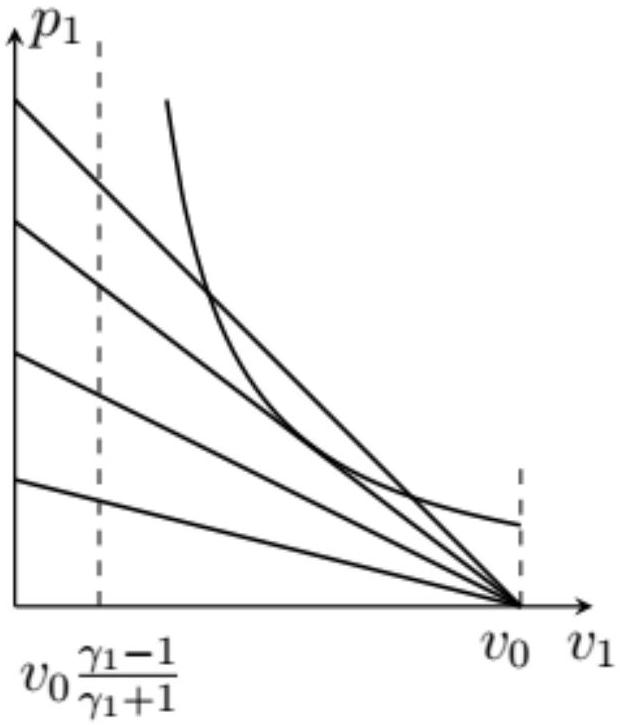
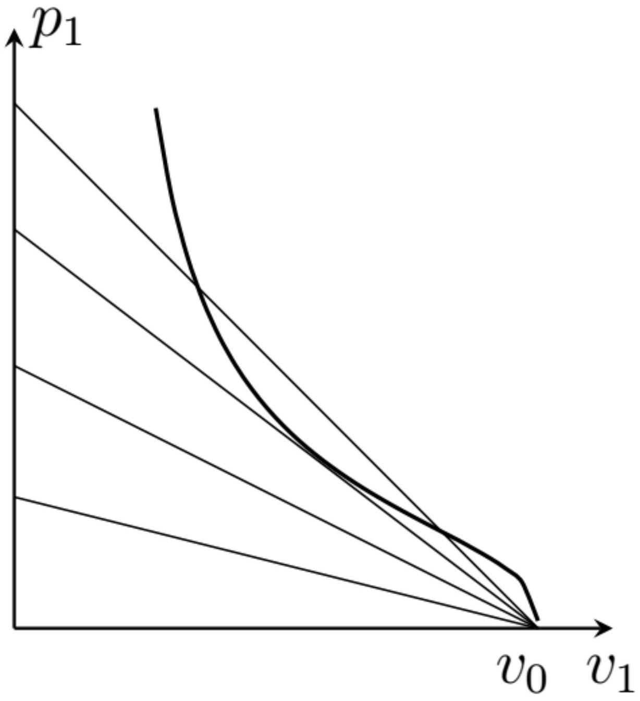

А1 ${ } ^ { 1.00 }$ Запишите систему законов сохранения массы и импульса для объема газа, переходящего через волновой фронт ударной волны. Определите из неё скорость перемещения волнового фронта $c$.

Перейдем в систему отсчета, которая движется со скоростью волнового фронта ударной волны $с$. В этой СО газ с давлением $p _ { 0 }$ и плотностью $\rho _ { 0 }$ налетает на неподвижный фронт, а после фронта движется с некоторой скоростью $u$. Во всей задаче будем пользоваться этой системой отсчета.

За время $d t$ через единицу площади потока проходит масса $\rho _ { 0 } c d t$, а выходит масса $\rho _ { 1 } u d t$, поэтому закон сохранения массы

$$
\rho _ { 0 } c = \rho _ { 1 } u .
$$

Импульс можно получить, домножив массу на соответствующую скорость. При этом импульс газа изменяется при прохождении волнового фронта за счет разности давлений на величину $\left( p _ { 0 } - p _ { 1 } \right) d t$, поэтому

$$
\left( \rho _ { 1 } u ^ { 2 } - \rho _ { 0 } c ^ { 2 } \right) d t = \left( p _ { 0 } - p _ { 1 } \right) d t ,
$$

и окончательно

$$
p _ { 0 } + \rho _ { 0 } c ^ { 2 } = p _ { 1 } + \rho _ { 1 } u ^ { 2 } .
$$

Исключим скорость $u$ с помощью закона сохранения массы:

$$
u = c \frac { \rho _ { 0 } } { \rho _ { 1 } }
$$

и получим

$$
p _ { 0 } + \rho _ { 0 } c ^ { 2 } = p _ { 1 } + \frac { \rho _ { 0 } ^ { 2 } } { \rho _ { 1 } } c ^ { 2 }
$$

откуда скорость волны

$$
c = \sqrt { \frac { p _ { 1 } - p _ { 0 } } { \rho _ { 1 } - \rho _ { 0 } } \frac { \rho _ { 1 } } { \rho _ { 0 } } } .
$$

Ответ:

$$
\rho _ { 0 } c = \rho _ { 1 } u , \quad p _ { 0 } + \rho _ { 0 } c ^ { 2 } = p _ { 1 } + \frac { \rho _ { 0 } ^ { 2 } } { \rho _ { 1 } } c ^ { 2 } , \quad c = \sqrt { \frac { p _ { 1 } - p _ { 0 } } { \rho _ { 1 } - \rho _ { 0 } } \frac { \rho _ { 1 } } { \rho _ { 0 } } } .
$$

A2 ${ } ^ { 1.00 }$ Запишите закон сохранения энергии для элемента объема газа, переходящего через волновой фронт. Получите из него дополнительное уравнение, связывающее параметры $p _ { 0 } , \rho _ { 0 } , p _ { 1 } , \rho _ { 1 }$, скорость перемещения волнового фронта $c$ и показатель адиабаты $\gamma$.

Рассмотрим массу $d m$ газа, пересекающую границу. Его кинетическая энергия изменяется на

$$
\Delta E _ { \text {К } } = \left( \frac { u ^ { 2 } } { 2 } - \frac { c ^ { 2 } } { 2 } \right) d m ,
$$

внутренняя энергия на

$$
\Delta U = C _ { V } \frac { d m } { \mu } \left( T _ { 1 } - T _ { 0 } \right) = C _ { V } \frac { d m } { R } \left( \frac { p _ { 1 } } { \rho _ { 1 } } - \frac { p _ { 0 } } { \rho _ { 0 } } \right) .
$$

Здесь $C _ { V }$ - молярная теплоемкость газа при постоянном объеме, а температура выражена через давление с помощью уравнения состояния идеального газа.
Над газом совершена работа

$$
A = p _ { 0 } \frac { d m } { \rho _ { 0 } } - p _ { 1 } \frac { d m } { \rho _ { 1 } } .
$$

Поэтому закон сохранения энергии

$$
\begin{aligned}
A & = \Delta E _ { \mathrm { K } } + \Delta U \\
p _ { 0 } \frac { d m } { \rho _ { 0 } } - p _ { 1 } \frac { d m } { \rho _ { 1 } } & = \left( \frac { u ^ { 2 } } { 2 } - \frac { c ^ { 2 } } { 2 } \right) d m + C _ { V } \frac { d m } { R } \left( \frac { p _ { 1 } } { \rho _ { 1 } } - \frac { p _ { 0 } } { \rho _ { 0 } } \right) .
\end{aligned}
$$

Сократим на массу и перенесем все слагаемые, относящиеся к газу до прохождения волнового фронта в одну сторону:

$$
\frac { p _ { 0 } } { \rho _ { 0 } } + \frac { C _ { V } } { R } \frac { p _ { 0 } } { \rho _ { 0 } } + \frac { c ^ { 2 } } { 2 } = \frac { p _ { 1 } } { \rho _ { 1 } } + \frac { C _ { V } } { R } \frac { p _ { 1 } } { \rho _ { 1 } } + \frac { u ^ { 2 } } { 2 } .
$$

Это соотношение - уравнение Бернулли, в котором внутренняя энергия газа выражена через давление и плотность.
Заметим, что

$$
\frac { C _ { V } } { R } + 1 = \frac { C _ { P } } { R } = \frac { C _ { P } } { C _ { P } - C _ { V } } = \frac { \gamma } { \gamma - 1 } ,
$$

а также подставим выражение для скорости $u$ через скорость волнового фронта $c$ и получим

Ответ:

$$
\frac { \gamma } { \gamma - 1 } \frac { p _ { 0 } } { \rho _ { 0 } } + \frac { c ^ { 2 } } { 2 } = \frac { \gamma } { \gamma - 1 } \frac { p _ { 1 } } { \rho _ { 1 } } + \frac { \rho _ { 0 } ^ { 2 } } { \rho _ { 1 } ^ { 2 } } \frac { c ^ { 2 } } { 2 }
$$

А3 ${ } ^ { 0.50 }$ Комбинируя результаты, полученные в пунктах А1 и А2, выразите отношение давлений $p _ { 1 } / p _ { 0 }$ через показатель адиабаты $\gamma$ и коэффициент уплотнения $k = \rho _ { 1 } / \rho _ { 0 }$. Это соотношение называется уравнением адиабаты для ударной волны.

Подставим в соотношение из предыдущего пункта выражение для скорости волнового фронта:

$$
\frac { \gamma } { \gamma - 1 } \left( \frac { p _ { 1 } } { \rho _ { 1 } } - \frac { p _ { 0 } } { \rho _ { 0 } } \right) = \frac { 1 } { 2 } \left( 1 - \frac { \rho _ { 0 } ^ { 2 } } { \rho _ { 1 } ^ { 2 } } \right) \frac { p _ { 1 } - p _ { 0 } } { \rho _ { 1 } - \rho _ { 0 } } \frac { \rho _ { 1 } } { \rho _ { 0 } } .
$$

Упростим правую часть

$$
\frac { \gamma } { \gamma - 1 } \left( \frac { p _ { 1 } } { \rho _ { 1 } } - \frac { p _ { 0 } } { \rho _ { 0 } } \right) = \frac { \rho _ { 1 } + \rho _ { 0 } } { 2 \rho _ { 0 } \rho _ { 1 } } \left( p _ { 1 } - p _ { 0 } \right) ,
$$

сгруппируем слагаемые с $p _ { 0 }$ и с $p _ { 1 }$ :

$$
p _ { 1 } \left( \frac { \gamma } { \gamma - 1 } \frac { 1 } { \rho _ { 1 } } - \frac { \rho _ { 1 } + \rho _ { 0 } } { 2 \rho _ { 0 } \rho _ { 1 } } \right) = p _ { 0 } \left( \frac { \gamma } { \gamma - 1 } \frac { 1 } { \rho _ { 0 } } - \frac { \rho _ { 1 } + \rho _ { 0 } } { 2 \rho _ { 0 } \rho _ { 1 } } \right) ,
$$

откуда требуемое отношение

$$
\frac { p _ { 1 } } { p _ { 0 } } = \frac { \frac { \gamma } { \gamma - 1 } \rho _ { 1 } - \frac { 1 } { 2 } \left( \rho _ { 0 } + \rho _ { 1 } \right) } { \frac { \gamma } { \gamma - 1 } \rho _ { 0 } - \frac { 1 } { 2 } \left( \rho _ { 0 } + \rho _ { 1 } \right) } = \frac { 2 \gamma k - ( \gamma - 1 ) ( 1 + k ) } { 2 \gamma - ( \gamma - 1 ) ( 1 + k ) } .
$$

Ответ:

$$
\frac { p _ { 1 } } { p _ { 0 } } = \frac { ( \gamma + 1 ) k - ( \gamma - 1 ) } { \gamma + 1 - ( \gamma - 1 ) k } .
$$

A4 ${ } ^ { 0.50 }$ Определите максимально возможное значение коэффициента уплотнения $k _ { \text {max } }$. Ответ выразите через $\gamma$. Рассчитайте ответ для идеального двухатомного газа.

Из формулы для предыдущего пункта видим, что давление $p _ { 1 }$ обращается в бесконечность при $k = \frac { \gamma + 1 } { \gamma - 1 }$. Это и есть максимальное значение $k$. Для двухатомного газа $\gamma = 7 / 5 , k _ { \text {max } } = 6$.

Ответ:

$$
k _ { \max } = \frac { \gamma + 1 } { \gamma - 1 } = 6 .
$$

В1 ${ } ^ { 0.60 }$ Запишите закон сохранения энергии для детонационной волны. Получите из него уравнение, связывающее параметры $p _ { 0 } , \rho _ { 0 } , p _ { 1 } , \rho _ { 1 }$, скорость перемещения волнового фронта $c$, удельный тепловой эффект реакции $q$, а также показатели адиабаты $\gamma _ { 0 }$ и $\gamma _ { 1 }$.

Закон сохранения энергии аналогичен пункту В3, но к работе сил давления нужно добавить выделившееся тепло qdm и учесть, что молярные теплоемкости исходного газа и продуктов реакции отличаются :

$$
p _ { 0 } \frac { d m } { \rho _ { 0 } } - p _ { 1 } \frac { d m } { \rho _ { 1 } } + q d m = \left( \frac { u ^ { 2 } } { 2 } - \frac { c ^ { 2 } } { 2 } \right) d m + C _ { V 1 } \frac { d m } { R } \frac { p _ { 1 } } { \rho _ { 1 } } - C _ { V 0 } \frac { d m } { R } \frac { p _ { 0 } } { \rho _ { 0 } } .
$$

Выразим теплоемкости газов через показатели адиабаты, скорость газа $u$ через скорость волнового фронта и перегруппируем слагаемые аналогично части А:

Ответ:

$$
\frac { \gamma _ { 0 } } { \gamma _ { 0 } - 1 } \frac { p _ { 0 } } { \rho _ { 0 } } + \frac { c ^ { 2 } } { 2 } + q = \frac { \gamma _ { 1 } } { \gamma _ { 1 } - 1 } \frac { p _ { 1 } } { \rho _ { 1 } } + \frac { c ^ { 2 } } { 2 } \frac { \rho _ { 0 } ^ { 2 } } { \rho _ { 1 } ^ { 2 } }
$$

$$
p _ { 1 } = \frac { q } { v _ { 0 } } \cdot A
$$

Определите $A$. Ответ выразите через $\gamma _ { 1 }$ и отношение $v _ { 1 } / v _ { 0 }$.
Это соотношение называется уравнением детонационной адиабаты.

В приближении сильной волны скорость волнового фронта

$$
c ^ { 2 } = \frac { p _ { 1 } } { \rho _ { 1 } - \rho _ { 0 } } \frac { \rho _ { 1 } } { \rho _ { 0 } } = p _ { 1 } \frac { v _ { 0 } ^ { 2 } } { v _ { 0 } - v _ { 1 } } .
$$

Подставим его в закон сохранения энергии, пренебрежем при этом слагаемым $\frac { p _ { 0 } } { \rho _ { 0 } }$ :

$$
q + p _ { 1 } \frac { v _ { 0 } ^ { 2 } } { 2 \left( v _ { 0 } - v _ { 1 } \right) } = \frac { \gamma _ { 1 } } { \gamma _ { 1 } - 1 } p _ { 1 } v _ { 1 } + \frac { v _ { 1 } ^ { 2 } } { v _ { 0 } ^ { 2 } } p _ { 1 } \frac { v _ { 0 } ^ { 2 } } { 2 \left( v _ { 0 } - v _ { 1 } \right) } .
$$

Отсюда

$$
\begin{aligned}
& p _ { 1 } \left( \frac { \gamma _ { 1 } } { \gamma _ { 1 } - 1 } v _ { 1 } + \frac { v _ { 1 } ^ { 2 } - v _ { 0 } ^ { 2 } } { 2 \left( v _ { 0 } - v _ { 1 } \right) } \right) = q , \\
p _ { 1 } = & \frac { q } { \frac { \gamma _ { 1 } } { \gamma _ { 1 } - 1 } v _ { 1 } - \frac { 1 } { 2 } \left( v _ { 0 } + v _ { 1 } \right) } = \frac { q } { v _ { 0 } } \frac { 2 } { \frac { \gamma _ { 1 } + 1 } { \gamma _ { 1 } - 1 } \frac { v _ { 1 } } { v _ { 0 } } - 1 }
\end{aligned}
$$

Ответ:

$$
A = \frac { 2 } { \frac { \gamma _ { 1 } + 1 } { \gamma _ { 1 } - 1 } \frac { v _ { 1 } } { v _ { 0 } } - 1 } .
$$

ВЗ ${ } ^ { \mathbf { 0 . 6 0 } }$ На одном графике качественно изобразите зависимость $p _ { 1 } \left( v _ { 1 } \right) _ { \text {дет } }$, а также зависимость $p _ { 1 } \left( v _ { 1 } \right) _ { \text {имп } }$ при различных значениях скорости перемещения волнового фронта $c$.

График зависимости $p _ { 1 } \left( v _ { 1 } \right) _ { \text {дет } }$ - гипербола, асимптота которой находится при $v _ { 1 } = v _ { 0 } \frac { \gamma _ { 1 } - 1 } { \gamma _ { 1 } + 1 }$. Зависимость давления от удельного объема, выраженная через скорость звука, имеет вид

$$
p _ { 1 } \left( v _ { 1 } \right) _ { \text {имп } } = \frac { c ^ { 2 } } { v _ { 0 } } \left( 1 - \frac { v _ { 1 } } { v _ { 0 } } \right) ,
$$

ее график - линейная функция, обращающаяся в 0 при $v _ { 1 } = v _ { 0 }$.

Ответ:

B4 ${ } ^ { 1.40 }$ Определите параметры $p _ { 1 }$ и $v _ { 1 }$ точки Чепмена-Жуге. Выразите ответ через $v _ { 0 } , \gamma _ { 1 } , q$.

Приравняем выражения для давления через скорость волны и из уравнения ударной адиабаты.

$$
\frac { c ^ { 2 } } { v _ { 0 } } \left( 1 - \frac { v _ { 1 } } { v _ { 0 } } \right) = \frac { 2 q } { v _ { 0 } } \frac { 1 } { \frac { \gamma _ { 1 } + 1 } { \gamma _ { 1 } - 1 } \frac { v _ { 1 } } { v _ { 0 } } - 1 }
$$

получим квадратное уравнение на отношение $v _ { 1 } / v _ { 0 }$ :

$$
\left( 1 - \frac { v _ { 1 } } { v _ { 0 } } \right) \left( \frac { \gamma _ { 1 } + 1 } { \gamma _ { 1 } - 1 } \frac { v _ { 1 } } { v _ { 0 } } - 1 \right) = \frac { 2 q } { c ^ { 2 } } .
$$

Это уравнение будет иметь единственное решение, если правая часть равна максимальному значению квадратичной функции в левой части. Это максимальное значение достигается при

$$
\frac { v _ { 1 } } { v _ { 0 } } = \frac { \gamma _ { 1 } } { \gamma _ { 1 } + 1 } ,
$$

соответствующее значение равно

$$
\frac { 2 q } { c ^ { 2 } } = \frac { 1 } { \gamma _ { 1 } ^ { 2 } - 1 }
$$

откуда скорость волны

$$
c = \sqrt { 2 q \left( \gamma _ { 1 } ^ { 2 } - 1 \right) }
$$

и давление

$$
p _ { 1 } = \frac { c ^ { 2 } } { v _ { 0 } } \left( 1 - \frac { v _ { 1 } } { v _ { 0 } } \right) = \frac { 2 q \left( \gamma _ { 1 } ^ { 2 } - 1 \right) } { v _ { 0 } } \frac { 1 } { \gamma _ { 1 } + 1 } = \frac { 2 q } { v _ { 0 } } \left( \gamma _ { 1 } - 1 \right) .
$$

Второе решение. Уравнение будет иметь единственное решение, если кривые зависимости $p _ { 1 } \left( v _ { 1 } \right)$ будут касаться друг друга. Приравняем выражения для давлений и их производных по $v _ { 1 }$ :

$$
\begin{aligned}
& \frac { c ^ { 2 } } { v _ { 0 } } \left( 1 - \frac { v _ { 1 } } { v _ { 0 } } \right) = \frac { 2 q } { v _ { 0 } } \frac { 1 } { \frac { \gamma _ { 1 } + 1 } { \gamma _ { 1 } - 1 } \frac { v _ { 1 } } { v _ { 0 } } - 1 } , \\
& \frac { c ^ { 2 } } { v _ { 0 } ^ { 2 } } = \frac { 2 q } { v _ { 0 } ^ { 2 } } \frac { \gamma _ { 1 } + 1 } { \gamma _ { 1 } - 1 } \frac { 1 } { \left( \frac { \gamma _ { 1 } + 1 } { \gamma _ { 1 } - 1 } \frac { v _ { 1 } } { v _ { 0 } } - 1 \right) ^ { 2 } } .
\end{aligned}
$$

Выразим скорость волны из второго уравнения и подставим в первое:

$$
\begin{gathered}
c ^ { 2 } = 2 q \frac { \gamma _ { 1 } + 1 } { \gamma _ { 1 } - 1 } \frac { 1 } { \left( \frac { \gamma _ { 1 } + 1 } { \gamma _ { 1 } - 1 } \frac { v _ { 1 } } { v _ { 0 } } - 1 \right) ^ { 2 } } , \\
\frac { \gamma _ { 1 } + 1 } { \gamma _ { 1 } - 1 } \frac { 1 - \frac { v _ { 1 } } { v _ { 0 } } } { \left( \frac { \gamma _ { 1 } + 1 } { \gamma _ { 1 } - 1 } \frac { v _ { 1 } } { v _ { 0 } } - 1 \right) ^ { 2 } } = \frac { 1 } { \frac { \gamma _ { 1 } + 1 } { \gamma _ { 1 } - 1 } \frac { v _ { 1 } } { v _ { 0 } } - 1 } ,
\end{gathered}
$$

отсюда получаем уравнение на отношение $v _ { 1 } / v _ { 0 }$ :

$$
\frac { \gamma _ { 1 } + 1 } { \gamma _ { 1 } - 1 } \left( 1 - \frac { v _ { 1 } } { v _ { 0 } } \right) = \frac { \gamma _ { 1 } + 1 } { \gamma _ { 1 } - 1 } \frac { v _ { 1 } } { v _ { 0 } } - 1 ,
$$

из которого находим

$$
v _ { 1 } = v _ { 0 } \frac { \gamma _ { 1 } } { \gamma _ { 1 } + 1 }
$$

Подставляя это значение в выражение для $c ^ { 2 }$, получаем ответы для $c$ и затем $p _ { 1 }$.

Ответ:

$$
v _ { 1 } = \frac { \gamma _ { 1 } } { \gamma _ { 1 } + 1 } v _ { 0 } , \quad p _ { 1 } = \frac { 2 q } { v _ { 0 } } \left( \gamma _ { 1 } - 1 \right) .
$$

B5 ${ } ^ { 0.20 }$ Определите скорость перемещения волнового фронта $c$. Ответ выразите через $q$ и $\gamma _ { 1 }$.

Ответ:

$$
c = \sqrt { 2 q \left( \gamma _ { 1 } ^ { 2 } - 1 \right) } .
$$

В6 ${ } ^ { 0.60 }$ Рассчитайте скорость перемещения волнового фронта при детонационной волне в смеси кислорода и водорода, если при его нагревании до высоких температур происходит следующая химическая реакция:

$$
2 \mathrm { H } _ { 2 } + \mathrm { O } _ { 2 } = \mathrm { H } _ { 2 } \mathrm { O } + \mathrm { H } ^ { + } + \mathrm { HO } ^ { - } .
$$

Реальный процесс горения водорода представляет собой совокупность реакций, в которых взаимодействуют атомы кислорода и водорода, поэтому в числе продуктов реакции нужно учитывать ионы $\mathrm { H } ^ { + }$и $\mathrm { HO } ^ { - }$(этот ион можно считать двухатомной молекулой). В смеси на 2 моля водорода приходится моль кислорода в соответствии с уравнением реакции. Для этой реакции считайте, что $q \approx 15 \mathrm { МДж } / \kappa \Gamma$ на каждый килограмм израсходованного водорода.

Продукты реакции представляют собой смесь одноатомного, двухатомного и многоатомного газов в равных пропорциях (по количеству вещества), поэтому показатель адиабаты (индексы 1,2,3 отмечают величины, относящиеся к одноатомному, двухатомному и многоатомному газу соответственно)

$$
\gamma _ { 1 } = \frac { C _ { P 1 } + C _ { P 2 } + C _ { P 3 } } { C _ { V 1 } + C _ { V 2 } + C _ { V 3 } } = \frac { 10 } { 7 } .
$$

Тогда скорость волны можно рассчитать по формуле из предыдущего пункта. При этом нужно учесть, что приведено количество тепла, приходящееся на единицу массы водорода. Согласно уравнению реакции, на 1 кг водорода приходится 8 кг кислорода, поэтому нужно использовать значение $q$ в 9 раз меньше.

Ответ:

$$
c = \sqrt { 2 q \left( \gamma _ { 1 } ^ { 2 } - 1 \right) } \approx 1.86 \cdot 10 ^ { 3 } \frac { \mathrm { M } } { \mathrm { c } } .
$$

С1 ${ } ^ { 1.20 }$ Получите уравнение светодетонационной адиабаты, аналогичное пункту В2, то есть найдите давление $p _ { 1 }$ в плазме после прохождения волнового фонта. Выразите ответ через $v _ { 0 } , v _ { 1 } , \gamma _ { 1 } , I _ { 0 }$.

Запишем закон сохранения энергии из пункта В2, заменив в нем $q = I _ { 0 } v _ { 0 } / c$, выразив скорость волны $c$ через давление и удельные объемы:

$$
I _ { 0 } v _ { 0 } \frac { \sqrt { 1 - v _ { 1 } / v _ { 0 } } } { \sqrt { p _ { 1 } v _ { 0 } } } + p _ { 1 } \frac { v _ { 0 } ^ { 2 } } { 2 \left( v _ { 0 } - v _ { 1 } \right) } = \frac { \gamma _ { 1 } } { \gamma _ { 1 } - 1 } p _ { 1 } v _ { 1 } + \frac { v _ { 1 } ^ { 2 } } { v _ { 0 } ^ { 2 } } p _ { 1 } \frac { v _ { 0 } ^ { 2 } } { 2 \left( v _ { 0 } - v _ { 1 } \right) } .
$$

Преобразуем это уравнение

$$
I _ { 0 } \frac { \sqrt { v _ { 0 } - v _ { 1 } } } { \sqrt { p _ { 1 } } } = \frac { p _ { 1 } v _ { 0 } } { 2 } \left( \frac { \gamma _ { 1 } + 1 } { \gamma _ { 1 } - 1 } \frac { v _ { 1 } } { v _ { 0 } } - 1 \right) ,
$$

откуда получим

Ответ:

$$
p _ { 1 } = \left( \frac { 2 I _ { 0 } \sqrt { v _ { 0 } - v _ { 1 } } } { \frac { \gamma _ { 1 } + 1 } { \gamma _ { 1 } - 1 } v _ { 1 } - v _ { 0 } } \right) ^ { 2 / 3 } .
$$

С2 ${ } ^ { 1.40 }$ Определите параметры ( $p _ { 1 }$ и $v _ { 1 }$ ) точки Чемпена-Жуге для светодетонационной адиабаты. Ответ выразите через $v _ { 0 } , \gamma _ { 1 } , I _ { 0 }$.

Снова запишем равенство давлений, полученных из формулы для светодетонационной адиабаты и из скорости движения волны:

$$
\left( \frac { 2 I _ { 0 } \sqrt { v _ { 0 } - v _ { 1 } } } { \frac { \gamma _ { 1 } + 1 } { \gamma _ { 1 } - 1 } v _ { 1 } - v _ { 0 } } \right) ^ { 2 / 3 } = \frac { c ^ { 2 } } { v _ { 0 } } \left( 1 - \frac { v _ { 1 } } { v _ { 0 } } \right) .
$$

Преобразуем это уравнение:

$$
\left( 1 - \frac { v _ { 1 } } { v _ { 0 } } \right) ^ { 2 / 3 } \left( \frac { \gamma _ { 1 } + 1 } { \gamma _ { 1 } - 1 } v _ { 1 } - v _ { 0 } \right) ^ { 2 / 3 } = \frac { \left( 2 I _ { 0 } v _ { 0 } \right) ^ { 2 / 3 } } { c ^ { 2 } } .
$$

Возводя уравнение в степень $3 / 2$, снова получим квадратное уравнение на $v _ { 1 } / v _ { 0 }$ :

$$
\left( 1 - \frac { v _ { 1 } } { v _ { 0 } } \right) \left( \frac { \gamma _ { 1 } + 1 } { \gamma _ { 1 } - 1 } \frac { v _ { 1 } } { v _ { 0 } } - 1 \right) = \frac { 2 I _ { 0 } v _ { 0 } } { c ^ { 3 } } .
$$

Левая часть такая же, как и в случае ударной волны, поэтому максимум достигается при

$$
v _ { 1 } = \frac { \gamma _ { 1 } } { \gamma _ { 1 } + 1 } v _ { 0 } ,
$$

а скорость волны можно найти из соотношения

$$
\frac { 2 I _ { 0 } v _ { 0 } } { c ^ { 3 } } = \frac { 1 } { \gamma _ { 1 } ^ { 2 } - 1 } , \quad c = \left( 2 I _ { 0 } v _ { 0 } \left( \gamma _ { 1 } ^ { 2 } - 1 \right) \right) ^ { 1 / 3 } .
$$

Тогда давление

$$
p _ { 1 } = \frac { \left( 2 I _ { 0 } v _ { 0 } \left( \gamma _ { 1 } ^ { 2 } - 1 \right) \right) ^ { 2 / 3 } } { v _ { 0 } } \frac { 1 } { \gamma _ { 1 } + 1 } = \left( \frac { 4 I _ { 0 } ^ { 2 } } { v _ { 0 } } \frac { \left( \gamma _ { 1 } - 1 \right) ^ { 2 } } { \gamma _ { 1 } + 1 } \right) ^ { 1 / 3 } .
$$

Для сравнения также построим на одном графике светодетонационную адиабату и зависимости $p _ { 1 } \left( v _ { 1 } \right)$ при постоянной скорости звука.

Ответ:

$$
v _ { 1 } = \frac { \gamma _ { 1 } } { \gamma _ { 1 } + 1 } v _ { 0 } , p _ { 1 } = \left( \frac { 4 I _ { 0 } ^ { 2 } } { v _ { 0 } } \frac { \left( \gamma _ { 1 } - 1 \right) ^ { 2 } } { \gamma _ { 1 } + 1 } \right) ^ { 1 / 3 }
$$

$C 3 ^ { 0.40 }$ Определите скорость перемещения волнового фронта $c$ светодетонационной волны. Выразите ответ через $\gamma _ { 1 } , I _ { 0 } , \rho _ { 0 }$. Рассчитайте ее численное значение.

Воспользуемся формулой для скорости волнового фронта из предыдущего пункта, подставим в нее значение интенсивности $I _ { 0 } = P / \pi r ^ { 2 } \sim 10 ^ { 15 }$ Вт $/ \mathrm { M } ^ { 2 }$, и значение $v _ { 0 } = 1 / \rho _ { 0 }$.

Ответ:

$$
c = \left( 2 I _ { 0 } v _ { 0 } \left( \gamma _ { 1 } ^ { 2 } - 1 \right) \right) ^ { 1 / 3 } \approx 100 \frac { \text { КМ } } { \text { с } }
$$
