--?? В любой момент времени наблюдатель в аудитории может подойти к вам и проверить, включен ли датчик Холла. Если вы при этом не проводите измерения, наблюдатель вправе поставить специальную пометку в ваших листах ответов. За каждую пометку вы получаете штраф в 1 балл. Количество пометок не ограничено.

A0 ${ } ^ { 0.20 }$ Зная, что проводимость материала трубки имеет порядок $\sigma \sim 5 \cdot 10 ^ { 7 }$ См (Сименс, единица СИ), оцените частоту $f _ { 0 }$, при которой характерная толщина скин-слоя будет равна $h \sim 1$ мм.

Ответ:

$$
f _ { 0 } = \frac { 1 } { \pi \mu _ { 0 } \sigma h ^ { 2 } } \sim 8 \text { кГц }
$$

А1 ${ } ^ { 0.50 }$ В случае большой толщины скин-слоя $\left( a h / \delta ^ { 2 } \ll 1 \right)$ получите упрощённую формулу для квадрата модуля отношения полей внутри катушки без трубки и с ней. Предложите линеаризацию, позволяющую найти проводимость материала трубки по отношению полей, если известна её толщина.

Ответ: Квадрат отношения амплитуд поля:

$$
\left[ \frac { H _ { 0 } } { H _ { 1 } } \right] ^ { 2 } = \left| \operatorname { ch } \alpha h + \frac { 1 } { 2 } \alpha a \operatorname { sh } \alpha h \right| ^ { 2 } \approx \left| 1 + \frac { 1 } { 2 } \alpha ^ { 2 } a h \right| ^ { 2 } = \left| 1 + i \pi f \sigma \mu _ { 0 } a h \right| ^ { 2 } = 1 + \pi ^ { 2 } f ^ { 2 } \sigma ^ { 2 } \mu _ { 0 } ^ { 2 } a ^ { 2 } h ^ { 2 } .
$$

Таким образом, удобная линеаризация - это $\left[ \frac { H _ { 0 } } { H _ { 1 } } \right] ^ { 2 } \left( f ^ { 2 } \right)$, её угловой коэффициент равен $k = \pi ^ { 2 } \mu _ { 0 } ^ { 2 } a ^ { 2 } h ^ { 2 } \sigma ^ { 2 }$.

А2 ${ } ^ { 0.50 }$ Предложите схему установки, позволяющую определить отношение амплитуд $H _ { 0 } / H _ { 1 }$ при известной частоте $f$ путём одновременного измерения не более двух величин с помощью осциллографа. Приведите расчётные формулы.
Примечание: В качестве ответа принимаются рисунки, схемы и формулы.

Ответ:
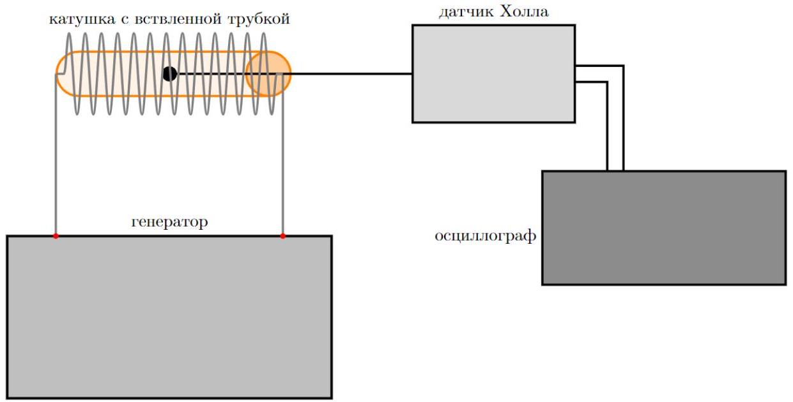

А3 ${ } ^ { 1.00 }$ Снимите экспериментальные точки зависимости $\left[ H _ { 0 } / H _ { 1 } \right] ( f )$.

Учитывая значение $f _ { 0 } \sim 5$ кГц, будем измерять отношение полей на частотах от 100 Гц до 1200 Гц. Занесём точки в таблицу:

| $f$, Гц | $U _ { 0 } , \mathrm { mB }$ | $U _ { \text {тр, } }$ мB | $\left( \frac { U _ { 0 } } { U _ { \mathrm { Tp } } } \right) ^ { 2 }$ | $f ^ { 2 }$, Гц $^ { 2 }$ | $f$, Гц | $U _ { 0 } , \mathrm { mB }$ | $U _ { \text {тр } } , \mathrm { MB }$ | $\left( \frac { U _ { 0 } } { U _ { \mathrm { Tp } } } \right) ^ { 2 }$ | $f ^ { 2 }$, Гц $^ { 2 }$ |
| :--- | :--- | :--- | :--- | :--- | :--- | :--- | :--- | :--- | :--- |
| 100 | 216 | 210 | 1,06 | 10000 | 1000 | 186 | 166 | 1,26 | 1000000 |
| 200 | 212 | 208 | 1,04 | 40000 | 1100 | 181 | 162 | 1,25 | 1210000 |
| 300 | 210 | 202 | 1,08 | 90000 | 1200 | 179 | 154 | 1,35 | 1440000 |
| 400 | 209 | 198 | 1,11 | 160000 | 1300 | 174 | 148 | 1,38 | 1690000 |
| 500 | 206 | 196 | 1,10 | 250000 | 1400 | 169 | 140 | 1,46 | 1960000 |
| 600 | 203 | 190 | 1,14 | 360000 | 1500 | 161 | 134 | 1,44 | 2250000 |

| 700 | 200 | 186 | 1,16 | 490000 | 1600 | 159 | 128 | 1,54 | 2560000 |
| :--- | :--- | :--- | :--- | :--- | :--- | :--- | :--- | :--- | :--- |
| 800 | 193 | 176 | 1,20 | 640000 | 1700 | 154 | 124 | 1,54 | 2890000 |
| 900 | 190 | 170 | 1,25 | 810000 | 1800 | 152 | 122 | 1,55 | 3240000 |
| $f$, Гц | $U _ { 0 } , \mathrm { mB }$ | $U _ { \text {тр } } , \mathrm { MB }$ | $\left( \frac { U _ { 0 } } { U _ { \mathrm { Tp } } } \right) ^ { 2 }$ | $f ^ { 2 }$, Гц $^ { 2 }$ | $f$, Гц | $U _ { 0 } , \mathrm { mB }$ | $U _ { \text {тр } } , \mathrm { MB }$ | $\left( \frac { U _ { 0 } } { U _ { \mathrm { Tp } } } \right) ^ { 2 }$ | $f ^ { 2 }$, Гц $^ { 2 }$ |
| 1900 | 148 | 118 | 1,57 | 3610000 | 3600 | 108 | 71 | 2,31 | 12960000 |
| 2000 | 146 | 112 | 1,70 | 4000000 | 3800 | 104 | 68 | 2,34 | 14440000 |
| 2200 | 140 | 106 | 1,74 | 4840000 | 4000 | 102 | 62 | 2,71 | 16000000 |
| 2400 | 136 | 98 | 1,93 | 5760000 | 4200 | 100 | 59 | 2,87 | 17640000 |
| 2600 | 128 | 92 | 1,94 | 6760000 | 4400 | 94 | 57 | 2,72 | 19360000 |
| 2800 | 124 | 84 | 2,18 | 7840000 | 4600 | 92 | 55 | 2,80 | 21160000 |
| 3000 | 120 | 81 | 2,19 | 9000000 | 5000 | 88 | 50 | 3,10 | 25000000 |
| 3200 | 116 | 76 | 2,33 | 10240000 | 5500 | 87 | 47 | 3,43 | 30250000 |
| 3400 | 112 | 73 | 2,35 | 11560000 | 6000 | 84 | 44 | 3,64 | 36000000 |

A4 ${ } ^ { 0.80 }$
Линеаризуйте зависимость и постройте график. Отсюда определите проводимость $\sigma$ исследуемого материала. Оцените графически погрешность полученного результата.

Пересчитаем точки и занесём в таблицу выше. Построим график:

Ответ:
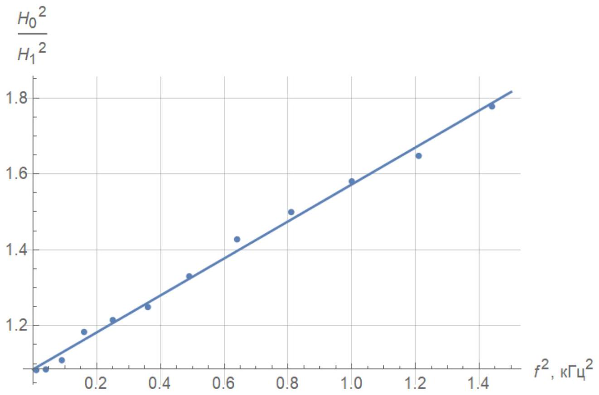
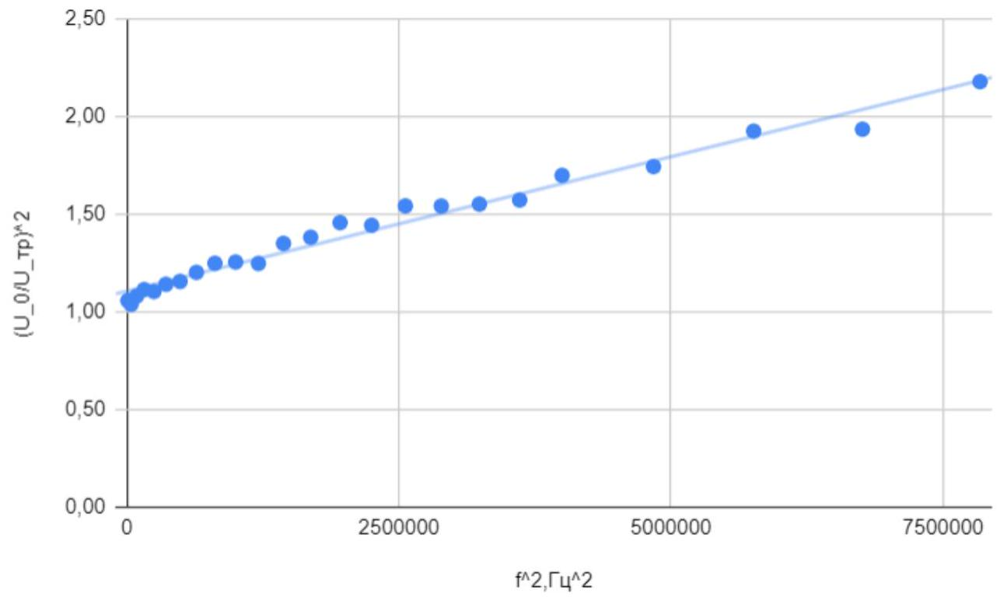

Угловой коэффициент графика $k = ( 4.87 \pm 0.6 ) \cdot 10 ^ { - 7 }$ Гц $^ { - 2 }$

Ответ:

$$
\sigma = \frac { \sqrt { k } } { \pi \mu _ { 0 } a h } = ( 44.0 \pm 2.8 ) \mathrm { MCM }
$$

А5 ${ } ^ { 1.80 }$ Найдите, при какой частоте $f _ { c r , A }$ экспериментальное значение $\left[ H _ { 0 } / H _ { 1 } \right] ^ { 2 }$ впервые окажется в 1.5 раза меньше теоретического. Найдите теоретически толщину скин-слоя $\delta _ { c r , A }$ при этой частоте. Определите отношение $\delta _ { c r , A } / h$. Оно является универсальной величиной и понадобится в части E.

В1 ${ } ^ { 0.50 }$ Упростив выражение для отношения комплексных амплитуд поля внутри и вне трубки, получите выражение для тангенса разности фаз $\operatorname { tg } \psi$ полей внутри и снаружи трубки в случае $h \ll \delta \ll a$.

Используя ранее полученную в А1 формулу $\frac { H _ { 0 } } { H _ { 1 } } = 1 + i \pi \sigma \mu _ { 0 } a h f$, получим

$$
\operatorname { tg } \psi = \frac { \operatorname { Im } \left( \frac { H _ { 0 } } { H _ { 1 } } \right) } { \operatorname { Re } \left( \frac { H _ { 0 } } { H _ { 1 } } \right) } = \pi \sigma \mu _ { 0 } a h f
$$

В2 ${ } ^ { 0.50 }$ Предложите схему установки, позволяющую определить тангенс разности фаз $\operatorname { tg } \psi$ между током в катушке и полем внутри трубки при известной частоте $f$ путём одновременного измерения не более двух величин с помощью осциллографа. Приведите расчётные формулы.
Примечание: В качестве ответа принимаются рисунки, схемы и формулы.

Подсоединим генератор к катушке, один из каналов осциллографа к датчику Холла, а второй канал - к резистору 1 Ом, встроенному в катушку. Искомую разность фаз теперь можно измерять осциллографом

В данной части есть несколько указаний к настройке оборудования:

- Нужно пользоваться усреднением показаний осциллографа в диапазоне от 16 до 128 измерений
- Нужно настроить Trigger осциллографа в режиме без усреднения так, чтобы синусоида была стабильной. В режиме с усреднением неправильная настройка триггера а) может быть незаметной, б) может привести к искажению амплитуды и фазы сигнала
- Магнитное поле Земли и иные посторонние наводки могут внести постоянную поправку к синусоидальному сигналу, снимаемому с датчика Холла. При больших частотах это становится заметным и искажает измерения сдвига фаз. Чтобы этого избежать, нужно использовать режим АС для канала осциллографа, подключенного к датчику Холла, убирающий постоянный вклад в сигнал.
- Для измерения сдвига фаз точнее всего использовать курсоры на максимальном масштабе, позволяющем видеть стабильный сигнал

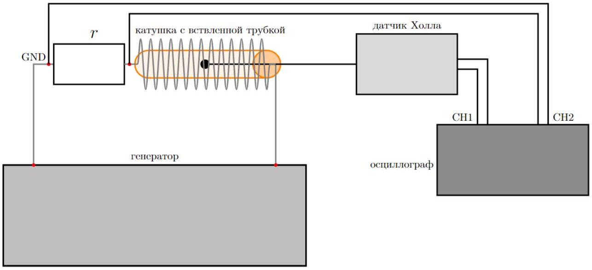

| $f$, Гц | $T _ { 1 / 2 }$, мкс | $\Delta t _ { \text {shift } }$, мкс | $\operatorname { tg } \psi$ |
| :--- | :--- | :--- | :--- |
| 400 | 2500 | 116 | 0.147 |
| 500 | 1000 | 110 | 0.360 |
| 1000 | 500 | 96.8 | 0.696 |
| 1500 | 332 | 89.6 | 1.133 |
| 1800 | 278 | 84.8 | 1.423 |
| 1900 | 264 | 82.4 | 1.493 |
| 2000 | 250 | 80 | 1.576 |

| 2200 | 228 | 76.8 | 1.777 |
| :--- | :--- | :--- | :--- |
| 2400 | 212 | 73.6 | 1.920 |
| 2600 | 192 | 70.4 | 2.246 |
| 2800 | 178 | 68 | 2.573 |
| 3000 | 166 | 64.8 | 2.788 |
| 3500 | 144 | 58.8 | 3.376 |
| 4000 | 126 | 54.8 | 4.823 |
| 4500 | 111 | 50 | 6.372 |
| 5000 | 100 | 46.4 | 8.804 |
| 6000 | 83 | 39.6 | 13.881 |
| 6500 | 77.6 | 35.6 | 7.676 |
| 7000 | 72 | 34.6 | 16.350 |
| 8000 | 62.5 | 29.4 | 10.723 |
| 9000 | 56 | 25 | 5.886 |
| 10000 | 50 | 18 | 2.125 |

В4 ${ } ^ { 0.50 }$ Постройте график этой зависимости для линейного участка. Отсюда определите проводимость материала трубки $\sigma$. Оцените графически погрешность вашего результата.
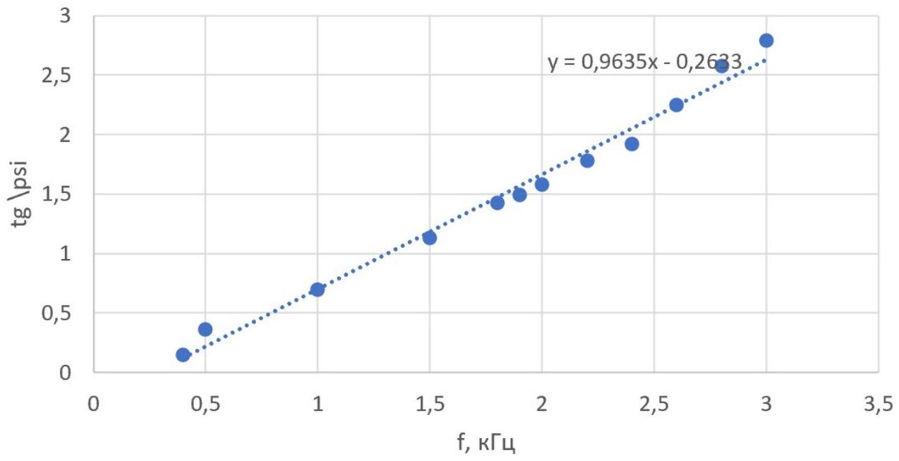
Обозначив угловой коэффициент полученного графика $k = ( 0.964 \pm 0.02 ) \cdot 10 ^ { - 3 } \frac { 1 } { \Gamma _ { \text {ц } } }$, получим $\sigma = \frac { k } { \pi \mu _ { 0 } a h }$

$$
\sigma = ( 59.2 \pm 1.2 ) \text { МСм }
$$

В5 ${ } ^ { 0.50 }$ Найдите, при какой частоте $f _ { c r , B }$ экспериментальное значение $\operatorname { tg } \psi$ впервые окажется в 2 раза больше теоретического. Найдите теоретически толщину скин-слоя $\delta _ { c r , B }$ при этой частоте. Определите отношение $\delta _ { c r } / h$. Оно является универсальной величиной и понадобится в части E.

Для убедительности построим график $\frac { \operatorname { tg } \psi } { f } ( f )$. При $f \rightarrow 0$ он стремится к константе, равной коэффициенту наклона прямой, проведенной по теоретической зависимости $\operatorname { tg } \psi ( f )$. Тогда из графика легко найти $f _ { c r } \approx 4500$ Гц
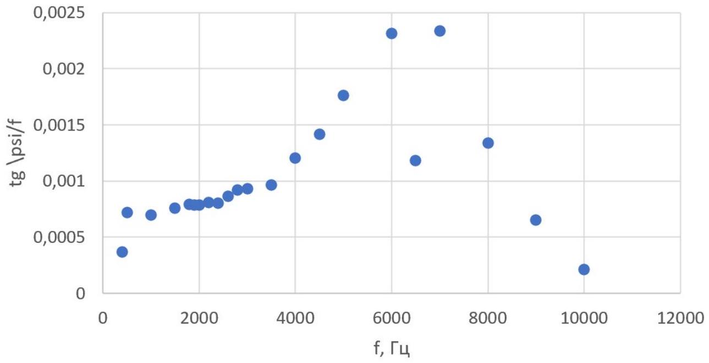

Ответ:

$$
\begin{gathered}
f _ { c r } \approx 4500 \text { Гц } \\
\delta _ { c r } = 0.98 \mathrm { ММ } \\
\frac { \delta _ { c r } } { h } \approx 1.5
\end{gathered}
$$

C1 ${ } ^ { 0.30 }$
Измерьте как можно точнее сопротивления между контактами $r _ { 12 } , r _ { 23 }$ и $r _ { 13 }$.

Учитывая сопротивление мультиметра, получим

Ответ:

$$
\begin{aligned}
r _ { 12 } & = 11.2 \mathrm { OM } \\
r _ { 23 } & = 1.1 \mathrm { OM } \\
r _ { 13 } & = 12.2 \mathrm { OM }
\end{aligned}
$$

C2 ${ } ^ { 0.50 }$
Определите сопротивление контактов $r _ { \text {к } }$, а также реальные сопротивления катушки $R$ и резистора $r$.

$$
\begin{gathered}
r _ { 12 } = R + 2 r _ { \mathrm { \kappa } } \\
r _ { 23 } = r + 2 r _ { \mathrm { \kappa } } \\
r _ { 13 } = R + r + 2 r _ { \mathrm { \kappa } }
\end{gathered}
$$

Откуда получим

Ответ:

$$
\begin{gathered}
r _ { \mathrm { K } } = \frac { r _ { 12 } + r _ { 23 } - r _ { 13 } } { 2 } = 0.05 \mathrm { OM } \\
R = 11.1 \mathrm { OM } \\
r = 1.0 \mathrm { OM }
\end{gathered}
$$

с3 ${ } ^ { 0.70 }$ Предложите схему установки, позволяющую определить индуктивность катушки $L$ при известной частоте $f$ путём одновременного измерения не более двух величин с помощью осциллографа. Приведите расчётные формулы.
Примечание: В качестве ответа принимаются рисунки, схемы и формулы.

Поместим трубку в катушку и будем снимать с помощью осциллографа зависимость напряжения $u$ на встроенном резисторе 1 Ом и суммарного напряжения $V$ на катушке+резисторе от частоты. При этом $u = I r , V = I | Z | = I \sqrt { ( R + r ) ^ { 2 } + \omega ^ { 2 } L ^ { 2 } }$, откуда

$$
\begin{gathered}
\frac { V } { u } = \sqrt { \left( 1 + \frac { R } { r } \right) ^ { 2 } + \frac { \omega ^ { 2 } L ^ { 2 } } { r ^ { 2 } } } \\
L ( f ) = \frac { r } { 2 \pi f } \sqrt { \left( \frac { V } { u } \right) ^ { 2 } - \left( 1 + \frac { R } { r } \right) ^ { 2 } }
\end{gathered}
$$

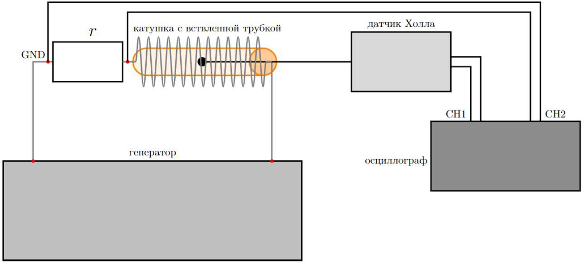

| $f$, Гц | $u , \mathrm {~B}$ | $V , \mathrm {~B}$ | $L , \mathrm { м } \Gamma \mathrm { H }$ | $\sqrt { \frac { L _ { \text {max } } - L } { L - L _ { \text {min } } } }$ |
| :--- | :--- | :--- | :--- | :--- |
| 10 | 0,318 | 3,84 | 19,99 | 0,00 |
| 50 | 0,319 | 3,92 | 8,28 | 1,83 |
| 100 | 0,317 | 4,08 | 7,36 | 2,20 |
| 200 | 0,312 | 4,48 | 6,26 | 3,03 |
| 400 | 0,306 | 5,92 | 6,03 | 3,32 |
| 600 | 0,298 | 7,44 | 5,81 | 3,70 |
| 800 | 0,284 | 8,96 | 5,80 | 3,70 |
| 1000 | 0,272 | 10,2 | 5,65 | 4,02 |
| 1200 | 0,260 | 11,4 | 5,59 | 4,18 |
| 1400 | 0,247 | 12,4 | 5,54 | 4,32 |
| 1600 | 0,234 | 13,2 | 5,48 | 4,51 |
| 1800 | 0,224 | 14,0 | 5,42 | 4,72 |
| 2000 | 0,212 | 14,6 | 5,40 | 4,82 |
| 2200 | 0,202 | 15,1 | 5,34 | 5,07 |
| 2400 | 0,194 | 15,6 | 5,27 | 5,40 |
| 2600 | 0,184 | 15,8 | 5,20 | 5,82 |
| 2800 | 0,176 | 16,2 | 5,19 | 5,95 |
| 3000 | 0,169 | 16,6 | 5,17 | 6,06 |
| 4000 | 0,139 | 17,8 | 5,07 | 7,00 |
| 5000 | 0,117 | 18,6 | 5,05 | 7,34 |
| 6000 | 0,101 | 19,0 | 4,98 | 8,43 |
| 7000 | 0,088 | 19,0 | 4,90 | 113,65 |
| 8000 | 0,080 | 19,2 | 4,77 | - |

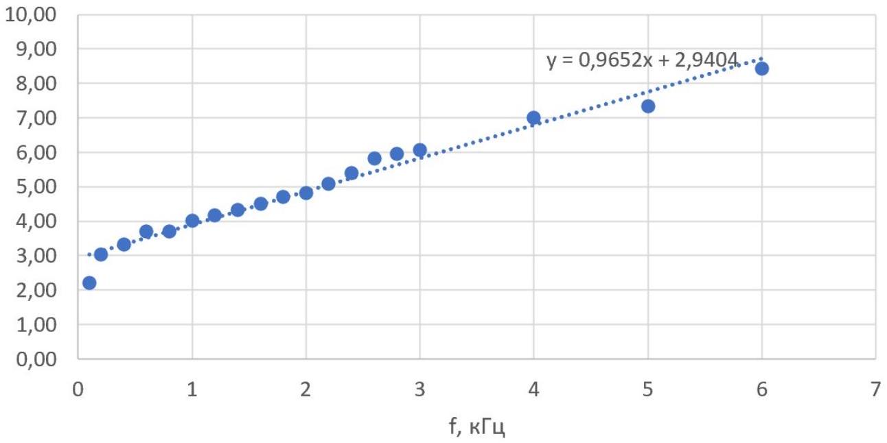
Из линеаризованного графика $\sqrt { \frac { L _ { \max } - L } { L - L _ { \min } } } ( f )$ получим угловой коэффициент $k = \pi a h \mu _ { 0 } \sigma = ( 0.965 \pm 0.03 ) \cdot 10 ^ { - 3 } \frac { 1 } { \Gamma _ { Ц } }$, откуда $\sigma = \frac { k } { \pi a h \mu _ { 0 } } = 59,2$ МСм

$$
\begin{gathered}
L _ { \min } = 4.77 \text { мГН } \\
L _ { \max } = 19.99 \mathrm { МГН } \\
\sigma = ( 59,2 \pm 1.8 ) \mathrm { МСм }
\end{gathered}
$$

Примечание: В качестве ответа принимаются рисунки, схемы и формулы.

Оценим характерные импедансы имеющихся элементов при $f \sim 10 ^ { 6 }$ Гц

$$
\begin{aligned}
& \left| Z _ { L } \right| = 2 \pi f L \approx 60 \text { Ом } \\
& \left| Z _ { C } \right| = \frac { 1 } { 2 \pi f C } \sim 1 \text { кОм }
\end{aligned}
$$

Сопротивление генератора $R _ { \text {gen } } \approx 50$ Ом, поэтому последовательное соединение его в цепь или параллельное соединение с катушкой окажет значительное влияние на импеданс системы. Подключение генератора параллельно конденсатору фактически отключит конденсатор от цепи, в силу $R _ { g e n } \ll \left| Z _ { C } \right|$. Поэтому генератор нужно подключать параллельно трубе, имеющей сопротивление, меньшее $R _ { g e n }$.

Предполагая, что осциллограф имеет паразитную ёмкость, сравнимую со средней ёмкостью выданных конденсаторов (~ 100 пФ), в пределе большой добротности (то есть маленьких сопротивлений ~ 1 0м - 10 0м) получим, что подключение осциллографа параллельно трубке не повлияет на характеристики цепи, снова в силу $R _ { \text {gen } } \ll \left| Z _ { C } \right|$.

Наконец, заметим что подключение осциллографа параллельно катушке нецелесообразно, так как усложнит расчеты. Подсоединив осциллограф параллельно конденсатору, легко учесть постоянную поправку $C _ { \text {osc } }$ к емкости системы

$$
C _ { e q } = C + C _ { o s c }
$$

D2 ${ } ^ { 0.50 }$ Реальные ёмкости конденсаторов немного отличаются от указанных на них значений. Измерьте их выданным мультиметром и запишите реальные значения $C _ { \text {real } }$ ёмкости в таблицу в листе ответов.

| $C$, пΦ | 47 | 68 | 100 | 220 | 330 | 470 | 680 | 1000 | 1500 | 2200 |
| :--- | :--- | :--- | :--- | :--- | :--- | :--- | :--- | :--- | :--- | :--- |
| $C _ { \text {real } } , { } ^ { - } \Phi$ | 47 | 59 | 96 | 229 | 313 | 451 | 731 | 1260 | 2260 | 3040 |

D3 ${ } ^ { 2.00 }$ Найдите добротность $Q$ и резонансную частоту $f _ { \text {res } }$ для всех номиналов используемых конденсаторов.

Обозначим напряжение на трубке $V _ { R }$, а на конденсаторе $V _ { C }$. Добиваясь максимума $V _ { C }$, можно измерить резонансную частоту $f _ { r e s }$ для каждого номинала конденсатора.

В формуле для добротности $Q$ избавимся от неизвестной ёмкости $C$, учтя, что $f _ { r e s } = \frac { 1 } { 2 \pi \sqrt { L C } }$, получим

$$
Q = \frac { 2 \pi f _ { r e s } L } { R }
$$

Привычный способ нахождения добротности с использованием ширины резонансной кривой в данном случае не применим, так как в силу скин-эффекта сопротивление цепи $R$ напрямую зависит от $f$. Однако при резонансной частоте имеем

$$
\begin{gathered}
V _ { R } = I R \\
V _ { C } = \frac { I } { 2 \pi f _ { r e s } C } = 2 \pi I f _ { r e s } L \\
Q = \frac { V _ { C } } { V _ { R } } \\
R = \frac { 2 \pi f _ { r e s } L } { Q }
\end{gathered}
$$

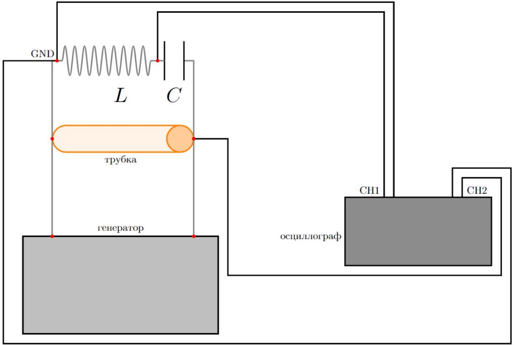

| $C$, п $\Phi$ | $f _ { r e s }$, МГц | $C _ { e q } , ~ п \Phi$ | $V _ { C } , \mathrm {~B}$ | $V _ { R } , \mathrm {~B}$ | $Q$ | $R$, Ом |
| :--- | :--- | :--- | :--- | :--- | :--- | :--- |
| 2 | 3,68 | 187 | 25,4 | 8,92 | 2,85 | 81,2 |
| 5 | 3,63 | 192 | 25,3 | 8,84 | 2,86 | 79,7 |
| 10 | 3,6 | 195 | 25 | 8,72 | 2,87 | 78,9 |
| 22 | 3,5 | 207 | 24,6 | 8,56 | 2,87 | 76,5 |
| 31 | 3,43 | 215 | 24,4 | 8,4 | 2,90 | 74,2 |
| 34 | 3,4 | 219 | 24,2 | 8,4 | 2,88 | 74,2 |
| 47 | 3,33 | 228 | 20,8 | 7,88 | 2,64 | 79,3 |
| 50 | 3,33 | 228 | 21,4 | 8,32 | 2,57 | 81,3 |
| 57 | 3,28 | 235 | 20,8 | 8,16 | 2,55 | 80,9 |
| 59 | 3,26 | 238 | 20,8 | 7,76 | 2,68 | 76,4 |
| 96 | 3,01 | 280 | 21,8 | 7,16 | 3,04 | 62,1 |
| 105 | 2,96 | 289 | 21,8 | 7,42 | 2,94 | 63,3 |
| 229 | 2,53 | 396 | 14,7 | 6,28 | 2,34 | 67,9 |
| 231 | 2,52 | 399 | 14,9 | 6,58 | 2,26 | 69,9 |
| 313 | 2,32 | 471 | 12,9 | 5,88 | 2,19 | 66,4 |
| 322 | 2,3 | 479 | 12,9 | 6,08 | 2,12 | 68,1 |
| 451 | 2,04 | 609 | 11,4 | 5,28 | 2,16 | 59,4 |
| 506 | 1,95 | 666 | 10,9 | 5,24 | 2,08 | 58,9 |
| 731 | 1,73 | 846 | 8,16 | 4,56 | 1,79 | 60,7 |
| 1260 | 1,34 | 1411 | 6,88 | 3,52 | 1,95 | 43,1 |
| 2140 | 1,05 | 2298 | 4,34 | 3,01 | 1,44 | 45,8 |
| 2260 | 1,03 | 2388 | 4,14 | 2,96 | 1,40 | 46,3 |
| 3040 | 0,87 | 3347 | 4,18 | 2,56 | 1,63 | 33,5 |
| 3240 | 0,85 | 3506 | 4,16 | 2,5 | 1,66 | 32,1 |

D4 ${ } ^ { 1.00 }$ По измеренной резонансной частоте рассчитайте эквивалентную ёмкость $C _ { \text {eq } }$, включенную в цепь. Линеаризовав зависимость $C _ { \text {eq } } \left( C _ { \text {real } } \right)$ и построив график, найдите «паразитную ёмкость» осциллографа $C _ { \text {osc } }$.

$$
\begin{aligned}
C _ { e q } & = \frac { 1 } { 4 \pi ^ { 2 } f _ { r e s } ^ { 2 } L } \\
C _ { e q } & = C _ { r e a l } + C _ { o s c }
\end{aligned}
$$

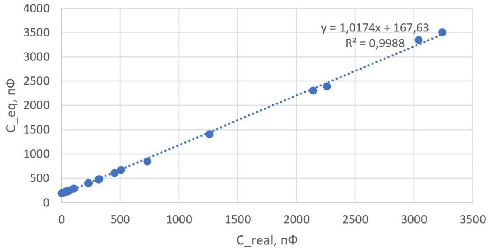

Ответ:

$$
C _ { o s c } = ( 168 \pm 30 ) \text { пФ }
$$

D5 ${ } ^ { 1.50 }$ Предложите линеаризацию, позволяющую найти проводимость. Постройте график и найдите значение $\sigma$. Графически оцените погрешность полученного результата.

$$
R = \frac { 1 } { \sigma } \frac { l } { 2 \pi a \delta } = \frac { l } { 2 a } \sqrt { \frac { \mu _ { 0 } f } { \pi \sigma } }
$$

Линеаризация $R ( \sqrt { f } )$
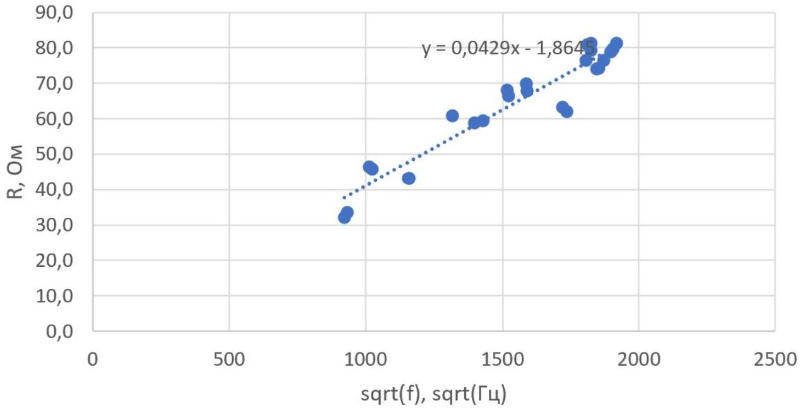
Обозначив угловой коэффициент этой линеаризации $k = 0.0429 \frac { \text { Ом } } { \sqrt { \text { Гц } } }$, получим $\sigma = \frac { \mu _ { 0 } l ^ { 2 } } { 4 \pi a ^ { 2 } k ^ { 2 } } \approx 0.01$ См. При этом погрешность $\sigma$ сравнима с самой $\sigma$, поэтому это не более чем оценочное значение

Ответ:

$$
\sigma = 0.01 \mathrm { Cm }
$$

D6 ${ } ^ { 0.50 }$ Укажите возможную причину такого результата. Обоснуйте свой ответ количественными оценками.

Возможная причина такого нереалистичного значения $\sigma$ - проявление скин-эффекта не только в трубке, но и во всех проводах системы. Для подтверждения этого предположения оценим среднее значение $\frac { L } { a }$ для всех имеющихся проводов.

$$
\frac { L } { a } = 2 k \sqrt { \frac { \overline { \pi \sigma } } { \mu _ { 0 } } } \sim 10 ^ { 6 }
$$

где $k$ - коэффициент пропорциональности в зависимости $R ( \sqrt { f } )$. Такое значение действительно возможно, например при суммарной длине проводов $L \sim 10$ м, среднем радиусе $a \sim 0.01$ мм.

E1 ${ } ^ { 1.80 }$ Методом, описанным в части A, определите толщину трубки и её проводимость. Величину $\delta _ { c r } / h$ возьмите из A. Графически оцените погрешность вашего результата.

E2 ${ } ^ { 1.80 }$ Методом, описанным в части B, определите толщину трубки и её проводимость. Величину $\delta _ { c r } / h$ возьмите из В5. Графически оцените погрешность вашего результата.
Какой из методов, по вашему, точнее?

| $f$, Гц | $T _ { 1 / 2 }$, мкс | $\Delta t _ { \text {shift } }$, мкс | $\operatorname { tg } \psi$ |
| :--- | :--- | :--- | :--- |
| 500 | 1000 | 94 | 0,30 |
| 1000 | 500 | 92,8 | 0,66 |
| 1500 | 335 | 79,2 | 0,92 |
| 2000 | 250 | 73,6 | 1,33 |
| 2500 | 200 | 68 | 1,82 |

| 3000 | 167 | 61,6 | 2,29 |
| :--- | :--- | :--- | :--- |
| 3200 | 156 | 59,6 | 2,57 |
| 3500 | 144 | 56,8 | 2,90 |
| 3700 | 135 | 54,4 | 3,18 |
| 4000 | 125 | 52 | 3,70 |
| 4300 | 116 | 50,4 | 4,79 |
| 4500 | 111 | 49,2 | 5,55 |
| 5000 | 100 | 46 | 7,92 |

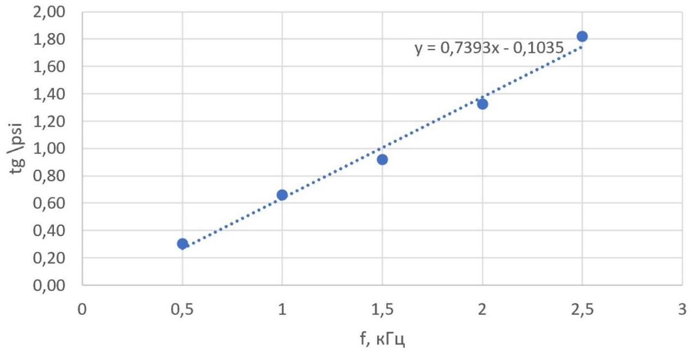
Коэффициент полученного линейного участка равен $k = \pi \mu _ { 0 } \sigma a h = ( 0.739 \pm 0.03 ) \cdot 10 ^ { - 3 } \frac { 1 } { \Gamma _ { ц } }$
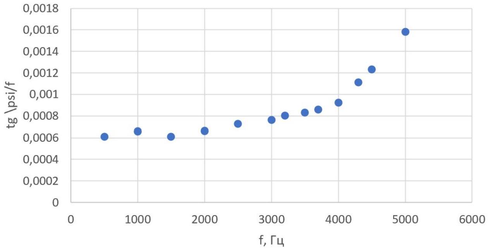
Из графика $\frac { \operatorname { tg } \psi } { f } ( f )$ найдем $f _ { c r } = ( 4300 \pm 100 )$ Гц. Обозначив $\alpha \equiv \frac { \delta _ { c r } } { h } = 1.5$

$$
\begin{gathered}
k = \pi \mu _ { 0 } \sigma a \delta _ { c r } / \alpha = \sqrt { \frac { \pi \mu _ { 0 } \sigma } { f _ { c r } } } \frac { a } { \alpha } \\
\sigma = \frac { f _ { c r } } { \pi \mu _ { 0 } } \left( \frac { k \alpha } { a } \right) ^ { 2 } \\
h = \frac { a } { k f _ { c r } \alpha ^ { 2 } }
\end{gathered}
$$

Ответ:

$$
\begin{aligned}
\sigma & = ( 37.2 \pm 3.9 ) \text { МСм } \\
h & = ( 0.84 \pm 0.05 ) \text { мМ }
\end{aligned}
$$

Ответ:

$$
h _ { e x } = ( 0.89 \pm 0.04 ) \mathrm { мм }
$$
