Подадим напряжение с генератора на передатчик. С помощью тройника ВNC подключим к генератору также первый канал осциллографа. Это нужно не только для того, чтобы контролировать амплитуду напряжения на передатчике, но и для того, чтобы задать уровень триггера осциллографа по устойчивому сигналу с первого канала.

Меняя частоту генератора и анализируя сигнал на микрофоне, находим $f$.

Ответ:

$$
f = ( 40.4 \pm 0.1 ) \text { кГц }
$$

А2 ${ } ^ { 0.70 }$ Придумайте и опишите метод, позволяющий определить длину волны на найденной ранее частоте. Используя его, определите длину волны $\lambda$.

Исследуем сдвиг фаз между передатчиком и приёмником. Будем измерять координаты точек относительно начального положения приёмника, в которых сдвиг фаз относительно начального положения составляет $2 \pi m$.

| $m$ | 0 | 4 | 8 | 12 | 16 | 20 | 24 |
| :--- | :--- | :--- | :--- | :--- | :--- | :--- | :--- |
| $x , \mathrm { CM }$ | 3.3 | 6.6 | 10.2 | 13.1 | 16.7 | 20.2 | 24.0 |

Усредняя методом наименьших квадратов, получим $\lambda$.

Ответ:

$$
\lambda = ( 0.86 \pm 0.02 ) \text { см }
$$

А3 ${ } ^ { 0.25 }$ По результатам предыдущих измерений определите скорость звука $v _ { 3 B }$ в воздухе. Сравните найденное значение с теоретическим. Примечание. Считайте распространение звука адиабатическим процессом. Молярная масса воздуха $\mu = 29$ г/моль.

Получим скорость звука по формуле $v _ { \text {зв } } = \lambda f$.

Ответ:

$$
v _ { 3 \mathrm { в } } = ( 347 \pm 8 ) \mathrm { м } / \mathrm { c }
$$

Используем формулу для адиабатического распространения звука:

$$
v _ { 3 \mathrm {~B} } ^ { t h } = \sqrt { \gamma \frac { R T } { \mu } } .
$$

Для воздуха $\gamma = 7 / 5$, температуру в комнате оценим как $T \approx 300$ К. Тогда получаем

$$
v _ { 3 \mathrm {~B} } ^ { t h } \approx 347 \mathrm {~m} / \mathrm { c } \text {, }
$$

что совпадает со значением, найденным экспериментально.

В1 ${ } ^ { 0.70 }$ В горизонтальной плоскости, содержащей приёмник, экспериментально определите точки волнового фронта, содержащего начальное положение приёмника. Отметьте их на миллиметровке и проведите сглаживающую кривую.

Установим пластину в подставке. Передатчик и приёмник установим на высоте центра пластины, поставив их на подъёмные столики и закрепив малярным скотчем. Будем перемещать приёмник, находя и отмечая на миллиметровке точки, в которых фаза волны совпадает с фазой в начальном положении.

Ответ:
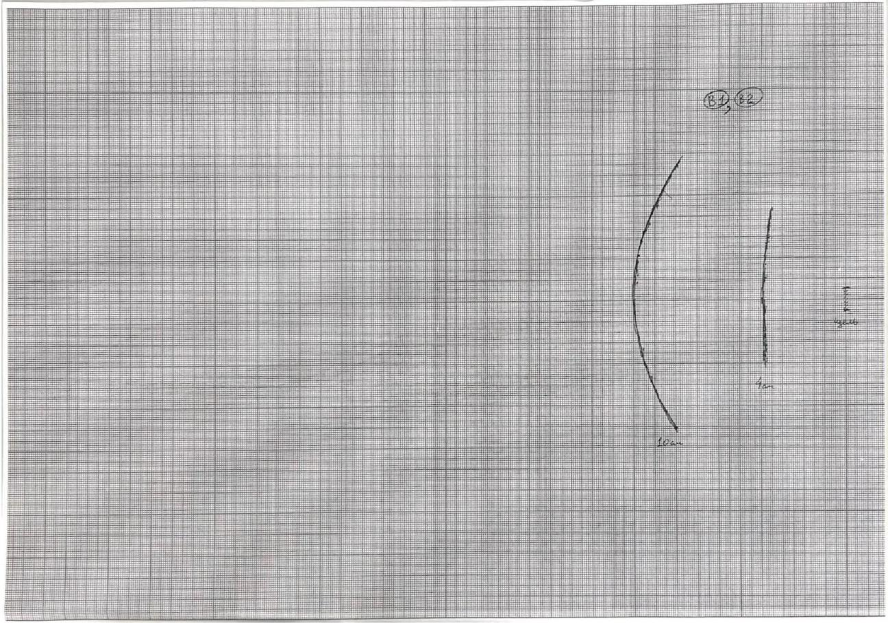

В2 ${ } ^ { 0.50 }$ Повторите предыдущий пункт для начального расстояния между прорезью и приёмником 10 СМ.

См. предыдущий пункт.

B3 0.20 Сделайте вывод: на каком из использованных расстояний прорезь можно с лучшей точностью считать точечным источником волн?

Ясно, что рисунок, полученный для расстояния 10 см более похож на фронт точечного истончика, так как с хорошей точностью описывается дугой окружности.

Ответ:

10 cm

B4 ${ } ^ { 1.30 }$ Снимите зависимость $A ( y )$ амплитуды сигнала на приёмнике от расстояния между приёмником и ГО (не менее 25 точек). Постройте её график. Примечание. Вы должны обнаружить не менее одного минимума сигнала.

Выберем расстояния от пластины до приёмника 10 см. Проведём измерения $A ( y )$. По результатам построим график.

| $y , \mathrm { MM }$ | $A , \mathrm { mB }$ | $y , \mathrm { MM }$ | $A , \mathrm { mB }$ |
| :--- | :--- | :--- | :--- |
| -35 | 6.72 | 2 | 7.84 |
| -30 | 5.20 | 3 | 6.80 |
| -25 | 2.88 | 5 | 6.56 |
| -23 | 1.44 | 7 | 5.52 |
| -22 | 1.20 | 10 | 3.76 |
| -21 | 1.52 | 12 | 2.48 |
| -20 | 2.64 | 13 | 2.48 |
| -17 | 4.16 | 15 | 2.00 |
| -15 | 5.76 | 17 | 2.32 |
| -13 | 6.88 | 19 | 3.10 |
| -10 | 8.32 | 20 | 4.00 |
| -7 | 8.56 | 25 | 5.92 |
| -5 | 9.04 | 30 | 6.48 |
| -3 | 8.64 | 35 | 5.76 |

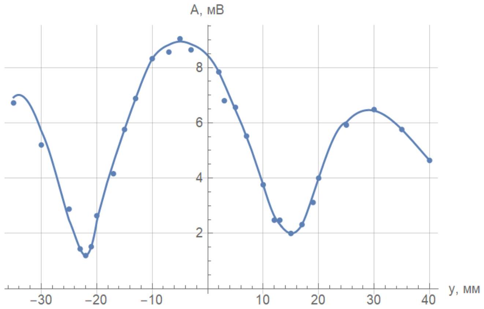

В5 ${ } ^ { 0.60 }$ Используя результаты пункта В4, рассчитайте длину волны $\lambda$. Приведите все теоретические выкладки, используемые в расчётах. Сравните полученное значение с найденным в части A.

Рассчитаем теоретически положения минимумов снятой зависимости. Выразим разность хода для двух лучей, приходящих из разных щелей в приёмник, находящийся в координате $y$. Обозначим расстояние между пластинкой и приёмником $L$, расстояние между щелями - $d$. Тогда пути лучей равны

$$
l _ { 1 } = \sqrt { L ^ { 2 } + ( d / 2 + y ) ^ { 2 } } , \quad l _ { 2 } = \sqrt { L ^ { 2 } + ( d / 2 - y ) ^ { 2 } } .
$$

Условие минимума амплитуды:

$$
l _ { 1 } - l _ { 2 } = \frac { \lambda } { 2 } .
$$

Тогда длина волны может быть выражена через координату первого минимума $y _ { 0 }$ следующим образом ( $y _ { 0 }$ считаем положительным):

$$
\lambda = 2 \left( \sqrt { L ^ { 2 } + \left( d / 2 + y _ { 0 } \right) ^ { 2 } } - \sqrt { L ^ { 2 } + \left( d / 2 - y _ { 0 } \right) ^ { 2 } } \right) .
$$

Примечание. Также возможно использование использование приближения $d , y \ll L$ :

$$
l _ { 1 } \approx L + \frac { ( d / 2 + y ) ^ { 2 } } { 2 L } , \quad l _ { 2 } \approx L + \frac { ( d / 2 - y ) ^ { 2 } } { 2 L } .
$$

В этом случае формула упрощается до следующей:

$$
\lambda = \frac { 2 y d } { L } .
$$

Согласно графикам координаты первых минимумов интенсивности равны

$$
y _ { 1 } = - ( 22 \pm 1 ) \mathrm { mM } \quad y _ { 2 } = ( 15 \pm 1 ) \mathrm { MM }
$$

Заметим, что главный максимум интенсивности немного смещён относительно координаты $y = 0$, поэтому $y _ { 0 }$ рассчитаем как

$$
y _ { 0 } = \frac { y _ { 2 } - y _ { 1 } } { 2 } = ( 18.5 \pm 0.8 ) \text { мм. }
$$

Линейкой измерим расстояние между щелями:

$$
d = ( 3.0 \pm 0.1 ) \text { см. }
$$

Расстояние $L$ измерим по миллиметровке:

$$
L = ( 11.5 \pm 0.1 ) \text { см. }
$$

Подставив это значение в выражение для длины волны, получаем ответ. Ответ, полученный с использованием упрощённой формулы отличается от первого не более чем на $3 \%$.

Ответ:

$$
\lambda = ( 0.94 \pm 0.06 ) \text { см }
$$

В этом пункте значение $\lambda$ оказалось больше, чем полученное в части A , но $\lambda$ из части A точно согласуется с теоретическим значением скорости звука в воздухе, поэтому можно предположить, что метод определения длины волны по минимумам интенсивности является менее точным.

Установим пластину в подставку, передатчик и приёмник расположим на ГО. Изменяя положение передатчика, будем приёмником находить точку максимума интенсивности прошедшего через пластину излучения. После снятия точек построим график $a b ( a + b )$. Согласно теории, он будет линейным с угловым коэффициентом, равным $f$.

| $a , \mathrm { CM }$ | 20.1 | 23.6 | 26.3 | 29.1 | 33.4 |
| :--- | :--- | :--- | :--- | :--- | :--- |
| $b , \mathrm {~cm}$ | 58.6 | 42.5 | 34.5 | 30.7 | 27.9 |
| $a b , \mathrm {~cm} ^ { 2 }$ | 1178 | 1003 | 907 | 893 | 932 |
| $( a + b )$, см | 78.7 | 66.1 | 60.8 | 59.8 | 61.3 |

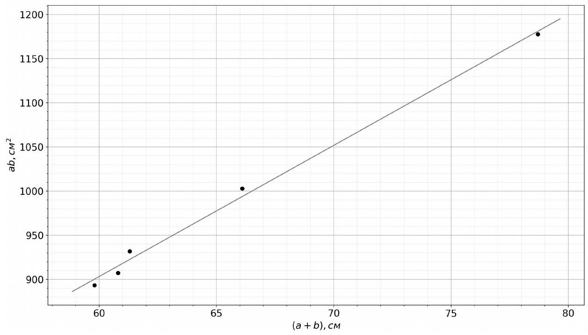
По МНК определяем $f$.

Ответ:

$$
f = ( 14.9 \pm 0.5 ) \text { см }
$$

Расчётное фокусное расстояние пластины составляет 15 см.

C2 ${ } ^ { 0.60 }$ В горизонтальной плоскости, содержащей приёмник, экспериментально определите точки волнового фронта, содержащего начальное положение приёмника. Отметьте их на миллиметровке и проведите сглаживающую кривую.

Проводим измерения аналогично В1. Черным отмечен фронт волны с пластиной, красным - без пластины.

Ответ:
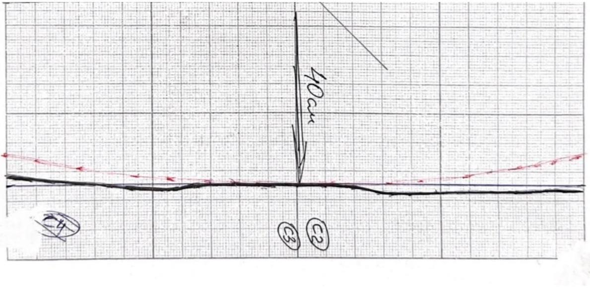

В горизонтальной плоскости, содержащей приёмник, экспериментально определите точки волнового фронта, содержащего начальное положение приёмника. Отметьте их на миллиметровке и проведите сглаживающую кривую.

См. предыдущий пункт.

C4 ${ } ^ { 0.20 }$ Сделайте вывод: можно ли считать звуковой фронт, прошедший через пластину, плоским, а источник точечным? Обоснуйте свой ответ.

Из рисунка следует, что фронт с пластиной можно считать плоским, так как расстояние между проекциями любых двух точек фронта на горизонтальную плоскость не превышает $\lambda$.

Фронт источника без линзы имеет почти постоянную кривизну, поэтому его можно считать сферическим, а источник, соответственно, точечным.

D1 ${ } ^ { 0.40 }$ Для описанной ситуации получите выражение для внешнего радиуса $r ( m ) m$-ой зоны Френеля $( m = 1,2 , \ldots )$ в параксиальном приближении. Ответ выразите через $m , a , b$ и $\lambda$.

Рассмотрим часть излучения, проходящего на расстоянии $r$ от нормали, опущенной от источника на экран, через тонкое кольцо толщиной $d r$. В силу параксиального приближения будем считать $r \ll a , b$. Суммарный путь от передатчика к приёмнику для таких «лучей» составляет

$$
l = \sqrt { a ^ { 2 } + r ^ { 2 } } + \sqrt { b ^ { 2 } + r ^ { 2 } } \approx a + b + \frac { r ^ { 2 } } { 2 } \left( \frac { 1 } { a } + \frac { 1 } { b } \right)
$$

а относительный сдвиг фазы, соответственно,

$$
\Delta \varphi = \pi \frac { r ^ { 2 } } { \lambda } \left( \frac { 1 } { a } + \frac { 1 } { b } \right) = \beta \pi r ^ { 2 } .
$$

Так как $r \ll a , b$, можно пренебречь отличием амлитуд сигналов, проходящих через разные кольца. Тогда суммарная комплексная амплитуда сигнала, пришедшего в приёмник из рассмотренного кольца, составляет

$$
C \cdot 2 \pi r d r e ^ { i \beta \pi r ^ { 2 } } = \frac { C \pi } { i \beta } \cdot d \left( e ^ { i \beta \pi r ^ { 2 } } \right)
$$

где $C =$ const.
Внешняя граница зоны Френеля с номером $m$ соответствует суммарному сдвигу фаз на $\pi m$ :

$$
\beta \pi \cdot r ( m ) ^ { 2 } = \pi m \Rightarrow r ( m ) = \sqrt { \frac { m } { \beta } } .
$$

Подставив $\beta$, получаем ответ.

Ответ:

$$
r ( m ) = \sqrt { \frac { m \lambda } { \frac { 1 } { a } + \frac { 1 } { b } } }
$$

D2 ${ } ^ { 0.20 }$ Покажите, что для пластины выполнено следующее соотношение:

$$
\frac { 1 } { a } + \frac { 1 } { b } = \frac { 1 } { f }
$$

где $f$ - параметр пластины, называемый фокусным расстоянием. Выразите $f$ через $m , r ( m ) , \lambda$.

Для пластины $r ( m ) =$ const., отсюда следует

$$
\frac { 1 } { a } + \frac { 1 } { b } = \frac { m \lambda } { r ^ { 2 } ( m ) } = \frac { 1 } { f }
$$

Выразив $f$, получаем ответ.

Ответ:

$$
f = \frac { r ^ { 2 } ( m ) } { m \lambda }
$$

D3 ${ } ^ { 1.50 }$ Для каждой из пластин снимите зависимость $b ( a )$ не менее чем для 5 различных значений $a$. Постройте линеаризованные графики зависимости на одной миллиметровке и по ним определите $f$ для каждой пластины.

Проведём измерения, аналогичные пункту С1. Фокусные расстояния красной, белой и синей пластины обозначим $f _ { \mathrm { K } ^ { \prime } } , f _ { б }$ и $f _ { \mathrm { c } }$ соответственно.
Красная пластина:

| $a , \mathrm { CM }$ | 35 | 30 | 25 | 20 | 15 |
| :--- | :--- | :--- | :--- | :--- | :--- |
| $b , \mathrm {~cm}$ | 10.5 | 11.3 | 12.2 | 14.1 | 17.1 |
| $a b , \mathrm {~cm} ^ { 2 }$ | 368 | 339 | 305 | 282 | 257 |
| $( a + b )$, см | 45.5 | 41.3 | 37.2 | 34.1 | 32.0 |

| $a , \mathrm { CM }$ | 40 | 35 | 30 | 25 | 20 |
| :--- | :--- | :--- | :--- | :--- | :--- |
| $b , \mathrm {~cm}$ | 15.5 | 16.7 | 18.2 | 20.3 | 24.7 |
| $a b , \mathrm {~cm} ^ { 2 }$ | 620 | 585 | 546 | 508 | 494 |
| $( a + b )$, см | 55.5 | 51.7 | 48.2 | 45.3 | 44.7 |

Синяя пластина:

| $a , \mathrm { CM }$ | 35 | 30 | 28 | 25 | 23 |
| :--- | :--- | :--- | :--- | :--- | :--- |
| $b , \mathrm {~cm}$ | 25.3 | 27.7 | 30.2 | 35.1 | 39.2 |
| $a b , \mathrm {~cm} ^ { 2 }$ | 886 | 831 | 846 | 878 | 902 |
| $( a + b )$, см | 60.3 | 57.7 | 58.2 | 60.1 | 62.2 |

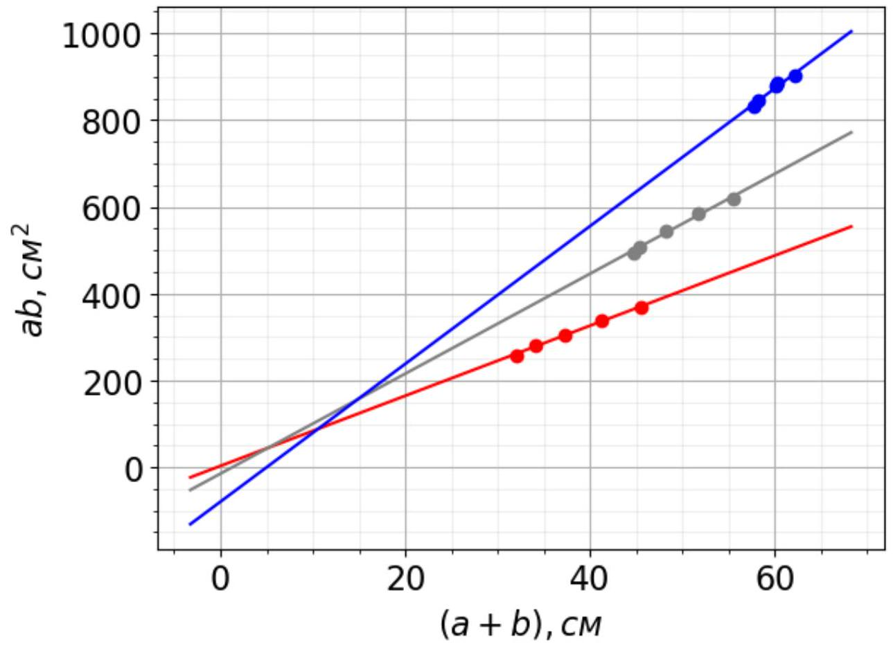
На приведенном графике красные точки соответствуют красной линзе, синие - синей, серые - белой.

По МНК получаем ответы.

Ответ:

$$
\begin{aligned}
& f _ { \mathrm { K } } = ( 8.2 \pm 0.3 ) \mathrm { cM } \\
& f _ { б } = ( 11.2 \pm 0.5 ) \mathrm { cM } \\
& f _ { \mathrm { c } } = ( 14.6 \pm 0.7 ) \mathrm { cM }
\end{aligned}
$$

D4 ${ } ^ { 0.80 }$ Для каждой пластины напрямую измерьте $r ( m )$ для всех $m$ и на их основе рассчитайте $f$, используя результаты пункта D2. Какой метод определения $f$ является более точным?
Примечание. Если вам потребуется строить в этом пункте несколько графиков, постройте их на одной миллиметровке.

Красная пластина:

| $m$ | $r ( m )$, см | $r ^ { 2 } ( m ) , \mathrm { cm } ^ { 2 }$ |
| :--- | :--- | :--- |
| 1 | 2.30 | 5.3 |
| 2 | 3.25 | 10.6 |
| 3 | 4.15 | 17.2 |
| 4 | 4.75 | 22.6 |
| 5 | 5.55 | 30.8 |
| 6 | 6.05 | 36.6 |
| 7 | 6.70 | 44.9 |

| 8 | 7.30 | 53.3 |
| :--- | :--- | :--- |
| 9 | 7.80 | 60.8 |
| 10 | 8.25 | 68.1 |
| 11 | 8.80 | 77.4 |

Синяя пластина:

| $m$ | $r ( m )$, CM | $r ^ { 2 } ( m ) , \mathrm { cm } ^ { 2 }$ |
| :--- | :--- | :--- |
| 1 | 3.60 | 13.0 |
| 2 | 5.05 | 25.5 |
| 3 | 6.35 | 40.3 |
| 4 | 7.25 | 52.6 |
| 5 | 8.30 | 68.9 |
| 6 | 8.95 | 80.1 |

Белая пластина:

| $m$ | $r ( m )$, см | $r ^ { 2 } ( m ) , \mathrm { cm } ^ { 2 }$ |
| :--- | :--- | :--- |
| 1 | 2.90 | 8.4 |
| 2 | 4.15 | 17.2 |
| 3 | 5.25 | 27.6 |
| 4 | 6.10 | 37.2 |
| 5 | 6.90 | 47.6 |
| 6 | 7.55 | 57.0 |
| 7 | 8.30 | 68.9 |
| 8 | 8.95 | 80.1 |

Построим график зависимостей $\left( r ^ { 2 } ( m ) \right) ( m )$ и по угловым коэффициентам определим значение фокусных расстояний. На приведенном графике красные точки соответствуют красной линзе, синие - синей, серые - белой.
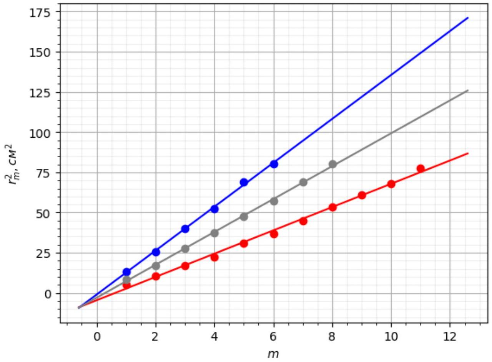

Угловой коэффициент графика $k$ и фокусной расстояние связаны соотношением $k = f \lambda$.

$$
\begin{aligned}
k _ { \mathrm { K } } & = ( 7.2 \pm 0.2 ) \mathrm { cM } ^ { 2 } \\
k _ { б } & = ( 10.2 \pm 0.2 ) \mathrm { cm } ^ { 2 } \\
k _ { \mathrm { c } } & = ( 13.7 \pm 0.2 ) \mathrm { cm } ^ { 2 }
\end{aligned}
$$

Ответ:

$$
\begin{aligned}
& f _ { \mathrm { K } } = ( 8.4 \pm 0.3 ) \mathrm { cm } \\
& f _ { б } = ( 11.9 \pm 0.5 ) \mathrm { cM } \\
& f _ { \mathrm { c } } = ( 15.9 \pm 0.6 ) \mathrm { cM }
\end{aligned}
$$

D5 ${ } ^ { 1.50 }$ Снимите зависимость $\Delta \varphi ( y )$ (не менее 20 точек). Затем уберите линзу и, не меняя положения передатчика, снимите аналогичную зависимость $\Delta \varphi _ { 0 } ( y )$ (не менее 20 точек). Постройте эти зависимости на одном графике.

Снимем требуемые зависимости и построим на одном графике.

| $y , \mathrm { CM }$ | $\Delta \varphi , ^ { \circ }$ | $\Delta \varphi , 2 \pi$ | $\Delta \varphi _ { 0 } , { } ^ { \circ }$ | $\Delta \varphi _ { 0 } , 2 \pi$ |
| :--- | :--- | :--- | :--- | :--- |
| 0.0 | 0 | 0 | 0 | 0 |
| 0.5 | 6 | 0.02 | 0 | 0 |
| 1.0 | 15 | 0.04 | 12 | 0.03 |
| 1.5 | 75 | 0.21 | 46 | 0.13 |
| 2.0 | 75 | 0.21 | 78 | 0.22 |
| 2.5 | 105 | 0.29 | 111 | 0.31 |
| 3.0 | 153 | 0.43 | 162 | 0.45 |
| 3.5 | 195 | 0.54 | 210 | 0.58 |
| 4.0 | 279 | 0.78 | 276 | 0.77 |
| 4.5 | 414 | 1.15 | 366 | 1.02 |
| 5.0 | 483 | 1.34 | 441 | 1.23 |
| 5.5 | 519 | 1.44 | 540 | 1.50 |
| 6.0 | 687 | 1.91 | 642 | 1.78 |
| 6.5 | 825 | 2.29 | 741 | 2.06 |
| 7.0 | 915 | 2.54 | 840 | 2.33 |
| 7.5 | 1019 | 2.83 | 946 | 2.63 |
| 8.0 | 1134 | 3.15 | 1076 | 2.99 |
| 8.5 | 1233 | 3.43 | 1191 | 3.31 |
| 9.0 | 1359 | 3.78 | 1316 | 3.66 |
| 9.5 | 1509 | 4.19 | 1476 | 4.10 |
| 10.0 | 1649 | 4.58 | 1596 | 4.43 |

## D5

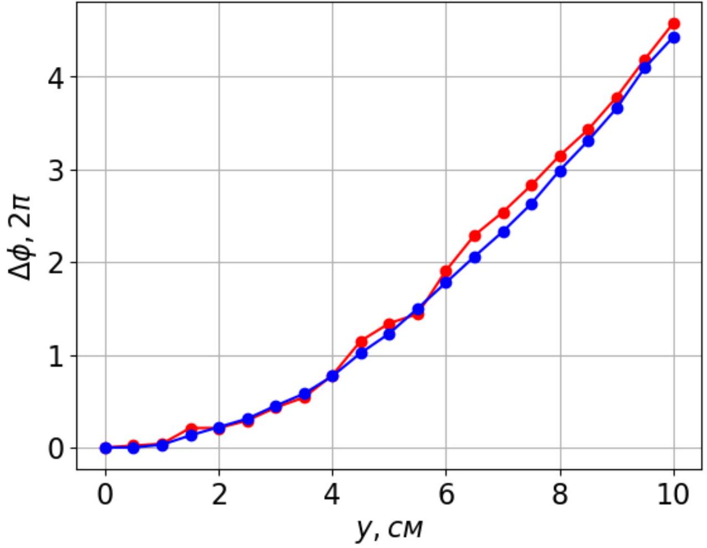

На приведенном графике синие точки соответствуют измерениям без линзы, красные - с линзой.

D6 ${ } ^ { 2.20 }$ Повторите действия пункта D5 для расстояний между пластиной и приёмником 15 см и 25 см.

Проведём измерения аналогично предыдущему пункту.

| $y , \mathrm { CM }$ | $\Delta \varphi , ^ { \circ }$ | $\Delta \varphi , 2 \pi$ | $\Delta \varphi _ { 0 } , ^ { \circ }$ | $\Delta \varphi _ { 0 } , 2 \pi$ |
| :--- | :--- | :--- | :--- | :--- |
| 0.0 | 0 | 0 | 0 | 0 |
| 0.5 | -6 | -0.02 | 0 | 0 |
| 1.0 | -12 | -0.03 | 6 | 0.02 |
| 1.5 | -12 | -0.03 | 12 | 0.03 |
| 2.0 | 6 | 0.02 | 18 | 0.05 |
| 2.5 | 18 | 0.05 | 24 | 0.07 |
| 3.0 | 30 | 0.08 | 51 | 0.14 |
| 3.5 | 24 | 0.07 | 81 | 0.23 |
| 4.0 | 60 | 0.17 | 116 | 0.32 |
| 4.5 | 75 | 0.21 | 171 | 0.48 |
| 5.0 | 114 | 0.32 | 206 | 0.57 |
| 5.5 | 156 | 0.43 | 276 | 0.77 |
| 6.0 | 340 | 0.94 | 330 | 0.92 |
| 6.5 | 395 | 1.10 | 372 | 1.03 |
| 7.0 | 430 | 1.19 | 450 | 1.25 |
| 7.5 | 460 | 1.28 | 492 | 1.37 |
| 8.0 | 520 | 1.44 | 561 | 1.56 |
| 8.5 | 620 | 1.72 | 660 | 1.83 |
| 9.0 | 726 | 2.02 | 726 | 2.02 |
| 9.5 | 830 | 2.31 | 816 | 2.27 |
| 10.0 | 885 | 2.46 | 886 | 2.46 |

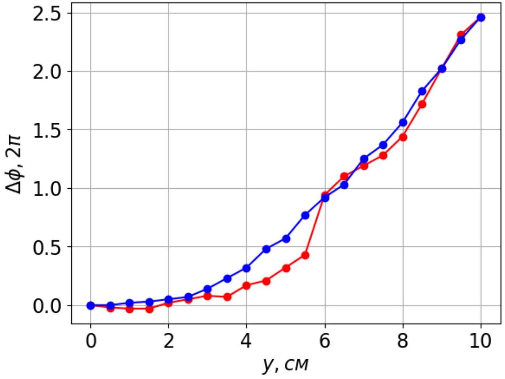

На приведенном графике синие точки соответствуют измерениям без линзы, красные - с линзой.

| $y , \mathrm { CM }$ | $\Delta \varphi , ^ { \circ }$ | $\Delta \varphi , 2 \pi$ | $\Delta \varphi _ { 0 } , { } ^ { \circ }$ | $\Delta \varphi _ { 0 } , 2 \pi$ |
| :--- | :--- | :--- | :--- | :--- |
| 0.0 | 0 | 0 | 0 | 0 |
| 0.5 | -6 | -0.02 | 0 | 0 |
| 1.0 | -12 | -0.03 | 6 | 0.02 |
| 1.5 | -12 | -0.03 | 14 | 0.04 |
| 2.0 | -21 | -0.06 | 24 | 0.07 |
| 2.5 | -21 | -0.06 | 34 | 0.09 |
| 3.0 | -12 | -0.03 | 54 | 0.15 |
| 3.5 | 0 | 0 | 64 | 0.18 |
| 4.0 | 9 | 0.03 | 99 | 0.28 |
| 4.5 | 24 | 0.07 | 114 | 0.32 |
| 5.0 | 36 | 0.10 | 124 | 0.34 |
| 5.5 | 69 | 0.19 | 159 | 0.44 |
| 6.0 | 114 | 0.32 | 184 | 0.51 |
| 6.5 | 134 | 0.37 | 204 | 0.57 |
| 7.0 | 204 | 0.57 | 254 | 0.71 |
| 7.5 | 294 | 0.82 | 294 | 0.82 |
| 8.0 | 334 | 0.93 | 344 | 0.96 |
| 8.5 | 384 | 1.07 | 384 | 1.07 |
| 9.0 | 424 | 1.18 | 434 | 1.21 |
| 9.5 | 464 | 1.29 | 489 | 1.36 |
| 10.0 | 564 | 1.57 | 544 | 1.51 |

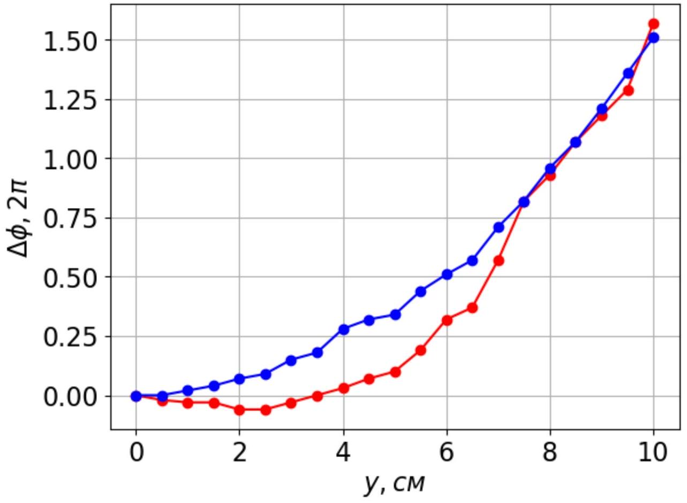

На приведенном графике синие точки соответствуют измерениям без линзы, красные - с линзой.

Отметим, что у графиков, полученных с пластиной, есть характерные «скачки» фазы.

D7 ${ } ^ { 0.30 }$ На каком из исследованных расстояний фронт волны с наилучшей точностью можно считать плоским в области $| y | < 5$ см?

Из предыдущих пунктов следует, что лучше всех плоским приближением задаётся фронт на расстоянии 25 см.

Ответ:
25cm

E1 ${ } ^ { 0.60 }$ Получите выражение, связывающее $\theta$, $\lambda$ и $d$, при углах $\theta$, соответствующих главным максимумам интенсивности рассеянной волны. Примечание. Рассмотрите сдвиг фаз при отражении волны от разных рассеивающих центров.

Нетрудно заметить, что разность хода лучей 1 и 2 нулевая, а лучей 1 и $3 - 2 d \cos \theta$. Главный максимум достигается, если все вторичные источники излучают синфазно. Это соответствует соотношению

$$
2 d \cos \theta = m \lambda
$$

где $m = 1,2 , \ldots$
Заметим, что количество главных максимумов определяется максимальным $m$, для которого справедливо

$$
\frac { m \lambda } { 2 d } \leq 1 ,
$$

так как $\cos \theta \leq 1$.
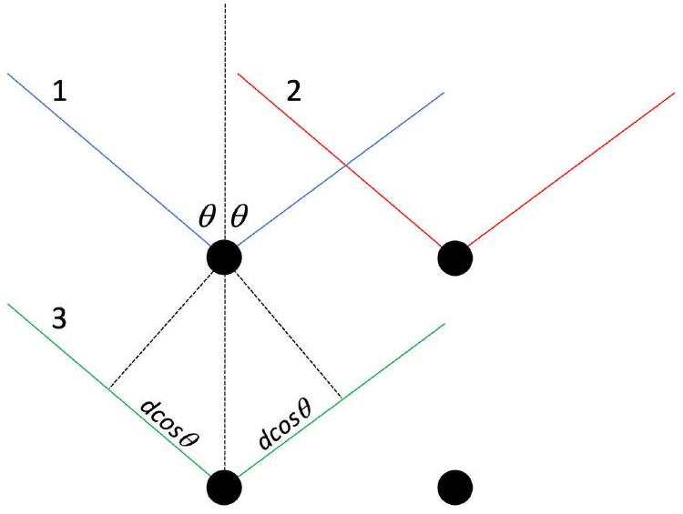

Ответ:

$$
2 d \cos \theta = m \lambda
$$

E2 ${ } ^ { 1.30 }$ Измерьте зависимость амплитуды сигнала на приёмнике от угла $\theta$ в диапазоне от $20 ^ { \circ }$ до $70 ^ { \circ }$. Постройте её график. Укажите положение максимумов, обусловленных брэгговским отражением и объясните их количество.

Снимем зависимость амлитуды сигнала на приёмнике от угла $\theta$. Особенно хорошо промерим окрестности максимумов.

| $\theta , ^ { \circ }$ | $V , \mathrm { mB }$ | $\theta , ^ { \circ }$ | $V , \mathrm { mB }$ |
| :--- | :--- | :--- | :--- |
| 20 | 11.5 | 33 | 19.6 |
| 25 | 10.7 | 32 | 22.5 |
| 30 | 16.2 | 31 | 13.1 |
| 35 | 19.0 | 29 | 10.0 |
| 40 | 7.0 | 27 | 9.0 |
| 45 | 3.0 | 43 | 6.0 |
| 50 | 6.0 | 47 | 4.5 |
| 55 | 1.5 | 48 | 6.0 |
| 60 | 3.0 | 49 | 5.0 |
| 65 | 11.0 | 52 | 4.0 |
| 70 | 5.5 | 63 | 7.5 |
| 37 | 3.5 | 64 | 11.0 |
| 36 | 10.1 | 66 | 10.5 |
| 35 | 15.0 | 67 | 6.0 |
| 34 | 21.0 | 68 | 6.0 |

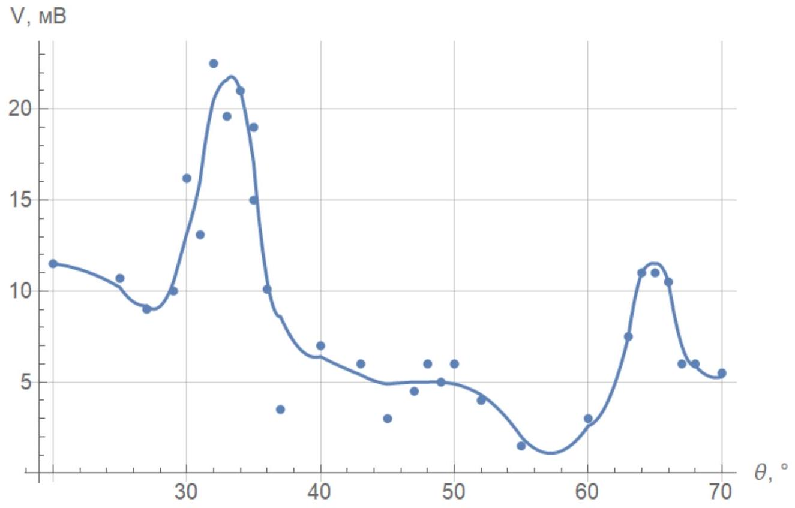
На графике наблюдаются два главных максимума амплитуды при углах

$$
\theta _ { 1 } = 33 ^ { \circ } \pm 1 ^ { \circ } , \quad \theta _ { 2 } = 66 ^ { \circ } \pm 1 ^ { \circ } ,
$$

первый из них соответствует $m _ { 1 } = 2$, второй $- m _ { 2 } = 1$.
Наблюдается два максимума, так как для $m \geq 3$

$$
\frac { m \lambda } { 2 d } > 1 .
$$

E3 ${ } ^ { 0.20 }$ Используя выражение из пункта E1, вычислите шаг решётки $d$.

Рассчитаем $d$, используя $\theta _ { 1 }$ и $\theta _ { 2 }$. Применяя формулу из E1, получаем

$$
d _ { 1 } = ( 1.03 \pm 0.02 ) \text { см, } \quad d _ { 2 } = ( 1.06 \pm 0.04 ) \text { см. }
$$

Усредняя, получим ответ для $d$.

Ответ:

$$
d = ( 1.05 \pm 0.03 ) \text { см }
$$

Легко показать, что разность хода лучей 1 и 3 нулевая. Из геометрии следует, что разность хода лучей 1 и 2 составляет $\sqrt { 2 } d \cos \theta$. Условие главного максимума:

$$
\sqrt { 2 } d \cos \theta = m \lambda .
$$

В этом случае количество максимумов задаётся неравенством

$$
\frac { m \lambda } { \sqrt { 2 } d } \leq 1 .
$$

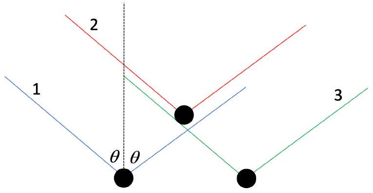

Ответ:

$$
\sqrt { 2 } d \cos \theta = m \lambda
$$

E5 $5 ^ { 1.30 }$ Измерьте зависимость амплитуды сигнала на приёмнике от угла $\theta$ в диапазоне от 20° до 70°. Постройте её график. Укажите положение максимумов, обусловленных брэгговским отражением и объясните их количество.

Проведём измерения аналогично пункту Е2.

| $\theta , ^ { \circ }$ | $V , \mathrm { mB }$ | $\theta , ^ { \circ }$ | $V , \mathrm { mB }$ |
| :--- | :--- | :--- | :--- |
| 70 | 6.5 | 20 | 6.1 |
| 65 | 4.5 | 56 | 12.8 |
| 60 | 3.7 | 54 | 19.0 |
| 55 | 18.8 | 53 | 22.8 |
| 50 | 11.5 | 52 | 19.4 |
| 45 | 5.4 | 51 | 16.4 |
| 40 | 5.0 | 48 | 7.0 |
| 35 | 5.5 | 58 | 10.0 |
| 30 | 5.5 | 59 | 8.0 |
| 25 | 5.5 | 56 | 15.0 |

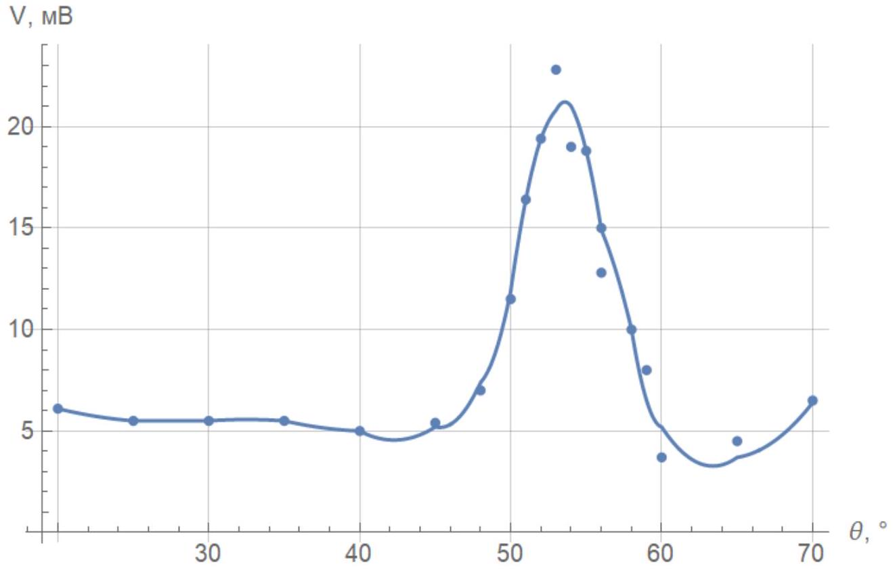
На графике наблюдается лишь один максимум интенсивности при угле

$$
\theta _ { 0 } = 53 ^ { \circ } \pm 1 ^ { \circ } ,
$$

соотвествующий $m _ { 0 } = 1$.
Наблюдается один максимум, так как для $m \geq 2$

$$
\frac { m \lambda } { \sqrt { 2 } d } > 1 .
$$

Применяя формулу из Е4, получим ответ для $d$.

Ответ:

$$
d = ( 1.01 \pm 0.03 ) \text { см }
$$

F1 ${ } ^ { 0.90 }$ Получите уравнение кривой в координатах $O x y$, содержащей такие точки. В ответе используйте $m , f$ и $\lambda$.

По условию фокус находится в точке $( 0,0 )$. Запишем условие фокусировки:

$$
l _ { 2 } - l _ { 1 } = m \lambda
$$

где $l _ { 1 } = f - x$ и $l _ { 2 } = \sqrt { ( f - x ) ^ { 2 } + y ^ { 2 } }$. Отсюда получаем выражение для кривой:

$$
y ^ { 2 } = m ^ { 2 } \lambda ^ { 2 } + 2 m \lambda ( f - x )
$$

Это уравнение задаёт семейство парабол.
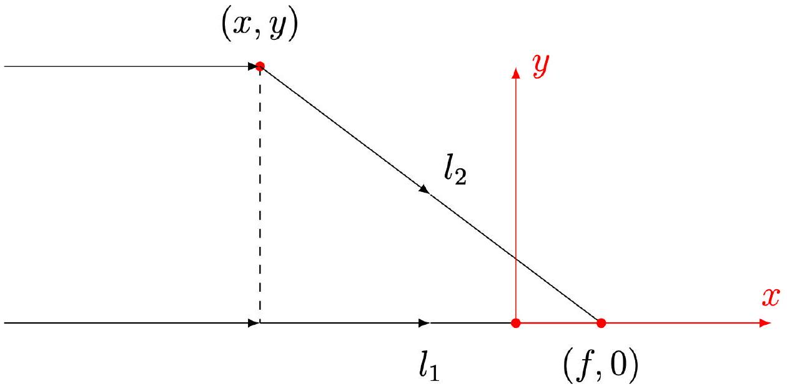

Ответ:

$$
y ^ { 2 } = m ^ { 2 } \lambda ^ { 2 } + 2 m \lambda ( f - x )
$$

F2 ${ } ^ { 1.30 }$ Экспериментально определите фокусное расстояние структуры $f$. Опишите, как вы детектируете максимум сигнала. Качественно зарисуйте зависимость амплитуды сигнала от координаты $x$ вблизи фокуса ( $x \in [ f - 3 \mathrm {~cm} , f + 3$ см $]$ ).

В данном пункте большую роль играет точная юстировка установки, так как максимум интенсивности достаточно слабо выражен.

Расположим структуру так, как указано в условии. Приёмник расположим на расстоянии 20 см от структуры. Будем медленно придвигать его к структуре и следить за амплитудой напряжения на осциллографе. Отметим, что в такой конфигурации неизбежно возникает стоячая волна, поэтому точку фокусировку следует искать как точку, в которой амплитуда стоячей волны имеет локальный максимум. Таким методом получаем ответ для $f$.

Ответ:

$$
f = ( 6.2 \pm 0.5 ) \text { см }
$$

Зависимость амплитуды сигнала от координаты $x$ вблизи фокуса имеет характер, представленный на рисунке ниже.

Ответ:
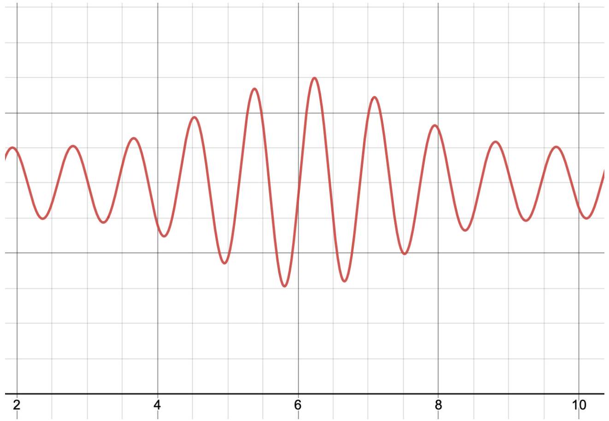
