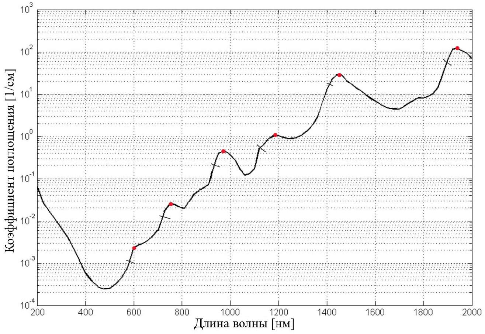
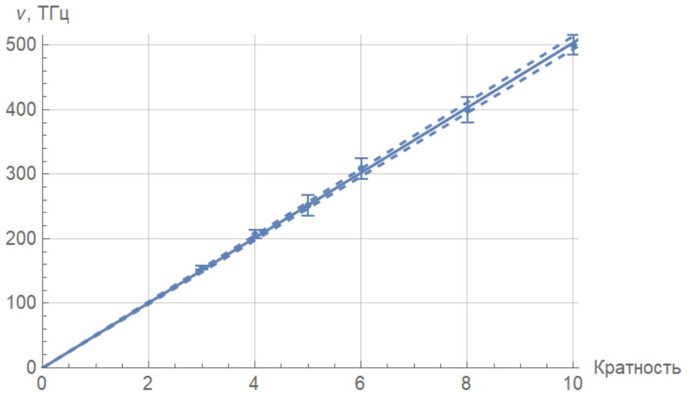
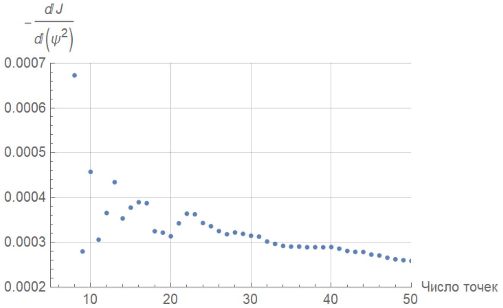

Моды 1 и 3 идентичны с точностью до разности фаз, равной $\pi$ и представляют собой синфазные и противофазные колебания двух независимых осцилляторов соответственно. Поэтому частоты двух этих мод совпадают, а частота моды 2 оказывается наименьшей.

Ответ: Мода 2

А2 ${ } ^ { 0.90 }$ Найдите длины волн $\lambda$ и частоты $\nu$, соответствующих локальным максимумам коэффициента поглощения.

Локальные максимумы отмечены точками на рисунке ниже.

| $\lambda$, HM | $\nu$, ТГц | $\Delta \lambda$, нм | $\Delta \nu$, ТГц | $m ^ { \prime }$ | $m$ |
| :--- | :--- | :--- | :--- | :--- | :--- |
| 600 | 500 | 18 | 15 | 8 | 10 |
| 750 | 400 | 36 | 20 | 6 | 8 |
| 970 | 309 | 48 | 16 | 4 | 6 |
| 1190 | 252 | 72 | 16 | 3 | 5 |
| 1450 | 207 | 48 | 7 | 2 | 4 |
| 1940 | 155 | 36 | 3 | 1 | 3 |

А3 ${ } ^ { 1.20 }$ Найдите полуширину $\Delta \nu$ локальных максимумов коэффициента поглощения.

В таблице выше

A4 ${ } ^ { 1.20 }$ На основе полученных результатов определите кратность частот, соответствующих локальным максимумам, а также найдите основную резонансную частоту $\nu _ { 0 }$ колебаний молекулы воды. Графически определите погрешность $\nu _ { 0 }$.

Так как минимальная разность между ближайшими частотами $\sim 50$ ТГц, то предположим что основная частота $\nu _ { 0 } \approx 50$ ТГц. Примем кратность наименьшей частоты равной 1. При этом кратность частот имеет вид:

$$
\nu ( m ) = \nu _ { 0 } \left( m ^ { \prime } + m _ { 0 } \right)
$$

где $m _ { 0 }$ - постоянный сдвиг.

Вычислим предполагаемые кратности (в таблице выше) и построим график $\nu \left( m ^ { \prime } \right)$ и вычислим $m _ { 0 }$ и $\nu _ { 0 }$ из параметров фитирующей прямой.

Ответ:

$$
\begin{gathered}
m _ { 0 } = 2 \\
\nu _ { 0 } = 50.4 \pm 1 \text { ТГЦ }
\end{gathered}
$$

В $1 ^ { 1.50 }$ Получите приближённое выражение для $\mathcal { J } ( \psi )$, считая углы $\psi$ малыми.

Для начала заметим что из малости $\psi$ следует малость $\rho$, так как

$$
\frac { \psi } { 2 } = \arcsin n \rho - \arcsin \rho \approx ( n - 1 ) \rho
$$

Однако данной точности разложения мало, так как при этом $\mathcal { J } ( \psi )$ примерно постоянна. Раскладывая до следующего порядка

$$
\begin{gathered}
\frac { \psi } { 2 \rho } \approx ( n - 1 ) + \frac { n ^ { 3 } - 1 } { 6 } \rho ^ { 2 } \\
\frac { d \psi } { 2 d \rho } \approx ( n - 1 ) + \frac { n ^ { 3 } - 1 } { 2 } \rho ^ { 2 } \\
\sin \psi \approx \psi - \frac { \psi ^ { 3 } } { 6 } \\
\frac { 1 } { \mathcal { J } } \approx 4 ( n - 1 ) ^ { 2 } \left( 1 + \frac { n ^ { 2 } + n + 1 } { 2 } \rho ^ { 2 } \right) \left( 1 + \frac { n ^ { 2 } + n + 1 } { 6 } \rho ^ { 2 } \right) \left( 1 - \frac { \psi ^ { 2 } } { 6 } \right) \approx \\
\approx 4 ( n - 1 ) ^ { 2 } \left( 1 + 2 n \rho ^ { 2 } \right)
\end{gathered}
$$

Подставляя $\rho$

$$
\mathcal { J } ( \psi ) \approx \frac { 1 } { 4 ( n - 1 ) ^ { 2 } } \left( 1 - \frac { n \psi ^ { 2 } } { 2 ( n - 1 ) ^ { 2 } } \right)
$$

Ответ:

$$
\mathcal { J } ( \psi ) \approx \frac { 1 } { 4 ( n - 1 ) ^ { 2 } } \left( 1 - \frac { n \psi ^ { 2 } } { 2 ( n - 1 ) ^ { 2 } } \right)
$$

В2 ${ } ^ { 5.00 }$ Линеаризуйте полученную зависимость и найдите показатель преломления жидкости $n$.
Указание: Не обязательно использовать все точки, чтобы получить хороший результат.

При попытке описать зависимость $\mathcal { J } \left( \psi ^ { 2 } \right)$ линейной функцией возникают две проблемы:

- Если брать слишком мало точек, данные оказываются зашумлены;
- Если брать много точек, зависимость перестаёт быть линейной.

В качестве подтверждения можно посмотреть на график модуля углового коэффициент зависимости $\mathcal { J } \left( \psi ^ { 2 } \right)$ от числа взятых точек:

Сразу видно, что брать меньше 25 точек бессмысленно, а при более чем 40 точках нужно учитывать нелинейность. Чтобы понять по исходным данным, в какой момент придётся учитывать нелинейность, можно заметить, что в диапазоне $\psi \in \left[ 20 ^ { \circ } ; 30 ^ { \circ } \right]$ у зависимости $\mathcal { J } ( \psi )$ наблюдается излом, что невозможно получить в приближении предыдущего пункта.

Для 40 точек получим значение ( $\psi$ в радианах):

$$
\alpha = - \left. \frac { 1 } { \mathcal { J } } \frac { \mathrm {~d} \mathcal { J } } { \mathrm {~d} \left( \psi ^ { 2 } \right) } \right| _ { \psi = 0 } = 2.081 .
$$

Из линеаризации $\mathcal { J } ( \psi ) = - k \psi ^ { 2 } + b$ последует $\alpha \equiv \frac { k } { b } = \frac { n } { 2 ( n - 1 ) ^ { 2 } }$, откуда выражение для $n$

$$
n = \frac { 1 } { 4 \alpha } ( 4 \alpha + 1 + \sqrt { 8 \alpha - 1 } ) \Longrightarrow
$$

Ответ:

$$
n = 1.59
$$

Эта величина отличается от показателя преломления воды. Это сделано специально, чтобы участники получали ответ честно.
