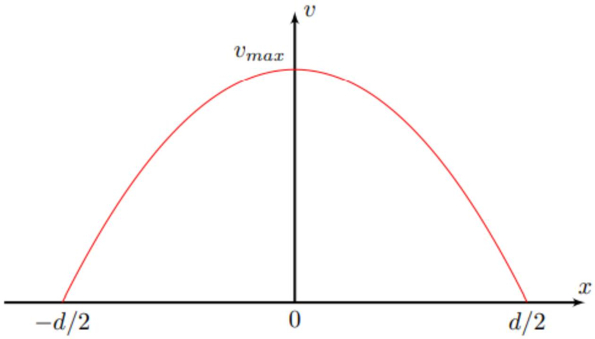
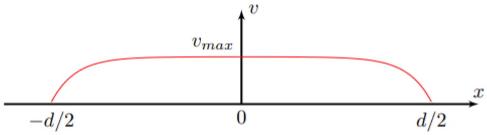
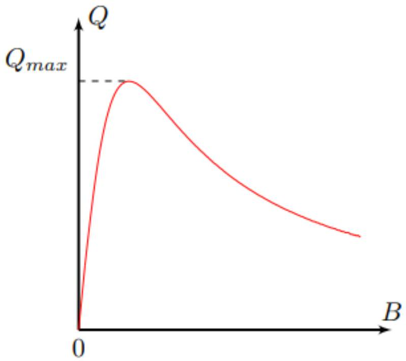
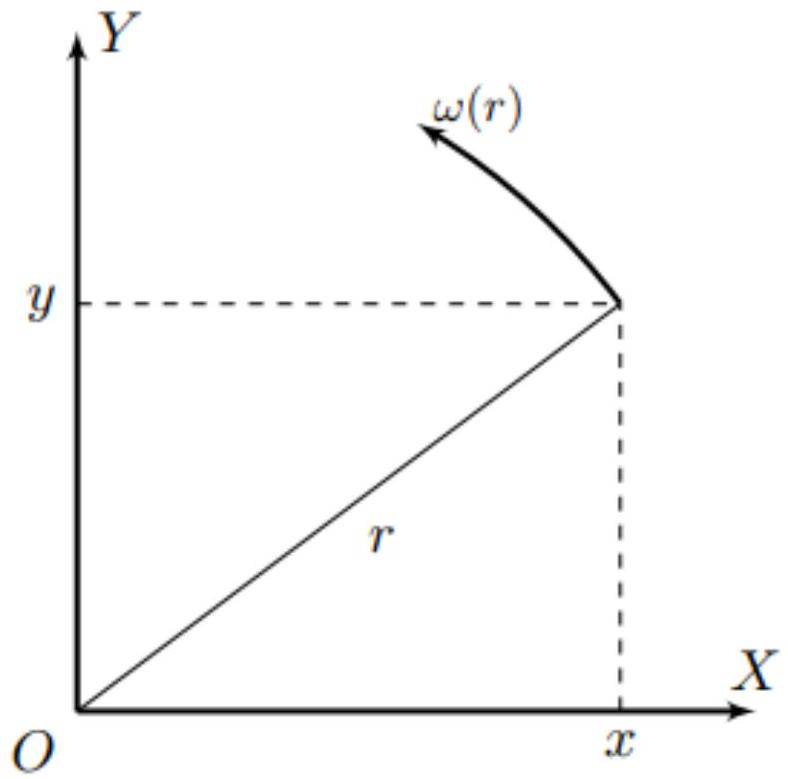
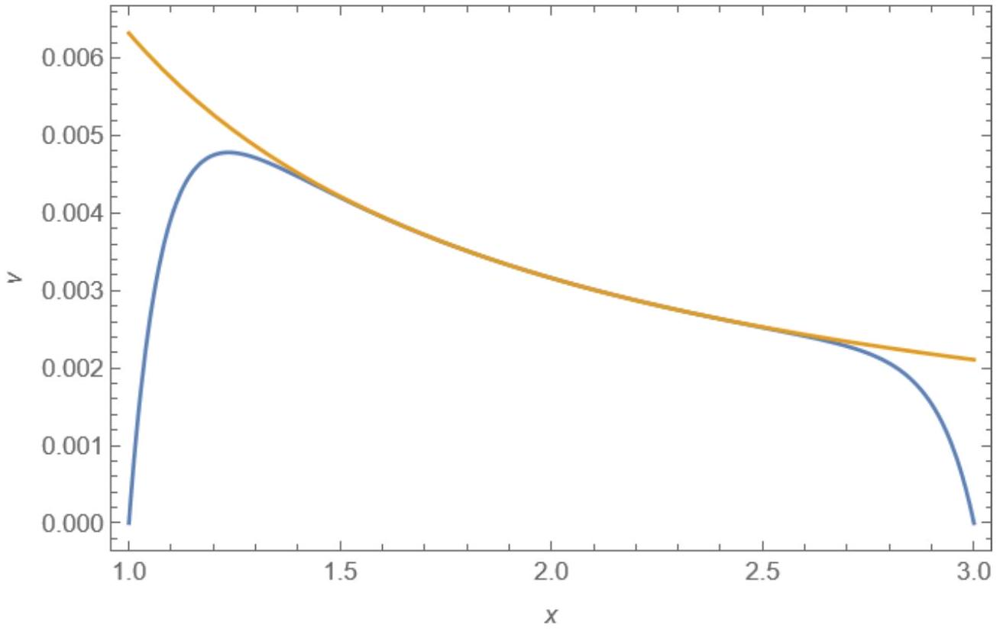

А1 ${ } ^ { 0.30 }$ Пусть $\vec { v }$ - скорость жидкости в некоторой точке пространства. Чему равна плотность тока $\vec { j }$ в данной точке пространства? Ответ выразите через $\sigma , \vec { E }$, $\vec { B } \cap \vec { v }$.

Со стороны электромагнитного поля на заряд, движущийся со скоростью $\vec { u }$, действует сила $\vec { F } _ { E M }$, равная:

$$
\vec { F } _ { E M } = q ( \vec { E } + [ \vec { v } \times \vec { B } ] ) .
$$

Поскольку скорость движения заряда относительно жидкости является малой:

$$
\vec { u } \approx \vec { v } .
$$

Таким образом:

$$
\vec { F } _ { E M } \approx q ( \vec { E } + [ \vec { v } \times \vec { B } ] ) .
$$

В установившемся режиме:

$$
\vec { F } _ { E M } + \langle \vec { F } \rangle = 0 ,
$$

где $\vec { F }$ - сила, действующая на заряд $q$ со стороны кристаллической решётки.
Тогда для плотности тока $\vec { j }$ находим:

Ответ:

$$
\vec { j } = \sigma ( \vec { E } + [ \vec { v } \times \vec { B } ] ) .
$$

A2 ${ } ^ { 0.20 }$ Определите силу $\vec { f } _ { B }$, действующих на единицу объёма жидкости со стороны магнитного поля. Ответ выразите через $\sigma , \vec { E } , \vec { B }$ и $\vec { v }$.

Сила Ампера, действующая на элемент проводника объёмом $d V$ с током плотностью $\vec { j }$ составляет:

$$
d \vec { F } _ { A } = [ \vec { j } \times \vec { B } ] d V .
$$

Таким образом:

$$
\overrightarrow { f _ { B } } = [ \vec { j } \times \vec { B } ] .
$$

Подставляя выражение для $\vec { j }$, находим:

Ответ:

$$
\vec { f } _ { B } = \sigma ( [ \vec { E } \times \vec { B } ] - [ \vec { B } \times [ \vec { v } \times \vec { B } ] ] )
$$

А3 ${ } ^ { 0.30 }$ Покажите, что если объёмная плотность свободного заряда в любой точке жидкости равна нулю, то и объёмная плотность полного заряда также равна нулю в любой точке жидкости.

Объёмная плотность свободного заряда $\rho _ { \text {св } }$ определяется выражением:

$$
\rho _ { \mathrm { CB } } = ( \nabla , \vec { D } ) ,
$$

где $\vec { D }$ - вектор электростатической индукции.
Таким образом:

$$
( \nabla , \vec { D } ) = 0 .
$$

В линейном однородном диэлектрике выполняется соотношение:

$$
\vec { D } = \varepsilon _ { 0 } \varepsilon \vec { E } .
$$

Из последнего соотношения следует:

$$
( \nabla , \vec { E } ) = \frac { ( \nabla , \vec { D } ) } { \varepsilon _ { 0 } \varepsilon } = 0 .
$$

С другой стороны:

$$
\rho = \varepsilon _ { 0 } ( \nabla , \vec { E } ) = 0 ,
$$

что и требовалось показать.

В1 ${ } ^ { 0.30 }$ Из общефизических соображений найдите, чему равна сила $\overrightarrow { f _ { E } }$, действующая на единицу объёма жидкости со стороны электростатического поля? Ответ обоснуйте.

Из результатов пункте А3 следует, что объёмная плотность поляризационных зарядов равно нулю в любой точке жидкости. Это означает, взаимодействие объёма жидкости с электростатическим полем обусловлено только тем, что вещество жидкости поляризовано.
Сила, действующая на точечный диполь в неоднородном электростатическом поле, равняется:

$$
\vec { F } = ( \vec { p } , \nabla ) \vec { E } .
$$

Поскольку напряжённость электростатического поля внутри жидкости является постоянной, значит и напряжённость электростатического поля, действующего на поляризованный объём жидкости, также является постоянной. Значит, в каждой точке жидкости сила $\overrightarrow { f _ { E } }$ равна нулю.

Ответ:

$$
\overrightarrow { f _ { E } } = 0 .
$$

В2 ${ } ^ { 1.00 }$ Покажите, что зависимость скорости жидкости от координаты $x$ можно представить в виде:

$$
v ( x ) = A \cosh \omega x + B \sinh \omega x + C .
$$

Определите $A , B , C$ и $\omega$. Ответы выразите через $\sigma , \eta , U , B$ и $d$.

Для силы $\vec { f } _ { B }$ имеем:

$$
\vec { f } _ { B } = \sigma \left( [ \vec { E } \times \vec { B } ] - \vec { v } B ^ { 2 } + \vec { B } ( \vec { v } , \vec { B } ) \right) = \sigma \left( \frac { U B } { d } - v B ^ { 2 } \right) \vec { e } _ { z } .
$$

Выделим прямоугольный параллелепипед длиной $l$ высотой $d x$ и запишем его условие стационарного движения:

$$
d F _ { z } = \eta l L \left( \frac { d v ( x + d x ) } { d x } - \frac { d v ( x ) } { d x } \right) + f _ { B z } l L d x = l L d z \left( \eta \frac { d ^ { 2 } v } { d x ^ { 2 } } + \frac { \sigma U B } { d } - \sigma B ^ { 2 } v \right) = 0 ,
$$

откуда:

$$
\frac { d ^ { 2 } v } { d x ^ { 2 } } = \frac { \sigma B ^ { 2 } v } { \eta } - \frac { \sigma U B } { \eta d } .
$$

Вводя величину $u = v - U / ( B d )$, получим:

$$
\frac { d ^ { 2 } u } { d x ^ { 2 } } = \frac { \sigma B ^ { 2 } u } { \eta } \Rightarrow u ( x ) = A \cosh \left( B x \sqrt { \frac { \sigma } { \eta } } \right) + B \sinh \left( B x \sqrt { \frac { \sigma } { \eta } } \right) .
$$

Таким образом:

$$
v ( x ) = A \cosh \left( B x \sqrt { \frac { \sigma } { \eta } } \right) + B \sinh \left( B x \sqrt { \frac { \sigma } { \eta } } \right) + \frac { U } { B d } .
$$

Мы привели зависимость $v ( x )$ к виду, предлагаемому в условии задачи.
Для определения постоянных $A$ и $B$ воспользуемся граничными условиями на поверхностях обкладок:

$$
v ( \pm d / 2 ) = 0 \Rightarrow B = 0 , A = - \frac { U } { B d \cosh \left( \frac { B d } { 2 } \sqrt { \frac { \sigma } { \eta } } \right) } .
$$

Таким образом:

$$
v ( x ) = \frac { U } { B d } \left( 1 - \frac { \cosh \left( B x \sqrt { \frac { \sigma } { \eta } } \right) } { \cosh \left( \frac { B d } { 2 } \sqrt { \frac { \sigma } { \eta } } \right) } \right) .
$$

Ответ:

$$
A = - \frac { U } { B d \cosh \left( \frac { B d } { 2 } \sqrt { \frac { \sigma } { \eta } } \right) } \quad B = 0 \quad C = \frac { U } { B d } \quad \omega = B \sqrt { \frac { \bar { \sigma } } { \eta } } .
$$

Ответ:

$$
v ( x ) = \frac { U } { B d } \left( 1 - \frac { 1 } { \cosh \left( \frac { B d } { 2 } \sqrt { \frac { \sigma } { \eta } } \right) } \right) .
$$

В4 ${ } ^ { 0.40 }$ Получите зависимость $v ( x )$ для случая слабого магнитного поля ( $B d \ll \sqrt { \sigma / \eta }$ ). Определите максимальное значение скорости $v _ { \text {тах } }$. Ответы выразите через $\sigma , \eta , U , B , d$ и $x$.
Постройте качественный график полученной зависимости $v ( x )$. Отметьте на графике все важные точки.

При малых значениях $z$ справедливо приближение:

$$
\cosh z \approx 1 + \frac { z ^ { 2 } } { 2 }
$$

Таким образом:

$$
v ( x ) \approx \frac { U } { B d } \left( 1 - \frac { 1 + \left( B x \sqrt { \frac { \sigma } { \eta } } \right) ^ { 2 } / 2 } { 1 + \left( \frac { B d } { 2 } \sqrt { \frac { \sigma } { \eta } } \right) ^ { 2 } / 2 } \right) ,
$$

откуда:

Ответ:

$$
v ( x ) \approx \frac { \sigma U B } { 2 \eta d } \left( \frac { d ^ { 2 } } { 4 } - x ^ { 2 } \right)
$$

Для $v _ { \max }$ при $x = 0$ имеем:

Ответ:

$$
v _ { \max } \approx \frac { \sigma U B d } { 8 \eta }
$$

График зависимости $v ( x )$ приведён на рисунке ниже:

Ответ:

В5 ${ } ^ { 0.30 }$ Определите максимальное значение скорости жидкости $v _ { \max }$ для случая сильного магнитного поля $( B d \gg \sqrt { \sigma / \eta } )$. Ответ выразите через $\sigma , \eta , U , B$ и $d$.
Постройте качественный график зависимости $v ( x )$ для случая сильного магнитного поля. Отметьте на графике все важные точки.

Обратим внимание, что

$$
\cosh \left( \frac { B d } { 2 } \sqrt { \frac { \sigma } { \eta } } \right) \gg 1
$$

Таким образом:

Ответ:

$$
v _ { \max } \approx \frac { U } { B d }
$$

Практически во всей области скорость жидкости можно считать постоянной, поскольку функция $\cosh x$ очень быстро возрастает при $x \gg 1$. Скорость жидкости достигает практически максимального значения на расстояниях до обкладок, малых по сравнению с $d / 2$. С учётом этого, качественный график зависимости $v ( x )$ приведён на рисунке ниже:

Ответ:

B6 ${ } ^ { 0.30 }$ Получите зависимость массового расхода жидкости $Q$ через поперечное сечение $x y$ конденсатора. Ответ выразите через $\rho , \sigma , \eta , U , B , d$ и $L$.

Для массового расхода $Q$ через аксиальное поперечное сечение имеем:

$$
\begin{gathered}
Q = \rho L \int _ { - d / 2 } ^ { d / 2 } v ( x ) d x = \frac { \rho U L } { B d } \int _ { - d / 2 } ^ { d / 2 } \left( 1 - \frac { \cosh \left( B x \sqrt { \frac { \sigma } { \eta } } \right) } { \cosh \left( \frac { B d } { 2 } \sqrt { \frac { \sigma } { \eta } } \right) } \right) d x = \\
= \frac { \rho U L } { B d } \left( d - \frac { 2 } { B } \sqrt { \frac { \eta } { \sigma } } \frac { \sinh \left( \frac { B d } { 2 } \sqrt { \frac { \sigma } { \eta } } \right) } { \cosh \left( \frac { B d } { 2 } \sqrt { \frac { \sigma } { \eta } } \right) } \right)
\end{gathered}
$$

или же:

Ответ:

$$
Q = \frac { \rho U L } { B } \left( 1 - \frac { \tanh \left( \frac { B d } { 2 } \sqrt { \frac { \sigma } { \eta } } \right) } { \frac { B d } { 2 } \sqrt { \frac { \sigma } { \eta } } } \right)
$$

В7 ${ } ^ { 0.40 }$ Получите приближения для $Q ( B )$ в случаях слабого и сильного магнитного полей ( $B d \ll \sqrt { \sigma / \eta }$ и $B d \gg \sqrt { \sigma / \eta }$ соответственно). Ответы выразите через $\rho , \sigma , \eta , U , B , d$ и $L$.

Рассмотрим случай слабого магнитного поля.
Введём величину $x$ :

$$
x = \frac { B d } { 2 } \sqrt { \frac { \bar { \sigma } } { \eta } } .
$$

При $x \rightarrow 0$ разложение функции $\tanh x$ имеет вид:

$$
\tanh x \approx x - \frac { x ^ { 3 } } { 3 }
$$

Тогда имеем:

$$
1 - \frac { \tanh x } { x } \approx \frac { x ^ { 2 } } { 3 } .
$$

Тогда в случае слабого магнитного поля зависимость $Q ( B )$ имеет вид:

Ответ:

$$
Q ( B ) \approx \frac { \rho \sigma U B d ^ { 2 } L } { 12 \eta }
$$

В случае сильного магнитного поля $\tanh x / x \rightarrow 0$ при $x \rightarrow \infty$.
Таким образом, в случае сильного магнитного поля зависимость $Q ( B )$ имеет вид:

Ответ:

$$
Q ( B ) \approx \frac { \rho U L } { B } .
$$

В8 ${ } ^ { 0.40 }$ Постройте качественный график зависимости массового расхода $Q$ от индукции магнитного поля $B$. Отметьте на графике все важные точки.

Качественный график зависимости $Q ( B )$, полученной в пункте B5, приведён на рисунке ниже.

Ответ:

С1 ${ } ^ { 1.30 }$ Определите проекции на ось $z$ моментов сил $M _ { 1 }$ и $M _ { 2 }$, прикладываемых к внутренней и внешней обкладкам соответственно сторонними силами для поддержания их стационарного движения. Ответ выразите через $\eta , \omega _ { 1 } , \omega _ { 2 } , R _ { 1 } , R _ { 2 }$ и $h$.

Рассмотрим цилиндр радиусом $r$. При стационарном движении проекция на ось $z$ момента сил вязкого трения, действующих на него со стороны внешнего слоя жидкости, не зависит от $r$. При этом необходимо правильно интерпретировать закон вязкости Ньютона, утверждающий, что касательное напряжение в вязкой жидкости прямо пропорционально скорости деформации сдвига:

$$
\tau _ { x y } = \tau _ { y x } = \eta \left( \frac { \partial v _ { x } } { \partial y } + \frac { \partial v _ { y } } { \partial x } \right) .
$$

Введём систему координат $O X Y$ так, как показано на рисунке. Тогда проекции $v _ { x }$ и $v _ { y }$ скорости точки с координатами ( $x , y$ ) определяются выражениями:

$$
v _ { x } = - \omega ( r ) y \quad v _ { y } = \omega ( r ) x .
$$

Если рассматривать точку $A$, для которой $x = r$, а $y = 0$ :

$$
\frac { \partial r } { \partial x } = 1 \quad \frac { \partial r } { \partial y } = 0 .
$$

Тогда:

$$
\begin{gathered}
\frac { \partial v _ { x } } { \partial y } = - \omega ( r ) - y \frac { \partial \omega ( r ) } { \partial y } = - \omega ( r ) - y \frac { d \omega ( r ) } { d r } \frac { \partial r } { \partial y } = - \omega ( r ) . \\
\frac { \partial v _ { y } } { \partial x } = \omega ( r ) + x \frac { \partial \omega ( r ) } { \partial x } = \omega ( r ) + x \frac { d \omega ( r ) } { d r } \frac { \partial r } { \partial x } = \omega ( r ) + r \frac { d \omega ( r ) } { d r } .
\end{gathered}
$$

Таким образом, для касательного напряжения $\tau _ { \varphi }$ получаем:

$$
\tau _ { \varphi } = \eta r \frac { d \omega } { d r } .
$$

Запишем выражение для момента сил вязкого трения $M _ { z }$, действующих со стороны внешнего слоя на внутренний:

$$
M _ { z } = r \cdot 2 \pi r h \tau _ { \varphi } = 2 \pi \eta h r ^ { 3 } \frac { d \omega } { d r } = \mathrm { const }
$$

Интегрируя от поверхности внутреннего цилиндра, получим:

$$
\omega ( r ) - \omega _ { 1 } = \frac { M _ { z } } { 2 \pi \eta h } \int _ { R _ { 1 } } ^ { r } \frac { d r } { r ^ { 3 } } = \frac { M _ { z } } { 4 \pi \eta h } \left( \frac { 1 } { R _ { 1 } ^ { 2 } } - \frac { 1 } { r ^ { 2 } } \right)
$$

Из условия $\omega \left( R _ { 2 } \right) = \omega _ { 2 }$ получим:

$$
\frac { M _ { z } } { 4 \pi \eta h } = \frac { \left( \omega _ { 2 } - \omega _ { 1 } \right) R _ { 1 } ^ { 2 } R _ { 2 } ^ { 2 } } { R _ { 2 } ^ { 2 } - R _ { 1 } ^ { 2 } } .
$$

При этом $M _ { 2 } = M _ { z }$, а $M _ { 1 } = - M _ { z }$, поэтому имеем:

Ответ:

$$
M _ { 1 } = - \frac { 4 \pi \eta h R _ { 1 } ^ { 2 } R _ { 2 } ^ { 2 } \left( \omega _ { 2 } - \omega _ { 1 } \right) } { R _ { 2 } ^ { 2 } - R _ { 1 } ^ { 2 } } , \quad M _ { 2 } = \frac { 4 \pi \eta h R _ { 1 } ^ { 2 } R _ { 2 } ^ { 2 } \left( \omega _ { 2 } - \omega _ { 1 } \right) } { R _ { 2 } ^ { 2 } - R _ { 1 } ^ { 2 } } .
$$

Примечание: Отметим, что данное выражение не зависит от выбора системы отсчёта. В поступательно движущейся системе отсчёта данное утверждение является очевидным.
Если же рассматривать движение жидкости в системе отсчёта, вращающейся с угловой скоростью $\vec { \Omega }$, начало которой движется со скоростью $\vec { v } _ { 0 }$, для относительной скорости имеем:

$$
\vec { v } _ { \text {отн } } = \vec { v } - \left[ \vec { \Omega } \times \vec { r } _ { \text {отн } } \right] - \vec { v } _ { 0 }
$$

Тогда для $v _ { \text {отн } ( x ) }$ и $v _ { \text {отн } ( y ) }$ имеем:

$$
\begin{aligned}
& v _ { \text {OTH } ( x ) } = v _ { x } - \Omega _ { z } y _ { \text {отн } } + \Omega _ { y } z _ { \text {отH } } - v _ { 0 x } . \\
& v _ { \text {отH } ( y ) } = v _ { y } + \Omega _ { z } x _ { \text {отH } } - \Omega _ { y } z _ { \text {отH } } - v _ { 0 y } .
\end{aligned}
$$

Таким образом:

$$
\frac { \partial v _ { \text {отH } ( x ) } } { \partial y _ { \text {отн } } } + \frac { \partial v _ { \text {отH } ( y ) } } { \partial x _ { \text {отн } } } = \frac { \partial v _ { x } } { \partial y _ { \text {отH } } } + \frac { \partial v _ { y } } { \partial x _ { \text {отн } } }
$$

При этом в фиксированный момент времени $d \vec { r } = d \vec { r } _ { \text {отн } }$, поэтому:

$$
\frac { \partial v _ { \mathrm { OTH } ( x ) } } { \partial y _ { \mathrm { OTH } } } + \frac { \partial v _ { \mathrm { OTH } ( y ) } } { \partial x _ { \mathrm { OTH } } } = \frac { \partial v _ { x } } { \partial y } + \frac { \partial v _ { y } } { \partial x } ,
$$

что и требовалось доказать.
В данной задаче наиболее удобно проводить дифференцирование во вращающейся системе отсчёта, в которой рассматриваемый элемент жидкости покоится. В данной системе отсчёта только одна из компонент скорости деформации сдвига не обращается в ноль, поэтому можно записать:

$$
M _ { z } = r F _ { \tau } = r \cdot 2 \pi r h \cdot \eta \cdot \frac { d v _ { \mathrm { OTH } ( \tau ) } } { d r } = \mathrm { const } ,
$$

где $v _ { \text {отн } }$ - относительная скорость слоёв жидкости.
Если $\omega \left( r _ { 0 } \right)$ - угловая скорость вращения жидкости на расстоянии $r _ { 0 }$ от оси цилиндра, имеем:

$$
v ( r ) = \omega ( r ) r \Rightarrow v _ { \text {отн } } ( r ) = v ( r ) - \omega \left( r _ { 0 } \right) r .
$$

Дифференцируя:

$$
\frac { d v _ { \mathrm { OTH } } ( r ) } { d r } = \omega ( r ) + r \frac { d \omega ( r ) } { d r } - \omega \left( r _ { 0 } \right) .
$$

При $r = r _ { 0 }$ получаем:

$$
\frac { d v _ { \text {ОТН } } } { d r } = r \frac { d \omega } { d r } .
$$

Таким образом:

$$
M _ { z } = 2 \pi \eta h r ^ { 3 } \frac { d \omega } { d r } = \text { const. }
$$

С2 ${ } ^ { 0.20 }$ Получите зависимость скорости движения жидкости $v ( r )$ от расстояния $r$ до оси цилиндров. Ответ выразите через $\omega _ { 1 } , \omega _ { 2 } , R _ { 1 } , R _ { 2 }$ и $r$.

Подставляя выражение для $M _ { z }$ в выражение для $\omega ( r )$, получим:

$$
\omega ( r ) = \frac { \omega _ { 2 } R _ { 2 } ^ { 2 } - \omega _ { 1 } R _ { 1 } ^ { 2 } } { R _ { 2 } ^ { 2 } - R _ { 1 } ^ { 2 } } - \frac { \left( \omega _ { 2 } - \omega _ { 1 } \right) R _ { 1 } ^ { 2 } R _ { 2 } ^ { 2 } } { \left( R _ { 2 } ^ { 2 } - R _ { 1 } ^ { 2 } \right) r ^ { 2 } } .
$$

Поскольку $v ( r ) = \omega ( r ) r$, имеем:

Ответ:

$$
v ( r ) = \frac { \left( \omega _ { 2 } R _ { 2 } ^ { 2 } - \omega _ { 1 } R _ { 1 } ^ { 2 } \right) r } { R _ { 2 } ^ { 2 } - R _ { 1 } ^ { 2 } } - \frac { \left( \omega _ { 2 } - \omega _ { 1 } \right) R _ { 1 } ^ { 2 } R _ { 2 } ^ { 2 } } { \left( R _ { 2 } ^ { 2 } - R _ { 1 } ^ { 2 } \right) r } .
$$

D1 ${ } ^ { 0.30 }$ Определите напряжённость электрического поля $\vec { E } ( r )$ в области между цилиндрами на расстоянии $r$ от их оси. Ответ выразите через $U , R _ { 1 } , R _ { 2 } , r$ и $\vec { e } _ { r }$.

Напряжённость электростатического поля внутри жидкости имеет вид:

$$
\vec { E } = \frac { A \vec { e } _ { r } } { r } .
$$

Тогда для напряжения $U$ имеем:

$$
U = A \int _ { R _ { 1 } } ^ { R _ { 2 } } \frac { d r } { r } = A \ln \frac { R _ { 2 } } { R _ { 1 } }
$$

Таким образом:

Ответ:

$$
\vec { E } = \frac { U \vec { e } _ { r } } { r \ln \frac { R _ { 2 } } { R _ { 1 } } } .
$$

D2 ${ } ^ { 0.20 }$ Определите силу $\overrightarrow { f _ { B } }$, действующую на единицу объёма жидкости со стороны магнитного поля. Ответ выразите через $\sigma , U , r , B$, скорость движения жидкости $v ( r ) , \vec { e } _ { r }$ и $\vec { e } _ { \varphi }$.

Воспользуемся выражением, полученным в пункте А2:

$$
\overrightarrow { f _ { B } } = \sigma ( [ \vec { E } \times \vec { B } ] - [ \vec { B } \times [ \vec { v } \times \vec { B } ] ) .
$$

Поскольку $\vec { v } \perp \vec { B }$, получим:

$$
\vec { f } _ { B } = \sigma \left( [ \vec { E } \times \vec { B } ] - B ^ { 2 } \vec { v } \right) .
$$

Поскольку $\vec { B } = - \vec { e } _ { z } B$, получим:

Ответ:

$$
\vec { f } _ { B } = \sigma \left( \frac { U B } { r \ln \frac { R _ { 2 } } { R _ { 1 } } } - B ^ { 2 } v _ { \varphi } \right) \vec { e } _ { \varphi } .
$$

D3 ${ } ^ { 0.40 }$ Из общефизических соображений укажите направление силы $\vec { f } _ { E }$, действующей на единицу объёма жидкости со стороны электростатического поля. В качестве ответа укажите единичный вектор, коллинеарно которому направлена эта сила. Ответ обоснуйте.

Сила $\vec { f } _ { E }$, действующая на единицу объёма жидкости, определяется выражением:

$$
\vec { f } _ { E } = ( \vec { P } , \nabla ) \vec { E } _ { \text {ост } }
$$

где $\vec { E } _ { \text {ост } }$ - напряжённость электростатического поля, действующего на выделенный объём жидкости. При этом $\vec { E } _ { \text {ост } } \sim \vec { E }$, поэтому можно записать:

$$
\vec { f } _ { E } \sim ( \vec { P } , \nabla ) \vec { E } .
$$

Также $\vec { P } \sim \vec { E }$, поэтому мы также можем записать:

$$
\vec { f } _ { E } \sim ( \vec { E } , \nabla ) \vec { E } .
$$

Поскольку $\vec { E } \| \vec { e } _ { r }$, имеем:

$$
\vec { f } _ { E } \sim E _ { r } \frac { \partial \vec { E } } { \partial r } = E _ { r } \frac { d E _ { r } } { d r } \vec { e } _ { r } .
$$

Таким образом:

Ответ: Векторы $\overrightarrow { f _ { E } }$ и $\overrightarrow { e _ { r } }$ - коллинеарные.

Е1 ${ } ^ { 1.60 }$ Получите зависимость скорости движения жидкости $v ( r )$ от расстояния $r$ до оси цилиндров. Ответ выразите через $\sigma , \eta , U , B , R _ { 1 } , R _ { 2 }$ и $r$.

Ограничение, накладываемое на скорости движения жидкости, позволяет записать выражение для $\overrightarrow { f _ { B } }$ следующим образом:

$$
\vec { f } _ { B } \approx \sigma [ \vec { E } \times \vec { B } ] .
$$

Рассмотрим равновесие жидкости между внутренней обкладкой конденсатора и цилиндром радиусом $r$. Пусть со стороны жидкости на внутреннюю обкладку конденсатора относительно оси $z$ действует момент сил, равный $M _ { 1 }$. Тогда из закона сохранения момента импульса относительно оси $z$ имеем:

$$
M ( r ) - M _ { 1 } + M _ { E M } ( r ) = 0 ,
$$

где $M ( r )$ и $M _ { E M } ( r )$ - моменты сил, действующих со стороны внешнего слоя жидкости радиусом $r$ и электромагнитного поля соответственно на выделенный объём жидкости.
При этом:

$$
M ( r ) = 2 \pi \eta h r ^ { 3 } \frac { d \omega } { d r }
$$

Определим $M _ { E M }$ :

$$
M _ { E M } ( r ) = \int _ { V } \left( f _ { B \varphi } + f _ { E \varphi } \right) r d V = \int _ { V } \sigma E B r d V = \frac { 2 \pi h \sigma U B } { \ln \frac { R _ { 2 } } { R _ { 1 } } } \int _ { R _ { 1 } } ^ { r } r d r = \frac { \pi h \sigma U B \left( r ^ { 2 } - R _ { 1 } ^ { 2 } \right) } { \ln \frac { R _ { 2 } } { R _ { 1 } } }
$$

Таким образом:

$$
2 \pi \eta h r ^ { 3 } \frac { d \omega } { d r } = M _ { 1 } - \frac { \pi \sigma U B h \left( r ^ { 2 } - R _ { 1 } ^ { 2 } \right) } { \ln \frac { R _ { 2 } } { R _ { 1 } } }
$$

Интегрируя от внутренней обкладки конденсатора, получим:

$$
\begin{gathered}
\omega ( r ) = \int _ { R _ { 1 } } ^ { r } \frac { M _ { 1 } d r } { 2 \pi \eta h r ^ { 3 } } - \frac { \sigma U B } { 2 \eta \ln \frac { R _ { 2 } } { R _ { 1 } } } \int _ { R _ { 1 } } ^ { r } \left( \frac { 1 } { r } - \frac { R _ { 1 } ^ { 2 } } { r ^ { 3 } } \right) d r = \\
= \frac { M _ { 1 } } { 4 \pi \eta h } \left( \frac { 1 } { R _ { 1 } ^ { 2 } } - \frac { 1 } { r ^ { 2 } } \right) - \frac { \sigma U B } { 2 \eta \ln \frac { R _ { 2 } } { R _ { 1 } } } \left( \ln \frac { r } { R _ { 1 } } - \frac { R _ { 1 } ^ { 2 } } { 2 } \left( \frac { 1 } { R _ { 1 } ^ { 2 } } - \frac { 1 } { r ^ { 2 } } \right) \right) .
\end{gathered}
$$

Из условия $\omega \left( R _ { 2 } \right) = 0$ получим:

$$
\frac { M _ { 1 } } { 4 \pi \eta h } = \frac { R _ { 1 } ^ { 2 } R _ { 2 } ^ { 2 } } { R _ { 2 } ^ { 2 } - R _ { 1 } ^ { 2 } } \frac { \sigma U B } { 2 \eta \ln \frac { R _ { 2 } } { R _ { 1 } } } \left( \ln \frac { R _ { 2 } } { R _ { 1 } } - \frac { 1 } { 2 } \left( 1 - \frac { R _ { 1 } ^ { 2 } } { R _ { 2 } ^ { 2 } } \right) \right) .
$$

Таким образом:

$$
\begin{gathered}
\omega ( r ) = \frac { \sigma U B } { 2 \eta \ln \frac { R _ { 2 } } { R _ { 1 } } } \left( \left( \frac { R _ { 1 } ^ { 2 } R _ { 2 } ^ { 2 } } { R _ { 2 } ^ { 2 } - R _ { 1 } ^ { 2 } } \ln \frac { R _ { 2 } } { R _ { 1 } } - \frac { R _ { 1 } ^ { 2 } } { 2 } + \frac { R _ { 1 } ^ { 2 } } { 2 } \right) \left( \frac { 1 } { R _ { 1 } ^ { 2 } } - \frac { 1 } { r ^ { 2 } } \right) - \ln \frac { r } { R _ { 1 } } \right) = \\
= \frac { \sigma U B } { 2 \eta \ln \frac { R _ { 2 } } { R _ { 1 } } } \left( \frac { R _ { 1 } ^ { 2 } R _ { 2 } ^ { 2 } } { R _ { 2 } ^ { 2 } - R _ { 1 } ^ { 2 } } \ln \frac { R _ { 2 } } { R _ { 1 } } \left( \frac { 1 } { R _ { 1 } ^ { 2 } } - \frac { 1 } { r ^ { 2 } } \right) - \ln \frac { r } { R _ { 1 } } \right)
\end{gathered}
$$

Поскольку $v = \omega ( r ) r$, получим:

Ответ:

$$
v ( r ) = \frac { \sigma U B } { 2 \eta \ln \frac { R _ { 2 } } { R _ { 1 } } } \left( \frac { R _ { 1 } ^ { 2 } R _ { 2 } ^ { 2 } } { R _ { 2 } ^ { 2 } - R _ { 1 } ^ { 2 } } \ln \frac { R _ { 2 } } { R _ { 1 } } \left( \frac { r } { R _ { 1 } ^ { 2 } } - \frac { 1 } { r } \right) - r \ln \frac { r } { R _ { 1 } } \right) .
$$

E2 ${ } ^ { 0.40 }$ Пусть радиус внутренней обкладки равен $R$, а радиус внешней обкладки в несколько (порядка единицы) раз больше. Оцените максимальную величину индукции магнитного поля $B _ { \text {max } }$, при которой полученные вами результаты ещё можно считать применимыми. Ответ выразите через $\sigma , \eta , U$ и $R$.

Результаты начнут искажаться тогда, когда величины $v B _ { \text {max } }$ и $E$ оказываются сопоставимыми по величине, поэтому можно записать:

$$
E \approx v B _ { \max } .
$$

При этом внутри конденсатора:

$$
E \sim \frac { U } { R } \quad v \sim \frac { \sigma U B R } { \eta } .
$$

Подставляя величины $E$ и $v$, получим:

$$
\frac { U } { R } \approx \frac { \sigma U B _ { \max } ^ { 2 } R } { \eta } ,
$$

откуда:

Ответ:

$$
B _ { \max } \approx \sqrt { \frac { \eta } { \sigma R ^ { 2 } } } .
$$

F1 ${ } ^ { 0.90 }$ Получите зависимость $v ( r )$ в случае сильного магнитного поля вдали от обкладок конденсатора. Ответ выразите через $\sigma , \eta , U , B , R _ { 1 } , R 2$ и $r$.

Рассмотрим выражение для силы $\vec { f } _ { B }$ :

$$
\vec { f } _ { B } = \sigma ( E - v B ) B \overrightarrow { e _ { \varphi } } .
$$

В силу очень большой величины индукции магнитного поля скорости движения элементов жидкости будут являться очень малыми. Это значит, что и величина силы $f _ { B }$ должна быть мала, поскольку её момент уравновешивает момент сил вязкого трения, действующих на элементы жидкости.
Поскольку величина $B$ является большой, малость величины силы $f _ { B }$ возможна только при условии малости плотности тока $j$, а значит величины $( E - v B )$. Таким образом, вдали от обкладок конденсатора можно записать:

$$
E ( r ) \approx v ( r ) B .
$$

Подставляя $E ( r )$, получим:

Ответ:

$$
v ( r ) \approx \frac { U } { r B \ln \frac { R _ { 2 } } { R _ { 1 } } }
$$

F2 ${ } ^ { \mathbf { 0 . 6 0 } }$ Постройте качественный график зависимости $v ( r )$ для всех значений $r$ между обкладками конденсатора в случае сильного магнитного поля. Указывать характерные значения при построении графика не обязательно.

Вблизи обкладок конденсатора вид зависимости $v ( r )$ должен быть похож на полученный нами в процессе решения части В. Это означает, что вблизи обкладок конденсатора вид функции $v ( r )$ таков, что она выпукла вверх.
Поскольку вдали от обкладок конденсатора $v \sim 1 / r$, функция $v ( r )$ должна иметь максимум, причём ровно один, после чего она переходит в форму,

напоминающую гиперболу.
Соответствующий график функции $v ( r )$ приведён на рисунке ниже:

Ответ:

На графике приведена зависимость скорости (в условных единицах) от безразмерной переменной $x = r / R _ { 1 }$. Желтым цветом показан график приближенного решения.

Примечание: Получим точное уравнение, описывающее зависимость $v ( r )$.
Рассмотрим жидкость, расположенную между цилиндрами радиусами $r$ и $r + d r$. Условие её стационарного движения запишется следующим образом:

$$
d M _ { z } = 2 \pi \eta h d \left( r ^ { 3 } \frac { d \omega } { d r } \right) + r \cdot 2 \pi r d r h \cdot f _ { B } = 0 .
$$

Поскольку $\omega = v / r$ :

$$
\frac { d \omega } { d r } = \frac { r v ^ { \prime } - v } { r ^ { 2 } } ,
$$

где $v ^ { \prime } = d v / d r$.
Таким образом:

$$
\frac { d } { d r } \left( r ^ { 2 } v ^ { \prime } - r v \right) = - \frac { r ^ { 2 } f _ { B } } { \eta } = - \frac { \sigma r ^ { 2 } E B } { \eta } + \frac { \sigma r ^ { 2 } B ^ { 2 } v } { \eta } = - \frac { \sigma U B r } { \eta \ln \frac { R _ { 2 } } { R _ { 1 } } } + \frac { \sigma B ^ { 2 } r ^ { 2 } v } { \eta } .
$$

Дифференцируя, получим:

$$
2 r v ^ { \prime } + r ^ { 2 } v ^ { \prime \prime } - r v ^ { \prime } - v = - \frac { \sigma U B r } { \eta \ln \frac { R _ { 2 } } { R _ { 1 } } } + \frac { \sigma B ^ { 2 } r ^ { 2 } v } { \eta } ,
$$

откуда:

$$
v ^ { \prime \prime } + \frac { v ^ { \prime } } { r } - \frac { v } { r ^ { 2 } } - \frac { \sigma B ^ { 2 } v } { \eta } = - \frac { \sigma U B } { \eta \ln \frac { R _ { 2 } } { R _ { 1 } } r } .
$$

Точное решение данного уравнения существует, хотя и не выражается через элементарные функции.
Приближённое решение вдали от обкладок конденсатора напрямую следует из полученного нами уравнения. В нём два слагаемых обладают огромным множителем, содержащим $B$, а три других слагаемых в левой части уравнения - не обладают, что сразу приводит к соотношению:

$$
\frac { \sigma B ^ { 2 } v } { \eta } \approx \frac { \sigma U B } { \eta \ln \frac { R _ { 2 } } { R _ { 1 } } r } \Rightarrow v ( r ) \approx \frac { U } { r B \ln \frac { R _ { 2 } } { R _ { 1 } } } .
$$
