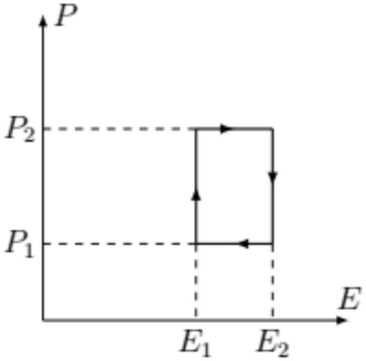
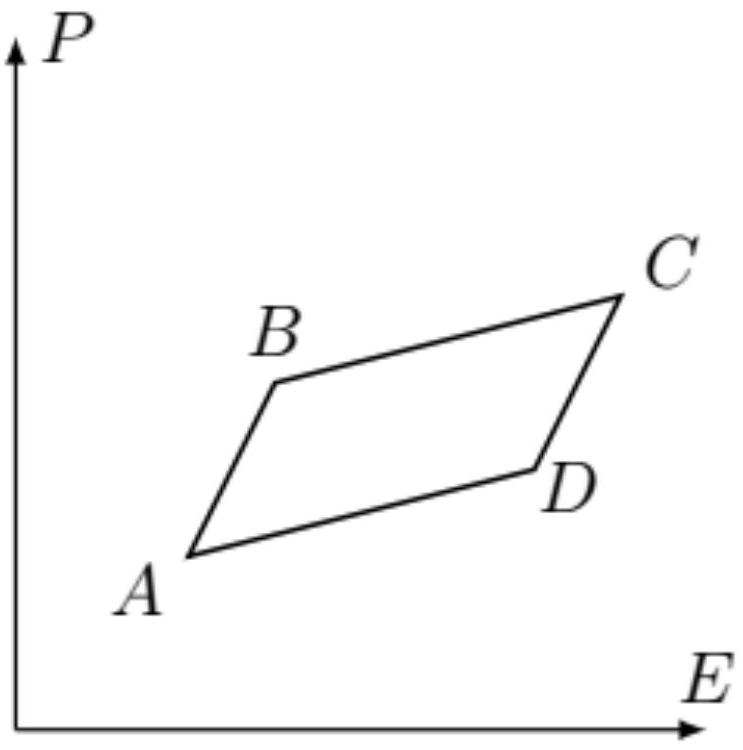
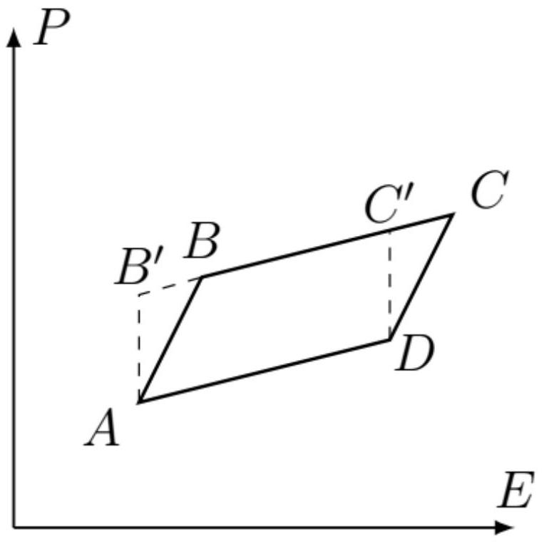
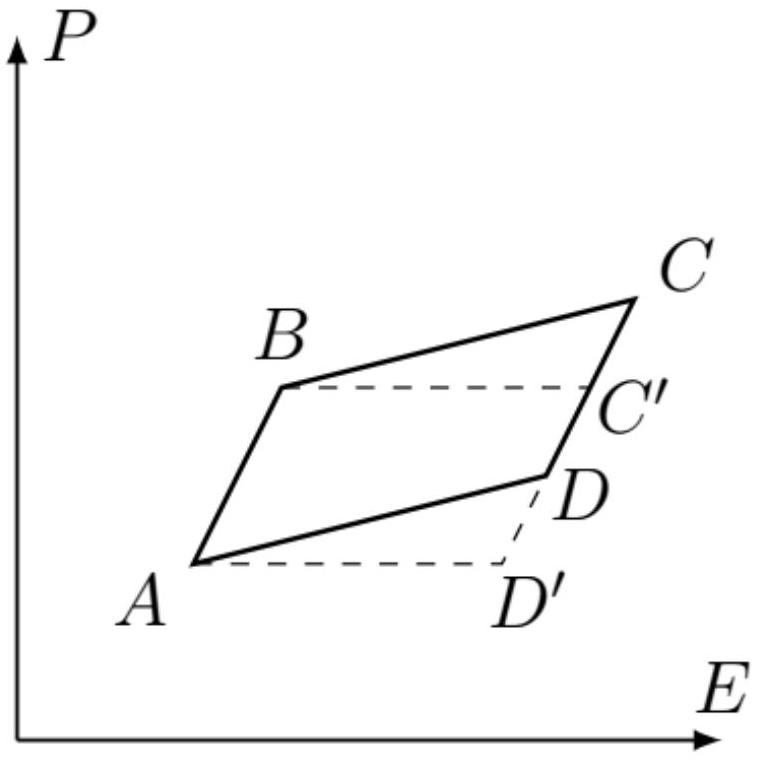
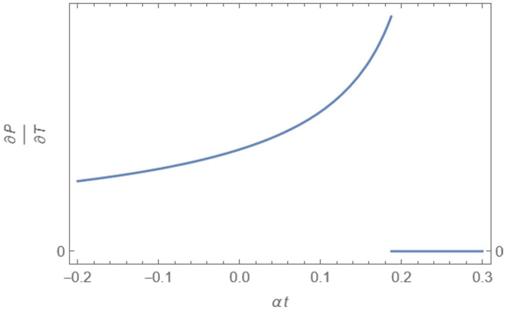
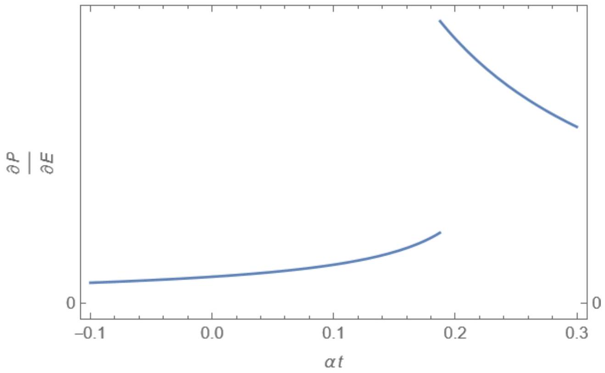

Запишем уравнение состояния идеального газа:

$$
P V = R T .
$$

Выражая из него каждый из параметров и дифференцируя, получаем

$$
\begin{gathered}
P = \frac { R T } { V } , \quad \left( \frac { \partial P } { \partial V } \right) _ { T } = - \frac { R T } { V ^ { 2 } } \\
V = \frac { R T } { P } , \quad \left( \frac { \partial V } { \partial T } \right) _ { P } = \frac { R } { P } \\
T = \frac { P V } { R } , \quad \left( \frac { \partial T } { \partial P } \right) _ { V } = \frac { V } { R }
\end{gathered}
$$

Перемножая производные, получаем

$$
\left( \frac { \partial P } { \partial V } \right) _ { T } \left( \frac { \partial V } { \partial T } \right) _ { P } \left( \frac { \partial T } { \partial P } \right) _ { V } = - \frac { R T } { V ^ { 2 } } \frac { R } { P } \frac { V } { R } = - \frac { R T } { P V } = - 1 .
$$

Аналогично можно вычислить и другую тройку производных

$$
\left( \frac { \partial P } { \partial T } \right) _ { V } = \frac { R } { V } , \quad \left( \frac { \partial V } { \partial P } \right) _ { T } = - \frac { R T } { P ^ { 2 } } , \quad \left( \frac { \partial T } { \partial V } \right) _ { P } = \frac { P } { R } .
$$

Их произведение равно

$$
\left( \frac { \partial P } { \partial T } \right) _ { V } \left( \frac { \partial V } { \partial P } \right) _ { T } \left( \frac { \partial T } { \partial V } \right) _ { P } = \frac { R } { V } \left( - \frac { R T } { P ^ { 2 } } \right) \frac { P } { R } = - \frac { R T } { P V } = - 1 .
$$

Второе тождество можно было и не проверять, поскольку входящие в него производные являются обратными величинами по отношению к производным в первом тождестве (например $( \partial P / \partial T ) _ { V } = 1 / ( \partial T / \partial P ) _ { V }$ ), поэтому их произведение будет равно $1 / ( - 1 ) = - 1$.

Ответ:

$$
\left( \frac { \partial P } { \partial V } \right) _ { T } \left( \frac { \partial V } { \partial T } \right) _ { P } \left( \frac { \partial T } { \partial P } \right) _ { V } = \left( \frac { \partial P } { \partial T } \right) _ { V } \left( \frac { \partial V } { \partial P } \right) _ { T } \left( \frac { \partial T } { \partial V } \right) _ { P } = - 1
$$

Приведем также доказательство формулы (1) в общем случае. Для этого рассмотрим функцию $z = z ( x , y )$. Будем вычислять производную $( \partial x / \partial y ) _ { z }$ при постоянном $z$. Из условия постоянства $z$ получаем

$$
d z = \left( \frac { \partial z } { \partial x } \right) _ { y } d x + \left( \frac { \partial z } { \partial y } \right) _ { x } d y = 0 .
$$

Из этого соотношения находим

$$
\frac { d x } { d y } = \left( \frac { \partial x } { \partial y } \right) _ { z } = - \frac { ( \partial z / \partial x ) _ { y } } { ( \partial z / \partial y ) _ { x } } .
$$

Заметим, что если рассматривать производные просто как отношения бесконечно малых величин, в правой части этого равенства не было бы знака минус. Однако такой подход не работает, поскольку приращения при вычислении производных берутся при различных фиксированных параметрах, иными словами $\Delta z$ в числителе и в знаменателе это разные величины, и их нельзя сокращать. Собирая все множители в одной части, получим окончательно

$$
\left( \frac { \partial x } { \partial y } \right) _ { z } \left( \frac { \partial z } { \partial y } \right) _ { x } \left( \frac { \partial z } { \partial x } \right) _ { y } ^ { - 1 } = \left( \frac { \partial x } { \partial y } \right) _ { z } \left( \frac { \partial z } { \partial y } \right) _ { x } \left( \frac { \partial x } { \partial z } \right) _ { y } = - 1 .
$$

Пусть с сегнетоэлектриком производится цикл (см. рис.), в координатах $E , P$. Определите полное количество теплоты, полученное сегнетоэлектриком за цикл. Выразите ответ через $E _ { 1 } , E _ { 2 } , P _ { 1 } , P _ { 2 } , V$.

$$
\oint d U = \oint \delta Q + V \oint E d D = 0
$$

поскольку изменение внутренней энергии сегнетоэлектрика за цикл равно нулю.
Тогда полное тепло, подведенное в цикле

$$
Q = \oint \delta Q = - V \oint E d D .
$$

Поскольку $D = \varepsilon _ { 0 } E + P$, этот интеграл сводится к

$$
Q = - V \varepsilon _ { 0 } \oint E d E - V \oint E d P = - V \oint E d P .
$$

Здесь интеграл от электрического поля сводится к изменению $E ^ { 2 }$ за период и поэтому равен нулю. Записав подынтегральное выражение как $d ( E P ) - P d E$, получим с учетом того, что изменение произведения $E P$ за цикл также равно нулю

$$
Q = V \oint P d E .
$$

Обе последних формулы годятся для вычисления теплоты. Из них следует, что она равна площади графика, изображающего цикл в координатах $E , P$. Если использовать последнее выражение, вклад в интеграл дадут только горизонтальные участки

$$
Q = V P _ { 2 } \left( E _ { 2 } - E _ { 1 } \right) - V P _ { 1 } \left( E _ { 2 } - E _ { 1 } \right) = V \left( P _ { 2 } - P _ { 1 } \right) \left( E _ { 2 } - E _ { 1 } \right) .
$$

Ответ:

$$
Q = V \left( P _ { 2 } - P _ { 1 } \right) \left( E _ { 2 } - E _ { 1 } \right)
$$

A3 ${ } ^ { 0.40 }$
Теперь рассмотрим цикл ABCD (см. рис.), имеющий вид бесконечно малого параллелограмма. Укажите направление обхода цикла, при котором полученное сегнетоэлектриком за цикл количество теплоты будет положительным. Ответ обоснуйте.

Согласно результатам предыдущего пункта, работа равна площади параллелограмма $A B C D$ с точностью до знака. Запишем интеграл для количества теплоты в виде

$$
Q = V \oint P d E .
$$

Интеграл $\int P d E$ по некоторому участку положителен, если интегрирование производится в направлении возрастания электрического поля (если $P > 0$ ). Поэтому для положительности интеграла участок с большим $P$ должен обходиться в положительном направлении, а с меньшим - в отрицательном. Поэтому цикл должен обходиться по часовой стрелке, то есть в направлении $A B C D$

Ответ: Направление обхода: $A B C D$

д4 ${ } ^ { 0.50 }$ Пусть $B C$ и $A D$ - изотермы, причем на участке $B C$ температура сегнетоэлектрика равна $T _ { 1 }$, а на участке $A D - T _ { 2 } , \left| T _ { 1 } - T _ { 2 } \right| \ll T _ { 1 }$. Выразите полученное сегнетоэлектриком за весь цикл количество теплоты $Q$ через $V , ( \partial P / \partial T ) _ { E }$ (производная поляризации при постоянном электрическом поле), $T _ { 1 }$, $T _ { 2 }$ и разность электрических полей в точках $D$ и $A : d E = E _ { D } - E _ { A } \approx E _ { C } - E _ { B }$.

Искомое количество теплоты равно площади параллелограмма $A B C D$, умноженной на объем сегнетоэлектрика. Проведем через точки $A$ и $D$ цикла вертикальные прямые, продолжим их до пересечения со стороной $B c$ параллелограмма. Тогда площади треугольников $A B ^ { \prime } B$ и $D C ^ { \prime } C$ равны, поэтому вместо вычисления площади исходного параллелограмма можно искать площадь $A B ^ { \prime } C ^ { \prime } D$. Она равна произведению длины стороны $A B ^ { \prime }$ на перпендикулярную ей высоту, которая равна разности $d E$ электрических полей в точке $D$ и $A$. Длина стороны $A B ^ { \prime }$ представляет собой разность поляризаций на двух изотермах при постоянном электрическом поле $E = E _ { A }$ :

$$
P _ { B } ^ { \prime } - P _ { A } = \left( \frac { \partial P } { \partial E } \right) _ { T } \left( T _ { 1 } - T _ { 2 } \right) .
$$

Поэтому окончательно для теплоты получаем

$$
Q = V \left( \frac { \partial P } { \partial T } \right) _ { E } \left( T _ { 1 } - T _ { 2 } \right) d E
$$

Ответ:

$$
Q = V \left( \frac { \partial P } { \partial T } \right) _ { E } \left( T _ { 1 } - T _ { 2 } \right) d E
$$

А5 ${ } ^ { 0.50 }$ В условиях предыдущего пункта найдите тепло $Q _ { + }$, которое подводится к сегнетоэлектрику за цикл. Укажите, на какой из изотерм тепло подводится, а на какой - отводится. Выразите ответ через $V , T _ { 1 } , T _ { 2 } , \Delta E , ( \partial S / \partial E ) _ { T }$ (производная энтропии по электрическому полю при постоянной температуре).

Поскольку изменение энтропии сегнетоэлектрика за цикл должно быть равно нулю, верно равенство

$$
\frac { Q _ { + } } { T _ { + } } + \frac { Q _ { - } } { T _ { - } } = 0
$$

где $T _ { + }$- температура изотермы, на которой тепло подводится, $T _ { - }$- на которой тепло отводится, $Q _ { - }$- отведенное тепло. Поскольку полное подведенное за цикл тепло $Q = Q _ { + } + Q _ { - } > 0 , Q _ { + } > \left| Q _ { - } \right|$. Отсюда следует, что $T _ { + } > T _ { - }$. Поскольку на изотерме с температурой $T _ { 1 }$ значения поляризации больше, а производная поляризации по температуре (при постоянном электрическом поле) отрицательна, получаем $T _ { 1 } < T _ { 2 }$, а значит тепло подводится на изотерме $D A$ . Поскольку подведенное тепло связано с изменением энтропии единицы объема соотношением $Q _ { + } = V T _ { 2 } d S$, получаем

$$
Q _ { + } = - V \left( \frac { \partial S } { \partial E } \right) _ { T } T _ { 2 } d E
$$

Знак минус связан с тем, что на рассматриваемом участке электрическое поле уменьшается.

Ответ:

$$
Q _ { + } = - V \left( \frac { \partial S } { \partial E } \right) _ { T } T _ { 2 } d E
$$

A6 ${ } ^ { 0.30 }$ Используя формулу для коэффициента полезного действия для цикла Карно, а также результаты $A 4$, $A 5$, докажите соотношение (2). Считайте, что полное количество теплоты, полученное сегнетоэлектриком за цикл, совпадает с полезной работой.

Коэффициент полезного действия по определению равен

$$
\eta = \frac { Q } { Q _ { + } } .
$$

С другой стороны для цикла Карно он равен

$$
\eta = \frac { T _ { 2 } - T _ { 1 } } { T _ { 2 } } .
$$

Приравняв эти выражения, получим

$$
Q = \frac { T _ { 2 } - T _ { 1 } } { T _ { 2 } } Q _ { + }
$$

откуда

$$
V \left( \frac { \partial P } { \partial E } \right) _ { T } \left( T _ { 1 } - T _ { 2 } \right) d E = - V \left( \frac { \partial S } { \partial E } \right) _ { T } T _ { 2 } d E \frac { T _ { 2 } - T _ { 1 } } { T _ { 2 } } .
$$

Сокращая множитель $d E$ и разность температур, получим требуемое соотношение

$$
\left( \frac { \partial P } { \partial T } \right) _ { E } = \left( \frac { \partial S } { \partial E } \right) _ { T }
$$

Заметим, что можно было бы не ссылаться на формулу для коэффициента полезного действия цикла Карно, а использовать равенство нулю изменению энтропии за цикл, записанное в решении предыдущего пункта:

$$
\frac { Q _ { + } } { T _ { 2 } } + \frac { Q _ { - } } { T _ { 1 } } = 0 , \quad Q _ { - } = - \frac { T _ { 1 } } { T _ { 2 } } Q _ { + }
$$

откуда

$$
Q = Q _ { + } + Q _ { - } = Q _ { + } \left( 1 - \frac { T _ { 1 } } { T _ { 2 } } \right)
$$

Ответ:

$$
\left( \frac { \partial P } { \partial T } \right) _ { E } = \left( \frac { \partial S } { \partial E } \right) _ { T } .
$$

A7 ${ } ^ { 0.60 }$ Выразите полученное сегнетоэлектриком за весь цикл количество теплоты $Q$ через объем $V$, изменение электрического поля на изотерме $d E = E _ { B } - E _ { A } \approx E _ { C } - E _ { D }$, температуры $T _ { 1 } , T _ { 2 }$ и частные производные $( \partial E / \partial T ) _ { P } , ( \partial P / \partial E ) _ { T }$. Примечание: вам может потребоваться связать между собой изменение электрического поля на изотерме с изменением поляризации с помощью частной производной при постоянной температуре.

Аналогично пункту $A 4$ проведем через точки $A$ и $B$ горизонтальные прямые. Тогда подведенное тепло будет равно умноженной на объем $V$ площади параллелограмма $A B C ^ { \prime } D ^ { \prime }$ (поскольку площади треугольников $B C C ^ { \prime }$ и $A D D ^ { \prime }$ одинаковы). Эта площадь в свою очередь будет равна произведения длины отрезка $A D ^ { \prime }$ на перпендикулярную ему высоту, которая равна разности поляризаций в точках $A$ и $B$,

$$
P _ { B } - P _ { A } = \left( \frac { \partial P } { \partial E } \right) _ { T } d E
$$

Длина отрезка $A D ^ { \prime }$ равна

$$
\left( \frac { \partial E } { \partial T } \right) _ { P } \left( T _ { 2 } - T _ { 1 } \right) .
$$

Окончательно получаем

$$
Q = V \left( \frac { \partial P } { \partial E } \right) _ { T } \left( \frac { \partial E } { \partial T } \right) _ { P } \left( T _ { 2 } - T _ { 1 } \right) d E .
$$

Ответ:

$$
Q = V \left( \frac { \partial P } { \partial E } \right) _ { T } \left( \frac { \partial E } { \partial T } \right) _ { P } \left( T _ { 2 } - T _ { 1 } \right) d E
$$

А8 ${ } ^ { 0.50 }$ Используя тождество (1) для тройки переменных $E , P , T$, выразите теплоту $Q$ из предыдущего пункта через $V , T _ { 1 } , T _ { 2 } d E$ и $( \partial P / \partial T ) _ { E }$.

Запишем тождество в нужных координатах

$$
\left( \frac { \partial P } { \partial E } \right) _ { T } \left( \frac { \partial E } { \partial T } \right) _ { P } \left( \frac { \partial T } { \partial P } \right) _ { E } = - 1 ,
$$

откуда

$$
\left( \frac { \partial P } { \partial E } \right) _ { T } \left( \frac { \partial E } { \partial T } \right) _ { P } = - \left( \frac { \partial P } { \partial T } \right) _ { E } .
$$

Ответ:

$$
Q = - V \left( \frac { \partial P } { \partial T } \right) _ { E } \left( T _ { 2 } - T _ { 1 } \right) d E
$$

А9 ${ } ^ { 0.50 }$ Запишите выражение для тепла $Q _ { + }$, подведенного в цикле. Выразите ответ через $V , T _ { 1 } , T _ { 2 } , \Delta E , ( \partial S / \partial E ) _ { T }$ (производная энтропии по электрическому полю при постоянной температуре).

Как и в пункте $A 5$, тепло подводится на участке с большей температурой. Проведя вертикальную прямую $E =$ const , как и в пункте $A 5$ получим, что температуре $T _ { 1 }$ отвечает большая поляризация, чем температуре $T _ { 2 }$, а значит $T _ { 2 } > T _ { 1 }$. Значит тепло подводится на изотерме с температурой $T _ { 2 }$, подведенное тепло равно

$$
Q _ { + } = - T _ { 2 } \left( \frac { \partial S } { \partial E } \right) _ { T } d E
$$

Если же больше температура $T _ { 1 }$ (этому случаю отвечает другой знак производной $( \partial P / \partial T ) _ { E }$, поэтому его рассматривать не требовалось), подведенное тепло

$$
Q _ { + } = T _ { 1 } \left( \frac { \partial S } { \partial E } \right) _ { T } d E
$$

Различие знаков связано с тем, что на участке $A B$ электрическое поле возрастает, а на участке $C D$ - убывает.

Ответ:

$$
Q _ { + } = - V T _ { 2 } \left( \frac { \partial S } { \partial E } \right) _ { T } d E
$$

А10 ${ } ^ { 0.30 }$ Используя результаты $A 8$, $A 9$ и формулу для коэффициента полезного действия цикла Карно, докажите для рассматриваемого случая формулу (2). Определение полезной работы такое же, как в $A 6$.

В случае $T _ { 2 } > T _ { 1 }$ из формулы для кпд цикла Карно следует

$$
Q _ { + } \left( 1 - \frac { T _ { 1 } } { T _ { 2 } } \right) = Q
$$

откуда получаем

$$
- V T _ { 2 } \left( \frac { \partial S } { \partial E } \right) _ { T } d E \left( 1 - \frac { T _ { 1 } } { T _ { 2 } } \right) = - V \left( \frac { \partial P } { \partial T } \right) _ { E } \left( T _ { 2 } - T _ { 1 } \right) d E
$$

откуда получаем формулу (2).
Если же $T _ { 2 } < T _ { 1 }$,

$$
Q _ { + } \left( 1 - \frac { T _ { 2 } } { T _ { 1 } } \right) = Q
$$

откуда

$$
V T _ { 1 } \left( \frac { \partial S } { \partial E } \right) _ { T } d E \left( 1 - \frac { T _ { 2 } } { T _ { 1 } } \right) = - V \left( \frac { \partial P } { \partial T } \right) _ { E } \left( T _ { 2 } - T _ { 1 } \right) d E
$$

откуда также следует необходимое соотношение.

Ответ:

$$
\left( \frac { \partial P } { \partial T } \right) _ { E } = \left( \frac { \partial S } { \partial E } \right) _ { T } .
$$

Отметим, что эту формулу можно получить, и не прибегая к циклам Карно. Для этого запишем первое начало термодинамики, выразив подведенное количество теплоты через изменение энтропии:

$$
d U = V T d S + V E d D .
$$

Множитель $V$ в первом слагаемом связан с тем, что под $S$ подразумевается энтропия единицы объема сегнетоэлектрика Нас не интересует энергия электрического поля, поэтому рассмотрим отдельно величину

$$
U _ { 1 } = U - V \frac { \varepsilon _ { 0 } E ^ { 2 } } { 2 } ,
$$

для нее при постоянном объеме получаем

$$
d U _ { 1 } = d U - V \varepsilon _ { 0 } E d E = V T d S + V E d \left( D - \varepsilon _ { 0 } E \right) = V T d S + V E d P .
$$

Теперь введем свободную энергию Гиббса, которая в данном случае определяется как

$$
G = U _ { 1 } - V T S - V E P .
$$

Ее дифференциал равен

$$
d G = V T d S + V E d P - V ( d T ) S - V T d S - V ( d E ) P - V E d P = - V S d T - V P d E .
$$

Из этой формулы следует, что температуру и поляризацию вещества можно выразить как частные производные свободной энергии:

$$
V S = - \left( \frac { \partial G } { \partial T } \right) _ { E } , \quad V P = - \left( \frac { \partial G } { \partial E } \right) _ { T } .
$$

Воспользуемся теперь тем, что смешанные производные не зависят от порядка дифференцирования:

$$
\frac { \partial } { \partial E } \left( \frac { \partial G } { \partial T } \right) _ { E } = \frac { \partial } { \partial T } \left( \frac { \partial G } { \partial E } \right) _ { T } = \frac { \partial ^ { 2 } G } { \partial T \partial E } .
$$

Здесь при вычислении производной по одному из аргументов другой предполагается постоянным.
Из этого тождества сразу следует

$$
- V \left( \frac { \partial S } { \partial E } \right) _ { T } = - V \left( \frac { \partial P } { \partial T } \right) _ { E } ,
$$

то есть формула (2).

A11 ${ } ^ { 0.70 }$ Используя формулу (2) (ее можно применять без доказательства) и соотношение (1) для тройки переменных $S , T , E$, получите формулу

$$
\left( \frac { \partial T } { \partial E } \right) _ { S } = - \frac { T } { C _ { E } } \left( \frac { \partial P } { \partial T } \right) _ { E } .
$$

Здесь $C _ { E }$ - теплоемкость единицы объема сегнетоэлектрика при постоянном электрическом поле

$$
C _ { E } = \left( \frac { \delta Q } { d T } \right) _ { E } .
$$

Эта формула показывает, что можно изменить температуру сегнетоэлектрика, адиабатически изменяя электрическое поле.

Запишем соотношение для требуемых переменных:

$$
\left( \frac { \partial T } { \partial E } \right) _ { S } \left( \frac { \partial E } { \partial S } \right) _ { T } \left( \frac { \partial S } { \partial T } \right) _ { E } = - 1 .
$$

Перепишем его в виде

$$
\left( \frac { \partial T } { \partial E } \right) _ { S } = - \left( \frac { \partial S } { \partial E } \right) _ { T } \left( \frac { \partial S } { \partial T } \right) _ { E } ^ { - 1 }
$$

Выразив подведенное тепло через энтропию $\delta Q = T d S$, получим формулу для теплоемкости

$$
C _ { E } = T \left( \frac { \partial S } { \partial T } \right) _ { E } .
$$

Производную энтропии по электрическому полю выразим через производную поляризации по формуле (2) и получим окончательно

Ответ:

$$
\left( \frac { \partial T } { \partial E } \right) _ { S } = - \frac { T } { C _ { E } } \left( \frac { \partial P } { \partial T } \right) _ { E }
$$

В1 ${ } ^ { 1.40 }$ Найдите положения равновесия иона в потенциале. Выразите ответ через $x _ { 0 } , a _ { 2 } , a _ { 4 } , a _ { 6 }$. Найдите количество положений равновесия в зависимости от значения $a _ { 2 }$ и укажите, какие из них устойчивы.

В положении равновесия сила, действующая на ион должна быть равна нулю:

$$
F = - \frac { \partial U } { \partial x } ,
$$

откуда (здесь $y = x / x _ { 0 }$ )

$$
\frac { U _ { 0 } } { x _ { 0 } } \left( a _ { 2 } y - a _ { 4 } y ^ { 3 } + a _ { 6 } y ^ { 5 } \right) = 0
$$

У этого уравнения всегда есть решение $y = 0$, остальные положения равновесия можно найти из биквадратного уравнения

$$
a _ { 6 } y ^ { 4 } - a _ { 4 } y ^ { 2 } + a _ { 2 } = 0 ,
$$

его корни

$$
y ^ { 2 } = \frac { 1 } { 2 a _ { 6 } } \left( a _ { 4 } \pm \sqrt { a _ { 4 } ^ { 2 } - 4 a _ { 6 } a _ { 2 } } \right) .
$$

Физический смысл имеют только вещественные решения, поэтому дискриминант уравнения должен быть положительным, то есть эти решения могут существовать только при

$$
a _ { 2 } < \frac { a _ { 4 } ^ { 2 } } { 4 a _ { 6 } } .
$$

Величина $y ^ { 2 }$ также положительна, поэтому нас интересуют только положительные корни квадратного уравнения. При $a _ { 2 } > 0$ оба корня положительны, поэтому у биквадратного уравнения 4 вещественных корня (т.е. еще 4 положения равновесия). Если же $a _ { 2 } < 0$, меньшее из значений $y ^ { 2 }$ отрицательно и не имеет физического смысла. Поэтому в этом случае существуют только положения равновесия, отвечающие большему из корней.

Итого в общем случае есть 5 положений равновесия:

$$
\begin{gathered}
x _ { 1 } = 0 \quad ( \text { существует всегда } ) ; \\
x _ { 2,3 } = \pm x _ { 0 } \sqrt { \frac { 1 } { 2 a _ { 6 } } \left( a _ { 4 } + \sqrt { a _ { 4 } ^ { 2 } - 4 a _ { 6 } a _ { 2 } } \right) } \quad \text { существует при } a _ { 2 } < \frac { a _ { 4 } ^ { 2 } } { 4 a _ { 6 } } ; \\
x _ { 4,5 } = \pm x _ { 0 } \sqrt { \frac { 1 } { 2 a _ { 6 } } \left( a _ { 4 } - \sqrt { a _ { 4 } ^ { 2 } - 4 a _ { 6 } a _ { 2 } } \right) } \quad \text { существует при } 0 < a _ { 2 } < \frac { a _ { 4 } ^ { 2 } } { 4 a _ { 6 } } .
\end{gathered}
$$

Устойчивость положения равновесия определяется тем, отвечает оно максимуму или минимуму потенциала. Поэтому положение $x _ { 1 }$ устойчиво при $a _ { 2 } > 0$, положения $x _ { 2,3 }$ устойчивы во всей области, где они существуют, положения равновесия $x _ { 4,5 }$ неустойчивы. При определении максимумов и минимумов можно использовать, что если у многочлена нет кратных корней, его максимумы и минимумы чередуются.

Ответ: $x _ { 1 } = 0$ - существует всегда, устойчиво при $a _ { 2 } > 0 ; x _ { 2,3 } = \pm x _ { 0 } \sqrt { \frac { 1 } { 2 a _ { 6 } } \left( a _ { 4 } + \sqrt { a _ { 4 } ^ { 2 } - 4 a _ { 6 } a _ { 2 } } \right) }$ - существует и устойчиво при $a _ { 2 } < \frac { a _ { 4 } ^ { 2 } } { 4 a _ { 6 } }$;
$x _ { 4,5 } = \pm x _ { 0 } \sqrt { \frac { 1 } { 2 a _ { 6 } } \left( a _ { 4 } - \sqrt { a _ { 4 } ^ { 2 } - 4 a _ { 6 } a _ { 2 } } \right) }$ - существует при $0 < a _ { 2 } < \frac { a _ { 4 } ^ { 2 } } { 4 a _ { 6 } }$, неустойчиво. При $a _ { 2 } > a _ { 4 } ^ { 2 } / \left( 4 a _ { 6 } \right)$ положение равновесия одно, при
$0 < a _ { 2 } < a _ { 4 } ^ { 2 } / \left( 4 a _ { 6 } \right)$ положений равновесия 5 , при $a _ { 2 } < 0$ положений равновесия 3 .

В2 ${ } ^ { 0.70 }$ Численно определите, начиная с какого значения $a _ { 2 c }$ минимально возможному значению потенциальной энергии отвечает ненулевое значение $x$. Опишите использованный метод. Используйте численные значения $a _ { 4 } = 1 , a _ { 6 } = 1$.

Положениям равновесия, отличающиеся только знаками смещения, отвечает одна и та же энергия, поэтому их можно рассматривать вместе. При $a _ { 2 } < a _ { 4 } ^ { 2 } / \left( 4 a _ { 6 } \right)$ есть 3 устойчивых положения равновесия. Энергия состояния с $x = x _ { 1 }$ равна нулю, ее нужно сравнить с энергией состояния $x = x _ { 2 }$. Для заданного $a _ { 2 }$ можно вычислить значение $x _ { 2 }$ и отвечающую ему энергию. Критическому значению $a _ { 2 c }$ отвечает точка, для которой $U \left( x _ { 2 } \right) = 0$. Ее можно найти например методом деления отрезка пополам. Соответствующее значение $a _ { 2 c } \approx 0.1875$. Оказывается, существует и точный аналитический ответ $a _ { 2 c } = 3 / 16$.

Ответ:

$$
a _ { 2 c } = \frac { 3 } { 16 } \approx 0.1875
$$

Вз ${ } ^ { 0.40 }$ Найдите зависимость спонтанной поляризации сегнетоэлектрика $P$ от температуры. Выразите ответ через $n , q , x _ { 0 } , a _ { 4 } , a _ { 6 } , \alpha$ и обезразмеренную температуру $t = \left( T - T _ { c } \right) / T _ { c }$ Считайте, что в результате взаимодействия все ионы при поляризации смещаются в одну и ту же сторону.

Спонтанная поляризация выражается через смещение ионов как

$$
P = n q x .
$$

При $a > a _ { 2 c }$ (т.е. при $t > a _ { 2 c } / \alpha$ ) единственное положение равновесия $x = 0$, поэтому $P = 0$. При $a < a _ { 2 c }$

$$
P = \pm n q x _ { 0 } \sqrt { \frac { 1 } { 2 a _ { 6 } } \left( a _ { 4 } + \sqrt { a _ { 4 } ^ { 2 } - 4 a _ { 6 } \alpha t } \right) }
$$

Ответ:

$$
P = \pm n q x _ { 0 } \sqrt { \frac { 1 } { 2 a _ { 6 } } \left( a _ { 4 } + \sqrt { a _ { 4 } ^ { 2 } - 4 a _ { 6 } \alpha t } \right) } \left( \alpha t < a _ { 2 c } \right) ; \quad P = 0 \left( \alpha t > a _ { 2 c } \right)
$$

В4 ${ } ^ { 0.70 }$ Используя результаты предыдущих пунктов, вычислите производную поляризации по температуре при электрическом поле, равном нулю $( \partial P / \partial T ) _ { E = 0 }$. Выразите ответ через $n , q , x _ { 0 } , a _ { 4 } , a _ { 6 } , \alpha , t$ и $T _ { c }$. Постройте график зависимости этой производной от $t$, укажите характерные точки. При расчете координат точек используйте численные данные из $B 2$. Влиянием на ионы собственного электрического поля, создаваемого сегнетоэлектриком, можно пренебречь.

Дифференцируя полученное в предыдущем пункте выражение, получим

$$
\left( \frac { \partial P } { \partial T } \right) _ { E } = \pm \frac { n q x _ { 0 } } { T _ { c } \sqrt { 2 a _ { 6 } } } \frac { - a _ { 6 } \alpha } { \sqrt { a _ { 4 } + \sqrt { a _ { 4 } ^ { 2 } - 4 a _ { 6 } \alpha t } } \sqrt { a _ { 4 } ^ { 2 } - 4 a _ { 6 } \alpha t } }
$$

Выражение применимо при $\alpha t < a _ { c }$, иначе производная тождественно равна нулю. График модуля этой производной представляет собой функцию с монотонно возрастающим модулем. Модуль производной максимален в точке фазового перехода. Если выбрать положение равновесия таким образом, что $P > 0$, производная отрицательна, максимальное значение равно

$$
\left( \frac { \partial P } { \partial T } \right) _ { E } = \frac { 2 } { \sqrt { 3 } } \frac { n q x _ { 0 } \alpha } { T _ { c } } .
$$

Ответ:

В5 ${ } ^ { 1.30 }$ Пусть теперь к сегнетоэлектрику приложили слабое внешнее электрическое поле $E$. Тогда изменение поляризации диэлектрика можно считать линейным по полю. Запишите уравнение, из которого можно найти положения равновесия при включенном электрическом поле. Найдите из этого уравнения поляризуемость

$$
\alpha = \left( \frac { \partial P } { \partial E } \right) _ { T , E = 0 } .
$$

Выразите ответ через $n , q , x _ { 0 } , U _ { 0 } , a _ { 4 } , a _ { 6 } , \alpha , t$ и положение равновесия иона без учета электрического поля $x$. Постройте график зависимости поляризуемости от обезразмеренной температуры $t$, укажите характерные точки. При расчете координат точек используйте численные данные из $B 3$.

Суммарная сила, действующая на ион со стороны электрического поля и со стороны потенциала должна быть равна нулю:

$$
q E - \frac { \partial U } { \partial x } = 0 ,
$$

откуда условие равновесия

$$
\frac { U _ { 0 } } { x _ { 0 } } \left( a _ { 2 } y - a _ { 4 } y ^ { 3 } + a _ { 6 } y ^ { 5 } \right) = q E
$$

По условию правая часть мала, решение мало отличается от решения при нулевом поле. Если начальная равновесная координата равна нулю, нелинейными слагаемыми можно пренебречь, получим

$$
y = \frac { q x _ { 0 } } { U _ { 0 } a _ { 2 } } E .
$$

Пусть без электрического поля решение уравнения $y = y _ { 0 }$, а после включения поля $y = y _ { 0 } + \delta y$. Раскладывая уравнение до первого порядка по $\delta y$, получим

$$
\left( a _ { 2 } y _ { 0 } - a _ { 4 } y _ { 0 } ^ { 3 } + a _ { 6 } y _ { 0 } ^ { 5 } \right) + \left( a _ { 2 } - 3 a _ { 4 } y _ { 0 } ^ { 2 } + 5 a _ { 6 } y _ { 0 } ^ { 4 } \right) \delta y = \frac { q x _ { 0 } } { U _ { 0 } } E .
$$

Первое слагаемое равно нулю, поскольку $y _ { 0 }$ - решение уравнения без электрического поля, окончательно получаем

$$
\delta y = \frac { 1 } { a _ { 2 } - 3 a _ { 4 } y _ { 0 } ^ { 2 } + 5 a _ { 6 } y _ { 0 } ^ { 4 } } \frac { q x _ { 0 } } { U _ { 0 } } E .
$$

Поляризуемость связана с $y$ соотношением

$$
P = n q x = n q x _ { 0 } y ,
$$

поэтому

$$
\frac { \partial P } { \partial E } = n q x _ { 0 } \frac { \partial y } { \partial E } = \frac { 1 } { \alpha t - 3 a _ { 4 } \left( x ^ { 2 } / x _ { 0 } ^ { 2 } \right) + 5 a _ { 6 } \left( x ^ { 4 } / x _ { 0 } ^ { 4 } \right) } \frac { n q ^ { 2 } x _ { 0 } ^ { 2 } } { U _ { 0 } } .
$$

Если температура выше критической, равновесное значение $x = 0$, а если ниже, то значение $x$ описывается формулой из $B 1$. При критической температуре производная испытывает скачок:

$$
\left. \frac { \partial P } { \partial E } \right| _ { \alpha t > a _ { c } } = \frac { 16 } { 3 } \frac { n q ^ { 2 } x _ { 0 } ^ { 2 } } { U _ { 0 } } , \left. \quad \frac { \partial P } { \partial E } \right| _ { \alpha t < a _ { c } } = \frac { 4 } { 3 } \frac { n q ^ { 2 } x _ { 0 } ^ { 2 } } { U _ { 0 } } .
$$

При заданных численных параметрах производная убывает при удалении температуры от критической. При этом на равных расстояниях производная больше при температурах выше критической.

Ответ:

