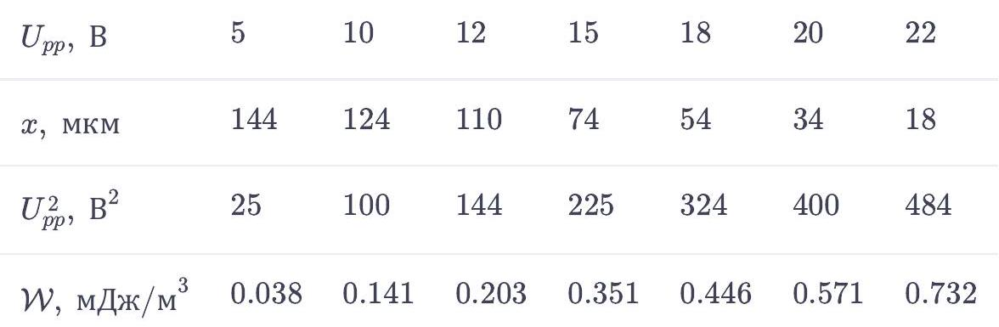
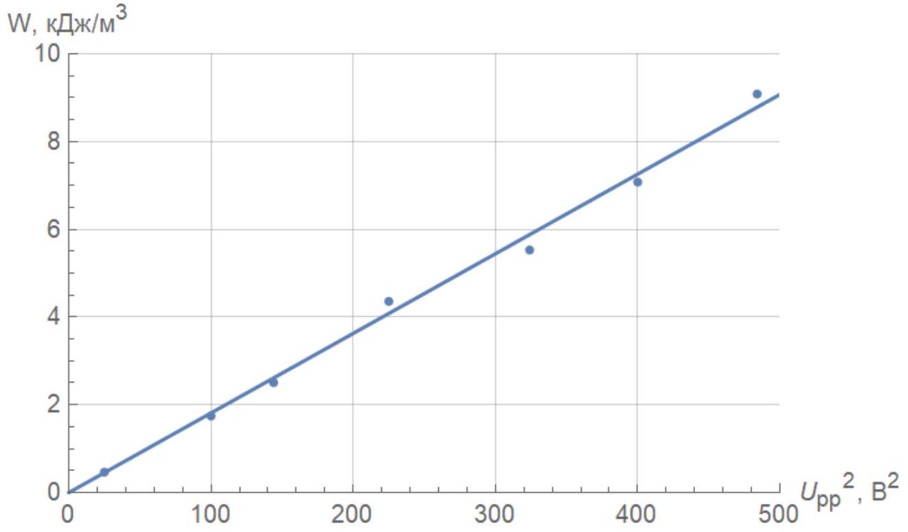

Относительное изменение объёма сегментов газовой среды

$$
\varepsilon ( x , t ) \equiv \frac { \partial u } { \partial x } = \operatorname { Re } \left( - i k u _ { m } e ^ { i ( \omega t - k x ) } \right) .
$$

Поскольку колебания изоэнтропичны, то

$$
\left( p ( x , t ) - p _ { 0 } \right) / p _ { 0 } + \gamma \varepsilon ( x , t ) = 0 \Longrightarrow p _ { m } / p _ { 0 } + \gamma \cdot \left( - i k u _ { m } \right) = 0 \Longrightarrow
$$

Ответ:

$$
p _ { m } = i k \gamma p _ { 0 } u _ { m }
$$

А2 ${ } ^ { 0.30 }$ Выразите скорость звука $c$ в газе через $\gamma , \rho _ { 0 }$ и $p _ { 0 }$.

Рассматриваем динамику элемента среды:

$$
\frac { \mathrm { d } F } { \mathrm {~d} x \mathrm {~d} S } = - \frac { \partial p } { \partial x } = - k ^ { 2 } \gamma p _ { 0 } u _ { m } = \rho _ { 0 } \ddot { u } = - \rho _ { 0 } \omega ^ { 2 } u = - \rho _ { 0 } k ^ { 2 } c ^ { 2 } u \Longrightarrow
$$

Ответ:

$$
c = \sqrt { \gamma p _ { 0 } / \rho _ { 0 } }
$$

А3 ${ } ^ { 0.30 }$ Выразите $p _ { m }$ через $\omega , c , \rho _ { 0 }$ и $u _ { m }$.

Подставляя $\gamma p _ { 0 } = \rho _ { 0 } c ^ { 2 }$ в результат А1, получим:

Ответ:

$$
p _ { m } = i \omega c \rho _ { 0 } u _ { m }
$$

A4 ${ } ^ { 0.50 }$ Получите выражение для средней плотности потока энергии $\mathcal { J }$ в такой волне. Выразите ответ через $\rho _ { 0 } , c , \omega$ и $u _ { m }$.

Поток энергии можно найти, усреднив мощность среды на единицу площади. Мощность среды

$$
N = p \frac { \partial u } { \partial t } = \left( p _ { 0 } + \operatorname { Re } \left( i \omega c \rho _ { 0 } u _ { m } e ^ { i ( \omega t - k x ) } \right) \right) \cdot \operatorname { Re } \left( i \omega u _ { m } e ^ { i ( \omega t - k x ) } \right) .
$$

Усредняя по времени, получим:

Ответ:

$$
\mathcal { J } = \frac { 1 } { 2 } \rho _ { 0 } c \omega ^ { 2 } \left| u _ { m } \right| ^ { 2 }
$$

A5 ${ } ^ { 0.30 }$ Запишите выражение для давления $\delta p ( x , t )$ в такой стоячей волне. Выразите ответ через $\omega , c , \rho _ { 0 } , u _ { m } , x$ и $t$.

Стоячая волна может быть представлена как суперпозиция двух бегущих волн $u _ { m } \operatorname { Re } \left( e ^ { i ( \omega t - k x ) } \right) + u _ { m } \operatorname { Re } \left( e ^ { i ( \omega t + k x ) } \right)$. Тогда давление выразится как

$$
p ( x , t ) = p _ { 0 } + u _ { m } \operatorname { Re } \left( i \omega c \rho _ { 0 } e ^ { i ( \omega t - k x ) } \right) - u _ { m } \operatorname { Re } \left( i \omega c \rho _ { 0 } e ^ { i ( \omega t + k x ) } \right) .
$$

Упрощая, получим:

Ответ:

$$
\delta p ( x , t ) = 2 \rho _ { 0 } \omega c u _ { m } \sin ( k x ) \cos ( \omega t )
$$

В1 ${ } ^ { 0.80 }$ Запишите приближенное выражение для давления $\delta p _ { \text {Euler } } \left( x _ { 0 } , t \right)$ в рассматриваемой стоячей волне в случае $\left| \frac { \partial u } { \partial x } \right| \ll 1$. Выразите ответ через $c , \omega , \rho _ { 0 }$, $u _ { m } , t$ и $x _ { 0 }$.

Запишем точное выражение $x _ { 0 } = x + u ( x , t )$. В случае малых смещений можно заменить $x$ на $x _ { 0 }$ в аргументе $u$, т.е. $x = x _ { 0 } - u \left( x _ { 0 } , t \right) = x _ { 0 } - 2 u _ { m } \cos ( k x ) \cos ( \omega t )$. Подставляя это выражение в результат предыдущего пункта, получаем

$$
\delta p ( x , t ) = 2 \rho _ { 0 } \omega c u _ { m } \sin \left( k x _ { 0 } - 2 k u _ { m } \cos ( k x ) \cos ( \omega t ) \right) \cos ( \omega t ) .
$$

Раскрывая в первом порядке, получаем ответ:

Ответ:

$$
\delta p _ { E u l e r } \left( x _ { 0 } , t \right) = 2 \rho _ { 0 } \omega c u _ { m } \sin ( k x ) \cos ( \omega t ) - 4 \rho _ { 0 } u _ { m } ^ { 2 } \omega ^ { 2 } \cos ^ { 2 } ( k x ) \cos ^ { 2 } ( \omega t ) ^ { 2 }
$$

В2 ${ } ^ { \mathbf { 0 . 4 0 } }$ Получите выражение для среднего давления $\overline { \delta p } \left( x _ { 0 } \right)$ стоячей волны в фиксированной точке пространства. Выразите ответ через $\omega , c , \rho _ { 0 } , u _ { m }$ и $x _ { 0 }$.

В результате усреднения $\overline { \cos ( \omega t ) } = 0 , \overline { \cos ^ { 2 } ( \omega t ) } = 0$, поэтому:

Ответ:

$$
\overline { \delta p } \left( x _ { 0 } \right) = - 2 \rho _ { 0 } \omega ^ { 2 } \left| u _ { m } \right| ^ { 2 } \cos ^ { 2 } \left( k x _ { 0 } \right)
$$

Вз ${ } ^ { 0.80 }$ Запишите выражение для силы $F \left( x _ { 0 } \right)$, которая действует на частицу. (Полученное выражение и есть акустическая сила.) Запишите выражение для потенциала этой силы. Выразите ответ через $\omega , c , \rho _ { 0 } , u _ { m } , x _ { 0 }$ и $a$.

Сила, которая действует на тело при наличии градиента давления (также известная как сила Архимеда) даётся выражением

$$
F = - V \frac { \partial p } { \partial x } .
$$

Таким образом, средняя сила, действующая на частицу, будет равна ( $V = 4 \pi a ^ { 3 } / 3$ ):

Ответ:

$$
F \left( x _ { 0 } \right) = - \frac { 8 \pi } { 3 } \frac { \rho _ { 0 } a ^ { 3 } \omega ^ { 3 } \left| u _ { m } \right| ^ { 2 } } { c } \sin \left( 2 k x _ { 0 } \right)
$$

С1 ${ } ^ { 0.50 }$ Найдите, при каком минимальном $\left| u _ { m } \right| _ { c r }$ возможна левитация частицы в волне. В ответ могут войти $a , \rho _ { 0 } , \gamma , p _ { 0 }$, частота звука $f _ { 0 }$, плотность частицы $\rho$ и ускорение свободного падения $g$.

Левитация станет возможна, если $\max _ { x _ { 0 } } F \left( x _ { 0 } \right) = m g = \frac { 4 \pi } { 3 } a ^ { 3 } \rho g$. Подставляя $c = \sqrt { \gamma p _ { 0 } / \rho _ { 0 } } , \omega = 2 \pi f _ { 0 }$, получаем:

Ответ:

$$
\left| u _ { m } \right| _ { c r } = \sqrt { \frac { \rho g } { 16 \pi ^ { 3 } f _ { 0 } ^ { 3 } \rho _ { 0 } } \sqrt { \frac { \gamma p _ { 0 } } { \rho _ { 0 } } } }
$$

C2 ${ } ^ { 0.50 }$ Найдите численно $\left| u _ { m } \right| _ { c r }$ для параметров установки.

Ответ:

$$
\left| u _ { m } \right| _ { c r } \approx 16 \text { мкм }
$$

Поскольку стоячая волна - это суперпозиция двух бегущих, можно найти громкость одной бегущей волны. Используя результат пункта А4, имеем:

$$
D _ { 1 } = 120 + 10 \log _ { 10 } \left( \frac { 1 } { 2 } \sqrt { \gamma p _ { 0 } \rho _ { 0 } } \cdot 4 \pi ^ { 2 } f _ { 0 } ^ { 2 } \left| u _ { m } \right| ^ { 2 } \right) .
$$

Так как бегущих волны две, громкость в стоячей волне будет на $10 \log _ { 10 } 2$ дБ больше. Итого:

Ответ:

$$
D = 120 + 10 \log _ { 10 } \left( \sqrt { \gamma p _ { 0 } \rho _ { 0 } } \left( 2 \pi f _ { 0 } \left| u _ { m } \right| \right) ^ { 2 } \right) \approx 146 \text { дБ }
$$

Громкость получилась реалистичной =)

D1 ${ } ^ { 0.30 }$ Из соображений размерности получите выражение для характерной толщины пограничного слоя $\delta$ с точностью до численного коэффициента, который в дальнейшем принимается равным единице. Выразите ответ через $\eta , \rho _ { 0 }$ и $f _ { 0 }$.

Метод размерностей: $[ \eta ] =$ Па $\cdot \mathrm { c } = \frac { \text { Кг } } { \mathrm { M } \cdot \mathrm { c } } , \left[ f _ { 0 } \right] = \mathrm { c } ^ { - 1 } , [ \delta ] = \mathrm { m }$.

Ответ:

$$
\delta = \sqrt { \eta / \rho _ { 0 } f _ { 0 } }
$$

D2 ${ } ^ { 0.50 }$ Для установки, описанной в предыдущей части, найдите отношение массы воздуха в пограничном слое $m _ { \text {вяз } }$ к массе шарика $m _ { 0 }$.
Вязкость воздуха $\eta = 1.8 \cdot 10 ^ { - 5 }$ Па $\cdot$ с.

Оценим $\delta \approx 5 \cdot 10 ^ { - 5 }$ м $\ll a$, поэтому $m _ { \text {вяз } } / m _ { 0 } = S \delta \rho _ { 0 } / V \rho \Longrightarrow$

Ответ:

$$
m _ { \text {вяз } } / m _ { 0 } = \frac { 3 \sqrt { \eta \rho _ { 0 } / f _ { 0 } } } { a \rho } \approx 5.8 \cdot 10 ^ { - 4 }
$$

Е1 ${ } ^ { 0.30 }$ Выразите среднюю плотность звуковой энергии $\mathcal { W }$ в резонаторе через $\rho _ { 0 } , \omega$ и $u _ { m }$.

Стоячая волна - это суперпозиция двух бегущих. В каждой волне плотность энергии (кинетической + потенциальной) равна $\mathcal { W } _ { 1 } = \frac { 1 } { 2 } \rho _ { 0 } \omega ^ { 2 } \left| u _ { m } \right| ^ { 2 }$. Таким образом, полная средняя плотность энергии равна

Ответ:

$$
\mathcal { W } = \rho _ { 0 } \omega ^ { 2 } \left| u _ { m } \right| ^ { 2 }
$$

E2 ${ } ^ { 1.00 }$ Получите зависимость положения шарика от времени $x ( t )$, если в начальный момент времени $x ( t = 0 ) = x _ { 0 }$. Ответ выразите через $x _ { 0 } , t , w , a , c , \mathcal { W }$, $\eta$ и частоту колебаний $f _ { 0 }$.

Поскольку по условию резонаторы высокодобротные, амплитуда колебаний их стенок (пьезоэлементов) должна быть намного меньше, чем амплитуда колебаний элементов среды в резонаторе. Иными словами, на границах резонатора будут находиться узлы смещения, и стоячая волна будет описываться так же, как в предыдущих частях. Поскольку шарики безынерционные, в любой момент времени должно выполняться

$$
- \frac { 8 \pi } { 3 } \frac { \rho _ { 0 } a ^ { 3 } \omega ^ { 3 } \left| u _ { m } \right| ^ { 2 } } { c } \sin ( 2 \pi x / w ) = 6 \pi \eta a \frac { \mathrm {~d} x } { \mathrm {~d} t } .
$$

Подставляя $\xi = \pi x / w$, получаем:

$$
- \frac { 16 \pi ^ { 2 } } { 9 } \frac { a ^ { 2 } f _ { 0 } \mathcal { W } } { w \eta c } \mathrm {~d} t = \frac { ( 2 \xi ) } { \sin ( 2 \xi ) }
$$

Интегрируем:

$$
\int \frac { \mathrm { d } ( 2 \xi ) } { \sin ( 2 \xi ) } = \ln \operatorname { tg } ( \xi ) \Longrightarrow
$$

Ответ:

$$
x ( t ) = \frac { w } { \pi } \operatorname { arctg } \left( \operatorname { tg } \left( \frac { \pi x _ { 0 } } { w } \right) \exp \left( - \frac { 16 \pi ^ { 2 } } { 9 } \frac { a ^ { 2 } f _ { 0 } \mathcal { W } } { w \eta c } t \right) \right)
$$

E3 ${ } ^ { 0.40 }$ Выразите среднюю плотность энергии $\mathcal { W }$ звуковой волны в резонаторе через начальную $\left( x _ { 0 } \right)$ и конечную $( x )$ координаты шарика, время его движения $t$ и известные величины ( $w , a , f _ { 0 } , \eta , c$ ).

Ответ:

$$
\mathcal { W } = \frac { 9 } { 16 \pi ^ { 2 } } \frac { w \eta c } { a ^ { 2 } f _ { 0 } t } \ln \left( \frac { \operatorname { tg } \left( \pi x _ { 0 } / w \right) } { \operatorname { tg } ( \pi x / w ) } \right)
$$

F1 ${ } ^ { 0.30 }$ Чему равна рабочая частота $f _ { 0 }$ резонатора? Рабочая частота - это минимальная частота, при которой в резонаторе может возбуждаться стоячая волна.
Скорость звука в воде $c = 1.5$ кМ $/$ с .

По условию рабочая частота - это минимальная частота, при которой в резонаторе может возникнуть стоячая волна вдоль оси $x$. Это значит, что на ширине резонатора $w$ должна укладываться половина волны. Учитывая $c = \lambda f _ { 0 }$, получаем:

Ответ:

$$
f _ { 0 } = \frac { c } { 2 w } \approx 2.0 \text { МГц }
$$

F2 ${ } ^ { 1.50 }$ Найдите $A$. Рассчитайте добротность резонатора $Q$, если на рабочей частоте импеданс пьезоэлементов равен $Z = ( 4 + 3 i ) \cdot 32$ кОм.

Для получения $\mathcal { W }$ через $x , x _ { 0 }$ и $t$ воспользуемся результатами предыдущей части. Для линеаризации построим зависимость $\mathcal { W } \left( U _ { p p } ^ { 2 } \right)$. Пересчитаем точки, занесём в таблицу и построим график:

Угловой коэффициент этого графика будет равен $A$. Фитируя прямой, проходящей через начало координат, получаем:

Ответ:

$$
A \approx 1.47 \frac { \text { МКДж } } { \mathrm { m } ^ { 3 } \cdot \mathrm {~B} ^ { 2 } }
$$

Наконец, свяжем $A$ с добротностью резонатора. Полная энергия, содержащаяся в резонаторе:

$$
E = V \mathcal { W } = l h w \mathcal { W } .
$$

Потери энергии равны мощности, выделяющейся на пьезоэлементах, т.е.

$$
P = \overline { U ( t ) I ( t ) } = \frac { 1 } { 2 } \frac { U _ { p p } ^ { 2 } } { | Z | } \arg Z = \frac { 1 } { 2 } U _ { p p } ^ { 2 } \frac { \operatorname { Re } Z } { | Z | ^ { 2 } } .
$$

По определению добротности

$$
Q \equiv \frac { 2 \pi f _ { 0 } E } { P } = 4 \pi f _ { 0 } \operatorname { lh } w A | Z | ^ { 2 } / \operatorname { Re } Z \Longrightarrow
$$

Ответ:

$$
Q \approx 0.018
$$
