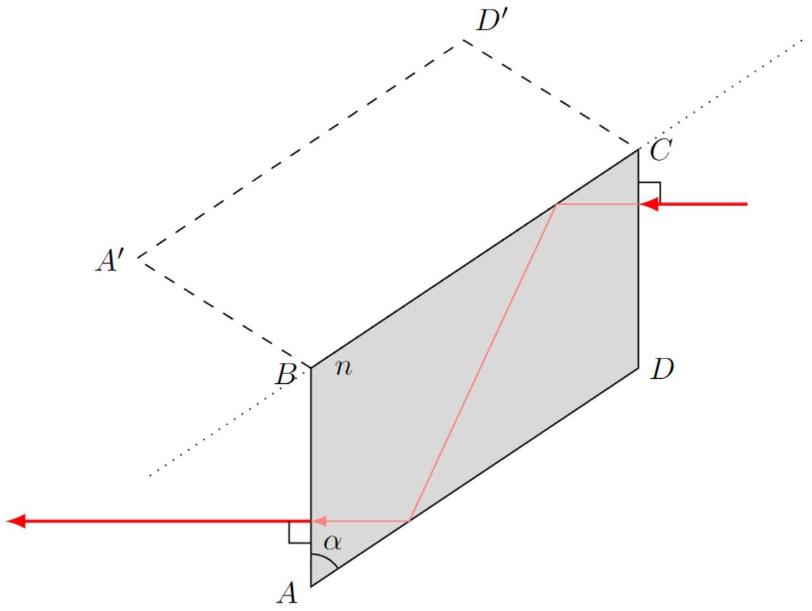
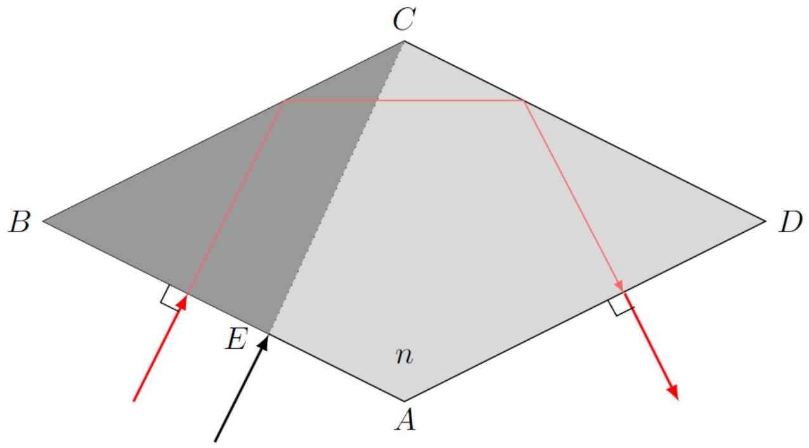
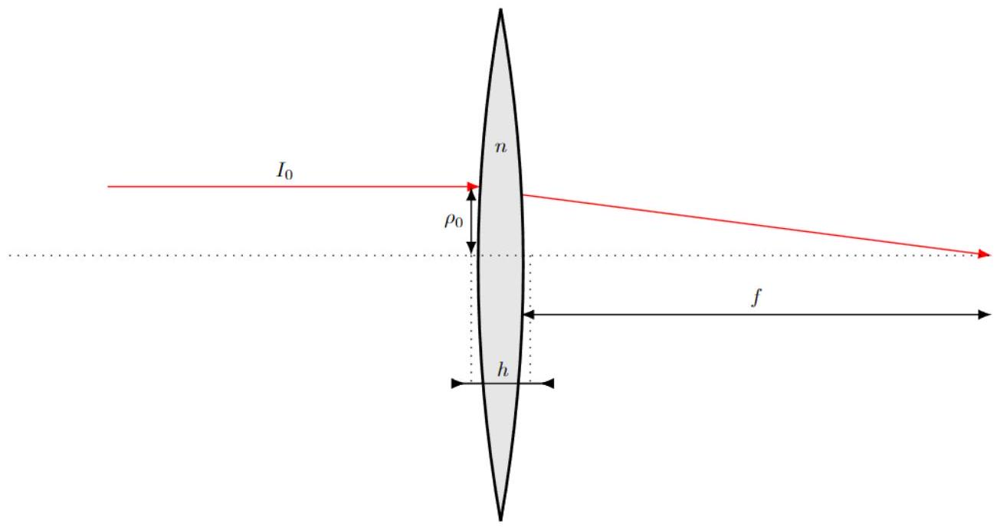

Пусть в веществе с показателем преломления $n$ распространяется плоская электромагнитная волна с амплитудой колебаний $E$ напряжённости электрического поля. Выразите амплитуду колебаний напряжённости $H$ магнитного поля в этой волне через $E$, $n$, а также магнитную и электрическую постоянные $\mu _ { 0 }$ и $\varepsilon _ { 0 }$ соответственно.

В плоской электромагнитной волне объёмные плотности энергий электрического и магнитного поля одинаковы, поэтому:

$$
w _ { M } = \frac { \mu _ { 0 } \mu H ^ { 2 } } { 2 } = w _ { E } = \frac { \varepsilon _ { 0 } \varepsilon E ^ { 2 } } { 2 } .
$$

Для фазовой скорости распространения волны имеем:

$$
v = \frac { c } { n } = \frac { 1 } { \sqrt { \mu _ { 0 } \varepsilon _ { 0 } \mu \varepsilon } } \Rightarrow n = \sqrt { \mu \varepsilon } .
$$

Поскольку $\mu = 1$, для $H$ имеем:

Ответ:

$$
H = n E \sqrt { \frac { \varepsilon _ { 0 } } { \mu _ { 0 } } } .
$$

Какие 4 граничных условия на электрическое и магнитное поля выполняются на границе раздела сред? Запишите их в листы ответов в удобной вам форме.

Из теоремы Гаусса для индукции магнитного поля следует:

Ответ:

$$
B _ { n 1 } = B _ { n 2 } .
$$

Поскольку на границе отсутствуют свободные заряды, из теоремы Гаусса для вектора электрической индукции следует:

Ответ:

$$
D _ { n 1 } = D _ { n 2 } .
$$

Из теоремы о циркуляции для напряжённости электрического поля следует:

Ответ:

$$
E _ { \tau 1 } = E _ { \tau 2 } .
$$

Поскольку на границе раздела отсутствуют сторонние токи, из теоремы о циркуляции для напряжённости магнитного поля следует:

Ответ:

$$
H _ { \tau 1 } = H _ { \tau 2 } .
$$

Все граничные условия, выполняющиеся на границе раздела двух сред, должны быть выполнены в каждой её точке в произвольный момент времени. Исходя из этого докажите следующие равенства:

$$
\omega _ { r } = \omega _ { t } = \omega \quad \theta _ { r } = \theta \quad n _ { 2 } \sin \theta _ { t } = n _ { 1 } \sin \theta .
$$

Каждое из полей в среде 1 является суммой полей в падающей и отражённой волне, а поле в среде 2 является полем прошедшей волны. Тогда каждое из граничных условий имеет вид:

$$
A e ^ { i ( \omega t - \vec { k } \vec { r } ) } + B e ^ { i \left( \omega _ { r } t - \vec { k } _ { r } \vec { r } \right) } = C e ^ { i \left( \omega _ { t } t - \vec { k } _ { t } \vec { r } \right) }
$$

Данные условия должны быть выполнены в любой момент времени, откуда следуют соотношения:

$$
\omega _ { r } = \omega _ { t } = \omega .
$$

Также данные условия должны быть выполнены в любой точке границы раздела сред. Пусть $x$ - ось, направленна на рис.1. и рис.2. вправо. Тогда для выполнения граничных условий в любой точке границы раздела двух сред должны выполняться соотношения:

$$
k _ { r x } = k _ { t x } = k _ { x } .
$$

Волновое число определяется соотношением:

$$
k = \frac { \omega } { v } = \frac { \omega n } { c } .
$$

Отсюда получим:

$$
k _ { x } = \frac { \omega n _ { 1 } \sin \theta } { c } = k _ { r x } = \frac { \omega n _ { 1 } \sin \theta _ { r } } { c } = k _ { t x } = \frac { \omega n _ { 2 } \sin \theta _ { t } } { c } .
$$

Отсюда следуют соотношения:

$$
\theta = \theta _ { r } \quad n _ { 1 } \sin \theta = n _ { 2 } \sin \theta _ { t } .
$$

A4 ${ } ^ { 0.50 }$ Получите выражение для комплексных коэффициентов отражения и прохождения $r _ { s }$ и $t _ { s }$ соответственно в случае $s$-поляризованной волны. Ответы выразите через $n _ { 1 } , n _ { 2 } , \theta$ и $\theta _ { t }$. Выражения для $r _ { s }$ и $t _ { s }$ называются формулами Френеля для $s$-поляризованной волны.

Запишем граничное условие для тангенциальной компоненты напряженности электрического поля:

$$
E _ { \tau 1 } = E _ { 0 } \left( 1 + r _ { s } \right) = E _ { \tau 2 } = E _ { 0 } t _ { s } \Rightarrow 1 + r _ { s } = t _ { s } .
$$

Запишем граничное условие для тангенциальной компоненты напряжённости магнитного поля:

$$
H _ { \tau 1 } = n _ { 1 } \sqrt { \varepsilon _ { 0 } / \mu _ { 0 } } \left( 1 - r _ { s } \right) \cos \theta = H _ { \tau 2 } = n _ { 2 } \sqrt { \varepsilon _ { 0 } / \mu _ { 0 } } t _ { s } \cos \theta _ { t } \Rightarrow n _ { 1 } \left( 1 - r _ { s } \right) \cos \theta = n _ { 2 } t _ { s } \cos \theta _ { t } .
$$

Отсюда находим:

Ответ:

$$
r _ { s } = \frac { n _ { 1 } \cos \theta - n _ { 2 } \cos \theta _ { t } } { n _ { 1 } \cos \theta + n _ { 2 } \cos \theta _ { t } } \quad t _ { s } = \frac { 2 n _ { 1 } \cos \theta } { n _ { 1 } \cos \theta + n _ { 2 } \cos \theta _ { t } } .
$$

А5 ${ } ^ { 0.50 }$ Получите выражение для коэффициентов $r _ { p }$ и $t _ { p }$ в случае $p$-поляризованной волны. Ответы выразите через $n _ { 1 } , n _ { 2 } , \theta$ и $\theta _ { t }$. Выражения для $r _ { p }$ и $t _ { p }$ называются формулами Френеля для $p$-поляризованной волны.

Запишем граничное условие для тангенциальной компоненты напряженности электрического поля:

$$
E _ { \tau 1 } = E _ { 0 } \left( 1 - r _ { p } \right) \cos \theta = E _ { \tau 2 } = E _ { 0 } t _ { p } \cos \theta _ { t } \Rightarrow \left( 1 - r _ { p } \right) \cos \theta = t _ { p } \cos \theta _ { t } .
$$

Запишем граничное условие для тангенциальной компоненты напряжённости магнитного поля:

$$
H _ { \tau 1 } = n _ { 1 } \sqrt { \varepsilon _ { 0 } / \mu _ { 0 } } \left( 1 + r _ { p } \right) = H _ { \tau 2 } = n _ { 2 } \sqrt { \varepsilon _ { 0 } / \mu _ { 0 } } t _ { p } \Rightarrow n _ { 1 } \left( 1 + r _ { p } \right) = n _ { 2 } t _ { p } .
$$

Отсюда находим:

$$
r _ { p } = \frac { n _ { 2 } \cos \theta - n _ { 1 } \cos \theta _ { t } } { n _ { 2 } \cos \theta + n _ { 1 } \cos \theta _ { t } } \quad t _ { p } = \frac { 2 n _ { 1 } \cos \theta } { n _ { 2 } \cos \theta + n _ { 1 } \cos \theta _ { p } } .
$$

А6 ${ } ^ { 0.30 }$ Определите величину $\cos \theta _ { t }$. Ответ выразите через $n _ { 1 } , n _ { 2 }$ и $\theta$.

Введём ось $z$, направленную вертикально вниз. Тогда в произвольной точке пространства:

$$
E _ { t } \sim \exp \left( i \left( \omega t - \vec { k } _ { t } \vec { r } \right) \right) = \exp \left( i \left( \omega t - k _ { t x } x - k _ { t z } z \right) \right) .
$$

Рассмотрим слагаемое $- i k _ { t z }$ :

$$
- i k _ { t z } z = - i k _ { t } z \cos \theta _ { t } .
$$

При этом для $\cos \theta _ { t }$ имеем:

$$
\cos \theta _ { t } = \pm \sqrt { 1 - \frac { n _ { 1 } ^ { 2 } \sin ^ { 2 } \theta } { n _ { 2 } ^ { 2 } } } = \pm \frac { i \sqrt { n _ { 1 } ^ { 2 } \sin ^ { 2 } \theta - n _ { 2 } ^ { 2 } } } { n _ { 2 } } .
$$

Затуханию амплитуды волны соответствует знак -, поэтому:

Ответ:

$$
\cos \theta _ { t } = - \frac { i \sqrt { n _ { 1 } ^ { 2 } \sin ^ { 2 } \theta - n _ { 2 } ^ { 2 } } } { n _ { 2 } } .
$$

$$
r _ { s } = A _ { s } e ^ { i \delta _ { p } } \quad r _ { p } = A _ { p } e ^ { i \delta _ { p } }
$$

Определите $A _ { s } , A _ { p } , \delta _ { s }$ и $\delta _ { p }$. Ответы выразите через $n _ { 1 } , n _ { 2 }$ и $\theta$.

С учётом выражения для $\cos \theta _ { t }$ при полном отражении, выражения для $r _ { s }$ и $r _ { p }$ принимают вид:

$$
r _ { s } = \frac { n _ { 1 } \cos \theta + i \sqrt { n _ { 1 } \sin ^ { 2 } \theta - n _ { 2 } ^ { 2 } } } { n _ { 1 } ^ { 2 } \cos \theta - i \sqrt { n _ { 1 } ^ { 2 } \sin ^ { 2 } \theta - n _ { 2 } ^ { 2 } } } \quad r _ { p } = \frac { n _ { 2 } \cos \theta + \frac { i n _ { 1 } \sqrt { n _ { 1 } ^ { 2 } \sin ^ { 2 } \theta - n _ { 2 } ^ { 2 } } } { n _ { 2 } } } { n _ { 2 } \cos \theta - \frac { i n _ { 1 } \sqrt { n _ { 1 } ^ { 2 } \sin ^ { 2 } \theta - n _ { 2 } ^ { 2 } } } { n _ { 2 } } } .
$$

Модули $r _ { s }$ и $r _ { p }$ равны единице в силу равенств модулей вещественных и мнимых частей числителей и знаменателей. Тогда их запись в показательной форме выглядит следующим образом:

$$
\begin{gathered}
r _ { s } = \exp \left( 2 i \operatorname { arctg } \left( \frac { \sqrt { \sin ^ { 2 } \theta - \left( n _ { 2 } / n _ { 1 } \right) ^ { 2 } } } { \cos \theta } \right) \right) . \\
r _ { p } = \exp \left( 2 i \operatorname { arctg } \left( \frac { \left( n _ { 1 } / n _ { 2 } \right) ^ { 2 } \sqrt { \sin ^ { 2 } \theta - \left( n _ { 2 } / n _ { 1 } \right) ^ { 2 } } } { \cos \theta } \right) \right) .
\end{gathered}
$$

Таким образом:

Ответ:

$$
\begin{gathered}
A _ { s } = 1 \quad A _ { p } = 1 . \\
\delta _ { s } = 2 \operatorname { arctg } \left( \frac { \sqrt { \sin ^ { 2 } \theta - \left( n _ { 2 } / n _ { 1 } \right) ^ { 2 } } } { \cos \theta } \right) \quad \delta _ { p } = 2 \operatorname { arctg } \left( \frac { \left( n _ { 1 } / n _ { 2 } \right) ^ { 2 } \sqrt { \sin ^ { 2 } \theta - \left( n _ { 2 } / n _ { 1 } \right) ^ { 2 } } } { \cos \theta } \right) .
\end{gathered}
$$

А8 ${ } ^ { 0.40 }$ Определите $\delta$. Ответ выразите в виде одной обратной тригонометрической функции через $\theta$ и $n _ { 21 } = n _ { 2 } / n _ { 1 }$.

Воспользуемся выражением для тангенса разности:

$$
\operatorname { tg } ( \alpha - \beta ) = \frac { \operatorname { tg } \alpha - \operatorname { tg } \beta } { 1 + \operatorname { tg } \alpha \operatorname { tg } \beta }
$$

Отсюда:

$$
\operatorname { tg } ( \delta / 2 ) = \frac { \operatorname { tg } \left( \delta _ { p } / 2 \right) - \operatorname { tg } \left( \delta _ { s } / 2 \right) } { 1 + \operatorname { tg } \left( \delta _ { p } / 2 \right) \operatorname { tg } \left( \delta _ { s } / 2 \right) } = \frac { \sqrt { \sin ^ { 2 } \theta - n _ { 21 } ^ { 2 } } \left( n _ { 21 } ^ { - 2 } - 1 \right) } { \cos \theta \left( 1 + \frac { \left( \sin ^ { 2 } \theta - n _ { 21 } ^ { 2 } \right) n _ { 21 } ^ { - 2 } } { \cos ^ { 2 } \theta } \right) } .
$$

Преобразуем полученное выражение:

$$
\operatorname { tg } ( \delta / 2 ) = \frac { \cos \theta \sqrt { \sin ^ { 2 } \theta - n _ { 21 } ^ { 2 } } \left( n _ { 21 } ^ { - 2 } - 1 \right) } { \sin ^ { 2 } \theta \left( n _ { 21 } ^ { - 2 } - 1 \right) } = \frac { \cos \theta \sqrt { \sin ^ { 2 } \theta - n _ { 21 } ^ { 2 } } } { \sin ^ { 2 } \theta } .
$$

Таким образом:

Ответ:

$$
\delta = 2 \operatorname { arctg } \left( \frac { \cos \theta \sqrt { \sin ^ { 2 } \theta - n _ { 21 } ^ { 2 } } } { \sin ^ { 2 } \theta } \right) .
$$

В $1 ^ { 0.10 }$ При каких значениях острого угла $\alpha$ ромба Френеля электромагнитная волна будет испытывать полное отражение от граней ромба Френеля $B C$ и $A D$ ? Выразите ответ через $n$ и рассчитайте его в градусах с точностью до четырёх значащих цифр.

Угол падения на грани $B C$ и $A D$ будет равен $\alpha$, поэтому должно выполняться условие:

$$
n \sin \alpha \leq 1 .
$$

Таким образом:

Ответ:

$$
\alpha \in [ \arcsin ( 1 / n ) ; \pi / 2 ) = \left[ 41.47 ^ { \circ } ; 90 ^ { \circ } \right) .
$$

В2 ${ } ^ { 0.40 }$ При каких значениях угла $\alpha = \alpha ^ { \prime }$ с помощью ромба Френеля можно получить круговую поляризацию из линейной? Выразите ответы через $n$ и рассчитайте их в градусах с точностью до четырёх значащих цифр.

При каждом полном отражении между $p$-поляризацией и $s$-поляризацией возникает сдвиг фаз, равный $\pi / 4$, поэтому:

$$
\operatorname { tg } ( \delta / 2 ) = \operatorname { tg } ( \pi / 8 ) = \sqrt { \frac { 1 - \cos \delta } { 1 + \cos \delta } } = \sqrt { \frac { \sqrt { 2 } - 1 } { \sqrt { 2 } + 1 } } = \sqrt { 2 } - 1 .
$$

Таким образом:

$$
\sqrt { 2 } - 1 = \frac { \cos \alpha ^ { \prime } \sqrt { \sin ^ { 2 } \alpha ^ { \prime } - ( 1 / n ) ^ { 2 } } } { \sin ^ { 2 } \alpha ^ { \prime } }
$$

Отсюда:

$$
\sin ^ { 4 } \alpha ^ { \prime } ( 4 - 2 \sqrt { 2 } ) - \sin ^ { 2 } \alpha ^ { \prime } \left( 1 + ( 1 / n ) ^ { 2 } \right) + ( 1 / n ) ^ { 2 } = 0
$$

Решая квадратное уравнение, получим:

$$
\alpha ^ { \prime } = \arcsin \sqrt { \frac { 1 + ( 1 / n ) ^ { 2 } \pm \sqrt { \left( 1 + ( 1 / n ) ^ { 2 } \right) ^ { 2 } - 4 ( 1 / n ) ^ { 2 } ( 4 - 2 \sqrt { 2 } ) } } { 8 - 4 \sqrt { 2 } } } \approx 48.62 ^ { \circ } , 54.62 ^ { \circ } .
$$

Отметим, что оба угла удовлетворяют условию, полученному в пункте B1 и являются подходящими.

Ответ:

$$
\alpha ^ { \prime } = \arcsin \sqrt { \frac { 1 + ( 1 / n ) ^ { 2 } \pm \sqrt { \left( 1 + ( 1 / n ) ^ { 2 } \right) ^ { 2 } - 4 ( 1 / n ) ^ { 2 } ( 4 - 2 \sqrt { 2 } ) } } { 8 - 4 \sqrt { 2 } } } \approx 48.62 ^ { \circ } , 54.62 ^ { \circ } .
$$

Вз ${ } ^ { 0.30 }$ Пусть пучок света падает на ромб Френеля по всей площади грани $A B$. Угол $\alpha = \alpha ^ { \prime }$. При каких значениях $B C / A B$ ромб Френеля обращает весь пучок лучей (все лучи, попавшие в ромб Френеля через грань $A B$, испытывают два полных отражения)? Рассчитайте ответ с точностью до трёх значащих цифр.

Воспользуемся методом развёртки.
Ромб Френеля обращает весь пучок лучей при условии:

$$
B C \cos \alpha + A B \cos 2 \alpha - A B = 0 \Rightarrow \frac { B C } { A B } = \frac { 2 \sin ^ { 2 } \alpha } { \cos \alpha } .
$$

Таким образом:

Ответ:

$$
\frac { B C } { A B } = \left\{ \begin{array} { l l l }
1.70 & \text { при } & \alpha ^ { \prime } = 48.62 ^ { \circ } \\
2.30 & \text { при } & \alpha ^ { \prime } = 54.62 ^ { \circ }
\end{array} \right.
$$

В4 ${ } ^ { 0.10 }$ При каких значениях угла $\alpha$ ромба Муни электромагнитная волна будет испытывать полное отражение от граней ромба Френеля $B C$ и $C D$ ? Выразите ответ через $n$ и рассчитайте его в градусах с точностью до четырёх значащих цифр.

Угол падения на грани $B C$ и $C D$ будет равен $\alpha$, поэтому должно выполняться условие:

$$
n \sin \alpha \leq 1 .
$$

Таким образом:

Ответ:

$$
\alpha \in [ \arcsin ( 1 / n ) ; \pi / 2 ) = \left[ 41.47 ^ { \circ } ; 90 ^ { \circ } \right) .
$$

В5 ${ } ^ { 0.30 }$ При каких значениях угла $\alpha = \alpha ^ { \prime }$ с помощью ромба Муни можно получить круговую поляризацию из линейной? Выразите ответы через $n$ и рассчитайте их в градусах с точностью до четырёх значащих цифр.

Поскольку количество отражений равняется двум, ответ для данного пункта совпадает с ответом на пункт В2:

Ответ:

$$
\alpha ^ { \prime } = \arcsin \sqrt { \frac { 1 + ( 1 / n ) ^ { 2 } \pm \sqrt { \left( 1 + ( 1 / n ) ^ { 2 } \right) ^ { 2 } - 4 ( 1 / n ) ^ { 2 } ( 4 - 2 \sqrt { 2 } ) } } { 8 - 4 \sqrt { 2 } } } \approx 48.62 ^ { \circ } , 54.62 ^ { \circ } .
$$

В6 ${ } ^ { 0.30 }$ Пусть угол $\alpha = \alpha ^ { \prime }$. Определите максимально возможное значение $\gamma$ отношения площади поперечного сечения пучка, падающего на грань $A B$, к площади грани $A B$, если ромб Муни обращает весь пучок лучей (все лучи, попавшие в ромб Муни через грань $A B$, испытывают два полных отражения). Рассчитайте ответ с точностью до трёх значащих цифр.

Лучи испытывают по два полных отражения при условии их первого попадания на грань $B C$. Пусть $E$ - точка грани $A B$, после прохождения которой луч попадает в точку $C$. Тогда положение точки $E$ определяется соотношением:

$$
B E / B C = B E / A B = \cos \alpha .
$$

При фиксированном значении $\alpha$ максимальное отношение площади поперечного сечения пучка к площади грани $A B$ равно отношению $B E / A B = \cos \alpha$. Имеем:

Ответ:

$$
\gamma _ { \max } = \left\{ \begin{array} { l l l }
0.661 & \text { при } & \alpha ^ { \prime } = 48.62 ^ { \circ } \\
0.579 & \text { при } & \alpha ^ { \prime } = 54.62
\end{array} \right.
$$

С1 ${ } ^ { 0.30 }$ Покажите справедливость следующих соотношений:

$$
r _ { 1 } ^ { \prime } = - r _ { 1 } \quad 1 - r _ { 1 } ^ { 2 } = t _ { 1 } t _ { 1 } ^ { \prime }
$$

Пусть $\psi$ - угол преломления падающей волны. Тогда $\psi$ равен углу падения волны с волновым вектором $\overrightarrow { k ^ { \prime } }$ на границу раздела сред с показателями преломления $n _ { 1 }$ и $n$, а угол преломления равен $\theta$.
В случае $s$-поляризации имеем:

$$
r _ { 1 s } = \frac { n _ { 1 } \cos \theta - n \cos \psi } { n _ { 1 } \cos \theta + n \cos \psi } \quad r _ { 1 s } ^ { \prime } = \frac { n \cos \psi - n _ { 1 } \cos \theta } { n _ { 1 } \cos \theta + n \cos \psi } .
$$

В случае $p$-поляризации имеем:

$$
r _ { 1 p } = \frac { n \cos \theta - n _ { 1 } \cos \psi } { n \cos \theta + n _ { 1 } \cos \psi } \quad r _ { 1 p } ^ { \prime } = \frac { n _ { 1 } \cos \psi - n \cos \theta } { n \cos \theta + n _ { 1 } \cos \psi } .
$$

Таким образом, в обоих случаях равенство $r _ { 1 } ^ { \prime } = - r _ { 1 }$ является выполненным.
Определим $t _ { 1 } ^ { \prime }$ в случае обеих поляризаций:

$$
t _ { 1 s } ^ { \prime } = \frac { 2 n \cos \psi } { n _ { 1 } \cos \theta + n \cos \psi } \quad t _ { 1 p } ^ { \prime } = \frac { 2 n \cos \psi } { n _ { 1 } \cos \psi + n \cos \theta } .
$$

При этом для $t _ { 1 s }$ и $t _ { 1 s }$ имеем:

$$
t _ { 1 s } = \frac { 2 n _ { 1 } \cos \theta } { n _ { 1 } \cos \theta + n \cos \psi } \quad t _ { 1 p } = \frac { 2 n _ { 1 } \cos \theta } { n \cos \theta + n _ { 1 } \cos \psi } .
$$

Отсюда:

$$
\begin{aligned}
& 1 - r _ { 1 s } ^ { 2 } = \frac { 4 n n _ { 1 } \cos \theta \cos \psi } { \left( n _ { 1 } \cos \theta + n \cos \psi \right) ^ { 2 } } = \frac { 2 n _ { 1 } \cos \theta } { n _ { 1 } \cos \theta + n \cos \psi } \cdot \frac { 2 n \cos \psi } { n _ { 1 } \cos \theta + n \cos \psi } = t _ { 1 s } t _ { 1 s } ^ { \prime } . \\
& 1 - r _ { 1 p } ^ { 2 } = \frac { 4 n n _ { 1 } \cos \theta \cos \psi } { \left( n \cos \theta + n _ { 1 } \cos \psi \right) ^ { 2 } } = \frac { 2 n _ { 1 } \cos \theta } { n \cos \theta + n _ { 1 } \cos \psi } \cdot \frac { 2 n \cos \psi } { n \cos \theta + n _ { 1 } \cos \psi } = t _ { 1 p } t _ { 1 p } ^ { \prime } .
\end{aligned}
$$

Таким образом, равенство $1 - r _ { 1 } ^ { 2 } = t _ { 1 } t _ { 1 } ^ { \prime }$ является выполненным.

С2 ${ } ^ { 0.60 }$ Выразите $E _ { r }$ и $E$ через $E _ { 1 } , E ^ { \prime } , r _ { 1 } , r _ { 1 } ^ { \prime } , t _ { 1 }$ и $t _ { 1 } ^ { \prime }$.

Если бы волна с напряжённостью электрического поля $E ^ { \prime }$ отсутствовала, то комплексные амплитуды $E _ { r } ^ { ( 1 ) }$ и $E ^ { ( 1 ) }$ были бы следующими:

$$
E _ { r } ^ { ( 1 ) } = r _ { 1 } E _ { 1 } \quad E ^ { ( 1 ) } = t _ { 1 } E _ { 1 }
$$

Если бы волна с напряжённостью электрического поля $E _ { 1 }$ отсутствовала, то комплексные амплитуды $E _ { r } ^ { ( 2 ) }$ и $E ^ { ( 2 ) }$ были бы следующими:

$$
E _ { r } ^ { ( 2 ) } = r _ { 1 } ^ { \prime } E ^ { \prime } \quad E ^ { ( 2 ) } = t _ { 1 } ^ { \prime } E ^ { \prime }
$$

Результирующие комплексные амплитуды напряжённостей электрических полей находятся из принципа суперпозиции:

Ответ:

$$
E _ { r } = r _ { 1 } E _ { 1 } + t _ { 1 } ^ { \prime } E ^ { \prime } \quad E = t _ { 1 } E _ { 1 } + r _ { 1 } ^ { \prime } E ^ { \prime } .
$$

Поскольку точка $O ^ { \prime }$ смещена относительно точки $O$, комплексные амплитуды $E _ { O ^ { \prime } } , E _ { O ^ { \prime } } ^ { \prime }$ и $E _ { O ^ { \prime } t }$ напряжённостей электрического поля в волнах с волновыми векторами $\vec { k } ^ { \prime } , \vec { k }$ и $\vec { k } _ { t }$ сдвинуты по фазе относительно $E , E ^ { \prime }$ и $E _ { t }$.
Рассматривая волну с волновым вектором $\vec { k } ^ { \prime }$ как отражённую волну с волновым вектором $\vec { k }$, получим:

$$
r _ { 2 } E e ^ { - i k d \cos \psi } = E ^ { \prime } e ^ { i k d \cos \psi }
$$

Аналогично рассматривая волну с волновым вектором $\vec { k } _ { t }$ как прошедшую волну с волновым вектором $\vec { k }$, получим:

$$
t _ { 2 } E e ^ { - i k d \cos \psi } = E _ { t } e ^ { - i k _ { t } d \cos \varphi }
$$

где $\varphi$ - угол преломления волны с волновым вектором $\vec { k }$.
Запишем выражения для $\cos \varphi$ и $\cos \psi$ :

$$
\cos \psi = \frac { \sqrt { n ^ { 2 } - n _ { 1 } ^ { 2 } \sin ^ { 2 } \theta } } { n } \quad \cos \varphi = \frac { \sqrt { n _ { 2 } ^ { 2 } - n _ { 1 } ^ { 2 } \sin ^ { 2 } \theta } } { n _ { 2 } } .
$$

Учтём также соотношение:

$$
k _ { t } = \frac { k n _ { 2 } } { n } .
$$

Окончательно:

Ответ:

$$
\begin{gathered}
E ^ { \prime } = r _ { 2 } E \exp \left( - \frac { 2 i k d \sqrt { n ^ { 2 } - n _ { 1 } ^ { 2 } \sin ^ { 2 } \theta } } { n } \right) \\
E _ { t } = t _ { 2 } E \exp \left( \frac { i k d \left( \sqrt { n _ { 2 } ^ { 2 } - n _ { 1 } ^ { 2 } \sin ^ { 2 } \theta } - \sqrt { n ^ { 2 } - n _ { 1 } ^ { 2 } \sin ^ { 2 } \theta } \right) } { n } \right) .
\end{gathered}
$$

С4 ${ } ^ { 0.60 }$ Используя результаты пунктов С1-С3, определите коэффициент отражения $r = E _ { r } / E _ { 1 }$. Ответ выразите через $r _ { 1 } , r _ { 2 } , n _ { 1 } , n , k , d$ и $\theta$.

Временно будем записывать выражение для $E ^ { \prime }$ через $E$ в следующем виде:

$$
E ^ { \prime } = r _ { 2 } E e ^ { - i \Delta } .
$$

Выразим $E$ через $E _ { 1 }$ :

$$
E = t _ { 1 } E _ { 1 } + r _ { 1 } ^ { \prime } E ^ { \prime } = t _ { 1 } E _ { 1 } + E r _ { 1 } ^ { \prime } r _ { 2 } e ^ { - i \Delta } \Rightarrow E = \frac { t _ { 1 } E _ { 1 } } { 1 - r _ { 1 } ^ { \prime } r _ { 2 } e ^ { - i \Delta } } = \frac { t _ { 1 } E _ { 1 } } { 1 + r _ { 1 } r _ { 2 } e ^ { - i \Delta } }
$$

Воспользуемся выражением для $E _ { r }$ :

$$
E _ { r } = r _ { 1 } E _ { 1 } + t _ { 1 } ^ { \prime } E ^ { \prime } = r _ { 1 } E _ { 1 } + \frac { E _ { 1 } t _ { 1 } t _ { 1 } ^ { \prime } r _ { 2 } e ^ { - i \Delta } } { 1 + r _ { 1 } r _ { 2 } e ^ { - i \Delta } } = E _ { 1 } \left( r _ { 1 } + \frac { r _ { 2 } \left( 1 - r _ { 1 } ^ { 2 } \right) e ^ { - i \Delta } } { 1 + r _ { 1 } r _ { 2 } e ^ { - i \Delta } } \right) .
$$

Таким образом:

$$
r = \frac { r _ { 1 } + r _ { 2 } e ^ { - i \Delta } } { 1 + r _ { 1 } r _ { 2 } e ^ { - i \Delta } }
$$

Подставляя $\Delta$, находим:

Ответ:

$$
r = \frac { r _ { 1 } + r _ { 2 } \exp \left( - \frac { 2 i k d \sqrt { n ^ { 2 } - n _ { 1 } ^ { 2 } \sin ^ { 2 } \theta } } { n } \right) } { 1 + r _ { 1 } r _ { 2 } \exp \left( - \frac { 2 i k d \sqrt { n ^ { 2 } - n _ { 1 } ^ { 2 } \sin ^ { 2 } \theta } } { n } \right) } .
$$

При нормальном падении $s$-поляризация и $p$-поляризация эквивалентны друг другу, поэтому мы будем рассматривать только $s$-поляризованную волну. Коэффициенты отражения $r _ { 1 }$ и $r _ { 2 }$ являются действительными, поэтому для обращения коэффициента отражения в ноль величина $e ^ { - i \Delta }$ должна быть действительной. Это возможно при:

$$
2 k d = \pi N \Rightarrow d = \frac { \lambda N } { 4 }
$$

Свяжем величины $\lambda$ и $\lambda _ { 1 }$ :

$$
\lambda = v T = \frac { 2 \pi c } { \omega n } \Rightarrow \lambda _ { 1 } n _ { 1 } = \lambda n .
$$

Ответ: Таким образом:

$$
d = \frac { \lambda _ { 1 } n _ { 1 } N } { 4 n } .
$$

C6 ${ } ^ { 0.80 }$ При каких значениях показателя преломления пластины $n$ возможно обращение коэффициента отражения в ноль? Ответ выразите через $n _ { 1 }$ и $n _ { 2 }$.

Проанализируем случай нечётных $N$ :

$$
r _ { 1 } - r _ { 2 } = 0 \Rightarrow r _ { 1 } = \frac { n _ { 1 } - n } { n _ { 1 } + n } = r _ { 2 } = \frac { n - n _ { 2 } } { n + n _ { 2 } } ,
$$

откуда:

$$
n _ { 1 } n + n _ { 1 } n _ { 2 } - n ^ { 2 } - n _ { 2 } n = n _ { 1 } n - n _ { 1 } n _ { 2 } + n ^ { 2 } - n n _ { 2 } \Rightarrow n = \sqrt { n _ { 1 } n _ { 2 } }
$$

Проанализируем случай чётных $N$ :

$$
r _ { 1 } + r _ { 2 } = 0 \Rightarrow n _ { 1 } n + n _ { 1 } n _ { 2 } - n ^ { 2 } - n _ { 2 } n = - n _ { 1 } n + n _ { 1 } n _ { 2 } - n ^ { 2 } + n n _ { 2 } \Rightarrow n = 0 .
$$

Таким образом, возможен только случай нечётных $N$, и в действительности величина $d$ может принимать только следующие значения:

$$
d = \frac { \lambda ( 1 + 2 m ) } { 4 } \sqrt { \frac { n _ { 1 } } { n _ { 2 } } } .
$$

Окончательно:

Ответ:

$$
n = \sqrt { n _ { 1 } n _ { 2 } }
$$

D1 ${ } ^ { 0.20 }$ Чему равен показатель преломления $n ^ { \prime }$ просветляющего покрытия? Ответ выразите через $n$.

Воспользуемся результатом пункта C6:

Ответ:

$$
n ^ { \prime } = \sqrt { n } .
$$

D2 ${ } ^ { 0.50 }$ Чему равно фокусное расстояние линзы $f$ ? Ответ выразите через $R$ и $n$

Получим выражение для фокусного расстояния двояковыпуклой линзы с радиусами кривизны поверхности с радиусами кривизны $R _ { 1 }$ и $R _ { 2 }$, выполненной из вещества с показателем преломления $n$.
Воспользуемся принципом таутохронности в параксиальном приближении:

$$
l _ { \text {опт } } = n h + f = \frac { r ^ { 2 } } { 2 R _ { 1 } } + n \left( h - \frac { r ^ { 2 } } { 2 R _ { 1 } } - \frac { r ^ { 2 } } { 2 R _ { 2 } } \right) + \frac { r ^ { 2 } } { 2 R _ { 2 } } + f + \frac { r ^ { 2 } } { 2 f } .
$$

Из независимости от $r$ получим:

$$
\frac { 1 } { f } = ( n - 1 ) \left( \frac { 1 } { R _ { 1 } } + \frac { 1 } { R _ { 2 } } \right) .
$$

Поскольку $R _ { 1 } = R _ { 2 } = R$ :

Ответ:

$$
f = \frac { R } { 2 ( n - 1 ) } .
$$

D3 ${ } ^ { 1.00 }$ Определите силу $F$, действующую на линзу. Ответ выразите через $I _ { 0 } , r , R , n$ и $c$.

Возникновение силы, действующей на линзу, обусловлено поворотом волнового фронта после прохождения линзы.
Пусть $p _ { x 0 }$ и $p _ { x }$ - проекции импульса фотона на ось $x$ до и после прохождения линзы. Тогда импульс $\Delta p _ { x }$, переданный фотоном линзе, составляет:

$$
\Delta p _ { x } = p _ { x 0 } - p _ { x } .
$$

Пусть волна падает на линзу на расстоянии $\rho$ от её оси. После прохождения линзы волновой фронт поворачивается на угол $\varphi \approx \rho / f$, поэтому имеем:

$$
\Delta p _ { x } ( \rho ) = p _ { x 0 } ( 1 - \cos \varphi ) \approx \frac { p _ { x 0 } \rho ^ { 2 } } { 2 f ^ { 2 } } .
$$

Пусть $n$ - концентрация фотонов в падающем на линзу пучке, а $E$ - энергия одного фотона. Тогда сила, действующая кольцо с внутренним и внешним радиусами $\rho$ и $\rho + d \rho$ составляет:

$$
d F _ { x } = n _ { 0 } c \cdot 2 \pi \rho d \rho \cdot \Delta p _ { x } ( \rho ) = \frac { \pi n _ { 0 } p _ { x 0 } c } { f ^ { 2 } } \cdot \rho ^ { 3 } d \rho = \frac { \pi n _ { 0 } E } { f ^ { 2 } } \cdot \rho ^ { 3 } d \rho
$$

При этом $I _ { 0 } = n _ { 0 } c E$, поэтому:

$$
F _ { x } = \frac { \pi I _ { 0 } } { f ^ { 2 } c } \int _ { 0 } ^ { r } \rho ^ { 3 } d \rho = \frac { \pi I _ { 0 } r ^ { 4 } } { 4 f ^ { 2 } c }
$$

Подставляя $f$, получим:

Ответ:

$$
F = \frac { \pi r ^ { 4 } I _ { 0 } ( n - 1 ) ^ { 2 } } { R ^ { 2 } c } .
$$
