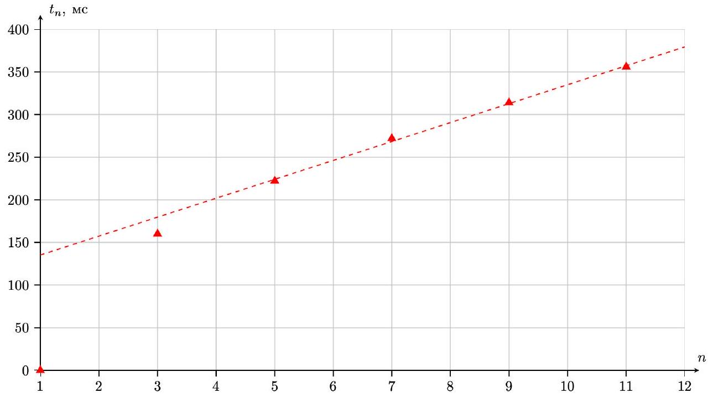
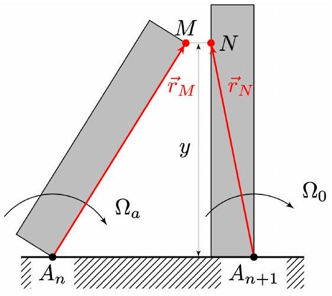
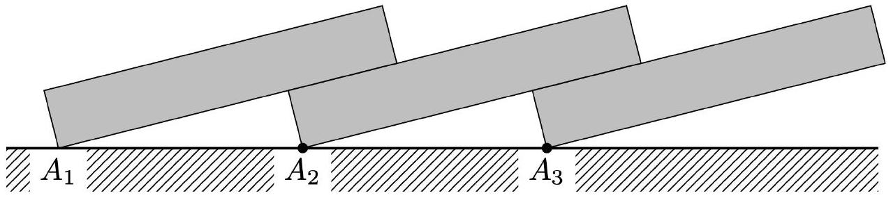
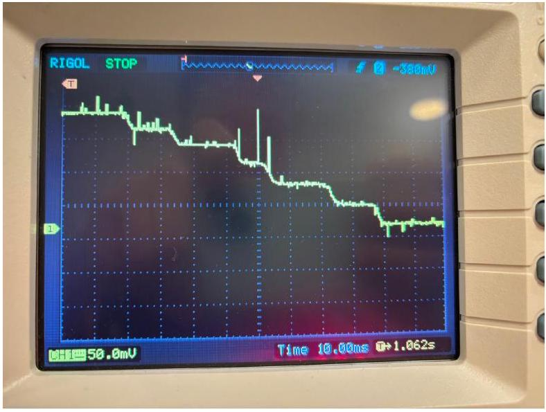
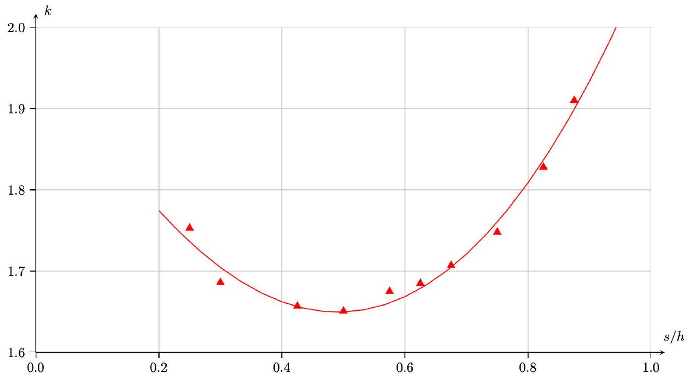

Ответ:

| $n$ |  | 1 | 3 | 5 | 7 | 9 | 11 |
| :--- | :--- | :--- | :--- | :--- | :--- | :--- | :--- |
| $t _ { n }$, | MC | 0 | 160 | 222 | 272 | 314 | 356 |

Ответ:

А2 ${ } ^ { 0.10 }$ Выразите углы $\beta$ и $\varphi$ через геометрические параметры $s , h , \alpha$.

Ответ:

$$
\begin{gathered}
\beta = \operatorname { arctg } \left( \frac { d } { h } \right) \\
\varphi = \arcsin \left( \frac { s - d } { h } \right) - \operatorname { arctg } \left( \frac { d } { h } \right)
\end{gathered}
$$

А3 ${ } ^ { 2.50 }$ Выразите $\Omega _ { 0 }$ через $g , h , k , \alpha , s$ в установившейся волне падающих домино. Учтите, что в момент удара мгновенные силы реакции возникают во всех точках контакта костяшек друг с другом и с поверхностью.

Условие кинематической связи сразу после удара:

$$
\left( \vec { v } _ { M } \cdot \vec { e } _ { x } \right) = \left( \vec { v } _ { N } \cdot \vec { e } _ { x } \right)
$$

Подставив $\vec { v } _ { M } = \left[ \vec { \Omega } _ { a } \times \vec { r } _ { M } \right] , \vec { v } _ { N } = \left[ \vec { \Omega } _ { 0 } \times \vec { r } _ { N } \right]$, получим:

$$
\Omega _ { 0 } y = \Omega _ { a } y \Rightarrow \Omega _ { 0 } = \Omega _ { a }
$$

С энергетической точки зрения система в моменты времён $t _ { n }$ и $t _ { n + 1 }$ отличается тем, что одна покоящаяся костяшка перемещается в начало ряда. Исходя из этого можно записать изменение потенциальное энергии: $\Delta \Pi = \frac { m g h } { 2 } \left( 1 - \sqrt { 1 + \alpha ^ { 2 } } \sin \left( \operatorname { arctg } \alpha + \arcsin \frac { d } { s } \right) \right)$

Запишем закон сохранения энергии, с учётом кинематической связи:

$$
\frac { I \Omega _ { b } ^ { 2 } } { 2 } = 2 \cdot \frac { I \Omega _ { 0 } ^ { 2 } } { 2 } + \frac { m g h } { 2 } \left( 1 - \sqrt { 1 + \alpha ^ { 2 } } \sin \left( \operatorname { arctg } \alpha + \arcsin \frac { d } { s } \right) \right) ,
$$

где $I = m h ^ { 2 } \left( 1 + \alpha ^ { 2 } \right) / 3$ - момент инерции костяшки относительно оси вращения. Подставив $\Omega _ { b } = k \Omega _ { 0 }$, получим:

$$
\left( k ^ { 2 } - 2 \right) \Omega _ { 0 } ^ { 2 } = \frac { 3 g \left( 1 - \sqrt { 1 + \alpha ^ { 2 } } \sin \left( \operatorname { arctg } \alpha + \arcsin \frac { d } { s } \right) \right) } { h \left( 1 + \alpha ^ { 2 } \right) }
$$

Ответ:

$$
\Omega _ { 0 } = \sqrt { \frac { 3 g \left( 1 - \sqrt { 1 + \alpha ^ { 2 } } \sin \left( \operatorname { arctg } \alpha + \arcsin \frac { \alpha h } { s } \right) \right) } { h \left( 1 + \alpha ^ { 2 } \right) \left( k ^ { 2 } - 2 \right) } }
$$

В1 ${ } ^ { 4.30 }$ Проведите необходимые измерения и получите значения $c$ для не менее чем 10 разных $s / h$.

Укажите погрешность найденных $c$.

Скорость распространения волны $c$ равна:

$$
c = \frac { s } { \mathrm {~d} t _ { n } / \mathrm { d } n }
$$

При расчёте $\mathrm { d } t _ { n } / \mathrm { d } n$ должны использоваться такие $n$, при которых зависимость $t _ { n } ( n )$ линейна. Но при этом количество использованных точек при расчёте $\mathrm { d } t _ { n } / \mathrm { d } n$ должно быть не менее 4 -х.

| $s , \mathrm { CM }$ |  |  |  |  |  |  |  | $\mathrm { d } t _ { n } / \mathrm { d } n$, мс | $\boldsymbol { c } \boldsymbol { , } \mathbf { M } \boldsymbol { / } \mathbf { C }$ |
| :--- | :--- | :--- | :--- | :--- | :--- | :--- | :--- | :--- | :--- |
| 1.0 | $n$ | 7 | 9 | 11 | 12 | 14 | 16 | 9.55 | 1.047 |
|  | $t _ { n }$, MC | 0 | 30 | 57.6 | 76.8 | 96 | 115 |  |  |
| 1.2 | $n$ | 4 | 6 | 8 | 10 | 12 | 14 | 14.30 | 0.839 |
|  | $t _ { n }$, MC | 0 | 47 | 91 | 112 | 149 | 174 |  |  |
| 1.7 | $n$ | 10 | 11 | 12 | 13 | 14 | 15 | 15.80 | 1.076 |
|  | $t _ { n } , \mathrm { MC }$ | 0 | 14 | 33.6 | 43.6 | 63.2 | 79.2 |  |  |
| 2.0 | $n$ | 8 | 9 | 10 | 11 | 12 | 13 | 19.00 | 1.053 |
|  | $t _ { n }$, MC | 0 | 27.2 | 47.2 | 62.4 | 85.6 | 103 |  |  |
| 2.3 | $n$ | 6 | 7 | 8 | 9 | 11 | 12 | 23.90 | 0.962 |
|  | $t _ { n } , \mathrm { MC }$ | 0 | 35.6 | 62.4 | 80.4 | 128 | 158 |  |  |
| 2.5 | $n$ | 3 | 5 | 6 | 7 | 8 | 9 | 27.10 | 0.923 |
|  | $t _ { n } , \mathrm { MC }$ | 0 | 62 | 88 | 115.6 | 142.8 | 170 |  |  |
| 2.7 | $n$ | 4 | 6 | 7 | 8 | 9 | 10 | 31.30 | 0.863 |
|  | $t _ { n }$, MC | 0 | 63 | 91 | 125 | 152 | 189 |  |  |
| 3.0 | $n$ | 2 | 3 | 4 | 5 | 6 | 7 | 50.60 | 0.652 |
|  | $t _ { n } , \mathrm { MC }$ | 0 | 58 | 116 | 170 | 210 | 252 |  |  |
| 3.3 | $n$ | 3 | 4 | 5 | 6 | 7 | 9 | 41.50 | 0.795 |
|  | $t _ { n } , \mathrm { MC }$ | 0 | 61 | 106 | 146 | 193 | 268 |  |  |
| 3.5 | $n$ | 3 | 4 | 5 | 6 | 7 | 8 | 61.90 | 0.565 |
|  | $t _ { n }$, MC | 0 | 58 | 122 | 188 | 242 | 310 |  |  |

В погрешность нахождения $c$ вносят вклад два основных фактора: погрешность определения времени $t _ { n }$, связанная с неидеальностью детектора: при падении костяшка закрывает свет, падающий на фотодиод, не мгновенно.
Это проявляется в виде неидеальных ступенек с шириной перехода $\approx 4$ мс. Учитывая, что длительность всего процесса прохождения волны составляет $\approx 200 - 300$ мс, мы имеем погрешность $\approx 5 \%$.

Другой фактор погрешности связан с тем, что мы каждый раз немного по-разному выставляем костяшки (которые при этом еще и отличаются друг от друга). В итоге это приводит к тому, что измеряемая скорость $c$ при повторении может отличаться на $\approx 5 \%$.

В2 ${ } ^ { 2.40 }$ Постройте график зависимости $k$ от $s / h$.

Обозначим за $\tau = \mathrm { d } t / \mathrm { d } n$

$$
\frac { s \Omega _ { 0 } } { 2 ( \beta + \varphi ) } \left( 1 + \frac { 1 } { k } \right) = \frac { s } { \tau }
$$

Подставим выражение для $\Omega _ { 0 }$ из пункта А3:

$$
\begin{aligned}
& \frac { 1 } { 2 ( \beta + \varphi ) } \left( 1 + \frac { 1 } { k } \right) \cdot \sqrt { \frac { 3 g \left( 1 - \sqrt { 1 + \alpha ^ { 2 } } \sin \left( \operatorname { arctg } \alpha + \arcsin \frac { d } { s } \right) \right) } { h \left( 1 + \alpha ^ { 2 } \right) \left( k ^ { 2 } - 2 \right) } } = \frac { 1 } { \tau } \\
& \frac { \tau } { 2 ( \beta + \varphi ) } \cdot \sqrt { \frac { 3 g \left( 1 - \sqrt { 1 + \alpha ^ { 2 } } \sin \left( \operatorname { arctg } \alpha + \arcsin \frac { d } { s } \right) \right) } { h \left( 1 + \alpha ^ { 2 } \right) } } \cdot \frac { 1 + \frac { 1 } { k } } { \sqrt { k ^ { 2 } - 2 } } = 1
\end{aligned}
$$

Множитель слева обозначим за $u$ :

$$
u = \frac { \tau } { 2 ( \beta + \varphi ) } \cdot \sqrt { \frac { 3 g \left( 1 - \sqrt { 1 + \alpha ^ { 2 } } \sin \left( \operatorname { arctg } \alpha + \arcsin \frac { d } { s } \right) \right) } { h \left( 1 + \alpha ^ { 2 } \right) } }
$$

Тогда уравнение будет выглядеть так:

$$
u ( s / h ) \cdot \frac { 1 + \frac { 1 } { k } } { \sqrt { k ^ { 2 } - 2 } } = 1 ,
$$

которое можно решить методом итераций. Сначала для каждого из измеренных $s$ посчитаем $u$, затем методом итераций найдем значение $k$ :

$$
k = \sqrt { 2 + u ^ { 2 } \left( 1 + \frac { 1 } { k } \right) ^ { 2 } }
$$

| $s , \mathrm { CM }$ | $s / h$ | $\tau , \mathrm { MC }$ | $\varphi$, рад | $u$ | $k$ |
| :--- | :--- | :--- | :--- | :--- | :--- |
| 1.0 | 0.25 | 9.55 | -0.024 | 0.659 | 1.753 |
| 1.2 | 0.3 | 10.8 | 0.027 | 0.576 | 1.686 |
| 1.7 | 0.425 | 15.80 | 0.155 | 0.538 | 1.657 |
| 2.0 | 0.5 | 19.00 | 0.234 | 0.530 | 1.651 |
| 2.3 | 0.575 | 23.90 | 0.316 | 0.562 | 1.675 |
| 2.5 | 0.625 | 27.10 | 0.373 | 0.575 | 1.685 |
| 2.7 | 0.675 | 31.30 | 0.431 | 0.603 | 1.707 |
| 3.0 | 0.75 | 38.80 | 0.523 | 0.653 | 1.748 |

| 3.3 | 0.825 | 50.60 | 0.621 | 0.749 | 1.828 |
| :--- | :--- | :--- | :--- | :--- | :--- |
| 3.5 | 0.875 | 61.90 | 0.693 | 0.843 | 1.910 |

Ответ:

