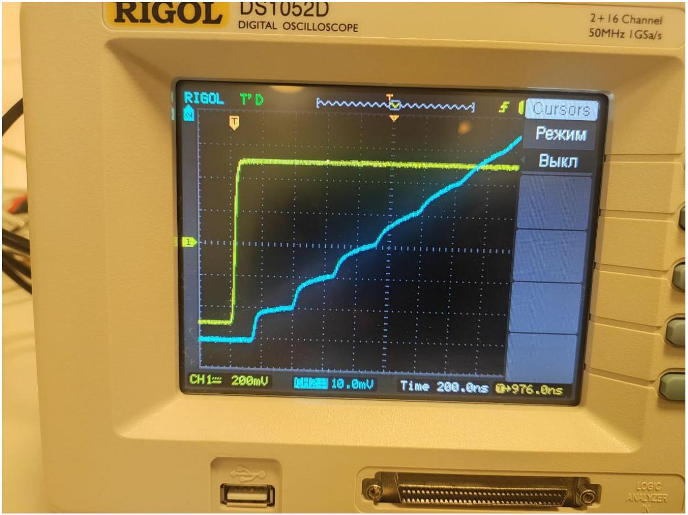
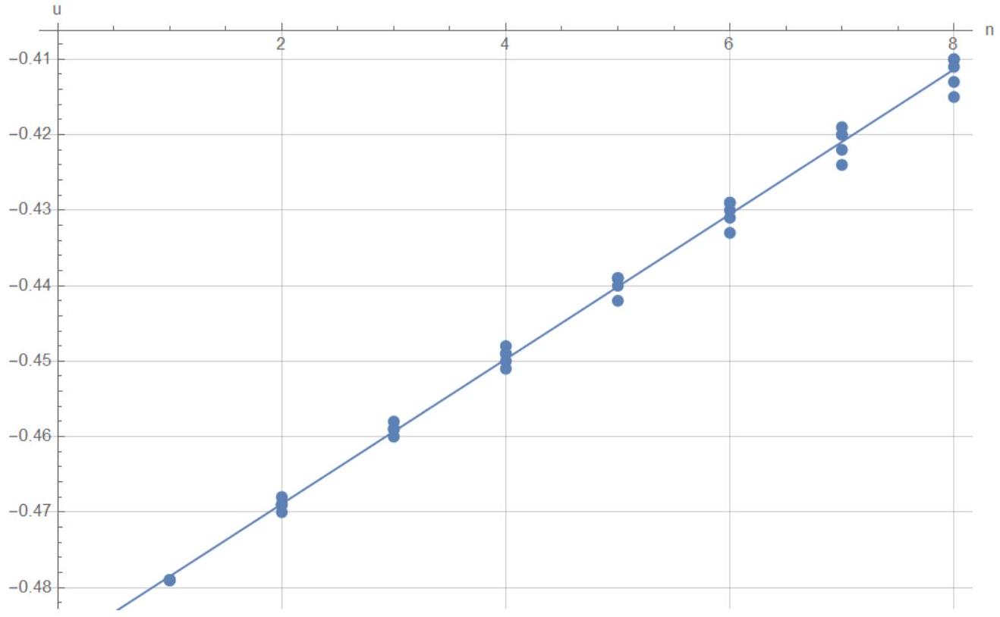
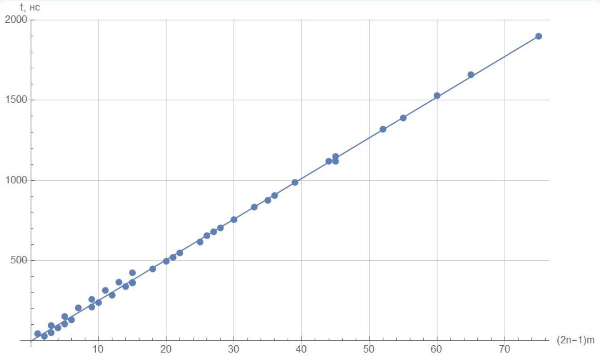
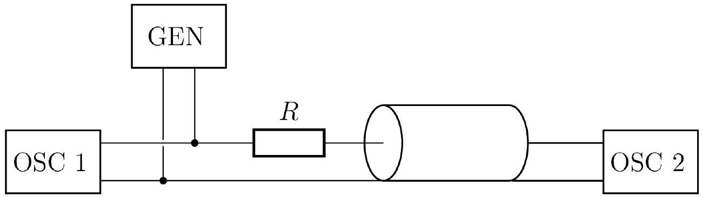
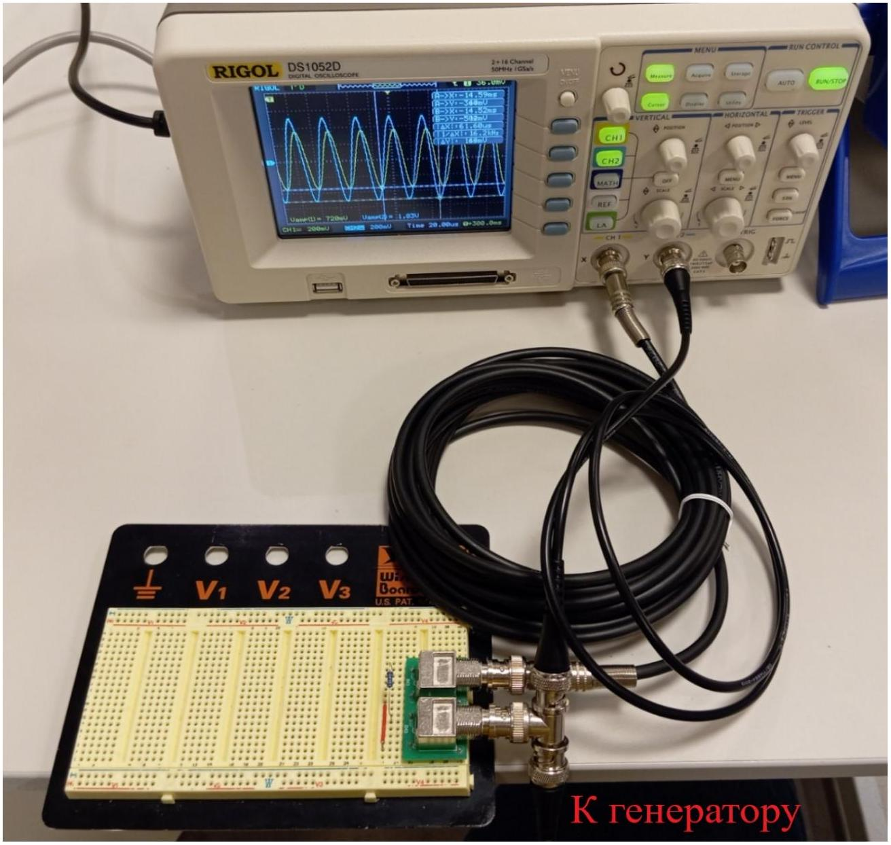
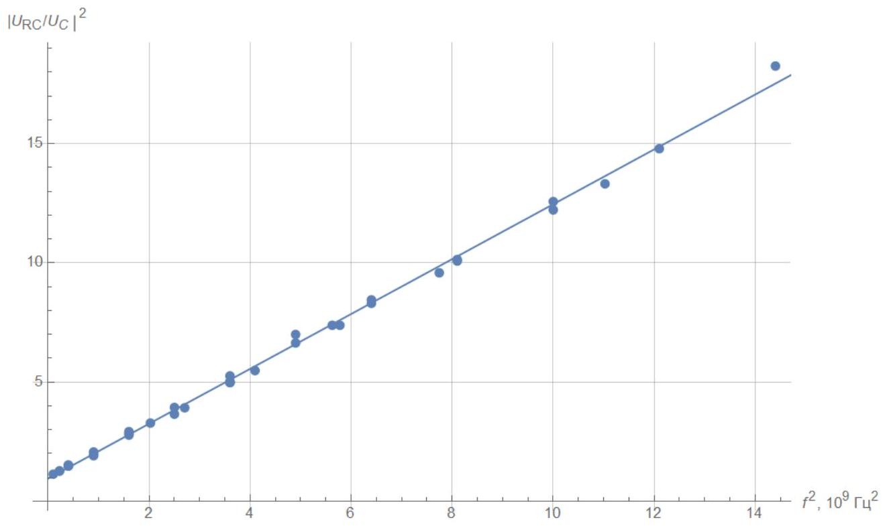
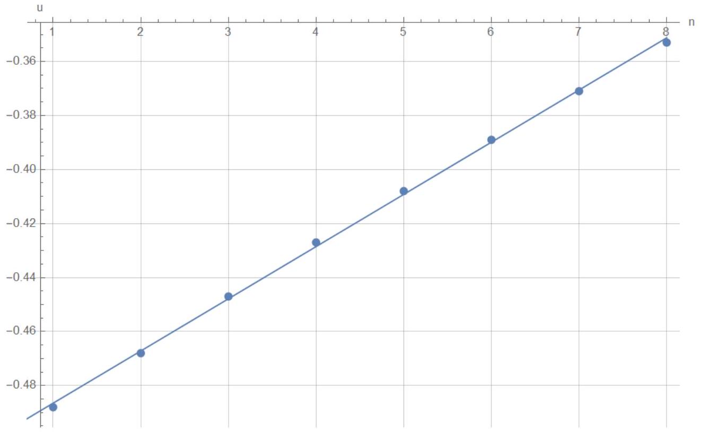
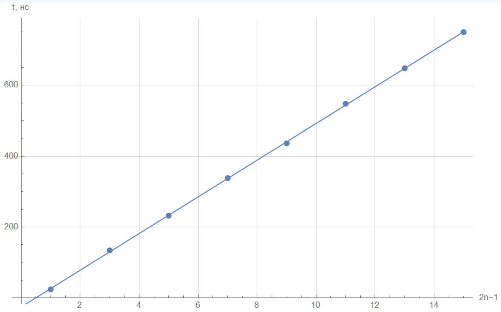

А1 ${ } ^ { 0,40 }$ Выразите напряжение на резисторе $U _ { R } ( t )$, и ток через него $I _ { R } ( t )$ через $U _ { l } ( x , t ) , U _ { r } ( x , t ) , I _ { l } ( x , t ) , I _ { r } ( x , t )$ и $\mathcal { E } ( t )$. Получите выражение, связывающее $U _ { l } ( 0 , t )$ и $U _ { r } ( 0 , t )$. Выражение может содержать $R , Z , \mathcal { E } ( t )$.

Падение напряжения на резисторе равно $U _ { R } ( t ) = \mathcal { E } ( t ) - \left( U _ { l } ( 0 , t ) + U _ { r } ( 0 , t ) \right)$, а ток - $I _ { R } ( t ) = \frac { U _ { R } ( t ) } { R } = I _ { l } ( 0 , t ) + I _ { r } ( 0 , t ) = \frac { 1 } { Z } \left( U _ { r } ( 0 , t ) - U _ { l } ( 0 , t ) \right)$. Отсюда получаем:

$$
\frac { \mathcal { E } ( t ) } { R } - \frac { U _ { l } ( 0 , t ) } { R } - \frac { U _ { r } ( 0 , t ) } { R } = \frac { U _ { r } ( 0 , t ) } { Z } - \frac { U _ { l } ( 0 , t ) } { Z } \Longrightarrow
$$

Ответ:

$$
\frac { \mathcal { E } ( t ) } { 2 } - U _ { r } ( 0 , t ) = \frac { R - Z } { R + Z } \left( \frac { \mathcal { E } ( t ) } { 2 } - U _ { l } ( 0 , t ) \right)
$$

Любые эквивалентные формы ответа валидны, но выписанная выше наиболее удобна для анализа.

A2 ${ } ^ { 1.10 }$ Найдите зависимость напряжения $U _ { \mathrm { OSC } } ( t )$ на осциллографе от времени.

Обозначим для удобства $U _ { n } = U _ { 0 } \left( 1 - \left( \frac { R - Z } { R + Z } \right) ^ { n } \right)$. В начальный момент времени $U _ { l } ( 0,0 ) = 0 , U _ { r } ( 0,0 ) = U _ { 1 } / 2$. Волна, распространяющаяся вправо, за время $L / v$ добегает до осциллографа и отражается от края двухпроводной линии. Ещё через время $L / v$ бегущая влево волна возвращается к резистору, и тогда $U _ { l } ( 0,2 L / v ) = U _ { 1 } / 2 \Longrightarrow U _ { l } ( 0,2 L / v ) = U _ { 2 } / 2$. Далее процесс переотражения бегущих волн повторяется, и через время $2 n L / v$ напряжение $U _ { l } ( x = 0 )$ достигает $U _ { n } / 2$, а напряжение $U _ { r } ( x = 0 ) = U _ { n + 1 } / 2$. Отсюда приходим к итоговому результату:

Ответ:

$$
U _ { \mathrm { OSC } } ( t ) = U _ { 0 } \left[ 1 - \left( \frac { R - Z } { R + Z } \right) ^ { \left\lfloor \frac { V t } { 2 L } + \frac { 1 } { 2 } \right\rfloor } \right]
$$

А3 ${ } ^ { 0.70 }$ Подав с генератора прямоугольный сигнал, снимите зависимость напряжения от времени. Запишите моменты времени $t _ { n }$, когда произошло $n$-тое скачкообразное увеличение напряжения, и значения напряжения $U _ { n }$ сразу после этого.

Ступенчатая лесенка напряжения появляется на масштабах времени порядка $L / c \sim 10 ^ { - 8 } \ldots 10 ^ { - 7 } \mathrm { c }$, поэтому её видно только на масштабах порядка $\sim 100$ нс. Хотя при большем количестве участков кабеля лесенка становится чётче, количество несмазанных «ступенек» всё ещё невелико, поэтому измерения необходимо проводить при большом числе участков кабеля.

Характерный вид лесенки показан на фотографии ниже:

A4 ${ } ^ { 2,80 }$ Повторите предыдущий пункт, подсоединяя большее количество участков кабеля (от 2 до 5 включительно).
$m = 1$ участок кабеля:

| $n$ | 1 | 2 | 3 | 4 | 5 | 6 | 7 | 8 |
| :--- | :--- | :--- | :--- | :--- | :--- | :--- | :--- | :--- |
| $( 2 n - 1 ) m$ | 1 | 3 | 5 | 7 | 9 | 11 | 13 | 15 |

| $t _ { n }$, HC | 44 | 95,2 | 151 | 205 | 258 | 314 | 365 | 424 |
| :--- | :--- | :--- | :--- | :--- | :--- | :--- | :--- | :--- |
| $\Delta t _ { n }$, нс | 18 | 17 | 19 | 18 | 18 | 19 | 17 | 20 |
| $U , \mathrm { mB }$ | -479 | -470 | -460 | -451 | -442 | -433 | -424 | -415 |
| $\Delta U , \mathrm { mB }$ | 3 | 3 | 3 | 3 | 3 | 3 | 3 | 3 |
| $u$ | -0,479 | -0,47 | -0,46 | -0,451 | -0,442 | -0,433 | -0,424 | -0,415 |
| $\Delta u$ | 0,003 | 0,003 | 0,003 | 0,003 | 0,003 | 0,003 | 0,003 | 0,003 |

$m = 2$ участка кабеля:

| $n$ | 1 | 2 | 3 | 4 | 5 | 6 | 7 | 8 |
| :--- | :--- | :--- | :--- | :--- | :--- | :--- | :--- | :--- |
| $( 2 n - 1 ) m$ | 2 | 6 | 10 | 14 | 18 | 22 | 26 | 30 |
| $t _ { n }$, HC | 28 | 130 | 238 | 338 | 448 | 548 | 656 | 756 |
| $\Delta t _ { n }$, нс | 35 | 34 | 36 | 33 | 37 | 33 | 36 | 33 |
| $U , \mathrm { mB }$ | -479 | -469 | -459 | -450 | -440 | -431 | -422 | -413 |
| $\Delta U , \mathrm { mB }$ | 3 | 3 | 3 | 3 | 3 | 3 | 3 | 3 |
| $u$ | -0,479 | -0,469 | -0,459 | -0,45 | -0,44 | -0,431 | -0,422 | -0,413 |
| $\Delta u$ | 0,003 | 0,003 | 0,003 | 0,003 | 0,003 | 0,003 | 0,003 | 0,003 |

$m = 3$ участка кабеля:

| $n$ | 1 | 2 | 3 | 4 | 5 | 6 | 7 | 8 |
| :--- | :--- | :--- | :--- | :--- | :--- | :--- | :--- | :--- |
| $( 2 n - 1 ) m$ | 3 | 9 | 15 | 21 | 27 | 33 | 39 | 45 |
| $t _ { n }$, HC | 50 | 210 | 364 | 520 | 680 | 834 | 988 | 1150 |
| $\Delta t _ { n }$, нс | 52 | 53 | 51 | 52 | 53 | 51 | 51 | 54 |
| $U , \mathrm { mB }$ | -489 | -478 | -469 | -459 | -449 | -440 | -430 | -421 |
| $\Delta U , \mathrm { mB }$ | 4 | 4 | 3 | 3 | 3 | 3 | 3 | 3 |
| $u$ | -0,489 | -0,478 | -0,469 | -0,459 | -0,449 | -0,44 | -0,43 | -0,421 |
| $\Delta u$ | 0,004 | 0,004 | 0,003 | 0,003 | 0,003 | 0,003 | 0,003 | 0,003 |

$m = 4$ участка кабеля:

| $n$ | 1 | 2 | 3 | 4 | 5 | 6 | 7 | 8 |
| :--- | :--- | :--- | :--- | :--- | :--- | :--- | :--- | :--- |
| $( 2 n - 1 ) m$ | 4 | 12 | 20 | 28 | 36 | 44 | 52 | 60 |
| $t _ { n }$, HC | 80 | 284 | 496 | 704 | 906 | 1120 | 1320 | 1530 |
| $\Delta t _ { n }$, нс | 69 | 68 | 71 | 69 | 67 | 71 | 67 | 70 |
| $U , \mathrm { mB }$ | -489 | -479 | -468 | -458 | -449 | -439 | -430 | -420 |
| $\Delta U , \mathrm { mB }$ | 3 | 3 | 4 | 3 | 3 | 3 | 3 | 3 |
| $u$ | -0,489 | -0,479 | -0,468 | -0,458 | -0,449 | -0,439 | -0,43 | -0,42 |
| $\Delta u$ | 0,003 | 0,003 | 0,004 | 0,003 | 0,003 | 0,003 | 0,003 | 0,003 |

$m = 5$ участков кабеля:

| $n$ | 1 | 2 | 3 | 4 | 5 | 6 | 7 | 8 |
| :--- | :--- | :--- | :--- | :--- | :--- | :--- | :--- | :--- |
| $( 2 n - 1 ) m$ | 5 | 15 | 25 | 35 | 45 | 55 | 65 | 75 |
| $t _ { n }$, HC | 104 | 360 | 616 | 876 | 1120 | 1390 | 1660 | 1900 |
| $\Delta t _ { n }$, нс | 84 | 85 | 85 | 87 | 81 | 90 | 90 | 80 |

| $U , \mathrm { mB }$ | -489 | -479 | -469 | -459 | -449 | -439 | -429 | -420 |
| :--- | :--- | :--- | :--- | :--- | :--- | :--- | :--- | :--- |
| $\Delta U , \mathrm { mB }$ | 3 | 3 | 3 | 3 | 3 | 3 | 3 | 3 |
| $u$ | -0,489 | -0,479 | -0,469 | -0,459 | -0,449 | -0,439 | -0,429 | -0,42 |
| $\Delta u$ | 0,003 | 0,003 | 0,003 | 0,003 | 0,003 | 0,003 | 0,003 | 0,003 |

А5 ${ } ^ { 1.00 }$ Пренебрегая длиной кабелей, используемых для подключения генератора, линеаризуйте зависимости $u ( n , m )$ и $t ( n , m )$. Постройте график линеаризованной зависимости $u ( n , m )$ и определите сопротивление $R$ выданного резистора, если волновое сопротивление кабеля равно 50 Ом. Постройте линеаризованный график зависимости $t ( n , m )$ и определите скорость $v$ распространения волн в коаксиальном кабеле. Приведите погрешности результатов.

Для $m$ подключенных участков кабеля будем иметь:

$$
t ( n , m ) = ( 2 n - 1 ) m L _ { 0 } / v , \quad L _ { 0 } = 5 \text { м. }
$$

Линеаризация - $- t ( ( 2 n - 1 ) m )$ с угловым коэффициентом $L _ { 0 } / v$. Поскольку напряжение на несмазанной части лесенки много меньше напряжения $U _ { 0 }$, для него можно в первом приближении записать:

$$
U _ { n } = U _ { 0 } \left( 1 - \left( \frac { R - Z } { R + Z } \right) ^ { n } \right) \approx \frac { 2 n Z } { R } U _ { 0 } .
$$

Поэтому удобная линеаризация - $u ( n )$, а её угловой коэффициент равен $2 Z / R$.

Угловой коэффициент зависимости $u ( n )$ равен $\frac { 2 Z } { R } = 9.6 \cdot 10 ^ { - 3 }$, погрешность оценим как $\varepsilon _ { R } \sim 2 \Delta u / \left( u _ { \max } - u _ { \min } \right) \approx 9 \%$, тогда:

Ответ:

$$
R = ( 10.4 \pm 0.9 ) \text { кОм }
$$

Угловой коэффициент зависимости $t ( m ( 2 n - 1 ) )$ равен $\frac { L _ { 0 } } { v } = 25.4$ нс, погрешность оценим как $\varepsilon _ { v } \sim 2 \Delta t / \left( t _ { \max } - t _ { \min } \right) \approx 9 \%$, тогда:

Ответ:

$$
v = ( 1.97 \pm 0.18 ) \cdot 10 ^ { 8 } \mathrm {~m} / \mathrm { c }
$$

В1 ${ } ^ { 1.50 }$ Пренебрегая собственной ёмкостью кабелей, используемых для подключения генератора и осциллографа, предложите схему, позволяющую определить ёмкость коаксиального кабеля на единицу длины. Проведите измерения для разного количества участков кабеля и определите его ёмкость на единицу длины. Зная волновое сопротивление кабеля, найдите его индуктивность на единицу длины. Оцените погрешность полученных результатов.

Самый удобный вариант подключения:

Будем измерять отношение амплитуд сигнала на кабеле (конденсаторе) и всей цепи. Поскольку в такой цепи:

$$
\left| \frac { U _ { R C } } { U _ { C } } \right| ^ { 2 } = \left| \frac { R + \frac { 1 } { i \omega C } } { \frac { 1 } { i \omega C } } \right| ^ { 2 } = 1 + 4 \pi ^ { 2 } R ^ { 2 } L _ { 0 } ^ { 2 } \mathcal { C } ^ { 2 } \cdot m ^ { 2 } f ^ { 2 } .
$$

Используем линеаризацию $\left| \frac { U _ { R C } } { U _ { C } } \right| ^ { 2 } \left( m ^ { 2 } f ^ { 2 } \right)$. Входное напряжение всюду равно $U _ { R C } = 1$ В. Поскольку погрешность значения сопротивления резистора уже достигает $5 - 10 \%$, погрешностью осциллографа можем пренебречь.
$m = 1$ участок кабеля:

| $f$, кГц | 10 | 20 | 30 | 40 | 50 | 60 | 70 |
| :--- | :--- | :--- | :--- | :--- | :--- | :--- | :--- |
| $U _ { C } , \mathrm { mB }$ | 938 | 810 | 695 | 585 | 504 | 436 | 378 |
| $m ^ { 2 } f ^ { 2 } , 10 ^ { 9 }$ Гц $^ { 2 }$ | 0.1 | 0.4 | 0.9 | 1.6 | 2.5 | 3.6 | 4.9 |
| $\left( 1 \mathrm {~B} / U _ { C } \right) ^ { 2 }$ | 1.14 | 1.52 | 2.07 | 2.92 | 3.94 | 5.26 | 7.00 |

$m = 2$ участка кабеля:

| $f$, кГц | 10 | 20 | 30 | 40 | 45 | 50 | 55 | 60 |
| :--- | :--- | :--- | :--- | :--- | :--- | :--- | :--- | :--- |
| $U _ { C } , \mathrm { mB }$ | 821 | 590 | 446 | 344 | 315 | 282 | 260 | 234 |
| $m ^ { 2 } f ^ { 2 } , 10 ^ { 9 }$ Гц $^ { 2 }$ | 0.4 | 1.6 | 3.6 | 6.4 | 8.1 | 10.0 | 12.1 | 14.4 |
| $\left( 1 \mathrm {~B} / U _ { C } \right) ^ { 2 }$ | 1.48 | 2.87 | 5.03 | 8.45 | 10.08 | 12.57 | 14.79 | 18.26 |

$m = 3$ участка кабеля:

| $f$, кГц | 5 | 10 | 15 | 20 | 25 | 30 | 35 |
| :--- | :--- | :--- | :--- | :--- | :--- | :--- | :--- |
| $U _ { C } , \mathrm { mB }$ | 889 | 723 | 552 | 448 | 368 | 314 | 274 |
| $m ^ { 2 } f ^ { 2 } , 10 ^ { 9 }$ Гц $^ { 2 }$ | 0.23 | 0.90 | 2.03 | 3.60 | 5.63 | 8.10 | 11.03 |

$\left( 1 \mathrm {~B} / U _ { C } \right) ^ { 2 }$ $\begin{array} { l l l l l l l } 1.27 & 1.91 & 3.28 & 4.98 & 7.38 & 10.14 & 13.32 \end{array}$
$m = 4$ участка кабеля:

| $f$, кГц | 5 | 10 | 13 | 16 | 19 | 22 | 25 |
| :--- | :--- | :--- | :--- | :--- | :--- | :--- | :--- |
| $U _ { C } , \mathrm { mB }$ | 823 | 600 | 505 | 427 | 368 | 323 | 286 |
| $m ^ { 2 } f ^ { 2 } , 10 ^ { 9 }$ Гц $^ { 2 }$ | 0.40 | 1.60 | 2.70 | 4.10 | 5.78 | 7.74 | 10.00 |
| $\left( 1 \mathrm {~B} / U _ { C } \right) ^ { 2 }$ | 1.48 | 2.78 | 3.92 | 5.48 | 7.38 | 9.59 | 12.23 |

$m = 5$ участков кабеля:

| $f$, кГц | 3 | 6 | 8 | 10 | 12 | 14 | 16 |
| :--- | :--- | :--- | :--- | :--- | :--- | :--- | :--- |
| $U _ { C } , \mathrm { mB }$ | 885 | 711 | 596 | 523 | 448 | 388 | 347 |
| $m ^ { 2 } f ^ { 2 } , 10 ^ { 9 }$ Гц $^ { 2 }$ | 0.23 | 0.9 | 1.6 | 2.5 | 3.6 | 4.9 | 6.4 |
| $\left( 1 \mathrm {~B} / U _ { C } \right) ^ { 2 }$ | 1.28 | 1.98 | 2.82 | 3.66 | 4.98 | 6.64 | 8.31 |

Угловой коэффициент $4 \pi ^ { 2 } R ^ { 2 } L _ { 0 } ^ { 2 } \mathcal { C } ^ { 2 } = 1.15 \cdot 10 ^ { - 9 }$ Гц $^ { - 2 }$, откуда $\mathcal { C } = 1.04 \cdot 10 ^ { - 10 }$ Ф/м. Погрешность оценим как $\sim 10 \%$, тогда:

Ответ:

$$
\mathcal { C } = ( 1.04 \pm 0.10 ) \cdot 10 ^ { - 10 } \Phi / \mathrm { M }
$$

Поскольку $Z = \sqrt { \frac { \mathcal { L } } { \mathcal { C } } }$, индуктивность кабеля на единицу длины $\mathcal { L } = Z ^ { 2 } \mathcal { C } = 2.6 \cdot 10 ^ { - 7 }$ Гн/м.

Ответ:

$$
\mathcal { L } = ( 2.6 \pm 0.2 ) \cdot 10 ^ { - 7 } \Gamma _ { \mathrm { H } } / \mathrm { м }
$$

C1 ${ } ^ { 1.00 }$ Подав с генератора прямоугольный сигнал, снимите зависимость напряжения от времени, а именно найдите моменты времени $t _ { n }$, когда произошло $n$-тое скачкообразное увеличение напряжения, и значения напряжения $U _ { n }$ сразу после этого.

| $n$ | 1 | 2 | 3 | 4 | 5 | 6 | 7 | 8 |
| :--- | :--- | :--- | :--- | :--- | :--- | :--- | :--- | :--- |
| $2 n - 1$ | 1 | 3 | 5 | 7 | 9 | 11 | 13 | 15 |
| $t _ { n }$, HC | 24 | 134 | 232 | 338 | 436 | 548 | 648 | 750 |
| $\Delta t _ { n }$, нс |  | 110 | 98 | 106 | 98 | 112 | 100 | 102 |
| $U , \mathrm { mB }$ | -488 | -468 | -447 | -427 | -408 | -389 | -371 | -353 |
| $\Delta U , \mathrm { mB }$ |  | 20 | 21 | 20 | 19 | 19 | 18 | 18 |
| $u$ | -0,488 | -0,468 | -0,447 | -0,427 | -0,408 | -0,389 | -0,371 | -0,353 |
| $\Delta u$ |  | 0,02 | 0,021 | 0,02 | 0,019 | 0,019 | 0,018 | 0,018 |

Угловой коэффициент зависимости $u ( n )$ равен $\frac { 2 Z } { R } = 1.93 \cdot 10 ^ { - 2 }$, погрешность оценим как $\varepsilon _ { Z } \sim 2 \Delta u / \left( u _ { \max } - u _ { \min } \right) \approx 15 \%$, тогда:

Ответ:

$$
R = ( 100 \pm 20 ) \text { Ом }
$$

Угловой коэффициент зависимости $t ( 2 n - 1 )$ равен $\frac { L _ { 0 } } { v } = 51.8$ нс, погрешность оценим как $\varepsilon _ { v } \sim 2 \Delta t / \left( t _ { \max } - t _ { \min } \right) \approx 9 \%$, тогда:

Ответ:

$$
v = ( 1.93 \pm 0.18 ) \cdot 10 ^ { 8 } \mathrm {~m} / \mathrm { c }
$$
