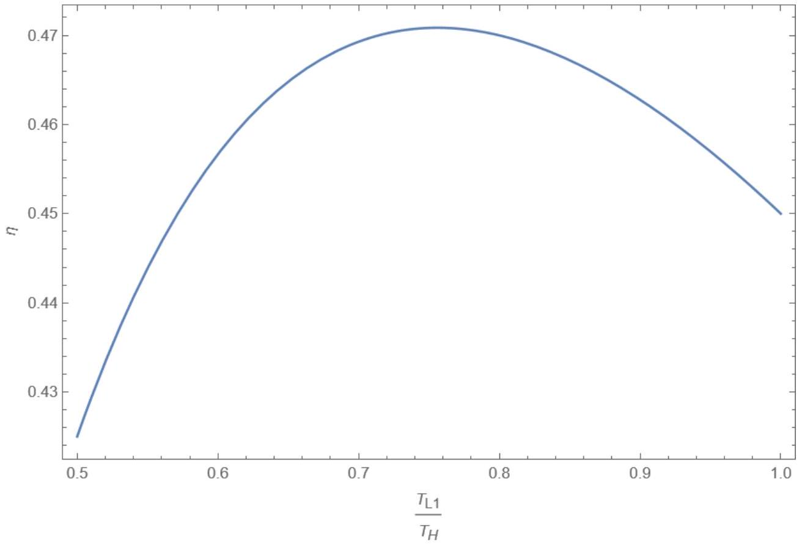

Смещение поршня в одну сторону происходит за время $\tau / 2$, поэтому его скорость во время движения $v = 2 D / \tau$, а значит мощность силы трения

$$
P _ { f r } = - \gamma v ^ { 2 } = - \frac { 4 \gamma D ^ { 2 } } { \tau ^ { 2 } }
$$

Подведенная к двигателю мощность, затрачиваемая на работу

$$
P _ { 1 } = \frac { Q _ { 1 } - Q _ { 2 } } { \tau } .
$$

Тогда полезная мощность

Ответ:

$$
P = \frac { Q _ { 1 } - Q _ { 2 } } { \tau } - \frac { 4 \gamma D ^ { 2 } } { \tau ^ { 2 } }
$$

A2 ${ } ^ { 0.30 }$ Найдите оптимальную продолжительность цикла $\tau$, при которой мощность будет максимальной.

Дифференцируя мощность по $\tau$, получим

$$
- \frac { Q _ { 1 } - Q _ { 2 } } { \tau ^ { 2 } } + \frac { 8 \gamma D } { \tau ^ { 3 } } = 0 ,
$$

откуда

Ответ:

$$
\tau = \frac { 8 \gamma D } { Q _ { 1 } - Q _ { 2 } }
$$

А3 ${ } ^ { 0.30 }$ Найдите выражение для КПД (отношения полезной работы к подведенному количеству теплоты) в случае работы двигателя при оптимальной продолжительности цикла.

Полезная работа, совершенная за цикл

$$
A = Q _ { 1 } - Q _ { 2 } + P _ { f r } \tau = Q _ { 1 } - Q _ { 2 } - \frac { 4 \gamma D } { \tau } = \frac { Q _ { 1 } - Q _ { 2 } } { 2 } .
$$

Разделив на подведенное количество тепла, получим КПД

Ответ:

$$
\eta = \frac { Q _ { 1 } - Q _ { 2 } } { 2 Q _ { 1 } }
$$

A4 ${ } ^ { 0.20 }$
Пусть $Q _ { 1 } , Q _ { 2 }$ такие же, как если бы двигатель работал по идеальному циклу Карно. Выразите КПД рассматриваемого цикла через КПД такого цикла Карно $\eta _ { c }$.

Для цикла Карно

$$
\eta _ { c } = \frac { Q _ { 1 } - Q _ { 2 } } { Q _ { 1 } } ,
$$

поэтому

Ответ:

$$
\eta = \frac { \eta _ { c } } { 2 }
$$

В1 ${ } ^ { 0.80 }$ Определите количества теплоты $Q _ { 1 }$ и $Q _ { 2 }$, выразите ответ через $\nu , R , T _ { 1 } ^ { \prime } , T _ { 2 } ^ { \prime } , V _ { 1 } , V _ { 2 }$.

На изотерме внутренняя энергия идеального газа не меняется, поэтому подведенное количество теплоты равно совершенной газом работе

$$
Q _ { 1 } = A _ { 1 } = \int _ { V _ { 1 } } ^ { V _ { 2 } } p d V = \nu R T _ { 1 } ^ { \prime } \int _ { V _ { 1 } } ^ { V _ { 2 } } \frac { d V } { V } = \nu R T _ { 1 } ^ { \prime } \ln \frac { V _ { 2 } } { V _ { 1 } }
$$

Пусть на второй изотерме объем уменьшается от $V _ { 3 }$ до $V _ { 4 }$. Запишем уравнения двух адиабат в переменных $( V , T )$, получим

$$
T _ { 1 } ^ { \prime } V _ { 2 } ^ { \gamma - 1 } = T _ { 2 } ^ { \prime } V _ { 3 } ^ { \gamma - 1 } , \quad T _ { 1 } ^ { \prime } V _ { 1 } ^ { \gamma - 1 } = T _ { 2 } ^ { \prime } V _ { 4 } ^ { \gamma - 1 }
$$

откуда получаем соотношение между объемами

$$
\frac { V _ { 2 } } { V _ { 1 } } = \frac { V _ { 3 } } { V _ { 4 } } .
$$

Тогда на второй изотерме отводится тепло

$$
Q _ { 2 } = - A = - \int _ { V _ { 3 } } ^ { V _ { 4 } } \nu R T _ { 2 } ^ { \prime } \frac { d V } { V } = \nu R T _ { 2 } ^ { \prime } \ln \frac { V _ { 3 } } { V _ { 4 } } = \nu R T _ { 2 } ^ { \prime } \ln \frac { V _ { 2 } } { V _ { 1 } }
$$

Альтернативно можно заметить, что рассматриваемый цикл - это цикл Карно между температурами $T _ { 1 } ^ { \prime }$ и $T _ { 2 } ^ { \prime }$, поэтому между теплотами выполняется соотношение

$$
\frac { Q _ { 1 } } { T _ { 1 } ^ { \prime } } = \frac { Q _ { 2 } } { T _ { 2 } ^ { \prime } } ,
$$

позволяющее сразу выразить $Q _ { 2 }$ через $Q _ { 1 }$. Это соотноешние следует из равенства нулю полного изменения энтропии за цикл (без учета теплообмена с внешними источниками) или непосредственно из формулы для КПД цикла Карно.

Ответ:

$$
Q _ { 1 } = \nu R T _ { 1 } ^ { \prime } \ln \frac { V _ { 2 } } { V _ { 1 } } , \quad Q _ { 2 } = \nu R T _ { 2 } ^ { \prime } \ln \frac { V _ { 2 } } { V _ { 1 } }
$$

В2 ${ } ^ { 0.40 }$ Выразите время цикла $t _ { c }$ через $Q _ { 1 } , Q _ { 2 } , \alpha _ { 1 } , \alpha _ { 2 } , \Delta T _ { 1 } , \Delta T _ { 2 }$. Временем, которое занимают адиабатические процессы, можно пренебречь.

Продолжительность каждой из изотерм равна подведенному или отведенному количеству тепла, деленному на соответствующую мощность. Полное время -сумма времен на двух изотермах

Ответ:

$$
t _ { c } = \frac { Q _ { 1 } } { \alpha _ { 1 } \Delta T _ { 1 } } + \frac { Q _ { 2 } } { \alpha _ { 2 } \Delta T _ { 2 } } .
$$

В3 ${ } ^ { 0.40 }$ Выразите полезную мощность цикла $P$ через $T _ { 1 } , T _ { 2 } , \Delta T _ { 1 } , \Delta T _ { 2 } , \alpha _ { 1 } , \alpha _ { 2 }$.

Полезная мощность равна отношению работы за цикл к его времени, найденном в предыдущем пункте

$$
P = \frac { Q _ { 1 } - Q _ { 2 } } { t _ { c } } = \frac { Q _ { 1 } - Q _ { 2 } } { \frac { Q _ { 1 } } { \alpha _ { 1 } \Delta T _ { 1 } } + \frac { Q _ { 2 } } { \alpha _ { 2 } \Delta T _ { 2 } } } .
$$

Подставим в это выражение формулы для количеств теплоты. После этого множители $\nu R \ln \left( V _ { 2 } / V _ { 1 } \right)$ сократятся

$$
P = \frac { T _ { 1 } ^ { \prime } - T _ { 2 } ^ { \prime } } { \frac { T _ { 1 } ^ { \prime } } { \alpha _ { 1 } \Delta T _ { 1 } } + \frac { T _ { 2 } ^ { \prime } } { \alpha _ { 2 } \Delta T _ { 2 } } }
$$

Также используем формулы для $T _ { 1 } ^ { \prime } = T _ { 1 } - \Delta T _ { 1 }$ и $T _ { 2 } ^ { \prime } = T _ { 2 } + \Delta T _ { 2 }$. Окончательно получим

Ответ:

$$
P = \frac { T _ { 1 } - T _ { 2 } - \Delta T _ { 1 } - \Delta T _ { 2 } } { \frac { T _ { 1 } - \Delta T _ { 1 } } { \alpha _ { 1 } \Delta T _ { 1 } } + \frac { T _ { 2 } + \Delta T _ { 2 } } { \alpha _ { 2 } \Delta T _ { 2 } } } = \alpha _ { 1 } \alpha _ { 2 } \frac { \Delta T _ { 1 } \Delta T _ { 2 } \left( T _ { 1 } - T _ { 2 } - \Delta T _ { 1 } - \Delta T _ { 2 } \right) } { \alpha _ { 1 } T _ { 2 } \Delta T _ { 1 } + \alpha _ { 2 } T _ { 1 } \Delta T _ { 2 } + \left( \alpha _ { 1 } - \alpha _ { 2 } \right) \Delta T _ { 1 } \Delta T _ { 2 } }
$$

В4 ${ } ^ { 0.40 }$ Будем рассматривать только циклы, продолжающиеся фиксированное время $t _ { c }$. Найдите следующее отсюда соотношение между приращениями $d \Delta T _ { 1 }$ и $d \Delta T _ { 2 }$. Выразите ответ через $T _ { 1 } , T _ { 2 } , \alpha _ { 1 } , \alpha _ { 2 } , \Delta T _ { 1 } , \Delta T _ { 2 }$.

Не учитывая постоянный множитель $\nu R \ln \frac { V _ { 2 } } { V _ { 1 } }$, запишем

$$
t _ { c } \sim \frac { T _ { 1 } - \Delta T _ { 1 } } { \alpha _ { 1 } \Delta T _ { 1 } } + \frac { T _ { 2 } + \Delta T _ { 2 } } { \alpha _ { 2 } \Delta T _ { 2 } } = \frac { T _ { 1 } } { \alpha _ { 1 } \Delta T _ { 1 } } + \frac { T _ { 2 } } { \alpha _ { 2 } \Delta T _ { 2 } } - \frac { 1 } { \alpha _ { 1 } } + \frac { 1 } { \alpha _ { 2 } } .
$$

Дифференцируя, получим

Ответ:

$$
\frac { T _ { 1 } } { \alpha _ { 1 } \Delta T _ { 1 } ^ { 2 } } d \Delta T _ { 1 } + \frac { T _ { 2 } } { \alpha _ { 2 } \Delta T _ { 2 } ^ { 2 } } d \Delta T _ { 2 } = 0
$$

В5 ${ } ^ { 0.50 }$ Пусть продолжительность цикла $t _ { c }$ фиксирована. Найдите отношение $\Delta T _ { 1 } / \Delta T _ { 2 }$, при котором мощность $P$ максимальна.

При фиксированной продолжительности цикла мощность будет максимальна при максимальной работе $Q _ { 1 } - Q _ { 2 }$, то есть с точностью до постоянного множителя нужно максимизировать выражение
$T _ { 1 } - T _ { 2 } - \Delta T _ { 1 } - \Delta T _ { 2 }$, а значит

$$
d \Delta T _ { 1 } - d \Delta T _ { 2 } = 0
$$

Подставляя в результаты предыдущего пункта получим

$$
\left( \frac { T _ { 1 } } { \alpha _ { 1 } \Delta T _ { 1 } ^ { 2 } } - \frac { T _ { 2 } } { \alpha _ { 2 } \Delta T _ { 2 } ^ { 2 } } \right) = 0 ,
$$

Ответ:

$$
\frac { \Delta T _ { 1 } } { \Delta T _ { 2 } } = \left( \frac { \alpha _ { 2 } T _ { 1 } } { \alpha _ { 1 } T _ { 2 } } \right) ^ { 1 / 2 }
$$

В6 ${ } ^ { 0.80 }$ Продифференцируйте мощность по $\Delta T _ { 1 }$. Покажите, что условие равенства нулю этой производной можно записать в виде

$$
\frac { \Delta T _ { 1 } } { \Delta T _ { 2 } } = h \frac { P } { \Delta T _ { 1 } \Delta T _ { 2 } } ,
$$

где $h$ - некоторая величина, не зависящая от $\Delta T _ { 1 }$ и $\Delta T _ { 2 }$. Получите выражение для $h$.

Обозначим $\Delta T = T _ { 1 } - T _ { 2 } - \Delta T _ { 1 } - \Delta T _ { 2 } , y = \alpha _ { 1 } T _ { 2 } \Delta T _ { 1 } + \alpha _ { 2 } T _ { 1 } \Delta T _ { 2 } + \left( \alpha _ { 1 } - \alpha _ { 2 } \right) \Delta T _ { 1 } \Delta T _ { 2 }$. Тогда выражение для мощности примет вид

$$
P = \alpha _ { 1 } \alpha _ { 2 } \frac { \Delta T _ { 1 } \Delta T _ { 2 } \Delta T } { y } .
$$

С учетом производных

$$
\frac { \partial \Delta T } { \partial \Delta T _ { 1 } } = - 1 , \quad \frac { \partial y } { \partial \Delta T _ { 1 } } = \alpha _ { 1 } T _ { 2 } + \left( \alpha _ { 1 } - \alpha _ { 2 } \right) \Delta T _ { 2 }
$$

получим

$$
\frac { \partial P } { \partial \Delta T _ { 1 } } = \alpha _ { 1 } \alpha _ { 2 } \frac { \Delta T _ { 2 } \Delta T y - \Delta T _ { 1 } \Delta T _ { 2 } y - \Delta T _ { 1 } \Delta T _ { 2 } \Delta T \left( \alpha _ { 1 } T _ { 2 } + \left( \alpha _ { 1 } - \alpha _ { 2 } \right) \Delta T _ { 2 } \right) } { y ^ { 2 } } .
$$

Приравнивая числитель дроби к нулю и сокращая на $\Delta T _ { 2 }$, получим

$$
\Delta T \left( y - \Delta T _ { 1 } \left( \alpha _ { 1 } T _ { 2 } + \left( \alpha _ { 1 } - \alpha _ { 2 } \right) \Delta T _ { 2 } \right) \right) - \Delta T _ { 1 } \Delta T _ { 2 } y = 0 ,
$$

откуда после упрощения первой скобки

$$
\alpha _ { 2 } T _ { 1 } \Delta T _ { 2 } \Delta T - \Delta T _ { 1 } y = 0 , \quad \frac { \Delta T _ { 1 } } { \Delta T _ { 2 } } = \alpha _ { 2 } T _ { 1 } \frac { \Delta T } { y } .
$$

Выражая $\Delta T / y$ через мощность, получим

$$
\frac { \Delta T _ { 1 } } { \Delta T _ { 2 } } = \frac { T _ { 1 } } { \alpha _ { 1 } } \frac { P } { \Delta T _ { 1 } \Delta T _ { 2 } } .
$$

Ответ:

$$
h = \frac { T _ { 1 } } { \alpha _ { 1 } }
$$

Подставим в формулу из предыдущего пункта найденное ранее значение $\Delta T _ { 1 } / \Delta T _ { 2 }$ и явное выражение для $P$. Получим уравнение, связывающее $\Delta T _ { 1 }$ и $\Delta T _ { 2 }$ :

$$
\left( \frac { \alpha _ { 2 } T _ { 1 } } { \alpha _ { 1 } T _ { 2 } } \right) ^ { 1 / 2 } = \alpha _ { 2 } T _ { 1 } \frac { T _ { 1 } - T _ { 2 } - \Delta T _ { 1 } - \Delta T _ { 2 } } { \alpha _ { 1 } T _ { 2 } \Delta T _ { 1 } + \alpha _ { 2 } T _ { 1 } \Delta T _ { 2 } + \left( \alpha _ { 1 } - \alpha _ { 2 } \right) \Delta T _ { 1 } \Delta T _ { 2 } }
$$

откуда

$$
\alpha _ { 1 } T _ { 2 } \Delta T _ { 1 } + \alpha _ { 2 } T _ { 1 } \Delta T _ { 2 } + \left( \alpha _ { 1 } - \alpha _ { 2 } \right) \Delta T _ { 1 } \Delta T _ { 2 } = \left( \alpha _ { 1 } \alpha _ { 2 } T _ { 1 } T _ { 2 } \right) ^ { 1 / 2 } \left( T _ { 1 } - T _ { 2 } - \Delta T _ { 1 } - \Delta T _ { 2 } \right) .
$$

Выразив здесь $\Delta T _ { 2 }$ через $\Delta T _ { 1 }$, получим квадратное уравнение относительно $\Delta T _ { 1 }$. Отметим, что при прямом вычислении производной мощности по $\Delta T _ { 1 }$ получилось бы намного больше слагаемых, что значительно затруднило бы получение окончательного ответа.

$$
\left( \alpha _ { 1 } - \alpha _ { 2 } \right) \left( \frac { \alpha _ { 1 } T _ { 2 } } { \alpha _ { 2 } T _ { 1 } } \right) ^ { 1 / 2 } \Delta T _ { 1 } ^ { 2 } + 2 \left( \alpha _ { 1 } T _ { 2 } + \left( \alpha _ { 1 } \alpha _ { 2 } T _ { 1 } T _ { 2 } \right) ^ { 1 / 2 } \right) \Delta T _ { 1 } - \left( \alpha _ { 1 } \alpha _ { 2 } T _ { 1 } T _ { 2 } \right) ^ { 1 / 2 } \left( T _ { 1 } - T _ { 2 } \right) = 0 .
$$

Дискриминант этого уравнения

$$
\begin{aligned}
& \frac { 1 } { 4 } D = \alpha _ { 1 } T _ { 2 } \left( \sqrt { \alpha _ { 1 } T _ { 2 } } + \sqrt { \alpha _ { 2 } T _ { 1 } } \right) ^ { 2 } + \alpha _ { 1 } T _ { 2 } \left( \alpha _ { 1 } - \alpha _ { 2 } \right) \left( T _ { 1 } - T _ { 2 } \right) \\
& \quad = \alpha _ { 1 } T _ { 2 } \left( \alpha _ { 1 } T _ { 1 } + \alpha _ { 2 } T _ { 2 } + 2 \left( \alpha _ { 1 } \alpha _ { 2 } T _ { 1 } T _ { 2 } \right) ^ { 1 / 2 } \right) = \alpha _ { 1 } T _ { 2 } \left( \sqrt { \alpha _ { 1 } T _ { 1 } } + \sqrt { \alpha _ { 2 } T _ { 2 } } \right) ^ { 2 }
\end{aligned}
$$

Тогда один из корней уравнения

$$
\Delta T _ { 1 } = \left( \frac { \alpha _ { 2 } T _ { 1 } } { \alpha _ { 1 } T _ { 2 } } \right) ^ { 1 / 2 } \frac { 1 } { \alpha _ { 1 } - \alpha _ { 2 } } \left( - \alpha _ { 1 } T _ { 2 } - \left( \alpha _ { 1 } \alpha _ { 2 } T _ { 1 } T _ { 2 } \right) ^ { 1 / 2 } + \alpha _ { 1 } \sqrt { T _ { 1 } T _ { 2 } } + T _ { 2 } \sqrt { \alpha _ { 1 } \alpha _ { 2 } } \right) .
$$

Разложим выражение в числителе на множители

$$
\Delta T _ { 1 } = \left( \frac { \alpha _ { 2 } T _ { 1 } } { \alpha _ { 1 } T _ { 2 } } \right) ^ { 1 / 2 } \frac { 1 } { \alpha _ { 1 } - \alpha _ { 2 } } \left( \alpha _ { 1 } - \sqrt { \alpha _ { 1 } \alpha _ { 2 } } \right) \left( \sqrt { T _ { 1 } T _ { 2 } } - T _ { 2 } \right) = \frac { T _ { 1 } - \sqrt { T _ { 1 } T _ { 2 } } } { 1 + \sqrt { \alpha _ { 1 } / \alpha _ { 2 } } } .
$$

Второй корень можно найти аналогично или с помощью теоремы Виета,

$$
\Delta T _ { 1 } ^ { ( 2 ) } = \frac { T _ { 1 } + \sqrt { T _ { 1 } T _ { 2 } } } { 1 - \sqrt { \alpha _ { 1 } / \alpha _ { 2 } } } .
$$

При $\alpha _ { 1 } < \alpha _ { 2 }$ этот корень больше $T _ { 1 }$ (что делает $T _ { 1 } ^ { \prime }$ отрицательным), а при $\alpha _ { 1 } > \alpha _ { 2 }$ отрицателен. В обоих случаях второй корень не имеет физического смысла. Тогда

$$
\Delta T _ { 2 } = \frac { \sqrt { T _ { 1 } T _ { 2 } } - T _ { 2 } } { 1 + \sqrt { \alpha _ { 2 } / \alpha _ { 1 } } } .
$$

Ответ:

$$
\Delta T _ { 1 } = \frac { T _ { 1 } - \sqrt { T _ { 1 } T _ { 2 } } } { 1 + \sqrt { \alpha _ { 1 } / \alpha _ { 2 } } } , \quad \Delta T _ { 2 } = \frac { \sqrt { T _ { 1 } T _ { 2 } } - T _ { 2 } } { 1 + \sqrt { \alpha _ { 2 } / \alpha _ { 1 } } }
$$

В8 ${ } ^ { 0.70 }$ Найдите значение максимальной мощности $P$ и кпд $\eta$ цикла при оптимальных значениях $\Delta T _ { 1 } , \Delta T _ { 2 }$. Выразите ответ через $T _ { 1 } , T _ { 2 } , \alpha _ { 1 } , \alpha _ { 2 }$.

Используя значения разностей температур и формулу из В6, получим

$$
P = \frac { \alpha _ { 1 } } { T _ { 1 } } \frac { \Delta T _ { 1 } } { \Delta T _ { 2 } } \Delta T _ { 1 } \Delta T _ { 2 } = \frac { \alpha _ { 1 } } { T _ { 1 } } \left( \frac { T _ { 1 } - \sqrt { T _ { 1 } T _ { 2 } } } { 1 + \sqrt { \alpha _ { 1 } / \alpha _ { 2 } } } \right) ^ { 2 } = \alpha _ { 1 } \alpha _ { 2 } \frac { \left( \sqrt { T _ { 1 } } - \sqrt { T _ { 2 } } \right) ^ { 2 } } { \left( \sqrt { \alpha _ { 1 } } + \sqrt { \alpha _ { 2 } } \right) ^ { 2 } } .
$$

Коэффициент полезного действия

$$
\begin{aligned}
\eta = 1 - \frac { Q _ { 2 } } { Q _ { 1 } } & = 1 - \frac { T _ { 2 } ^ { \prime } } { T _ { 1 } ^ { \prime } } = 1 - \frac { T _ { 2 } + \Delta T _ { 2 } } { T _ { 1 } - \Delta T _ { 1 } } , \\
\eta = 1 - \frac { T _ { 2 } + \frac { \sqrt { T _ { 1 } T _ { 2 } } - T _ { 2 } } { 1 + \sqrt { \alpha _ { 2 } / \alpha _ { 1 } } } } { T _ { 1 } - \frac { T _ { 1 } - \sqrt { T _ { 1 } T _ { 2 } } } { 1 + \sqrt { \alpha _ { 1 } / \alpha _ { 2 } } } } & = 1 - \frac { 1 + \sqrt { \alpha _ { 1 } / \alpha _ { 2 } } } { 1 + \sqrt { \alpha _ { 2 } / \alpha _ { 1 } } } \cdot \frac { T _ { 2 } \sqrt { \alpha _ { 2 } / \alpha _ { 1 } } + \sqrt { T _ { 1 } T _ { 2 } } } { T _ { 1 } \sqrt { \alpha _ { 1 } / \alpha _ { 2 } } + \sqrt { T _ { 1 } T _ { 2 } } } \\
\eta = 1 - \frac { T _ { 2 } \sqrt { \alpha _ { 2 } } + \sqrt { T _ { 1 } T _ { 2 } \alpha _ { 1 } } } { T _ { 1 } \sqrt { \alpha _ { 1 } } + \sqrt { T _ { 1 } T _ { 2 } \alpha _ { 2 } } } & = 1 - \sqrt { \frac { T _ { 2 } } { T _ { 1 } } }
\end{aligned}
$$

Ответ:

$$
P = \alpha _ { 1 } \alpha _ { 2 } \frac { \left( \sqrt { T _ { 1 } } - \sqrt { T _ { 2 } } \right) ^ { 2 } } { \left( \sqrt { \alpha _ { 1 } } + \sqrt { \alpha _ { 2 } } \right) ^ { 2 } } , \quad \eta = 1 - \sqrt { \frac { T _ { 2 } } { T _ { 1 } } } .
$$

В9 ${ } ^ { 0.30 }$ Типичная температура нагревателя тепловой электростанции $560 ^ { \circ } \mathrm { C }$, холодильника $25 ^ { \circ } \mathrm { C }$. Вычислите для этих температур кпд цикла карно и кпд найденный в предыдущем пункте. Какое из этих значений лучше описывает измеренное значение $\eta = 0.36$ ?

Ответ:

$$
\eta ( \text { Карно } ) = 0.64 , \quad \eta ( B 8 ) = 0.40
$$

Ближе к наблюдаемому значению модель B8

С1 ${ } ^ { 0,80 }$ Выразите коэффициент полезного действия $\eta$ тепловой машины через коэффициенты полезного действия ее частей $\eta _ { 1 } , \eta _ { 2 }$ (они определяются как отношения полезных работ к количествам теплоты, поданных на рабочее тело соответствующей машины), а также через коэффициенты $N _ { 1 } , N _ { 2 }$.

Рабочее тело первой тепловой машины получает количество теплоты

$$
Q _ { H 1 } = Q _ { H } - Q _ { B 1 } = \left( 1 - N _ { 1 } \right) Q _ { H } ,
$$

тогда ее работа

$$
W _ { 1 } = \eta _ { 1 } Q _ { H 1 } = \eta _ { 1 } \left( 1 - N _ { 1 } \right) Q _ { H } .
$$

Тогда рабочее тело второй тепловой машины получает количество тепла

$$
Q _ { H 2 } = \left( 1 - \eta _ { 1 } \right) Q _ { H 1 } + Q _ { B 1 } - Q _ { B 2 } .
$$

Здесь первое слагаемое - тепло, пришедшее от рабочего тела первой тепловой машины, $Q _ { B 1 }$ - от первого холодильника за счет утечки, $Q _ { B 2 }$ - тепло, теряемое за счет утечки.
Тогда полезная работа второй машины

$$
W _ { 2 } = \eta _ { 2 } \left( 1 - \eta _ { 1 } \right) \left( 1 - N _ { 1 } \right) Q _ { H } + \eta _ { 2 } N _ { 1 } Q _ { H } - \eta _ { 2 } N _ { 2 } Q _ { H } .
$$

Коэффициент полезного действия цикла

$$
\eta = \frac { W _ { 1 } + W _ { 2 } } { Q _ { H } } = \eta _ { 1 } \left( 1 - N _ { 1 } \right) + \eta _ { 2 } \left[ \left( 1 - \eta _ { 1 } \right) \left( 1 - N _ { 1 } \right) + N _ { 1 } - N _ { 2 } \right] .
$$

Упрощая, получим ответ

Ответ:

$$
\eta = \eta _ { 1 } + \eta _ { 2 } - \eta _ { 1 } \eta _ { 2 } - N _ { 1 } \eta _ { 1 } \left( 1 - \eta _ { 2 } \right) - N _ { 2 } \eta _ { 2 } .
$$

С2 ${ } ^ { 0.90 }$ Выразите $\eta$ через температуры $T _ { H } , T _ { L } , T _ { L 1 }$ и коэффициенты $K _ { 1 } , K _ { 2 }$. Считайте, что отдельные циклы тепловых двигателей - это циклы Карно.

Используем формулы для КПД циклов Карно

$$
\eta _ { 1 } = 1 - \frac { T _ { L 1 } } { T _ { H } } , \quad \eta _ { 2 } = 1 - \frac { T _ { L } } { T _ { L 1 } } .
$$

Тогда слагаемые, не содержащие утечек, имеют вид

$$
\eta _ { 1 } + \eta _ { 2 } - \eta _ { 1 } \eta _ { 2 } = 1 - \frac { T _ { L 1 } } { T _ { H } } - \frac { T _ { L } } { T _ { L 1 } } - \left( 1 - \frac { T _ { L 1 } } { T _ { H } } \right) \left( 1 - \frac { T _ { L } } { T _ { L 1 } } \right) = 1 - \frac { T _ { L } } { T _ { H } } ,
$$

то есть КПД цикла Карно с температурами $T _ { H } , T _ { L }$. Подставляя остальные слагаемые и выражения для $N _ { i }$ через разности температур, найдем

$$
\eta = 1 - \frac { T _ { L } } { T _ { H } } - K _ { 1 } \left( T _ { H } - T _ { L 1 } \right) \frac { T _ { H } - T _ { L 1 } } { T _ { H } } \frac { T _ { L } } { T _ { L 1 } } - K _ { 2 } \left( T _ { L 1 } - T _ { L } \right) \frac { T _ { L 1 } - T _ { L } } { T _ { L 1 } } ,
$$

Ответ:

$$
\eta = 1 - \frac { T _ { L } } { T _ { H } } - K _ { 1 } \frac { \left( T _ { H } - T _ { L 1 } \right) ^ { 2 } T _ { L } } { T _ { L } 1 T _ { H } } - K _ { 2 } \frac { \left( T _ { L 1 } - T _ { L } \right) ^ { 2 } } { T _ { L 1 } }
$$

с3 ${ } ^ { 0.40 }$ При $T _ { L } / T _ { H } = 0.5 , K _ { 1 } T _ { H } = 0.3 , K _ { 2 } T _ { H } = 0.2$ постройте график зависимости КПД от отношения $T _ { L 1 } / T _ { H }$.

Ответ:

C4 ${ } ^ { 0.90 }$
Найдите температуру промежуточного холодильника $T _ { L 1 }$, при котором найденный КПД максимален. Для случая $K _ { 1 } = K _ { 2 }$ приведите выражение для максимального КПД.

Продифференцируем формулу по $T _ { L 1 }$, получим

$$
\frac { \partial \eta } { \partial T _ { L 1 } } = - K _ { 1 } \left[ 2 \frac { \left( T _ { L 1 } - T _ { H } \right) T _ { L } } { T _ { L 1 } T _ { H } } - \frac { \left( T _ { L 1 } - T _ { H } \right) ^ { 2 } T _ { L } } { T _ { L 1 } ^ { 2 } T _ { H } } \right] - K _ { 2 } \left[ \frac { 2 \left( T _ { L 1 } - T _ { L } \right) } { T _ { L 1 } } - \frac { \left( T _ { L 1 } - T _ { L } \right) ^ { 2 } } { T _ { L 1 } ^ { 2 } } \right] ,
$$

откуда находим

$$
- K _ { 1 } \frac { T _ { L } } { T _ { L 1 } ^ { 2 } T _ { H } } \left( T _ { L 1 } ^ { 2 } - T _ { H } ^ { 2 } \right) - \frac { K _ { 2 } } { T _ { L 1 } ^ { 2 } } \left( T _ { L 1 } ^ { 2 } - T _ { L } ^ { 2 } \right) = 0
$$

откуда

$$
T _ { L 1 } ^ { 2 } = T _ { L } T _ { H } \frac { K _ { 1 } T _ { H } + K _ { 2 } T _ { L } } { K _ { 1 } T _ { L } + K _ { 2 } T _ { H } }
$$

При $K _ { 1 } = K _ { 2 }$ получаем $T _ { L 1 } = \sqrt { T _ { H } T _ { L } }$.
Подставив это значение в формулу для КПД, получим

$$
\eta = 1 - \frac { T _ { L } } { T _ { H } } - 2 K \sqrt { \frac { T _ { L } } { T _ { H } } } \left( \sqrt { T _ { H } } - \sqrt { T _ { L } } \right) ^ { 2 } .
$$

Ответ:

$$
T _ { L 1 } = \sqrt { T _ { L } T _ { H } \frac { K _ { 1 } T _ { H } + K _ { 2 } T _ { L } } { K _ { 1 } T _ { L } + K _ { 2 } T _ { H } } } , \quad \eta = 1 - \frac { T _ { L } } { T _ { H } } - 2 K \sqrt { \frac { T _ { L } } { T _ { H } } } \left( \sqrt { T _ { H } } - \sqrt { T _ { L } } \right) ^ { 2 }
$$
