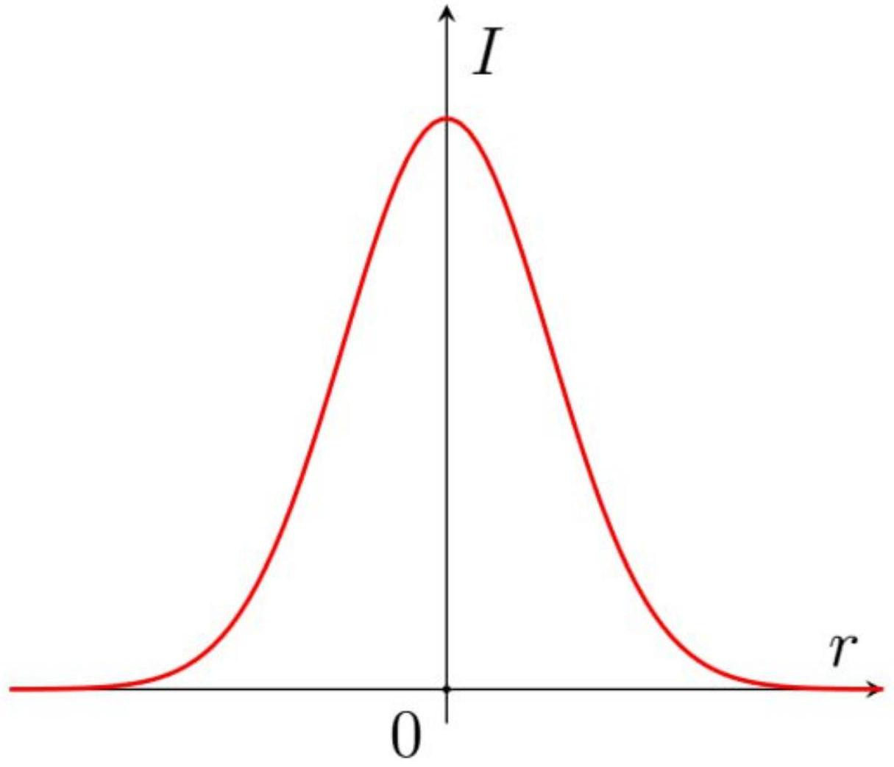
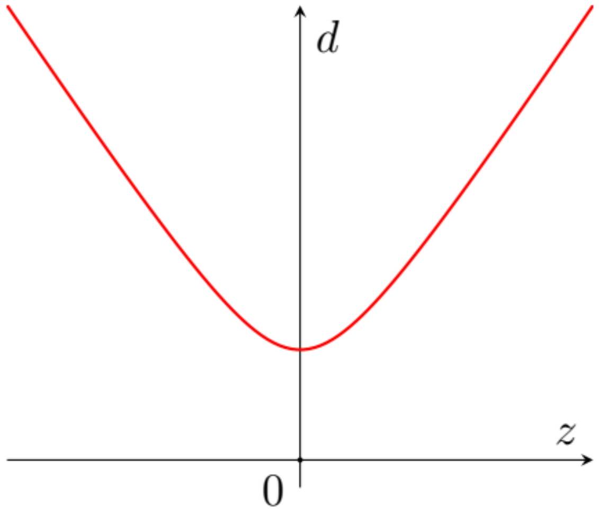
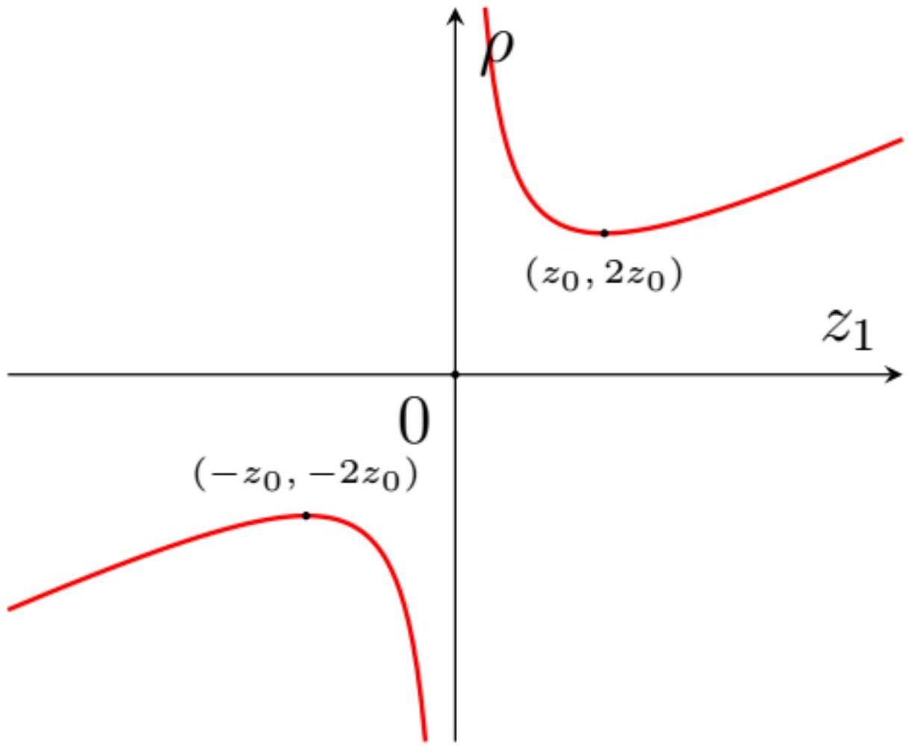

Характерный угол отклонения лучей из-за дифракции выражается через ширину пучка как

$$
\theta \sim \frac { \lambda } { w _ { 0 } } .
$$

Тогда на расстоянии $L$ ширина пучка $D \sim \theta L$

Ответ:

$$
D \sim \frac { \lambda L } { w _ { 0 } }
$$

A2 ${ } ^ { 0.20 }$ При каком ограничении на $L$ применима теория дифракции Фраунгофера? Выразите ответ через $L , w _ { 0 } , \lambda$.

Если лучи, идущие от разных точек источника, параллельны, разность хода имеет вид $\Delta = d \sin \theta$, где $\theta$ - угол между лучом и нормалью к плоскости экрана, $d -$ расстояние между точками источника. Поправка к этому выражению при конечных $L$ по порядку величины равна $d ^ { 2 } / L$. Поскольку разность хода стоит в показателе экспоненты, эта поправка должна быть много меньше длины волны, тогда ей можно пренебречь, и приближение дифракции Фраунгофера будет работать. При этом в качестве расстояния между точками источника нужно взять величину порядка ширины пучка $w _ { 0 }$.

Ответ:

$$
\frac { w _ { 0 } ^ { 2 } } { L } \ll \lambda
$$

A3 ${ } ^ { 0.80 }$ Запишите в этом случае выражение для амплитуды электрического поля в виде интеграла по $d x ^ { \prime } d y ^ { \prime }$. Найдите выражение для амплитуды поля на экране в зависимости от расстояния до оси симметрии $r$. Также в ответ могут входить $E _ { 0 } , w _ { 0 } , k$.

Вам может потребоваться интеграл

$$
\int _ { - \infty } ^ { + \infty } d x e ^ { - a x ^ { 2 } + i b x } = \sqrt { \frac { \pi } { a } } e ^ { - b ^ { 2 } / 4 a }
$$

Для удобства вычислений будем вычислять амплитуду поля в точке экрана, лежащей на оси $x$, координаты которой $( r , 0 , L )$. В силу симметрии задачи относительно оси, во всех точках на том же расстоянии $r$ до оси амплитуда будет такой же. Тогда угол между лучами, идущими в точку наблюдения, и осью $z$, равен $\theta = r / L$ ( в силу условия $r \ll L$ этот угол много меньше 1). Тогда расстояние $s = L - x ^ { \prime } \theta$. Изменением расстояния в знаменателе интеграла можно пренебречь, поэтому получим, подставляя явную зависимость для $v$ при $z = 0$

$$
v ( r , L ) = - \frac { E _ { 0 } } { i \lambda L } \int d x ^ { \prime } d y ^ { \prime } \exp \left( - \frac { x ^ { \prime 2 } + y ^ { \prime 2 } } { w _ { 0 } ^ { 2 } } - i k L + i k x ^ { \prime } \theta \right) .
$$

Здесь интегралы берутся в бесконечных пределах. Вычисляя их с помощью формулы из условия, получим окончательно

Ответ:

$$
v ( r , L ) = - \frac { \pi E _ { 0 } w _ { 0 } ^ { 2 } } { i \lambda L } e ^ { - i k L } \exp \left( - \frac { k ^ { 2 } w _ { 0 } ^ { 2 } } { 4 L ^ { 2 } } r ^ { 2 } \right)
$$

Отметим, что из полученной формулы следует значение характерной ширины пучка на экране:

$$
2 w ^ { \prime } = 2 \frac { 2 L } { k w _ { 0 } } = \frac { 2 } { \pi } \frac { \lambda L } { w _ { 0 } } \sim \frac { \lambda L } { w _ { 0 } } ,
$$

что и предсказывается оценкой пункта А1.

A4 ${ } ^ { 0.70 }$ Теперь рассмотрим случай дифракции Френеля. При этом расстояние $L$ произвольно, однако углы между лучами, идущими к точке наблюдения, и осью $z$ можно считать малыми. Найдите $A ( z ) = v ( 0,0 , z ) \exp ( i k z )$ - комплексную амплитуду на оси $O z$ без учёта фазы плоской волны. Ответ выразите через $E _ { 0 } , w _ { 0 } , k , z$.

В случае дифракции Френеля расстояние $s$ в показателе экспоненты можно разложить до второго порядка, $s = z + r ^ { \prime 2 } / 2 z$, где $r ^ { \prime } = \sqrt { x ^ { \prime 2 } + y ^ { \prime 2 } }$, тогда интеграл будет иметь вид

$$
v ( 0,0 , z ) = - \frac { E _ { 0 } } { i \lambda z } \int _ { 0 } ^ { \infty } 2 \pi r ^ { \prime } d r ^ { \prime } \exp \left( - \frac { r ^ { \prime 2 } } { w _ { 0 } ^ { 2 } } - i k z - i \frac { k r ^ { \prime 2 } } { 2 z } \right) = - \frac { \pi E _ { 0 } } { i \lambda z } e ^ { - i k z } \int _ { 0 } ^ { \infty } d \left( r ^ { \prime 2 } \right) \exp \left( - \frac { r ^ { \prime 2 } } { w _ { 0 } ^ { 2 } } - i \frac { k r ^ { \prime 2 } } { 2 z } \right) .
$$

Вычисляя интеграл, найдем

$$
v ( 0,0 , z ) = - \frac { \pi E _ { 0 } } { i \lambda z } e ^ { - i k z } \frac { w _ { 0 } ^ { 2 } } { 1 + i k w _ { 0 } ^ { 2 } / 2 z } = E _ { 0 } e ^ { - i k z } \frac { i k w _ { 0 } ^ { 2 } / 2 } { z + i k w _ { 0 } ^ { 2 } / 2 } .
$$

Учитывая $A ( z ) = v ( 0,0 , z ) e ^ { i k z }$, получаем ответ.

Ответ:

$$
A ( z ) = E _ { 0 } \frac { i k w _ { 0 } ^ { 2 } / 2 } { z + i k w _ { 0 } ^ { 2 } / 2 }
$$

В1 ${ } ^ { 0.30 }$ Подставьте (2) в (1) и получите дифференциальное уравнение, которому удовлетворяет $u ( x , y , z )$.

Рассчитаем необходимые частные производные $\hat { E } _ { x }$.

$$
\frac { \partial \hat { E } _ { x } } { \partial t } = i \omega u \exp ( - i k z ) \exp ( i \omega t ) , \quad \frac { \partial ^ { 2 } \hat { E } _ { x } } { \partial t ^ { 2 } } = - \omega ^ { 2 } u \exp ( - i k z ) \exp ( i \omega t )
$$

$$
\begin{array} { l l }
\frac { \partial \hat { E } _ { x } } { \partial x } = \frac { \partial u } { \partial x } \exp ( - i k z ) \exp ( i \omega t ) , & \frac { \partial ^ { 2 } \hat { E } _ { x } } { \partial x ^ { 2 } } = \frac { \partial ^ { 2 } u } { \partial x ^ { 2 } } \exp ( - i k z ) \exp ( i \omega t ) , \\
\frac { \partial \hat { E } _ { x } } { \partial y } = \frac { \partial u } { \partial y } \exp ( - i k z ) \exp ( i \omega t ) , & \frac { \partial ^ { 2 } \hat { E } _ { x } } { \partial y ^ { 2 } } = \frac { \partial ^ { 2 } u } { \partial y ^ { 2 } } \exp ( - i k z ) \exp ( i \omega t )
\end{array}
$$

$$
\begin{gathered}
\frac { \partial \hat { E } _ { x } } { \partial z } = \frac { \partial u } { \partial z } \exp ( - i k z ) \exp ( i \omega t ) - i k u \exp ( - i k z ) \exp ( i \omega t ) \\
\frac { \partial ^ { 2 } \hat { E } _ { x } } { \partial z ^ { 2 } } = \frac { \partial ^ { 2 } u } { \partial z ^ { 2 } } \exp ( - i k z ) \exp ( i \omega t ) - 2 i k \frac { \partial u } { \partial z } \exp ( - i k z ) \exp ( i \omega t ) - k ^ { 2 } u \exp ( - i k z ) \exp ( i \omega t ) .
\end{gathered}
$$

Подставляя найденные выражения в волновое уравнение, сокращая на $\exp ( - i k z ) \exp ( i \omega t )$ и учитывая $\omega ^ { 2 } = k ^ { 2 } c ^ { 2 }$, приходим к уравнению

Ответ:

$$
\frac { \partial ^ { 2 } u } { \partial x ^ { 2 } } + \frac { \partial ^ { 2 } u } { \partial y ^ { 2 } } + \frac { \partial ^ { 2 } u } { \partial z ^ { 2 } } - 2 i k \frac { \partial u } { \partial z } = 0
$$

В2 ${ } ^ { 0.50 }$ Покажите, что сумма вторых частных производных $u$ по «поперечным» координатам $x , y$ представима в виде:

$$
\frac { \partial ^ { 2 } u } { \partial x ^ { 2 } } + \frac { \partial ^ { 2 } u } { \partial y ^ { 2 } } = \left[ - 2 i \chi ( z ) - \chi ^ { 2 } ( z ) \cdot r ^ { 2 } \right] \cdot u
$$

Выразите $\chi ( z )$ через $q ( z ) , k$.

Рассчитаем необходимые частные производные $u$.

$$
\begin{aligned}
\frac { \partial u } { \partial x } & = - \frac { i k x } { q ( z ) } u , & \frac { \partial ^ { 2 } u } { \partial x ^ { 2 } } & = - \frac { i k } { q ( z ) } u - \frac { k ^ { 2 } x ^ { 2 } } { q ^ { 2 } ( z ) } \\
\frac { \partial u } { \partial y } & = - \frac { i k y } { q ( z ) } u , & \frac { \partial ^ { 2 } u } { \partial y ^ { 2 } } & = - \frac { i k } { q ( z ) } u - \frac { k ^ { 2 } y ^ { 2 } } { q ^ { 2 } ( z ) } .
\end{aligned}
$$

Получаем

$$
\frac { \partial ^ { 2 } u } { \partial x ^ { 2 } } + \frac { \partial ^ { 2 } u } { \partial y ^ { 2 } } = \left[ - \frac { 2 i k } { q ( z ) } - \frac { k ^ { 2 } } { q ^ { 2 } ( z ) } r ^ { 2 } \right] u .
$$

Отсюда следует

Ответ:

$$
\chi ( z ) = \frac { k } { q ^ { 2 } ( z ) }
$$

$$
\frac { \partial u } { \partial z } = \left[ \frac { A ^ { \prime } ( z ) } { A ( z ) } + i \zeta ( z ) \cdot r ^ { 2 } \right] \cdot u .
$$

Выразите $\zeta ( z )$ через $q ( z ) , q ^ { \prime } ( z ) , k$.

Рассчитаем частную производную $u$ по $z$.

$$
\frac { \partial u } { \partial z } = A ^ { \prime } ( z ) \exp \left( - \frac { i k r ^ { 2 } } { 2 q ( z ) } \right) + A ( z ) \frac { i k r ^ { 2 } q ^ { \prime } ( z ) } { 2 q ^ { 2 } ( z ) } \exp \left( - \frac { i k r ^ { 2 } } { 2 q ( z ) } \right) = \left[ \frac { A ^ { \prime } ( z ) } { A ( z ) } + \frac { i k r ^ { 2 } q ^ { \prime } ( z ) } { 2 q ^ { 2 } ( z ) } \right] u .
$$

Отсюда следует

Ответ:

$$
\zeta ( z ) = \frac { k q ^ { \prime } ( z ) } { 2 q ^ { 2 } ( z ) }
$$

В4 ${ } ^ { 0.40 }$ Получите дифференциальное уравнение на $q ( z )$. Решите его с начальным условием

$$
q ( 0 ) = i z _ { 0 } ,
$$

где $z _ { 0 }$ - действительная величина, $z _ { 0 } > 0$. Выразите $z _ { 0 }$ через $w _ { 0 } , k$.

Используя условие

$$
2 k \zeta ( z ) - \chi ^ { 2 } ( z ) = 0
$$

приходим к дифференциальному уравнению на $q ( z )$.

Ответ:

$$
q ^ { \prime } ( z ) = 1
$$

Решая уравнение с заданным начальным условием, получаем

Ответ:

$$
q ( z ) = i z _ { 0 } + z
$$

Сравнивая два выражения для $u ( r , 0 )$

$$
u ( r , 0 ) = E _ { 0 } \exp \left( - \frac { r ^ { 2 } } { w _ { 0 } ^ { 2 } } \right) = A ( 0 ) \exp \left( - \frac { i k r ^ { 2 } } { 2 i z _ { 0 } } \right) ,
$$

получаем

Ответ:

$$
z _ { 0 } = \frac { k w _ { 0 } ^ { 2 } } { 2 }
$$

В5 ${ } ^ { 0.20 }$ Выразите $R ( z )$ и $w ( z )$ через $k , z , z _ { 0 }$.

Находя действительную и мнимую части

$$
\frac { 1 } { q ( z ) } = \frac { 1 } { z + i z _ { 0 } } = \frac { z - i z _ { 0 } } { z ^ { 2 } + z _ { 0 } ^ { 2 } } ,
$$

приходим к ответу

Ответ:

$$
\begin{gathered}
R ( z ) = \frac { z ^ { 2 } + z _ { 0 } ^ { 2 } } { z } \\
w ( z ) = \sqrt { \frac { 2 z _ { 0 } } { k } \left( 1 + \frac { z ^ { 2 } } { z _ { 0 } ^ { 2 } } \right) }
\end{gathered}
$$

В6 ${ } ^ { 0.40 }$ Проверьте, что найденная в части А функция $A ( z )$ действительно удовлетворяет уравнению (5), то есть при ее подстановке слагаемые, не содержащие $r ^ { 2 }$, обращаются в 0.

Рассчитаем $A ^ { \prime } ( z )$.

$$
\begin{gathered}
A ^ { \prime } ( z ) = - \frac { E _ { 0 } i k w _ { 0 } ^ { 2 } / 2 } { \left( z + i k w _ { 0 } ^ { 2 } / 2 \right) ^ { 2 } } , \\
\frac { A ^ { \prime } ( z ) } { A ( z ) } = - \frac { 1 } { z + i k w _ { 0 } ^ { 2 } / 2 } = - \frac { 1 } { z + i z _ { 0 } } .
\end{gathered}
$$

Для $\chi ( z )$ верно:

$$
\chi ( z ) = \frac { k } { q ( z ) } = \frac { k } { z + i z _ { 0 } } .
$$

Подставим в уравнение (5):

$$
- 2 i k \frac { A ^ { \prime } ( z ) } { A ( z ) } - 2 i \chi ( z ) = - 2 i k \left( - \frac { 1 } { z + i z _ { 0 } } + \frac { 1 } { z + i z _ { 0 } } \right) = 0 .
$$

Таким образом, $A ( z )$ действительно удовлетворяет уравнению (5).

В7 ${ } ^ { 0.30 }$ Представим функцию $A ( z )$ в виде

$$
A ( z ) = A _ { 0 } ( z ) e ^ { i \psi ( z ) }
$$

с вещественными $A _ { 0 }$ и $\psi$. Выразите $A _ { 0 }$ и $\psi$ через $z , z _ { 0 } , E _ { 0 }$.

Рассчитав модуль и фазу комплекснозначной функции $A ( z )$, приходим к ответу.

Ответ:

$$
\begin{aligned}
& A _ { 0 } ( z ) = \frac { E _ { 0 } } { \sqrt { 1 + \frac { z ^ { 2 } } { z _ { 0 } ^ { 2 } } } } \\
& \psi ( z ) = \operatorname { arctg } \left( \frac { z } { z _ { 0 } } \right)
\end{aligned}
$$

С1 ${ } ^ { 0.50 }$ Найдите распределение интенсивности в пучке $I ( r , z )$. Ответ выразите через $\beta , A _ { 0 } ( z ) , w ( z )$. Изобразите характерный график распределения интенсивности в радиальном направлении при фиксированном $z$.

В каждой точке пространства зависимость действительного поля от времени $\sim \cos ( \omega t + \varphi )$, усреднение даёт

$$
\left\langle \cos ^ { 2 } ( \omega t + \varphi ) \right\rangle = \frac { 1 } { 2 }
$$

Тогда

$$
I ( r , z ) = \frac { 1 } { 2 } \beta \left| \hat { E } _ { x } \right| ^ { 2 } = \frac { 1 } { 2 } \beta | u ( r , z ) | ^ { 2 } = \frac { 1 } { 2 } \beta \left| A ( z ) \exp \left( - \frac { i k r ^ { 2 } } { 2 q ( z ) } \right) \right| ^ { 2 } = \frac { 1 } { 2 } \beta A _ { 0 } ^ { 2 } ( z ) \exp \left( - \frac { 2 r ^ { 2 } } { w ( z ) } \right) .
$$

Ответ:

$$
I ( r , z ) = \frac { 1 } { 2 } \beta A _ { 0 } ^ { 2 } ( z ) \exp \left( - \frac { 2 r ^ { 2 } } { w ( z ) } \right)
$$

Ответ:

С2 ${ } ^ { 0.40 }$ Найдите полную мощность излучения $P$, передаваемого пучком через плоскость $z =$ const. Ответ выразите через $\beta , E _ { 0 } , k , z _ { 0 } , z$.

По определению

$$
d P = I \cdot d S .
$$

В силу радиальной симметрии

$$
\begin{aligned}
& d P = I ( r , z ) \cdot 2 \pi r d r \\
& P = \int _ { 0 } ^ { \infty } I ( r , z ) \cdot 2 \pi r d r
\end{aligned}
$$

Подставляя $I ( r , z )$ из предыдущего пункта и используя выражения для $A _ { 0 } ( z ) , w ( z )$ из части А, получаем ответ.

Ответ:

$$
P = \frac { \beta \pi z _ { 0 } E _ { 0 } ^ { 2 } } { 2 k }
$$

Отметим, что $P$ оказывается независимым от $z$, что согласуется с законом сохранения энергии.

с3 ${ } ^ { 0.40 }$ Выразите ширину пучка $d ( z )$ через $w ( z )$. Постройте качественный график зависимости $d ( z )$.

Используя результат пункта С1, получаем расстояние от оси $O z$ до границы пучка:

$$
r = w ( z ) .
$$

Отсюда диаметр пучка

Ответ:

$$
d = 2 w ( z )
$$

С учётом выражения для $w ( z )$

$$
d ( z ) = \sqrt { \frac { 8 z _ { 0 } } { k } \left( 1 + \frac { z ^ { 2 } } { z _ { 0 } ^ { 2 } } \right) }
$$

Ответ:

C4 ${ } ^ { 0,10 }$ Найдите минимальную ширину пучка $d _ { п }$. Ответ выразите через $z _ { 0 } , k$. Величина $d _ { п }$ называется шириной перетяжки. Плоскость, перпендикулярная $O z$, в которой ширина пучка равна ширине перетяжки, называется плоскостью перетяжки.

Ответ очевидно следует из предыдущего пункта

Ответ:

$$
d _ { \Pi } = \sqrt { \frac { 8 z _ { 0 } } { k } }
$$

С5 ${ } ^ { 0.40 }$ Получите уравнение, определяющее форму волнового фронта гауссова пучка, проходящего через заданную точку $\left( 0 , z _ { 1 } \right)$. В уравнении могут присутствовать $R ( z ) , \psi ( z ) , k , z , z _ { 1 }$.

Фаза волны в точке $( r , z )$ :

$$
\varphi ( r , z ) = - k z - \frac { k r ^ { 2 } } { 2 R ( z ) } + \psi ( z ) .
$$

Волновой фронт определяется условием

$$
\varphi ( r , z ) = \varphi \left( 0 , z _ { 1 } \right) .
$$

Ответ:

$$
k z + \frac { k r ^ { 2 } } { 2 R ( z ) } - \psi ( z ) = k z _ { 1 } - \psi \left( z _ { 1 } \right)
$$

С6 ${ } ^ { 0.50 }$ Найдите радиус кривизны фронта $\rho \left( z _ { 1 } \right)$. Ответ выразите через $R ( z )$. Постройте график зависимости $\rho \left( z _ { 1 } \right)$, указав на нём характерные особенности и их координаты.

считая $R ( z ) \approx R \left( z _ { 1 } \right)$ и $\psi ( z ) \approx \psi \left( z _ { 1 } \right)$, получим

$$
\Delta z = z _ { 1 } - z \approx \frac { r ^ { 2 } } { 2 R \left( z _ { 1 } \right) }
$$

Для волнового фронта сферической волны на расстоянии $\rho \left( z _ { 1 } \right)$ от источника верно

$$
\begin{gathered}
r ^ { 2 } + \left( \rho \left( z _ { 1 } \right) - \Delta z \right) ^ { 2 } = \rho ^ { 2 } \left( z _ { 1 } \right) \\
r ^ { 2 } - 2 \rho \left( z _ { 1 } \right) \Delta z + \Delta z ^ { 2 } = 0
\end{gathered}
$$

что при $\Delta z \ll \rho \left( z _ { 1 } \right)$ приводит к выражению

$$
\Delta z = \frac { r ^ { 2 } } { 2 \rho \left( z _ { 1 } \right) } .
$$

Сравнение двух выражений приводит к ответу

Ответ:

$$
\rho \left( z _ { 1 } \right) = R \left( z _ { 1 } \right)
$$

С учётом выражения для $R \left( z _ { 1 } \right)$, получим

$$
\rho \left( z _ { 1 } \right) = \frac { z _ { 1 } ^ { 2 } + z _ { 0 } ^ { 2 } } { z _ { 1 } } .
$$

У зависимости есть два экстремума: $\left( z _ { 0 } , 2 z _ { 0 } \right) , \left( - z _ { 0 } , - 2 z _ { 0 } \right)$.

Ответ:

С7 ${ } ^ { 0.70 }$ Пусть в некоторой точке $z = z _ { a }$ параметры гауссова пучка $R \left( z _ { a } \right) = R _ { a } , w \left( z _ { a } \right) = w _ { a }$. Найдите $z _ { a }$ и диаметр перетяжки пучка $d _ { п }$. Ответ выразите через $R _ { a } , w _ { a } , k$.

Используя выражения для $R ( z ) , w ( z )$, запишем систему из двух уравнений:

$$
\left\{ \begin{array} { l }
w _ { a } ^ { 2 } = \frac { 2 } { k } \left( z _ { 0 } + \frac { z _ { a } ^ { 2 } } { z _ { 0 } } \right) \\
R _ { a } = z _ { a } + \frac { z _ { 0 } ^ { 2 } } { z _ { a } }
\end{array} \right.
$$

Деление первого уравнения на второе даёт

$$
\frac { w _ { a } ^ { 2 } } { R _ { a } } = \frac { 2 z _ { a } } { k z _ { 0 } } \quad \Rightarrow \quad \frac { z _ { a } } { z _ { 0 } } = \frac { k w _ { a } ^ { 2 } } { 2 R _ { a } } .
$$

Подставим отношение $\frac { z _ { a } } { z _ { 0 } }$ во второе уравнение:

$$
R _ { a } = z _ { a } \left( 1 + \left( \frac { 2 R _ { a } } { k w _ { a } ^ { 2 } } \right) ^ { 2 } \right) .
$$

Отсюда следует ответ для $z _ { a }$. Затем из найденного ранее отношения $\frac { z _ { a } } { z _ { 0 } }$ находится $z _ { 0 }$ и с учётом пункта С4 пересчитывается в $d _ { п }$.

Ответ:

$$
\begin{aligned}
z _ { a } & = \frac { R _ { a } } { 1 + \left( \frac { 2 R _ { a } } { k w _ { a } ^ { 2 } } \right) ^ { 2 } } \\
d _ { \Pi } & = \frac { 2 w _ { a } } { \sqrt { 1 + \left( \frac { k w _ { a } ^ { 2 } } { 2 R _ { a } } \right) ^ { 2 } } }
\end{aligned}
$$

Используя выражение для $d ( z )$, полученное в пункте СЗ, запишем уравнения:

$$
\left\{ \begin{array} { l }
d _ { 1 } ^ { 2 } = \frac { 8 z _ { 0 } } { k } \left( 1 + \frac { ( z \mp L / 2 ) ^ { 2 } } { z _ { 0 } ^ { 2 } } \right) \\
d _ { 2 } ^ { 2 } = \frac { 8 z _ { 0 } } { k } \left( 1 + \frac { ( z \pm L / 2 ) ^ { 2 } } { z _ { 0 } ^ { 2 } } \right)
\end{array} \right.
$$

Здесь $z$ - координата точки, расположенной посередине между двумя данными в условии. Уравнения записываются неоднозначно $( \pm )$, так как условием не дано относительное расположение описываемых точек, т. е. какая из них имеет большую координату $z$. Преобразуем уравнения:

$$
\left\{ \begin{array} { l }
( z \mp L / 2 ) ^ { 2 } = z _ { 0 } ^ { 2 } \left( \frac { k d _ { 1 } ^ { 2 } } { 8 z _ { 0 } } - 1 \right) \\
( z \pm L / 2 ) ^ { 2 } = z _ { 0 } ^ { 2 } \left( \frac { k d _ { 2 } ^ { 2 } } { 8 z _ { 0 } } - 1 \right)
\end{array} \right.
$$

Для избавления от неизвестной $z$ извлечём корень из обеих частей уравнений и вычтем получившиеся уравнения друг из друга. Отметим, что при взятии корня снова возникает неоднозначность ( $A ^ { 2 } = B \Rightarrow A = \pm \sqrt { B }$ ). Учёт условия $d _ { 2 } > d _ { 1 }$ и очевидных математических фактов (например, что сумма корней из положительных чисел положительна) приводит к совокупности всего из двух уравнений, что соответствует двум описанным ранее случаям взаимного расположения описываемых точек.

$$
\sqrt { \frac { \pi d _ { 2 } ^ { 2 } } { 4 \lambda z _ { 0 } } - 1 } \pm \sqrt { \frac { \pi d _ { 1 } ^ { 2 } } { 4 \lambda z _ { 0 } } - 1 } = \frac { L } { z _ { 0 } } .
$$

Данные уравнения относительно переменной $z _ { 0 }$ могут быть решены численно методом итераций, с помощью таблиц и иными доступными способами.

$$
z _ { 01 } = 0.131 \mathrm {~cm} , \quad z _ { 02 } = 1.186 \mathrm {~cm} .
$$

Пересчитываем значения $z _ { 0 }$ в $d _ { п }$.

Ответ:

$$
d _ { \Pi } = 0.13 \mathrm { мМ } \quad \text { или } \quad d _ { \Pi } = 0.40 \mathrm { мм }
$$

Отметим, что уравнения на $z _ { 0 }$ могут также быть решены явно, однако это требует гораздо больших вычислительных и временных затрат. Явное выражение:

$$
z _ { 0 } = \frac { d _ { 1 } ^ { 2 } + d _ { 2 } ^ { 2 } \pm \sqrt { \left( d _ { 1 } ^ { 2 } + d _ { 2 } ^ { 2 } \right) ^ { 2 } - \frac { 16 L ^ { 2 } \lambda ^ { 2 } } { \pi ^ { 2 } } \left( 1 + \alpha ^ { 2 } \right) } } { \frac { 8 \lambda } { \pi } \left( 1 + \alpha ^ { 2 } \right) }
$$

где $\alpha = \frac { \pi } { 4 \lambda L } \left( d _ { 2 } ^ { 2 } - d _ { 1 } ^ { 2 } \right)$.

D1 ${ } ^ { 0.70 }$ Известно, что линза изменяет фазу падающей волны таким образом, что все лучи приходят в фокус с одинаковой фазой. Используя этот факт, выразите коэффициент $\eta$ через $k , f$.

Пусть один луч выходит из линзы на расстоянии $r$ от оси $O z$, второй проходит по оси $z$. Тогда при $r \ll f$ разность хода между ними составит

$$
\delta \approx \frac { r ^ { 2 } } { 2 f }
$$

Разность фаз первого и второго луча

$$
\Delta \varphi = \varphi _ { 1 } - \varphi _ { 2 } = - k \delta .
$$

Знак «минус» появляется, так как исходная волна выбрана с множителем $\exp ( - i k z )$, и второй луч, идущий вдоль $O z$, проходит больший оптический путь, чем первый. Условие синфазности запишется в виде:

$$
- k \frac { r ^ { 2 } } { 2 f } + \eta r ^ { 2 } = 0 ,
$$

что приводит к ответу

Ответ:

$$
\eta = \frac { k } { 2 f }
$$

D2 ${ } ^ { 0.50 }$ Пусть на тонкую собирающую линзу с фокусным расстоянием $f$ падает гауссов пучок, распространяющийся вдоль $O z$. Плоскость линзы перпендикулярна оси $O z$. Непосредственно перед линзой параметры пучка $R \left( z _ { л } \right) = R _ { 1 } , w \left( z _ { л } \right) = w _ { 1 }$. Известно, что после линзы он также останется гауссовым. Найдите параметры пучка $R _ { 2 } , w _ { 2 }$ непосредственно после прохождения через линзу. Диаметр линзы много больше $w _ { 1 }$.

Так как пучок остаётся гауссов, распределение амплитуды поля в плоскости линзы до и после её прохождения могут быть записаны в виде

$$
\begin{aligned}
& u _ { 1 } = u _ { 0 } \exp \left( - \frac { i k r ^ { 2 } } { 2 R _ { 1 } } - \frac { r ^ { 2 } } { w _ { 1 } ^ { 2 } } \right) , \\
& u _ { 2 } = u _ { 0 } ^ { \prime } \exp \left( - \frac { i k r ^ { 2 } } { 2 R _ { 2 } } - \frac { r ^ { 2 } } { w _ { 2 } ^ { 2 } } \right) .
\end{aligned}
$$

С другой стороны, с учётом предыдущего пункта

$$
u _ { 2 } = u _ { 1 } \exp \left( \frac { i k r ^ { 2 } } { 2 f } \right) = u _ { 0 } \exp \left( - \frac { i k r ^ { 2 } } { 2 R _ { 1 } } + \frac { i k r ^ { 2 } } { 2 f } - \frac { r ^ { 2 } } { w _ { 1 } ^ { 2 } } \right) .
$$

Сравнивая действительную и мнимую часть коэффициента перед $r ^ { 2 }$ в двух полученных выражениях для $u _ { 2 }$, получаем ответ.

Ответ:

$$
\begin{gathered}
R _ { 2 } = \frac { R _ { 1 } f } { f - R _ { 1 } } \\
w _ { 2 } = w _ { 1 }
\end{gathered}
$$

D3 ${ } ^ { 0.40 }$ Найдите условие, связывающее $R _ { 1 } , w _ { 1 }$ и $f$, при котором гауссов пучок сфокусируется за линзой, то есть его плоскость перетяжки будет расположена после линзы.

Очевидно, что плоскость перетяжки будет расположена после линзы, если $R _ { 2 } < 0$. То же следует, например, из пунктов СЗ или С7. С учётом формулы для $R _ { 2 }$, это приводит к условию

Ответ:

$$
f < R _ { 1 }
$$
