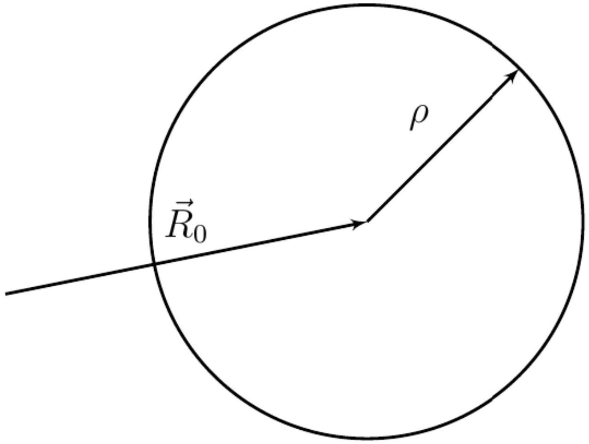
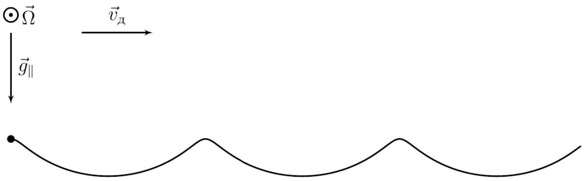
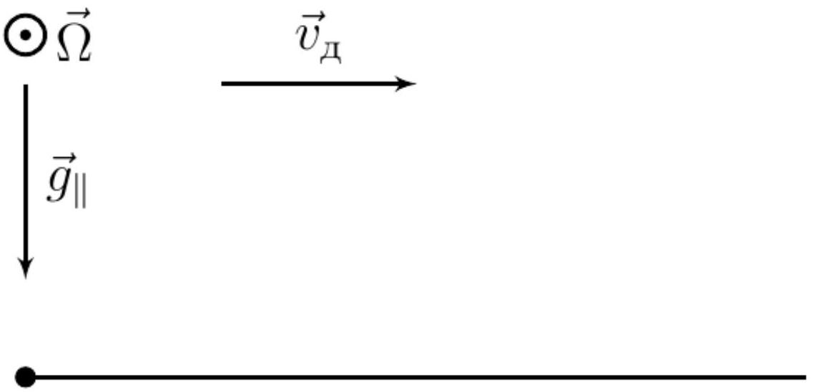
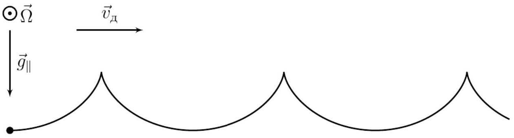
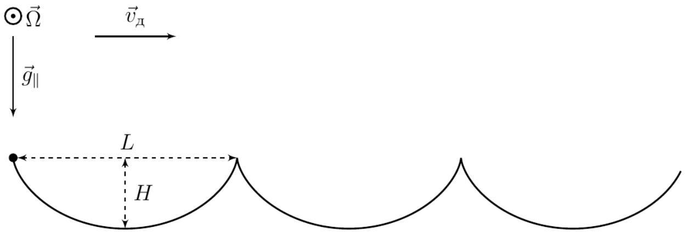
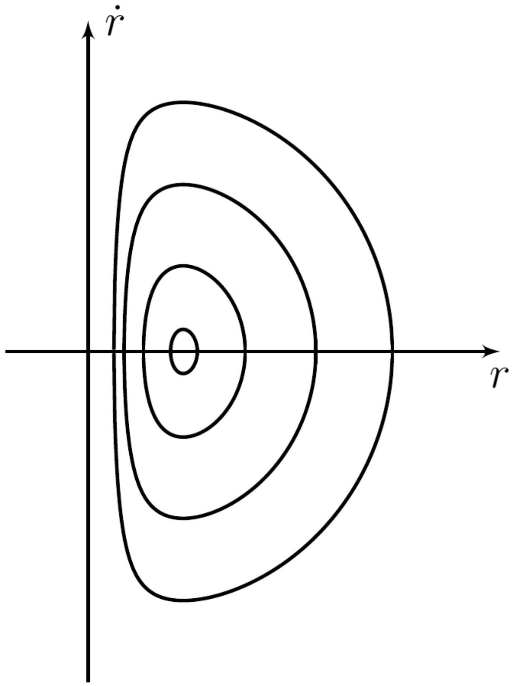
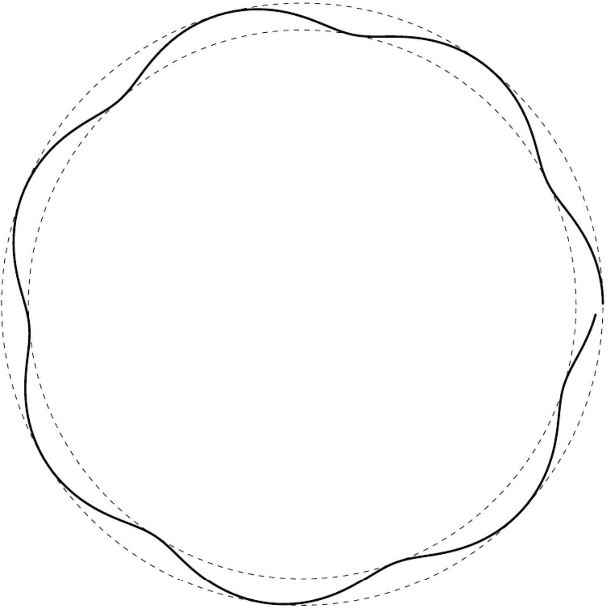

А1 ${ } ^ { 0.50 }$ Выразите $\ddot { \vec { r } }$ и $\dot { \vec { \omega } }$ через $\vec { F } , m , \beta , \vec { a }$.

Запишем второй закон Ньютона:

$$
m \ddot { \vec { r } } = m \vec { g } + \vec { N } + \vec { F } .
$$

Шар не движется в вертикальном направлении, поэтому $m \vec { g } + \vec { N } = 0$. Получаем:

Ответ:

$$
\ddot { \vec { r } } = \frac { \vec { F } } { m }
$$

Второй ответ следует из закона изменения момента импульса относительно центра шара:

Ответ:

$$
\dot { \vec { \omega } } = \frac { [ \vec { a } , \vec { F } ] } { \beta m a ^ { 2 } }
$$

А2 ${ } ^ { 0.30 }$ Запишите условие кинематической связи. Выразите ответ через $\dot { \vec { r } } , \vec { a } , \vec { r } , \vec { \omega }$ и $\vec { \Omega }$.

Скорости стола и шара в точке их касания должны совпадать, поэтому:

Ответ:

$$
[ \vec { \Omega } , \vec { r } ] = \dot { \vec { r } } + [ \vec { \omega } , \vec { a } ]
$$

А3 ${ } ^ { 0.70 }$ Выразите $\ddot { \vec { r } }$ через $\beta , \dot { \vec { r } }$ и $\vec { \Omega }$.

Выразим $\vec { F }$ из уравнения на $\dot { \vec { \omega } }$, домножив его векторно на $\vec { a }$ :

$$
\begin{gathered}
\beta m a ^ { 2 } [ \dot { \vec { \omega } } , \vec { a } ] = [ [ \vec { a } , \vec { F } ] , \vec { a } ] = [ \vec { a } , [ \vec { F } , \vec { a } ] ] = a ^ { 2 } \vec { F } \\
\vec { F } = \beta m [ \dot { \vec { \omega } } , \vec { a } ]
\end{gathered}
$$

Выразим через заданные величины, продифференцировав кинематическую связь:

$$
\begin{gathered}
{ [ \vec { \Omega } , \dot { \vec { r } } ] = \ddot { \vec { r } } + [ \dot { \vec { \omega } } , \vec { a } ] . } \\
\vec { F } = \beta m [ \dot { \vec { \omega } } , \vec { a } ] = \beta m ( [ \vec { \Omega } , \dot { \vec { r } } ] - \ddot { \vec { r } } ) .
\end{gathered}
$$

Подставляем полученное выражение и получаем ответ:

Ответ:

$$
\ddot { \vec { r } } = \frac { \beta } { 1 + \beta } [ \vec { \Omega } , \dot { \vec { r } } ]
$$

А4 ${ } ^ { 0.70 }$ Пусть изначально положение и скорость шара были $\vec { r } _ { 0 }$ и $\vec { v } _ { 0 }$ соответственно. Определите, как $\dot { \vec { r } }$ зависит от $\vec { r }$ при дальнейшем движении. Качественно изобразите траекторию движения центра шара в этом случае и укажите характерные размеры и координаты.

Заметим, что выражение, полученное в прошлом пункте является равенством двух полных производных по времени:

$$
\frac { \mathrm { d } } { \mathrm {~d} t } \dot { \vec { r } } = \frac { \mathrm { d } } { \mathrm {~d} t } \frac { \beta } { 1 + \beta } [ \vec { \Omega } , \vec { r } ] .
$$

Проинтегрировав это соотношение с учётом того, что скорость центра шара всегда параллельна плоскости стола:

$$
\dot { \vec { r } } = \frac { \beta } { 1 + \beta } \left[ \vec { \Omega } , \vec { r } - \vec { R } _ { 0 } \right] ,
$$

где $\vec { R } _ { 0 }$ - постоянный вектор. Заметим, что это уравнение задаёт движение по окружности с центром $\vec { R } _ { 0 }$.
Теперь подставим начальные условия. Тогда интегрирование ускорения нам даст:

Ответ:

$$
\dot { \vec { r } } = \frac { \beta } { 1 + \beta } \left[ \vec { \Omega } , \vec { r } - \vec { r } _ { 0 } \right] + \vec { v } _ { 0 }
$$

Как мы уже увидели, траектория - окружность. Осталось найти её центр и радиус.

$$
\dot { \vec { r } } = \frac { \beta } { 1 + \beta } \left[ \vec { \Omega } , \vec { r } - \vec { R } _ { 0 } \right] = \frac { \beta } { 1 + \beta } \left[ \vec { \Omega } , \vec { r } - \vec { r } _ { 0 } \right] + \vec { v } _ { 0 }
$$

Домножим векторно на $\vec { \Omega }$ :

$$
\begin{gathered}
\frac { \beta } { 1 + \beta } \left[ \vec { \Omega } , \left[ \vec { \Omega } , \vec { r } - \vec { R } _ { 0 } \right] \right] = \frac { \beta } { 1 + \beta } \left[ \vec { \Omega } , \left[ \vec { \Omega } , \vec { r } - \vec { r } _ { 0 } \right] \right] + \left[ \vec { \Omega } , \vec { v } _ { 0 } \right] \\
\frac { \beta } { 1 + \beta } \left[ \vec { \Omega } , \left[ \vec { \Omega } , \vec { r } _ { 0 } - \vec { R } _ { 0 } \right] \right] = \frac { \beta \Omega ^ { 2 } } { 1 + \beta } \left( \vec { R } _ { 0 } - \vec { r } _ { 0 } \right) = \left[ \vec { \Omega } , \vec { v } _ { 0 } \right] \\
\vec { R } _ { 0 } - \vec { r } _ { 0 } = \frac { 1 + \beta } { \Omega ^ { 2 } \beta } \left[ \vec { \Omega } , \vec { v } _ { 0 } \right]
\end{gathered}
$$

Из полученного соотношения сразу получаем центр и радиус окружности:

$$
\vec { R } _ { 0 } = \vec { r } _ { 0 } + \frac { 1 + \beta } { \Omega ^ { 2 } \beta } \left[ \vec { \Omega } , \vec { v } _ { 0 } \right] , \quad \rho = \frac { ( 1 + \beta ) v _ { 0 } } { \Omega \beta } .
$$

Ответ:

В1 ${ } ^ { 0.30 }$ Выразите $\ddot { \vec { r } }$ через $\vec { g } _ { \| } , \beta , \dot { \vec { r } }$ и $\vec { \Omega }$.

Отличие от прошлой части есть только в том, что в начальном выражении для $\ddot { \vec { r } }$ будет отличный от нуля вклад $m \vec { g } + \vec { N } = m \vec { g } \|$.

$$
\ddot { \vec { r } } = \vec { g } _ { \| } + \beta ( [ \vec { \Omega } , \dot { \vec { r } } ] - \ddot { \vec { r } } )
$$

Ответ:

$$
\ddot { \vec { r } } = \frac { \vec { g } _ { \| } } { 1 + \beta } + \frac { \beta } { 1 + \beta } [ \vec { \Omega } , \dot { \vec { r } } ]
$$

B2 ${ } ^ { 1.40 }$ Обозначим

$$
\vec { u } = \frac { \left[ \vec { \Omega } \times \vec { g } _ { \| } \right] } { \Omega ^ { 2 } } .
$$

Качественно изобразите траектории центра шара при следующих начальных скоростях:

1. $\vec { v } _ { 0 } = \vec { u }$
2. $\vec { v } _ { 0 } = 2.5 \vec { u }$
3. $\vec { v } _ { 0 } = 5 \vec { u }$
4. $\vec { v } _ { 0 } = 0$

Для случая 4 рассчитайте численно характерные размеры траектории для $g _ { \| } = 1.0 \mathrm {~m} / \mathrm { c } ^ { 2 } , \Omega = 10$ рад/с.

Проанализируем ответ прошлого пункта. Ускорение складывается из постоянного слагаемого и слагаемого, получаемого векторным произведением скорости и постоянного вектора. Это полностью аналогично движению в скрещенных магнитном и электрическом поле. Найдём скорость дрейфа $\dot { \vec { r } } = \vec { v } + \vec { v } _ { д }$.

$$
\begin{gathered}
\dot { \vec { v } } = \frac { \vec { g } _ { \| } } { 1 + \beta } + \frac { \beta } { 1 + \beta } [ \vec { \Omega } , \vec { v } ] + \frac { \beta } { 1 + \beta } \left[ \vec { \Omega } , \vec { v } _ { \text {д } } \right] \\
0 = \frac { \vec { g } _ { \| } } { 1 + \beta } + \frac { \beta } { 1 + \beta } \left[ \vec { \Omega } , \vec { v } _ { \text {д } } \right]
\end{gathered}
$$

Векторно домножив на $\vec { \Omega }$, получаем значение скорости дрейфа:

$$
\vec { v } _ { \text {д } } = \frac { \left[ \vec { \Omega } , \vec { g } _ { \| } \right] } { \Omega ^ { 2 } \beta } = \frac { 5 } { 2 } \vec { u } .
$$

Вектор $\vec { v }$ вращается с постоянной угловой скоростью $\beta \vec { \Omega } / ( 1 + \beta )$. Используя полученные выражения, получаем вид траектории для каждого из случаев.

Ответ: 1 случай: отличие от скорости дрейфа мало, поэтому будет траектория без самопересечений.

Ответ:

Ответ: 2 случай: начальная скорость совпадает со скоростью дрейфа, поэтому будет движение по прямой

Ответ:

Ответ: 3 случай: отличие от скорости дрейфа равно скорости дрейфа, поэтому будет движение по циклоиде.

Ответ:

Ответ: 4 случай: аналогично прошлому случаю будет движение по циклоиде.
Найдём характерные размеры траектории. Введём координаты $x$ и $y$ в направлениях $\vec { v } _ { д }$ и $- \vec { g } _ { \| }$соответственно. Тогда в момент времени $t$ скорости

равны:

$$
\left\{ \begin{array} { l }
\dot { x } = 2.5 \frac { g _ { \| } } { \Omega } \left( 1 - \cos \left( \frac { 2 } { 7 } \Omega t \right) \right) \\
\dot { y } = - 2.5 \frac { g _ { \| } } { \Omega } \sin \left( \frac { 2 } { 7 } \Omega t \right)
\end{array} \right.
$$

Параметрическое уравнение траектории:

$$
\left\{ \begin{array} { l }
x = \frac { 5 g _ { \| } t } { 2 \Omega } - \frac { 35 g _ { \| } } { 4 \Omega ^ { 2 } } \sin \left( \frac { 2 } { 7 } \Omega t \right) \\
y = - \frac { 35 g _ { \| } } { 4 \Omega ^ { 2 } } \left( 1 - \cos \left( \frac { 2 } { 7 } \Omega t \right) \right)
\end{array} \right.
$$

Высота циклоиды и её период:

$$
H = \frac { 35 g _ { \| } } { 2 \Omega ^ { 2 } } = 17.5 \text { см } , \quad L = \pi H = 55.0 \text { см. }
$$

Ответ:

С1 ${ } ^ { 0.20 }$ Выразите $\ddot { \vec { r } }$ через $m , \beta , \vec { a } , \vec { r } , \vec { N } , \vec { g } , \dot { \vec { \omega } }$

Из второго закона Ньютона:

$$
\ddot { \vec { r } } = \frac { \vec { N } } { m } + \vec { g } + \frac { \vec { F } } { m } .
$$

Из закона изменения момента импульса:

$$
m a ^ { 2 } \beta \dot { \vec { \omega } } = [ \vec { a } \times \vec { F } ] \Rightarrow m a ^ { 2 } \beta [ \vec { a } \times \dot { \vec { \omega } } ] = [ \vec { a } \times [ \vec { a } \times \vec { F } ] ] = \vec { a } ( \vec { a } \cdot \vec { F } ) - \vec { F } a ^ { 2 } = - \vec { F } a ^ { 2 } .
$$

Откуда:

Ответ:

$$
\ddot { \vec { r } } = \frac { \vec { N } } { m } + \vec { g } - [ \vec { a } \times \dot { \vec { \omega } } ] \beta
$$

C2 ${ } ^ { 0.40 }$ Запишите условие кинематической связи. Выразите ответ через $\dot { \vec { r } } , \vec { a } , \vec { r } , \vec { \omega } , \vec { \Omega }$.

Скорости стола и шара в точке их касания должны совпадать, поэтому:

$$
\dot { \vec { r } } + [ \vec { \omega } \times \vec { a } ] = [ \vec { \Omega } \times ( \vec { r } + \vec { a } ) ]
$$

откуда:

Ответ:

$$
\dot { \vec { r } } = [ \vec { \Omega } \times ( \vec { r } + \vec { a } ) ] - [ \vec { \omega } \times \vec { a } ]
$$

$$
\ddot { \vec { r } } = [ \vec { \Omega } \times \dot { \vec { r } } ] + [ \vec { \Omega } \times \dot { \vec { a } } ] - [ \dot { \vec { \omega } } \times \vec { a } ] - [ \vec { \omega } \times \dot { \vec { a } } ]
$$

Из выражения для $\ddot { \vec { r } }$, полученного в пункте С1:

$$
[ \dot { \vec { \omega } } \times \vec { a } ] = \frac { 1 } { \beta } \left( \ddot { \vec { r } } - \frac { \vec { N } } { m } - \vec { g } \right)
$$

Также:

$$
\dot { \vec { a } } = [ \vec { \zeta } \times \vec { a } ]
$$

откуда:

Ответ:

$$
\ddot { \vec { r } } = \frac { [ \vec { \Omega } \times \dot { \vec { r } } ] } { 1 + \beta ^ { - 1 } } + \frac { 1 } { 1 + \beta } \left( \frac { \vec { N } } { m } + \vec { g } \right) + \frac { 1 } { 1 + \beta ^ { - 1 } } [ ( \vec { \Omega } - \vec { \omega } ) \times [ \vec { \zeta } \times \vec { a } ] ]
$$

Посмотрим, как преобразуется эта формула с учётом некоторых приближений, а именно:

- $\theta \ll 1$, то есть стол слабо отличается от плоского и влияние гравитации слабо;
- движение шара финитно, то есть он движется в ограниченной области пространства около вершины и не удаляется на бесконечность;
- $a \lesssim r$, то есть шар не слишком близок к вершине конуса;
- $\zeta \lesssim \Omega$, то есть вращение стола происходит достаточно быстро в сравнении со скоростью движения шара;
- $| ( \vec { \omega } , \vec { a } ) | \lesssim \Omega r$, то есть скорость верчения не слишком велика.

Ограничимся слагаемыми порядка малости $\theta$.
Заметим, что слагаемые с $\vec { N }$ и $\vec { g }$ имеют порядок малости $\theta$, так как такого порядка проекция $\vec { g }$ на поверхность конуса. В силу того, что движение финитно, остальные слагаемые должны быть такого же порядка. Теперь осталось показать, что первое слагаемое на порядок больше последнего, тогда первое имеет первый порядок малости, а последнее - второй, и его можно отбросить.

Оценка величины первого слагаемого:

$$
\left| \beta \frac { [ \vec { \Omega } , \dot { \vec { r } } ] } { 1 + \beta } \right| \sim | [ \vec { \Omega } , \dot { \vec { r } } ] | \sim \Omega \dot { r } + \Omega \zeta r .
$$

Теперь последнее слагаемое разложим на два слагаемых и проанализируем каждое из них с учётом того, что угол между $\vec { \zeta }$ и $\vec { a }$ равен $\theta$ :

$$
\left| \frac { \beta } { 1 + \beta } [ \vec { \Omega } , [ \vec { \zeta } , \vec { a } ] ] \right| \sim \Omega \zeta a \theta \lesssim \Omega \zeta r \theta \ll \Omega \zeta r \lesssim \left| \beta \frac { [ \vec { \Omega } , \dot { \vec { r } } ] } { 1 + \beta } \right| .
$$

Для оценки второго слагаемого разложим $\vec { \omega }$ на компоненты вдоль и перпендикулярно $\vec { a } : \vec { \omega } = \vec { \omega } _ { a } + \vec { \omega } _ { \perp }$. Заметим, что из кинетической связи и последнего условия приближения:

$$
\omega a \lesssim | \dot { \vec { r } } | + \Omega r + | ( \vec { \omega } , \vec { a } ) | \sim \dot { r } + \Omega r .
$$

Таким образом последнее выражение, малость которого надо доказать:

$$
\left| \frac { \beta } { 1 + \beta } [ \vec { \omega } , [ \vec { \zeta } , \vec { a } ] ] \right| \sim \omega \zeta a \theta \lesssim ( \dot { r } + \Omega r ) \zeta \theta \ll \Omega \dot { r } + \Omega \zeta r \sim \left| \beta \frac { [ \vec { \Omega } , \dot { \vec { r } } ] } { 1 + \beta } \right| .
$$

Таким образом получаем нужную приближённую формулу.

C4 ${ } ^ { 1.00 }$ Докажите, что в рассматриваемом приближении сохраняется величина:

$$
l = r ^ { 2 } \left( \zeta - \frac { \Omega \beta } { 2 ( 1 + \beta ) } \right)
$$

Здесь $\zeta = | \vec { \zeta } |$.

Первое решение.
Разложим по введённому базису слагаемые из данного уравнения:

$$
\dot { \vec { r } } = [ \vec { \zeta } \times \vec { r } ] + \dot { r } \vec { e } _ { r } = \zeta r \vec { e } _ { \varphi } + \dot { r } \vec { e } _ { r }
$$

$$
\begin{gathered}
\ddot { \vec { r } } = \left( \dot { \zeta } r \vec { e } _ { \varphi } + \zeta \dot { r } \vec { e } _ { \varphi } + \zeta r \frac { \mathrm {~d} \vec { e } _ { \varphi } } { \mathrm { d } t } \right) + \left( \ddot { r } \vec { e } _ { r } + \dot { r } \frac { \mathrm {~d} \vec { e } _ { r } } { \mathrm {~d} t } \right) = \\
= \dot { \zeta } r \vec { e } _ { \varphi } + \zeta \dot { r } \vec { e } _ { \varphi } + \zeta ^ { 2 } r \left( - \vec { e } _ { r } - \theta \vec { e } _ { z } \right) + \ddot { r } \vec { e } _ { r } + \zeta \dot { r } \vec { e } _ { \varphi } = ( \dot { \zeta } r + 2 \zeta \dot { r } ) \vec { e } _ { \varphi } + \left( \ddot { r } - \zeta ^ { 2 } r \right) \vec { e } _ { r } + \zeta ^ { 2 } r \theta \vec { e } _ { z }
\end{gathered}
$$

$$
\begin{gathered}
{ [ \vec { \Omega } \times \dot { \vec { r } } ] = \Omega \dot { r } \vec { e } _ { \varphi } - \Omega \zeta r \vec { e } _ { r } + \Omega \zeta r \theta \vec { e } _ { z } } \\
\frac { \vec { N } } { m } + \vec { g } = g \theta \vec { e } _ { r } + \left( \frac { N _ { z } } { m } - g \right) \vec { e } _ { z }
\end{gathered}
$$

Теперь подставим их в данное уравнение, взяв проекции на $\vec { e } _ { \varphi }$ :

$$
\begin{gathered}
\dot { \zeta } r + 2 \zeta \dot { r } = \frac { \Omega \dot { r } } { 1 + \beta ^ { - 1 } } \Rightarrow \frac { \mathrm {~d} \zeta } { \mathrm {~d} r } = \frac { 1 } { r } \left( \frac { \Omega } { 1 + \beta ^ { - 1 } } - 2 \zeta \right) \Rightarrow \\
\int \frac { \mathrm { d } \zeta } { \frac { \Omega } { 1 + \beta ^ { - 1 } } - 2 \zeta } = \int \frac { \mathrm { d } r } { r } \Rightarrow r ^ { 2 } \left( \zeta - \frac { \Omega \beta } { 2 ( 1 + \beta ) } \right) = \text { const }
\end{gathered}
$$

что и требовалось доказать.
Второе решение.
Рассмотрим изменение момента импульса центра масс:

$$
\frac { \mathrm { d } } { \mathrm {~d} t } [ \vec { r } , \dot { \vec { r } } ] = [ \vec { r } , \ddot { \vec { r } } ] .
$$

Для проекции на ось $z$ :

$$
\frac { \mathrm { d } } { \mathrm {~d} t } \left( \vec { e } _ { z } , \vec { r } , \dot { \vec { r } } \right) = \frac { \mathrm { d } } { \mathrm {~d} t } \left( r ^ { 2 } \zeta \right) = \left( \vec { e } _ { z } , \vec { r } , \ddot { \vec { r } } \right) .
$$

Заметим, что $\left( \vec { e } _ { z } , \vec { r } , \vec { N } \right)$ и $\left( \vec { e } _ { z } , \vec { r } , \vec { g } \right)$ равны нулю, так как эти тройки векторов лежат в одной плоскости, поэтому от ускорения останется только одно слагаемое:

$$
\begin{gathered}
\frac { \mathrm { d } } { \mathrm {~d} t } \left( r ^ { 2 } \zeta \right) = \frac { \beta } { 1 + \beta } \left( \vec { e } _ { z } , \vec { r } , [ \vec { \Omega } , \dot { \vec { r } } ] \right) = \frac { \beta } { 1 + \beta } \left( \vec { e } _ { z } , \vec { \Omega } ( \vec { r } , \dot { \vec { r } } ) - \dot { \vec { r } } ( \vec { \Omega } , \vec { r } ) \right) \\
\frac { \mathrm { d } } { \mathrm {~d} t } \left( r ^ { 2 } \zeta \right) = \frac { \beta } { 1 + \beta } \left( \left( \vec { e } _ { z } , \vec { \Omega } \right) ( \vec { r } , \dot { \vec { r } } ) - \left( \vec { e } _ { z } , \dot { \vec { r } } \right) ( \vec { \Omega } , \vec { r } ) \right)
\end{gathered}
$$

Подставим значения скальных произведений и отбросим слагаемые второго порядка малости:

$$
\begin{aligned}
\frac { \mathrm { d } } { \mathrm {~d} t } \left( r ^ { 2 } \zeta \right) = \frac { \beta } { 1 + \beta } \left( \Omega \frac { \mathrm { d } } { \mathrm {~d} t } \left( \frac { r ^ { 2 } } { 2 } \right) - r \dot { r } \Omega \theta ^ { 2 } \right) & \approx \frac { \beta \Omega } { 1 + \beta } \frac { \mathrm { d } } { \mathrm {~d} t } \left( \frac { r ^ { 2 } } { 2 } \right) \\
\frac { \mathrm { d } } { \mathrm {~d} t } \left( r ^ { 2 } \left( \zeta - \frac { \Omega \beta } { 2 ( 1 + \beta ) } \right) \right) & = 0
\end{aligned}
$$

Получили, что величина $l$ сохраняется.

С5 ${ } ^ { 0.50 }$ Выразите $\ddot { r }$ через $r , \zeta , \beta , \Omega , \theta \backsim g$.

Теперь рассмотрим уравнение:

$$
\ddot { \vec { r } } = \frac { 1 } { 1 + \beta } \left( \vec { g } + \frac { \vec { N } } { m } \right) + \frac { \beta [ \vec { \Omega } \times \dot { \vec { r } } ] } { 1 + \beta } .
$$

Подставим в него проекции слагаемых на $\vec { e } _ { r }$ :

$$
\ddot { r } - \zeta ^ { 2 } r = \frac { g \theta } { 1 + \beta } - \frac { \beta \Omega \zeta r } { 1 + \beta } \quad \Rightarrow \quad \ddot { r } = \zeta ^ { 2 } r + \frac { g \theta } { 1 + \beta } - \frac { \beta \Omega \zeta r } { 1 + \beta } .
$$

Ответ:

$$
\ddot { r } = \zeta ^ { 2 } r + \frac { g \theta } { 1 + \beta } - \frac { \beta \Omega \zeta r } { 1 + \beta }
$$

C6 ${ } ^ { 0.70 }$ Определите, при каких значениях $r$ возможно движение по круговым траекториям вокруг оси симметрии конуса ( $r =$ const) и определите значения $\zeta$, соответствующее такому движению. Выразите ответ через $r , \beta , \Omega , \theta n g$.

$$
r = \mathrm { const } \quad \Rightarrow \quad \ddot { r } = 0 = \zeta ^ { 2 } r + \frac { g \theta } { 1 + \beta } - \frac { \beta \Omega \zeta r } { 1 + \beta } .
$$

Тогда получаем квадратное уравнение отноительно $\zeta$ :

$$
\zeta ^ { 2 } - \zeta \cdot \frac { \Omega } { 1 + \beta ^ { - 1 } } + \frac { g \theta } { ( 1 + \beta ) r } = 0 \quad \Rightarrow \quad \zeta _ { 1,2 } = \frac { \Omega } { 2 \left( 1 + \beta ^ { - 1 } \right) } \pm \sqrt { \left( \frac { \Omega } { 2 \left( 1 + \beta ^ { - 1 } \right) } \right) ^ { 2 } - \frac { g \theta } { ( 1 + \beta ) r } } .
$$

Так как подкоренное выражение не отрицательно:

$$
r \geq \frac { 4 g \theta ( 1 + \beta ) } { \Omega ^ { 2 } \beta ^ { 2 } } = r _ { \min }
$$

Ответ:

$$
\begin{gathered}
\zeta _ { 1,2 } = \frac { \Omega } { 2 \left( 1 + \beta ^ { - 1 } \right) } \pm \sqrt { \left( \frac { \Omega } { 2 \left( 1 + \beta ^ { - 1 } \right) } \right) ^ { 2 } - \frac { g \theta } { ( 1 + \beta ) r } } \\
r \geq \frac { 4 g \theta ( 1 + \beta ) } { \Omega ^ { 2 } \beta ^ { 2 } }
\end{gathered}
$$

С7 ${ } ^ { 0.80 }$ Выразите $\dot { r } ^ { 2 }$ с точностью до произвольной постоянной через $l , r , g , \beta , \Omega$ и $\theta$. Качественно изобразите вид фазовых диаграмм $\dot { r } ( r )$.

Легко увидеть, что:

$$
\ddot { r } = \frac { \mathrm { d } \dot { r } } { \mathrm {~d} t } = \frac { \mathrm { d } \dot { r } } { \mathrm {~d} r / \dot { r } } = \frac { \mathrm { d } \left( \dot { r } ^ { 2 } \right) } { 2 \mathrm {~d} r } \quad \Rightarrow \quad \dot { r } ^ { 2 } = 2 \int \ddot { r } ( r ) \mathrm { d } r .
$$

Мы знаем, что сохраняется величина $l$, следовательно:

$$
\zeta ( r ) = \frac { \Omega \beta } { 2 ( 1 + \beta ) } + \frac { l } { r ^ { 2 } } .
$$

Подставляя $\zeta$ в выражение для $\ddot { r }$, получим:

$$
\dot { r } ^ { 2 } = 2 \int \left( \frac { g \theta } { 1 + \beta } + \frac { l ^ { 2 } } { r ^ { 3 } } - \frac { \Omega ^ { 2 } r } { 4 \left( 1 + \beta ^ { - 1 } \right) ^ { 2 } } \right) \mathrm { d } r = \frac { 2 g \theta r } { 1 + \beta } - \frac { \Omega ^ { 2 } r ^ { 2 } } { 4 \left( 1 + \beta ^ { - 1 } \right) ^ { 2 } } - \frac { l ^ { 2 } } { r ^ { 2 } } + \text { const. }
$$

Ответ:

$$
\dot { r } ^ { 2 } = \frac { 2 g \theta r } { 1 + \beta } - \frac { \Omega ^ { 2 } r ^ { 2 } } { 4 \left( 1 + \beta ^ { - 1 } \right) ^ { 2 } } - \frac { l ^ { 2 } } { r ^ { 2 } } + \mathrm { const }
$$

Ответ:

С8 ${ } ^ { 0.40 }$ Рассмотрим малое возмущение круговой орбиты с радиусом $r _ { 0 }$. Определите циклическую частоту $\xi$ малых радиальных колебаний. Выразите ответ через $\Omega , r _ { 0 } , \theta , g , \beta$.

Орбиту возмутили так, что расстояние от оси до центра шара представило в виде:

$$
r ( t ) = r _ { 0 } + \delta ( t ) , \left( \text { где } \delta \ll r _ { 0 } \text { и } \langle r \rangle = r _ { 0 } \right) .
$$

Тогда:

$$
\ddot { \delta } = - \xi ^ { 2 } \delta = \ddot { r } \left( r _ { 0 } \right) = \frac { 2 g \theta } { 1 + \beta } + \frac { l ^ { 2 } } { r ^ { 3 } } - \frac { \Omega ^ { 2 } r } { 4 \left( 1 + \beta ^ { - 1 } \right) ^ { 2 } } \approx - \frac { 3 l ^ { 2 } \delta } { r _ { 0 } ^ { 4 } } - \frac { \Omega ^ { 2 } \delta } { 4 \left( 1 + \beta ^ { - 1 } \right) ^ { 2 } } ,
$$

откуда:

$$
\xi = \sqrt { \frac { 3 l ^ { 2 } } { r _ { 0 } ^ { 4 } } + \frac { \Omega ^ { 2 } } { 4 \left( 1 + \beta ^ { - 1 } \right) ^ { 2 } } } ,
$$

где:

$$
l = r _ { 0 } ^ { 2 } \left( \zeta \left( r _ { 0 } \right) - \frac { \Omega } { 2 \left( 1 + \beta ^ { - 1 } \right) } \right) = \pm r _ { 0 } ^ { 2 } \sqrt { \frac { \Omega ^ { 2 } } { 4 \left( 1 + \beta ^ { - 1 } \right) ^ { 2 } } - \frac { g \theta } { ( 1 + \beta ) r _ { 0 } } } .
$$

Подставляя $l$ в выражение для $\xi$, получаем:

Ответ:

$$
\xi = \sqrt { \frac { \Omega ^ { 2 } } { \left( 1 + \beta ^ { - 1 } \right) ^ { 2 } } - \frac { 3 g \theta } { ( 1 + \beta ) r _ { 0 } } }
$$

с9 ${ } ^ { 1.20 }$ Пусть шар изначально движется с $\dot { \varphi } = \zeta _ { 0 } = 0.44$ рад/с, $\dot { r } = 0 , r _ { 0 } = 15$ см по конусу с $\theta = 1 ^ { \circ }$ и $\Omega = 10$ рад/с. Изобразите вид траектории и укажите её характерные размеры. Известно, что $g = 9.81 \mathrm {~m} / \mathrm { c } ^ { 2 }$.
Примечание: можете считать известным, что отклонение от круговой орбиты в этом случае мало, поэтому зависимость $\ddot { r } ( r )$ и $\dot { \varphi } ( r )$ можно приближать линейной функцией вблизи СРЕДНЕГО значения $r$.

Найдём значение $l$ по данным величинам:

$$
l = - 0.022243 \mathrm {~m} ^ { 2 } / \mathrm { c } .
$$

В начальный момент времени $\ddot { r }$ :

$$
\ddot { r } ( 0 ) = \frac { 2 g \theta } { 1 + \beta } + \frac { l ^ { 2 } } { r _ { 0 } ^ { 3 } } - \frac { \beta ^ { 2 } \Omega ^ { 2 } r _ { 0 } } { 4 ( 1 + \beta ) ^ { 2 } } = - 0.037232 \mathrm {~m} / \mathrm { c } ^ { 2 } .
$$

Получается, что в начальный момент времени $r$ максимально. Найдём амплитуду колебаний $A$. Заметим, что среднее значение радиус-вектора будет $r _ { 0 } - A$.

$$
\begin{gathered}
0.037232 \mathrm {~m} / \mathrm { c } ^ { 2 } = \xi ^ { 2 } A \\
\xi ^ { 2 } = \frac { 3 l ^ { 2 } } { \left( r _ { 0 } - A \right) ^ { 4 } } + \frac { \beta ^ { 2 } \Omega ^ { 2 } } { 4 ( 1 + \beta ) ^ { 2 } }
\end{gathered}
$$

Получили уравнение на $A$ :

$$
0.037232 \mathrm {~m} / \mathrm { c } ^ { 2 } = \left( \frac { 3 l ^ { 2 } } { \left( r _ { 0 } - A \right) ^ { 4 } } + \frac { \beta ^ { 2 } \Omega ^ { 2 } } { 4 ( 1 + \beta ) ^ { 2 } } \right) A .
$$

Заметим, что в правой части монотонная по $A$ функция, поэтому решение единственно. Найдём его численно:

$$
A = 6.6961 \mathrm {~mm} .
$$

Найдём $\xi$ и среднее значение $\zeta$ :

$$
\begin{aligned}
\xi & = \sqrt { \frac { 3 l ^ { 2 } } { \left( r _ { 0 } - A \right) ^ { 4 } } + \frac { \beta ^ { 2 } \Omega ^ { 2 } } { 4 ( 1 + \beta ) ^ { 2 } } } = 2.3580 \mathrm { c } ^ { - 1 } , \\
\langle \zeta \rangle & = \frac { \Omega \beta } { 2 ( 1 + \beta ) } + \frac { l } { \left( r _ { 0 } - A \right) ^ { 2 } } = 0.34545 \text { рад } / \text { с. }
\end{aligned}
$$

Тогда уравнения движения:

$$
\left\{ \begin{array} { l }
r = r _ { 0 } - A + A \cos ( \xi t ) , \\
\zeta = \langle \zeta \rangle + \left( \zeta _ { 0 } - \langle \zeta \rangle \right) \cos ( \xi t ) .
\end{array} \right.
$$

Стоит отметить, что крайне важно учитывать, что среднее значение $\zeta$ не совпадает с начальным, так как разница этих значений очень значительна. При этом гармоничность по времени $\zeta$ и $r$, верна, ведь $r$ меняется слабо и линейные приближения всех уравнений движений разумны.
Качественный вид траектории уже понятен: движение с периодическим изменением радиуса, в среднем изменение угла $\varphi$ происходит со скоростью $\langle \zeta \rangle$.
Количество радиальных колебаний за один оборот:

$$
N = \frac { \xi } { \langle \zeta \rangle } = 6.83 .
$$

Стоит отметить, что при численном решении дифференциальных уравнений движения получается, что на самом деле $N = 7$ и траектория является замкнутой с хорошей точностью, приближение даёт близкий ответ, что подтверждает разумность сделанных приближений.
Нарисуем полученную нами траекторию:

$$
\left\{ \begin{array} { l }
r = r _ { 0 } - A + A \cos ( \xi t ) , \\
\varphi = \langle \zeta \rangle t + \frac { \zeta _ { 0 } - \langle \zeta \rangle } { \xi } \sin ( \xi t ) .
\end{array} \right.
$$

Она расположена между окружностями с радиусами $r _ { 0 } = 15.0 \mathrm {~cm}$ и $r _ { 0 } - 2 A = 13.7 \mathrm {~cm}$ (они изображены на рисунке ниже пунктиром) и за один оборот по траектории происходит почти 7 радиальных колебаний:

Ответ:

