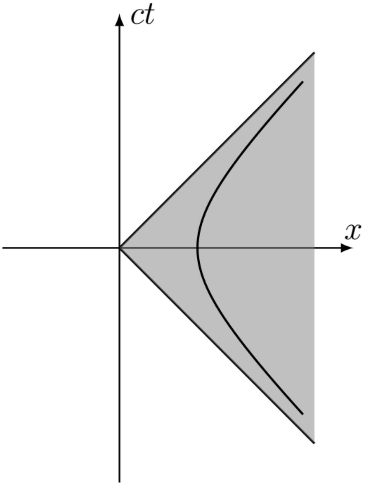

Максимальное время будет соответствовать достижению скорости света, то есть:

$$
c = t _ { \max } ( d ) a ( d ) = t _ { \max } ( d ) \frac { a _ { 0 } } { 1 + 2 a _ { 0 } d / c ^ { 2 } }
$$

откуда для заданного наблюдателя

$$
t _ { \max } = \frac { c } { a _ { 0 } } \left( 1 + \frac { 2 a _ { 0 } d } { c ^ { 2 } } \right) .
$$

Поскольку $d \geq 0$, для всех частиц модель будет применима при $t > t _ { \text {max } }$ с

Ответ:

$$
t _ { \max } ( d ) = \frac { c } { a _ { 0 } }
$$

А2 ${ } ^ { 0.50 }$ Покажите, что если для двух наблюдателей в начальный момент $d _ { 1 } < d _ { 2 }$, то при $t < t _ { \max }$ для их координат по прежнему будет выполняться $x _ { 1 } ( t ) < x _ { 2 } ( t )$.

Координаты наблюдателей зависят от времени следующим образом:

$$
x _ { 1 } ( t ) = d _ { 1 } + \frac { a _ { 0 } t ^ { 2 } / 2 } { 1 + 2 a _ { 0 } d _ { 1 } / c ^ { 2 } } , \quad x _ { 2 } = d _ { 2 } + \frac { a _ { 0 } t ^ { 2 } / 2 } { 1 + 2 a _ { 0 } d _ { 2 } / c ^ { 2 } }
$$

Ускорение второго наблюдателя больше, поэтому он постепенно догоняет первого, и расстояние между наблюдателями монотонно убывает. Их разность координат равна

$$
\Delta x ( t ) = x _ { 2 } ( t ) - x _ { 1 } ( t ) = \left( d _ { 2 } - d _ { 1 } \right) \left( 1 - \frac { a _ { 0 } ^ { 2 } t ^ { 2 } / c ^ { 2 } } { \left( 1 + \frac { 2 a _ { 0 } d _ { 1 } } { c ^ { 2 } } \right) \left( 1 + \frac { 2 a _ { 0 } d _ { 2 } } { c ^ { 2 } } \right) } \right) .
$$

Первый наблюдатель достигнет скорости света быстрее, поэтому максимальное время движения $t _ { \max } = c / a \left( d _ { 1 } \right)$. Тогда нам нужно проверить, что значение $\Delta x \left( t _ { \text {max } } \right) > 0$ :

$$
\Delta x \left( t _ { \max } \right) = \left( d _ { 2 } - d _ { 1 } \right) \left( 1 - \frac { 1 + 2 a _ { 0 } d _ { 1 } / c ^ { 2 } } { 1 + 2 a _ { 0 } d _ { 2 } / c ^ { 2 } } \right) = \frac { 2 a _ { 0 } \left( d _ { 2 } - d _ { 1 } \right) ^ { 2 } } { c ^ { 2 } + 2 a _ { 0 } d _ { 2 } } > 0
$$

что и требовалось доказать.

Отметим, что достаточно было проверить, что $\Delta x ( t ) > 0$ при $t _ { \max } = c / a _ { 0 }$ из предыдущего пункта. Это можно сделать аналогично, или определить время $t _ { 1 }$, при котором первый наблюдатель догонит второго,

$$
t _ { 1 } = \frac { c } { a _ { 0 } } \sqrt { 1 + \frac { 2 a _ { 0 } d _ { 1 } } { c ^ { 2 } } } \sqrt { 1 + \frac { 2 a _ { 0 } d _ { 2 } } { c ^ { 2 } } } > \frac { c } { a _ { 0 } } .
$$

А3 ${ } ^ { 1.00 }$ Пусть наблюдатель 1 в момент времени $t _ { 1 }$ испускает световой сигнал, а наблюдатель 2 получает его в момент времени $t _ { 2 }$. Ускорения наблюдателей $a _ { 1 }$ и $a _ { 2 }$, начальные координаты $d _ { 1 }$ и $d _ { 2 }$ соответственно. Покажите, что между этими временами выполняется соотношение

$$
\left( t _ { 1 } - \frac { c } { a _ { 1 } } \right) ^ { 2 } = \varepsilon \left( t _ { 2 } - \frac { c } { a _ { 2 } } \right) ^ { 2 }
$$

если $d _ { 2 } > d _ { 1 }$, и соотношение

$$
\left( t _ { 1 } + \frac { c } { a _ { 1 } } \right) ^ { 2 } = \varepsilon \left( t _ { 2 } + \frac { c } { a _ { 2 } } \right) ^ { 2 } ,
$$

если $d _ { 2 } < d _ { 1 }$. Выразите постоянную $\varepsilon$ через $a _ { 1 }$ и $a _ { 2 }$.

Рассмотрим сначала случай, когда $d _ { 2 } > d _ { 1 }$. До достижения второго наблюдателя свет пройдёт расстояние

$$
\begin{equation*}
x _ { 2 } \left( t _ { 2 } \right) - x _ { 1 } \left( t _ { 1 } \right) = d _ { 2 } - d _ { 1 } + \frac { a _ { 2 } t _ { 2 } ^ { 2 } } { 2 } - \frac { a _ { 1 } t _ { 1 } ^ { 2 } } { 2 } = c \left( t _ { 2 } - t _ { 1 } \right) \tag{1}
\end{equation*}
$$

откуда:

$$
\left( \frac { a _ { 2 } t _ { 2 } ^ { 2 } } { 2 } - c t _ { 2 } \right) - \left( \frac { a _ { 1 } t _ { 1 } ^ { 2 } } { 2 } - c t _ { 1 } \right) = d _ { 1 } - d _ { 2 } .
$$

Выделим в левой части полные квадраты по $t _ { 1 }$ и $t _ { 2 }$, получим

$$
\left( t _ { 2 } - \frac { c } { a _ { 2 } } \right) ^ { 2 } \frac { a _ { 2 } } { 2 } - \left( t _ { 1 } - \frac { c } { a _ { 1 } } \right) ^ { 2 } \frac { a _ { 1 } } { 2 } - \frac { c ^ { 2 } } { 2 } \left( \frac { 1 } { a _ { 2 } } - \frac { 1 } { a _ { 1 } } \right) = d _ { 1 } - d _ { 2 }
$$

Подставляя $d _ { 1 }$ и $d _ { 2 }$, выраженные через $a _ { 1 } , a _ { 2 } , c$, получаем, что слагаемое с $d _ { 1 } - d _ { 2 }$ сокращается и остаются только полные квадраты:

$$
\left( t _ { 1 } - \frac { c } { a _ { 1 } } \right) ^ { 2 } = \left( t _ { 2 } - \frac { c } { a _ { 2 } } \right) ^ { 2 } \frac { a _ { 2 } } { a _ { 1 } } ,
$$

откуда находим искомый параметр:

$$
\varepsilon = \frac { a _ { 2 } } { a _ { 1 } } .
$$

Случай, когда $d _ { 2 } < d _ { 1 }$ отличается от $d _ { 2 } > d _ { 1 }$ только направлением распространения светового сигнала, то есть в выражении (1) нужно заменить $c$ на $- c$.

Ответ:

$$
\varepsilon = \frac { a _ { 2 } } { a _ { 1 } }
$$

А4 $1 ^ { 1.30 }$ Для того, чтобы измерить расстояние до другого наблюдателя, наблюдатель 1 (с начальным значением координаты $d _ { 1 }$ ) испускает в момент времени $t _ { A }$ луч, который достигает наблюдателя 2 (с начальной координатой $d _ { 2 } > d _ { 1 }$ ) в некоторый момент времени $t _ { C }$, отражается и возвращается к первому наблюдателю в момент времени $t _ { B }$ (по часам лабораторной СО). Тогда наблюдатель 1 считает. что расстояние до наблюдателя 2 равно $D _ { \text {rad } } = c \left( t _ { B } - t _ { A } \right) / 2$. Выразите это расстояние через $d _ { 1 } , d _ { 2 } , a _ { 0 } , c$ и покажите, что оно не зависит от $t _ { A }$.

Используя первое соотношение из предыдущего пункта, запишем связь между временами $t _ { A }$ и $t _ { C }$ :

$$
\left( t _ { A } - \frac { c } { a _ { 1 } } \right) = \left( t _ { C } - \frac { c } { a _ { 2 } } \right) \sqrt { \frac { a _ { 2 } } { a _ { 1 } } } .
$$

Аналогично из второго соотношения предыдущего пункта следует связь времен $t _ { C }$ и $t _ { B }$. При этом важно понимать, что посылает сигнал наблюдатель с ускорением $a _ { 2 }$, а принимает наблюдатель с ускорением $a _ { 1 }$, поэтому $a _ { 1 }$ и $a _ { 2 }$ нужно поменять местами, в том числе и в коэффициенте $\varepsilon$ :

$$
\left( t _ { C } + \frac { c } { a _ { 2 } } \right) = \left( t _ { B } + \frac { c } { a _ { 1 } } \right) \sqrt { \frac { a _ { 1 } } { a _ { 2 } } } .
$$

Знаки плюс в обоих выражениях берутся, поскольку с увеличением времени испускания сигнала время его приема также должно возрастать. Выражая $t _ { C }$ из первой формулы и подставляя во вторую, получим

$$
t _ { B } = \sqrt { \frac { a _ { 2 } } { a _ { 1 } } } \left( t _ { C } + \frac { c } { a _ { 2 } } \right) - \frac { c } { a _ { 1 } } = \sqrt { \frac { a _ { 2 } } { a _ { 1 } } } \left[ \sqrt { \frac { a _ { 1 } } { a _ { 2 } } } \left( t _ { A } - \frac { c } { a _ { 1 } } \right) + 2 \frac { c } { a _ { 2 } } \right] - \frac { c } { a _ { 1 } } .
$$

Таким образом, найдем время от испускания сигнала до приема

$$
t _ { B } - t _ { A } = \frac { 2 c } { \sqrt { a _ { 1 } a _ { 2 } } } - \frac { 2 c } { a _ { 2 } } .
$$

Это время действительно не зависит от времени испускания сигнала $t _ { A }$, поэтому измеренное расстояние $D _ { \text {rad } }$ также не зависит от $t _ { A }$. Окончательно получаем подставляя выражения для $a _ { 1,2 }$ через $d _ { 1,2 }$

Ответ:

$$
D _ { r a d } = \frac { c ^ { 2 } } { a _ { 0 } } \left( \sqrt { 1 + \frac { 2 a _ { 0 } d _ { 1 } } { c ^ { 2 } } } \sqrt { 1 + \frac { 2 a _ { 0 } d _ { 2 } } { c ^ { 2 } } } - 1 - \frac { 2 a _ { 0 } d _ { 1 } } { c ^ { 2 } } \right)
$$

А5 ${ } ^ { 0.30 }$ Пусть $d _ { 1 } = d$, а $d _ { 2 } = d _ { 1 } + \Delta d$, где $\Delta d \ll d$ - положительное расстояние между наблюдателями. Выразите $D _ { r a d }$ в первом порядке малости по $\Delta d$ через $d , a _ { 0 } , c$ и $\Delta d$.

При $d _ { 1 } = d _ { 2 }$ расстояние $D _ { \text {rad } } = 0$, поэтому в первом порядке

$$
D _ { r a d } = \frac { \partial D _ { r a d } } { \partial d _ { 2 } } \Delta d ,
$$

причем в выражение для производной нужно подставить $d _ { 1 } = d _ { 2 } = d$. Дифференцируя, получим

Ответ:

$$
D _ { r a d } = \Delta d
$$

Отметим, что это выражение не зависит ни от ускорений, ни от времени, несмотря на то, что физически наблюдатели сближаются.

В1 ${ } ^ { 0.20 }$ Пусть наблюдатель движется относительно инерциальной системы отсчета со скоростью $v$. При этом в момент времени $t = 0 , x = 0$. Выразите $x , t$ через $\tau$.

В сопутствующей СО перемещение наблюдателя $x ^ { \prime } = 0$. Тогда из преобразований Лоренца следует:

$$
\begin{aligned}
& x = \gamma \left( x ^ { \prime } + v \tau \right) = \frac { v \tau } { \sqrt { 1 - \frac { v ^ { 2 } } { c ^ { 2 } } } } \\
& t = \gamma \left( \tau + \frac { x ^ { \prime } v } { c } \right) = \frac { \tau } { \sqrt { 1 - \frac { v ^ { 2 } } { c ^ { 2 } } } }
\end{aligned}
$$

Ответ:

$$
x ( \tau ) = \frac { v \tau } { \sqrt { 1 - \frac { v ^ { 2 } } { c ^ { 2 } } } } , \quad t ( \tau ) = \frac { \tau } { \sqrt { 1 - \frac { v ^ { 2 } } { c ^ { 2 } } } }
$$

В2 ${ } ^ { 0.70 }$ Пусть некоторое событие произошло в точке с временем и координатой $( t , x )$. Определите для него значения собственного времени $\tau _ { 1 } , \tau _ { 2 }$. Для простоты можете провести вычисления только для случая, когда событие произошло справа от наблюдателя.

Световой сигнал пройдёт от наблюдателя до события расстояние

$$
x - x \left( \tau _ { 1 } \right) = c \left( t - t \left( \tau _ { 1 } \right) \right) ,
$$

а от события до наблюдателя - расстояние

$$
x - x \left( \tau _ { 2 } \right) = c \left( t \left( \tau _ { 2 } \right) - t \right) .
$$

Подставив выражения для $x ( \tau )$ и $t ( \tau )$ из предыдущего пункта, получим:

Ответ:

$$
\tau _ { 1 } = \frac { ( c t - x ) \sqrt { 1 - \frac { v ^ { 2 } } { c ^ { 2 } } } } { c - v } , \quad \tau _ { 2 } = \frac { ( c t + x ) \sqrt { 1 - \frac { v ^ { 2 } } { c ^ { 2 } } } } { c + v }
$$

Вз ${ } ^ { 0.40 }$ Покажите, что определенные таким образом время и координата ( $T , X$ ) совпадают с временем и координатой в инерциальной СО, движущейся со скоростью $v$ относительно исходной СО.

Используя определения из условия, получим

$$
\begin{gathered}
X = \frac { \tau _ { 2 } - \tau _ { 1 } } { 2 } c = \frac { ( c t + x ) ( c - v ) - ( c t - x ) ( c + v ) } { 2 c \sqrt { 1 - \frac { v ^ { 2 } } { c ^ { 2 } } } = \frac { x - v t } { \sqrt { 1 - \frac { v ^ { 2 } } { c ^ { 2 } } } } } ; \\
T = \frac { \tau _ { 1 } + \tau _ { 2 } } { 2 } = \frac { ( c t - x ) ( c + v ) + ( c t + x ) ( c - v ) } { 2 c ^ { 2 } \sqrt { 1 - \frac { v ^ { 2 } } { c ^ { 2 } } } } = \frac { t - \frac { x v } { c ^ { 2 } } } { \sqrt { 1 - \frac { v ^ { 2 } } { c ^ { 2 } } } }
\end{gathered}
$$

То есть $X = \gamma ( x - v t ) , T = \gamma \left( t - x v / c ^ { 2 } \right)$, что соответствует координате и времени в СО, движущейся со скоростью $v$ относительно исходной СО.

Ответ:

$$
X = \frac { x - v t } { \sqrt { 1 - \frac { v ^ { 2 } } { c ^ { 2 } } } } , \quad T = \frac { t - \frac { x v } { c ^ { 2 } } } { \sqrt { 1 - \frac { v ^ { 2 } } { c ^ { 2 } } } }
$$

С1 ${ } ^ { 0,80 }$ Покажите, что при подходящем выборе начальных условий для такого наблюдателя зависимость координаты и времени от собственного времени имеет вид

$$
x = A \operatorname { ch } \alpha \tau , \quad t = B \operatorname { sh } \alpha \tau .
$$

Определите значения постоянных $A , B , \alpha$. Выразите ответ через $g , c$.

В каждый момент времени мы можем переходить в сопутствующую СО, в которой тело будет покоиться в момент перехода, но иметь ускорение $g$. Тогда за время $d \tau$ после перехода в сопутствующую СО (по её часам) наблюдатель приобретёт скорость

$$
d v ^ { \prime } = g d \tau = c d \theta
$$

откуда скорость наблюдателя в ЛСО в момент времени $\tau$ (по часам наблюдателя) равна

$$
v ( \tau ) = c \operatorname { th } \theta ( \tau ) = c \operatorname { th } \frac { g \tau } { c } .
$$

Перемещение наблюдателя относительно ЛСО за время $d t$ (по часам ЛСО) равно

$$
d x = c \operatorname { th } \left( \frac { g \tau } { c } \right) d t
$$

Преобразование Лоренца для времени можно записать так:

$$
\begin{gathered}
d \tau = \operatorname { ch } \frac { g \tau } { c } \cdot \left( d t - \operatorname { th } \left( \frac { g \tau } { c } \right) \frac { d x } { c } \right) = \operatorname { ch } \frac { g \tau } { c } \cdot \left( 1 - \operatorname { th } ^ { 2 } \left( \frac { g \tau } { c } \right) \right) d t = \frac { d t } { \operatorname { ch } \frac { g \tau } { c } } \\
\Rightarrow \quad t = \frac { c } { g } \cdot \operatorname { sh } \frac { g \tau } { c } , \quad x = c \int _ { 0 } ^ { \tau } \operatorname { th } \frac { g \tau } { c } \cdot \operatorname { ch } \frac { g \tau } { c } d \tau = \frac { c ^ { 2 } } { g } \cdot \operatorname { ch } \frac { g \tau } { c }
\end{gathered}
$$

Откуда:

Ответ:

$$
A = \frac { c ^ { 2 } } { g } , \quad B = \frac { c } { g } , \quad \alpha = \frac { g } { c }
$$

С2 ${ } ^ { 1.50 }$ Пусть в момент времени $t$ в точке с координатой $x$ произошло некоторое событие.
Эти координаты $( t , x )$ можно выразить через $X$ и $T$ (определенные для наблюдателя из C1 способом, описанным во введении к части B) следующим образом:

$$
x = A f ( X ) \operatorname { ch } \alpha T , \quad t = B f ( X ) \operatorname { sh } \alpha T ,
$$

где $A , B$, $\alpha$ - постоянные, определённые в предыдущем пункте, а $f ( X )$ - некоторая функция координаты $X$. Таким образом, пару чисел можно рассматривать как координаты события в неинерциальной системе отсчета. Однако оказывается, что изменяя значения $T , X$ можно получить не все координаты ( $t , x$ ). Это связано с тем, что сигнал от некоторых событий никогда не достигает наблюдателя.

Выразите функцию $f ( X )$ через $g$ и $c$. Для простоты можете ограничиться случаем, когда событие произошло справа от наблюдателя. Если событие находится слева от наблюдателя, вид зависимости $( t , x )$ от $( T , X )$ такой же. Изобразите в координатах $( x , t )$ область пространства-времени, которая покрывается координатами $( X , T )$, когда они меняются от $- \infty$ до $+ \infty$.

Для путей светового сигнала можем записать выражения аналогичные пункту В2:

$$
\left\{ \begin{array} { l }
{ x - x ( \tau _ { 1 } ) = c ( t - t ( \tau _ { 1 } ) ) } \\
{ x - x ( \tau _ { 2 } ) = c ( t ( \tau _ { 2 } ) - t ) }
\end{array} \Rightarrow \left\{ \begin{array} { l }
x = \frac { 1 } { 2 } \left( x \left( \tau _ { 1 } \right) + x \left( \tau _ { 2 } \right) - c t \left( \tau _ { 1 } \right) + c t \left( \tau _ { 2 } \right) \right) \\
t = \frac { 1 } { 2 } \left( t \left( \tau _ { 1 } \right) + t \left( \tau _ { 2 } \right) - \frac { x \left( \tau _ { 1 } \right) } { c } + \frac { x \left( \tau _ { 2 } \right) } { c } \right)
\end{array} \right. \right.
$$

Тогда подставляя выражения для $x \left( \tau _ { 1,2 } \right)$ и $t \left( \tau _ { 1,2 } \right)$ из предыдущего пункта, получим:

$$
\begin{aligned}
x = & \frac { c ^ { 2 } } { 2 g } \left[ \operatorname { ch } \left( \frac { g \tau _ { 1 } } { c } \right) + \operatorname { ch } \left( \frac { g \tau _ { 2 } } { c } \right) - \operatorname { sh } \left( \frac { g \tau _ { 1 } } { c } \right) + \operatorname { sh } \left( \frac { g \tau _ { 2 } } { c } \right) \right] = \frac { c ^ { 2 } } { 2 g } \left[ \exp \left( \frac { - g \tau _ { 1 } } { c } \right) + \exp \left( \frac { g \tau _ { 2 } } { c } \right) \right] \\
t = & \frac { c } { 2 g } \left[ - \operatorname { ch } \left( \frac { g \tau _ { 1 } } { c } \right) + \operatorname { ch } \left( \frac { g \tau _ { 2 } } { c } \right) + \operatorname { sh } \left( \frac { g \tau _ { 1 } } { c } \right) + \operatorname { sh } \left( \frac { g \tau _ { 2 } } { c } \right) \right] = \frac { c } { 2 g } \left[ - \exp \left( \frac { - g \tau _ { 1 } } { c } \right) + \exp \left( \frac { g \tau _ { 2 } } { c } \right) \right]
\end{aligned}
$$

Выразим $\tau _ { 1,2 }$ через $T$ и $X$ :

$$
\left\{ \begin{array} { c }
{ T = \frac { \tau _ { 1 } + \tau _ { 2 } } { 2 } } \\
{ X = c \cdot \frac { \tau _ { 2 } - \tau _ { 1 } } { 2 } }
\end{array} \Rightarrow \left\{ \begin{array} { l }
\tau _ { 1 } = T - \frac { X } { c } \\
\tau _ { 2 } = T + \frac { X } { c }
\end{array} \right. \right.
$$

Подставив в выражения для $x$ и $t$, получим:

$$
\begin{aligned}
x & = \frac { c ^ { 2 } } { g } \cdot \exp \left( \frac { X g } { c ^ { 2 } } \right) \cdot \operatorname { ch } \left( \frac { g T } { c } \right) \\
t & = \frac { c } { g } \cdot \exp \left( \frac { X g } { c ^ { 2 } } \right) \cdot \operatorname { sh } \left( \frac { g T } { c } \right)
\end{aligned}
$$

При фиксированном значении $X$ эти уравнения параметрически задают гиперболы с общими асимптотами

$$
x ^ { 2 } - c ^ { 2 } t ^ { 2 } = \frac { c ^ { 4 } } { g ^ { 2 } } \exp \left( \frac { 2 g X } { c ^ { 2 } } \right) ,
$$

причем уравнения описывают только правую ветвь гиперболы с $x > 0$. В пределе $X \rightarrow - \infty$ эта гипербола перейдет в пару лучей $x = \pm c t$ при $x > 0$. Таким образом, координаты покрывают четверть пространства-времени, ограниченного неравенством

$$
x \geq c | t | .
$$

Физически такое ограничение связано с тем, что сигналы от части областей пространства-времени никогда не достигают наблюдателя, поскольку его скорость становится бесконечно близкой к скорости света. До других областей пространства-времени сигналы от наблюдателя не могут дойти, поскольку при $t \rightarrow - \infty$ он находится бесконечно далеко и приближается со скоростью очень близкой к скорости света. Пересечение этих двух областей и задает часть пространства, покрываемую координатами.

Ответ:

$$
f ( X ) = \exp \left( \frac { X g } { c ^ { 2 } } \right)
$$

Ответ:

с3 ${ } ^ { 0.50 }$ Напомним, что интервалом между двумя бесконечно близкими событиями называется величина, квадрат которой равен $d s ^ { 2 } = c ^ { 2 } d t ^ { 2 } - d x ^ { 2 }$. Покажите, что интервал между двумя близкими событиями можно записать в виде

$$
d s ^ { 2 } = F ( X , T ) \left( c ^ { 2 } d T ^ { 2 } - d X ^ { 2 } \right)
$$

Найдите функцию $F ( X , T )$. В ответ могут входить $g , c$.

Запишем выражение для дифференциала интервала

$$
d s ^ { 2 } = c ^ { 2 } d t ^ { 2 } - d x ^ { 2 }
$$

подставим в него выражения дли дифференциалов координаты и времени

$$
\begin{aligned}
d x & = \frac { c ^ { 2 } } { g } \cdot \exp \left( \frac { X g } { c ^ { 2 } } \right) \cdot \left( \operatorname { sh } \left( \frac { g T } { c } \right) \frac { g d T } { c } + \operatorname { ch } \left( \frac { g T } { c } \right) \frac { g d X } { c ^ { 2 } } \right) \\
d t & = \frac { c } { g } \cdot \exp \left( \frac { X g } { c ^ { 2 } } \right) \cdot \left( \operatorname { ch } \left( \frac { g T } { c } \right) \frac { g d T } { c } + \operatorname { sh } \left( \frac { g T } { c } \right) \frac { g d X } { c ^ { 2 } } \right)
\end{aligned}
$$

тогда:

$$
\begin{gathered}
d s ^ { 2 } = \exp \left( \frac { 2 g X } { c ^ { 2 } } \right) \cdot \left[ \operatorname { sh } ^ { 2 } \left( \frac { g T } { c } \right) d X ^ { 2 } + \operatorname { ch } ^ { 2 } \left( \frac { g T } { c } \right) d T ^ { 2 } c ^ { 2 } + 2 \operatorname { sh } \left( \frac { g T } { c } \right) \operatorname { ch } \left( \frac { g T } { c } \right) d X d T c - \right. \\
\left. - \operatorname { ch } ^ { 2 } \left( \frac { g T } { c } \right) d X ^ { 2 } - \operatorname { sh } ^ { 2 } \left( \frac { g T } { c } \right) d T ^ { 2 } c ^ { 2 } - 2 \operatorname { sh } \left( \frac { g T } { c } \right) \operatorname { ch } \left( \frac { g T } { c } \right) d X d T c \right] = \\
= \exp \left( \frac { 2 g X } { c ^ { 2 } } \right) \cdot \left( d T ^ { 2 } c ^ { 2 } - d X ^ { 2 } \right)
\end{gathered}
$$

Откуда:

Ответ:

$$
F ( X , T ) = \exp \left( \frac { 2 g X } { c ^ { 2 } } \right)
$$

C4 ${ } ^ { 0.70 }$ В построенной таким образом системе координат естественно считать неподвижными тела, для которых $X =$ const. Покажите, что такие тела движутся с постоянным ускорением в сопутствующей СО, выразите это ускорение $a ( X )$ через $X , g , c$. Таким образом, можно считать, что система отсчета образована наблюдателями, которые движутся по законам, определяемым условием $X =$ const.

При фиксированном $X$ зависимость координаты от параметра $T$ имеет вид

$$
x = \frac { c ^ { 2 } } { g } \exp \left( \frac { g X } { c ^ { 2 } } \right) \operatorname { ch } \frac { g T } { c } , \quad t = \frac { c } { g } \exp \left( \frac { g X } { c ^ { 2 } } \right) \operatorname { sh } \frac { g T } { c } .
$$

Для такой частицы интервал имеет вид (с учетом $d X = 0$ )

$$
d s ^ { 2 } = c ^ { 2 } d \tau ^ { 2 } = c ^ { 2 } d T ^ { 2 } \exp \left( \frac { 2 g X } { c ^ { 2 } } \right)
$$

где $\tau$ - собственное время частицы. Таким образом, параметр $T$ выражается через собственное время как

$$
T = \tau \exp \left( - \frac { g X } { c ^ { 2 } } \right) ,
$$

а значит зависимость координаты и времени от собственного времени имеет вид

$$
x = \frac { c ^ { 2 } } { a } \operatorname { ch } \frac { a \tau } { c } , \quad t = \frac { c } { a } \operatorname { sh } \frac { a \tau } { c } ,
$$

где

$$
a ( X ) = g \exp \left( - \frac { g X } { c ^ { 2 } } \right) .
$$

Эти уравнения совпадают с полученными в части С1 уравнениями для равноускоренного движения с ускорением $a$.
Отметим, что уравнения представляют собой параметрическое задание траектории частицы в пространстве-времени, причем в роли параметра выступает $T$. Если подставить вместо $T$ любую функцию некоторого параметра $\xi$, монотонно пробегающую все значения от $- \infty$ до $\infty$, то получим ту же траекторию. В частности можно заметить, что если подставить вместо $T$ величину $\tau$, найденную выше, то уравнения формально перейдут в уравнения равноускоренного движения, а значит рассматриваемое движение - равноускоренное.

Ответ:

$$
a ( X ) = g \exp \left( - \frac { g X } { c ^ { 2 } } \right)
$$

С5 ${ } ^ { 0.70 }$ Пусть наблюдатель с координатой $X _ { 0 }$ в момент $T _ { 0 }$ испускает световой луч в положительном направлении оси $x$. Как для этого луча будет зависеть $X$ от $T$ в последующие моменты?

При распространении светового луча интервал между событиями равен нулю. Запишем это равенство в новых координатах

$$
d s ^ { 2 } = c ^ { 2 } d t ^ { 2 } - d x ^ { 2 } = F ( X , T ) \left( c ^ { 2 } d T ^ { 2 } - d X ^ { 2 } \right) = 0 .
$$

Отсюда получим, что в новых координатах также выполняется соотношение $d X = \pm c d T$, поэтому координатная скорость для света (то есть производная $X$ по $T$ также равна $c$ ). С учетом направления распространения, получим уравнение светового луча в виде

$$
X ( T ) = X _ { 0 } + c \left( T - T _ { 0 } \right) .
$$

То же уравнение можно получить прямым преобразованием уравнения светового луча в новые координаты.

Ответ:

$$
X ( T ) = X _ { 0 } + c \left( T - T _ { 0 } \right)
$$

С6 ${ } ^ { 1.30 }$ Пусть наблюдатель с координатой $X _ { 1 }$ в момент $T _ { 1 }$ испускает свет с длиной волны $\lambda _ { 1 }$ (в сопутствующей СО наблюдателя). Определите длину волны $\lambda _ { 2 }$, которую измерит наблюдатель с координатой $X _ { 2 }$ в своей сопутствующей СО. Считайте, что для наблюдателей $X _ { 1 } , X _ { 2 } =$ const.

Если источник, движущийся со скоростью $\beta$ излучает свет с длиной волны $\lambda _ { 1 }$, то за счет эффекта Доплера в лабораторной СО его длина волны будет равна

$$
\lambda _ { 0 } = \lambda _ { 1 } \sqrt { \frac { 1 - \beta _ { 1 } } { 1 + \beta _ { 1 } } } ,
$$

где $\beta = v / c$. У источника 1 в момент времени $T _ { 1 }$ гамма-фактор равен

$$
\gamma _ { 1 } = \operatorname { ch } \frac { g T } { c } ,
$$

поэтому безразмерная скорость

$$
\beta _ { 1 } = \frac { v _ { 1 } } { c } = \operatorname { th } \frac { g T _ { 1 } } { c } ,
$$

а коэффициент в эффекте Доплера

$$
\sqrt { \frac { 1 - \beta _ { 1 } } { 1 + \beta _ { 2 } } } = e ^ { - g T _ { 1 } / c } .
$$

Второй наблюдатель получит длину волны

$$
\lambda _ { 2 } = \lambda _ { 0 } \sqrt { \frac { 1 + \beta _ { 2 } } { 1 - \beta _ { 2 } } } ,
$$

где коэффициент можно выразить через время аналогичным образом как $\exp \left( g T _ { 2 } / c ^ { 2 } \right)$.
Для второго наблюдателя

$$
T _ { 2 } = T _ { 1 } + \left( X _ { 2 } - X _ { 1 } \right) / c ,
$$

поэтому

$$
\lambda _ { 2 } = \lambda _ { 1 } e ^ { g \left( T _ { 2 } - T _ { 1 } \right) / c } = \lambda _ { 1 } e ^ { g \left( X _ { 2 } - X _ { 1 } \right) / c ^ { 2 } } .
$$

Ответ:

$$
\lambda _ { 2 } = \lambda _ { 1 } e ^ { g \left( T _ { 2 } - T _ { 1 } \right) / c } = \lambda _ { 1 } e ^ { g \left( X _ { 2 } - X _ { 1 } \right) / c ^ { 2 } }
$$
