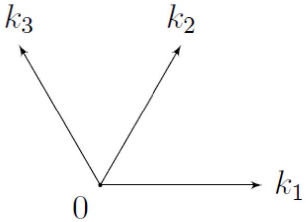

В силу несжимаемости жидкости ее объем жидкости не, поэтому $\langle \Theta \rangle = 0$

Ответ:

$$
\langle \Theta \rangle = 0
$$

A2 ${ } ^ { 0.20 }$ Опишите симметрии системы, то есть преобразования, которые не изменяют вид зависимость энергии $\Pi$ системы от $\Theta ( X , Y )$.

Ответ: Вся система симметрична относительно любых $T$ и $R$ так как в ней нет выделенных направлений или выделенных сдвигов.

A3 ${ } ^ { 0.20 }$ Опишите симметрии равновесного состояния жидкой фазы, то есть преобразования, которые не изменяют состояние системы: $\Theta \left( X ^ { \prime } , Y ^ { \prime } \right) = \Theta ( X , Y )$

Ответ: Основное состояние жидкой фазы симметрично относительно любых $T$ и $R$.

A4 ${ } ^ { 0,40 }$ Опишите симметрии равновесных состояний кристаллической фазы.

Ответ: Основное состояния кристаллической фазы симметрично относительно трансляций $T$ вдоль кристаллических направлений гексагональной решетки и вращений $R$ на $\pi / 3$ вокруг точек гексагональной решетки.

A5 ${ } ^ { 0.60 }$ Запишите $\Pi _ { g }$ через $\rho , g$ и $\left\langle \Theta ^ { 2 } \right\rangle$.

Ответ:

$$
\Pi _ { g } = \frac { 1 } { 2 } \rho g \left\langle \Theta ^ { 2 } \right\rangle
$$

А6 ${ } ^ { 0.20 }$ Запишите $\Pi _ { \sigma }$ через $\sigma$ и усреднение, содержащие $\left( \nabla _ { 0 } \Theta \right) ^ { 2 }$, где $\nabla _ { 0 } = \left( \partial _ { X } , \partial _ { Y } \right)$ это двумерный вектор набла.

$$
\nabla _ { 0 } \Theta = \binom { \partial _ { X } \Theta } { \partial _ { Y } \Theta }
$$

Ответ:

$$
\Pi _ { \sigma } = \sigma \left\langle \sqrt { 1 + \left( \nabla _ { 0 } \Theta \right) ^ { 2 } } \right\rangle
$$

А7 ${ } ^ { 0.60 }$ Запишите $\Pi _ { B }$ через $\vec { B } ( X , Y , Z ) , \vec { B } _ { 0 } \mu , \mu _ { 0 }$ и $\Theta$. Запись может содержать усреднение от интеграла вдоль оси $Z$.

Считайте, что слой жидкости является бесконечно глубоким.

Ответ:

$$
\Pi _ { B } = - \frac { \mu - 1 } { 2 \mu \mu _ { 0 } } \left\langle \int _ { - \infty } ^ { \Theta } \vec { B } \cdot \vec { B } _ { 0 } d Z \right\rangle
$$

А8 ${ } ^ { 0.60 }$ Запишите выражение для безразмерной энергии $U$ единицы безразмерной площади системы. В ответ могут входить $\zeta , \mu , \mu _ { 0 } , \sqrt { \sigma \rho g } , \vec { B } ( x , y , z ) , \vec { B } _ { 0 }$, безразмерная $\nabla = \left( \partial _ { x } , \partial _ { y } \right)$ и интегрирование по безразмерному $z$.

Ответ:

$$
U = \frac { 1 } { 2 } \left\langle \zeta ^ { 2 } \right\rangle + \left\langle \sqrt { 1 + ( \nabla \zeta ) ^ { 2 } } \right\rangle - \frac { \mu - 1 } { 2 \mu _ { 0 } \mu \sqrt { \sigma \rho g } } \left\langle \int _ { - \infty } ^ { \zeta } \vec { B } \cdot \vec { B } _ { 0 } d z \right\rangle
$$

В1 ${ } ^ { 0.30 }$ Чему равен скачок $\Delta H$ напряженность магнитного поля на поверхности парамагнетика в случае плоской поверхности? Знак выбран следующим образом: $\Delta H = H _ { 0 \uparrow } ( z = 0 ) - H _ { 0 \downarrow } ( z = 0 )$. Ответ выразите через $B _ { 0 } , \mu$ и $\mu _ { 0 }$.

Индуктивность магнитного поля перпендикулярна поверхности парамагнетика, поэтому её величина одинакова во всём пространстве.

$$
H _ { 0 } ( + 0 ) = \frac { B _ { 0 } } { \mu _ { 0 } } , \quad H _ { 0 } ( - 0 ) = \frac { B _ { 0 } } { \mu \mu _ { 0 } } \quad \Rightarrow \quad \Delta H = \frac { B _ { 0 } } { \mu _ { 0 } } \frac { \mu - 1 } { \mu }
$$

Ответ:

$$
\Delta H = \frac { B _ { 0 } } { \mu _ { 0 } } \frac { \mu - 1 } { \mu }
$$

в2 ${ } ^ { 0.30 }$ Запишите уравнение $\operatorname { div } \vec { b } = 0$ в вакууме и внутри вещества через частные производные второго порядка $\partial _ { x , y , z } ^ { 2 } \phi _ { \uparrow , \downarrow }$.
$\vec { b } = \mu \mu _ { 0 } \vec { h }$. Если мы берем дивергенцию от правой части в области, которая не включает границу, то $\operatorname { div } \vec { b } = \mu \mu _ { 0 } \operatorname { div } \nabla \phi = \mu \mu _ { 0 } \left( \partial _ { x } ^ { 2 } + \partial _ { y } ^ { 2 } + \partial _ { z } ^ { 2 } \right) \phi = \mu \mu _ { 0 } \Delta \phi = 0$ . Получаем уравнение Пуассона в обоих областях.

Ответ:

$$
\left( \partial _ { x } ^ { 2 } + \partial _ { y } ^ { 2 } + \partial _ { z } ^ { 2 } \right) \phi _ { \uparrow , \downarrow } = 0
$$

Вз ${ } ^ { 0.30 }$ Запишите приближенное уравнение, соответствующие граничному условию для поля $\vec { B }$. В ответ могут входить только компоненты полей $\overrightarrow { b _ { \uparrow , \downarrow } }$.

Нормаль к поверхности $\vec { n }$ имеет координаты $\left( - \partial _ { x } \zeta , - \partial _ { y } \zeta , 1 \right)$. Поэтому граничное условие $\vec { B } _ { \uparrow } \cdot \vec { n } = \vec { B } _ { \downarrow } \cdot \vec { n }$ сводится к $b _ { z \uparrow } = b _ { z \downarrow }$.

Ответ:

$$
b _ { z \uparrow } = b _ { z \downarrow }
$$

в4 ${ } ^ { 0.60 }$ Запишите приближенные уравнения, соответствующие граничному условию для поля $\vec { H }$. В ответ могут входить компоненты поля $\vec { h } _ { \uparrow , \downarrow } , \Delta H$ и $\partial _ { x , y } \zeta$.
В силу малости возмущений $| \vec { h } | \ll \Delta H$.
Нормаль К поверхности $\vec { n }$ имеет координаты $\left( - \partial _ { x } \zeta , - \partial _ { y } \zeta , 1 \right)$. Поэтому граничное условие $\vec { H } _ { \uparrow } \times \vec { n } = \vec { H } _ { \downarrow } \times \vec { n }$ сводится к системе уравнений

$$
\left\{ \begin{array} { l }
h _ { x \uparrow } + H _ { 0 \uparrow } \partial _ { x } \zeta = h _ { x \downarrow } + H _ { 0 \downarrow } \partial _ { x } \zeta \\
h _ { y \uparrow } + H _ { 0 \uparrow } \partial _ { y } \zeta = h _ { y \downarrow } + H _ { 0 \downarrow } \partial _ { y } \zeta
\end{array} \right.
$$

Ответ:

$$
\left\{ \begin{array} { l }
h _ { x \uparrow } + \Delta H \partial _ { x } \zeta = h _ { x , \downarrow } \\
h _ { y \uparrow } + \Delta H \partial _ { y } \zeta = h _ { y , \downarrow }
\end{array} \right.
$$

В5 ${ } ^ { 0.70 }$ С помощью пункта В2 получите дифференциальное уравнение, которому удовлетворяют функции $u _ { i \uparrow , \downarrow }$. Найдите вид решений (т.е. в ответ могут входить неизвестные константы) $u _ { i \uparrow \downarrow } ( z )$ в вакууме и в парамагнетике. Постройте качественный график $u _ { i \uparrow }$ и $u _ { i \downarrow }$ от $z$. Напомним, что $\phi ( x , y , z )$ создает малые возмущения магнитного поля во всем пространстве, в т.ч. при $z = \pm \infty$.

Функциональный вид $u _ { i } ( z )$ следует из уравнения Пуассона для $\left. \phi . \Delta \left( u _ { i } ( z ) \cos \left( k _ { i x } x + k _ { i y } y \right) \right) = \left( \partial _ { z } ^ { 2 } - k _ { i } ^ { 2 } \right) u _ { i } ( z ) \cos \left( k _ { i x } x + k _ { i y } y \right) \right)$, то есть $u _ { i \uparrow } ( z ) = u _ { i \uparrow } e ^ { - k z }$ и $u _ { i \downarrow } ( z ) = u _ { i \downarrow } e ^ { k z }$ (в каждом случае остаётся только одна экспонента из условия малости возмущения при удалении на бесконечность).

Ответ:

$$
u _ { i \uparrow } ( z ) = u _ { i \uparrow } e ^ { - k z } , \quad u _ { i \downarrow } ( z ) = u _ { i \downarrow } e ^ { k z }
$$

В6 ${ } ^ { 0.80 }$ Найдите значения констант из предыдущего пункта и запишите $\phi _ { \uparrow , \downarrow } ( \vec { r } , z )$ в вакууме и в парамагнетике. В ответ могут входить $\Delta H , \mu , k _ { i }$ и $a _ { i } \cos \vec { k } _ { i } \vec { r }$. Учтите, что $k _ { i } \cdot \zeta ( x , y ) \ll 1$.

Запишем граничные условия из \textbf\{B3\}:

$$
\begin{aligned}
& b _ { z \uparrow } ( \zeta ) = \mu _ { 0 } \partial _ { z } \phi _ { \uparrow } = - \mu _ { 0 } \sum u _ { i \uparrow } k _ { i } e ^ { - k _ { i } \zeta } \cos \left( k _ { i x } x + k _ { i y } y \right) \\
& b _ { z \downarrow } ( \zeta ) = \mu \mu _ { 0 } \partial _ { z } \phi _ { \downarrow } = \mu \mu _ { 0 } \sum u _ { i \downarrow } k _ { i } e ^ { k _ { i } \zeta } \cos \left( k _ { i x } x + k _ { i y } y \right)
\end{aligned}
$$

В ведущем приближении экспоненты $e ^ { \pm k \zeta } \simeq 1$ и тогда

$$
- u _ { i \uparrow } = \mu u _ { i \downarrow } .
$$

Граничные условия из \textbf\{B4\} выглядят абсолютно одинаково:

$$
\begin{aligned}
\sum u _ { i \uparrow } k _ { i x } e ^ { - k \zeta } \sin \left( k _ { i x } x + k _ { i y } y \right) + & \Delta H \sum a _ { i } k _ { i x } \sin \left( k _ { i x } x + k _ { i y } y \right) = \\
& = \sum u _ { i \downarrow } k _ { i x } e ^ { k \zeta } \sin \left( k _ { i x } x + k _ { i y } y \right)
\end{aligned} .
$$

Снова в ведущем приближение $e ^ { \pm k \zeta } \simeq 1$ и

$$
u _ { i \uparrow } + \Delta H a _ { i } = u _ { i \downarrow } .
$$

Решим систему уравнений для $u _ { i \uparrow }$ и $u _ { i \downarrow }$ и получим

$$
u _ { i \uparrow } = - a _ { i } \frac { \mu \Delta H } { \mu + 1 } , \quad u _ { i \downarrow } = a _ { i } \frac { \Delta H } { \mu + 1 } .
$$

Ответ:

$$
\phi _ { \uparrow } = - \sum \frac { \mu \Delta H } { \mu + 1 } a _ { i } e ^ { - k _ { i } z } \cos \left( k _ { i x } x + k _ { i y } y \right) , \quad \phi _ { \downarrow } = \sum \frac { \Delta H } { \mu + 1 } a _ { i } e ^ { k _ { i } z } \cos \left( k _ { i x } x + k _ { i y } y \right)
$$

В7 ${ } ^ { 0.80 }$ Выразите добавку к энергии магнитного поля $\Delta U _ { B }$ через усредненный интеграл содержащий $\vec { b }$.

Запишем разность энергий:

$$
\begin{gathered}
\Delta U _ { B } = - \frac { \mu - 1 } { 2 \mu \mu _ { 0 } \sqrt { \sigma \rho g } } \left( \left\langle \int _ { - \infty } ^ { \zeta } b _ { z } B _ { 0 } d z \right\rangle + \left\langle \int _ { - \infty } ^ { \zeta } B _ { 0 } ^ { 2 } d z \right\rangle - \left\langle \int _ { - \infty } ^ { 0 } B _ { 0 } ^ { 2 } d z \right\rangle \right) \\
\Delta U _ { B } = - \frac { \mu - 1 } { 2 \mu \mu _ { 0 } \sqrt { \sigma \rho g } } \left( \left\langle \int _ { - \infty } ^ { \zeta } b _ { z } B _ { 0 } d z \right\rangle + \left\langle \int _ { 0 } ^ { \zeta } B _ { 0 } ^ { 2 } d z \right\rangle \right) \\
\Delta U _ { B } = - \frac { \mu - 1 } { 2 \mu \mu _ { 0 } \sqrt { \sigma \rho g } } \left( \left\langle \int _ { - \infty } ^ { \zeta } b _ { z } B _ { 0 } d z \right\rangle + \langle \zeta \rangle B _ { 0 } ^ { 2 } \right)
\end{gathered}
$$

С учётом $\langle \zeta \rangle = 0$ получаем итоговый ответ.

Ответ:

$$
\Delta U _ { B } = - \frac { \mu - 1 } { 2 \mu \mu _ { 0 } \sqrt { \sigma \rho g } } \left\langle \int _ { - \infty } ^ { \zeta } b _ { z } B _ { 0 } d z \right\rangle
$$

B8 ${ } ^ { 1.20 }$ Найдите добавку к энергии магнитного поля $\Delta U _ { B }$, приходящейся на единицу площади. Ответ выразите через $\mu , \mu _ { 0 } , B _ { 0 } , \sqrt { } \overline { \sigma \rho g } , k , a$ и $\left\langle \zeta ^ { 2 } \right\rangle$.

$$
\begin{array} { r }
\Delta U _ { B } = - \frac { \mu - 1 } { 2 \mu \mu _ { 0 } \sqrt { \sigma \rho g } } \left\langle \int _ { - \infty } ^ { \zeta } b _ { z } B _ { 0 } d z \right\rangle = - \frac { ( \mu - 1 ) B _ { 0 } } { 2 \sqrt { \sigma \rho g } } \left\langle \int _ { - \infty } ^ { \zeta } d \phi _ { \downarrow } \right\rangle = - \frac { ( \mu - 1 ) B _ { 0 } } { 2 \sqrt { \sigma \rho g } } \left\langle \phi _ { \downarrow } ( \zeta ) \right\rangle = \\
= - \frac { ( \mu - 1 ) ^ { 2 } B _ { 0 } ^ { 2 } } { 2 \sqrt { \sigma \rho g } \mu ( \mu + 1 ) \mu _ { 0 } } \left\langle \zeta e ^ { k \zeta } \right\rangle \simeq - \frac { ( \mu - 1 ) ^ { 2 } B _ { 0 } ^ { 2 } } { 2 \sqrt { \sigma \rho g } \mu ( \mu + 1 ) \mu _ { 0 } } k \left\langle \zeta ^ { 2 } \right\rangle
\end{array}
$$

Ответ:

$$
\Delta U _ { B } = - \frac { ( \mu - 1 ) ^ { 2 } B _ { 0 } ^ { 2 } } { 2 \sqrt { \sigma \rho g } \mu ( \mu + 1 ) \mu _ { 0 } } k \left\langle \zeta ^ { 2 } \right\rangle
$$

С1 ${ } ^ { 0.30 }$ Как связаны направления $\vec { k } _ { i }$ друг с другом? Как связаны $a _ { i }$ друг с другом и с $A$ ?

Ответ:
Концы векторов $\vec { k } _ { i }$ лежат в вершинах шестиугольника. $a _ { i } = \mathrm { A } / 3$ из симметрии состояния: при повороте на углы кратные $\pi / 3$ моды переходят друг в друга.

С2 ${ } ^ { 1.20 }$ Найдите $U$ как функцию $A , k$ и параметров системы $\mu , \mu _ { 0 } , \sqrt { \sigma \rho g }$ и $B _ { 0 }$.

Рассмотрим $\boldsymbol { \zeta }$ как сумму:

$$
\zeta = \frac { A } { 6 } \left( e ^ { i \vec { k } _ { 1 } \vec { r } } + e ^ { - i \vec { k } _ { 1 } \vec { r } } + e ^ { i \vec { k } _ { 2 } \vec { r } } + e ^ { - i \vec { k } _ { 2 } \vec { r } } + e ^ { i \vec { k } _ { 3 } \vec { r } } + e ^ { - i \vec { k } _ { 3 } \vec { r } } \right) ,
$$

тогда $\zeta ^ { 2 }$ состоит из 36-ти слагаемых вида $e ^ { i \left( \pm \vec { k } _ { i } \pm \vec { k } _ { j } \right) \vec { r } }$. При усреднении по площади обнулются все слагаемые, где $\pm \vec { k } _ { i } \pm \vec { k } _ { j } \neq 0$, а остальные шесть равны единице. Поэтому

$$
\left\langle \zeta ^ { 2 } \right\rangle = \frac { A ^ { 2 } } { 6 } .
$$

Теперь $\nabla \zeta$ :

$$
\nabla \zeta = \frac { i A } { 6 } \left[ \vec { k } _ { 1 } \left( e ^ { i \vec { k } _ { 1 } \vec { r } } - e ^ { - i \vec { k } _ { 1 } \vec { r } } \right) + \vec { k } _ { 2 } \left( e ^ { i \vec { k } _ { 2 } \vec { r } } - e ^ { - i \vec { k } _ { 2 } \vec { r } } \right) + \vec { k } _ { 3 } \left( e ^ { i \vec { k } _ { 3 } \vec { r } } - e ^ { - i \vec { k } _ { 3 } \vec { r } } \right) \right] .
$$

Тогда

$$
\begin{array} { r }
( \nabla \zeta ) ^ { 2 } = - \frac { A ^ { 2 } k ^ { 2 } } { 36 } \left[ \left( e ^ { i \vec { k } _ { 1 } \vec { r } } - e ^ { - i \vec { k } _ { 1 } \vec { r } } \right) ^ { 2 } + \left( e ^ { i \vec { k } _ { 2 } \vec { r } } - e ^ { - i \vec { k } _ { 2 } \vec { r } } \right) ^ { 2 } + \left( e ^ { i \vec { k } _ { 3 } \vec { r } } - e ^ { - i \vec { k } _ { 3 } \vec { r } } \right) ^ { 2 } \right] - \\
- \frac { A ^ { 2 } } { 36 } \left[ \vec { k } _ { 1 } \cdot \vec { k } _ { 2 } \left( e ^ { i \vec { k } _ { 1 } \vec { r } } - e ^ { - i \vec { k } _ { 1 } \vec { r } } \right) \left( e ^ { i \vec { k } _ { 2 } \vec { r } } - e ^ { - i \vec { k } _ { 2 } \vec { r } } \right) + \ldots \right] .
\end{array}
$$

Легко видеть, что после усреднения по площади обнулятся все слагаемые со скалярными произведениями $\vec { k } _ { i } \cdot \vec { k } _ { j } , i \neq j$. Среди оставшихся будет шесть равных -1, поэтому

$$
\left\langle ( \nabla \zeta ) ^ { 2 } \right\rangle = \frac { k ^ { 2 } A ^ { 2 } } { 6 }
$$

Ответ:

$$
U = 1 + \frac { A ^ { 2 } } { 12 } \left( 1 + k ^ { 2 } - \frac { ( \mu - 1 ) ^ { 2 } B _ { 0 } ^ { 2 } } { \sqrt { \sigma \rho g } \mu ( \mu + 1 ) \mu _ { 0 } } k \right)
$$

с3 ${ } ^ { 0.20 }$ При каком $B _ { c }$ состояние $\zeta ( x , y ) = 0$ теряет устойчивость?

Обозначим

$$
\frac { ( \mu - 1 ) ^ { 2 } B _ { 0 } ^ { 2 } } { \sqrt { \sigma \rho g } \mu ( \mu + 1 ) \mu _ { 0 } } = 2 k _ { 0 }
$$

. Среди всех $k$ выберем такой, при котором выражение в скобках принимает минимальное значение:
$k _ { \text {min } } = k _ { 0 }$, при этом

$$
U = 1 + \frac { a ^ { 2 } } { 12 } \left( 1 - k _ { 0 } ^ { 2 } \right)
$$

то есть при $k _ { 0 } > 1$ наличие гексагональной решетки с $k = k _ { 0 }$ начинает быть энергетически выгодным.

Ответ:

$$
B _ { c } = \sqrt { \frac { 2 \mu _ { 0 } \mu ( \mu + 1 ) \sqrt { \sigma \rho g } } { ( \mu - 1 ) ^ { 2 } } }
$$

С4 ${ } ^ { 0.20 }$ Гексагональная решетка с каким $k _ { c }$ возникает на поверхности жидкости при $B > B _ { c } , B / B _ { c } - 1 \ll 1$ ?

Ответ:

$$
k _ { c } = 1
$$

С5 ${ } ^ { 0.10 }$ Будет ли наблюдаться неустойчивость Розенцвейга в диамагнитной $( \mu < 1 )$ жидкости?

Ответ: Да, эффект не зависит от знака $\mu - 1$.
