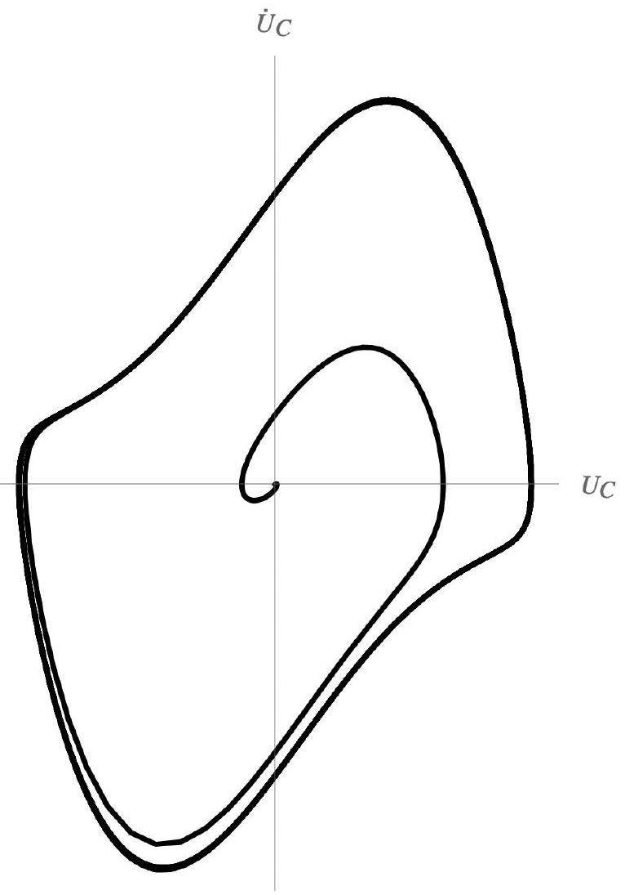

В начальный момент электрон приобретает скорость по оси $O y$, вдоль электрического поля. Это приводит к возникновению магнитной силы вдоль $O z$ и появлению компоненты скорости $v _ { z }$. Связанная с $v _ { z }$ магнитная сила параллельна оси $O y$. Таким образом, в процессе дальнейшего движения силы, действующие на электрон, лежат в плоскости $O y z$, откуда следует $x ( t ) = 0$.

А2 ${ } ^ { 0.50 }$ Для описанного случая запишите второй закон Ньютона в проекции на оси $y , z$, из них получите выражения для $\ddot { y } , \ddot { z }$. В выражениях могут присутствовать $\dot { y } , \dot { z } , y , z , U , I$, а также геометрические характеристики системы.

В плоской конфигурации электрическое поле однородно и равно

$$
E _ { y } = \frac { \varphi _ { \mathrm { K } } - \varphi _ { \mathrm { A } } } { h } = - \frac { U } { h } .
$$

Магнитное поле провода провода при движении электрона в плоскости $O y z$ параллельно $O x$ равно (например, из теоремы о циркуляции)

$$
B _ { x } = - \frac { \mu _ { 0 } I } { 2 \pi \left( y + r _ { 0 } \right) } .
$$

С учётом отрицательности знака заряда электрона получаем уравнения движения:

$$
\left\{ \begin{array} { l }
m \ddot { y } = - e E _ { y } - e \dot { z } B _ { x } \\
m \ddot { z } = e \dot { y } B _ { x }
\end{array} \right.
$$

Подставляя выражения для полей, получаем ответ.

Ответ:

$$
\left\{ \begin{array} { l }
\ddot { y } = \frac { e U } { m h } + \frac { \mu _ { 0 } e I } { 2 \pi m \left( y + r _ { 0 } \right) } \dot { z }  \tag{1}\\
\ddot { z } = - \frac { \mu _ { 0 } e I } { 2 \pi m \left( y + r _ { 0 } \right) } \dot { y }
\end{array} \right.
$$

А3 ${ } ^ { 1.00 }$ Получите дифференциальное уравнение относительно $y$ вида

$$
\ddot { y } = \alpha - \beta \frac { \ln \left( 1 + \frac { y } { r _ { 0 } } \right) } { 1 + \frac { y } { r _ { 0 } } } ,
$$

где $\alpha , \beta$ - константы. Найдите $\alpha , \beta$. В ответе могут присутствовать все введённые ранее величины и константы.

Умножив второе уравнение на $d t$, приходим к соотношению

$$
d \dot { z } = - \frac { \mu _ { 0 } e I } { 2 \pi m \left( y + r _ { 0 } \right) } d y .
$$

Интегрируем:

$$
\dot { z } = - \frac { \mu _ { 0 } e I } { 2 \pi m } \int \frac { d y ^ { \prime } } { y ^ { \prime } + r _ { 0 } } = - \frac { \mu _ { 0 } e I } { 2 \pi m } \ln \left( 1 + \frac { y } { r _ { 0 } } \right) + C .
$$

С учётом начальных условий $\dot { z } = 0$ при $y = 0$, тогда $C = 0$, и

$$
\dot { z } = - \frac { \mu _ { 0 } e I } { 2 \pi m } \ln \left( 1 + \frac { y } { r _ { 0 } } \right) .
$$

Постановка полученного выражения в (1) даёт

$$
\begin{equation*}
\ddot { y } = \frac { e U } { m h } - \frac { 1 } { r _ { 0 } } \left( \frac { \mu _ { 0 } e I } { 2 \pi m } \right) ^ { 2 } \frac { \ln \left( 1 + \frac { y } { r _ { 0 } } \right) } { 1 + \frac { y } { r _ { 0 } } } . \tag{3}
\end{equation*}
$$

Отсюда получаем ответ.

Ответ:

$$
\begin{gathered}
\alpha = \frac { e U } { m h } \\
\beta = \frac { 1 } { r _ { 0 } } \left( \frac { \mu _ { 0 } e I } { 2 \pi m } \right) ^ { 2 }
\end{gathered}
$$

После домножения на $\dot { y }$ уравнение (3) преобразуется к виду

$$
\frac { \dot { y } ^ { 2 } } { 2 } = \int \left( \frac { e U } { m h } - \frac { 1 } { r _ { 0 } } \left( \frac { \mu _ { 0 } e I } { 2 \pi m } \right) ^ { 2 } \frac { \ln \left( 1 + \frac { y } { r _ { 0 } } \right) } { 1 + \frac { y } { r _ { 0 } } } \right) d y
$$

Интеграл во втором слагаемом:

$$
\int \frac { \ln \left( 1 + \frac { y } { r _ { 0 } } \right) } { 1 + \frac { y } { r _ { 0 } } } d y = r _ { 0 } \int \ln \left( 1 + \frac { y } { r _ { 0 } } \right) d \left( \ln \left( 1 + \frac { y } { r _ { 0 } } \right) \right) = \frac { r _ { 0 } } { 2 } \ln ^ { 2 } \left( 1 + \frac { y } { r _ { 0 } } \right) + C
$$

С учётом начальных условий $\dot { y } = 0$ при $y = 0$, тогда $C = 0$, и

$$
\frac { \dot { y } ^ { 2 } } { 2 } = \frac { e U y } { m h } - \frac { 1 } { 2 } \left( \frac { \mu _ { 0 } e I } { 2 \pi m } \right) ^ { 2 } \ln ^ { 2 } \left( 1 + \frac { y } { r _ { 0 } } \right) .
$$

Условие достижения электроном анода:

$$
\begin{gathered}
\dot { y } ( h ) = 0 \\
0 = \frac { e U } { m } - \frac { 1 } { 2 } \left( \frac { \mu _ { 0 } e I _ { \text {кр } } } { 2 \pi m } \right) ^ { 2 } \ln ^ { 2 } \left( 1 + \frac { h } { r _ { 0 } } \right) .
\end{gathered}
$$

Отсюда получаем ответ для $I _ { \text {кр } }$.

Ответ:

$$
I _ { \text {кр } } = \sqrt { \frac { 8 U m } { e } } \frac { \pi } { \mu _ { 0 } } \frac { 1 } { \ln \left( 1 + \frac { h } { r _ { 0 } } \right) }
$$

А5 ${ } ^ { 1.20 }$ Пусть электрон начинает движение с нулевой начальной скоростью из точки $C$ в цилиндрической конфигурации лампы. Найдите в этом случае максимальное значение тока нагревателя $I _ { \text {кр } }$, при котором электрон достигает анода.

Аналогично предыдущей ситуации показывается, что движение будет происходить в плоскости $O y z$, если ввести оси также, как на рисунке для плоской конфигурации.

Метод 1
Будем рассматривать движение в координатах $( r , z )$, где $r$ - расстояние от оси системы до точки. Рассчитаем электрическое поле, используя теорему Гаусса. В силу отсутствия объёмных зарядов

$$
\begin{gathered}
E _ { r } \cdot r = \text { const. } \quad \Rightarrow \quad E _ { r } = \frac { A } { r } \\
U = - \int _ { r _ { 0 } } ^ { R _ { 0 } } E _ { r } d r = - A \ln \left( \frac { R _ { 0 } } { r _ { 0 } } \right) \\
E _ { r } = - \frac { U } { r \ln \left( \frac { R _ { 0 } } { r _ { 0 } } \right) }
\end{gathered}
$$

Магнитное поле:

$$
B _ { x } = - \frac { \mu _ { 0 } I } { 2 \pi r } .
$$

Тогда уравнения движения выглядят следующим образом:

$$
\left\{ \begin{array} { l }
\ddot { r } = - \frac { e U } { m r \ln \left( \frac { R _ { 0 } } { r _ { 0 } } \right) } + \frac { \mu _ { 0 } e I } { 2 \pi m \left( y + r _ { 0 } \right) } \dot { z } \\
\ddot { z } = - \frac { \mu _ { 0 } e I } { 2 \pi m \left( y + r _ { 0 } \right) } \dot { r }
\end{array} \right.
$$

Аналогичным образом после интегрирования второго уравнения, подстановки в первое и повторного интегрирования получаем уравнение на $I _ { \text {кр } }$ :

$$
\frac { e U } { m } - \frac { 1 } { 2 } \left( \frac { \mu _ { 0 } e I _ { \text {кр } } } { 2 \pi m } \right) ^ { 2 } \ln ^ { 2 } \left( \frac { R _ { 0 } } { r _ { 0 } } \right) .
$$

Отсюда получаем ответ.

Ответ:

$$
I _ { \text {кр } } = \sqrt { \frac { 8 U m } { e } } \frac { \pi } { \mu _ { 0 } } \frac { 1 } { \ln \left( \frac { R _ { 0 } } { r _ { 0 } } \right) }
$$

Метод 2
Рассмотрим уравнения движения из пункта А2, не подставляя конкретные значения $E _ { y }$ и $B _ { x }$ :

$$
\left\{ \begin{array} { l }
\ddot { y } = - \frac { e } { m } \left( E _ { y } ( y ) + \dot { z } B _ { x } ( y ) \right) \\
\ddot { z } = \frac { e } { m } \dot { y } B _ { x } ( y )
\end{array} \right.
$$

С учётом начальных условий из второго уравнения получим:

$$
\dot { z } = \frac { e } { m } \int _ { 0 } ^ { y } B _ { x } ( \xi ) d \xi
$$

Подставим в первое уравнение:

$$
\ddot { y } = - \frac { e } { m } \left( E _ { y } ( y ) + \frac { e } { m } B _ { x } ( y ) \int _ { 0 } ^ { y } B _ { x } ( \xi ) d \xi \right)
$$

Домножим на $\dot { y }$ и проинтегрируем с учётом начальных условий:

$$
\begin{aligned}
& \frac { \dot { y } ^ { 2 } } { 2 } = - \frac { e } { m } \int _ { 0 } ^ { y } E _ { y } ( \eta ) d \eta - \frac { e ^ { 2 } } { m ^ { 2 } } \int _ { 0 } ^ { y } B _ { x } ( \eta ) d \eta \int _ { 0 } ^ { \eta } B _ { x } ( \xi ) d \xi = \\
& \quad = \frac { e } { m } ( \varphi ( y ) - \varphi ( 0 ) ) - \frac { e ^ { 2 } } { m ^ { 2 } } \int _ { 0 } ^ { y } B _ { x } ( \eta ) d \eta \int _ { 0 } ^ { \eta } B _ { x } ( \xi ) d \xi
\end{aligned}
$$

Условие достижения анода:

$$
\frac { e } { m } \int _ { 0 } ^ { h } B _ { x } ( \eta ) d \eta \int _ { 0 } ^ { \eta } B _ { x } ( \xi ) d \xi = \varphi ( y ) - \varphi ( 0 ) = U
$$

Таким образом, условие не зависит от распределения поля $E _ { y }$, но только от разности потенциалов $U$. Так как распределение магнитного поля в цилиндрической и в плоской системе совпадают, то и ответ для $I _ { \text {кр } }$ (с точностью до подстановки $R _ { 0 } = r _ { 0 } + h$ ) остаётся прежним.

Ответ:

$$
I _ { \text {кр } } = \sqrt { \frac { 8 U m } { e } } \frac { \pi } { \mu _ { 0 } } \frac { 1 } { \ln \left( \frac { R _ { 0 } } { r _ { 0 } } \right) }
$$

Примечание.
Можно показать, что

$$
\left. \int _ { 0 } ^ { h } B _ { x } ( \eta ) d \eta \int _ { 0 } ^ { \eta } B _ { x } ( \xi ) d \xi = \frac { 1 } { 2 } \left( \int _ { 0 } ^ { h } B _ { x } ( \xi ) d \xi \right) \right) ^ { 2 }
$$

Таким образом, условие на достижение электроном анода:

$$
\int _ { 0 } ^ { h } B _ { x } ( \xi ) d \xi = \sqrt { \frac { 2 m U } { e } }
$$

Интересный факт заключается в том, что найденное условие зависит только от значений определённых интегралов электрического и магнитного поля по $y$, но не от конкретного распределения поля.

В1 ${ } ^ { 0.30 }$ Получите дифференциальное уравнение, связывающее $\varphi ( y )$ и $\rho ( y )$.

Метод 1
Запишем теорему Гаусса для двух плоскостей $y$ и $y + d y$ :

$$
\begin{gathered}
( E ( y + d y ) - E ( y ) ) S = \frac { \rho ( y ) } { \varepsilon _ { 0 } } S d y \\
E ^ { \prime } ( y ) = \frac { \rho ( y ) } { \varepsilon _ { 0 } }
\end{gathered}
$$

С учётом связи

$$
E ( y ) = - \varphi ^ { \prime } ( y )
$$

получаем ответ.

Ответ:

$$
\varphi ^ { \prime \prime } ( y ) = - \frac { \rho ( y ) } { \varepsilon _ { 0 } }
$$

Метод 2
Теорема Гаусса в дифференциальной форме:

$$
\frac { \rho } { \varepsilon _ { 0 } } = \operatorname { div } \vec { E } .
$$

Связь $E$ и $\varphi$ :

$$
E = - \operatorname { grad } \varphi .
$$

Тогда

$$
\frac { \rho } { \varepsilon _ { 0 } } = - \operatorname { div } \operatorname { grad } \varphi = - \Delta \varphi ,
$$

здесь $\Delta = \frac { \partial ^ { 2 } } { \partial x ^ { 2 } } + \frac { \partial ^ { 2 } } { \partial y ^ { 2 } } + \frac { \partial ^ { 2 } } { \partial z ^ { 2 } }$ - оператор Лапласа (лапласиан), само уравнение называется уравнением Лапласа.
В одномерном случае это преобразуется к виду

Ответ:

$$
\varphi ^ { \prime \prime } ( y ) = - \frac { \rho ( y ) } { \varepsilon _ { 0 } }
$$

В2 ${ } ^ { \mathbf { 0 . 2 0 } }$ Предположим, что $U > 0$. Найдите скорость электрона $v ( y )$, эмиттированного с катода, на расстоянии $y$ от катода. Ответ выразите через $\varphi ( y )$.

Запишем закон сохранения энергии для электрона:

$$
\frac { m v ^ { 2 } ( y ) } { 2 } - e \varphi ( y ) = 0 .
$$

Отсюда следует ответ.

Ответ:

$$
v = \sqrt { \frac { 2 e \varphi ( y ) } { m } }
$$

Вз ${ } ^ { \mathbf { 0 . 3 0 } }$ Выразите полный ток $I$, протекающий через сечение $y =$ const. Ответ выразите через $\rho ( y ) , v ( y )$ и геометрические характеристики системы.

Положительным считайте направление тока от анода к катоду.

С учётом указанного положительного направления тока от анода к катоду

Ответ:

$$
I = - \rho ( y ) v ( y ) S
$$

В4 ${ } ^ { 0.40 }$ Получите дифференциальное уравнение на $\varphi ( y )$, содержащее функцию $\varphi ( y )$ и её производные, а также $I$ и геометрические характеристики системы.

С учётом предыдущих пунктов:

$$
\rho ( y ) = - \frac { I } { S v ( y ) } = - \frac { I } { S } \sqrt { \frac { m } { 2 e \varphi ( y ) } } .
$$

Постановка $\rho ( y )$ в уравнение пункта В1 приводит к ответу

Ответ:

$$
\varphi ^ { \prime \prime } ( y ) = \frac { I } { \varepsilon _ { 0 } S } \sqrt { \frac { m } { 2 e \varphi ( y ) } }
$$

В5 ${ } ^ { 0.80 }$ Получите зависимость $\varphi ( y )$. Ответ выразите через $I$ и геометрические характеристики системы.

Домножая обе части уравнения пункта B4 на $\varphi ^ { \prime } ( y )$ и интегрируя с учётом $\varphi ^ { \prime } ( 0 ) = 0$, приходим к уравнению

$$
\left( \varphi ^ { \prime } \right) ^ { 2 } = \frac { I } { \varepsilon _ { 0 } S } \sqrt { \frac { 8 m } { e } } \sqrt { \varphi } .
$$

Переменные в нём разделяются:

$$
\varphi ^ { - 1 / 4 } d \varphi = \left( \frac { I } { \varepsilon _ { 0 } S } \right) ^ { 1 / 2 } \left( \frac { 8 m } { e } \right) ^ { 1 / 4 } d y .
$$

Применяя начальное условие $\varphi ( 0 ) = 0$, получим

$$
\frac { 4 } { 3 } \varphi ^ { 3 / 4 } = \left( \frac { I } { \varepsilon _ { 0 } S } \right) ^ { 1 / 2 } \left( \frac { 8 m } { e } \right) ^ { 1 / 4 } y .
$$

Преобразуя полученное выражение, приходим к ответу.

Ответ:

$$
\varphi ( y ) = \left( \frac { 3 y } { 4 } \right) ^ { 4 / 3 } \left( \frac { I } { \varepsilon _ { 0 } S } \right) ^ { 2 / 3 } \left( \frac { 8 m } { e } \right) ^ { 1 / 3 }
$$

В6 ${ } ^ { 0.80 }$ ВАХ лампы при $U > 0$ может быть выражен функцией

$$
I ( U ) = G U ^ { \gamma } .
$$

Определите коэффициенты $G , \gamma$. Ответ выразите через геометрические характеристики системы.
Величина $G$ называется первеансом лампы.

Напряжение на лампе равно потенциалу в точке $y = h$ :

$$
U = \varphi ( h ) = \left( \frac { 3 h } { 4 } \right) ^ { 4 / 3 } \left( \frac { I } { \varepsilon _ { 0 } S } \right) ^ { 2 / 3 } \left( \frac { 8 m } { e } \right) ^ { 1 / 3 } .
$$

Выразим ток:

$$
I ( U ) = \varepsilon _ { 0 } S \left( \frac { 4 } { 3 h } \right) ^ { 2 } \left( \frac { e } { 8 m } \right) ^ { 1 / 2 } U ^ { 3 / 2 } .
$$

Тогда

Ответ:

$$
\begin{gathered}
G = \varepsilon _ { 0 } S \left( \frac { 4 } { 3 h } \right) ^ { 2 } \left( \frac { e } { 8 m } \right) ^ { 1 / 2 } \\
\gamma = \frac { 3 } { 2 }
\end{gathered}
$$

В7 ${ } ^ { 0.50 }$ Получите зависимость $\rho ( y )$. Ответ выразите через $I$ и геометрические характеристики системы.

Используя результаты пунктов В1 или В4, выражаем $\rho ( y )$ через $\varphi ( y )$ :

$$
\rho ( y ) = - \varepsilon _ { 0 } \cdot \varphi ^ { \prime \prime } ( y ) = - \frac { I } { S } \sqrt { \frac { m } { 2 e \varphi ( y ) } } .
$$

Подставляя найденное $\varphi ( y )$, приходим к ответу

Ответ:

$$
\rho ( y ) = - \left( \frac { I } { 3 S } \right) ^ { 2 / 3 } \left( \frac { 2 m \varepsilon _ { 0 } } { e } \right) ^ { 1 / 3 } \cdot y ^ { - 2 / 3 }
$$

В8 ${ } ^ { 0.20 }$ Получите ВАХ лампы $I ( U )$ при $U < 0$.

При $U < 0$ поле направлено по оси $y$, и эмитированные с катода электроны не движутся к аноду, а значит $I = 0$.

Ответ:

$$
I ( U ) = 0
$$

В9 ${ } ^ { 0.60 }$ Получите дифференциальное уравнение на $\varphi ( r )$, содержащее функцию $\varphi ( r )$ и её производные, а также полный ток в лампе $I$ и геометрические характеристики системы.

Ток, текущий в цилиндрической конфигурации, равен

$$
I = - 2 \pi r L \rho ( r ) v ( r ) .
$$

С учётом выражения для скорости получаем

$$
\rho ( r ) = - \frac { I } { 2 \pi r L } \sqrt { \frac { m } { 2 e \varphi ( r ) } }
$$

Метод 1

Рассмотрим цилиндрические поверхности длиной $L$ и радиусами $r$ и $r + d r$. Теорема Гаусса в этом случае запишется в виде:

$$
\begin{aligned}
& 2 \pi L ( E ( r + d r ) ( r + d r ) - E ( r ) r ) = \frac { 2 \pi L r \rho ( r ) d r } { \varepsilon _ { 0 } } \\
& \quad \frac { 1 } { r } \frac { d } { d r } ( r E ( r ) ) = \frac { \rho ( r ) } { \varepsilon _ { 0 } } = - \frac { I } { 2 \pi r L \varepsilon _ { 0 } } \sqrt { \frac { m } { 2 e \varphi ( r ) } }
\end{aligned}
$$

Используя $E ( r ) = - \varphi ( r )$, приходим к уравнению на потенциал.

Ответ:

$$
r \varphi ^ { \prime \prime } ( r ) + \varphi ^ { \prime } ( r ) = \frac { I } { 2 \pi L \varepsilon _ { 0 } } \sqrt { \frac { m } { 2 e \varphi ( r ) } }
$$

Метод 2
В методе 2 пункта В1 было получено

$$
\Delta \varphi = - \frac { \rho } { \varepsilon _ { 0 } } .
$$

Оператора Лапласа в цилиндрических координатах:

$$
\Delta \varphi = \frac { 1 } { r } \frac { \partial } { \partial r } \left( r \frac { \partial \varphi } { \partial r } \right) + \frac { 1 } { r ^ { 2 } } \frac { \partial ^ { 2 } \varphi } { \partial \theta ^ { 2 } } + \frac { \partial ^ { 2 } \varphi } { \partial z ^ { 2 } } .
$$

В силу осевой симметрии системы и $E _ { z } = 0$ последние два слагаемых равны нулю. После подстановки $\rho$ через $I$, получаем ответ.

Ответ:

$$
r \varphi ^ { \prime \prime } ( r ) + \varphi ^ { \prime } ( r ) = \frac { I } { 2 \pi L \varepsilon _ { 0 } } \sqrt { \frac { m } { 2 e \varphi ( r ) } }
$$

С1 ${ } ^ { 0.90 }$ Закон Кирхгофа для RLC-контура приводит к дифференциальному уравнению вида

$$
\ddot { U } _ { \mathrm { C } } + \zeta \left( 1 + \eta U _ { \mathrm { C } } ^ { 2 } \right) \dot { U } _ { \mathrm { C } } + \chi U _ { \mathrm { C } } = 0 .
$$

Выразите $\zeta , \eta , \chi$ через $R , L , C , M , \lambda , \mu$.

Ток в RLC-контуре связан с напряжением конденсатора:

$$
I = C \dot { U } _ { \mathrm { C } } .
$$

Тогда для RLC-контура записывается закон Кирхгофа:

$$
\begin{equation*}
M \frac { d I _ { \mathrm { A } } } { d t } = U _ { \mathrm { C } } + R C \dot { U } _ { \mathrm { C } } + L C \ddot { U } _ { \mathrm { C } } \tag{1}
\end{equation*}
$$

(с точностью до знака $M$ ). Используя выражение для $I _ { \mathrm { A } } \left( U _ { \mathrm { C } } \right)$, получим

$$
\begin{equation*}
\frac { d I _ { \mathrm { A } } } { d t } = \left( \lambda - 3 \mu U _ { \mathrm { C } } ^ { 2 } \right) \dot { U } _ { \mathrm { C } } \tag{2}
\end{equation*}
$$

После подстановки (2) в (1) и сокращения на $L C$, приходим к уравнению

$$
\ddot { U } _ { \mathrm { C } } + \left( \frac { R } { L } - \frac { \lambda M } { L C } + \frac { 3 \mu M } { L C } U _ { \mathrm { C } } ^ { 2 } \right) \dot { U } _ { \mathrm { C } } + \frac { U _ { \mathrm { C } } } { L C } = 0 .
$$

Сравнивая его с данным в условии, получаем ответ.

Ответ:

$$
\begin{gathered}
\zeta = \frac { R } { L } - \frac { \lambda M } { L C } \\
\eta = \frac { 3 \mu M } { R C - \lambda M } \\
\chi = \frac { 1 } { L C }
\end{gathered}
$$

C2 ${ } ^ { 1.20 }$ Пусть $U _ { \mathrm { C } }$ отклоняется от нуля на малую величину. Получите условие на параметры $\zeta , \eta , \chi$, при котором происходит раскачка колебаний. Выразите также полученное условие в терминах $R , L , C , M , \lambda , \mu$.

При малых $U _ { \mathrm { C } }$ можно пренебречь членом $\sim U _ { \mathrm { C } } ^ { 2 }$ в уравнении и записать его в виде:

$$
\ddot { U } _ { \mathrm { C } } + \zeta \dot { U } _ { \mathrm { C } } + \chi U _ { \mathrm { C } } = 0 .
$$

Метод 1 (математический)
Введём обозначения:

$$
\zeta = 2 \gamma , \quad \chi = \omega _ { 0 } ^ { 2 } .
$$

Как известно, решение такого дифференциального уравнения имеет разный вид в зависимости от параметров $\gamma$, $\omega _ { 0 }$.

1. $\gamma ^ { 2 } < \omega _ { 0 } ^ { 2 }$
$$
U _ { \mathrm { C } } ( t ) = e ^ { - \gamma t } \left( A \cos \left( \sqrt { \omega _ { 0 } ^ { 2 } - \gamma ^ { 2 } } \cdot t \right) + B \sin \left( \sqrt { \omega _ { 0 } ^ { 2 } - \gamma ^ { 2 } } \cdot t \right) \right) .
$$
2. $\gamma ^ { 2 } = \omega _ { 0 } ^ { 2 }$
$$
U _ { \mathrm { C } } ( t ) = e ^ { - \gamma t } ( A + B t ) .
$$
3. $\gamma ^ { 2 } > \omega _ { 0 } ^ { 2 }$
$$
U _ { \mathrm { C } } ( t ) = e ^ { - \gamma t } \left( A \exp \left( \sqrt { \gamma ^ { 2 } - \omega _ { 0 } ^ { 2 } } \cdot t \right) + B \exp \left( - \sqrt { \gamma ^ { 2 } - \omega _ { 0 } ^ { 2 } } \cdot t \right) \right) .
$$
Второй случай не имеет физического смысла, так как требуется точное выполнение условия $\gamma ^ { 2 } = \omega _ { 0 } ^ { 2 }$. В остальных случаях, как видно, раскачка возможна только при условии $\gamma < 0$, то есть $\zeta < 0$.

Ответ:

$$
\begin{gathered}
\zeta < 0 \\
R C < \lambda M
\end{gathered}
$$

В третьем случае это не приводит к экспоненциальному росту $U _ { \mathrm { C } }$, так как полученное линейное уравнение верно лишь при малых $U _ { \mathrm { C } }$. Характерная фазовая диаграмма точного решения представлена на рисунке.

Метод 2 (энергетический)
Энергия в RLC-контуре:

$$
W = \frac { C U _ { \mathrm { C } } ^ { 2 } } { 2 } + \frac { L C ^ { 2 } \dot { U } _ { \mathrm { C } } ^ { 2 } } { 2 } .
$$

Продифференцируем по времени:

$$
\dot { W } = C U _ { \mathrm { C } } \dot { U } _ { \mathrm { C } } + L C ^ { 2 } \dot { U } _ { \mathrm { C } } \ddot { U } _ { \mathrm { C } } = C \dot { U } _ { \mathrm { C } } \left( U _ { \mathrm { C } } + L C \ddot { U } _ { \mathrm { C } } \right) .
$$

Подставим $\ddot { U } _ { \mathrm { C } }$ из исходного уравнения, выразив его через $\dot { U } _ { \mathrm { C } } , U _ { \mathrm { C } }$. После преобразований приходим к выражению

$$
\dot { W } = \mathrm { C } \dot { U } _ { \mathrm { C } } ^ { 2 } \left( M \lambda - R C - 3 \mu M U _ { \mathrm { C } } ^ { 2 } \right) .
$$

При малых $U _ { \mathrm { C } }$ :

$$
\dot { W } \simeq \mathrm { C } \dot { U } _ { \mathrm { C } } ^ { 2 } ( M \lambda - R C ) .
$$

Для раскачки колебаний необходимо $\dot { W } > 0$, что эквивалентно

Ответ:

$$
\begin{gathered}
\zeta < 0 \\
R C < \lambda M
\end{gathered}
$$
