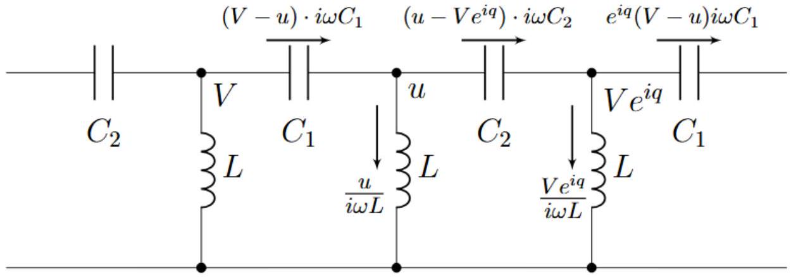
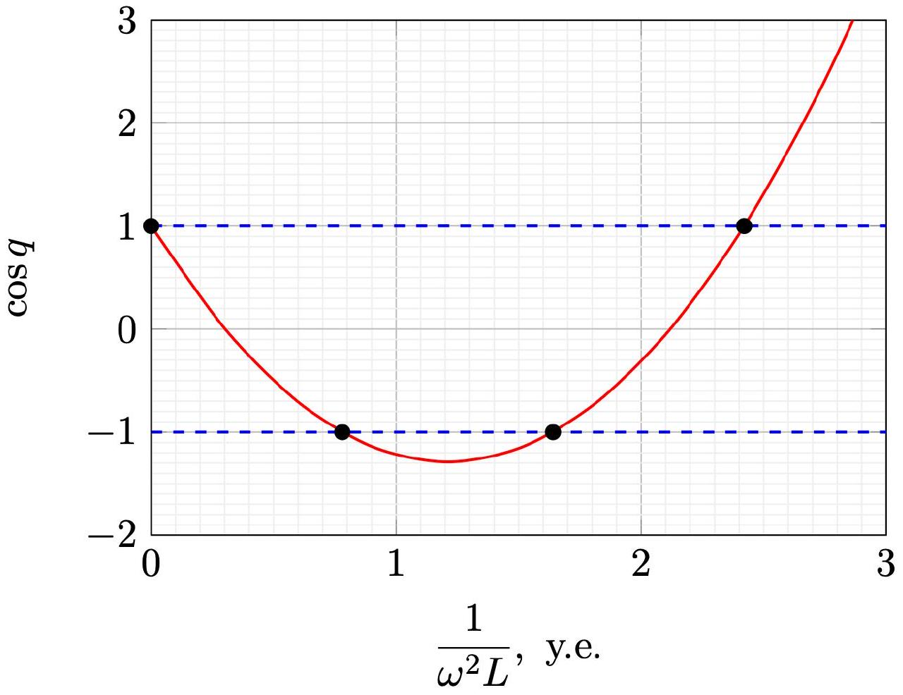
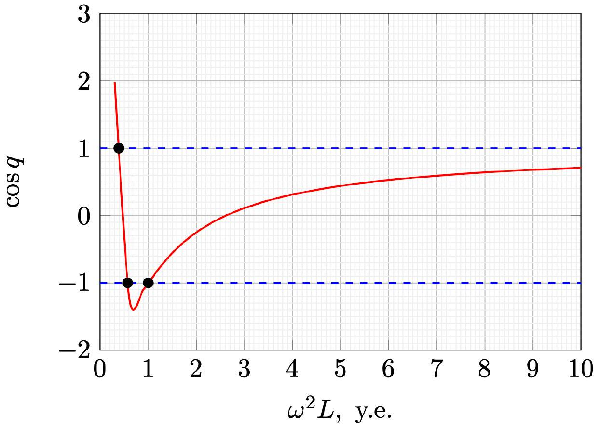
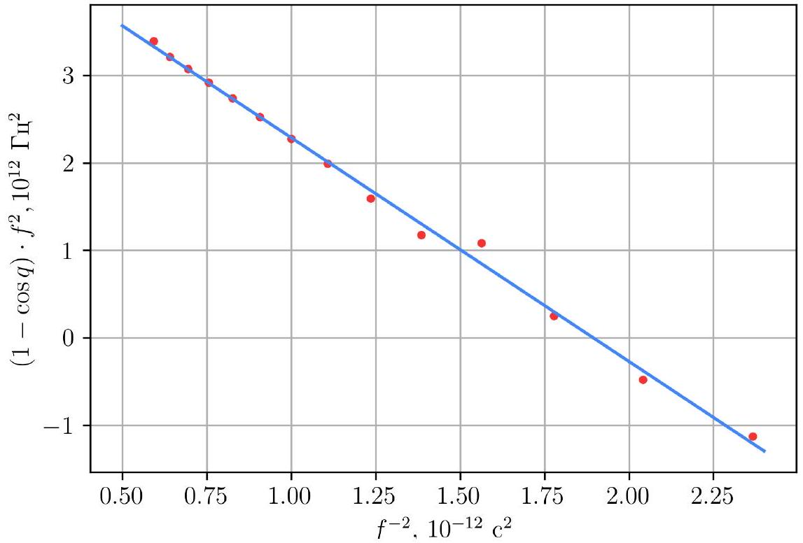
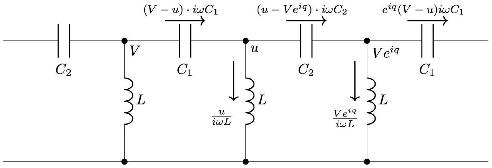
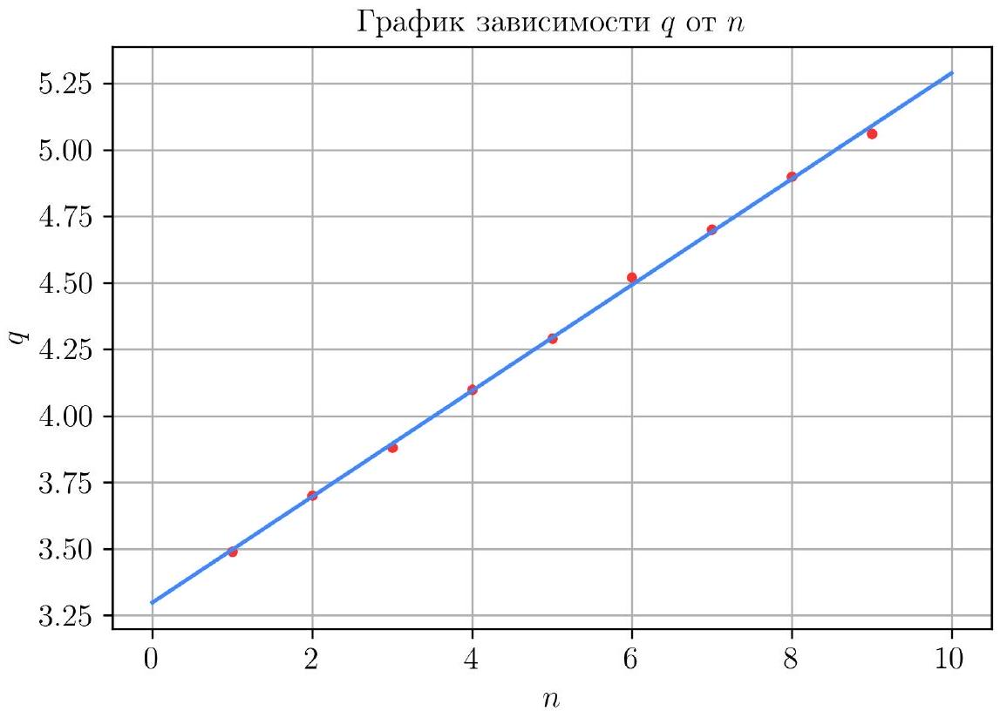

Найдём токи, текущие в звеньях, зная, что в точке, расположенной справа от точки $C$ потенциал равен $u e ^ { i q }$.

Теперь запишем первое правило Кирхгофа для узлов с потенциалами $u$ и $V e ^ { i q }$ соответственно

$$
\left\{ \begin{array} { l }
( V - u ) \cdot i \omega C _ { 1 } = \left( u - V e ^ { i q } \right) \cdot i \omega C _ { 2 } + \frac { u } { i \omega L } \\
\left( u - V e ^ { i q } \right) \cdot i \omega C _ { 2 } = e ^ { i q } ( V - u ) \cdot i \omega C _ { 1 } + \frac { V e ^ { i q } } { i \omega L }
\end{array} \right.
$$

Полученной системы уравнений достаточно, чтобы получить выражение для $\cos q ( \omega )$.

A2 ${ } ^ { 0.80 }$ Из полученной системы выразите $\cos q$ через $\omega , L , C _ { 1 }$ и $C _ { 2 }$.

Метод 1. Из обоих уравнений выразим $\frac { u } { V }$ и приравняем их.
Получим из 1 и 2 уравнений соответственно:

$$
\left\{ \begin{array} { l }
\frac { u } { V } = \frac { e ^ { i q } \cdot i \omega C _ { 2 } + i \omega C _ { 1 } } { i \omega \cdot \left( C _ { 1 } + C _ { 2 } - \frac { 1 } { \omega ^ { 2 } L } , \right) } \\
\frac { u } { V } = \frac { e ^ { i q } \cdot i \omega \cdot \left( C _ { 1 } + C _ { 2 } - \frac { 1 } { \omega ^ { 2 } L } \right) } { e ^ { i q } \cdot i \omega C _ { 1 } + i \omega C _ { 2 } }
\end{array} \right.
$$

откуда, приравнивая $\frac { u } { V }$ из разных уравнений друг другу и сокращая на $i \omega$, получим уравнение, содержащее только неизвестную $q$ :

$$
\left( e ^ { i q } C _ { 2 } + C _ { 1 } \right) \left( e ^ { i q } C _ { 1 } + C _ { 2 } \right) = e ^ { i q } \left( C _ { 1 } + C _ { 2 } - \frac { 1 } { \omega ^ { 2 } L } \right) ^ { 2 } .
$$

Теперь раскроем скобки слева и поделим обе части уравнения на $e ^ { i q }$ :

$$
C _ { 1 } ^ { 2 } + C _ { 2 } ^ { 2 } + C _ { 1 } C _ { 2 } \left( e ^ { i q } + e ^ { - i q } \right) = \left( C _ { 1 } + C _ { 2 } - \frac { 1 } { \omega ^ { 2 } L } \right) ^ { 2 } .
$$

Учитывая, что $e ^ { i q } + e ^ { - i q } = 2 \cos ( q )$, получаем соотношение на $\cos q$

$$
\cos q = \frac { \left( C _ { 1 } + C _ { 2 } - \frac { 1 } { \omega ^ { 2 } L } \right) ^ { 2 } - C _ { 1 } ^ { 2 } - C _ { 2 } ^ { 2 } } { 2 \cdot C _ { 1 } C _ { 2 } } .
$$

Метод 2. На самом деле, быстрее поступить немного иначе. Запишем систему уравнений как линейную относительно $V$ и $u$,

$$
\left\{ \begin{array} { l }
V \left( C _ { 1 } + C _ { 2 } e ^ { i q } \right) + u \left( - C _ { 1 } - C _ { 2 } + \frac { 1 } { \omega ^ { 2 } L } \right) = 0 \\
V \left( - C _ { 1 } - C _ { 2 } + \frac { 1 } { \omega ^ { 2 } L } \right) + u \left( C _ { 1 } + C _ { 2 } e ^ { - i q } \right) = 0
\end{array} \right.
$$

Чтобы система имела нетривиальное решение (их бесконечное количество), необходимо и достаточно приравнять нулю главный определитель системы. Таким образом,

$$
\left( C _ { 1 } + C _ { 2 } e ^ { i q } \right) \left( C _ { 1 } + C _ { 2 } e ^ { - i q } \right) = \left( C _ { 1 } + C _ { 2 } - \frac { 1 } { \omega ^ { 2 } L } \right) ^ { 2 } .
$$

Окончательно,

$$
\cos q = \frac { \left( C _ { 1 } + C _ { 2 } - \frac { 1 } { \omega ^ { 2 } L } \right) ^ { 2 } - C _ { 1 } ^ { 2 } - C _ { 2 } ^ { 2 } } { 2 \cdot C _ { 1 } C _ { 2 } } .
$$

Первый способ. Приведем выражение для $\cos q$

$$
\cos q = 1 - \frac { C _ { 1 } + C _ { 2 } } { C _ { 1 } C _ { 2 } } \cdot \frac { 1 } { \omega ^ { 2 } L } + \frac { 1 } { 2 C _ { 1 } C _ { 2 } } \cdot \left( \frac { 1 } { \omega ^ { 2 } L } \right) ^ { 2 }
$$

Решим два квадратных неравенства

1. $$
\begin{array} { r }
\cos q > 1 \\
- \frac { C _ { 1 } + C _ { 2 } } { C _ { 1 } C _ { 2 } } \cdot \frac { 1 } { \omega ^ { 2 } L } + \frac { 1 } { 2 C _ { 1 } C _ { 2 } } \cdot \left( \frac { 1 } { \omega ^ { 2 } L } \right) ^ { 2 } > 0 \\
\frac { 1 } { \omega ^ { 2 } L } \left( \frac { 1 } { \omega ^ { 2 } L } - 2 \left( C _ { 1 } + C _ { 2 } \right) \right) > 0 \\
\frac { 1 } { \omega ^ { 2 } L } \in ( - \infty ; 0 ) \cup \left( 2 \left( C _ { 1 } + C _ { 2 } \right) ; + \infty \right) \\
\omega ^ { 2 } L \in \left( 0 ; \frac { 1 } { 2 \left( C _ { 1 } + C _ { 2 } \right) } \right)
\end{array}
$$
2.

$$
\begin{array} { r }
\cos q < - 1 \\
2 - \frac { C _ { 1 } + C _ { 2 } } { C _ { 1 } C _ { 2 } } \cdot \frac { 1 } { \omega ^ { 2 } L } + \frac { 1 } { 2 C _ { 1 } C _ { 2 } } \cdot \left( \frac { 1 } { \omega ^ { 2 } L } \right) ^ { 2 } < 0 \\
\left( \frac { 1 } { \omega ^ { 2 } L } \right) ^ { 2 } - 2 \left( C _ { 1 } + C _ { 2 } \right) \cdot \frac { 1 } { \omega ^ { 2 } L } + 4 C _ { 1 } C _ { 2 } < 0 \\
\left( \frac { 1 } { \omega ^ { 2 } L } - 2 C _ { 1 } \right) \left( \frac { 1 } { \omega ^ { 2 } L } - 2 C _ { 2 } \right) < 0 \\
\frac { 1 } { \omega ^ { 2 } L } \in \left( 2 C _ { 1 } ; 2 C _ { 2 } \right) \\
\omega ^ { 2 } L \in \left( \frac { 1 } { 2 C _ { 1 } } ; \frac { 1 } { 2 C _ { 2 } } \right)
\end{array}
$$

Из объединения системы неравенств получаем конечный ответ

$$
\omega \in \left[ 0 ; \frac { 1 } { \sqrt { 2 \left( C _ { 1 } + C _ { 2 } \right) L } } \right) \cup \left( \frac { 1 } { \sqrt { 2 C _ { 2 } L } } ; \frac { 1 } { \sqrt { 2 C _ { 1 } L } } \right) .
$$

Второй способ. Запишем выражение для $x = \cos q$

$$
x = 1 - \frac { C _ { 1 } + C _ { 2 } } { C _ { 1 } C _ { 2 } } \cdot \frac { 1 } { \omega ^ { 2 } L } + \frac { 1 } { 2 C _ { 1 } C _ { 2 } } \cdot \frac { 1 } { \omega ^ { 4 } L ^ { 2 } } .
$$

Получаем, что зависимость $x \left( \frac { 1 } { \omega ^ { 2 } L } \right)$ квадратичная, построим ее график качественный график, на котором отметим точки пересечения с прямыми $\cos q = 1$ и $\cos q = - 1$.

Полученный график можно качественно перестроить в осях $y = \cos q x = \omega ^ { 2 } L$, сохранив все экстремумы и преобразовав ось $x$.

Введем обозначения соответствующие координатам $x$ точке пересечения построенного графика с прямыми $\cos q = 1 , \cos q = 1$. В точке пересечения графика с $\cos q = 1 , \omega = \omega _ { 1 }$. В точке пересечения графика с $\cos q = - 1 , \omega = \omega _ { 2 }$ и $\omega = \omega _ { 3 }$. Составим и решим квадратные уравнения относительно $\frac { 1 } { \omega ^ { 2 } L }$

1. $$
\begin{aligned}
\cos q & = 1 \\
- \frac { C _ { 1 } + C _ { 2 } } { C _ { 1 } C _ { 2 } } \cdot \frac { 1 } { \omega ^ { 2 } L } + \frac { 1 } { 2 C _ { 1 } C _ { 2 } } \cdot \left( \frac { 1 } { \omega ^ { 2 } L } \right) ^ { 2 } & = 0 \\
\frac { 1 } { \omega ^ { 2 } L } \left( \frac { 1 } { \omega ^ { 2 } L } - 2 \left( C _ { 1 } + C _ { 2 } \right) \right) & = 0 \\
\frac { 1 } { \omega ^ { 2 } L } = 2 \left( C _ { 1 } + C _ { 2 } \right) \text { или } \frac { 1 } { \omega ^ { 2 } L } & = 0
\end{aligned}
$$
2. $$
\begin{array} { r }
\cos q = - 1 \\
2 - \frac { C _ { 1 } + C _ { 2 } } { C _ { 1 } C _ { 2 } } \cdot \frac { 1 } { \omega ^ { 2 } L } + \frac { 1 } { 2 C _ { 1 } C _ { 2 } } \cdot \left( \frac { 1 } { \omega ^ { 2 } L } \right) ^ { 2 } = 0 \\
\left( \frac { 1 } { \omega ^ { 2 } L } \right) ^ { 2 } - 2 \left( C _ { 1 } + C _ { 2 } \right) \cdot \frac { 1 } { \omega ^ { 2 } L } + 4 C _ { 1 } C _ { 2 } = 0 \\
\left( \frac { 1 } { \omega ^ { 2 } L } - 2 C _ { 1 } \right) \left( \frac { 1 } { \omega ^ { 2 } L } - 2 C _ { 2 } \right) = 0 \\
\frac { 1 } { \omega ^ { 2 } L } = 2 C _ { 1 } \text { или } \frac { 1 } { \omega ^ { 2 } L } = 2 C _ { 2 }
\end{array}
$$
Сопоставляя решения уравнений с графиком получаем ответ
$$
\omega \in \left[ 0 ; \frac { 1 } { \sqrt { 2 \left( C _ { 1 } + C _ { 2 } \right) L } } \right) \cup \left( \frac { 1 } { \sqrt { 2 C _ { 2 } L } } ; \frac { 1 } { \sqrt { 2 C _ { 1 } L } } \right) .
$$

A4 ${ } ^ { 1.50 }$ Измерьте зависимость действительной и мнимой составляющей волнового вектора $\Re ( q )$ и $\Im ( q )$ от частоты $f$. Опишите методику измерений. Измерения проводите в диапазоне частот от 650 кГц до 1300 кГц с шагом 50 кГц. Для каждой частоты $f$ необходимо получить значение и $\Re ( q )$, и $\Im ( q )$.

Подключим генератор к цепи согласно инструкции в условии. С помощью двух каналов осциллографа будем измерять удвоенную амплитуду напряжения на генераторе $U _ { 0 }$ и удвоенную амплитуду напряжения на первом звене $U _ { 1 }$.

По сдвигу фаз сигналов на осциллографе будем измерять $\Re ( q )$

$$
\Re ( q ) = 2 \pi f \Delta T
$$

По отношению амплитуд на сигналах будем измерять $\mathfrak { I } ( q )$

$$
\Im ( q ) = \ln \frac { U _ { 0 } } { U _ { 1 } }
$$

Примечание. При проведении измерений в диапазоне частот $f \in [ 770 ; 890 ]$ кГц цепь находится в проводящем состоянии (соответствует диапазону частот $f \in \left( \frac { 1 } { \sqrt { 2 \left( C _ { 1 } + C _ { 2 } \right) L } } ; \frac { 1 } { \sqrt { 2 C _ { 2 } L } } \right)$, поэтому при измерениях можно заметить влияние отраженной волны. При линеаризации эти точки будут давать выбросы.

| $f$, кГц | $\Delta T$, нс | $U _ { 0 } , \mathrm { mB }$ | $U _ { 1 } , \mathrm { mB }$ | $\Re ( q )$ | $\mathfrak { I } ( q )$ | $f ^ { - 2 } , 10 ^ { - 12 } c ^ { 2 }$ | $\Re ( \cos q )$ | $( 1 - \cos q ) \cdot f ^ { 2 } , 10 ^ { 12 }$ Гц $^ { 2 }$ |
| :--- | :--- | :--- | :--- | :--- | :--- | :--- | :--- | :--- |
| 650 | 0 | 57.6 | 8 | 0.00 | -1.97 | 2.37 | 3.67 | -1.13 |
| 700 | 32 | 128 | 34.4 | 0.14 | -1.31 | 2.04 | 1.98 | -0.48 |
| 750 | 216 | 284 | 408 | 1.02 | 0.36 | 1.78 | 0.56 | 0.25 |
| 800 | 452 | 616 | 416 | 2.27 | -0.39 | 1.56 | -0.70 | 1.09 |
| 850 | 396 | 328 | 172 | 2.11 | -0.65 | 1.38 | -0.63 | 1.18 |

| 900 | 480 | 304 | 212 | 2.71 | -0.36 | 1.23 | -0.97 | 1.60 |
| :--- | :--- | :--- | :--- | :--- | :--- | :--- | :--- | :--- |
| 950 | 516 | 252 | 134 | 3.08 | -0.63 | 1.11 | -1.21 | 1.99 |
| 1000 | 496 | 232 | 112 | 3.12 | -0.73 | 1.00 | -1.28 | 2.28 |
| 1050 | 484 | 232 | 110 | 3.19 | -0.75 | 0.91 | -1.29 | 2.53 |
| 1100 | 460 | 244 | 120 | 3.18 | -0.71 | 0.83 | -1.26 | 2.74 |
| 1150 | 436 | 268 | 142 | 3.15 | -0.64 | 0.76 | -1.21 | 2.92 |
| 1200 | 416 | 304 | 182 | 3.14 | -0.51 | 0.69 | -1.13 | 3.07 |
| 1250 | 396 | 368 | 264 | 3.11 | -0.33 | 0.64 | -1.06 | 3.21 |
| 1300 | 388 | 520 | 464 | 3.17 | -0.11 | 0.59 | -1.01 | 3.39 |

А5 ${ } ^ { 1.00 }$ Линеаризуйте зависимость $\Re ( \cos q )$ от частоты генератора $f$ и определите коэффициенты линейной зависимости.

Используя результат прошлых пунктов

$$
\cos q = 1 - \frac { C _ { 1 } + C _ { 2 } } { C _ { 1 } C _ { 2 } } \cdot \frac { 1 } { \omega ^ { 2 } L } + \frac { 1 } { 2 C _ { 1 } C _ { 2 } } \cdot \frac { 1 } { \omega ^ { 4 } L ^ { 2 } } .
$$

Преобразуя выражение получаем линеаризацию $( 1 - \cos q ) \cdot \omega ^ { 2 } L$ от $\frac { 1 } { \omega ^ { 2 } L }$

$$
( 1 - \cos q ) \cdot \omega ^ { 2 } L = \frac { C _ { 1 } + C _ { 2 } } { C _ { 1 } C _ { 2 } } - \frac { 1 } { 2 C _ { 1 } C _ { 2 } } \cdot \frac { 1 } { \omega ^ { 2 } L } .
$$

Линеаризуем зависимость и построим график.

График зависимости $( 1 - \cos q ) \cdot f ^ { 2 }$ от $f ^ { - 2 }$

Параметры линейной зависимости (угловой коэффициент и показатель сдвига соответственно)

$$
k = - 2.58 \cdot 10 ^ { 24 } \Gamma ц ^ { 4 } , \quad b = 4.86 \cdot 10 ^ { 12 } \Gamma ц ^ { 2 } .
$$

A6 ${ } ^ { 0.70 }$ Используя коэффициенты, найденные в А5, определите ёмкости конденсаторов $C _ { 1 }$ и $C _ { 2 } \left( C _ { 1 } < C _ { 2 } \right)$.

Согласно теории,

$$
k = - \frac { ( 2 \pi ) ^ { 2 } } { 2 L ^ { 2 } } \cdot \frac { 1 } { C _ { 1 } C _ { 2 } } , \quad b = \frac { ( 2 \pi ) ^ { 2 } } { L } \cdot \frac { C _ { 1 } + C _ { 2 } } { C _ { 1 } C _ { 2 } } .
$$

Откуда получаем (воспользовавшись, например, теоремой Виета для квадратного уравнения, корни которого - обратные емкости)

$$
\begin{aligned}
C _ { 1 } & = 0.43 \mathrm { H } \Phi , \\
C _ { 2 } & = 0.89 _ { \mathrm { H } } \Phi .
\end{aligned}
$$

В1 ${ } ^ { 0.80 }$ Выразите импедансы $z _ { r }$ и $z _ { l }$ для волн, бегущих вправо и влево. Ответ выразите через $C _ { 1 } , C _ { 2 } , L , q$ и $\omega$.

Расставим токи и потенциалы в цепи аналогично части A

Тогда запишем волновой импеданс $z _ { r }$ для волны, бегущей вправо

$$
z _ { r } = \frac { V } { I } = \frac { V } { V - u } \cdot \frac { 1 } { i \omega C _ { 1 } } .
$$

Подставим соотношение для $\frac { u } { V }$, полученное в части А

$$
z _ { r } = \frac { 1 } { 1 - \frac { C _ { 1 } + C _ { 2 } e ^ { i q } } { C _ { 1 } + C _ { 2 } - \frac { 1 } { \omega ^ { 2 } L } } } \cdot \frac { 1 } { i \omega C _ { 1 } } = \frac { C _ { 1 } + C _ { 2 } - \frac { 1 } { \omega ^ { 2 } L } } { C _ { 2 } \left( 1 - e ^ { i q } \right) - \frac { 1 } { \omega ^ { 2 } L } } \cdot \frac { 1 } { i \omega C _ { 1 } } .
$$

Выражение для $z _ { l }$ можно получить используя замену $q \rightarrow - q$

$$
z _ { l } = \frac { C _ { 1 } + C _ { 2 } - \frac { 1 } { \omega ^ { 2 } L } } { C _ { 2 } \left( 1 - e ^ { - i q } \right) - \frac { 1 } { \omega ^ { 2 } L } } \cdot \frac { 1 } { i \omega C _ { 1 } }
$$

В2 ${ } ^ { 0.60 }$ Запишите граничное условие, связывающие комплексные амплитуды напряжений $V _ { r } ( 0 , t )$ и $V _ { l } ( 0 , t )$. В ответе получите уравнение, содержащее $V _ { r } ( 0 , t ) , V _ { l } ( 0 , t ) , z _ { r } , z _ { l } , q$ и $N$.

Запишем граничное условие для тока вытекающего из звена в цепи с номером $N$

$$
I _ { r } ( N , t ) + I _ { l } ( N , t ) = 0
$$

Выразим токи каждой из волн через соответствующие напряжения на нулевом звене

$$
\begin{array} { r }
\frac { V _ { r } ( 0 , t ) e ^ { i q N } } { z _ { r } } + \frac { V _ { l } ( 0 , t ) e ^ { - i q N } } { z _ { l } } = 0 , \\
V _ { l } ( 0 , t ) = - \frac { z _ { l } } { z _ { r } } V _ { r } ( 0 , t ) e ^ { 2 i q N } ,
\end{array}
$$

Вз $1 ^ { 1.20 }$ Получите выражение для модуля полного импеданса цепи $| z |$, состоящей из $N$ звеньев. Ответ выразите через $N$, $q$ и $\left| z _ { r } \right|$.

Напишем выражение для полного импеданса цепи подставляя амплитуду напряжения и тока как суммы амплитуд напряжения и тока двух волн

$$
z = \frac { V _ { r } ( 0 , t ) + V _ { l } ( 0 , t ) } { I _ { r } ( 0 , t ) + I _ { l } ( 0 , t ) } = \frac { V _ { r } ( 0 , t ) + V _ { l } ( 0 , t ) } { \frac { V _ { r } ( 0 , t ) } { z _ { r } } + \frac { V _ { l } ( 0 , t ) } { z _ { l } } } .
$$

Подставим полученные соотношения на амплитуды напряжений волн

$$
z = \frac { 1 - \frac { z _ { l } } { z _ { r } } e ^ { 2 i q N } } { \frac { 1 } { z _ { r } } + \frac { 1 } { z _ { l } } \left( - \frac { z _ { l } } { z _ { r } } e ^ { 2 i q N } \right) } = \frac { z _ { r } - z _ { l } e ^ { 2 i q N } } { 1 - e ^ { 2 i q N } } .
$$

Подставим соотношение на импедансы и пренебрежем $\frac { 1 } { \omega ^ { 2 } L }$

$$
z = z _ { r } \frac { 1 - \frac { C _ { 2 } \left( 1 - e ^ { i q } \right) - \frac { 1 } { \omega ^ { 2 } L } } { C _ { 2 } \left( 1 - e ^ { - i q } \right) - \frac { 1 } { \omega ^ { 2 } L } } \cdot e ^ { 2 i q N } } { 1 - e ^ { 2 i q N } } = z _ { r } \frac { 1 - \frac { 1 - e ^ { i q } } { 1 - e ^ { - i q } } \cdot e ^ { 2 i q N } } { 1 - e ^ { 2 i q N } } = z _ { r } \frac { 1 + e ^ { 2 i q \left( N + \frac { 1 } { 2 } \right) } } { 1 - e ^ { 2 i q N } } .
$$

Возьмем модуль от полученного выражения

$$
| z | = \left| z _ { r } \right| \frac { \cos \left( q \left( N + \frac { 1 } { 2 } \right) \right) } { \sin ( q N ) } .
$$

В4 ${ } ^ { 0.60 }$ Используя результаты, полученные в части A, напишите уравнение на частоты, при которых достигается максимум модуля импеданса. Ответ выразите через $N , C _ { 1 } , C _ { 2 } , L , \omega$ и целочисленный параметр $m$.

Максимум модуля достигается при $q N = \pi \Delta n$. Получим выражение на частоты, при которых достигаются экстремумы импеданса

В5 ${ } ^ { 1.00 }$ Измерьте частоты, при которых реализуется максимум модуля импеданса. Измерения следует проводить на частотах 1400 кГц $< f < 6000$ кГц, при которых LC-контур переходит в зону проводимости.

Подключимся к плате согласно условию, будем измерять частоты, при которых достигается минимум амплитуды напряжения на резисторе. Сигнал на резисторе получим, используя режим осциллографа math, вычитая из сигнала, снимаемого с генератора, сигнал, снимаемый на контактах J2-GND.

| $n$ | $f _ { \text {rez } }$, кГц | $q$ |
| :--- | :--- | :--- |
| 1 | 1466 | 3.49 |
| 2 | 1590 | 3.70 |
| 3 | 1717 | 3.88 |
| 4 | 1920 | 4.10 |
| 5 | 2137 | 4.29 |
| 6 | 2489 | 4.52 |
| 7 | 2899 | 4.70 |
| 8 | 3579 | 4.90 |
| 9 | 4549 | 5.06 |

В6 ${ } ^ { 0.80 }$ Линеаризуйте зависимость, измеренную в пункте В5, и постройте линеаризованный график, из которого определите количество звеньев в цепи $N$.

Построим зависимость $q = 2 \pi - \arccos \left( \frac { 1 } { 2 C _ { 1 } C _ { 2 } } \left( \frac { 1 } { \omega ^ { 2 } L } - \left( C _ { 1 } + C _ { 2 } \right) \right) ^ { 2 } - \left( C _ { 1 } ^ { 2 } + C _ { 2 } ^ { 2 } \right) \right)$ от $n$.

Угловой коэффициент равен $k = 0.198$, откуда $N = 15.9 \approx 16$.
