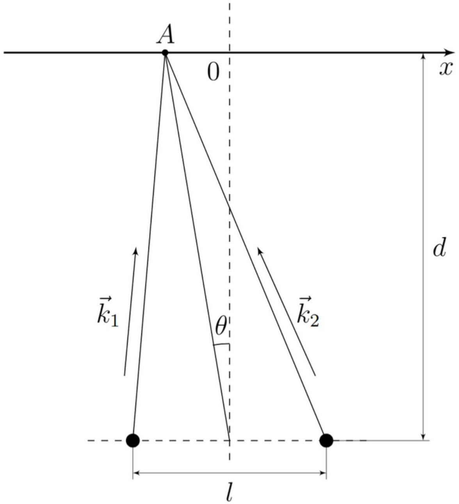
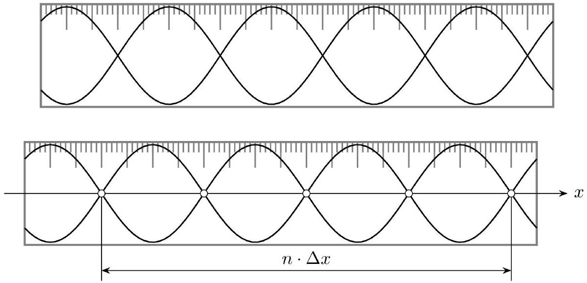
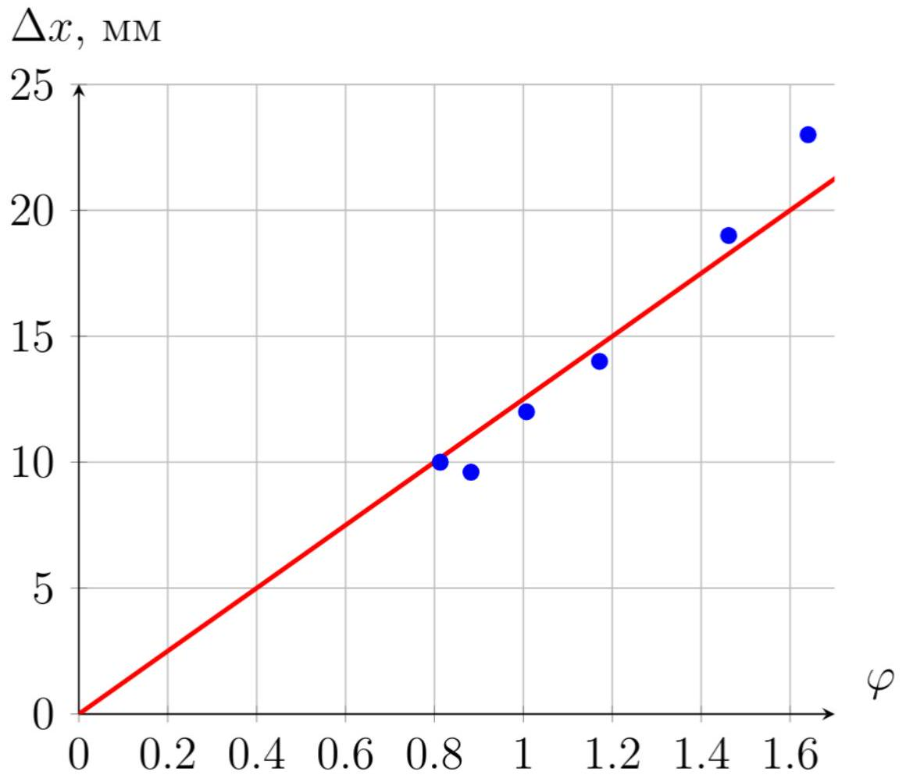
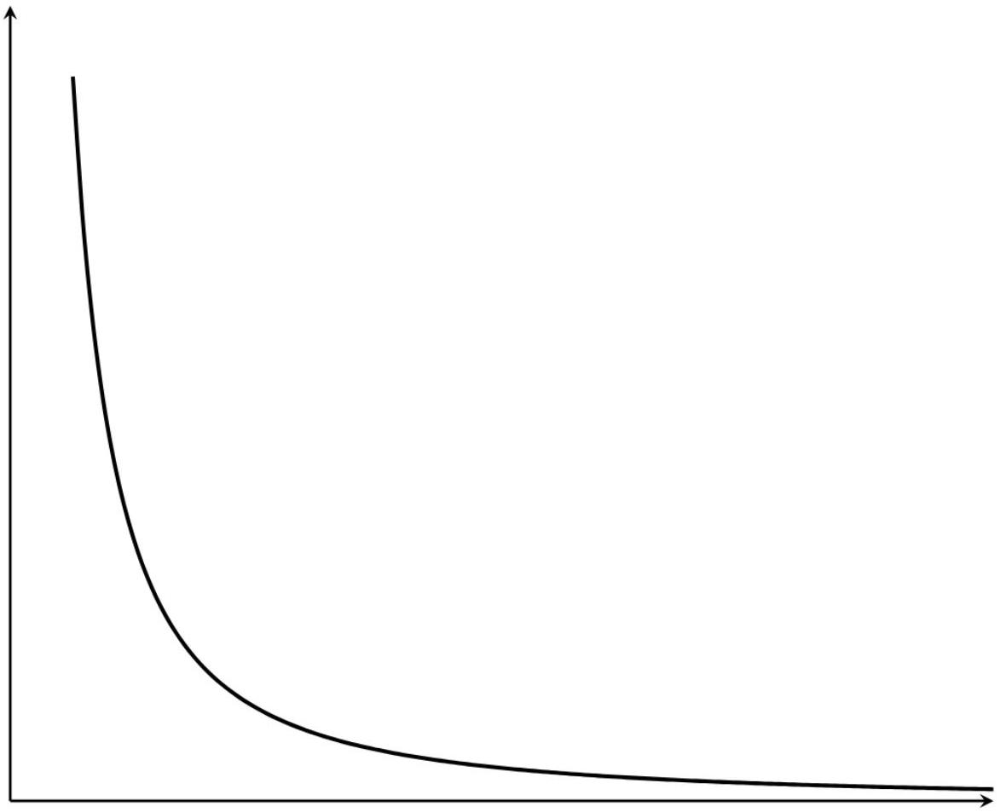
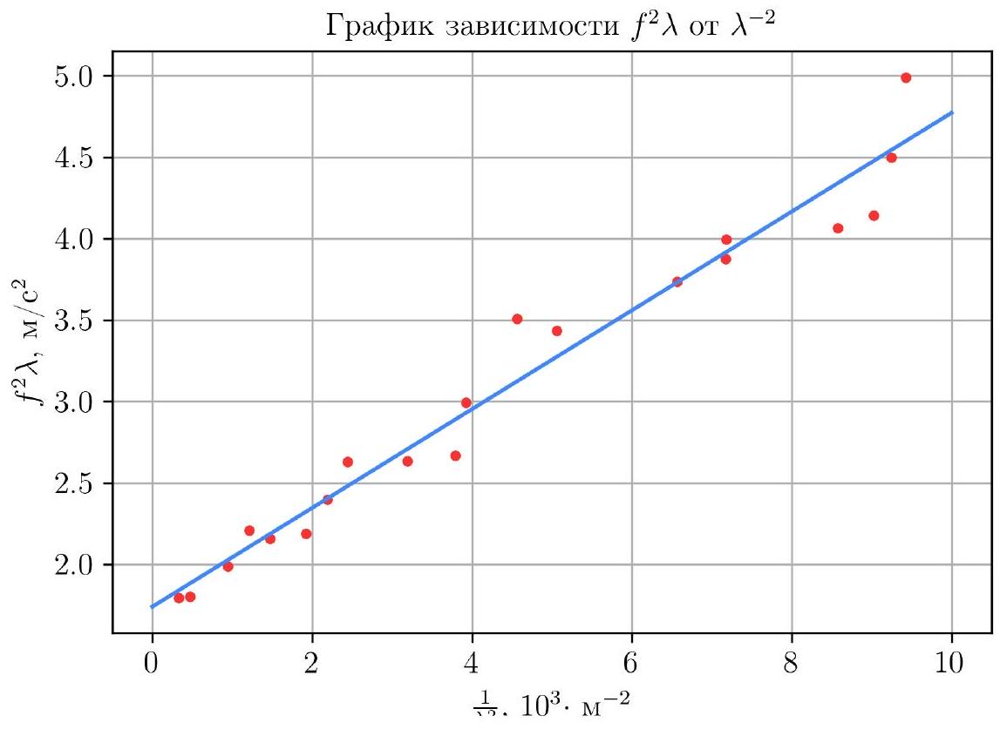

Во избежание поломки не будем использовать оборудование.

А1 ${ } ^ { 1.00 }$ Запишите формулу для разности координат $\Delta x = x _ { n + 1 } ^ { \min } - x _ { n } ^ { \min } = x _ { n + 1 } ^ { \max } - x _ { n } ^ { \max }$ узлов/пучностей, находящихся на прямой $O X$, в приближении $x _ { n } \ll l , d$. Ответ выразите через $l , d$ и $\lambda$.

Рассмотрим классическую интерференционную схему Юнга:

В точку $A$ находящююся на координате $x _ { A }$ (на рисунке $x _ { A } < 0$ ) приходит две волны от точечных источников с волновыми векторами $\vec { k } _ { 1 }$ и $\vec { k } _ { 2 }$. Найдем сКоординату поверхности в точке $A$.

$$
z _ { A } = \frac { A } { \left( \left( x _ { A } + \frac { l } { 2 } \right) ^ { 2 } + d ^ { 2 } \right) ^ { \frac { 1 } { 4 } } } \cos \left( \omega t - k \left( \left( x _ { A } + \frac { l } { 2 } \right) ^ { 2 } + d ^ { 2 } \right) ^ { \frac { 1 } { 2 } } \right) + \frac { A } { \left( \left( x _ { A } - \frac { l } { 2 } \right) ^ { 2 } + d ^ { 2 } \right) ^ { \frac { 1 } { 4 } } } \cos \left( \omega t - k \left( \left( x _ { A } - \frac { l } { 2 } \right) ^ { 2 } + d ^ { 2 } \right) ^ { \frac { 1 } { 2 } } \right)
$$

Разложим это выражение в приближении $x \ll d , l$ и применим ормулу для суммы косинусов. Для удобства введем обозначение $r _ { 0 } = \sqrt { \left( \frac { l } { 2 } \right) ^ { 2 } + d ^ { 2 } }$.

$$
z _ { A } \approx \frac { 2 A } { \sqrt { r _ { 0 } } } \cos \left( \frac { k x _ { A } l } { 2 r _ { 0 } } \right) \cos \left( \omega t - k r _ { 0 } \right)
$$

Наблюдаем предсказанные стоячие волны вдоль оси $x$. Или рассматривая этот эффект с точки зрения средней амплитуды видим интерференцию. Тогда расстояние между соседними узлами/пучностями:

Ответ:

$$
\Delta x = \frac { 2 \pi r _ { 0 } } { l k } = \frac { \lambda \sqrt { \frac { l } { 4 } ^ { 2 } + d ^ { 2 } } } { l }
$$

А2 ${ } ^ { 0.10 }$ Как можно точнее измерьте и запишите используемое значение $d$.

$$
d = ( 12.5 \pm 0.5 ) \mathrm { cm }
$$

Комметарий. Погрешность 0.5 см выбрана, т.к. $d$ меняется в зависимости от амплитуды колебаний воды,

А3 ${ } ^ { 0.10 }$ Запишите напряжение $U _ { 0 }$ на моторчике, соответствующее частоте $f _ { 0 } = ( 17.5 \pm 0.5 )$ Гц.

Ответ:

$$
U _ { 0 } = 1.5 \pm 0.1 \mathrm {~B}
$$

A4 ${ } ^ { 1.00 }$ Нарисуйте, как меняется амплитуда колебания луча лазера 1 на линейке при изменении координаты $x$.

Опишите с помощью схем, рисунков и формул метод, позволяющий с хорошей точностью экспериментально определить $\Delta x$.

Обведите в листе ответов, между чем вы будете измерять расстояние (узлами/пучностями).

Наибольшую точность дает измерение расстояния методом рядов между узлами.
Следует измерять расстояние между узлами а не пучностями, так как:

1. Двигатель вращается довольно нестабильно, вследствие чего амплитуда может меняться со временем в одной и той же точке, в результате чего можно пронаблюдать ложный максимум.
2. В реальности в таких волнах существуют высшие гармоники $2 f , 3 f$ и т.д. с меньшими амплитудами, которые не сдвигают положение нуля (или минимума) амплитуды, но могут существенно сдвигать максимум.

Собирая экспериментальную установку, легко убедиться, что минимумы видны намного более четко чем максимумы.
Будем измерять расстояние между несоседними узлами, измеряя таким образом $m \Delta x$. Измерять расстояние следует между не слишком большим количеством узлов (чтобы их координаты удовлетворяли включению $x _ { n } \in \left[ - \frac { l } { 2 } ; \frac { l } { 2 } \right]$ ).

Процесс измерения минимумов - двигаем держатель лазера вдоль стенки контейнера, так, чтобы луч лазер оставался перпендикулярен линии движения. На линейке видна картинка колеблющейся по вертикали лазерной точки. Ищя положения в которых амплитуда этих колебаний ноль (т.е. поверхность неподвижна), находим положения узлов. Измеряем расстояние между положениями ущлов на линейке. Это расстояние равно расстоянию между узлами, т.к. лазерный луч сдвигался параллельно оси $O x$ и линейке.

Ответ:

А5 1.00 Измерьте зависимость $\Delta x$ от $l$, при фиксированной частоте моторчика $f _ { 0 }$ (не менее 5 точек).

Установим и измерим расстояние $d = 125$ мм. Экспериментальные данные приведены в таблице ниже.

Ответ:

| $l$, см | $N$ | $x _ { 1 }$, CM | $x _ { 2 }$, CM | $\Delta x$, CM | $\varphi$ |
| :--- | :--- | :--- | :--- | :--- | :--- |
| 19.5 | 5 | 26.5 | 31.5 | 1.00 | 0.81 |
| 17.2 | 5 | 27.0 | 31.8 | 0.96 | 0.88 |
| 14.3 | 5 | 25.0 | 31.0 | 1.20 | 1.01 |
| 11.8 | 3 | 27.0 | 31.2 | 1.40 | 1.17 |
| 9.1 | 2 | 26.2 | 30.0 | 1.90 | 1.40 |
| 8.0 | 1 | 27.1 | 29.4 | 2.30 | 1.64 |

Зависимость $\Delta x$ от $\varphi = \frac { \sqrt { \left( \frac { l } { 2 } \right) ^ { 2 } + d ^ { 2 } } } { l }$, согласно теории, является линейной. Пересчитаем экспериментальные точки и построим график.

Ответ:

На этом графике самой точной точкой является $( 0,0 )$. Оптимальным проведением прямой является именно проведение, показанное на графике т.к. погрешность измерения $d$ и $l$ начинает существенно искажать измерения при малых $l$.

A7 ${ } ^ { 0.50 }$ Определите длину волны $\lambda \left( f _ { 0 } \right)$ и оцените ее погрешность.

Длина волны есть угловой коэффициент данной зависимости. С использованием графика получаем:

Ответ: $\lambda = ( 12.4 \pm 0.5 )$ мм.

Погрешность оценивается исходя из разброса значений углового коэффициента.

В1 ${ } ^ { 0.30 }$ Постройте качественный график зависимости $f$ от $\lambda$, описываемой формулой (1).

Ответ:

Ответ:

$$
l = ( 19.5 \pm 0.5 ) \text { см }
$$

Комметарий по оценке погрешности. $l$ - расстояние между точечными источниками, которые в реальности точечными не являются.

В3 ${ } ^ { 3.00 }$ Измерьте зависимость $\Delta x$ от $f$ в диапазоне $f \in [ 6.0,24.0 ]$ Гц (не менее 13 точек).

Для каждой частоты будем находить длину волны, измеряя расстояние между несколькими узлами. Результаты измерений приведены в таблице ниже

Ответ:

| $f$, Гц | $x _ { 1 }$, MM | $x _ { 2 }$, MM | $N$ | $\Delta x , \mathrm { мм }$ | $\lambda$, мм | $\frac { 1 } { \lambda ^ { 2 } } , \frac { 10 ^ { 3 } } { \mathrm { M } ^ { 2 } }$ | $f ^ { 2 } \lambda , \mathrm {~m} / \mathrm { c } ^ { 2 }$ |
| :--- | :--- | :--- | :--- | :--- | :--- | :--- | :--- |
| 5.7 | 248 | 383 | 3 | 44.88 | 55.2 | 0.33 | 1.79 |
| 6.3 | 235 | 348 | 3 | 37.50 | 46.1 | 0.47 | 1.80 |
| 7.8 | 256 | 336 | 3 | 26.50 | 32.6 | 0.94 | 1.99 |
| 8.8 | 260 | 353 | 4 | 23.33 | 28.7 | 1.21 | 2.21 |
| 9.1 | 242 | 327 | 4 | 21.18 | 26.1 | 1.47 | 2.16 |
| 9.8 | 273 | 347 | 4 | 18.54 | 22.8 | 1.92 | 2.19 |
| 10.6 | 310 | 432 | 7 | 17.36 | 21.4 | 2.19 | 2.40 |
| 11.4 | 274 | 389 | 7 | 16.45 | 20.2 | 2.44 | 2.63 |
| 12.2 | 246 | 347 | 7 | 14.39 | 17.7 | 3.19 | 2.63 |
| 12.8 | 255 | 347 | 7 | 13.20 | 16.2 | 3.79 | 2.67 |
| 13.7 | 224 | 354 | 10 | 12.97 | 16.0 | 3.93 | 3.00 |
| 15.4 | 218 | 338 | 10 | 12.03 | 14.8 | 4.57 | 3.51 |
| 15.6 | 250 | 364 | 10 | 11.43 | 14.1 | 5.06 | 3.43 |
| 17.4 | 222 | 322 | 10 | 10.03 | 12.3 | 6.56 | 3.74 |
| 18.1 | 250 | 346 | 10 | 9.60 | 11.8 | 7.17 | 3.88 |
| 18.4 | 247 | 343 | 10 | 9.59 | 11.8 | 7.18 | 4.00 |
| 19.4 | 240 | 328 | 10 | 8.78 | 10.8 | 8.57 | 4.06 |
| 19.8 | 233 | 319 | 10 | 8.56 | 10.5 | 9.03 | 4.14 |
| 20.8 | 234 | 319 | 10 | 8.45 | 10.4 | 9.25 | 4.50 |
| 22.0 | 236 | 320 | 10 | 8.40 | 10.3 | 9.43 | 4.99 |

B4 ${ } ^ { 1.30 }$ Постройте линеаризованный график зависимости $\Delta x$ от $f$.

Зависимость $f ^ { 2 } \lambda$ от $\lambda ^ { - 2 }$, согласно теории, является линейной. Пересчитаем экспериментальные точки и построим график.

Ответ:

Используя MHK,

Ответ:

$$
\alpha = ( 1.77 \pm 0.14 ) \mathrm { m } / \mathrm { c } ^ { 2 } , \quad \beta = ( 0.29 \pm 0.03 ) \cdot 10 ^ { - 3 } \mathrm {~m} ^ { 3 } / \mathrm { c } ^ { 2 } .
$$
