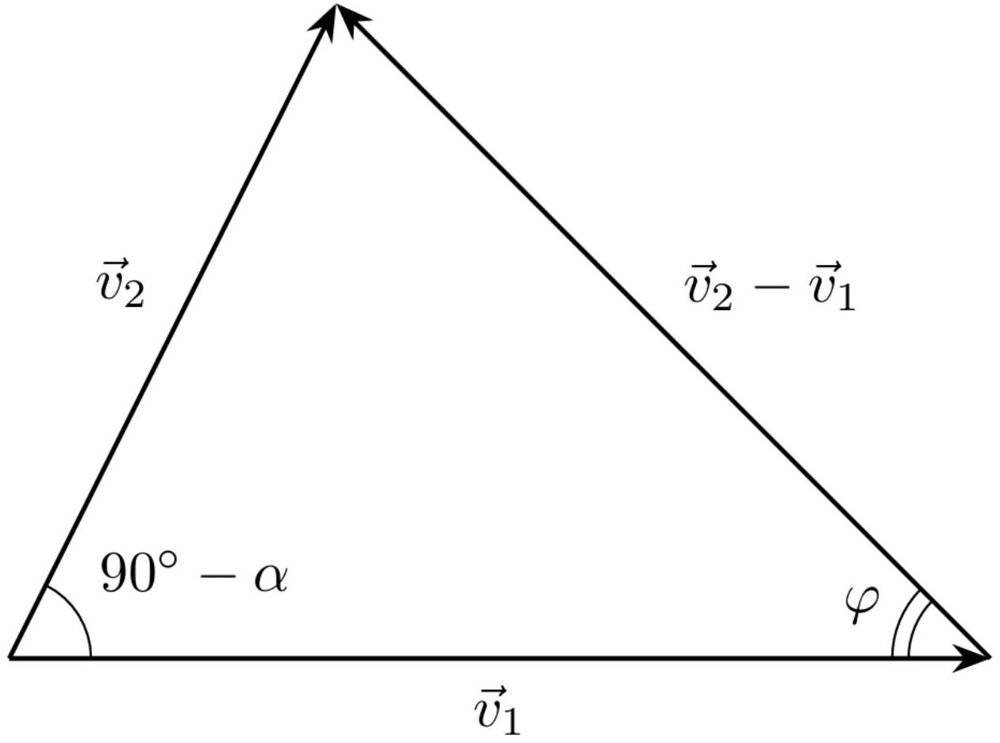

Рассмотрим смещение ножа на $\mathrm { d } r$ по направлению резки. Отрез не растягивается, поэтому его относительное смещение по клину также равно $\mathrm { d } r$. Запишем закон сохранения энергии для системы нож-обрез:

$$
F _ { C } \mathrm {~d} r = R w \mathrm {~d} r + \mu N \mathrm {~d} r
$$

Отсюда получаем:

Ответ:

$$
F _ { C } = \mu N + R w
$$

А2 ${ } ^ { 0.80 }$ Определите $F _ { C }$. Ответ выразите через $R , \mu , \theta , w$.

Запишем второй закон Ньютона для клина в проекции на горизонтальную ось:

$$
F _ { C } = \mu N \cos \theta + N \sin \theta
$$

Комбинируя это выражение с результатом предыдущего пункта, получаем:

Ответ:

$$
F _ { C } = \frac { R w } { 1 - \frac { \mu } { \mu \cos \theta + \sin \theta } }
$$

А3 ${ } ^ { 1.00 }$ Постройте качественный график $F _ { C } ( \theta )$ при $\mu = 0.3$ в диапазоне $\theta \in [ 0 ; \pi / 2 ]$. Укажите особые точки и их координаты. $F _ { C }$ выражайте в единицах $w R$.

Построим график:

Ответ:

Эта зависимость имеет экстремум:

$$
\cos \theta - \mu \sin \theta = 0 , \quad \theta = \operatorname { arctg } \frac { 1 } { \mu } \approx 73 ^ { \circ }
$$

Минимальное значение силы $F _ { C }$ выражается как:

$$
F _ { C } = \frac { R w } { 1 - \frac { \mu } { \sqrt { \mu ^ { 2 } + 1 } } } \approx 1.40 R w
$$

Упрощая ответ из А2, получаем:

Ответ:

$$
F _ { C } = R w
$$

В отсутствие трения суммарная сила, действующая на клин, направлена под углом $\theta$ к вертикали, поэтому:

Ответ:

$$
F _ { T } = R w \operatorname { ctg } \theta
$$

В1 ${ } ^ { 0.20 }$ Определите полную горизонтальную силу $F$, действующую на нож, пренебрегая трением. Ответ выразите через $R , \theta , w , \psi$.

Для смещения параллельно линии реза не нужно прикладывать усилие, поэтому:

Ответ:

$$
F = R w
$$

В2 ${ } ^ { 1.50 }$ Определите полную горизонтальную силу $F$, действующую на нож со стороны стружки. Ответ выразите через $R , w , \psi , \theta , \mu$.

Введем проекции $F _ { \| }$и $F _ { \perp }$. По закону Кулона-Амонтона сила трения, действующая на стружку, равна $\mu N$ по модулю и направлена против скорости движения стружки относительно клина.
Запишем второй закон Ньютона:

$$
F _ { \perp } = N ( \sin \theta + \mu \cos \theta \cos \psi )
$$

В проекции на перпендикулярную горизонтальную ось условие равновесия следующее:

$$
F _ { \| } = \mu N \sin \psi
$$

Запишем ЗСЭ, для этого приравняем мощность силы $F$ к мощности потерь энергии в системе на трение:

$$
\mu N v + R w v \cos \psi = F _ { \perp } v \cos \psi + F _ { \| } v \sin \psi
$$

Выразим $N$, комбинируя результаты:

$$
N = \frac { R w } { ( \sin \theta + \mu \cos \theta \cos \psi ) - \mu \cos \psi }
$$

Выразим $F$ как $F = \sqrt { F _ { \| } ^ { 2 } + F _ { \perp } ^ { 2 } }$ :

Ответ:

$$
F = \frac { R w } { ( \sin \theta + \mu \cos \theta \cos \psi ) - \mu \cos \psi } \sqrt { \mu ^ { 2 } \sin ^ { 2 } \psi + ( \sin \theta + \mu \cos \theta \cos \psi ) ^ { 2 } }
$$

С1 ${ } ^ { 0.30 }$ Из геометрии определите $t _ { c }$. Ответ выразите через $t$, углы $\varphi$ и $\alpha$.

Длина стружки остается постоянной, отсюда:

$$
\frac { t } { \sin \varphi } = \frac { t _ { c } } { \cos ( \varphi - \alpha ) }
$$

Выразим $t _ { c }$ :

Ответ:

$$
t _ { c } = t \frac { \cos ( \varphi - \alpha ) } { \sin \varphi }
$$

с2 ${ } ^ { 0.30 }$ Найдите, при каком угле $\varphi$ толщина стружки $t _ { c }$ равна $t$.

Приравняем синусы углов:

$$
\sin \varphi = \cos ( \varphi - \alpha ) = \sin ( \pi / 2 - \varphi + \alpha )
$$

Отсюда:

Ответ:

$$
\varphi = \pi / 4 + \alpha / 2
$$

С3 ${ } ^ { 1.00 }$ Определите $\gamma$. Ответ выразите через $\varphi , \alpha$.

Первое решение
Рассмотрим треугольник скоростей:

Отсюда по теореме синусов:

$$
\frac { \left| \vec { v } _ { 2 } - \vec { v } _ { 1 } \right| } { \left| \vec { v } _ { 1 } \right| } = \frac { \cos \alpha } { \cos ( \varphi - \alpha ) }
$$

Выразим ответ:

Ответ:

$$
\gamma = \frac { \left| \vec { v } _ { 2 } - \vec { v } _ { 1 } \right| } { \left| \vec { v } _ { 1 } \right| } = \frac { \cos \alpha } { \cos ( \varphi - \alpha ) \sin \varphi }
$$

Второе решение
Из уравнения несжимаемости металла:

$$
v _ { 1 } t = v _ { 2 } t _ { c }
$$

Выразим ответ:

$$
\gamma = \frac { \sqrt { 1 + \left( \frac { \sin \varphi } { \cos ( \varphi - \alpha ) } \right) ^ { 2 } - 2 \frac { \sin \varphi } { \cos ( \varphi - \alpha ) } \sin \alpha } } { \sin \varphi } = \frac { \sqrt { \cos ^ { 2 } \varphi \cos ^ { 2 } \alpha + \sin ^ { 2 } \varphi \sin ^ { 2 } \alpha + 2 \sin \varphi \sin \alpha \cos \varphi \cos \alpha + \sin ^ { 2 } \varphi - 2 \sin \varphi \sin \alpha \cos \varphi \cos \alpha - 2 \sin ^ { 2 } \varphi \sin ^ { 2 } \alpha } } { \sin \varphi \cos ( \varphi - \alpha ) }
$$

Путем несложных преобразований ответ упрощается до:

$$
\gamma = \frac { \cos \alpha } { \cos ( \varphi - \alpha ) \sin \varphi }
$$

Ответ:

$$
\gamma = \frac { \cos \alpha } { \cos ( \varphi - \alpha ) \sin \varphi }
$$

C4 ${ } ^ { 1.20 }$ Определите $F _ { C }$. Ответ выразите $w , k , t , \varphi , \alpha , \beta , R , \gamma$.

Свяжем силу трения, действующую на отрез, с $F _ { C }$, для этого запишем равенство горизонтальных сил, действующих на клин:

$$
F _ { C } = N ( \mu \sin \alpha + \cos \alpha )
$$

Выразим ситу трения $F _ { t }$ :

$$
F _ { t } = \mu N = \frac { \mu F _ { C } } { \mu \sin \alpha + \cos \alpha } = \frac { F _ { C } \sin \beta } { \cos ( \beta - \alpha ) }
$$

Запишем закон сохранения энергии:

$$
F _ { C } \mathrm {~d} r = R w \mathrm {~d} r + F _ { t } \mathrm {~d} r \frac { \left| v _ { 2 } \right| } { \left| v _ { 1 } \right| } + k \gamma w t \mathrm {~d} r
$$

Из теоремы синусов:

$$
\frac { v _ { 2 } } { v _ { 1 } } = \frac { \sin \varphi } { \cos ( \varphi - \alpha ) }
$$

Комбинируя результаты, получаем:

Ответ:

$$
F _ { C } = \frac { w ( k \gamma t + R ) } { 1 - \frac { \sin \beta \sin \varphi } { \cos ( \varphi - \alpha ) \cos ( \beta - \alpha ) } }
$$

C5 ${ } ^ { 0.10 }$ Запишите выражение $F _ { C }$ для металлов. Ответ выразите $w , k , t , \varphi , \alpha$ и $\beta$.

Подставим значение $\gamma$ и пренебрежем $R$ :

Ответ:

$$
F _ { C } = \frac { w k t \cos \alpha \cos ( \beta - \alpha ) } { \sin \varphi ( \cos ( \varphi - \alpha ) \cos ( \beta - \alpha ) - \sin \beta \sin \varphi ) }
$$

C6 ${ } ^ { 1.00 }$ Вычислите значение угла $\varphi$, при котором сила $F _ { C }$ минимальна. Ответ выразите через $\beta$ и $\alpha$. Также определите силу $F _ { C }$ согласно теории Мерчанта. Ответ выразите через $w , k , t , \beta$ и $\alpha$.

Найдем максимум знаменателя. Для этого приравняем к нулю производную знаменателя:

$$
\cos \varphi \cos ( \varphi - \alpha ) - \sin \varphi \sin ( \varphi - \alpha ) - \frac { 2 \sin \beta \sin \varphi \cos \varphi } { \cos ( \beta - \alpha ) } = 0
$$

Отсюда:

$$
\cos ( 2 \varphi - \alpha ) \cos ( \beta - \alpha ) = \sin 2 \varphi \sin \beta
$$

Преобразуем полученные выражения по формулам полусуммы и полуразности косинусов:

$$
\frac { \cos ( 2 \varphi + \beta - 2 \alpha ) + \cos ( 2 \varphi - \beta ) } { 2 } = \frac { \cos ( 2 \varphi - \beta ) - \cos ( 2 \varphi + \beta ) } { 2 }
$$

Отсюда получим уравнение:

$$
\pi - 2 \varphi - \beta = 2 \varphi + \beta - 2 \alpha
$$

Оптимальный угол:

Ответ:

$$
\varphi = \frac { \pi } { 4 } + \frac { \alpha - \beta } { 2 }
$$

Подставим значение $\varphi$ и определим минимально возможную силу:

Ответ:

$$
F _ { C } = \frac { w k t \cos \alpha \cos ( \beta - \alpha ) } { \sin \left( \frac { \pi } { 4 } + \frac { \alpha - \beta } { 2 } \right) \left( \cos \left( \frac { \pi } { 4 } - \frac { \alpha + \beta } { 2 } \right) \cos ( \beta - \alpha ) - \sin \beta \sin \left( \frac { \pi } { 4 } + \frac { \alpha - \beta } { 2 } \right) \right) }
$$

Запишем закон сохранения энергии:

$$
F \mathrm {~d} a = R w \mathrm {~d} a - \mathrm { d } \Lambda
$$

Отсюда:

Ответ:

$$
F = R w - \mathrm { d } \Lambda / \mathrm { d } a
$$

D2 ${ } ^ { 0.80 }$ При какой минимальной начальной деформации $\varepsilon$ разрез может распространяться самопроизвольно, без затрачивания внешней работы? Ответ выразите через $R , E$ и $t$.

Самопроизвольное распространение разреза возможно при $F \leq 0$.
Тогда:

$$
R w - \mathrm { d } \Lambda / \mathrm { d } a \leq 0
$$

Поверхностная плотность энергии материала:

$$
\mathrm { d } \Lambda / \mathrm { d } S = \frac { 1 } { 2 } E \varepsilon ^ { 2 } w
$$

Выразим площадь свободной треугольной области:

$$
S = t a
$$

Отсюда:

$$
\mathrm { d } \Lambda / \mathrm { d } a = \frac { 1 } { 2 } E \varepsilon ^ { 2 } w t
$$

Тогда:

Ответ:

$$
\varepsilon _ { \min } = \sqrt { \frac { 2 R } { E t } }
$$
