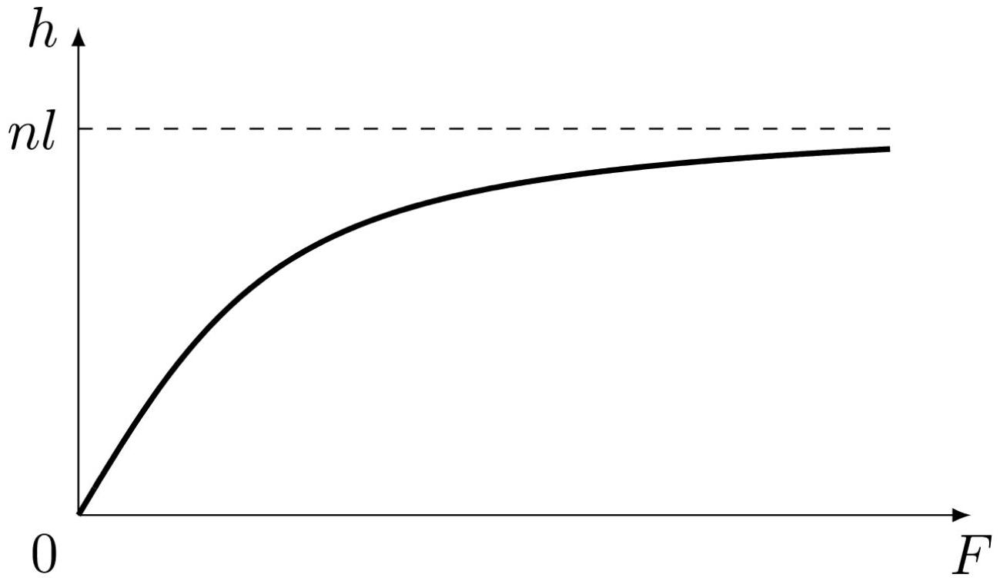
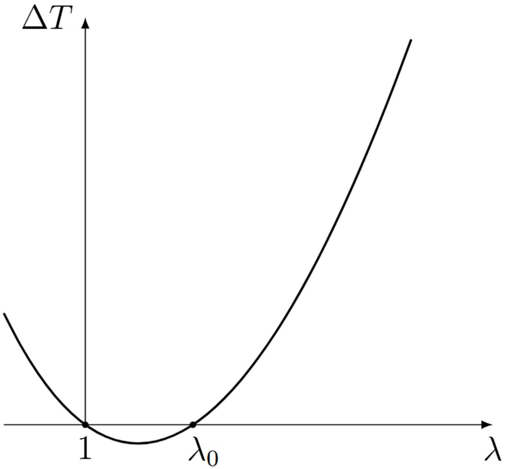

А1 ${ } ^ { 0.40 }$ Найдите число микроскопических состояний $\Gamma$, с помощью которых реализуется макроскопическое, в котором разность числа звеньев, ориентированных по и против оси $x$ равна $m = n _ { 1 } - n _ { 2 }$. Получите также приближённый ответ при $m \ll n$. Ответы выразите через $m$ и $n$.

При заданном $m$ число звеньев, ориентированных в положительном направлении $n _ { 1 } = \frac { n + m } { 2 }$, а в отрицательном $n _ { 2 } = \frac { n - m } { 2 }$. Тогда искомое число способов

Ответ:

$$
\Gamma = \frac { n ! } { \left( \frac { n + m } { 2 } \right) ! \left( \frac { n - m } { 2 } \right) ! } \approx 2 ^ { n } \sqrt { \frac { 2 } { \pi n } } \exp \left( - \frac { m ^ { 2 } } { 2 n } \right)
$$

А2 ${ } ^ { 0.80 }$ Покажите, что при $h _ { x } \ll n a$ энтропия молекулы имеет вид

$$
S = S _ { 0 } - \gamma h _ { x } ^ { 2 } .
$$

Выразите коэффициент $\gamma$ через $n$, $a$ и $k$.

Смещение конца молекулы $h _ { x } = \left( n _ { 1 } - n _ { 2 } \right) a = m a$. Тогда по формуле из предыдущего пункта получаем

$$
\Gamma = 2 ^ { n } \sqrt { \frac { 2 } { \pi n } } \exp \left( - \frac { h _ { x } ^ { 2 } } { 2 n a ^ { 2 } } \right) .
$$

Тогда из определения энтропии получаем

$$
S = k \ln \Gamma = k \ln \left( 2 ^ { n } \sqrt { \frac { 2 } { \pi n } } \right) - \frac { k h _ { x } ^ { 2 } } { 2 n a ^ { 2 } } .
$$

Ответ:

$$
\gamma = \frac { k } { 2 n a ^ { 2 } }
$$

А3 ${ } ^ { 0.60 }$ Вероятность того, что конец молекулы лежит в интервале $\left[ h _ { x } , h _ { x } + d h _ { x } \right]$ ширины $d h _ { x } \gg a$, равна $f \left( h _ { x } \right) d h _ { x }$. Покажите, что при $\left| h _ { x } \right| \ll n a$ плотность вероятности $f \left( h _ { x } \right)$ имеет вид

$$
f \left( h _ { x } \right) = A \exp \left( - \alpha h _ { x } ^ { 2 } \right)
$$

и выразите постоянные $A$ и $\alpha$ через $n$ и $a$. Считайте, что направления звеньев цепи независимы друг от друга и равновероятны.
Примечание: при повороте одного звена $h _ { x }$ меняется на $2 a$.

Общее число состояний цепи равно $2 ^ { n }$. Поскольку направления звеньев цепи равновероятны, вероятность данного состояния молекулы пропорциональна числу микроскопических состояний, которым оно может быть реализовано. Тогда вероятность того, что смещение конца молекулы принимает заданное значение $h _ { x }$ равна

$$
p \left( h _ { x } \right) = \frac { 1 } { 2 ^ { n } } \Gamma \left( h _ { x } \right) = \sqrt { \frac { 2 } { \pi n } } \exp \left( - \frac { h _ { x } ^ { 2 } } { 2 n a ^ { 2 } } \right) .
$$

При повороте одного звена значение $m$ меняется на 2 , поэтому смещение $h _ { x }$ меняется на $2 a$. Значит в некотором интервале ширины $d h _ { x } \gg a$ находится $d N = d h _ { x } / 2 a$ возможных состояний. При достаточно малом $d h _ { x }$ вероятности этих состояний практически одинаковы, а значит вероятность попадания в данный интервал равна

$$
d N \cdot p \left( h _ { x } \right) = \frac { d h _ { x } } { 2 a } \sqrt { \frac { 2 } { \pi n } } \exp \left( - \frac { h _ { x } ^ { 2 } } { 2 n a ^ { 2 } } \right) .
$$

Отсюда плотность вероятности

$$
f \left( h _ { x } \right) = \frac { 1 } { a \sqrt { 2 \pi n } } \exp \left( - \frac { h _ { x } ^ { 2 } } { 2 n a ^ { 2 } } \right) .
$$

С учетом выражение для гауссова интеграла

$$
\int _ { - \infty } ^ { + \infty } d x e ^ { - \beta x ^ { 2 } } = \sqrt { \frac { \pi } { \beta } }
$$

получаем

$$
\int _ { - \infty } ^ { + \infty } d h _ { x } f \left( h _ { x } \right) = \frac { 1 } { a \sqrt { 2 \pi n } } \sqrt { 2 \pi n a ^ { 2 } } = 1
$$

то есть распределение правильно нормировано.

Ответ:

$$
A = \frac { 1 } { a \sqrt { 2 \pi n } } , \quad \alpha = \frac { 1 } { 2 n a ^ { 2 } }
$$

В1 ${ } ^ { 0.50 }$ Чему равно $\left\langle h ^ { 2 } \right\rangle$ и $\left\langle h _ { x } ^ { 2 } \right\rangle$ для трёхмерной цепочки? Ответы выразите через $n$ и $l$.
Примечание: если Вы не смогли выполнить этот пункт, далее во всей задаче можете считать $\left\langle h _ { x } ^ { 2 } \right\rangle = n l ^ { 2 }$.

Вектор смещения конца вектора относительно начала равен сумме векторов $\vec { l } _ { i }$,

$$
\vec { h } = \sum _ { i } \vec { l } _ { i }
$$

поэтому его квадрат

$$
\vec { h } ^ { 2 } = \left( \sum _ { i } \vec { l } _ { i } \right) ^ { 2 } = \sum _ { i } \left( \vec { l } _ { i } \right) ^ { 2 } + 2 \sum _ { i < j } \vec { l } _ { i } \vec { l } _ { j } .
$$

Здесь в первой сумме суммирование производится по всем звеньям молекулы, а во второй - по всем парам звеньев. Каждое слагаемое первой суммы равно длине одного звена $l ^ { 2 }$, поэтому вся первая сумма равна $n l ^ { 2 }$. Усредним вторую сумму по различным состояниям молекулы. В силу независимости направлений различных звеньев каждое из произведений при усреднении дает $0 , \left\langle \vec { l } _ { i } \vec { l } _ { j } \right\rangle = 0$, поэтому и вся сумма при усреднении обращается в 0. Тогда для среднего квадрата получаем

$$
\left\langle h ^ { 2 } \right\rangle = n l ^ { 2 } .
$$

В силу равновероятности всех направлений

$$
\left\langle h _ { x } ^ { 2 } \right\rangle = \left\langle h _ { y } ^ { 2 } \right\rangle = \left\langle h _ { z } ^ { 2 } \right\rangle .
$$

Поскольку

$$
\left\langle h ^ { 2 } \right\rangle = \left\langle h _ { x } ^ { 2 } \right\rangle + \left\langle h _ { y } ^ { 2 } \right\rangle + \left\langle h _ { z } ^ { 2 } \right\rangle ,
$$

средний квадрат одной из проекций равен

$$
\left\langle h _ { x } ^ { 2 } \right\rangle = \frac { 1 } { 3 } \left\langle h ^ { 2 } \right\rangle = \frac { 1 } { 3 } n l ^ { 2 } .
$$

Ответ:

$$
\left\langle h ^ { 2 } \right\rangle = n l ^ { 2 } , \quad \left\langle h _ { x } ^ { 2 } \right\rangle = \frac { 1 } { 3 } n l ^ { 2 }
$$

В2 ${ } ^ { 1.00 }$ Чему равно среднее расстояние между концами цепочки $\langle h \rangle$ ? Ответ выразите через $n$ и $l$.

Дифференцируя значение гауссова интеграла

$$
\int _ { - \infty } ^ { + \infty } d x e ^ { - \beta x ^ { 2 } } = \sqrt { \frac { \pi } { \beta } }
$$

по параметру $\beta$ получим

$$
\int _ { - \infty } ^ { + \infty } d x x ^ { 2 } e ^ { - \beta x ^ { 2 } } = \frac { 1 } { 2 } \sqrt { \frac { \pi } { \beta ^ { 3 } } } , \quad \int _ { - \infty } ^ { + \infty } d x x ^ { 4 } e ^ { - \beta x ^ { 2 } } = \frac { 3 } { 4 } \sqrt { \frac { \pi } { \beta ^ { 5 } } }
$$

Из условия нормировки плотности вероятности

$$
\int d ^ { 3 } h f ( \vec { h } ) = 1 = A \int d ^ { 3 } h e ^ { - \beta h ^ { 2 } } = 4 \pi A \int _ { 0 } ^ { \infty } h ^ { 2 } d h e ^ { - \beta h ^ { 2 } } = \pi A \frac { \sqrt { \pi } } { \beta ^ { 3 / 2 } }
$$

находим коэффициент

$$
A = \left( \frac { \beta } { \pi } \right) ^ { 3 / 2 } .
$$

Обратим внимание, что при вычислении интеграла появился дополнительный множитель $1 / 2$, поскольку нижний предел равен 0 , а не $- \infty$.

Тогда для среднего квадрата получаем

$$
\left\langle h ^ { 2 } \right\rangle = \int d ^ { 3 } h h ^ { 2 } f ( \vec { h } ) = 4 \pi A \int _ { 0 } ^ { \infty } h ^ { 4 } d h e ^ { - \beta h ^ { 2 } } = \pi A \frac { 3 } { 2 } \frac { \sqrt { \pi } } { \beta ^ { 5 / 2 } } = \frac { 3 } { 2 \beta } .
$$

Используя выражение из предыдущего пункта, находим

$$
\frac { 3 } { 2 \beta } = n l ^ { 2 }
$$

откуда

$$
\beta = \frac { 3 } { 2 n l ^ { 2 } } .
$$

Вычислим средний модуль смещения

$$
\langle h \rangle = \int d ^ { 3 } h h f ( \vec { h } ) = 4 \pi A \int _ { 0 } ^ { \infty } h ^ { 3 } d h e ^ { - \beta h ^ { 2 } }
$$

Перейдем к переменной $\xi = h ^ { 2 }$ :

$$
\langle h \rangle = 2 \pi A \int _ { 0 } ^ { \infty } \xi d \xi e ^ { - \beta \xi } = 2 \pi A \left( - \left. \frac { 1 } { \beta } \xi e ^ { - \beta \xi } \right| _ { 0 } ^ { \infty } + \frac { 1 } { \beta } \int _ { 0 } ^ { \infty } d \xi e ^ { - \beta \xi } \right) = \frac { 2 \pi A } { \beta ^ { 2 } } = \frac { 2 } { \sqrt { \pi \beta } }
$$

Подставляя значение $\beta$, находим окончательно

Ответ:

$$
\langle h \rangle = \sqrt { \frac { 8 n } { 3 \pi } } l
$$

Тот же результат можно получить, используя аналогию с распределением Максвелла. Действительно, распределение вектора смещения второго вектора конца молекулы относительно первого отличается от распределения вектора скорости только значением параметра $\beta$. Для распределения Максвелла известны среднеквадратичное значение скорости

$$
\left\langle v ^ { 2 } \right\rangle = \frac { 3 k T } { m } ,
$$

а также значение среднего модуля скорости

$$
\langle v \rangle = \sqrt { \frac { 8 k T } { \pi m } } .
$$

Отсюда получаем безразмерное отношение

$$
\frac { \langle v \rangle ^ { 2 } } { \left\langle v ^ { 2 } \right\rangle } = \frac { 8 } { 3 \pi } .
$$

Оно не содержит параметров распределения, поэтому такое же соотношение должно выполняться и для $\vec { h }$ :

$$
\frac { \langle h \rangle ^ { 2 } } { \left\langle h ^ { 2 } \right\rangle } = \frac { 8 } { 3 \pi } ,
$$

откуда сразу же получаем приведенный выше ответ.

В3 ${ } ^ { 1.50 }$ Найдите величину среднего смещения второго конца молекулы $h$. Ответ выразите через $F , T , n , l$ и $k$. Получите точное выражение и приближённое при малых $F$.

Из симметрии средний вектор смещения конца молекулы будет направлен вдоль внешней силы, поэтому нужно найти только проекцию этого вектора на направление силы. Рассмотрим некоторое звено, пусть оно образует угол $\theta$ с направлением действия силы. Тогда его потенциальная энергия $U = - F l \cos \theta$, а значит вероятность того, что оно направлено в некоторый телесный угол $d \Omega = 2 \pi \sin \theta d \theta$ зависит только от $\theta$ и имеет вид

$$
B \exp \left( - \frac { U } { k T } \right) d \Omega = B \exp \left( \frac { F l } { k T } \cos \theta \right) d \Omega
$$

где коэффициент $B$ можно найти из нормировки. Для удобства вычислений введем безразмерную переменную $\xi = \frac { F l } { k T }$. Тогда

$$
B \int _ { 0 } ^ { \pi } e ^ { \xi \cos \theta } 2 \pi \sin \theta d \theta = 1
$$

Перейдем к переменной интегрирования $u = \cos \theta$, которая меняется от - 1 до 1 , получим

$$
2 \pi B \int _ { - 1 } ^ { 1 } e ^ { \xi u } d u = \frac { 2 \pi B } { \xi } \left( e ^ { \xi } - e ^ { i \xi } \right) = \frac { 4 \pi B } { \xi } \sinh \xi = 1 ,
$$

откуда

$$
B = \frac { 1 } { 4 \pi } \frac { \xi } { \sinh \xi } .
$$

Тогда средняя проекция звена на направление силы

$$
\langle l \cos \theta \rangle = B \int _ { 0 } ^ { \pi } l \cos \theta e ^ { \xi \cos \theta } 2 \pi \sin \theta d \theta = 2 \pi B l \int _ { - 1 } ^ { 1 } u d u e ^ { \xi u }
$$

$$
\begin{gathered}
\int _ { - 1 } ^ { 1 } u d u e ^ { \xi u } = \left. \frac { 1 } { \xi } u e ^ { \xi u } \right| _ { - 1 } ^ { 1 } - \frac { 1 } { \xi } \int _ { - 1 } ^ { 1 } d u e ^ { \xi u } = \frac { 1 } { \xi } \left( e ^ { \xi u } + e ^ { - \xi u } \right) - \frac { 1 } { \xi ^ { 2 } } \left( e ^ { \xi u } - e ^ { - \xi u } \right) \\
\langle l \cos \theta \rangle = \frac { l } { 2 } \frac { \xi } { \sinh \xi } 2 \left( \frac { \cosh \xi } { \xi } - \frac { \sinh \xi } { \xi ^ { 2 } } \right) = l \left( \operatorname { coth } \xi - \frac { 1 } { \xi } \right)
\end{gathered}
$$

Полное смещение конца молекул складывается из проекций отдельных звеньев:

$$
h = n \langle l \cos \theta \rangle = n l \left( \operatorname { coth } \frac { F l } { k T } - \frac { k T } { F l } \right) .
$$

В пределе малой силы получим разложение

$$
\operatorname { coth } \xi - \frac { 1 } { \xi } = \frac { e ^ { \xi } + e ^ { - \xi } } { e ^ { \xi } - e ^ { - \xi } } - \frac { 1 } { \xi } \approx \frac { 2 + \xi ^ { 2 } } { 2 \xi + \xi ^ { 3 } / 3 } - \frac { 1 } { \xi } = \frac { 1 } { \xi } \left( \frac { 1 + \xi ^ { 2 } / 2 } { 1 + \xi ^ { 2 } / 6 } - 1 \right) = \frac { 1 } { \xi } \frac { \xi ^ { 2 } } { 3 } = \frac { \xi } { 3 } .
$$

Тогда для смещения получим

$$
h \approx \frac { n l } { 3 } \frac { F l } { k T } = \frac { n l ^ { 2 } } { 3 k T } F .
$$

Заметим также, что в пределе большой силы, то есть $\xi \rightarrow \infty$ получаем $\operatorname { coth } \xi \rightarrow 1$ и

$$
h \approx n l \left( 1 - \frac { k T } { F l } \right) \approx n l ,
$$

то есть молекула практически полностью выпрямляется. Характерное значение силы, при котором происходит переход из области малых сил в область больших сил, отвечает $\xi \sim 1$, то есть $F \sim k T / l$.

Ответ:

$$
h = n l \left( \operatorname { coth } \frac { F l } { k T } - \frac { k T } { F l } \right) \approx \frac { n l ^ { 2 } } { 3 k T } F
$$

B4 ${ } ^ { 0.50 }$ Постройте график зависимости длины молекулы $h$ от приложенной силы. Укажите характерные значения.

Ответ:

С1 ${ } ^ { 0.70 }$ Чему равно изменение энтропии $\Delta S$ всей сетки в результате растяжения? Ответ выразите через $k , \lambda _ { x } , \lambda _ { y } , \lambda _ { z }$ и $N$. Примечание: если Вы не смогли сделать В1, то используйте $\left\langle h _ { x } ^ { 2 } \right\rangle = n l ^ { 2 }$.

Энтропия одной цепи в растянутом состоянии равна

$$
S _ { 1 } \left( \overrightarrow { h ^ { \prime } } \right) = S _ { 0 } - \frac { 3 k } { 2 n l ^ { 2 } } \left( \lambda _ { x } ^ { 2 } h _ { x } ^ { 2 } + \lambda _ { y } ^ { 2 } h _ { y } ^ { 2 } + \lambda _ { z } ^ { 2 } h _ { z } ^ { 2 } \right)
$$

Изменение энтропии одной цепочки в результате растяжения

$$
\Delta S _ { 1 } = S _ { 1 } \left( \overrightarrow { h ^ { \prime } } \right) - S _ { 1 } ( \vec { h } ) = - \frac { 3 k } { 2 n l ^ { 2 } } \left( \left( \lambda _ { x } ^ { 2 } - 1 \right) h _ { x } ^ { 2 } + \left( \lambda _ { y } ^ { 2 } - 1 \right) h _ { y } ^ { 2 } + \left( \lambda _ { z } ^ { 2 } - 1 \right) h _ { z } ^ { 2 } \right) .
$$

Изменение энтропии полимерной сетки выражается через усреднённое значение изменения энтропии одной цепочки:

$$
\Delta S = N \left\langle \Delta S _ { 1 } \right\rangle = - \frac { 3 k N } { 2 n l ^ { 2 } } \left( \left( \lambda _ { x } ^ { 2 } - 1 \right) \left\langle h _ { x } ^ { 2 } \right\rangle + \left( \lambda _ { y } ^ { 2 } - 1 \right) \left\langle h _ { y } ^ { 2 } \right\rangle + \left( \lambda _ { z } ^ { 2 } - 1 \right) \left\langle h _ { z } ^ { 2 } \right\rangle \right) .
$$

Пользуясь результатом пункта B, находим

Ответ:

$$
\Delta S = - \frac { k N } { 2 } \left( \lambda _ { x } ^ { 2 } + \lambda _ { y } ^ { 2 } + \lambda _ { z } ^ { 2 } - 3 \right)
$$

С2 ${ } ^ { 0.60 }$ Рассмотрим растяжение в случае, когда силы прикладываются вдоль одной из осей и растягивают образец вдоль этой оси в $\lambda$ раз, а напряжения вдоль других осей отсутствуют. Чему равно изменение энтропии образца? Ответ выразите через $k , \lambda$ и $N$.

Если силы прикладываются только вдоль оси $x$, то $\lambda _ { x } = \lambda$, а для других осей верно $\lambda _ { y } = \lambda _ { z }$. Поскольку объём стержня не меняется, то $\lambda _ { x } \lambda _ { y } \lambda _ { z } = 1$. Тогда $\lambda _ { y } = \lambda _ { z } = 1 / \sqrt { \lambda }$. Подставляя растяжения в формулу из С2, находим

Ответ:

$$
\Delta S = - \frac { k N } { 2 } \left( \lambda ^ { 2 } + \frac { 2 } { \lambda } - 3 \right)
$$

C3 ${ } ^ { \mathbf { 0 . 6 0 } }$ Пользуясь первым началом термодинамики для изотермического процесса и результатом пункта C2, покажите, что уравнение состояния резины (зависимость силы упругости от растяжения и температуры) имеет вид:

$$
F ( \lambda , T ) = \beta ( T ) \left( \lambda - \frac { 1 } { \lambda ^ { 2 } } \right) .
$$

Найдите $\beta$. Ответ выразите через $k , N , T$ и длину образца в нерастянутом состоянии $l _ { 0 }$.

Первое начало в общем виде записывается как

$$
d U = \delta Q + \delta A .
$$

Здесь подведенное тепло можно выразить через изменение энтропии: $\delta Q = T d S$. Под работой $\delta A$ при таком выборе знаков подразумевается работа, совершенная над образцом. Она в общем случае складывается из работы сил давления и работы внешних сил, растягивающих резину

$$
\delta A = F d l - p d V
$$

Тогда окончательно получаем

$$
T d S + F d l - P d V = d U ,
$$

где $P$ - внешнее давление, $d V$ - изменение объема стержня. Поскольку объём стержня не изменяется, внешнее давление не совершает работу. Так как внутренняя энергия зависит только от температуры, то в изотермическом процессе $d U = 0$. Тогда

$$
F = - T \left( \frac { \partial S } { \partial l } \right) _ { T } = - \frac { T } { l _ { 0 } } \left( \frac { \partial \Delta S } { \partial \lambda } \right) _ { T } = \frac { k N T } { l _ { 0 } } \left( \lambda - \frac { 1 } { \lambda ^ { 2 } } \right) .
$$

Ответ:

$$
\beta = \frac { k N T } { l _ { 0 } }
$$

С4 ${ } ^ { 0.80 }$ Покажите, что при малых деформациях справедлив закон Гука. Найдите модуль Юнга $E$ резины. Ответ выразите через $k , T$ и концентрацию $\nu$ полимерных цепей в образце. Рассчитайте численное значение модуля Юнга, если плотность резины $\rho = 1200 \mathrm { кг } / \mathrm { м } ^ { 3 }$, молярная масса $\mu = 10 ^ { 5 }$ г/ моль, температура $T = 300$ К.

Подставим в выражение для силы $\lambda = 1 + \varepsilon$ при $\varepsilon \ll 1$ :

$$
F = \frac { k N T } { l _ { 0 } } \left( 1 + \varepsilon - \frac { 1 } { ( 1 + \varepsilon ) ^ { 2 } } \right) \approx \frac { 3 k N T \varepsilon } { l _ { 0 } } .
$$

Таким образом, при малых деформациях сила прямо пропорциональна относительному удлинению, т.е. справедлив закон Гука. Модуль Юнга равен ( $S _ { 0 }$ - начальная площадь поперечного сечения)

$$
E = \frac { F } { S _ { 0 } \varepsilon } = \frac { 3 k N T } { l _ { 0 } S _ { 0 } } = \frac { 3 k N T } { V } = 3 k \nu T .
$$

Концентрацию полимерных цепей можно определить, зная плотность резины и молярную массу:

$$
\nu = \frac { \rho } { \mu } N _ { A } ,
$$

поскольку $\rho / \mu$ - число молей в единице объема. С учётом численных значений

$$
\nu = \frac { \Delta N } { \Delta V } = \frac { N _ { A } \Delta m / \mu } { \Delta V } = \frac { \rho N _ { A } } { \mu } = 7.2 \cdot 10 ^ { 24 } \mathrm {~m} ^ { - 3 } , E \approx 9 \cdot 10 ^ { 4 } \text { Па. }
$$

Ответ:

$$
E = 3 k \nu T \approx 9 \cdot 10 ^ { 4 } \text { Па }
$$

D1 ${ } ^ { 0.20 }$ Запишите выражение для $U _ { \text {терм } }$. Ответ выразите через теплоёмкость при постоянной длине $C _ { l }$ и $T$. Считайте, что $C _ { l }$ не зависит от температуры.

Ответ:

$$
U _ { \text {терм } } = C _ { l } T
$$

D2 ${ } ^ { 1.20 }$ Найдите выражение для $U _ { \text {мех } }$. Ответ выразите через $V , \varepsilon , T , E ( T )$ и $d E ( T ) / d T$.

Как следует из выражения для энтропии, при изотермическом растяжении энтропия стержня уменьшается. Значит, тепло подводится на изотерме с большей температурой, а цикл Карно совершается в прямом направлении. На изотерме с большей температурой стержень сжимается от $\varepsilon$ до нулевой деформации с постоянным модулем Юнга $E = E ( T + d T )$ и совершает положительную работу

$$
A _ { + } = \int _ { 0 } ^ { \varepsilon } E \varepsilon S _ { 0 } l _ { 0 } d \varepsilon = \frac { E \varepsilon ^ { 2 } V } { 2 }
$$

Изменение внутренней энергии на изотерме равно изменению энергии упругой деформации, поскольку $U _ { \text {терм } }$ зависит только от температуры:

$$
\Delta U _ { + } = U _ { \mathrm { mex } } ( 0 , T + d T ) - U _ { \mathrm { mex } } ( \varepsilon , T + d T ) = 0 - U _ { \mathrm { mex } } ( \varepsilon , T + d T ) = - U _ { \mathrm { mex } } .
$$

Тепло, полученное от нагревателя, равно

$$
Q _ { + } = A _ { + } + \Delta U _ { + } = \frac { E \varepsilon ^ { 2 } V } { 2 } - U _ { \mathrm { mex } } .
$$

По условию работой на адиабатах можно пренебречь. Тогда работа стержня за цикл равна

$$
d A = \frac { E ( T + d T ) \varepsilon ^ { 2 } V } { 2 } - \frac { E ( T ) \varepsilon ^ { 2 } V } { 2 } = \frac { \varepsilon ^ { 2 } V d E } { 2 } .
$$

КПД цикла Карно

$$
\eta = \frac { d T } { T } = \frac { d A } { Q _ { + } } .
$$

Отсюда находим

Ответ:

$$
U _ { \mathrm { Mex } } = \frac { \varepsilon ^ { 2 } V } { 2 } \left( E - T \frac { d E } { d T } \right)
$$

D3 ${ } ^ { \mathbf { 0 . 4 0 } }$ Пусть при температуре $T _ { 0 }$ модуль Юнга резины равен $E _ { 0 }$. Найдите модуль Юнга $E$ при температуре $T$ в модели «идеальной резины». Ответ выразите через $E _ { 0 } , T _ { 0 }$ и $T$.

В модели «идеальной резины» $U _ { \text {мех } } = 0$. С учётом D2 имеем

$$
E - T \frac { d E } { d T } = 0
$$

откуда

$$
\ln \frac { E } { E _ { 0 } } = \ln \frac { T } { T _ { 0 } } .
$$

Ответ:

$$
E = E _ { 0 } \frac { T } { T _ { 0 } }
$$

Е1 ${ } ^ { 0.80 }$ Получите выражение для $\Delta T$. Ответ выразите через $E _ { 0 } , S _ { 0 } , l _ { 0 } , C _ { l } , \alpha , T _ { 0 }$ и $\lambda$. Считайте, что $\Delta T = T - T _ { 0 } \ll T _ { 0 }$.

Продифференцируем уравнение состояния по температуре при постоянной длине:

$$
\begin{aligned}
\left( \frac { \partial F } { \partial T } \right) _ { l } = \frac { E _ { 0 } S _ { 0 } } { 3 T _ { 0 } } \left( \lambda - \frac { 1 + 3 \alpha \left( T - T _ { 0 } \right) } { \lambda ^ { 2 } } \right) - \frac { E _ { 0 } S _ { 0 } T } { 3 T _ { 0 } } \cdot \frac { 3 \alpha } { \lambda ^ { 2 } } = & \\
& = \frac { E _ { 0 } S _ { 0 } } { 3 T _ { 0 } } \left( \lambda - \frac { 1 + 3 \alpha \left( T - T _ { 0 } \right) + 3 \alpha T } { \lambda ^ { 2 } } \right) \approx \frac { E _ { 0 } S _ { 0 } } { 3 T _ { 0 } } \left( \lambda - \frac { 1 + 3 \alpha T _ { 0 } } { \lambda ^ { 2 } } \right) .
\end{aligned}
$$

В последнем переходе было использовано условие $\Delta T \ll T _ { 0 }$. Подставляя полученное выражение в соотношение для изменения температуры, находим

$$
\begin{aligned}
\Delta T = \frac { E _ { 0 } S _ { 0 } } { 3 C _ { l } } \int _ { 1 } ^ { \lambda } \left( \lambda - \frac { 1 + 3 \alpha T _ { 0 } } { \lambda ^ { 2 } } \right) l _ { 0 } d \lambda = & \\
& = \frac { E _ { 0 } S _ { 0 } l _ { 0 } } { 3 C _ { l } } \left( \frac { \lambda ^ { 2 } - 1 } { 2 } + \left( 1 + 3 \alpha T _ { 0 } \right) \left( \frac { 1 } { \lambda } - 1 \right) \right) = \frac { E _ { 0 } S _ { 0 } l _ { 0 } } { 3 C _ { l } } ( \lambda - 1 ) \left( \frac { \lambda + 1 } { 2 } - \frac { 1 + 3 \alpha T _ { 0 } } { \lambda } \right) .
\end{aligned}
$$

Ответ:

$$
\Delta T = \frac { E _ { 0 } S _ { 0 } l _ { 0 } } { 3 C _ { l } } ( \lambda - 1 ) \left( \frac { \lambda + 1 } { 2 } - \frac { 1 + 3 \alpha T _ { 0 } } { \lambda } \right) .
$$

E2 ${ } ^ { 0.50 }$ Постройте качественный график $\Delta T ( \lambda )$.

По полученной формуле построим качественный график $\Delta T ( \lambda )$.

Ответ:

E3 ${ } ^ { 0.50 }$ При каком растяжении $\lambda _ { 0 }$ наблюдается смена знака $\Delta T$ ? В качестве ответа приведите численное значение.

При $\lambda = \lambda _ { 0 }$ выражение в правых скобках обращается в нуль:

$$
\frac { \lambda + 1 } { 2 } - \frac { 1 + 3 \alpha T _ { 0 } } { \lambda } = 0 \Rightarrow \lambda ^ { 2 } + \lambda - 2 \left( 1 + 3 \alpha T _ { 0 } \right) = 0 .
$$

Положительным корнем данного уравнения является

$$
\lambda _ { 0 } = \frac { - 1 + \sqrt { 1 + 8 \left( 1 + 3 \alpha T _ { 0 } \right) } } { 2 } \approx 1 + 2 \alpha T _ { 0 } = 1.132 .
$$

Ответ:

$$
\lambda _ { 0 } \approx 1.132
$$

E4 ${ } ^ { 0.40 }$ Чему равно изменение температуры $\Delta T _ { 1,2 }$ образца при растяжении $\lambda _ { 1 } = 1.1$ и $\lambda _ { 2 } = 1.4$ ? Для расчётов используйте $l _ { 0 } = 1$ м и $C _ { l } = 150$ Дж/К.

По формуле из Е1 найдём изменения температур:

Ответ:

$$
\begin{aligned}
\Delta T _ { 1 } & = - 1.05 \cdot 10 ^ { - 3 } К \\
\Delta T _ { 2 } & = 3.00 \cdot 10 ^ { - 2 } К
\end{aligned}
$$
