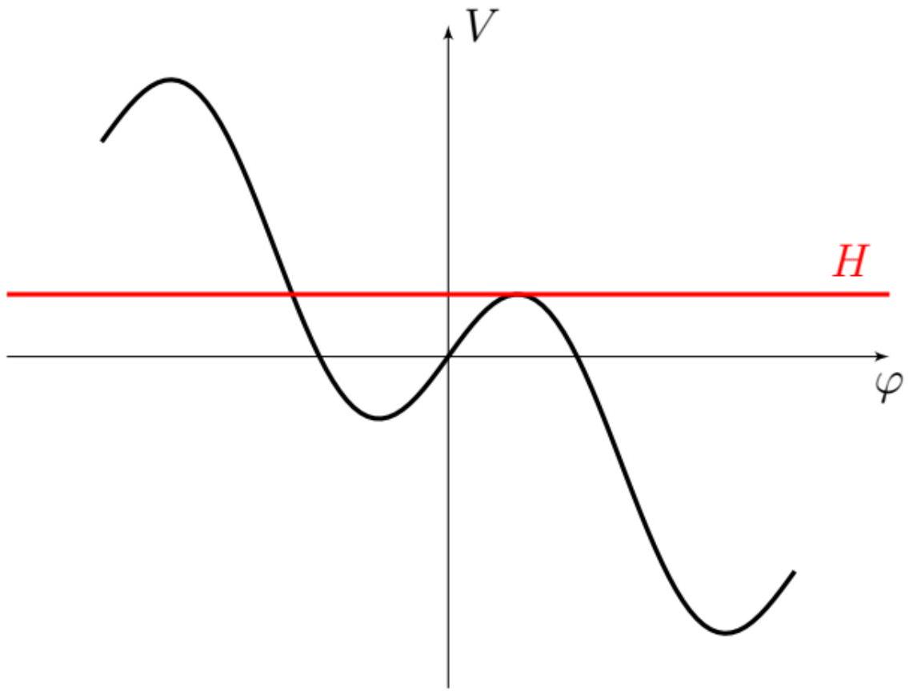
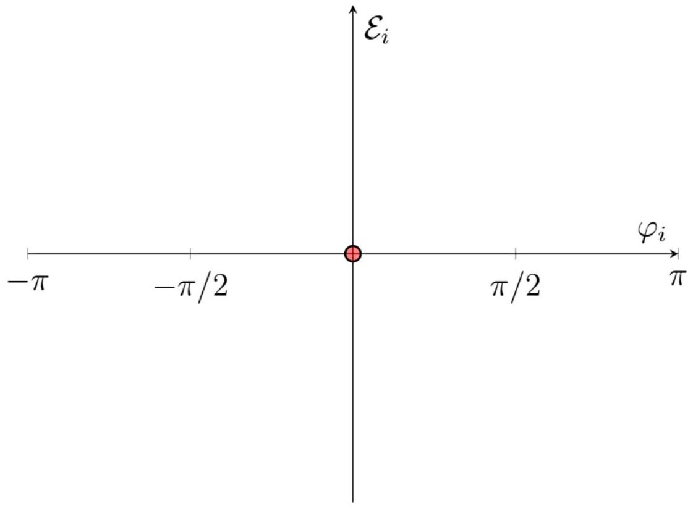
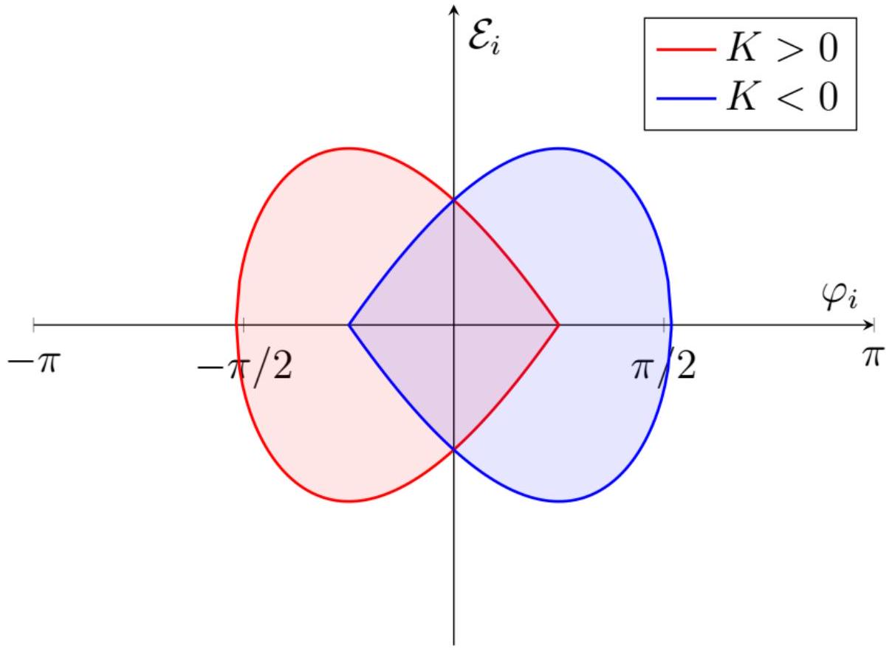

А1 ${ } ^ { 0.50 }$ Определите величину магнитного поля $B ( t )$ электромагнитов в момент, когда энергия электронов $E ( t )$. Выразите ответ через $E ( t ) , T$ и физические постоянные.

Запишем второй закон Ньютона:

$$
\begin{gathered}
e v B = p \frac { 2 \pi } { T } . \\
B = \frac { 2 \pi } { e T } \cdot \frac { p } { v } = \frac { 2 \pi } { e T } \cdot \gamma m = \frac { 2 \pi } { e T } \cdot \frac { E } { c ^ { 2 } }
\end{gathered}
$$

Ответ:

$$
B ( t ) = \frac { 2 \pi E ( t ) } { e T c ^ { 2 } }
$$

А2 ${ } ^ { 0.40 }$ Определите при каком соотношении на $T , U$ и $d B / d t$ существуют равновесные электроны.

Выразим энергию из результата прошлого пункта и продифференцируем с учётом того, что $T =$ const.

$$
\begin{gathered}
\frac { d E } { d t } = \frac { e T c ^ { 2 } } { 2 \pi } \cdot \frac { d B } { d t } = \frac { e U } { T } \cos \varphi \\
\cos \varphi = \frac { T ^ { 2 } c ^ { 2 } } { 2 \pi U } \cdot \frac { d B } { d t }
\end{gathered}
$$

Косинус не превышает 1 , что даёт условие на допустимые параметры синхротрона.

Ответ:

$$
\frac { T ^ { 2 } c ^ { 2 } } { 2 \pi U } \cdot \frac { d B } { d t } \leqslant 1
$$

А3 ${ } ^ { 0.50 }$ Найдите зависимость частоты $\omega _ { U } ( t )$ от времени. Ответ выразите через $B ( t ) , n , R$ и физические постоянные.

Второй закон Ньютона аналогичен прошлым пунктам:

$$
e v B = p \frac { 2 \pi } { T } = \frac { p \omega _ { U } } { n } .
$$

Выразим $p$ и $E$ :

$$
\begin{gathered}
p = e B \frac { v T } { 2 \pi } = e B R \\
E = \sqrt { \left( m _ { p } c ^ { 2 } \right) ^ { 2 } + ( p c ) ^ { 2 } } = \sqrt { \left( m _ { p } c ^ { 2 } \right) ^ { 2 } + ( c e B R ) ^ { 2 } }
\end{gathered}
$$

Связь $E$ и $B$ можно получить и аналогично прошлому пункту:

$$
\begin{gathered}
e B = \frac { p \omega _ { U } } { v n } = \frac { E \omega _ { U } } { c ^ { 2 } n } \\
\omega _ { U } ( t ) = \frac { n e c ^ { 2 } B } { E }
\end{gathered}
$$

Осталось только подставить значение энергии.

Ответ:

$$
\omega _ { U } ( t ) = \frac { n e c ^ { 2 } B ( t ) } { \sqrt { \left( m _ { p } c ^ { 2 } \right) ^ { 2 } + ( c e B ( t ) R ) ^ { 2 } } }
$$

В1 ${ } ^ { 0.50 }$ Получите значение $\alpha$ для случая слабой фокусировки.

Аналогично прошлому пункту выражение для импульса на круговой орбите радиусом $R$ :

$$
p ( R ) = e B ( R ) R = \text { const } \cdot R ^ { 1 - \xi } .
$$

Тогда связь на относительные изменения:

$$
\frac { d p } { p } = ( 1 - \xi ) \frac { d R } { R } = ( 1 - \xi ) \frac { d L } { L } .
$$

Ответ:

$$
\alpha = \frac { 1 } { 1 - \xi }
$$

В2 ${ } ^ { 1.50 }$ Выразите $K$ через $\gamma$ и $\alpha$.

Воспользуемся выражением для циклической частоты:

$$
\begin{gathered}
\omega = \frac { 2 \pi v } { L } \\
\frac { d \omega } { \omega } = \frac { d v } { v } - \frac { d L } { L } = \frac { d v } { v } - \alpha \frac { d p } { p } \\
K = \frac { E } { v } \frac { d v } { d E } - \alpha \frac { E } { p } \frac { d p } { d E }
\end{gathered}
$$

Найдём производные и подставим.

$$
\begin{gathered}
\frac { v d E } { E d v } = \frac { v d \frac { 1 } { \sqrt { 1 - v ^ { 2 } / c ^ { 2 } } } } { d v / \sqrt { 1 - v ^ { 2 } / c ^ { 2 } } } = - \frac { v } { \sqrt { 1 - v ^ { 2 } / c ^ { 2 } } } \cdot \frac { d \sqrt { 1 - v ^ { 2 } / c ^ { 2 } } } { d v } = \frac { v ^ { 2 } } { c ^ { 2 } - v ^ { 2 } } = \beta ^ { 2 } \gamma ^ { 2 } = \left( 1 - \frac { 1 } { \gamma ^ { 2 } } \right) \gamma ^ { 2 } = \gamma ^ { 2 } - 1 \\
\frac { p } { E } \frac { d E } { d p } = \frac { p } { \sqrt { ( m c ) ^ { 2 } + p ^ { 2 } } } \frac { d \sqrt { ( m c ) ^ { 2 } + p ^ { 2 } } } { d p } = \frac { p ^ { 2 } } { ( m c ) ^ { 2 } + p ^ { 2 } } = 1 - \frac { \left( m c ^ { 2 } \right) ^ { 2 } } { E ^ { 2 } } = 1 - \frac { 1 } { \gamma ^ { 2 } } = \frac { \gamma ^ { 2 } - 1 } { \gamma ^ { 2 } }
\end{gathered}
$$

Ответ:

$$
K = \frac { 1 - \alpha \gamma ^ { 2 } } { \gamma ^ { 2 } - 1 }
$$

B3 ${ } ^ { \mathbf { 0 . 5 0 } }$ Отметьте при какой фокусировке существует критическая энергия. Найдите $\gamma$ у частиц с критической энергией.

Для критической ситуации имеем:

$$
\gamma = \frac { 1 } { \sqrt { \alpha } } .
$$

$\gamma > 1$, поэтому для существования критической энергии необходимо $\alpha < 1$. Для слабой фокусировки это условие не выполнено.

Ответ: Критическая энергия существует только для сильной фокусировки.

$$
\gamma = \frac { 1 } { \sqrt { \alpha } }
$$

С1 ${ } ^ { 0.90 }$ Учитывая, что начальные энергии частиц отличаются слабо, выразите $\dot { \varphi }$ через $K , \mathcal { E } , n , \omega _ { 0 }$ и $E _ { 0 }$.

Рассмотрим изменяется фаза частицы в отличие от равновесной за один оборот:

$$
\Delta \varphi = \omega _ { U } \left( \frac { 2 \pi } { \omega } - \frac { 2 \pi } { \omega _ { 0 } } \right) .
$$

Поделим на время этого изменения, то есть период обращения частицы равный $2 \pi / \omega$.

$$
\dot { \varphi } = \omega _ { U } \left( 1 - \frac { \omega } { \omega _ { 0 } } \right) = n \left( \omega _ { 0 } - \omega \right)
$$

Воспользуемся определением $K$ и получим:

$$
\omega - \omega _ { 0 } = K \frac { \omega _ { 0 } } { E _ { 0 } } \mathcal { E }
$$

Ответ:

$$
\dot { \varphi } = - \frac { n K \omega _ { 0 } } { E _ { 0 } } \mathcal { E }
$$

C2 ${ } ^ { 0.30 }$ Выразите $\dot { \mathcal { E } }$ через $\varphi _ { 0 } , \varphi , U , \omega _ { 0 }$ и физические постоянные. Используйте тот факт, что отличие $\omega$ от $\omega _ { 0 }$ достаточно мало, чтобы им можно было пренебречь в данном случае.

Запишем производные $E$ и $E _ { 0 }$.

$$
\begin{gathered}
\dot { E } = \frac { \omega } { 2 \pi } e U \cos \varphi \approx \frac { \omega _ { 0 } } { 2 \pi } e U \cos \varphi \\
\dot { E } _ { 0 } = \frac { \omega _ { 0 } } { 2 \pi } e U \cos \varphi _ { 0 }
\end{gathered}
$$

Ответ:

$$
\dot { \mathcal { E } } = \frac { \omega _ { 0 } e U } { 2 \pi } \left( \cos \varphi - \cos \varphi _ { 0 } \right)
$$

C3 ${ } ^ { 0.60 }$ Получите выражение для $\ddot { \varphi }$ через $K , E _ { 0 } , \omega _ { 0 } , U , \varphi _ { 0 } , \varphi , n$ и физические постоянные. Определите, при каких $\varphi _ { 0 }$ равновесная орбита устойчива (то есть изначально бесконечно малые отклонения $\varphi$ не растут со временем).

Продифференцируем $\dot { \varphi }$ с учётом указанных приближений.

$$
\ddot { \varphi } = - \frac { n K \omega _ { 0 } } { E _ { 0 } } \dot { \mathcal { E } }
$$

Ответ:

$$
\ddot { \varphi } = - \frac { n K \omega _ { 0 } ^ { 2 } e U } { 2 \pi E _ { 0 } } \left( \cos \varphi - \cos \varphi _ { 0 } \right)
$$

Для устойчивости разложим до первого порядка:

$$
\ddot { \varphi } = \frac { n K \omega _ { 0 } ^ { 2 } e U } { 2 \pi E _ { 0 } } \sin \varphi _ { 0 } \left( \varphi - \varphi _ { 0 } \right) .
$$

Ответ: Устойчивость при $K \sin \varphi _ { 0 } < 0$

С4 ${ } ^ { 0.50 }$ Выразите $\dot { \varphi } ^ { 2 }$ через $K , E _ { 0 } , \omega _ { 0 } , U , \varphi _ { 0 } , \varphi , n , \varphi _ { i }$ и $\mathcal { E } _ { i }$ и физические постоянные.

Воспользуемся результатом прошлого пункта.

$$
\begin{gathered}
\ddot { \varphi } = \frac { d \dot { \varphi } } { d t } = \frac { d \dot { \varphi } } { d \varphi } \frac { d \varphi } { d t } = \frac { d \dot { \varphi } ^ { 2 } } { 2 d \varphi } \\
d \dot { \varphi } ^ { 2 } = - \frac { n K \omega _ { 0 } ^ { 2 } e U } { \pi E _ { 0 } } \left( \cos \varphi - \cos \varphi _ { 0 } \right) d \varphi \\
\dot { \varphi } ^ { 2 } + \frac { n K \omega _ { 0 } ^ { 2 } e U } { \pi E _ { 0 } } \left( \sin \varphi - \varphi \cos \varphi _ { 0 } \right) = \text { const }
\end{gathered}
$$

Осталось подставить начальные значения.

$$
\dot { \varphi } _ { i } = - \frac { n K \omega _ { 0 } } { E _ { 0 } } \mathcal { E } _ { i }
$$

Ответ:

$$
\dot { \varphi } ^ { 2 } = \left( \frac { n K \omega _ { 0 } } { E _ { 0 } } \mathcal { E } _ { i } \right) ^ { 2 } + \frac { n K \omega _ { 0 } ^ { 2 } e U } { \pi E _ { 0 } } \left( \sin \varphi _ { i } - \varphi _ { i } \cos \varphi _ { 0 } \right) - \frac { n K \omega _ { 0 } ^ { 2 } e U } { \pi E _ { 0 } } \left( \sin \varphi - \varphi \cos \varphi _ { 0 } \right)
$$

С5 ${ } ^ { 1.80 }$ Определите, при каких значениях $\varphi _ { i }$ и $\mathcal { E } _ { i }$ частица вовлекается в процесс ускорения, то есть в среднем она получает столько же энергии как и равновесная.

Качественно изобразите границы найденной области плоскости ( $\varphi _ { i } , \mathcal { E } _ { i }$ ) для $\varphi _ { 0 } = 0$ (резонансное ускорение) и $\varphi = \pi / 4$.

Воспользуемся результатом прошлого пункта:

$$
\dot { \varphi } ^ { 2 } + \frac { n K \omega _ { 0 } ^ { 2 } e U } { \pi E _ { 0 } } \left( \sin \varphi - \varphi \cos \varphi _ { 0 } \right) = \operatorname { const } = \left( \frac { n K \omega _ { 0 } } { E _ { 0 } } \mathcal { E } _ { i } \right) ^ { 2 } + \frac { n K \omega _ { 0 } ^ { 2 } e U } { \pi E _ { 0 } } \left( \sin \varphi _ { i } - \varphi _ { i } \cos \varphi _ { 0 } \right) .
$$

Заметим, что вовлечение в ускорение равносильно ограниченности движения $\varphi$.

$$
\dot { \varphi } ^ { 2 } + V ( \varphi ) = \text { const } = H
$$

Получили задачу исследования движения в некотором "потенциале" $V$ с "энергией" $H$.
Рассмотрим случай $K > 0$. Построим качественный вид $V$ для этого случая.

Красным указан максимальный уровень "энергии", при котором движение финитно (происходит в ограниченной области). При большей "энергии" $\varphi$ может расти неограниченно (движение вправо на графике).
Найдём это значение $H$. Оно определяется значением максимума $V$.

$$
\frac { d V } { d \varphi } = \frac { n K \omega _ { 0 } ^ { 2 } e U } { \pi E _ { 0 } } \left( \cos \varphi - \cos \varphi _ { 0 } \right)
$$

Максимум соответствует $\varphi = \left| \varphi _ { 0 } \right|$.

$$
H = \frac { n K \omega _ { 0 } ^ { 2 } e U } { \pi E _ { 0 } } \left( \sin \left| \varphi _ { 0 } \right| - \left| \varphi _ { 0 } \right| \cos \varphi _ { 0 } \right)
$$

Тогда условие на $\varphi _ { i }$ и $\mathcal { E } _ { i }$ имеет вид:

$$
\left( \frac { n K \omega _ { 0 } } { E _ { 0 } } \mathcal { E } _ { i } \right) ^ { 2 } + \frac { n K \omega _ { 0 } ^ { 2 } e U } { \pi E _ { 0 } } \left( \sin \varphi _ { i } - \varphi _ { i } \cos \varphi _ { 0 } \right) \leqslant \frac { n K \omega _ { 0 } ^ { 2 } e U } { \pi E _ { 0 } } \left( \sin \left| \varphi _ { 0 } \right| - \left| \varphi _ { 0 } \right| \cos \varphi _ { 0 } \right) .
$$

Стоит отметить, что при этом существует дополнительное условие на $\varphi _ { i }$. Изначально частица должна находится в "потенциальной яме", что соответствует $\varphi _ { i } \leqslant \left| \varphi _ { 0 } \right|$.
Заметим, что при $K < 0$ ситуация аналогичная, но теперь потенциал имеет максимум при $\varphi = - \left| \varphi _ { 0 } \right|$. Тогда максимальная "энергия":

$$
H = \frac { n K \omega _ { 0 } ^ { 2 } e U } { \pi E _ { 0 } } \left( - \sin \left| \varphi _ { 0 } \right| + \left| \varphi _ { 0 } \right| \cos \varphi _ { 0 } \right) .
$$

И аналогичное ограничение на фазу $\varphi _ { i } \geqslant - \left| \varphi _ { 0 } \right|$.
Заметим, что можно обобщить на произвольный знак $K$ :

$$
\begin{gathered}
H = \frac { n | K | \omega _ { 0 } ^ { 2 } e U } { \pi E _ { 0 } } \left( \sin \left| \varphi _ { 0 } \right| - \left| \varphi _ { 0 } \right| \cos \varphi _ { 0 } \right) . \\
\frac { K } { | K | } \varphi _ { i } \leqslant \left| \varphi _ { 0 } \right|
\end{gathered}
$$

Итоговое выражение для искомой области:

Ответ:

$$
\begin{gathered}
\left( \frac { n K \omega _ { 0 } } { E _ { 0 } } \mathcal { E } _ { i } \right) ^ { 2 } + \frac { n K \omega _ { 0 } ^ { 2 } e U } { \pi E _ { 0 } } \left( \sin \varphi _ { i } - \varphi _ { i } \cos \varphi _ { 0 } \right) \leqslant \frac { n | K | \omega _ { 0 } ^ { 2 } e U } { \pi E _ { 0 } } \left( \sin \left| \varphi _ { 0 } \right| - \left| \varphi _ { 0 } \right| \cos \varphi _ { 0 } \right) \\
\frac { K } { | K | } \varphi _ { i } \leqslant \left| \varphi _ { 0 } \right|
\end{gathered}
$$

Граница области:

$$
\begin{gathered}
\left( \frac { n K \omega _ { 0 } } { E _ { 0 } } \mathcal { E } _ { i } \right) ^ { 2 } + \frac { n K \omega _ { 0 } ^ { 2 } e U } { \pi E _ { 0 } } \left( \sin \varphi _ { i } - \varphi _ { i } \cos \varphi _ { 0 } \right) = \frac { n | K | \omega _ { 0 } ^ { 2 } e U } { \pi E _ { 0 } } \left( \sin \left| \varphi _ { 0 } \right| - \left| \varphi _ { 0 } \right| \cos \varphi _ { 0 } \right) \\
\frac { K } { | K | } \varphi _ { i } \leqslant \left| \varphi _ { 0 } \right| .
\end{gathered}
$$

Случай $\varphi _ { 0 } = 0$

$$
\left( \frac { n K \omega _ { 0 } } { E _ { 0 } } \mathcal { E } _ { i } \right) ^ { 2 } + \frac { n K \omega _ { 0 } ^ { 2 } e U } { \pi E _ { 0 } } \left( \sin \varphi _ { i } - \varphi _ { i } \right) = 0 ;
$$

$$
K \varphi _ { i } \leqslant 0 .
$$

Несложно заметить, что при $\varphi _ { i } \neq 0$ :

$$
K \left( \sin \varphi _ { i } - \varphi _ { i } \right) = - K \varphi _ { i } \left( 1 - \frac { \sin \varphi _ { i } } { \varphi _ { i } } \right) .
$$

При этом $1 - \frac { \sin \varphi _ { i } } { \varphi _ { i } } > 0$, поэтому:

$$
K \left( \sin \varphi _ { i } - \varphi _ { i } \right) = - K \varphi _ { i } \left( 1 - \frac { \sin \varphi _ { i } } { \varphi _ { i } } \right) > 0 .
$$

Подставим в первое неравенство и получим:

$$
\left( \frac { n K \omega _ { 0 } } { E _ { 0 } } \mathcal { E } _ { i } \right) ^ { 2 } < 0 .
$$

Таким образом, единственная точка, удовлетворяющая условиям ( $\varphi _ { i } , \mathcal { E } _ { i }$ ) $= ( 0,0 )$.
Стоить отметить, что данный факт очевиден из рассмотрения энергетической аналогии. При $\varphi _ { 0 } = 0$ у потенциала нет минимума, есть только точка перегиба в нуле, поэтому единственный случай ограниченного движения - равновесие в нуле.

Ответ:

Случай $\varphi _ { 0 } = \pi / 4$

$$
\begin{gathered}
\left( \frac { n K \omega _ { 0 } } { E _ { 0 } } \mathcal { E } _ { i } \right) ^ { 2 } + \frac { n K \omega _ { 0 } ^ { 2 } e U } { \pi E _ { 0 } } \left( \sin \varphi _ { i } - \frac { \varphi _ { i } } { \sqrt { 2 } } \right) = \frac { n | K | \omega _ { 0 } ^ { 2 } e U } { \pi E _ { 0 } } \left( \frac { 1 } { \sqrt { 2 } } - \frac { \pi } { 4 \sqrt { 2 } } \right) \\
\frac { K } { | K | } \varphi _ { i } \leqslant \frac { \pi } { 4 }
\end{gathered}
$$

Получили два случая в зависимости от знака $K$ :

Ответ:

