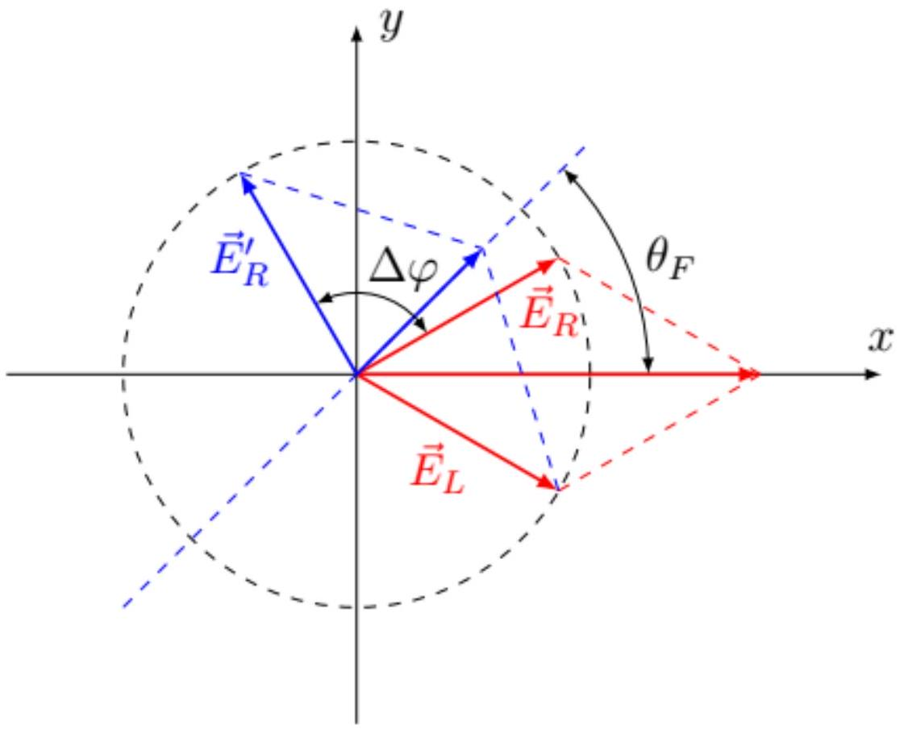

А1 ${ } ^ { 0.30 }$ Покажите, что зависимость проводимости от частоты в рассматриваемой модели имеет вид

$$
\sigma = \frac { D } { - i \omega + \frac { 1 } { \tau } }
$$

Выразите коэффициент $D$ через $n , q , m$.

Уравнение движения электрона имеет вид

$$
m \dot { \vec { v } } = - \frac { m } { \tau } \vec { v } - q \vec { E }
$$

Подставляя решение в виде экспонент, получим

$$
m \vec { v } _ { 0 } \left( - i \omega + \frac { 1 } { \tau } \right) = - q \vec { E } _ { 0 }
$$

откуда

$$
\overrightarrow { v _ { 0 } } = \frac { - q \vec { E } _ { 0 } / m } { - i \omega + 1 / \tau } .
$$

Тогда плотность тока

$$
\vec { j } = - q n \vec { v } = \frac { n q ^ { 2 } / m } { - i \omega + 1 / \tau } \vec { E } ,
$$

а проводимость

$$
\sigma = \frac { n q ^ { 2 } / m } { - i \omega + 1 / \tau } .
$$

Ответ:

$$
D = \frac { n q ^ { 2 } } { m }
$$

А2 ${ } ^ { 0.50 }$ Пусть теперь система помещена в магнитное поле $B$, направленное вдоль оси $z$. Комплексная амплитуда электрического поля $\vec { E } _ { 0 }$ лежит в плоскости $x y$, ее проекции $E _ { 0 x } , E _ { 0 y }$. Запишите уравнения для определения компонент установившейся скорости движения электронов $v _ { 0 x } , v _ { 0 y }$.

Уравнения движения с учетом магнитного поля имеют вид

$$
m \dot { \vec { v } } = - \frac { m } { \tau } \vec { v } - q ( \vec { E } + \vec { v } \times \vec { B } )
$$

Подставляя решение в экспоненциальном виде и расписывая векторное произведение через компоненты, получаем

Ответ:

$$
\begin{aligned}
m v _ { 0 x } \left( - i \omega + \frac { 1 } { \tau } \right) & = - q \left( E _ { 0 x } + v _ { 0 y } B \right) \\
m v _ { 0 y } \left( - i \omega + \frac { 1 } { \tau } \right) & = - q \left( E _ { 0 y } - v _ { 0 x } B \right)
\end{aligned}
$$

А3 ${ } ^ { 1.20 }$ Покажите, что проводимости в магнитном поле удовлетворяют соотношениям $\sigma _ { x x } = \sigma _ { y y } , \sigma _ { x y } = - \sigma _ { y x }$. Выразите $\sigma _ { x x }$ и $\sigma _ { x y }$ через $\omega , D$, $\tau$ и частоту движения электронов в магнитном поле $\omega _ { B } = q B / m$.

Перенесем слагаемые со скоростью в левую часть, разделим уравнения на массу и введем вместо магнитного поля частоту $\omega _ { B }$ :

$$
\begin{aligned}
\left( - i \omega + \frac { 1 } { \tau } \right) v _ { 0 x } + \omega _ { B } v _ { 0 y } & = - \frac { q } { m } E _ { 0 x } \\
- \omega _ { B } v _ { 0 x } + \left( - i \omega + \frac { 1 } { \tau } \right) v _ { 0 y } & = - \frac { q } { m } E _ { 0 y }
\end{aligned}
$$

Домножим первое уравнение на $( - i \omega + 1 / \tau )$, второе на $- \omega _ { B }$ и сложим, получим

$$
\left( ( - i \omega + 1 / \tau ) ^ { 2 } + \omega _ { B } ^ { 2 } \right) v _ { 0 x } = - \frac { q } { m } \left( ( - i \omega + 1 / \tau ) E _ { 0 x } - \omega _ { B } E _ { 0 y } \right) .
$$

Аналогично первое уравнение домножим на $\omega _ { B }$, второе на $( - i \omega + 1 / \tau )$ :

$$
\left( ( - i \omega + 1 / \tau ) ^ { 2 } + \omega _ { B } ^ { 2 } \right) v _ { 0 y } = - \frac { q } { m } \left( \omega _ { B } E _ { 0 x } + ( - i \omega + 1 / \tau ) E _ { 0 y } \right) .
$$

Используя связь плотности тока и скорости $\vec { j } = - q n \vec { v }$, найдем (экспоненциальные множители одинаковы, поэтому для токов выполняются такие же соотношения, как и для амплитуд)

$$
j _ { x } = \frac { n q ^ { 2 } } { m } \frac { ( - i \omega + 1 / \tau ) E _ { x } - \omega _ { B } E _ { y } } { ( - i \omega + 1 / \tau ) ^ { 2 } + \omega _ { B } ^ { 2 } } , \quad j _ { y } = \frac { n q ^ { 2 } } { m } \frac { \omega _ { B } E _ { x } + ( - i \omega + 1 / \tau ) E _ { y } } { ( - i \omega + 1 / \tau ) ^ { 2 } + \omega _ { B } ^ { 2 } } .
$$

Заметим, что при нулевом магнитном поле $\omega _ { B } = 0$ и получается соотношение из предыдущего пункта. Вид этих выражений совпадает с указанным в условии, из него можно получить выражения для проводимостей, равенства $\sigma _ { x x } = \sigma _ { y y }$ и $\sigma _ { x y } = - \sigma _ { y x }$ следуют непосредственно из этих выражений.

Ответ:

$$
\begin{gathered}
\sigma _ { x x } = \sigma _ { y y } = \frac { D ( - i \omega + 1 / \tau ) } { ( - i \omega + 1 / \tau ) ^ { 2 } + \omega _ { B } ^ { 2 } } , \\
\sigma _ { x y } = - \sigma _ { y x } = - \frac { D \omega _ { B } } { ( - i \omega + 1 / \tau ) ^ { 2 } + \omega _ { B } ^ { 2 } }
\end{gathered}
$$

В1 ${ } ^ { \mathbf { 0 . 3 0 } }$ Найдите отношение комплексных амплитуд полей $E _ { 0 y } / E _ { 0 x }$ для правой и левой круговой поляризации.

Поле с правой круговой поляризацией вращается в плоскости $x y$ против часовой стрелки, в вещественном виде зависимость имеет вид

$$
E _ { x } = A \cos \omega t , \quad E _ { y } = A \sin \omega t .
$$

Переходя к комплексной записи, получим

$$
E _ { x } = \operatorname { Re } \left( A e ^ { - i \omega t } \right) , \quad E _ { y } = \operatorname { Re } \left( i A e ^ { - i \omega t } \right) .
$$

Поэтому для правой поляризации $E _ { 0 y } / E _ { 0 x } = i$. Для левой поляризации обратного направления вращения можно добиться, изменив знак $E _ { y }$.

Ответ: Правая поляризация: $E _ { 0 y } / E _ { 0 x } = i$, левая поляризация: $E _ { 0 y } / E _ { 0 x } = - i$

В2 ${ } ^ { 0.50 }$ Покажите, что для круговых поляризаций выполняются соотношения $\vec { j } = \sigma _ { \pm } \vec { E }$ и найдите соответствующие значения проводимости $\sigma _ { \pm }$. Выразите ответ через проводимости $\sigma _ { x x }$ и $\sigma _ { x y }$.

Сначала подставим в формулу для плотности тока поле с правой поляризацией, то есть $E _ { 0 x } = A , E _ { 0 y } = i A$ :

$$
j _ { 0 x } = \sigma _ { x x } A + i \sigma _ { x y } A , \quad j _ { 0 y } = - \sigma _ { x y } A + i \sigma _ { x x } A .
$$

Здесь во втором равенстве использовано соотношение между проводимостями. Отсюда получаем $j _ { 0 y } = i j _ { 0 x }$, а значит

$$
\vec { j } = \left( \sigma _ { x x } + i \sigma _ { x y } \right) \vec { E } , \quad \sigma _ { + } = \sigma _ { x x } + i \sigma _ { x y } .
$$

Аналогичное вычисление для левой поляризации отличается только знаком перед $\sigma _ { x y }$.

Ответ:

$$
\sigma _ { + } = \sigma _ { x x } + i \sigma _ { x y } , \quad \sigma _ { - } = \sigma _ { x x } - i \sigma _ { x y }
$$

Вз ${ } ^ { 0.40 }$ Для среды с соотношением $\vec { j } = \sigma ( \omega ) \vec { E }$ определите диэлектрическую проницаемость $\varepsilon ( \omega )$ и отвечающей ей показатель преломления $n$, выразите ответ через $\sigma , \omega$ и фундаментальные постоянные.

Вектор электрической индукции выражается через электрическое поле и вектор поляризации соотношениями

$$
\vec { D } = \varepsilon _ { 0 } \varepsilon \vec { E } = \varepsilon _ { 0 } \vec { E } + \vec { P }
$$

Отсюда

$$
\vec { P } = \varepsilon _ { 0 } ( \varepsilon - 1 ) \vec { E } .
$$

Выразим плотность тока через производную вектора поляризации и сравним с выражением через проводимость

$$
\vec { j } = - i \omega \varepsilon _ { 0 } ( \varepsilon - 1 ) \vec { E } = \sigma \vec { E } .
$$

Отсюда получаем

Ответ:

$$
\varepsilon = 1 + \frac { i \sigma } { \varepsilon _ { 0 } \omega } , \quad n = \sqrt { \varepsilon } = \sqrt { 1 + \frac { i \sigma } { \varepsilon _ { 0 } \omega } }
$$

В4 ${ } ^ { 0.50 }$ Считая, что показатели преломления близки к 1 , найдите разность показателей преломления для волн с правой и левой поляризацией $\Delta n = n _ { + } - n _ { - }$. Выразите ответ через $\omega , \sigma _ { x x } , \sigma _ { x y }$ и фундаментальные постоянные.

Поскольку показатель преломления близок к 1, выражение из предыдущего пункта можно разложить до первого порядка, для круговых поляризаций получим

$$
n _ { \pm } = 1 + \frac { i \sigma _ { \pm } } { 2 \varepsilon _ { 0 } \omega } = 1 + \frac { i \left( \sigma _ { x x } \pm i \sigma _ { x y } \right) } { 2 \varepsilon _ { 0 } \omega } .
$$

Вычисляя разность, находим

$$
\Delta n = \frac { i \left( \sigma _ { x x } + i \sigma _ { x y } \right) } { 2 \varepsilon _ { 0 } \omega } - \frac { i \left( \sigma _ { x x } - i \sigma _ { x y } \right) } { 2 \varepsilon _ { 0 } \omega } = - \frac { \sigma _ { x y } } { \varepsilon _ { 0 } \omega } .
$$

Обратим внимание, что проводимость $\sigma _ { x x }$ в первом порядке сокращается.

Ответ:

$$
\Delta n = - \frac { \sigma _ { x y } } { \varepsilon _ { 0 } \omega } .
$$

В5 ${ } ^ { 0.80 }$ Пусть на слой среды толщины $h$ падает плоская монохроматическая волна с линейной поляризацией. Границы среды перпендикулярны оси $z$, волна распространяется вдоль оси $z$. Покажите, что после прохождения среды направление поляризации поворачивается на угол $\theta _ { F }$. Выразите этот угол через $h , \sigma _ { x y }$ и фундаментальные постоянные.

Не ограничивая общности можно считать, что изначально волна поляризована вдоль оси $x$, амплитуда волны $A$. Представим ее в виде суперпозиции двух волн с круговыми поляризациями, будем записывать вектора комплексных амплитуд в виде столбцов:

$$
\vec { E } _ { 0 } = \binom { A } { 0 } = \frac { A } { 2 } \binom { 1 } { i } + \frac { A } { 2 } \binom { 1 } { - i } .
$$

После прохождения через среду разные круговые поляризации приобретут разные фазы, амплитуда поля после прохождения через среду

$$
\vec { E } _ { 1 } = \frac { A } { 2 } \binom { 1 } { i } e ^ { i k n _ { + } h } + \frac { A } { 2 } \binom { 1 } { - i } e ^ { i k n _ { - } h } .
$$

Здесь $k$ - волновое число в вакууме. Вынося общую фазу $\Delta \varphi _ { 0 } = k h \left( n _ { + } + n _ { - } \right) / 2$, получим

$$
\vec { E } _ { 1 } = e ^ { i \Delta \varphi _ { 0 } } \frac { A } { 2 } \binom { e ^ { i k \Delta n h / 2 } + e ^ { - i k \Delta n h / 2 } } { i \left( e ^ { i k \Delta n h / 2 } - e ^ { - i k \Delta n h / 2 } \right) } = A e ^ { i \Delta \varphi _ { 0 } } \binom { \cos \frac { k h \Delta n } { 2 } } { - \sin \frac { k h \Delta n } { 2 } } .
$$

Получили выражение для линейной поляризации, повернутой на угол

$$
\theta _ { F } = - \frac { k \Delta n h } { 2 } .
$$

Знак - означает, что поворот происходит по часовой стрелке. Подставляя выражение для разности показателей преломления и используя соотношение для частоты и волнового числа в вакууме $\omega = c k$, получим

$$
\theta _ { F } = \frac { k h \sigma _ { x y } } { 2 \varepsilon _ { 0 } \omega } = \frac { \sigma _ { x y } h } { 2 \varepsilon _ { 0 } c } .
$$

Ответ:

$$
\theta _ { F } = \frac { \sigma _ { x y } h } { 2 \varepsilon _ { 0 } c }
$$

Этот же результат для угла поворота можно получить с помощью векторных диаграмм. Волну с линейной поляризацией можно представить как суперпозицию двух волн с круговыми поляризациями и равными амплитудами. Эти волны можно представить как пару векторов в плоскости $x y$ вращающихся против и по часовой стрелки соответственно. При этом колебания в волне с линейной поляризацией происходят вдоль биссектрисы угла между двумя векторами круговых поляризаций, изначально это ось $x$. После прохождения через среду между волнами с круговыми поляризациями возникает дополнительная разность фаз $\Delta \varphi$. Это означает, что при том же положении вектора волны с левой поляризации, вектор волны с правой поляризацией повернется на $\Delta \varphi = - k h \Delta n$. Знак - связан с тем, что колебание имеет вид

$$
\operatorname { Re } e ^ { - i \omega t + i k h \Delta n } = \cos ( \omega t - \Delta \varphi ) .
$$

Результирующее колебание все еще представляет собой сумму двух волн с круговыми поляризациями и равными амплитудами, но биссектриса между их векторами повернута на угол $\theta _ { F } = \Delta \varphi / 2$, что совпадает с найденным ранее ответом.

В6 ${ } ^ { 0.50 }$ Используя результат пункта A3, получите вещественное выражение для угла поворота плоскости поляризации $\theta _ { F }$. Оставьте от полученного выше выражения вещественную часть. Ответ выразите через $D , h , \tau , \omega _ { B } , \omega$ и фундаментальные постоянные.

Подставим выражение для проводимости:

$$
\theta _ { F } = - \frac { D \omega _ { B } h } { 2 \varepsilon _ { 0 } c } \frac { 1 } { ( - i \omega + 1 / \tau ) ^ { 2 } + \omega _ { B } ^ { 2 } } .
$$

За поворот плоскости поляризации отвечает вещественная часть этого выражения, чтобы выделить ее, раскроем скобки в знаменателе и домножим числитель и знаменатель на сопряженные выражения:

$$
\frac { 1 } { ( - i \omega + 1 / \tau ) ^ { 2 } + \omega _ { B } ^ { 2 } } = \frac { 1 } { \omega _ { B } ^ { 2 } + 1 / \tau ^ { 2 } - \omega ^ { 2 } - 2 i \omega / \tau } = \frac { \omega _ { B } ^ { 2 } + 1 / \tau ^ { 2 } - \omega ^ { 2 } + 2 i \omega / \tau } { \left( \omega _ { B } ^ { 2 } + 1 / \tau ^ { 2 } - \omega ^ { 2 } \right) ^ { 2 } + 4 \omega ^ { 2 } / \tau ^ { 2 } } .
$$

Взяв вещественную часть, получим

Ответ:

$$
\theta _ { F } = - \frac { D \omega _ { B } h } { 2 \varepsilon _ { 0 } c } \frac { \omega _ { B } ^ { 2 } + 1 / \tau ^ { 2 } - \omega ^ { 2 } } { \left( \omega _ { B } ^ { 2 } + 1 / \tau ^ { 2 } - \omega ^ { 2 } \right) ^ { 2 } + 4 \omega ^ { 2 } / \tau ^ { 2 } } .
$$

В7 ${ } ^ { 1.50 }$ В общем случае показатели преломления для обеих круговых поляризаций будут содержать различные мнимые части, что приведет в общем случае к эллиптической поляризации. Пусть параметры системы таковы, что $k n _ { + } h = 0.73 + 0.18 i , k n _ { - } h = 1.17 + 0.35 i$, где отброшены несущественные слагаемые, кратные $2 \pi$. Здесь $k$ - волновое число в вакууме. Поляризация падающей волны направлена вдоль оси $x$. Найдите отношение полуосей $a / b$ и угол $\psi$ между большой полуосью и осью $x$ для эллипса конечной поляризации.

Как и в предыдущей части разность вещественных частей произведений $k h \left( n _ { + } - n _ { - } \right)$приводит к изменению направления поляризации, причем угол поворота

$$
\psi _ { 1 } = - \frac { k h } { 2 } \operatorname { Re } \Delta n = 0.22 \text { рад } \approx 12.6 ^ { \circ } .
$$

Выберем направление новой оси $x ^ { \prime }$ вдоль повернутого направления поляризации, а $y ^ { \prime }$ перпендикулярно ей. Разность мнимых компонент приведет к изменению амплитуд круговых поляризаций, поэтому в повернутых осях комплексная амплитуда имеет вид (несущественную общую фазу не учитываем)

$$
\vec { E } _ { 1 } = \frac { A } { 2 } \binom { 1 } { i } e ^ { - \gamma _ { 1 } } + \frac { A } { 2 } \binom { 1 } { - i } e ^ { - \gamma _ { 2 } } = \frac { A } { 2 } \binom { e ^ { - \gamma _ { 1 } } + e ^ { - \gamma _ { 2 } } } { i \left( e ^ { - \gamma _ { 1 } } - e ^ { - \gamma _ { 2 } } \right) } .
$$

Здесь показатели экспоненты $\gamma$ определяются мнимыми частями выражений из условия: $\gamma _ { 1 } = k h \operatorname { Im } n _ { + } = 0.18 , \gamma _ { 2 } = k h \operatorname { Im } n _ { - } = 0.35$. Сдвиг фаз между колебаниями по осям $x ^ { \prime }$ и $y ^ { \prime }$ после учета затухания все еще $\pi / 2$, поэтому эти оси совпадают с главными осями эллипса поляризации. Значит отношение осей

$$
\frac { a } { b } = \frac { e ^ { - \gamma _ { 1 } } + e ^ { - \gamma _ { 2 } } } { e ^ { - \gamma _ { 1 } } - e ^ { - \gamma _ { 2 } } } \approx 11.8 ,
$$

а большая ось повернута на угол $\psi = \psi _ { 1 }$ относительно исходной оси.

Ответ:

$$
\psi \approx 0.22 \text { рад } \approx 12.6 ^ { \circ } , \quad \frac { a } { b } \approx 11.8 , \quad \frac { b } { a } \approx 0.0845
$$

С1 ${ } ^ { 0.50 }$ Найдите частоту $\omega _ { B }$ движения электрона с энергией $\varepsilon _ { F }$ в магнитном поле. Выразите ответ через $v _ { F } , q , B , \varepsilon _ { F }$.

Поскольку применимо стандартное выражение для силы Лоренца, действующая на электрон магнитная сила будет равна по величине $q v _ { F } B$ и направлена перпендикулярно скорости. Модуль импульса электрона остается постоянным в силу закона сохранения энергии, поэтому движение происходит по окружности и закон изменения импульса имеет вид

$$
\omega _ { B } p = q v _ { F } B
$$

Подставляя выражение для модуля импульса $p = \varepsilon _ { F } / v _ { F }$, находим

Ответ:

$$
\omega _ { B } = \frac { q v _ { F } ^ { 2 } B } { \varepsilon _ { F } }
$$

C2 ${ } ^ { 1.50 }$ Проанализировав приведенный график, определите для исследуемого образца графена параметры $D _ { 2 } , \tau$ и $\omega _ { B }$. Магнитное поле $B = 7$ Тл. При анализе графика можно считать, что $\omega _ { B } \tau \gg 1$.

Будем анализировать график с помощью формулы из В6 с указанными в условии заменами

$$
\theta _ { F } = C \frac { 1 + \tau ^ { 2 } \left( \omega _ { B } ^ { 2 } - \omega ^ { 2 } \right) } { \left( 1 + \tau ^ { 2 } \left( \omega _ { B } ^ { 2 } - \omega ^ { 2 } \right) \right) ^ { 2 } + 4 \omega ^ { 2 } \tau ^ { 2 } } , \quad C = \frac { D _ { 2 } \omega _ { B } \tau ^ { 2 } } { 2 \varepsilon _ { 0 } c }
$$

Общий знак несущественен, поскольку направление поворота не указано. В силу условия $\omega _ { B } ^ { 2 } \tau \gg 1$ в числителе и в первой скобке в знаменателе можно пренебречь 1:

$$
\theta _ { F } = C \frac { \omega _ { B } ^ { 2 } - \omega ^ { 2 } } { \tau ^ { 2 } \left( \omega ^ { 2 } - \omega _ { B } ^ { 2 } \right) ^ { 2 } + 4 \omega ^ { 2 } }
$$

Угол поворота обращается в 0 при $\omega ^ { 2 } = \omega _ { B } ^ { 2 }$. ЭИз графика видно, что в области отрицательных $\theta _ { F }$ есть максимум модуля угла поворота. Найдем его положение аналитически. Для этого введем вспомогательную переменную $y = \omega _ { B } ^ { 2 } - \omega ^ { 2 }$. Угол поворота выражается через нее как

$$
\theta _ { F } = C \frac { y } { y ^ { 2 } \tau ^ { 2 } + 4 \omega _ { B } ^ { 2 } - 4 y } = \frac { C } { y \tau ^ { 2 } + \frac { 4 \omega _ { B } ^ { 2 } } { y } - 4 } .
$$

Знаменатель минимален при $y = \pm 2 \omega _ { B } / \tau$, причем для максимума модуля на графике $\omega > \omega _ { B }$ и нужно выбрать отрицательный корень. Соответствующее значение угла

$$
\theta _ { 1 } = - \frac { C } { 4 \left( \omega _ { B } \tau + 1 \right) }
$$

Из графика 0 и максимуму модуля отвечают частоты

$$
f _ { 0 } \approx 4.7 \text { ТГц, } \quad f _ { \max } \approx 6.5 \text { ТГц. }
$$

Отсюда сразу находим $\omega _ { B } = 2 \pi f _ { 0 } \approx 29.5 \cdot 10 ^ { 12 } \mathrm { c } ^ { - 1 }$. Из положения максимума

$$
\left( 2 \pi f _ { \max } \right) ^ { 2 } = \omega _ { B } ^ { 2 } + \frac { 2 \omega _ { B } } { \tau } ,
$$

отсюда находим

$$
\frac { 1 } { \tau } = 13.5 \cdot 10 ^ { 12 } \mathrm { c } ^ { - 1 } , \quad \tau = 7.4 \cdot 10 ^ { - 14 } \mathrm { c } .
$$

Значение $\omega _ { B } \tau \approx 2$ не очень велико, однако при вычислении положения максимума в ответ входит квадрат этого выражения, что дает ошибку порядка $20 \%$.

Из значения в максимуме $\theta _ { 1 } \approx - 0.055$ находим

$$
C \approx 0.70 ,
$$

и получаем вес Друде

$$
D _ { 2 } = \frac { 2 \varepsilon _ { 0 } c } { \omega _ { B } \tau ^ { 2 } } C \approx 2.3 \cdot 10 ^ { 10 } К Л ^ { 2 } \cdot \text { кг } ^ { - 1 } \cdot \text { м } ^ { - 2 } .
$$

$$
\varepsilon _ { F } = \frac { 2 \hbar ^ { 2 } } { q ^ { 2 } } D _ { 2 } \approx 0.125 \text { эВ. }
$$

Из формулы для частоты движения в магнитном поле

$$
v _ { F } = \sqrt { \frac { \varepsilon _ { F } \omega _ { B } } { q B } } \approx 0.7 \cdot 10 ^ { 6 } \mathrm { M } / \mathrm { c }
$$

D1 ${ } ^ { 1.00 }$ Пусть на систему слева падает естественный свет с интенсивностью $I _ { 0 }$. Найдите интенсивность $I _ { 1 }$ излучения на выходе из системы. Найдите также интенсивность $I _ { 2 }$ на выходе, если такой же естественный свет падает на систему справа. При каких значениях $B _ { z }$ отношение интенсивностей $I _ { 2 } / I _ { 1 }$ будет минимально?

После прохождения через первый поляроид интенсивность уменьшается в 2 раза, а поляризация направлена вдоль оси $x$. При движении вдоль оси $z$ поляризация поворачивается на угол $\varphi$ к оси $y$, а интенсивность прошедшего света будет равна

$$
I _ { 1 } = \frac { I _ { 0 } } { 2 } \cos ^ { 2 } ( \psi - \varphi ) = \frac { I _ { 0 } } { 2 } \cos ^ { 2 } ( \psi - V h B ) .
$$

При движении в обратную сторону направление вращения поляризации меняется, поэтому выражение интенсивности

$$
I _ { 2 } = \frac { I _ { 0 } } { 2 } \cos ^ { 2 } ( \psi + \varphi ) = \frac { I _ { 0 } } { 2 } \cos ^ { 2 } ( \psi + V h B ) .
$$

Отношение $I _ { 2 } / I _ { 1 }$ минимально, когда прошедшего света нет и $I _ { 2 } = 0$. Это достигается при

$$
\psi + V h B = \frac { \pi } { 2 } + \pi m
$$

Ответ:

$$
B = \frac { \psi - \pi / 2 - \pi m } { V h } .
$$
