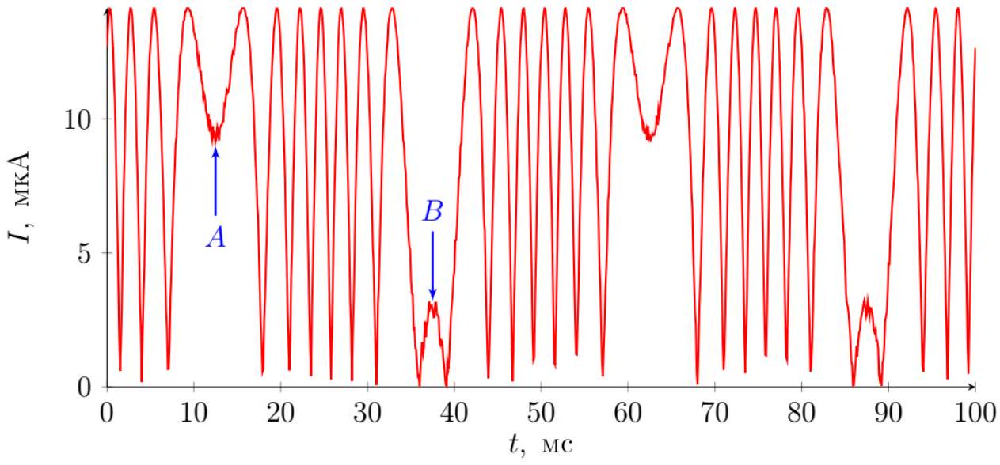

Выразим объем резины:

$$
V = \pi D ^ { 2 } h
$$

Продифференцируем выражение:

$$
2 D \delta D h + D ^ { 2 } \delta h = 0
$$

Отсюда:

Ответ:

$$
\delta D = - \frac { D } { 2 h } \delta h
$$

A2 ${ } ^ { 0.10 }$ Изменение полной длины провода $\delta L$ пропорционально $\delta h$

$$
\delta L = \Lambda \delta h .
$$

Выразите $\Lambda$ через $N , D , h$. Количество оборотов $N$ жестко зафиксировано.

$$
\delta L = \pi N \delta D = - \frac { \pi N D } { 2 h } \delta h
$$

Ответ:

$$
\Lambda = - \frac { \pi N D } { 2 h }
$$

А3 ${ } ^ { 0.60 }$ Найдите энергию деформации провода $W$. Ответ выразите через $N , D , h , d , E$ и $\delta h$

Объемная плотность энергии деформации выражается как:

$$
w = \frac { E \delta L ^ { 2 } } { 2 L ^ { 2 } }
$$

Объем провода:

$$
V = \frac { \pi ^ { 2 } d ^ { 2 } N D } { 4 }
$$

Выразим ответ через заданные в условии величины:

Ответ:

$$
W = \frac { E \pi ^ { 2 } N D d ^ { 2 } \delta h ^ { 2 } } { 32 h ^ { 2 } }
$$

A4 ${ } ^ { 0.50 }$ Пусть в некоторый момент времени корпус смещен ( $y \neq 0$ ) и груз не находится в равновесии $( x \neq y )$. Получите уравнение движения груза в виде

$$
\ddot { x } + \omega _ { 0 } ^ { 2 } x = A y .
$$

Выразите $\omega _ { 0 }$ и $A$ через $M , h , N , D , d$ и $E$.

Полная энергия равна:

$$
2 W = \frac { E \pi ^ { 2 } N D d ^ { 2 } ( x - y ) ^ { 2 } } { 16 h ^ { 2 } }
$$

Выразим силу, действующую на груз:

$$
F = \frac { \partial ( 2 W ) } { \partial ( \delta h ) } = M \ddot { x }
$$

Итоговое уравнение:

$$
\ddot { x } + \frac { E \pi ^ { 2 } N D d ^ { 2 } x } { 8 M h ^ { 2 } } = \frac { E \pi ^ { 2 } N D d ^ { 2 } y } { 8 M h ^ { 2 } }
$$

Отсюда:

Ответ:

$$
\begin{aligned}
\omega _ { 0 } & = \sqrt { \frac { E \pi ^ { 2 } N D d ^ { 2 } } { 8 M h ^ { 2 } } } \\
A & = \frac { E \pi ^ { 2 } N D d ^ { 2 } } { 8 M h ^ { 2 } }
\end{aligned}
$$

А5 ${ } ^ { 0.50 }$ Выразите $L _ { 0 }$ через $y _ { 0 } , \omega / \omega _ { 0 } , \Lambda$ и $\zeta$.

Воспользуемся методом комплексных амплитуд:

$$
x _ { 0 } \left( - \omega ^ { 2 } + 2 \zeta i \omega \omega _ { 0 } + \omega _ { 0 } ^ { 2 } \right) = \omega _ { 0 } ^ { 2 } y _ { 0 }
$$

Выразим $h _ { 0 } = x _ { 0 } - y _ { 0 }$ :

$$
h _ { 0 } = y _ { 0 } \left( - 1 + \frac { \omega _ { 0 } ^ { 2 } } { \omega _ { 0 } ^ { 2 } - \omega ^ { 2 } + 2 \zeta i \omega \omega _ { 0 } } \right)
$$

Учитывая, что $L _ { 0 } = \Lambda h _ { 0 }$, запишем ответ:

Ответ:

$$
L _ { 0 } = \Lambda y _ { 0 } \left( - 1 + \frac { 1 } { 1 - \frac { \omega ^ { 2 } } { \omega _ { 0 } ^ { 2 } } + 2 i \zeta i \frac { \omega } { \omega _ { 0 } } } \right) = \Lambda y _ { 0 } \frac { - \frac { \omega ^ { 2 } } { \omega _ { 0 } ^ { 2 } } + 2 i \zeta \frac { \omega } { \omega _ { 0 } } } { 1 - \frac { \omega ^ { 2 } } { \omega _ { 0 } ^ { 2 } } + 2 i \zeta \frac { \omega } { \omega _ { 0 } } }
$$

А6 ${ } ^ { 1.00 }$ Укажите соответствие между областями частот и режимами работы сенсора. Выразите $K _ { s }$ и $K _ { a }$ через $M , h , N , D , d$ и $E$.

Рассмотрим поведение груза в низкочастотном пределе. Рассмотрим одну гармонику колебаний $y$. Упростим выражение для $L _ { 0 }$ в пределе $\zeta \omega _ { 0 } \ll \omega \ll \omega _ { 0 }$ :

$$
L _ { 0 } \approx \frac { \Lambda \omega ^ { 2 } y _ { 0 } } { \omega _ { 0 } ^ { 2 } }
$$

что соответствует $L = - \frac { \Lambda \ddot { y } } { \omega _ { 0 } ^ { 2 } }$. При сложении нескольких низкочастотных гармоник это соотношение все еще выполняется. Выразим $K _ { a }$ :

$$
K _ { a } = - \frac { \omega _ { 0 } ^ { 2 } } { \Lambda } = \frac { E \pi d ^ { 2 } } { 4 M h }
$$

Теперь рассмотрим поведение груза в высокочастотном пределе. Аналогично рассмотрим одну гармонику колебаний $y$. Упростим выражение для $L _ { 0 }$ в пределе $\omega \gg \omega _ { 0 }$ :

$$
L _ { 0 } \approx - \Lambda y _ { 0 }
$$

При сложении нескольких высокочастотных гармоник это соотношение все еще выполняется. В этом случае $K _ { s } = - \frac { 1 } { \Lambda } = \frac { 2 h } { N \pi D }$.

Ответ: При $\zeta \omega _ { 0 } \ll \omega \ll \omega _ { 0 }$ сенсор работает как акселерометр, а при $\omega \gg \omega _ { 0 }$ - как сейсмограф.

$$
\begin{aligned}
K _ { s } & = \frac { 2 h } { N \pi D } \\
K _ { a } & = \frac { E \pi d ^ { 2 } } { 4 M h }
\end{aligned}
$$

A7 ${ } ^ { 0.40 }$
Вычислите значения $K _ { a }$ и $\omega _ { 0 }$.

Ответ:

$$
K _ { a } = 3.44 \cdot 10 ^ { 4 } \mathrm { c } ^ { - 2 }
$$

$$
\omega _ { 0 } = 2750 \text { рад } / \mathrm { c }
$$

В1 ${ } ^ { 1.00 }$ Выразите интенсивность света $I$, попадающего на фотодиод, через $\delta L , I _ { 0 } , \lambda , n , r$ и $\varphi _ { 0 }$.
Здесь $\varphi _ { 0 }$ - набегающая разность фаз между светом, проходящим сквозь волокно, намотанное на правую и левую опоры соответственно, при $\delta L = 0$.
Примечание. Можете не следить за знаком $\varphi _ { 0 }$. Иными словами, решения, отличающиеся заменой $\varphi _ { 0 } \rightarrow - \varphi _ { 0 }$, считаются эквивалентными.

На разветвитель после прохождения через интерферометр приходят волны с комплексными амплитудами

$$
\frac { r i } { \sqrt { 2 } } E _ { 0 } e ^ { 2 i k n \delta L + i \varphi _ { 0 } } \quad \text { и } \quad \frac { r } { \sqrt { 2 } } E _ { 0 } e ^ { - 2 i k n \delta L } ,
$$

поэтому в сумме

$$
\begin{gathered}
E = \frac { r i } { 2 } E _ { 0 } e ^ { 2 i k n \delta L + i \varphi _ { 0 } } - \frac { r i } { 2 } E _ { 0 } e ^ { - 2 i k n \delta L } = - \frac { r i E _ { 0 } } { 2 } \left( e ^ { 2 i k n \delta L + i \varphi _ { 0 } + i \pi } + e ^ { - 2 i k n \delta L } \right) = \\
= - \frac { r i E _ { 0 } } { 2 } \left( e ^ { 2 i k n \delta L + i \varphi _ { 0 } / 2 + i \pi / 2 } + e ^ { - 2 i k n \delta L - i \varphi _ { 0 } / 2 - i \pi / 2 } \right) e ^ { i \varphi _ { 0 } / 2 + i \pi / 2 } = - r i E _ { 0 } \cos \left( \frac { 4 \pi } { \lambda } n \delta L + \frac { \varphi _ { 0 } } { 2 } + \frac { \pi } { 2 } \right) \\
I = E E ^ { * } = r ^ { 2 } I _ { 0 } \sin ^ { 2 } \left( \frac { 4 \pi } { \lambda } n \delta L + \frac { \varphi _ { 0 } } { 2 } \right)
\end{gathered}
$$

Ответ:

$$
I = r ^ { 2 } I _ { 0 } \sin ^ { 2 } \left( \frac { 4 \pi } { \lambda } n \delta L + \frac { \varphi _ { 0 } } { 2 } \right)
$$

В2 ${ } ^ { 1.50 }$ Определите численные значения $Y$ и $f$.

Период колебаний картины равен $T = 63 \mathrm { mc } - 13 \mathrm { mc } = 50$ мс, отсюда:

Ответ:

$$
f = 20 \text { Гц }
$$

Половине периода колебаний соответствует изменение $\ddot { y }$ от $- ( 2 \pi f ) ^ { 2 } Y$ до $( 2 \pi f ) ^ { 2 } Y$.

Допустим аргумент $x$ у функции $\sin ^ { 2 } ( x )$, описывающей интенсивность света в точке $A$ находится в интервале $( 0 , \pi / 2 )$. Тогда в точке с практически нулевым током слева от $B$ он равен $7 \pi$. Амплитуда колебаний тока составляет $I _ { o } = 14.2$ мкА. Значения тока в точках $A$ и $B : I _ { A } = 9.7$ мкА, $I _ { B } = 3.2$ мкА.

Значит $x _ { B } - x _ { A } = 7 \pi + \arcsin \left( \sqrt { I _ { B } / I _ { o } } \right) - \arcsin \left( \sqrt { I _ { A } / I _ { o } } \right) = 21.5$. В итоге,

$$
x _ { B } - x _ { A } = \frac { 4 \pi } { \lambda } \left( \delta L _ { B } - \delta L _ { A } \right) = \frac { 4 \pi n } { \lambda } \cdot 2 \frac { ( 2 \pi f ) ^ { 2 } Y } { K _ { a } } \Rightarrow Y = \left( x _ { B } - x _ { A } \right) \frac { \lambda K _ { a } } { 32 \pi ^ { 3 } n f ^ { 2 } } = 1.46 \text { мкм }
$$

Ответ:

$$
Y = 1.46 \text { мкм }
$$

Вз ${ } ^ { 0.30 }$ Пользуясь теоремой о равномерном распределении энергии по степеням свободы, запишите выражение для $\left\langle \delta L ^ { 2 } \right\rangle$ - флуктуаций $\delta L$ при комнатной температуре. Ответ выразите через постоянную Больцмана $k _ { B } , T , E , D , N$ и $d$.

У описываемой системы одна степень свободы, но энергия деформации у двух опор складывается, поэтому

$$
2 \langle W \rangle = \frac { 1 } { 2 } k _ { B } T \quad \Rightarrow \quad \left\langle \delta h ^ { 2 } \right\rangle = k _ { B } T \frac { 8 h ^ { 2 } } { E \pi ^ { 2 } N D d ^ { 2 } }
$$

Учитывая что $\left\langle \delta L ^ { 2 } \right\rangle = \Lambda ^ { 2 } \left\langle \delta h ^ { 2 } \right\rangle$, получаем

$$
\left\langle \delta L ^ { 2 } \right\rangle = 2 k _ { B } T \frac { N D } { E d ^ { 2 } }
$$

Ответ:

$$
\left\langle \delta L ^ { 2 } \right\rangle = 2 k _ { B } T \frac { N D } { E d ^ { 2 } }
$$

B4 ${ } ^ { 0.60 }$ Если температура этого участка оптического волокна отличается от комнатной на малую величину $\Delta T _ { i }$, то при прохождении света через него набегает фаза $\varphi _ { i } \neq \varphi _ { i , 0 }$.

Выразите $\Delta \varphi _ { i } = \varphi _ { i } - \varphi _ { i , 0 }$ через $\Delta T _ { i } , \Delta L _ { i } , \alpha , \beta , n$ и $\lambda$.

$$
\Delta \varphi _ { i } = \frac { 2 \pi } { \lambda } \left( n + \beta \Delta T _ { i } \right) \Delta L _ { i } \left( 1 + \alpha \Delta T _ { i } \right) - \frac { 2 \pi } { \lambda } n \Delta L = \frac { 2 \pi } { \lambda } ( n \alpha + \beta ) \Delta L _ { i } \Delta T _ { i }
$$

Ответ:

$$
\Delta \varphi _ { i } = \frac { 2 \pi } { \lambda } ( n \alpha + \beta ) \Delta L _ { i } \Delta T _ { i }
$$

В5 ${ } ^ { 0.70 }$ Выразите $\left\langle \Delta \Phi ^ { 2 } \right\rangle$ через $\left\langle \Delta T ^ { 2 } \right\rangle , \Delta L , L , n , \alpha , \beta$ и $\lambda$.

Вычислим $\left\langle \Delta \Phi ^ { 2 } \right\rangle$ напрямую:

$$
\left\langle \Delta \Phi ^ { 2 } \right\rangle = \left\langle \left( \sum \Delta \varphi _ { i } \right) ^ { 2 } \right\rangle = \left( \frac { 2 \pi } { \lambda } ( n \alpha + \beta ) \Delta L \right) ^ { 2 } \left\langle \left( \sum \Delta T _ { i } \right) ^ { 2 } \right\rangle
$$

Пользуясь свойствами $\Delta T _ { i }$,

$$
\left\langle \left( \sum \Delta T _ { i } \right) ^ { 2 } \right\rangle = \left\langle \sum \Delta T _ { i } ^ { 2 } \right\rangle + \left\langle \sum \Delta T _ { i } \Delta T _ { j } \right\rangle = p \left\langle \Delta T ^ { 2 } \right\rangle = \frac { L } { \Delta L } \left\langle \Delta T ^ { 2 } \right\rangle .
$$

Ответ:

$$
\left\langle \Delta \Phi ^ { 2 } \right\rangle = \left( \frac { 2 \pi } { \lambda } ( n \alpha + \beta ) \right) ^ { 2 } L \Delta L \left\langle \Delta T ^ { 2 } \right\rangle
$$

В6 ${ } ^ { 1.00 }$ Выразите $\left\langle \Delta \Psi ^ { 2 } \right\rangle$ через $\left\langle \Delta \Phi ^ { 2 } \right\rangle$.

Температурные колебания, описанные раннее являются значительно более медленным процессом, чем распространение света, поэтому для любого $\Delta \Phi$ выполняется, что

$$
\Delta \Psi = 2 \Delta \Phi \quad \Rightarrow \quad \left\langle \Delta \Psi ^ { 2 } \right\rangle = 4 \left\langle \Delta \Phi ^ { 2 } \right\rangle
$$

Обратите внимание, что ответ отличается в 2 раза от распространения по волокну длиной $2 L$ !

Ответ:

$$
\left\langle \Delta \Psi ^ { 2 } \right\rangle = 4 \left\langle \Delta \Phi ^ { 2 } \right\rangle
$$

В7 ${ } ^ { 0.60 }$ Найдите среднеквадратичную разность изменений набега фазы на двух плечах интерферометра $\left\langle \left( \Delta \Psi _ { 1 } - \Delta \Psi _ { 2 } \right) ^ { 2 } \right\rangle$. Ответ выразите через $\left\langle \Delta \Psi ^ { 2 } \right\rangle$.

Набег фазы на обоих интерферометрах является независимым, поэтому

$$
\left\langle \left( \Delta \Psi _ { 1 } - \Delta \Psi _ { 2 } \right) ^ { 2 } \right\rangle = \left\langle \Delta \Psi _ { 1 } ^ { 2 } \right\rangle + \left\langle \Delta \Psi _ { 2 } ^ { 2 } \right\rangle = 2 \left\langle \Delta \Psi ^ { 2 } \right\rangle
$$

Ответ:

$$
\left\langle \left( \Delta \Psi _ { 1 } - \Delta \Psi _ { 2 } \right) ^ { 2 } \right\rangle = 2 \left\langle \Delta \Psi ^ { 2 } \right\rangle
$$

В8 ${ } ^ { 1.00 }$ Считайте, что сенсор работает при $T = 305 \mathrm {~K}$, а величина температурных флуктуаций $\left\langle \Delta T ^ { 2 } \right\rangle$ составляет $1.0 \cdot 10 ^ { - 6 } \mathrm {~K} ^ { 2 }$. Какое минимальное ускорение $a _ { \min }$ возможно измерить с помощью предложенного сенсора?

Из-за тепловых флуктуаций в механической системы длина плеч интерферометра имеет шум

$$
\sqrt { \left\langle \delta L ^ { 2 } \right\rangle } = \sqrt { 2 k _ { B } T \frac { N D } { E d ^ { 2 } } } = 7.1 \cdot 10 ^ { - 12 } \mathrm { M }
$$

Из-за тепловых флуктуаций в волокне разность фаз имеет шум

$$
\sqrt { \left\langle \left( \Delta \Psi _ { 1 } - \Delta \Psi _ { 2 } \right) ^ { 2 } \right\rangle } = \frac { 4 \pi \sqrt { 2 } } { \lambda } ( n \alpha + \beta ) \sqrt { \pi D N \Delta L } \cdot \sqrt { \left\langle \Delta T ^ { 2 } \right\rangle } = 2 \cdot 10 ^ { - 3 } ,
$$

что приводит к шуму в вычисляемой $\delta L$ равному $\frac { \lambda } { 8 \pi n } \cdot 2 \cdot 10 ^ { - 3 } = 0.6 \cdot 10 ^ { - 10 }$ м.
Таким образом, вклад от второго эффекта на порядок больше, и минимальное возможное ускорение:

Ответ:

$$
a _ { \min } \approx K _ { a } \cdot 0.6 \cdot 10 ^ { - 10 } \mathrm { M } = 2 \cdot 10 ^ { - 6 } \mathrm { M } / \mathrm { c } ^ { 2 }
$$
