## SINGAPORE JUNIOR PHYSICS OLYMPIAD 2016

## GENERAL ROUND

27 July 2016

## ANSWERS

## GENERAL DATA SHEET

| Acceleration due to gravity at Earth surface, | $g = 9.80 \mathrm {~m} \mathrm {~s} ^ { - 2 } = \| \vec { g } \|$ |
| :--- | :--- |
| Universal gas constant, | $R = 8.31 \mathrm {~J} \mathrm {~mol} ^ { - 1 } \mathrm {~K} ^ { - 1 }$ |
| Vacuum permittivity, | $\varepsilon _ { 0 } = 8.85 \times 10 ^ { - 12 } \mathrm { C } ^ { 2 } \mathrm {~N} ^ { - 1 } \mathrm {~m} ^ { - 2 }$ |
| Vacuum permeability, | $\mu _ { 0 } = 4 \pi \times 10 ^ { - 7 } \mathrm { Tm } \mathrm { A } ^ { - 1 }$ |
| Atomic mass unit, | $u = 1.66 \times 10 ^ { - 27 } \mathrm {~kg}$ |
| Speed of light in vacuum, | $c = 3.00 \times 10 ^ { 8 } \mathrm {~m} \mathrm {~s} ^ { - 1 }$ |
| Charge of electron, | $e = 1.60 \times 10 ^ { - 19 } \mathrm { C }$ |
| Planck's constant, | $h = 6.63 \times 10 ^ { - 34 } \mathrm {~J} \mathrm {~s}$ |
| Mass of electron, | $m _ { e } = 9.11 \times 10 ^ { - 31 } \mathrm {~kg} = 0.000549 u$ |
| Mass of proton, | $m _ { p } = 1.67 \times 10 ^ { - 27 } \mathrm {~kg} = 1.007 u$ |
| Rest mass of alpha particle, | $m _ { \alpha } = 4.003 u$ |
| Boltzmann constant, | $k = 1.38 \times 10 ^ { - 23 } \mathrm {~J} \mathrm {~K} ^ { - 1 }$ |
| Avogadro's number, | $N _ { A } = 6.02 \times 10 ^ { 23 } \mathrm {~mol} ^ { - 1 }$ |
| Standard atmosphere pressure, | $P _ { 0 } = 1.01 \times 10 ^ { 5 } \mathrm {~Pa}$ |
| Density of water, | $\rho _ { W } = 1000 \mathrm {~kg} \mathrm {~m} ^ { - 3 }$ |
| Specific heat (capacity) of water, | $c _ { W } = 4.19 \times 10 ^ { 3 } \mathrm {~J} \mathrm {~kg} ^ { - 1 } \mathrm {~K} ^ { - 1 }$ |
| Stefan-Boltzmann constant, | $\sigma = 5.67 \times 10 ^ { - 8 } \mathrm {~W} \mathrm {~m} ^ { - 2 } \mathrm {~K} ^ { - 4 }$ |

1. A force is applied to a box to push it across the horizontal floor at a constant speed of 4.0 m/s. Assume air resistance is negligible. What can you say about the forces acting on the box?
    (A) If the force applied to the box is doubled, the constant speed of the box will double to 8.0 m/s.
    (B) The magnitude of force applied to keep the box moving at a constant speed must be more than the magnitude of its weight.
    (C) The force being applied to the box to keep it moving at constant speed makes an action-reaction pair with the frictional force that resists its motion.
    (D) The magnitude of force applied to keep the box moving at a constant speed must be equal to the magnitude of the frictional forces that resist its motion.
    (E) The magnitude of force applied to keep the box moving at a constant speed must overcome i.e. be more than the magnitude of the frictional forces that resist its motion.

Answer: D
Notes:
Implicit in the question is that friction is not negligible. "Constant speed" is important as is" keeping the box moving at constant speed" so that students do not interpret the statements as relating to the process to start the box moving.

A - if the force applied were doubled, the box would accelerate. If air resistance is important, then it may be possible that A can be correct.

B - For friction, magnitude of force may be modelled as coefficient of friction x Normal force. In most cases coefficient of friction is less than one. It is also possible for coefficient friction to be more than 1.

C - Although C sounds almost the same as D, the two forces although equal are not action-reaction pair We need a preceding period of time when the force was greater than the frictional to reach the constant speed. However E which seems to suggest that also says "to keep the box moving at constant speed". So E is not perfectly correct.

2. If the force applied to the box in the preceding problem is suddenly discontinued, the box will;
(A) stop suddenly.
(B) continue at a constant velocity.
(C) suddenly start slowing to a stop.
(D) increase its speed for a very short period of time, then start slowing to a stop.
(E) continue at a constant speed for a very short period of time and then slow to a stop.

Answer: C

Notes: When the "force applied" is discontinued, friction still exists. Friction causes the box to slow down.

A- If the box was massless, then it is possible for the acceleration to approach infinity and thus for it to stop suddenly

B- If friction also suddenly stops (e.g. if friction were somehow related to the applied force- e.g. for static friction cases) then the box would continue at a constant velocity.

D and E are plausible if you watch a lot of old cartoons.

3. A box with mass $m$ is lying motionless on a level surface. In the diagram, $\vec { R }$ is the ground reaction force or normal force on the box and $\vec { W }$ is the weight of the box. Which statement is incorrect?
    (A) According to Newton's $1 ^ { \text {st } }$ law of motion, $\vec { R } + \vec { W } = 0$ implies that the box will remain at rest.
    (B) According to Newton's $2 ^ { \text {nd } }$ law of motion, $\vec { R } + \vec { W } = 0$.
    (C) According to Newton's $3 ^ { \text {rd } }$ law of motion, $\vec { R } = - \vec { W }$.
    (D) According to Newton's law of universal gravitation, $\vec { W } = m \vec { g }$.

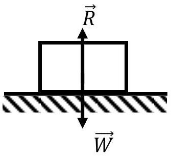

(E) According to Newton's law of universal gravitation $g$ is related to the mass and radius of earth.

Ans: C
A N1 law has a deeper meaning of defining a frame of reference
B N2 law also works for when there is acceleration but it is not totally wrong to use it for $\mathrm { a } = 0$
C is correct answer i.e. the incorrect statement. $\mathrm { R } = - \mathrm { W }$ but this is due directly to to equilibrium and indirectly related to Newton's $3 { } ^ { \text {rd } }$ law rather than directly according to Newton's $3 { } ^ { \text {rd } }$ law.
D where $g = G M / R ^ { 2 }$, In this interpretation, $\vec { W }$ is considered a real force and not a fictitious force and g is interpreted as the gravitational field, not the acceleration of a free falling object due to gravity E already explained in D

4. A box is pulled using a string up a 0.1 radian slope at constant speed of $2.0 \mathrm {~ms} ^ { - 1 }$. The string is cut suddenly and the box comes to a stop after moving up a further distance of 1.0 m. What is the value of the coefficient of friction?
    (A) 0.00
    (B) 0.10
    (C) 0.20
    (D) 0.30
    (E) The situation is impossible.

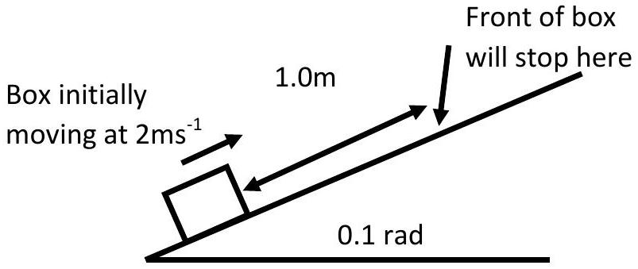
Ans: B

$$
\begin{gathered}
R = m g \cos \theta \\
F _ { \text {friction } } = \mu R = \mu m g \cos \theta
\end{gathered}
$$

COE - Initial: KE, Final: PE + Energy transferred by friction

$$
\begin{gathered}
\frac { 1 } { 2 } m v ^ { 2 } = m g x \sin \theta + \mu m g x \cos \theta \\
\mu = \frac { v ^ { 2 } / 2 - g x \sin \theta } { g x \cos \theta }
\end{gathered}
$$

If numbers are changed, it is possible to get an impossible situation where the coefficient of friction is negative.

5. A train of mass $7.0 \times 10 ^ { 4 } \mathrm {~kg}$ expends 60 kW of power to travel down a 2° incline at a constant velocity of $10 \mathrm {~m} \mathrm {~s} ^ { - 1 }$. How much power is required for the same train to travel up the $2 ^ { \circ }$ incline at the same constant velocity of $10 \mathrm {~m} \mathrm {~s} ^ { - 1 }$ ?
    (A) 540 kW
    (B) 480 kW
    (C) 300 kW
    (D) 240 kW
    (E) 60 kW

Answer: A
The power needed to increase the gravitational potential energy of the train moving it up a 2° slope at a constant velocity of $10 \mathrm {~m} \mathrm {~s} ^ { - 1 }$ is $P = \frac { F d } { t } = m g v \sin \theta = ( 70000 ) ( 9.81 ) ( 10 ) \left( \sin 2 ^ { \circ } \right) = 240 \mathrm {~kW}$

The train experiences other resistive forces, which is why it still expends extra 60 kW of power to travel down a 2° slope. To account for the power related to these resistive forces (which are the same since the slope angle is the same and the speed is the same), we can take the resistive forces to be (60 kW + 240 $\mathrm { kW } ) = 300 \mathrm {~kW}$. For the train going up the slope it needs to do work against the resistive forces and also gravity. Thus the total power is $300 \mathrm {~kW} + 240 \mathrm {~kW} = 540 \mathrm {~kW}$

6. Carts A and B are initially at rest on a frictionless, horizontal surface. A constant force $F _ { 0 }$ is applied to each cart as it travels from its initial position. The mass of cart A is more than the mass of cart B. Consider the kinetic energy, $E$, and momentum, $p$, of the boxes at position X, a distance $x _ { 0 }$ from the initial position. Subscripts A, B denote cart A or B. Which statement below is correct?
    (A) $E _ { A } < E _ { B } , p _ { A } < p _ { B }$
    (B) $E _ { A } < E _ { B } , p _ { A } = p _ { B }$
    (C) $E _ { A } > E _ { B } , p _ { A } < p _ { B }$
    (D) $E _ { A } = E _ { B } , p _ { A } = p _ { B }$
    (E) $E _ { A } = E _ { B } , p _ { A } > p _ { B }$

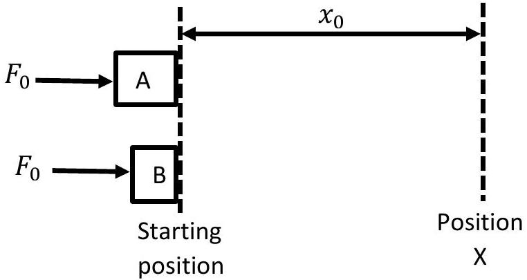
Answer: E - cart A acceleration less since cart A is heavier. KE is the same since work done is the same $F _ { 0 } x _ { 0 }$. cart A acceleration less since cart A is heavier and thus cart A takes a longer time to reach position X . Students should be able to figure out that the boxes are not at position X at the same time.

Momentum for cart A is more since force is applied for longer time (impulse) on cart A. Alternatively

$$
p = \sqrt { 2 m E }
$$

$E _ { A } = E _ { B }$ since force and distance are the same (choose from either D or E). Since $m _ { A } > m _ { B }$ therefore $p _ { A } > p _ { B }$ (actually can also conclude that if energy is the same, and mass is not the same, then momentum can't be the same and eliminate D immediately)

7. An object, 1, with mass $m$ and another object, 2, with twice the mass $2 m$ are dropped from rest, at the same starting position from the top of a large container and fall in a straight line through motionless viscous liquid. Drag is significant and assume that the two objects would eventually reach the same terminal velocity $v _ { T }$ if the container were tall enough. Consider the case where the objects do not reach terminal velocity at the bottom of the container. Assume that the same type of drag acts on both objects. How does the time taken, $t _ { 1 }$ and $t _ { 2 }$, for the objects 1 and 2 to reach the bottom compare?
    (A) $\quad t _ { 1 } = t _ { 2 }$
    (B) $\quad t _ { 1 } < t _ { 2 }$
    (C) $t _ { 1 } > t _ { 2 }$
    (D) $\quad t _ { 2 } < t _ { 1 } < 2 t _ { 2 }$
    (E) $\quad t _ { 1 } < t _ { 2 } < 2 t _ { 1 }$

Answer A:
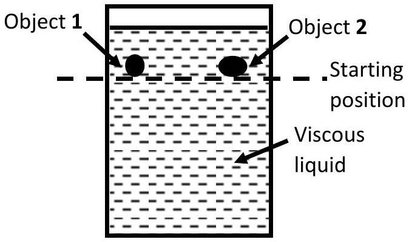
Based on Galileo's experiment students may intuitively choose A. It just so happens that the assumptions in this problem happens to support that answer.
At terminal velocity

$$
\begin{gathered}
m g = c _ { 1 } v _ { T } ^ { 2 } \\
2 m g = c _ { 2 } v _ { T } ^ { 2 }
\end{gathered}
$$

So (it doesn't matter whether it's laminar or turbulent)

$$
c _ { 2 } = 2 c _ { 1 }
$$

For object 1: $m g - c _ { 1 } v ^ { 2 } = m a$
For object 2: $2 m g - 2 c _ { 1 } v ^ { 2 } = 2 m a$
The same equation of motion, same starting conditions so same speed and so same time

8. A train moving on straight horizontal tracks slows down from $66 \mathrm {~ms} ^ { - 1 }$ to $22 \mathrm {~ms} ^ { - 1 }$ at a constant rate of $2.0 \mathrm {~ms} ^ { - 2 }$. What distance does it travel while slowing down?
    (A) 490 m
    (B) 650 m
    (C) 740 m
    (D) 970 m
    (E) 1100 m

Answer: D

$$
\begin{aligned}
& v ^ { 2 } = u ^ { 2 } + 2 a s \\
& s = \frac { v ^ { 2 } - u ^ { 2 } } { 2 a } = \frac { ( 22 ) ^ { 2 } - ( 66 ) ^ { 2 } } { 2 \times ( - 2.0 ) } = 968 \mathrm {~m}
\end{aligned}
$$

Alternatively
time taken to slow down $\Delta t = \frac { \Delta V } { a } = \frac { ( 66 - 22 ) } { 2 }$
Area under the velocity time graph $s = \frac { v _ { 1 } + v _ { 2 } } { 2 } \Delta t = \frac { ( 66 + 22 ) } { 2 } \frac { ( 66 - 22 ) } { 2 } = \frac { 66 ^ { 2 } - 22 ^ { 2 } } { 4 }$ or $88 \times 11$

9. A fruit drops from a tree. A boy, 1.5m tall, stands on the flat ground just under the fruit. The fruit was initially 10 m above the boy's head. A woman standing on the level ground 10 m from the boy immediately throws a ball from a height of 1.5 m above the ground, and deflected the fruit from its path towards the boy's head. Assume that air resistance and her reaction time are negligible. Calculate the minimum speed of the ball?
    (A) $10 \mathrm {~ms} ^ { - 1 }$
    (B) $15 \mathrm {~ms} ^ { - 1 }$
    (C) $20 \mathrm {~ms} ^ { - 1 }$
    (D) $25 \mathrm {~ms} ^ { - 1 }$
    (E) $30 \mathrm {~ms} ^ { - 1 }$
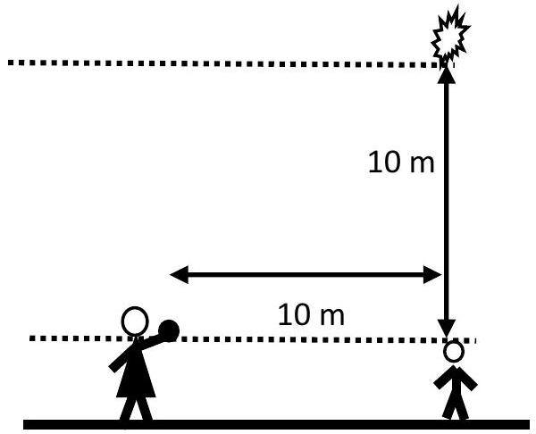
Answer: A
$$
\begin{gathered}
x = u \cos \theta t \\
y _ { 2 } = u \sin \theta t - \frac { 1 } { 2 } g t ^ { 2 } \\
y _ { 2 } > 0 \\
u \sin \theta > \frac { 1 } { 2 } g \frac { x } { u \cos \theta } \\
u > \sqrt { \frac { g x } { \sin 2 \theta } } = \sqrt { \frac { 9.80 \times 10 } { \sin 90 } }
\end{gathered}
$$
Note: She must have aimed correctly at the fruit. What if the fruit was already falling when she threw the ball?

10. An electron is emitted from the surface of a metal plate at an angle of 30 degrees from the surface. The electron's initial kinetic energy is $3.2 \times 10 ^ { - 19 } \mathrm {~J}$. A uniform electric field of $1000 N C ^ { - 1 }$ is applied as shown in the figure. What is the kinetic energy of the electron when it is furthest from the plate from which it was emitted?
    (A) 0J
    (B) $0.8 \times 10 ^ { - 19 } \mathrm {~J}$
    (C) $1.6 \times 10 ^ { - 19 } \mathrm {~J}$
    (D) $2.4 \times 10 ^ { - 19 } \mathrm {~J}$
    (E) $\quad 3.2 \times 10 ^ { - 19 } \mathrm {~J}$

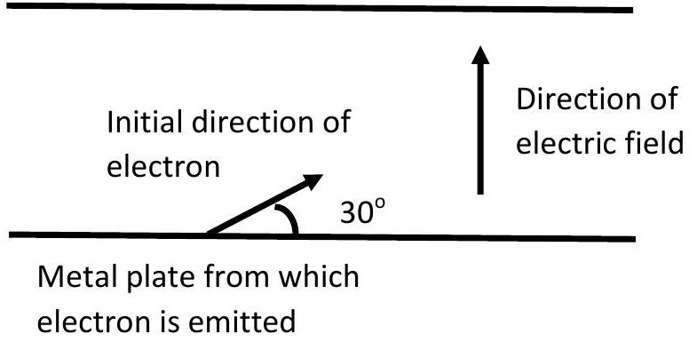

Answer: D

$$
\begin{gathered}
\text { initial } K E = \frac { 1 } { 2 } m v ^ { 2 } \\
\text { final } K E = \frac { 1 } { 2 } m ( v \cos \theta ) ^ { 2 } = 0.75 \text { initial } K E
\end{gathered}
$$

note: Magnitude of electric field is not needed

11. A projectile is launched at velocity $v _ { 0 }$ into an ideal ballistic trajectory from the origin of a coordinate system. Given that: when the launch angle is varied, all the possible points that can be hit by the projectile are exactly contained within a parabola with equation $y = a + b x ^ { 2 }$ where $y$ is the vertical height, $x$ is the horizontal displacement from the origin, while $a$ and $b$ are constants. What could be the expression for $a$ and $b$ ?
    (A) $a = \frac { v _ { 0 } { } ^ { 2 } } { 2 g } , b = \frac { g } { v _ { 0 } { } ^ { 2 } }$
    (B) $\quad a = \frac { v _ { 0 } { } ^ { 2 } } { 2 g } , b = \frac { g } { 2 v _ { 0 } { } ^ { 2 } }$
    (C) $\quad a = \frac { v _ { 0 } { } ^ { 2 } } { 2 g } , b = \frac { 2 g } { v _ { 0 } { } ^ { 2 } }$
    (D) $a = \frac { v _ { 0 } { } ^ { 2 } } { g } , b = - \frac { g } { v _ { 0 } { } ^ { 2 } }$
    (E) $\quad a = \frac { v _ { 0 } { } ^ { 2 } } { 2 g } , b = - \frac { g } { 2 v _ { 0 } { } ^ { 2 } }$

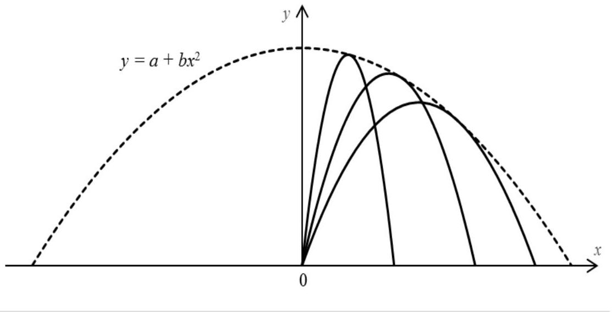

Answer: E

Curve is downwards parabola so b must be negative. So either D or E , from COE, $a$ must be $\frac { v _ { 0 } { } ^ { 2 } } { 2 g }$ so D is incorrect

Alternatively,
At vertical launch angle, maximum height is $\frac { v _ { 0 } { } ^ { 2 } } { 2 g }$ and the horizontal displacement from origin is 0. Thus, $a = \frac { v _ { 0 } { } ^ { 2 } } { 2 g }$

At a 45° launch angle, we expect it to reach the maximum horizontal range when it lands at height 0. This maximum range is given by $x = \frac { v _ { 0 } { } ^ { 2 } } { g }$. Substitute $x = \frac { v _ { 0 } { } ^ { 2 } } { g } , y = 0 , a = \frac { v _ { 0 } { } ^ { 2 } } { 2 g }$ into $y = a + b x ^ { 2 }$, we can solve to obtain $b = - \frac { g } { 2 v _ { 0 } { } ^ { 2 } }$

12. The upper end of a rope is fixed to a vertical wall. The upper end makes an angle of 30 degrees with the wall when the lower end is pulled by a horizontal force of 20N. What is the mass of the rope?
    (A) 1.8kg
    (B) 2.0kg
    (C) 2.4 kg
    (D) 3.5 kg
    (E) 4.1kg

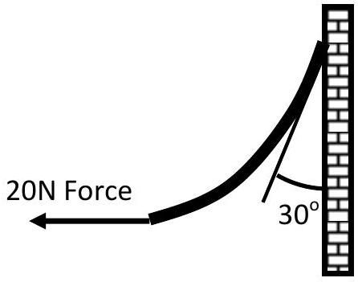

Answer: D
The rope is in equilibrium, so total net force is 0 . So the horizontal force on the rope by the wall is 20 N , which means the force on the rope by the wall is 20/sin 30 = 40N. The vertical force on the rope is 40 cos 30. Thus the weight of the rope is 20/ $\tan ( 30 )$ so its mass is $20 \sqrt { 3 } / g = 3.5 k g$.

13. An ideal uniform spring of mass $m \mathrm {~kg}$, unstretched length $L \mathrm {~m}$ and spring constant $k \mathrm { Nm } ^ { - 1 }$ stretches by an extension of $x \mathrm {~m}$ when hung vertically. Which statement below is correct? (You may want to know that the sum of N terms in an arithmetic progression from 1 to N is $\frac { N ( 1 + N ) } { 2 }$ )
    (A) The top half of the spring with mass $\frac { m } { 2 } \mathrm {~kg}$ has an extension $\frac { x } { 2 } \mathrm {~m}$.
    (B) The top half of the spring with length $\frac { L + x } { 2 }$ m supports $\frac { m g } { 2 } \mathrm {~N}$.
    (C) The top half of the spring with mass $\frac { m } { 2 } \mathrm {~kg}$ has a spring constant of $\frac { k } { 2 } \mathrm { Nm } ^ { - 1 }$.
    (D) The extension of the whole spring is $\frac { m g } { k } \mathrm {~m}$
    (E) The length of the whole spring is $L + \frac { m g } { 2 k } \mathrm {~m}$

Answer: E

A - The top half (based on mass) should have larger extension and the lower half should have smaller extension as the top half supports more weight.
B - The top half (based on length) supports more than half the weight as the top half based on mass has extended into the bottom half based on mass and the top half supports its own weight as well as the bottom half's weight.
    C - The spring constant is twice since half the spring will extend half as much when the same force is applied.
    D - The extension of the whole spring is less than $\frac { m g } { k } \mathrm {~m}$ which would be the extension of the spring if all the mass were concentrated at the bottom
    E - Only answer left (arithmetic progession formula is not needed)

Note: 1) Consider a massless spring , spring constant k ,with a mass m attached to the bottom The extension is $\mathrm { x } = \frac { \mathrm { mg } } { \mathrm { k } }$
Consider if we split it into N segments, spring $N k$ followed by mass $m / N$ and assume N is large
The total extension starting from the bottom and adding upwards is

$$
x = \sum _ { i = 1 } ^ { N } x _ { i } = \sum _ { i = 1 } ^ { N } \frac { i \frac { m } { N } g } { N k } = \frac { m g } { N ^ { 2 } k } \sum _ { i = 1 } ^ { N } i = \frac { m g } { N ^ { 2 } k } \frac { N ( 1 + N ) } { 2 } = \frac { m g } { 2 k }
$$

2) by summing 1 to $\mathrm { n } / 2$ the extension of the bottom half is $1 / 4 \mathrm { x }$ and by summing $\mathrm { n } / 2$ to n , the extension of the top half is 3/4x i.e. (1-1/4)x
3) if we make the two wrong assumptions that the top half has extension x/2 and supports the mass m/2. We still get the correct answer:

$$
\begin{gathered}
( 2 k ) \left( \frac { x } { 2 } \right) = \left( \frac { m } { 2 } \right) g \\
x = \frac { m g } { 2 k }
\end{gathered}
$$

However if we consider the top third (and so on) of the spring we do not get the same answer.

14. A ball with mass $m$ is hung from the ceiling with a massless string of length $l$ as shown in the diagram. It moves in uniform circular motion with angular velocity $\omega$. What is the magnitude of tension in the string?
    (A) $m \omega ^ { 2 } l$
    (B) $m \omega ^ { 2 } l \cos \theta$
    (C) $m \omega ^ { 2 } l / \cos \theta$
    (D) $m \omega ^ { 2 } l \sin \theta$
    (E) $m \omega ^ { 2 } l / \sin \theta$

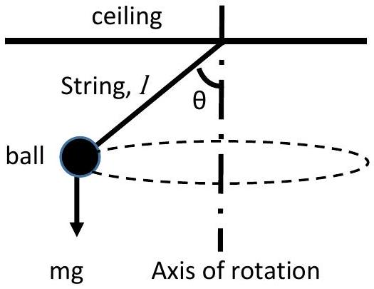

Answer: A

If angle is close 90 we would feel a tension in the string from daily experience so B cannot be true, C would approach infinity so also might be true. If angle is close to 0 tension cannot be either close to 0 or infinity. Guess from A or C

Alternatively.

$$
T \sin \theta = m \omega ^ { 2 } r = m \omega ^ { 2 } l \sin \theta
$$

15. For the same situation as in the above question, with $m = 0.20 k g , l = 0.80 m$. What is the angular velocity in order for the string to maintain a constant angle of $\theta = 25 ^ { \circ }$ to the vertical?
    (A) 0.59 rad s ${ } ^ { - 1 }$
    (B) $1.2 \mathrm { rad } \mathrm { s } ^ { - 1 }$
    (C) $3.5 \mathrm { rad } \mathrm { s } ^ { - 1 }$
    (D) $3.7 \mathrm { rad } \mathrm { s } ^ { - 1 }$
    (E) $5.4 \mathrm { rad } \mathrm { s } ^ { - 1 }$

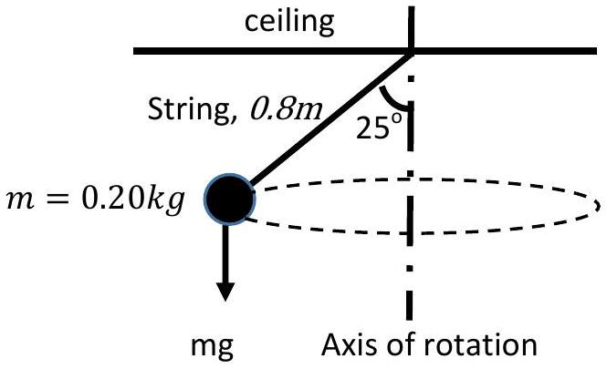
Answer D:

$$
\begin{aligned}
m \omega ^ { 2 } l \cos \theta & = m g \\
\omega ^ { 2 } & = \frac { g } { l \cos \theta } \\
\omega & = \sqrt { \frac { g } { l \cos \theta } } = \sqrt { \frac { 9.81 } { ( 0.80 ) \left( \cos 25 ^ { \circ } \right) } } = 3.7 \mathrm { rad } \mathrm {~s} ^ { - 1 }
\end{aligned}
$$

Note: for small angles $\omega = \sqrt { \frac { g } { l } }$ same as for pendulum

16. The diagram below shows 3 pendulums of length L. The first uses a point mass m suspended from a string of length L; the second uses a sphere with radius R and mass m suspended such that the centre of mass of the sphere is length L away from the pivot point; the last uses a rigid rod of length L and mass m pivoted at its end. Which of the following statements correctly describes the periods of these 3 pendulums?
    (A) Period of $1 = 2 > 3$
    (B) Period of $2 > 1 > 3$
    (C) Period of $2 > 3 > 1$
    (D) Period of $3 > 1 > 2$
    (E) Period of $3 > 2 > 1$

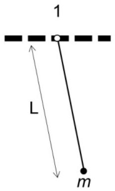
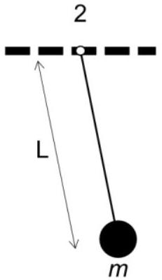
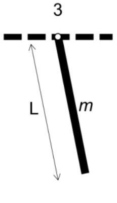

Answer: B
Qualitative reasoning based on period formula
3 must be the smallest since the mass is distributed to shorter distances (i.e A or B). If $T \propto l$ then $1 = 2$. Since $T \propto \sqrt { l }$ instead 1 cannot be equal to 2 .

Alternatively,
Period of 2 is greater than period of 1 because the sphere, having a finite size, has a larger moment of inertia than the point mass.

Period of the rod pendulum is the lowest because its effective length is $\frac { I } { m r } = \frac { \frac { 1 } { 3 } m L ^ { 2 } } { m \frac { L } { 2 } } = \frac { 2 } { 3 } L$ i.e. it has the same period as a pendulum with a point mass suspended on a string of length 2L/3.

17. A 360kg roller coaster car is initially at rest at a height of 120m above the ground. It goes to the ground and does a circular loop of radius . Assume that friction and energy losses are negligible, the car is small and is not attached to the track. What is the maximum radius $r$ so that the roller coaster does not leave the track?
    (A) 120m
    (B) 60m
    (C) 48m
    (D) 42 m
    (E) 36m

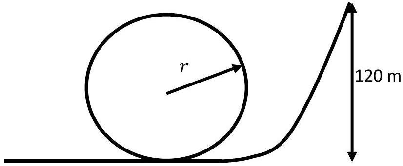

Answer: C
A is just wrong, B is COE, but car will fall off. So guess from C,D or E

Alternatively,
At the top of the loop, the roller coaster has $m g ( h - 2 r )$ kinetic energy, where $\mathrm { h } = 120 \mathrm {~m}$ is the initial height. So its speed is $\sqrt { 2 g ( h - 2 r ) }$. In order for the roller coaster to not leave the track at the top of the loop, $\frac { v ^ { 2 } } { r }$ must be at least g. So for the maximum radius we must have $\frac { 2 g ( h - 2 r ) } { r } = g$, so $r = \frac { 2 h } { 5 } = 48 m$. Note: In real situations you will need a failsafe in case frictional forces change etc..

18. Two masses $m _ { 1 } = 100 k g$ and $m _ { 2 } = 200 k g$ are attached to a light, unstretchable, string on a fixed rod as shown in the figure. Assume that friction is negligible. What is the acceleration of mass $m _ { 1 }$ due to gravity?
    (A) $3.3 \mathrm {~ms} ^ { - 2 }$ upwards
    (B) $4.9 \mathrm {~ms} ^ { - 2 }$ upwards
    (C) $9.8 \mathrm {~ms} ^ { - 2 }$ downwards
    (D) $9.8 \mathrm {~ms} ^ { - 2 }$ upwards
    (E) $19.6 \mathrm {~ms} ^ { - 2 }$ upwards

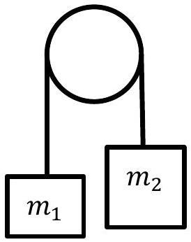

Answer: A
Think of the masses in a straight line. Force mg in one direction, force 2mg in the opposite direction, so total force is mg, total mass is 3 m, so the acceleration of the whole system and also of $m _ { 1 }$ is a=F/m= (1/3) g. From this point of view, the tension is an internal force within the system and therefore the acceleration of two mass system is due to gravity.

Alternatively,
Same tension. Same acceleration magnitude, opposite directions.

$$
\begin{gathered}
T - m _ { 1 } g = m _ { 1 } a \\
T - m _ { 2 } g = - m _ { 2 } a
\end{gathered}
$$

Subtracting to eliminate T

$$
\begin{gathered}
\left( m _ { 2 } - m _ { 1 } \right) g = \left( m _ { 2 } + m _ { 1 } \right) a \\
a = \frac { \left( m _ { 2 } - m _ { 1 } \right) } { \left( m _ { 2 } + m _ { 1 } \right) } g = \frac { 1 } { 3 } g
\end{gathered}
$$

Note: If the question had asked for what is the value of "gravitational field strength" also known as "acceleration due to gravity" acting on mass $m _ { 1 }$, then C would be the best answer.

19. In the figure, the two pulleys are at both ends are fixed in position and the pulley in between them is free to move. The masses $m _ { 1 } = 4.9 \mathrm {~kg} , m _ { 2 } = 4.9 \mathrm {~kg}$ are attached to the ends of a long string and the string is placed across the two big pulleys. Then the small pulley with $m _ { 3 } = 7.9 \mathrm {~kg}$ is gently placed on the initially horizontal string between the two big pulleys. Assume that the pulleys rotate smoothly and have negligible mass. Also assume that the string is long enough. What is the angle $\theta$ at equilibrium?
    (A) $0.2 \pi \mathrm { rad }$
    (B) $0.4 \pi \mathrm { rad }$
    (C) 30°
    (D) 60°
    (E) It never reaches equilibrium.

Answer: B
Tension is $T = m _ { 1 } g = m _ { 2 } g$.
Vertical component: $m _ { 3 } g = 2 T \cos \frac { \theta } { 2 } = 2 m _ { 1 } g \cos \frac { \theta } { 2 }$

$$
\theta = 2 \cos ^ { - 1 } \frac { m _ { 3 } } { 2 m _ { 1 } } \approx 0.4 \pi
$$

Note: If $m _ { 3 }$ was larger, it might continue accelerating

20. A person on the moon surface shoots a bullet vertically upwards with a speed of $1200 \mathrm {~ms} ^ { - 1 }$. Assume that the acceleration due to gravity on the moon's surface is $g _ { m } = 0.160 \times g$, the radius of the moon is $r _ { m } = 1700 \mathrm {~km}$ and that air resistance is negligible. Calculate the height the bullet reaches above moon's surface. (Hint: the potential energy of a mass $m$ may be taken as $G P E = - m g _ { m } \frac { r _ { m } ^ { 2 } } { r }$ )
    (A) 74 km
    (B) 184 km
    (C) 440 km
    (D) 460 km
    (E) 630 km

Answer: E

$$
\begin{aligned}
& \text { COE - } \quad \begin{array} { l }
\frac { 1 } { 2 } v ^ { 2 } = g _ { m } r _ { m } - g _ { m } \frac { r _ { m } ^ { 2 } } { r } \\
\quad r = \frac { g _ { m } r _ { m } ^ { 2 } } { g _ { m } r _ { m } - \frac { 1 } { 2 } v ^ { 2 } } \\
h = \left( \frac { g _ { m } r _ { m } } { g _ { m } r _ { m } - \frac { 1 } { 2 } v ^ { 2 } } - 1 \right) r _ { m } = ( 0.37 ) 1700 \mathrm {~km}
\end{array}
\end{aligned}
$$

Note: 1) using $\frac { 1 } { 2 } v ^ { 2 } = g _ { m } h$ gives us 460km

2) using $\frac { 1 } { 2 } v ^ { 2 } = g h$ gives us 73 km
3) would it land at the same spot?

21. Initially, a 1 kg box was sliding on frictionless surface at a constant velocity of $4 \mathrm {~ms} ^ { - 1 }$ in the x-direction. A constant force of 1N was applied on the box in a fixed direction for a time duration of 5 s. After 5s the speed of the box is $3 \mathrm {~ms} ^ { - 1 }$. What is the magnitude of the change in momentum of the box?
    (A) $1 \mathrm { kgms } ^ { - 1 }$
    (B) $2 \mathrm { kgms } ^ { - 1 }$
    (C) $3 \mathrm { kgms } ^ { - 1 }$
    (D) $4 \mathrm { kgms } ^ { - 1 }$
    (E) $5 \mathrm { kgms } ^ { - 1 }$

Answer: E
Change in momentum= impulse $= 1 \mathrm {~N} \times 5 \mathrm {~s}$
Note: What could be the direction of the final velocity?

22. A metal ball with volume $V$, density $\rho _ { b }$ is tied to a string and gently lowered into a measuring cylinder with honey. The density of honey is $\rho _ { h }$. When the ball is submerged, the string is cut and the ball falls straight down. The measuring cylinder and honey has total mass $M$ and is on a weighing machine which has a readout in kg. Assume that the ball quickly reaches terminal velocity and the honey does not overflow or splash. What is the reading on the weighing machine when the ball is falling at constant velocity?
    (A) $M$
    (B) $M + \rho _ { b } V$
    (C) $M + \rho _ { h } V$
    (D) $M + \left( \rho _ { b } - \rho _ { h } \right) V$
    (E) $M + \left( \rho _ { h } - \rho _ { b } \right) V$

Answer: B

Note:

1) What was the reading when it was held on the string?
2) What was the reading when the string is just cut but the velocity of the ball is zero?
3) What would the reading be when the string is just cut and there is no honey?
4) What would be the reading when the ball is at the bottom and moving at a constant velocity of 0m/s?

23. A ball is dropped on the floor and bounces up and down for an infinite number of times. When the ball is dropped from a height such that its center of mass is 5.00 m above its center of mass if it were just resting on the floor, it bounces back up to 1.25 m. Assume that energy losses are negligible except during the bounce. How much time does it take for the ball to stop bouncing from the time it was dropped? (Hint: for $0 < x < 1 , x + x ^ { 2 } + x ^ { 3 } + \cdots = \frac { x } { 1 - x }$ )
    (A) 1s
    (B) 2s
    (C) 3s
    (D) 4s
    (E) It never stops bouncing

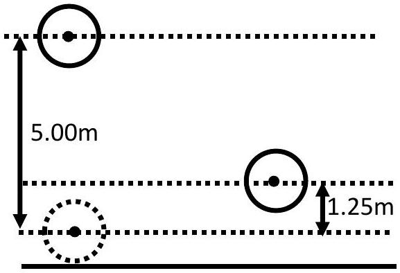

Answer: C

$$
\begin{aligned}
& h = \frac { 1 } { 2 } g t ^ { 2 } \\
& t = \sqrt { \frac { 2 h } { g } }
\end{aligned}
$$

Time before $1 ^ { \text {st } }$ bounce $= 1 \mathrm {~s}$
Time between $1 ^ { \text {st } }$ and $2 ^ { \text {nd } }$ bounce $= 1 \mathrm {~s}$
Time between $2 ^ { \text {nd } }$ and $3 ^ { \text {rd } }$ bounce $= 0.5 \mathrm {~s}$
Time between $3 ^ { \text {rd } }$ and 4th bounce $= 0.25 \mathrm {~s}$
Students may guess that answer is either C or D. E is not likely due to daily life experience.
Alternatively, they may use the hint to work out that the answer is C

24. Case 1: A 80kg skater with speed $u$ slides towards stationary skater with mass 20 kg. They hold hands when they reach each other and continue as one. Case 2: the 20kg skater is moving and the 80 kg skater is stationary; the initial kinetic energy of the systems in both cases are the same. Assume friction is negligible. What is the ratio of the change in kinetic energy (i.e the amount of energy converted to other forms) of the system in case 1 to that in case 2? i.e. (case1:case 2)
    (A) 4:1
    (B) 2:1
    (C) 1:1
    (D) 1:2
    (E) 1:4

Ans: E
Case 1: $80 u = 100 v _ { 1 } K E$ final $= \frac { 1 } { 2 } 100 ( 0.8 u ) ^ { 2 } , \Delta K E = \frac { 1 } { 2 } 16 u ^ { 2 }$
Case 2: $20 ( 2 u ) = 100 v _ { 2 }$ KEfinal $= \frac { 1 } { 2 } 100 ( 0.4 u ) ^ { 2 } , \Delta K E = \frac { 1 } { 2 } 64 u ^ { 2 }$
Note: Intuitively the situations are similar, but they are not.

25. A circular disc with an axle of diameter 2 cm, is attached with strings to the ceiling. The disc is rotated so that the strings wind up along the axle so that the disc is raised up to the ceiling. The string is long such that when the disc is released from rest, its center of mass falls 2.0 m. The disc does not slip from the string. Assume that the axle is massless and the disc has all of its 5 kg mass at radius 3 cm. Calculate the acceleration of the center of mass of the disc.
    (A) $g$
    (B) $2 g / 3$
    (C) $g / 3$
    (D) $g / 5$
    (E) $g / 10$

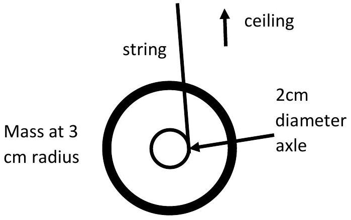

Answer: E
It's definitely not A since there is a tension upwards. Assume the angle the string makes to the vertical is small (It is small after disc falls a distance from the top since the axle is only 1cm radius, right at the top when the string is wound up, the tension makes an angle of 18 deg from the vertical)

$$
\begin{gathered}
m g - F _ { T } = m a \\
r _ { a } F _ { T } = I \alpha = m r ^ { 2 } \frac { a } { r _ { a } } \\
m g = m a + m \frac { r ^ { 2 } } { r _ { a } ^ { 2 } } a \\
a = \frac { g } { 1 + \frac { r ^ { 2 } } { r _ { a } ^ { 2 } } }
\end{gathered}
$$

26. A 0.9 m diameter, water pipe brings water from a reservoir 20 m high to a 0.3 m diameter nozzle at ground level. Assume that viscous forces are negligible. What is the maximum possible speed of the water jet at the nozzle?
    (A) $6.6 \mathrm {~ms} ^ { - 1 }$
    (B) $20 \mathrm {~ms} ^ { - 1 }$
    (C) $34 \mathrm {~ms} ^ { - 1 }$
    (D) $59 \mathrm {~ms} ^ { - 1 }$
    (E) $178 \mathrm {~ms} ^ { - 1 }$

Answer: B by COE,

$$
\frac { v ^ { 2 } } { 2 } = g z
$$

27. A fire piston consists of a cylinder and piston arrangement that traps air at 1 atm, 299K, in the cylinder. Initially the 0.010 m diameter piston is at a height 0.25 m above the bottom. The piston is suddenly pushed down so that it ends up at the height 0.010 m . The temperature of the air becomes 533K. Assume that air is an ideal gas, the piston is air tight. Calculate the force due to the gas in the cylinder acting on the piston at the height of 0.010 m.
    (A) 3500N
    (B) 350N
    (C) 110N
    (D) 35N
    (E) None of the above
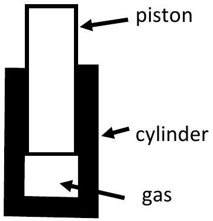
Answer: B
Use ideal gas law.
$$
\begin{gathered}
P V = n R T \\
\frac { P _ { 2 } V _ { 2 } } { P _ { 1 } V _ { 1 } } = \frac { T _ { 2 } } { T _ { 1 } } \\
F = P _ { 2 } \pi r ^ { 2 } = \frac { T _ { 2 } P _ { 1 } V _ { 1 } } { T _ { 1 } V _ { 2 } } = \frac { ( 260 + 273.15 ) \left( 1.01 \times 10 ^ { 5 } \right) } { ( 26 + 273.15 ) } \left( \frac { 25 } { 1 } \right) 3.142 \left( 0.005 ^ { 2 } \right) = 353 \mathrm {~N}
\end{gathered}
$$

28. The Singapore Navy's Archer class submarine are equipped with Stirling engines. The idealized Stirling cycle for fixed quantity of an ideal gas is shown in the diagram below. The parts of the cycle are labelled as: (i) isothermal (same temperature) process (ii) isochoric (same volume) process (iii) isothermal process and (iv) isochoric process. Which part(s) have heat flow to the gas?
    (A) (i) only
    (B) (ii) only
    (C) (i) and (ii)
    (D) (ii) and (iii)
    (E) (i) and (iv)

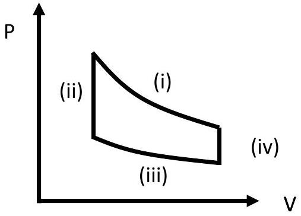

Answer: C

To work as an engine the cycle must go (i), (iv) ,(iii), (ii). Gas does work during (i) and to stay isothermal heat must go in to keep temperature constant. During (iv) pressure decreases so temperature must have decreased. Since no work done, heat flows away from gas. During (iii) gas is compressed. Work done on gas so heat flows out from gas to keep temp constant. During (ii), pressure increases so heat flows in to gas to raise temperature.

29. Assume the heat engine below is an ideal heat driven engine that has an efficiency $\eta _ { t h } = 1 - \frac { T _ { c } } { T _ { H } }$, where $T _ { H }$ is the temperature at which the heat enters the engine $T _ { c }$ the cold temperature which the engine exhausts the waste heat. The thermal conductivity of stainless steel is $19 \mathrm { Wm } ^ { - 1 } \mathrm {~K} ^ { - 1 }$. Heat enters the heat engine through a 2.00 mm thick, $23.7 \mathrm {~cm} ^ { 2 }$ area stainless steel. Assume that the heat source can maintain a temperature of $T _ { H S } = 613 ^ { \circ } \mathrm { C }$ (note: $T _ { H S } \neq T _ { H }$ ) and the environment can maintain a cold temperature of $T _ { c } = 306 ^ { \circ } \mathrm { C }$. Also assume that the working gas is able to achieve thermal equilibrium with the appropriate surface. What could be the maximum efficiency of the engine when it is doing work at the average rate of $1 \mathrm { kJs } ^ { - 1 }$ ?
    (A) 5\%
    (B) 10\%
    (C) 30\%
    (D) 50\%

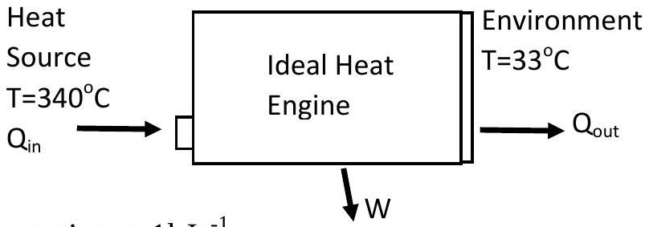

(E) It is not possible to operate the engine at $1 \mathrm { kJs } ^ { - 1 }$

Answer: C
It's definitely not D as that is when $T _ { H S } = T _ { H }$ so guess C is closest
Guess and check e.g. C- if $30 \%$, then $T _ { H } = 437 \mathrm {~K} , \Delta T = 176 \mathrm {~K}$ and also $\Delta T = \frac { P _ { \text {heat } } \text { in } } { \sigma A / d } = 148 \mathrm {~K}$ Guess and check e.g. B- if $10 \%$, then $T _ { H } = 340 \mathrm {~K} , \Delta T = 273 \mathrm {~K}$ and also $\Delta T = \frac { P _ { \text {heat } } \text { in } } { \sigma A / d } = 444 \mathrm {~K}$ C is closer.

Alternatively,

$$
\begin{gathered}
P _ { \text {heat in } } = P _ { W D } + P _ { \text {heat out } } \\
P _ { \text {heat in } } = \frac { k A } { d } \Delta T = \frac { P _ { W D } } { \eta _ { t h } } = \frac { P _ { W D } } { \frac { T _ { H S } - \Delta T - T _ { c } } { T _ { H S } - \Delta T } } = \frac { P _ { W D } \left( \Delta T - T _ { H S } \right) } { \Delta T - T _ { H S } + T _ { c } } \\
\Delta T \left( \Delta T - T _ { H S } + T _ { c } \right) = \frac { P _ { W D } d } { k A } \left( \Delta T - T _ { H S } \right) \\
\left. \frac { { } _ { V D } d } { k A } \right) \Delta T + \frac { P _ { W D } d } { k A } T _ { H S } = 0
\end{gathered}
$$

Solving the quadratic equation $\Delta T = 180 K$ and thus $\eta _ { t h } = 1 - \frac { 306.15 } { 613.15 - 180 } = 0.3$
Interesting to note that there are two solutions for lower output power conditions. i.e. can get the same output power from two different input power a more efficient one where $\Delta T$ is lower and a less efficient one where $\Delta T$ is higher . It is impossible to operate at 1001kW.

30. Three blocks A, B, C are arranged in a row on a frictionless surface. Blocks A and B are connected by a spring of spring constant $10 \mathrm { Nm } ^ { - 1 }$ while blocks B and C are connected by a spring of spring constant 20 $\mathrm { Nm } ^ { - 1 }$. Blocks A and C are pushed towards B and released in such a way that blocks A and C oscillate but block B remains stationary. If the mass of block A is 20kg, what is the mass of block C?
    (A) 5kg
    (B) 10kg
    (C) 20kg
    (D) 40 kg

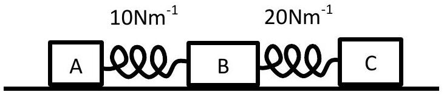

(E) 80kg

Answer: D
For block B to remain stationary, the frequency of oscillations of blocks A and C must be the same. The angular frequency of a spring system is given by $\sqrt { \frac { k } { m } }$ so the ratio of the spring constant to the mass of the block must be the same. Thus the mass of block C must be 40 kg .

31. Suppose that the Earth is perfectly spherical, of uniform density, airless and non-rotating. A small smooth hole is drilled diametrically through the Earth, and a small mass m is dropped from the surface into one end of this hole. (Hint: The mass experiences a force towards the center of the Earth of magnitude $\left( \frac { m g } { R _ { E } } \right) x$ when it is at a distance x from the center of the Earth, where $R _ { E }$ the radius of the earth is $6.4 \times 10 ^ { 6 } \mathrm {~m}$ ). How long will the mass take to reach the center of the Earth?
    (A) 10,000 s
    (B) 2,500 s
    (C) $2,300 \mathrm {~s}$
    (D) 1,300 s
    (E) 1,100 s

Answer: D acceleration due to gravity at center is zero. Although this is wrong, we may use "average" acceleration as g/2 then $t = \sqrt { \frac { 2 R _ { E } } { g / 2 } } = 26.9$ min closest answer is D

Alternatively and more correctly:
This is a simple harmonic oscillation with $\omega = \sqrt { \frac { g } { R _ { E } } }$
Using the values given leads to $\omega = \sqrt { \frac { 9.8 } { \left( 6.4 \times 10 ^ { 6 } \right) } } = 1.24 \times 10 ^ { - 3 } \mathrm {~s} ^ { - 1 }$
The period is $T = \frac { 2 \pi } { \omega } = 5078 \mathrm {~s} = 84.6 \mathrm {~min}$
Since we only want the time taken to reach the centre, we divide T by 4 to obtain the time taken as 21 min.

32. A loudspeaker is placed facing a wall a certain distance away. A constant tone of frequency f is played in the loudspeaker. A microphone is moved along the line between the loudspeaker and the wall, and the intensity of the sound detected by the microphone is measured at several locations. It is found that the distance between positions where a minimum intensity is recorded is 0.77 m. What is the frequency f? Take the speed of sound in air to be $340 \mathrm {~m} \mathrm {~s} ^ { - 1 }$.
    (A) 110 Hz
    (B) 221 Hz
    (C) 262 Hz
    (D) 331 Hz
    (E) 442 Hz
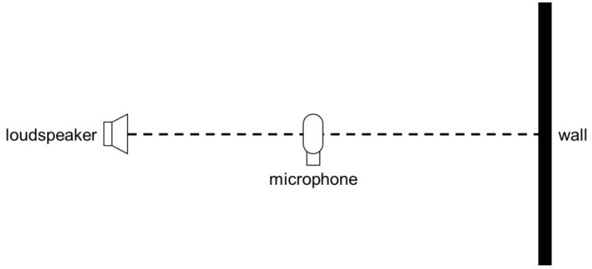
Answer: B
Distance between 2 nodes $= 0.77 \mathrm {~m}$
Wavelength = 1.54 m
$$
f = \frac { v } { \lambda } = \frac { 340 } { 1.54 } = 221 \mathrm {~Hz}
$$

33. 4 point charges are arranged at the corners of a square of side length d. The charges are as indicated on the diagram. What is the electric potential $V$ and the magnitude of the electrostatic force $F$ felt by a point charge of -1e placed at the centre of the square?
    (A) $V = 0 , F = \frac { 1 } { \sqrt { 2 } } \left( \frac { e ^ { 2 } } { \pi \varepsilon _ { 0 } d ^ { 2 } } \right)$
    (B) $V = 0 , F = \frac { e ^ { 2 } } { \pi \varepsilon _ { 0 } d ^ { 2 } }$
    (C) $V = 0 , F = 0$
    (D) $V = \frac { 1 } { \sqrt { 2 } } \left( \frac { e } { \pi \varepsilon _ { 0 } d } \right) , F = 0$

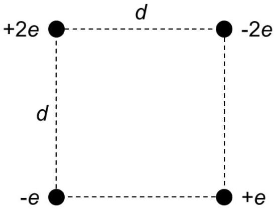

(E) $V = \frac { 1 } { \sqrt { 2 } } \left( \frac { e } { \pi \varepsilon _ { 0 } d } \right) , F = \frac { 1 } { \sqrt { 2 } } \left( \frac { e ^ { 2 } } { \pi \varepsilon _ { 0 } d ^ { 2 } } \right)$

Answer: A
Due to symmetry of the setup, $\mathrm { V } = 0$ and F is non zero. (guess from either A or B , A more likely correct because of Pythagoras theorem/45°)

Alternatively,

$$
\begin{aligned}
& \left| F _ { + } \right| = \frac { ( e ) ( 2 e ) } { 4 \pi \varepsilon _ { 0 } \frac { d ^ { 2 } } { 2 } } - \frac { ( e ) ( e ) } { 4 \pi \varepsilon _ { 0 } \frac { d ^ { 2 } } { 2 } } = \frac { e ^ { 2 } } { 2 \pi \varepsilon _ { 0 } d ^ { 2 } } \text { towards } + 2 e \text { charge } \\
& \left| F _ { - } \right| = \frac { ( e ) ( 2 e ) } { 4 \pi \varepsilon _ { 0 } \frac { d ^ { 2 } } { 2 } } - \frac { ( e ) ( e ) } { 4 \pi \varepsilon _ { 0 } \frac { d ^ { 2 } } { 2 } } = \frac { e ^ { 2 } } { 2 \pi \varepsilon _ { 0 } d ^ { 2 } } \text { towards } - e \text { charge } \\
& F = \left( \frac { e ^ { 2 } } { 2 \pi \varepsilon _ { 0 } d ^ { 2 } } \cos 45 ^ { \circ } \right) \times 2 = \frac { e ^ { 2 } } { \sqrt { 2 } \pi \varepsilon _ { 0 } d ^ { 2 } } \text { to the left }
\end{aligned}
$$

Due to symmetry of the setup, $V = 0$.

34. An ion of neon-20, ${ } _ { 10 } ^ { 20 } \mathrm { Ne } ^ { + }$(mass 20.0 u) and an ion of neon-22, ${ } _ { 10 } ^ { 22 } \mathrm { Ne } ^ { + }$(mass 22.0 u), each with a charge of $+ 1.60 \times 10 ^ { - 19 } \mathrm { C }$, enter perpendicularly into a rectangular region with a magnetic field of 2.00 T directed out of the page as shown in the diagram below. The ions enter at the same point and have the same initial velocity of $2.0 \times 10 ^ { 5 } \mathrm {~ms} ^ { - 1 }$. The ions are deflected by the magnetic field and impact a detector as shown. What is the distance between their impact points on the detector?
    (A) 2.08 mm
    (B) 4.15 mm
    (C) 8.30 mm
    (D) 20.8 mm
    (E) 41.5 mm

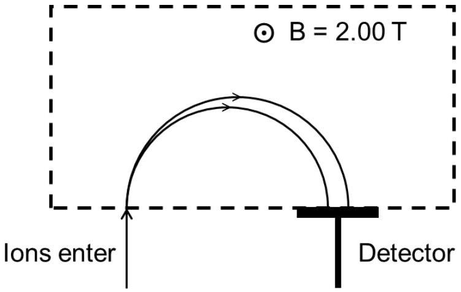

Answer: B

$$
\begin{aligned}
& r = \frac { m v } { q B } \\
& \Delta r = \frac { ( \Delta m ) v } { q B } = \frac { \left( 2 \times 1.66 \times 10 ^ { - 27 } \right) \left( 2 \times 10 ^ { 5 } \right) } { 1.6 \times 10 ^ { - 19 } \times 2.00 } = 2.075 \times 10 ^ { - 3 } \mathrm {~m}
\end{aligned}
$$

The distance is $2 \Delta r = 4.15 \mathrm {~mm}$

35. A capacitor is initially charged to charge $Q$, voltage $V$ (i.e. the potential difference across its terminals is $V )$. The energy stored in the capacitor is initially $E$. It discharges through an inductor such that finally, the voltage is half the original i.e. $V / 2$. The final charge and energy stored in the capacitor is
$\_\_\_\_$, $\_\_\_\_$ respectively.
    (A) $Q , E$
    (B) $Q , E / 2$
    (C) $Q / 2 , E / 2$
    (D) $Q / 4 , E / 2$
    (E) $Q / 2 , E / 4$

Answer: E

By definition $Q = C V$ and Energy $\propto C V ^ { 2 }$ or QV

36. A black box consists of a battery with EMF less than 12 volts and a resistor connected in series with the two ends of the circuit sticking out of the black box. If the ends of the black box are connected to a power supply of 12V, the current flowing through is 5A. If the connection to the black box is reversed, the current flowing through is 3A. What will be the current flowing through if the ends of the black box are connected by a wire?
    (A) 1.0A
    (B) 1.5A
    (C) 2.0A
    (D) 2.4A
    (E) 4.0A

Answer: A
Let the black box battery have voltage V and resistor have resistance R. When connected to the power supply and current flowing through is 5A, the direction of the power supply is the same as the battery, since the current is greater than when the box is reversed. So we have $12 + V = 5 R$. When the box is reversed, we have $12 - V = 3 R$. Solving we get $\mathrm { V } = \mathrm { R } = 3$. Thus when shorted the current flowing is $\mathrm { V } / \mathrm { R } = 1.0 \mathrm {~A}$.
Note: there is another solution for current, but EMF greater than 12V

37. Two resistors when connected in series have a combined resistance of $100 \Omega$. When the same 2 resistors are connected in parallel they have a combined resistance of $16 \Omega$. What is the difference in their resistance?
    (A) $42 \Omega$
    (B) $60 \Omega$
    (C) $68 \Omega$
    (D) $82 \Omega$
    (E) $84 \Omega$

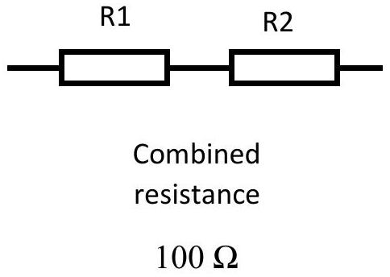
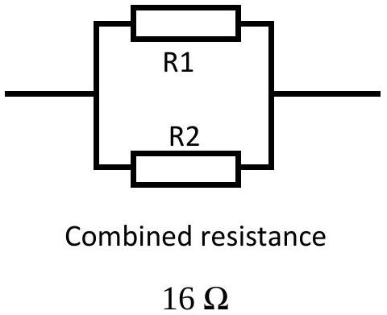

Answer: B
Suppose the resistors have resistance $R _ { 1 }$ and $R _ { 2 }$. Then in series, we have $R _ { 1 } + R _ { 2 } = 100$ (1) and in parallel, we have $\frac { 1 } { 1 / R _ { 1 } + 1 / R _ { 2 } } = 16 = \frac { R _ { 1 } R _ { 2 } } { R _ { 1 } + R _ { 2 } }$ (2). Multiplying (1) and (2) we have $R _ { 1 } R _ { 2 } = 1600$ (3). Taking (1) $\wedge 2 - 4 ( 3 )$, we have $\left( R _ { 1 } - R _ { 2 } \right) ^ { 2 } = R _ { 1 } ^ { 2 } + R _ { 2 } ^ { 2 } - 2 R _ { 1 } R _ { 2 } = 10000 - 4 \times 1600 = 3600$. Thus $\left| R _ { 1 } - R _ { 2 } \right| = 60$.

38. A 9.0 V battery with internal resistance of $18 \Omega$ and a 2.5 V battery with $0.50 \Omega$ internal resistance are available. We would like to choose only one of the batteries for heating up a resistor. What is the maximum electrical power which either of the batteries can supply to a resistor?
    (A) 2.3 W
    (B) 3.1 W
    (C) 4.5 W
    (D) 9.0 W
    (E) 13 W

Answer: B
Best compromise between voltage and current delivered and hence maximum power is when internal resistance equals the external resistance. In which case the voltage across the resistor will be $\frac { 1 } { 2 }$ the EMF. (If you know this fine, otherwise to prove you need calculus see below)

Calculating for the 9V battery $P = \frac { 4.5 ^ { 2 } } { 18 } = 1.125 W$
Calculating for the 2.5V battery $P = \frac { 1.25 ^ { 2 } } { 0.5 } = 3.125 W$
Note: 1) This is actually a comparison of a typical 9 V battery (non rechargeable) and 2 AA rechargeable batteries. They occupy about the same volume but have very different voltage, maximum current and maximum power.
2) It is also interesting to note that maximum power implies 50\% efficiency. Historically, some physicists thought that this meant that electricity will not catch on due to the "inefficiency"
3) internal resistance r, external resistance R, calculate power to external resistance is IV

$$
P = \left( \frac { V } { r + R } \right) \left( \frac { R } { r + R } V \right) = \frac { R } { ( r + R ) ^ { 2 } } V ^ { 2 }
$$

Differentiating

$$
\frac { d P } { d R } = \left( \frac { - 2 R } { ( r + R ) ^ { 3 } } + \frac { 1 } { ( r + R ) ^ { 2 } } \right) V ^ { 2 } = \frac { r - R } { ( r + R ) ^ { 3 } } V ^ { 2 }
$$

and equating to $0 , \mathrm { r } = \mathrm { R }$, may differentiate again to prove this is max, but we can also guess it is from the shape of the P versus R curve.

39. The following graph shows the I-V characteristics of the 2 nonlinear resistors A and B. If A and B are connected in series to an ideal 6 V DC source, what is the current flowing in the circuit?
    (A) 11 A
    (B) 7 A
    (C) 4 A
    (D) 3 A
    (E) 2 A

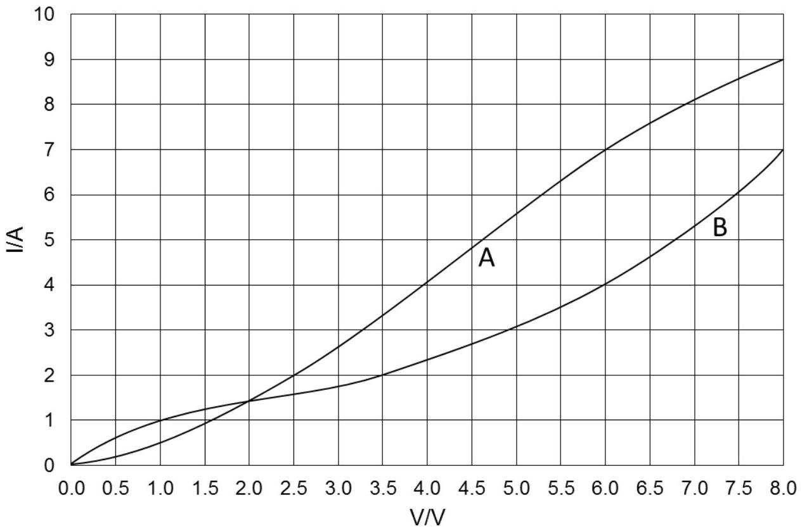

Answer: E
When $\mathrm { I } = 2 \mathrm {~A}$, the p.d. across A is 2.5 V and the p.d. across B is 3.5 V. Hence, only with 2 A current flowing through A and B connected in series will the p.d. across the 2 resistors be 6 V.

40. The circuits below contain identical bulbs and batteries. It is known that the bulbs resistance increase with temperature. Compare the brightness of bulbs A and B in circuit 1 to the brightness of bulb A' and B' in circuit 2.
    (A) $\mathrm { A } > \mathrm { A } ^ { \prime } , \mathrm { B } > \mathrm { B }$ '
    (B) $\mathrm { A } > \mathrm { A } , \mathrm { B } < \mathrm { B }$ '
    (C) $\mathrm { A } = \mathrm { A } , \mathrm { B } < \mathrm { B }$ '
    (D) $\mathrm { A } < \mathrm { A } ^ { \prime } , \mathrm { B } = \mathrm { B }$ '

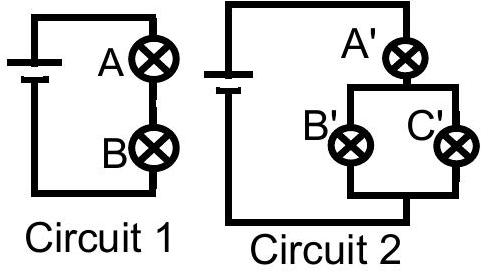

(E) $\mathrm { A } < \mathrm { A } ^ { \prime } , \mathrm { B } > \mathrm { B }$ '

Answer: E
A < A' . Current through A' is higher because B' and C' in parallel presents lower resistance than B alone so overall circuit resistance is lower and more current is drawn through battery, all of which goes through A'. More current implies brighter.

Knowing this students may guess either D or E

B' and C' presents lower resistance than B so PD across B' is lower as PD across B' + A' must add up to the same as PD across A+B and higher PD implies brighter.

Note: In terms of current, $\mathrm { B } ^ { \prime }$ has $\frac { 1 } { 2 }$ of more current and B has all of less current. So no conclusion can be reached unless we make use of the concept of potential difference.

41. Two infinitely long wires lie perpendicular to each other and carry current in the directions shown in the diagram. The amount of current carried by each wire is also indicated. What is the direction and strength of the magnetic field at point Y, located 0.05 m from each wire?
    (A) $4.0 \times 10 ^ { - 6 } \mathrm {~T}$, into paper
    (B) $4.0 \times 10 ^ { - 6 } \mathrm {~T}$, out of paper
    (C) $1.2 \times 10 ^ { - 5 } \mathrm {~T}$, into paper
    (D) $1.2 \times 10 ^ { - 5 } \mathrm {~T}$, out of paper
    (E) 0 T

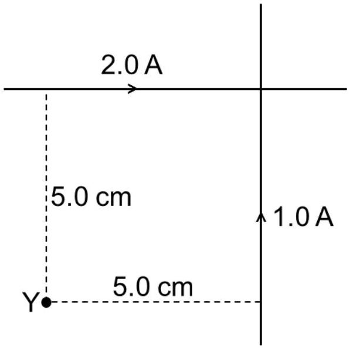

Answer: A
Since we know the size and direction of current, we can perform a vector sum of the magnetic field strength contributed by each wire. At point Y, the contribution from the 2.0 A wire points into the paper while the contribution from the 1.0 A wire points out of the paper. As point Y is equidistant from both wires, it is clear that the net magnetic field points into the paper.

$$
\begin{aligned}
& B = \frac { \mu _ { 0 } I } { 2 \pi r } \\
& B _ { n e t } = \frac { \left( 4 \pi \times 10 ^ { - 7 } \right) ( 2.0 - 1.0 ) } { 2 \pi ( 0.0500 ) } = 4.0 \times 10 ^ { - 6 } \mathrm {~T}
\end{aligned}
$$

42. A bar magnet attached to the end of a spring performs simple harmonic motion above a coil of wires as shown in the diagram. The other end of the spring is attached to a fixed force sensor which was zeroed when the magnet was at its equilibrium position. The EMF across the coil of wires and the force are plotted against time. Which of the following statement is true?
    (A) The magnitude of the EMF is maximum when the force is zero.
    (B) The magnitude of the EMF is maximum when the magnitude of the force maximum.
    (C) The magnitude of the EMF is zero when the magnitude of the force is maximum.
    (D) The magnitude of the EMF is zero when the force is zero.
    (E) The EMF also has a perfectly sinusoidal waveform.

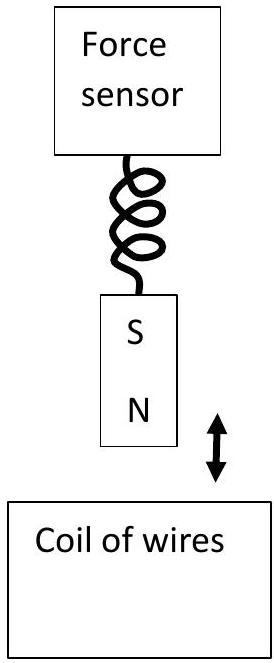
is

Answer: C
SHM: Force is maximum implies magnet speed is zero. Therefore EMF will be zero as the flux is not changing.

It may seem that if C is correct and E is correct, then A is also correct. However E is not correct due to "magnet is always above the coil" and the way magnetic field falls off with distance from the magnet. When force is zero, the coil is moving with maximum velocity. It is tempting to associate maximum rate of change of magnetic flux with maximum velocity. However by comparing two situations, when magnet is oscillating in the same way but we put the coil nearer or further from the magnet we may realise that when the magnet is nearer , the amplitude will be larger as compared to when the magnet is further. Therefore the EMF is not sinusoidal
https://www.researchgate.net/publication/228415690_A_datalogger_demonstration_of_electromagnetic_inductio n_with_a_falling_oscillating_and_swinging_magnet

43. Robert is given a tiny light source, an $f = 25 c m$ focal length lens and a screen. The light source and screen are initially at the ends of a 1m long optical rail and the lens is mounted between the light source and screen and may move freely between them. The components are all at the same fixed height above the rail and may not be removed from the 1m long rail. Robert's task is to find a way to magnify the light source and project a real image on to the screen using only the equipment given and without breaking or illegally modifying the equipment. The distance between the light source and the lens is called $u$ and the distance between the lens and the screen is called $v$. The setup constrains $u + v \leq 1 m$ . Which of the following is good advice for Robert?
    (A) Make $u$ as small as possible i.e. almost touching the lens and make $v$ as large as possible.
    (B) Make $u$ as large as possible and make $v$ as small as possible.
    (C) Make $u$ slightly larger than $f$ and adjust $v$ to get a clear image.
    (D) Make $u$ slightly smaller than $f$ and adjust $v$ to get a clear image.
    (E) Just give up.

Answer: E.
There is no way Robert can get a magnification with the given apparatus. Assuming that it is a convex lens, the only way to get a clear, real image is when $u = 50$ and $v = 50$ i.e. magnification of 1 . However Robert the Bruce (1274-1329) did give up and gained independence for Scotland.

Note: If the length of the rail was not mentioned/ distance between the object and screen is not limited, then C is the best answer.

44. Two biconvex lenses with focal lengths 15.0 cm and 10.0 cm are placed 20.0 cm apart. An object is placed 25.0 cm away from the 15.0 cm lens as shown in the diagram. What type of image is formed and what distance is it from the second lens?
    (A) Real, 6.36 cm
    (B) Virtual, 6.36 cm
    (C) Real, 13.6 cm
    (D) Real, 23.3 cm
    (E) Virtual, 23.3 cm
Answer: A
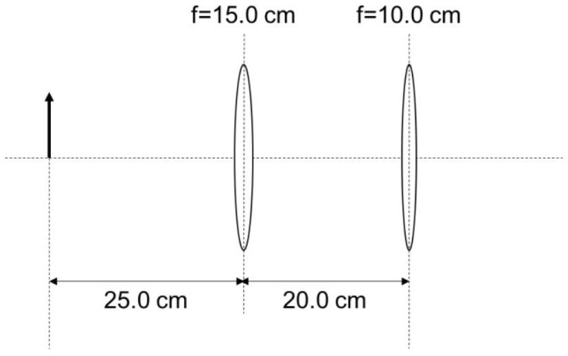
$$
\begin{aligned}
& \frac { 1 } { 25.0 } + \frac { 1 } { v } = \frac { 1 } { 15.0 } \\
& v = 37.5
\end{aligned}
$$
This places the image of the first lens $37.5 - 20.0 = 17.5 \mathrm {~cm}$ behind the second lens (if the second lens did not refract the light at all).
Hence, for the second lens, we treat it as having a virtual image 17.5 cm away:
$$
\begin{aligned}
& \frac { 1 } { - 17.5 } + \frac { 1 } { v } = \frac { 1 } { 10.0 } \\
& v = 6.36
\end{aligned}
$$
This can be verified by drawing a ray diagram.
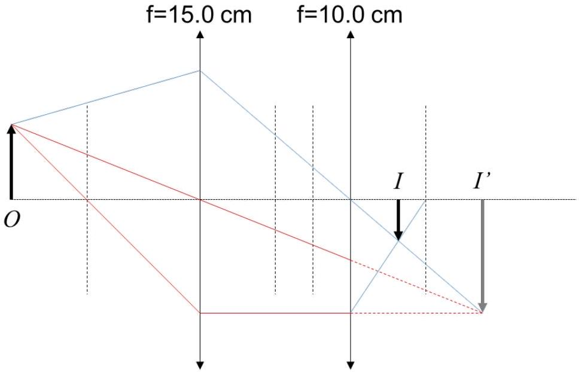

45. Two identical resistors are connected in parallel to a 120 V DC source. In this configuration, each resistor consumes 100 W of power. What is the amount of power supplied if the two resistors are connected in series to a 240 V DC source?
    (A) 25 W
    (B) 50 W
    (C) 100 W
    (D) 120 W
    (E) 200 W

Answer: E
Assuming zero internal resistance, voltage across each resistor will still be 120V. Therefore they will consume 100W each. Total is thus 200W.

46. A thin rod is travelling at a velocity of 0.800c relative to an observer. To the observer, the rod is measured to be 4.00 m long and angled 15.0° to the direction of its travel. What is the proper length of the rod?
    (A) 6.43 m
    (B) 6.46 m
    (C) 6.52 m
    (D) 6.67 m
    (E) 6.81 m

Answer: C

$$
\begin{aligned}
L _ { 0 } & = \sqrt { ( \nu L \cos \theta ) ^ { 2 } + ( L \sin \theta ) ^ { 2 } } \\
& = 4.00 \sqrt { \frac { 1 } { 1 - 0.800 ^ { 2 } } \left( \cos 15.0 ^ { \circ } \right) ^ { 2 } + \left( \sin 15.0 ^ { \circ } \right) ^ { 2 } } \\
& = 6.52 \mathrm {~m}
\end{aligned}
$$

47. A 0.020 kg white mouse leaps up steps 0.2 m at a time. Assume the mouse is a spherical blackbody with surface temperature of 303 K and density of water and takes 0.15 s to prepare for the next leap i.e takes 0.15s between landing and the next leap. Also assume that the surroundings is a black body at a temperature of 298K. For the mouse, calculate the ratio of the average power associated with the gain in potential energy in leaping up the stairs to that associated with heat loss due to radiation.
    (A) 1000:1
    (B) 100:1
    (C) 10:1
    (D) 1:1
    (E) 1:10

Answer: D

$$
\begin{gathered}
t = \sqrt { \frac { 2 s } { g } } + 0.15 = 0.35 s \\
P _ { G P E } = \frac { m g h } { t } = 0.112 \mathrm {~W} \\
V = \frac { m } { \rho } = \frac { 4 } { 3 } \pi r ^ { 3 } \\
r = \left( \frac { 3 } { 4 \pi } \frac { m } { \rho } \right) ^ { 1 / 3 } = 1.684 \mathrm {~cm} \\
P _ { r a d } = \sigma 4 \pi r ^ { 2 } \left( T _ { 1 } ^ { 4 } - T _ { 2 } ^ { 4 } \right) = 0.110 \mathrm {~W}
\end{gathered}
$$

Note:

1) Internal body temperature of mouse is much higher, but we estimate surface temperature.
2) We should not make judgements based on visual perception of surface colour.
3) What do you expect on scaling up to a human sized animal?

48. The table below gives some information about various nuclides. Based on the table, we can say that Strontium-90 in its ground state, ${ } _ { 38 } ^ { 90 } \mathrm { Sr }$ $\_\_\_\_$.
    (A) may naturally $\alpha$ decay
    (B) may naturally $\beta$ - decay
    (C) may naturally $\beta +$ decay
    (D) may naturally $\gamma$ decay
    (E) may be stable

| nuclide | Binding/A[keV] | Atomic Mass [ $\mu \mathrm { AMU }$ | Mass Excess [keV] |
| :--- | :--- | :--- | :--- |
| ${ } _ { 38 } ^ { 90 } \mathrm { Sr }$ | 8696 | 89907730 | -85949 |
| ${ } _ { 39 } ^ { 90 } Y$ | 8693 | 89907144 | -86495 |
| ${ } _ { 37 } ^ { 90 } R b$ | 8632 | 89914798 | -79365 |
| ${ } _ { 36 } ^ { 86 } \mathrm { Kr }$ | 8712 | 85910611 | -83266 |

Answer : B , general knowledge or compare total final mass(including alpha or beta particle) with initial mass. Sr has 89.90773, so final products must be less than this.

A- $\mathrm { Sr } - > \mathrm { Kr } +$ alpha $85.910611 + 4.003 = 89.91 > 89.9077$ impossible
B- Sr-> Y + electron $89.907144 + 0.0005 = 89.907644$ possible
C- Sr->Rb + positron 89.914798 ... impossible
D- Not possible
E- Since B is the answer, E is not

49. It is possible to fuse two nuclei of deuterium, ${ } _ { 1 } ^ { 2 } H$ together to produce helium-3, a neutron and some energy i.e. ${ } _ { 2 } ^ { 3 } \mathrm { He } + n ^ { 0 } + 3.27 \mathrm { MeV }$. Consider the situation where a deuteron with 0.10 MeV kinetic energy fuses with a stationary deuterium nucleus. What could be the maximum kinetic energy that the neutron can have?
    (A) 0.94 MeV
    (B) 1.39 MeV
    (C) 2.45 MeV
    (D) 2.86 MeV
    (E) 3.37 MeV

Answer: D. Consider the case where they start off with no KE and momentum. By conservation of momentum, He and n have equal momentum. Since $E = p ^ { 2 } / 2 m$, n will have 3 times more energy than He, and therefore in this case than $\frac { 3 } { 4 }$ of $3.27 \mathrm { MeV } = 2.45 \mathrm { MeV }$. Intuitively when there is initial K.E, the neutron must get more than 2.45MeV (i.e D or E). It is not possible for the neutron to get all the energy so E is out.

Alternatively

To get maximum, He and neutron must be going in opposite directions in line with initial motion. Assume neutron in the same direction as the deuteron initially.

$$
\begin{gathered}
p _ { \text {initial } } = \sqrt { 2 \times 2 E _ { D } } = 0.0207 = p _ { \text {final } } = - \sqrt { 2 \times 3 E _ { H e } } + \sqrt { 2 \times E _ { n } } \\
K E _ { \text {initial } } + \frac { 3.27 } { 934 } = E _ { D } + 0.0035 = 0.00361 = K E _ { \text {final } } = E _ { H e } + E _ { n } \\
E _ { n } = E _ { \text {total } } - E _ { H e } \\
E _ { n } = E _ { \text {total } } - \frac { \left( \sqrt { 2 E _ { n } } - \sqrt { 2 \times 2 E _ { D } } \right) ^ { 2 } } { 6 } \\
6 E _ { n } = 6 E _ { \text {total } } - 2 E _ { n } + 2 \sqrt { 2 \times 2 E _ { D } } \sqrt { 2 E _ { n } } - 2 \times 2 E _ { D } \\
8 E _ { n } - 4 \sqrt { 2 } \sqrt { E _ { D } } \sqrt { E _ { n } } - \left( 6 E _ { \text {total } } - 4 E _ { D } \right) = 0 \\
E _ { n } - \frac { \sqrt { E _ { D } } } { \sqrt { 2 } } \sqrt { E _ { n } } - \left( \frac { 3 } { 4 } E _ { \text {total } } - \frac { 1 } { 2 } E _ { D } \right) = 0
\end{gathered}
$$

50. The following diagram shows the energy levels of a certain atom. Which of the following emission lines could NOT be produced solely from transitions between the energy levels?
    (A) 2490 nm
    (B) 1380 nm
    (C) 829 nm
    (D) 622 nm
    (E) 518 nm

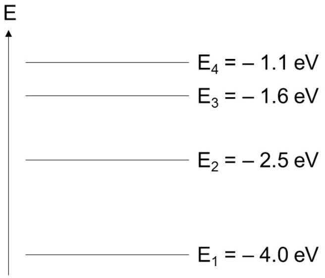
Answer D:

$$
E = \frac { h c } { \lambda } = 1240 \left( \frac { \lambda } { n m } \right) ^ { - 1 } \mathrm { eV }
$$

Option D corresponds to an energy gap of 2.0 eV which cannot be produced from these energy levels.
