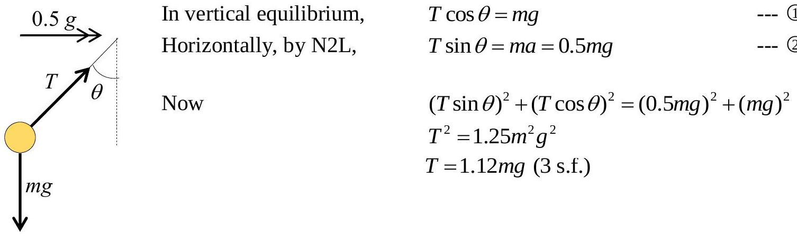
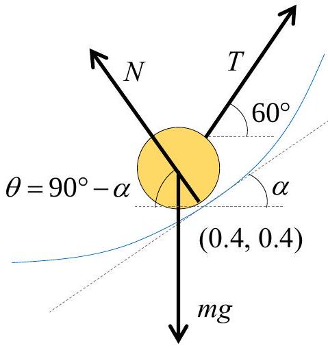
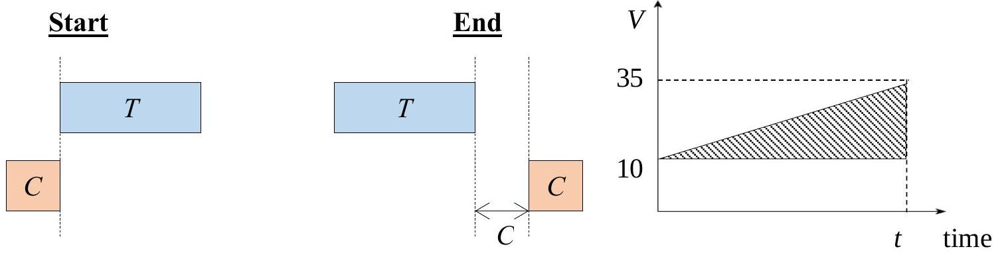
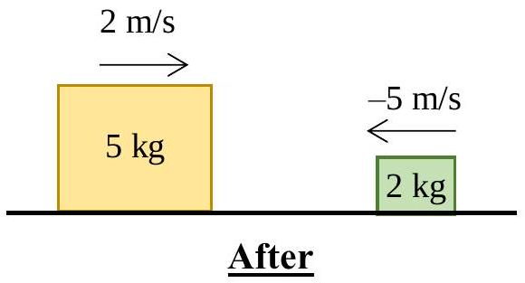
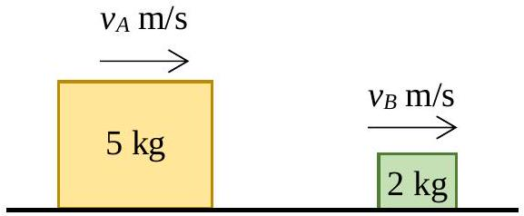
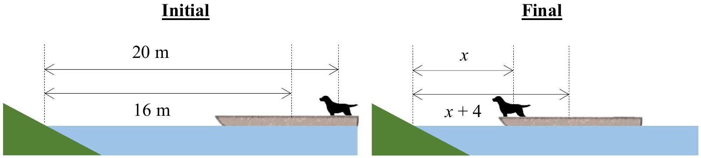
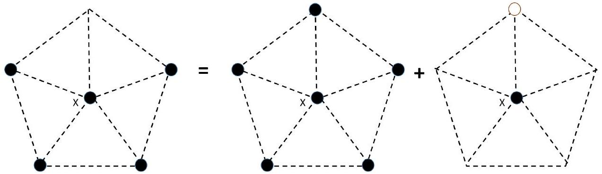
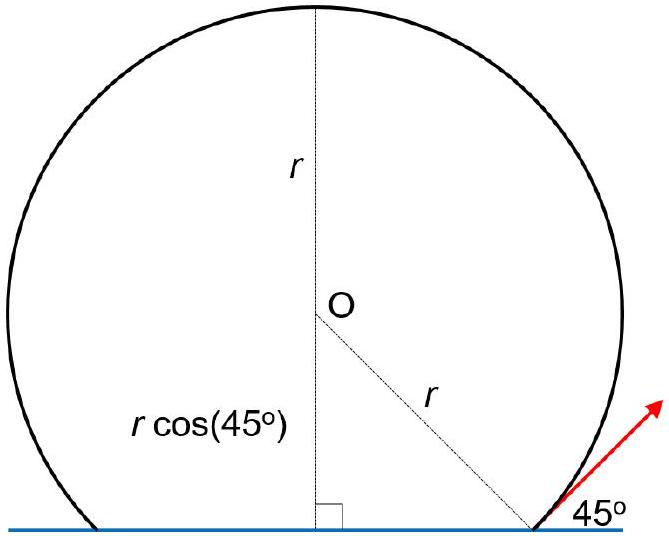
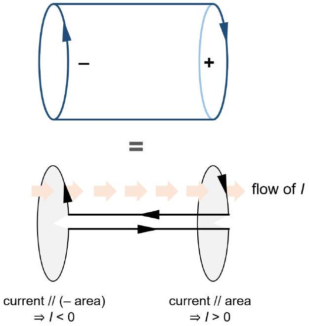

## Singapore Junior Physics Olympiad 2018 General Round

## Problem 1

Given

Using series expansion,

$$
\begin{aligned}
& V ( x ) = V _ { 0 } \left( 1 - e ^ { - \left( x - x _ { 0 } \right) / \delta } \right) ^ { 2 } - V _ { 0 } \\
& V ( x ) \approx V _ { 0 } \left( 1 - \left( 1 - \frac { x - x _ { 0 } } { \delta } \right) \right) ^ { 2 } - V _ { 0 } \\
& V ( x ) \approx \frac { V _ { 0 } } { \delta ^ { 2 } } \left( x - x _ { 0 } \right) ^ { 2 } - V _ { 0 }
\end{aligned}
$$

Consider

$$
\begin{aligned}
& \frac { 1 } { 2 } \mu \omega ^ { 2 } \left( x - x _ { 0 } \right) ^ { 2 } = \frac { V _ { 0 } } { \delta ^ { 2 } } \left( x - x _ { 0 } \right) ^ { 2 } \\
& \Rightarrow \omega ^ { 2 } = \frac { 2 V _ { 0 } } { \mu \delta ^ { 2 } } \\
& \Rightarrow 4 \pi ^ { 2 } f ^ { 2 } = \frac { 2 V _ { 0 } } { \mu \delta ^ { 2 } } \\
& \Rightarrow f = \frac { 1 } { 2 \pi } \sqrt { \frac { 2 V _ { 0 } } { \mu \delta ^ { 2 } } }
\end{aligned}
$$

Answer: D

## Problem 2

In equilibrium at terminal speed $v _ { T }$,

$$
\begin{aligned}
c v _ { T } & = m g \\
v _ { T } & = \frac { m g } { c } \\
& = \frac { \frac { 4 } { 3 } \pi r ^ { 3 } \rho g } { c } \\
& = \frac { \frac { 4 } { 3 } \pi \left( \frac { 0.1 \times 10 ^ { - 3 } } { 2 } \right) ^ { 3 } ( 1000 ) ( 9.80 ) } { 1.55 \times 10 ^ { - 6 } } \\
& = 0.0033 \mathrm {~m} / \mathrm { s } ( 2 \text { s.f. } ) \\
& = 3.3 \mathrm {~mm} / \mathrm { s }
\end{aligned}
$$

Answer: B

## Problem 3

Answer: B

## Problem 4

Static friction.
Answer: A

## Problem 5

Since

$$
\begin{aligned}
& m \left( \frac { 1 } { 2 } l + \frac { 1 } { 2 } l + 0 \right) = 3 m l _ { c m } \\
& l _ { c m } = \frac { 1 } { 3 } l
\end{aligned}
$$

Answer: C

## Problem 6

$$
\begin{align*}
& \text { To determine } \alpha \text {, at } ( 0.4,0.4 ) , \frac { \mathrm { d } y } { \mathrm {~d} x } = 5 x = 5 ( 0.4 ) = 2.0 \\
& \Rightarrow \tan \alpha = 2.0 \\
& \Rightarrow \tan \theta = \cot \alpha = \frac { 1 } { 2.0 } = 0.50 \tag{1}
\end{align*}
$$

$$
\begin{array} { l l }
\text { Observe that } & T = m _ { B } g \\
\text { In vertical equilibrium, } & T \sin 60 ^ { \circ } + N \sin \theta = m _ { A } g \\
\text { In horizontal equilibrium, } & T \cos 60 ^ { \circ } = N \cos \theta \tag{4}
\end{array}
$$

Solving,

$$
\begin{aligned}
& m _ { B } \sin 60 ^ { \circ } + m _ { B } \cos 60 ^ { \circ } \tan \theta = m _ { A } \\
& \Rightarrow m _ { B } = 3.58 \mathrm {~kg} \text { ( } 3 \text { s.f.) }
\end{aligned}
$$

Answer: C

## Problem 7

When it is about to slip, static friction $f _ { s } = \mu _ { s } N$
In vertical equilibrium, $N = m g$
Since static friction provides centripetal force, $m a _ { c } = \mu _ { s } N$

$$
\Rightarrow m a _ { c } = \frac { 1 } { 4 } m g \Rightarrow a _ { c } = \frac { g } { 4 }
$$

Answer: E

## Problem 8

Note that

$$
\omega = \frac { 2 \pi } { T } = \frac { 2 \pi } { 24 \times 3600 }
$$

Since gravitational force provides the centripetal force,
We have

$$
\begin{aligned}
& \frac { G M _ { E } m } { r ^ { 2 } } = m r \omega ^ { 2 } \\
& r = \sqrt [ 3 ] { \frac { G M _ { E } } { \omega ^ { 2 } } } = 4.21 \times 10 ^ { 7 } \mathrm {~m} \text { (3 s.f.) }
\end{aligned}
$$

Now

$$
\frac { r - R _ { E } } { R _ { E } } = 5.6 \approx 6 \text { (1 s.f.) }
$$

Answer: D

## Problem 9

Given

$$
I _ { \text {sphere } } = \frac { 2 } { 5 } M a ^ { 2 }
$$

Then

$$
I _ { \text {octant } } = \frac { 2 } { 5 } m a ^ { 2 }
$$

Answer: B

## Problem 10

Position should first increase at an increasing rate. Then it will increase at a constant rate.
Answer: E

## Problem 11

Let $T$ and $C$ be the lengths of the trailer and car respectively

Since $2 C + T =$ shaded area

$$
\begin{aligned}
& 2 ( 3.5 ) + 15.0 = \frac { 1 } { 2 } ( 25 ) ( t ) \\
& t = 1.76 \mathrm {~s}
\end{aligned}
$$

Answer: B

## Problem 12

Horizontally,

$$
\begin{equation*}
T \sin \theta = 600 \cos 60 ^ { \circ } \tag{1}
\end{equation*}
$$

Vertically,

$$
\begin{equation*}
T \cos \theta + 600 \sin 60 ^ { \circ } = 1600 \tag{2}
\end{equation*}
$$

Solving ① and ②,

$$
T = 1121 \mathrm {~N}
$$

Answer: A

## Problem 13

Using

$$
\begin{aligned}
& v = u + a t \\
& 120 = 70 + 6000 t \\
& \Rightarrow t = \frac { 1 } { 120 } \mathrm {~h} = 30 \mathrm {~s}
\end{aligned}
$$

Answer: A

## Problem 14

Before

relative speed of approach $= 2 + 5 = 7 \mathrm {~m} / \mathrm { s }$

relative speed of separation $= v _ { B } - v _ { A }$

Given

$$
\begin{align*}
& e = 0.5 \\
& \frac { v _ { B } - v _ { A } } { 7 } = 0.5 \\
& v _ { B } - v _ { A } = 3.5 \tag{1}
\end{align*}
$$

By conservation of linear momentum,

$$
\begin{equation*}
5 v _ { A } + 2 v _ { B } = 0 \tag{2}
\end{equation*}
$$

Solving ① and ②,

$$
v _ { A } = - 1 \mathrm {~m} / \mathrm { s } \text { and } v _ { B } = 2.5 \mathrm {~m} / \mathrm { s }
$$

Answer: E

Problem 15
Let $x = \frac { t } { T } \quad \Rightarrow \mathrm {~d} x = \frac { 1 } { T } \mathrm {~d} t$

$$
\Rightarrow \left\{ \begin{array} { l }
t = 0 \Rightarrow x = 0 \\
t = t _ { 0 } \Rightarrow x = \frac { t _ { 0 } } { T } = 1
\end{array} \right.
$$

$$
\begin{aligned}
\text { Now impulse } = \int _ { 0 } ^ { t _ { 0 } } F \mathrm {~d} t & = F _ { 0 } \int _ { 0 } ^ { t _ { 0 } } \frac { t } { T } e ^ { - \frac { t } { T } } \mathrm {~d} t \\
& = F _ { 0 } T \int _ { 0 } ^ { t _ { 0 } / T } x e ^ { - x } \mathrm {~d} x \\
& = F _ { 0 } T \left( 1 - \left( 1 + \frac { t _ { 0 } } { T } \right) e ^ { - \frac { t _ { 0 } } { T } } \right) \\
& = F _ { 0 } \left( T \left( 1 - \frac { 1 } { e } \right) - t _ { 0 } \left( \frac { 1 } { e } \right) \right)
\end{aligned}
$$

Answer: E

## Problem 16

Simply $a = \frac { v - u } { t } = \frac { 0 - 6 } { 48 - 30 } = - 0.33 \mathrm {~m} / \mathrm { s } ^ { 2 }$ (2 s.f.)
Answer: E

## Problem 17

displacement = area under graph $= \frac { 1 } { 2 } ( 48 ) ( 6 ) = 144 \mathrm {~m}$
Answer: C

## Problem 18

Let the speed at $B$ be $v \mathrm {~ms} ^ { - 1 }$
Comparing $A$ and $B$, by conservation of energy, $\quad \frac { 1 } { 2 } m u ^ { 2 } - \frac { 1 } { 2 } m ( 2.0 ) ^ { 2 } = m g ( 5 )$

$$
u = 10.1 \mathrm {~m} / \mathrm { s }
$$

Vertically,

$$
\begin{aligned}
& 10 = u _ { y } t + \frac { 1 } { 2 } g t ^ { 2 } \\
& 10 = \left( 10.1 \sin 30 ^ { \circ } \right) t + \frac { 1 } { 2 } ( 9.80 ) t ^ { 2 } \\
& 4.90 t ^ { 2 } + 5.05 t - 10 = 0
\end{aligned}
$$

Solving

$$
t = \frac { - 5.05 \pm \sqrt { 5.05 ^ { 2 } - 4 ( 4.90 ) ( - 10 ) } } { 2 ( 4.90 ) } = 1.0034 \mathrm {~s}
$$

Horizontally,

$$
\begin{aligned}
d = u _ { x } t & = \left( 10.1 \cos 30 ^ { \circ } \right) ( 1.0034 ) \\
& = 8.78 \mathrm {~m}
\end{aligned}
$$

Answer: C

## Problem 19

By conservation of energy,

$$
\begin{aligned}
& m g h = \frac { 1 } { 2 } k x ^ { 2 } \\
& 120 ( 9.80 ) ( 43 ) = \frac { 1 } { 2 } ( 330 ) x ^ { 2 } \\
& x = 17.5 \mathrm {~m}
\end{aligned}
$$

∴ unstretched length $= 43 - 17.5 = 25.5 \mathrm {~m}$
Answer: C

## Problem 20

Now

$$
\begin{aligned}
& m _ { d } ( 20 ) + m _ { b } ( 16 ) = m _ { d } ( x ) + m _ { b } \left( x _ { d } + 4 \right) \\
& 200 + 640 = 10 x + ( 40 x + 160 ) \\
& \Rightarrow x = \frac { 680 } { 50 } = 13.6 \mathrm {~m}
\end{aligned}
$$

Answer: B

## Problem 21

Experience with experiments tells us that a pendulum with length $L \approx 1 \mathrm {~m}$ has a period of oscillation $T \approx 2 \mathrm {~s}$. This can easily be verified via the equations of motion: using the small amplitude approximation, the period of oscillation is $T = 2 \pi \sqrt { L / g }$, and the length of the given pendulum is $L = 0.994 \mathrm {~m}$. However, this pendulum travels 2 m in one oscillation, such that the oscillation amplitude is $A = 0.5 \mathrm {~m}$. The angular amplitude is therefore $\theta _ { 0 } = A / L \approx 1 / 2 \mathrm { rad } \approx$ 30°. This means that when the oscillation amplitude is $A = 1 \mathrm {~m}$ (corresponding to a distance travelled of 4 m per oscillation), the small amplitude approximation is no longer accurate as the angular amplitude is $\theta _ { 0 } \approx 60 ^ { \circ } \approx 1 \mathrm { rad }$.
(To verify, simply check that $\theta _ { 0 } - \sin \theta _ { 0 } \approx 1 - \sqrt { 3 } / 2$ is not small.)
Therefore, the oscillation of the pendulum is no longer simple harmonic when $A = 1 \mathrm {~m}$. The period of oscillation then increases with amplitude, causing the period of oscillation to be slightly greater than 2.000 s.

Answer: B
Follow-up: How much greater will the amplitude of oscillation be? The exact period of a simple pendulum is $T = 4 K \left( \sin \left( \theta _ { 0 } / 2 \right) \right) \sqrt { L / g }$ where $K$ is the complete elliptic integral of the first kind. Solving for $L$ when $A = \theta _ { 0 } L = 0.5 \mathrm {~m}$ and $T = 2.000 \mathrm {~s}$ gives $L = 0.8385 \mathrm {~m}$. When $A = 1 \mathrm {~m}$, the period of oscillation becomes 2.234 s , which is a non-trivial difference!

## Problem 22

Ignoring radiative losses, the acceleration of the electron is given by

$$
\begin{gathered}
a = \frac { e E } { m _ { e } } \\
\Longrightarrow a _ { \max } = \frac { e E _ { \max } } { m _ { e } } = 1.756 \times 10 ^ { 15 } \mathrm {~m} \mathrm {~s} ^ { - 2 } .
\end{gathered}
$$

Assuming that $E$ varies sinusoidally, the electron exhibits simple harmonic motion, and the amplitude $x _ { \text {max } }$ is given by

$$
\begin{aligned}
x _ { \max } & = \frac { a _ { \max } } { \omega ^ { 2 } } \text { where } \omega \text { is the angular frequency of oscillation } \\
& = \frac { 1.756 \times 10 ^ { 15 } \mathrm {~m} \mathrm {~s} ^ { - 2 } } { \left( 2 \pi \times 10 ^ { 9 } \mathrm {~Hz} \right) ^ { 2 } } \\
& = 44.49 \mu \mathrm {~m}
\end{aligned}
$$

In one complete oscillation, the electron travels four times the length of the amplitude, so distance travelled $= 4 x _ { \text {max } } = 180 \mu \mathrm {~m}$.

Answer: E
Follow-up: Why can we assume that radiative losses are negligible?
We can compare the average kinetic energy of the electron and the energy radiated by the electron in one period of oscillation. The average kinetic energy is $\langle K \rangle = K _ { \text {max } } / 2 = m _ { e } a _ { \text {max } } ^ { 2 } / 2 \omega ^ { 2 }$. The maximum power radiated is given by the Larmor formula $P = 2 e ^ { 2 } a _ { \text {max } } ^ { 2 } / 3 c ^ { 3 }$. The energy radiated by the electron over one period of oscillation is at most $E = 2 \pi P / \omega = 4 \pi e ^ { 2 } a _ { \max } ^ { 2 } / 3 \omega c ^ { 3 }$. Comparing values, $\langle K \rangle / E \approx 10 ^ { 22 }$, i.e. the energy lost to radiation is negligible.

## Problem 23

By Gauss' Law, the force experienced by the electron when it is a distance $r$ away from the center of the sphere is $F = ( - e ) \left( q _ { \text {enc } } \right) / 4 \pi \varepsilon _ { 0 } r ^ { 2 }$ where $q _ { \text {enc } } = \left( r ^ { 3 } / a ^ { 3 } \right) ( + e )$ is the charged enclosed by the sphere of radius $r$. Then,

$$
F = - \frac { e ^ { 2 } } { 4 \pi \varepsilon _ { 0 } a ^ { 3 } } r .
$$

This is the equation for simple harmonic motion, with angular frequency

$$
\omega = \sqrt { \frac { e ^ { 2 } } { 4 \pi \varepsilon _ { 0 } a ^ { 3 } } \frac { 1 } { m _ { e } } } .
$$

The electron oscillates simple harmonically about the center of the sphere. The electron returns to its original position after a time $T = 2 \pi / \omega$. For the electron to just reach the center of the sphere, the electron only traverses a quarter of a cycle, taking time $T / 4 = \pi / 2 \omega$.
Evaluating, the time taken is $3.8 \times 10 ^ { - 17 } \mathrm {~s}$. Recall that $1 \mathrm { fs } = 10 ^ { - 15 } \mathrm {~s}$.
Answer: A

## Problem 24

This is not the equation of a simple harmonic oscillator, which generally takes the form of a single sinusoid. There is no way to rewrite $y = 2.0 \cos ( 3.5 t ) \sin ( 3.7 t )$ as a single sinusoid.
Answer: D
Follow-up: Using calculus, it is immediately apparent that this is not a simple harmonic oscillator, as such oscillators must satisfy $\ddot { y } = - \omega ^ { 2 } y$ for some real constant $\omega$.

## Problem 25

We can re-write this simple harmonic oscillator as

$$
\begin{aligned}
y & = 3.0 \cos ( 3.6 t ) \sin ( 3.6 t ) \\
& = 1.5 \sin ( 7.2 t ) , \text { using the double angle formula. }
\end{aligned}
$$

The angular frequency of this oscillator is $\omega = 7.2 \mathrm { rad } \mathrm { s } ^ { - 1 }$, so the frequency is $\omega / 2 \pi = 1.1 \mathrm {~Hz}$.
Answer: C

## Overview of Waves

A wave is, in general, described by the general form $y = f ( k x - \omega t )$ where $k$ is the wavenumber, $\lambda = 2 \pi / | k |$ is the wavelength, $\omega$ is the angular frequency, and $T = 2 \pi / | \omega |$ is the period of oscillation. The phase velocity of the wave is $v = | \omega / k | = \lambda / T$.
We often see waves where the function $f$ is a sinusoid. We say that $k x - \omega t$ is the phase at a given position and time. Then the coefficient of $x$ is the wavenumber and the coefficient of $t$ is the angular frequency, such that a point on the wave has the same phase as another point $\lambda$ away, and the oscillations at a given position have period $T$. Recall that sinusoids have period $2 \pi$, so a $2 \pi$ difference in phase does not result in a change in displacement $y$.

Note that $k$ and $\omega$ can have the same, or the opposite sign. When $\omega / k > 0$, the wave travels in the positive $x$-direction; when $\omega / k < 0$ the wave travels in the negative $x$-direction.
Waves can undergo superposition. The sum of two waves is also a wave, and the wave has two components of frequency and wavenumber, given by the $\omega$ and $k$ of each constituent wave.

## Problem 26

Here, $k = 1.5$, so $\lambda = 2 \pi / k = 4.2 \mathrm {~m}$.
Answer: E

## Problem 27

Here, $k$ and $\omega$ have opposite sign, so the wave travels in the negative $x$-direction. Note that the direction of displacement ( $y$ ) is perpendicular to the direction of propagation of the wave ( $x$ ). This is a key feature of transverse waves.
Answer: B

Problem 28 (This question had a missing equation in the competition so was ignored for marking)

Note that the equation still takes the form $y = f ( k x - \omega t )$, so this is still a wave. In fact, this wave has two components, which we can find using the reverse factor formulae.
Alternatively, we can see this wave as a series of "beats". The carrier frequency of the beat is the difference in $\omega$ divided by 2 , while the envelope frequency is the average of $\omega$. This wave is hence made up of two waves with angular frequencies $\omega _ { 1 } = 3.96$ and $\omega _ { 2 } = 3.24$. These are very similar frequencies.
Both waves have the same speed, given by $\omega / k = 3.6 / 1.6 \mathrm {~m} \mathrm {~s} ^ { - 1 } = 0.36 / 0.15 \mathrm {~m} \mathrm {~s} ^ { - 1 }$.
Answer: A

## Problem 29

This is a wave with $k = 1.5 \mathrm {~m} ^ { - 1 }$ and $\omega = - 3.6 \mathrm {~s} ^ { - 1 }$. As before, we calculate the phase velocity $\mid$ $\omega / k \mid = 3.6 / 1.5 \mathrm {~m} \mathrm {~s} ^ { - 1 } = 2.4 \mathrm {~m} \mathrm {~s} ^ { - 1 }$.

Answer: B

## Problem 30

The incoming wave has velocity $v = \lambda / T = 0.53 \mathrm {~m} \mathrm {~s} ^ { - 1 }$ and period $T = 6.4 \mathrm {~s}$. Therefore, the wavelength of the wave is $\lambda = v T = 3.392 \mathrm {~m}$.

The superposition of a wave and its reflection forms a standing wave. The inter-node distance is $\lambda / 2$ for standing waves. The distance from the wall to its nearest node is the distance from an antinode to the next node, i.e. $\lambda / 4 = 0.85 \mathrm {~m}$.
Answer: C
Follow-up: In fact, water waves are not so simple! In shallow water, we observe that the water wave travels at speed $| \omega / k |$, but in deep water, we will instead observe that the water wave travels at speed $| \omega / 2 k |$ due to a phenomenon known as dispersion.

## Problem 31

An electron in a uniform electric field experiences a constant force in a fixed direction. Just as a point mass travelling under the influence of gravity (a constant downward force) travels in a parabola, the electron also travels in a parabola.
To determine whether the electron hits the second plate, we need to calculate the amount of energy required for the electron to reach the second plate. Note that the electron has initial kinetic energy 1.5 eV and potential energy -1 eV. As the electron has initially travels at 45° to the horizontal, the electron has $\cos ^ { 2 } \left( 45 ^ { \circ } \right) = 1 / 2$ its kinetic energy due to motion in the horizontal direction. As the electric force is in the vertical direction, the electron's horizontal velocity is unchanged. Hence, its minimum kinetic energy is 0.75 eV.
The energy of the electron must be at least $( 0 + 0.75 ) = 0.75 \mathrm { eV }$ for it to hit the second plate. However, the electron only has initial kinetic energy 0.5 eV. Therefore, the electron does not hit the second plate, instead returning to the plate where it started.

Answer: A

## Problem 32

Even though the proton travels upwards, it experiences a downward force due to gravity. It also experiences a downward electric force. The net force acting on the proton is then $m g + q E =$ $1.6 \times 10 ^ { - 26 } \mathrm {~N}$ downwards.

Answer: E
Follow-up: The forces are tiny, and are unlikely to be measurable in reality.

## Problem 33

First, we can neglect the gravitational force between P and Q because gravity is generally weak relative to electromagnetism.

We can only tell that P \& Q are like charges because they repel. We cannot conclude that they are both positively charged.

By Newton's 3rd Law, we know that the electric force acting on P must always be equal and opposite to the electric force acting on Q (since they are an action-reaction pair). If the mass on P is equal to the mass on Q, the angles $a$ and $b$ must be equal even if the charge on P is very different from the charge on Q since the forces acting on P and Q are the same despite the disparity in charge.

Hence, P and Q must have different masses. Intuitively, P must have a smaller mass relative to Q. (Consider the case where Q is infinitely massive. Then the angle $b$ is zero, smaller than $a$.) This can also be shown via a detailed force balance analysis.

Answer: C

## Problem 34

By the principle of superposition, we can calculate the force on the proton at X via a sum of simpler configurations.

The first configuration leads to a net force of zero.
The second configuration (with a negative charge $- e$ above X) leads to an upwards force of magnitude $e ^ { 2 } / 4 \pi \varepsilon _ { 0 } r ^ { 2 } = 2.3 \times 10 ^ { - 10 } \mathrm {~N}$, where $r = 1 \mathrm {~nm}$.

Answer: A
Follow-up: The electrostatic forces are tiny, but the gravitational forces will be even smaller.

## Problem 35

The electric force is a conservative force, so there is an associated potential at every point in space. Electrical potential energy is therefore path-independent and velocity-independent.
The potential energy is not simply the difference in forces acting on the proton, however; it is the work done by an external force on the sixth proton as it is brought to the center of the pentagon from infinity without a change in kinetic energy, and this work is clearly non-zero.

From the principle of superposition, the energy of this sixth proton is the sum of the five interaction energies with each of the other protons.

Answer: D

## Problem 36

At the distance of closest approach, both protons have zero speed. By the conservation of energy,

$$
\begin{aligned}
\text { initial total energy } & = \text { total energy at closest approach } \\
2 \times \frac { 1 } { 2 } m _ { p } u ^ { 2 } + 0 & = 0 + \frac { e ^ { 2 } } { 4 \pi \varepsilon _ { 0 } r } .
\end{aligned}
$$

Hence,

$$
r = \frac { e ^ { 2 } } { 4 \pi \varepsilon _ { 0 } m _ { p } u ^ { 2 } }
$$

i.e. $r = 1.5 \times 10 ^ { - 12 } \mathrm {~m}$.
Answer: B

## Problem 37

At the distance of closest approach, both protons must have the same speed. By the conservation of momentum,
initial total momentum = momentum at any point in time

$$
\begin{aligned}
m _ { p } u & = m _ { p } u _ { 1 } + m _ { p } u _ { 2 } \text { where } u _ { 1 } , u _ { 2 } \text { are the velocities of the protons } \\
u & = u _ { 1 } + u _ { 2 } .
\end{aligned}
$$

Therefore, at the distance of closest approach, $u _ { 1 } = u _ { 2 } = u / 2$.
By the conservation of energy,
initial total energy = total energy at closest approach

$$
\frac { 1 } { 2 } m _ { p } u ^ { 2 } + 0 = 2 \times \frac { 1 } { 2 } m _ { p } \left( \frac { u } { 2 } \right) ^ { 2 } + \frac { e ^ { 2 } } { 4 \pi \varepsilon _ { 0 } r } .
$$

Hence,

$$
r = \frac { e ^ { 2 } } { \pi \varepsilon _ { 0 } m _ { p } u ^ { 2 } } ,
$$

i.e. $r = 1.5 \times 10 ^ { - 12 } \mathrm {~m}$.
Answer: B
Follow-up (1): Why must both protons have the same speed at the distance of closest approach? If the protons have different speeds, then each proton has a non-zero speed relative to the other. At that instant in time, therefore, the relative distance between the protons is changing. When the protons are at closest approach, however, the relative distance between the protons is momentarily not changing. This can only occur if the protons have zero relative speed, i.e. if they have the same speed in the lab's frame of reference.
Follow-up (2): This problem is, in fact, identical to problem 36. The frame of problem 37 moves at a velocity of $3 \times 10 ^ { 6 } \mathrm {~m} \mathrm {~s} ^ { - 1 }$ relative to the frame of problem 36. Lengths are unchanged, so the distance of closest approach is unchanged as well.

## Problem 38

In this scenario, we say that the impact parameter $b = 10 \mu \mathrm {~m}$. Note that the mass of the proton is $\approx 1836$ times the mass of the electron, so the motion of the proton is negligible. (This does not mean that the speed of the electron is constant by the conservation of momentum, however. On the contrary, the proton is able to "absorb" relatively large changes in the speed of the electron with negligible changes in the proton's speed. This does mean that we can ignore the kinetic energy of the proton, since $K = p ^ { 2 } / 2 m$ is small for large $m$.)
Let $r _ { \perp }$ be the distance of the electron from the proton normal to the velocity of the electron, and let $v$ be the velocity of the electron. The electrostatic force is a central force, so angular momentum is conserved:

$$
\begin{aligned}
\text { initial angular momentum } & = \text { angular momentum at any other time } \\
m _ { e } b u & = m _ { e } r _ { \perp } v .
\end{aligned}
$$

Let $r$ be the absolute distance of the electron from the proton. By the conservation of energy,

$$
\begin{aligned}
& \text { initial total energy } = \text { energy at any other time } \\
& \qquad \frac { 1 } { 2 } m _ { e } u ^ { 2 } + 0 = \frac { 1 } { 2 } m _ { e } v ^ { 2 } - \frac { e ^ { 2 } } { 4 \pi \varepsilon _ { 0 } r } .
\end{aligned}
$$

At the distance of closest approach, the velocity of the election is normal to the line connecting the electron and the proton, such that the radial component of velocity is zero. This means that $r _ { \perp } = r$. Solving,

$$
\frac { 1 } { 2 } m _ { e } \left( u ^ { 2 } - \left( \frac { b u } { r } \right) ^ { 2 } \right) = - \frac { e ^ { 2 } } { 4 \pi \varepsilon _ { 0 } r } ,
$$

i.e. $r = 10 \mu \mathrm {~m}$. (note that the electrostatic force is negligible given the parameters but in general they should get closer than without the electrostatic force)
Answer: C

## Problem 39

The electron moves counterclockwise in the uniform magnetic field. As the magnetic force is perpendicular to the electron's velocity, the magnetic force does no work on the electron. Hence, the sum of kinetic energy and gravitational potential energy remains constant.

As a result, the kinetic energy of the electron is lower in the upper half of the circular path than in the lower half. Hence, the velocity of the electron is lower in the upper half of the circular path than in the lower half. From Newton's Second Law, $m v ^ { 2 } / r = q v B _ { 0 }$, so $r \propto v$. The radius of curvature of the electron's trajectory is smaller in the upper half than in the lower half. In the upper half of the trajectory, the electron is moving to the left, whereas in the lower half of the trajectory, the electron is moving to the right. Hence, the circular path of the electron drifts rightward, and the electron will be displaced to the right.

Answer: B

## Problem 40

For circular motion in a magnetic field, Newton's Second Law gives

$$
\begin{aligned}
m \frac { v ^ { 2 } } { r } & = q v B \\
r & = \frac { m v } { q B } .
\end{aligned}
$$

Using $\frac { 1 } { 2 } m v ^ { 2 } = 2.4 \times 10 ^ { - 17 } \mathrm {~J}$, we get $r = 41.33 \mu \mathrm {~m}$.
By geometry, the maximum distance achieved is $r ( 1 + 1 / \sqrt { 2 } ) = 0.071 \mathrm {~mm}$.
Answer: D

## Problem 41

When $I = 20 \mathrm {~mA}$, the potential difference across the two LEDs is $2 \times \left( I \times R _ { \mathrm { LED } } + V _ { \mathrm { th } } \right) = 4.4 \mathrm {~V}$. Then, the potential difference across the resistor $R$ is $6.0 - 4.4 = 1.6 \mathrm {~V}$. Using Ohm's Law, $R = V / I = 80 \Omega$.
Answer: E

## Problem 42

When the two bulbs are connected in series to 240 V, each bulb has a potential difference of 120 V . As this is within the rated voltage, the bulb draws 12 W of power. As $P = I V$, the current through one bulb is $12 / 120 = 0.10 \mathrm {~A}$. By Kirchoff's current law, the current in the circuit is also 0.10 A.

Answer: D

## Problem 43

The terminal pd of the battery is $V = \mathcal { E } - I r = 1.6125 \mathrm {~V}$. The resistance of the wire is $R = V / I = 6.45 \Omega$. The resistivity $\rho$ is given by $\rho = R A / l = R \pi d ^ { 2 } / 4 l = 9.1 \times 10 ^ { - 6 } \Omega \mathrm {~m}$.
Answer: D

## Problem 44

Recall that the impedances of a capacitor, resistor and inductor are $1 / \omega C , R$ and $\omega L$ respectively.
The current amplitude $I _ { 0 }$ depends on the voltage amplitude $V _ { 0 }$ via $I _ { 0 } = V _ { 0 } / Z$. Since $V _ { 0 } = 1.0 \mathrm {~V}$ and $I _ { 0 } = 1.0 \mathrm {~V}$ in all three one-component setups, we have $1 / \omega C = R = \omega L = 1.0 \Omega$.
When connected in series, the total impedance is $Z = \sqrt { R ^ { 2 } + ( \omega L - 1 / \omega C ) ^ { 2 } } = 1.0 \Omega$. Therefore, the current amplitude is $1.0 \mathrm {~V} / Z = 1.0 \mathrm {~A}$.

Answer: C

## Problem 45

We define areas consistently using the right hand rule. The terminals of the battery can be considered as one area, such that the orientations of the positive and negative terminals are opposite to each other's.

Therefore, the electric current $I$ through the negative terminal alone has a different sign as that through the positive terminal. This current is, by Ohm's Law, $| I | = V / R = 1 \mathrm {~A}$. Note that the current through the positive terminal is defined to be positive based on the options provided, so we orient our areas accordingly. Correspondingly, the current through the negative terminal is negative.

The amount of charge leaving the battery is the same as the amount of charge entering the battery, so the current through the surface of the battery is 0 . This is an expression of the conservation of charge for a steady-state circuit.

Answer: A

## Problem 46

Magnetic fields are concentrated in ferromagnetic materials, so O has the strongest magnetic flux density. N and S, by symmetry, have equal magnetic flux density, higher than the magnetic

flux density outside the magnet at P and Q. R has the smallest magnetic flux density as it is closest to the lateral surface of the magnet. Note that choices B and D are the same.
Answer: C

## Problem 47

Let $J$ be the heat flux through the heat conductor, generated by the heat p ump. Let $I$ be the current passing through the heat pump. Then, at steady state, the heat flux generated by the heat pump must balance two other sources of heat flux in the opposite direction:

- conduction due to the temperature difference between the hot and cold sides, given by Fourier's law; and
- heat dissipated via Joule heating. This heat is dissipated within the heat pump, so the heat pump must remove resistive heat as well. For simplicity, we can think of resistive heat being generated within the conductor. Then, the heat pump must also remove this excess heat from the conductor at the same rate as it is generated to preserve steady-state conditions in the conductor.

Combining Fourier's law with Joule heating, $J = k A \frac { T _ { \text {hot } } - T _ { \text {cold } } } { d } + I ^ { 2 } R$.
The power available to the heat pump is $P = I V _ { \text {pump } } = I ( V - I R )$. The amount of heat flux generated by the heat pump is then given by the coefficient of performance of the heat pump. By definition, $\mathrm { COP } = J / P$.
Classically, $\mathrm { COP } = \frac { Q _ { \text {hot } } } { W } = \frac { Q _ { \text {hot } } } { Q _ { \text {hot } } - Q _ { \text {cold } } }$. The maximum possible coefficient of performance is given by the Carnot efficiency COP $= \frac { T _ { \text {hot } } } { T _ { \text {hot } } - T _ { \text {cold } } }$.
Therefore,

$$
\begin{gathered}
\frac { T _ { \mathrm { hot } } } { T _ { \mathrm { hot } } - T _ { \mathrm { cold } } } \left( I V - I ^ { 2 } R \right) = k A \frac { T _ { \mathrm { hot } } - T _ { \mathrm { cold } } } { d } + I ^ { 2 } R \\
\Longrightarrow \frac { k A } { d } \left( T _ { \mathrm { hot } } - T _ { \mathrm { cold } } \right) ^ { 2 } + I ^ { 2 } R \left( T _ { \mathrm { hot } } - T _ { \mathrm { cold } } \right) - T _ { \mathrm { hot } } \left( I V - I ^ { 2 } R \right) = 0 .
\end{gathered}
$$

This is a quadratic equation in $T _ { \text {hot } } - T _ { \text {cold } }$. We can solve for the temperature difference in terms of the current, before seeking to maximize the temperature difference. Note that $T _ { \text {hot } } - T _ { \text {cold } }$ must, by definition, be positive, so we select the positive solution.

$$
T _ { \mathrm { hot } } - T _ { \mathrm { cold } } = \frac { I ^ { 2 } R d } { 2 k A } \left( \sqrt { 1 + 4 \frac { k A T _ { \mathrm { hot } } } { d } \frac { I V - I ^ { 2 } R } { I ^ { 4 } R ^ { 2 } } } - 1 \right)
$$

Motivated by the maximum power transfer theorem, we guess that

$$
I = \frac { V } { 2 R }
$$

since this is the current which maximizes the power transferred to the pump. We then obtain $T _ { \text {hot } } - T _ { \text {cold } } = 86.6 \mathrm {~K}$. Therefore, options A to D are definitely attainable.

Option E appears to be too large, and we can verify this by re-writing the quadratic equation in $T _ { \text {hot } } - T _ { \text {cold } }$ as a quadratic equation in $I$ instead, before substituting the value $T _ { \text {hot } } - T _ { \text {cold } } =$ 160 K. In particular,

$$
\left( 2 T _ { \mathrm { hot } } - T _ { \mathrm { cold } } \right) R I ^ { 2 } - T _ { \mathrm { hot } } V I + \frac { k A } { d } \left( T _ { \mathrm { hot } } - T _ { \mathrm { cold } } \right) ^ { 2 } = 0 .
$$

A simple check shows that the determinant is negative, and there is no solution for $I$ which will generate a 160 K temperature difference.
Hence, the maximum attainable temperature difference is approximately 80 K.
Answer: D
Follow-up: The maximum value of the expression for $T _ { \text {hot } } - T _ { \text {cold } }$ is in fact 89.0 K , attained when $I = 2.40 \mathrm {~A}$. Note that the optimal current is less than the current which delivers maximum power to the heat pump because current also contributes to Joule heating, in turn reducing the efficacy of the r efrigerator. Alternatively, we can find the maximum value of $T _ { \mathrm { h } \text { ot } } - T _ { \text {cold } }$ which gives a non-negative determinant in the quadratic equation for $I$. We find that the determinant becomes zero when $T _ { \text {hot } } - T _ { \text {cold } } = 89.0 \mathrm {~K}$, agreeing with our previous result.

## Problem 48

Answer: A

## Problem 49

We know $\Delta U = Q + W$ where $Q =$ heat transferred to the system and $W =$ work done on the system. Since it is a refrigerator, the cycle goes as (i)->(ii) ->(iii)->(iv) -> (i).
In processes (i) and (iii), $\Delta U = 0$ as there is no change in temperature. In (i), $W > 0$ so $Q < 0$; correspondingly, $Q > 0$ in (iii).
In processes (ii) and (iii), $W = 0$ as there is no change in volume. In (ii), $\Delta U < 0$ as the temperature has fallen, so $Q < 0$; correspondingly, $Q > 0$ in (iv).
Heat flows out of the gas when $Q < 0$.
Answer: E

## Problem 50

All three of the Gold Bars could be the original Gold Bar.
After the first measurement, we know that the true mass of the Gold B ar lies in the range [0.993, 1.003] kg.
Gold Bar a has true mass in the range [0.986, 0.996] kg, Gold Bar b has true mass in the range [0.997, 1.007] kg, and Gold Bar c has true mass in the range [1.000, 1.010] kg. All three Gold Bars have mass ranges that overlap with the original mass range, so it is possible for any of the three Gold Bars to be the original one.

Answer: E
